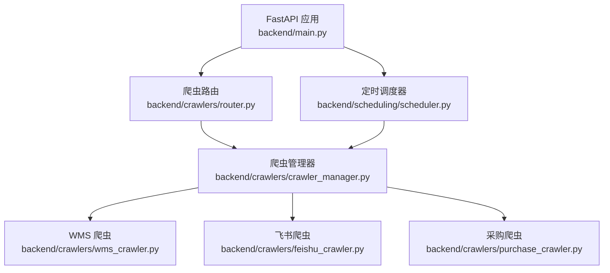
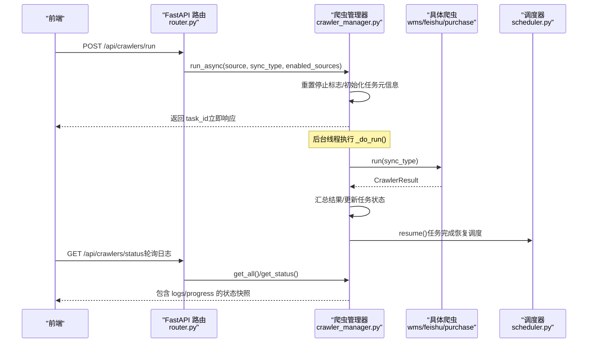
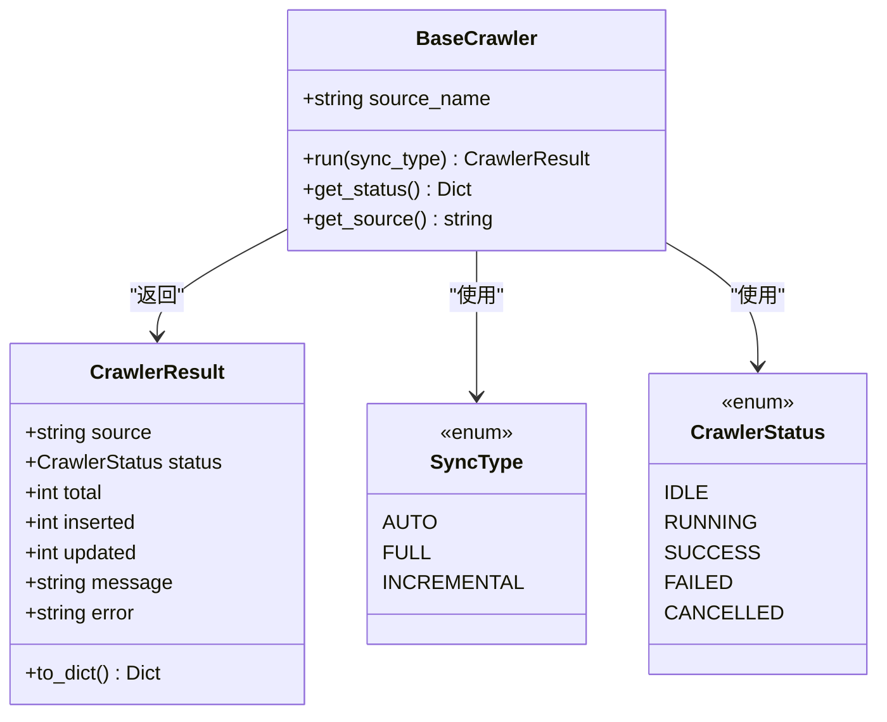
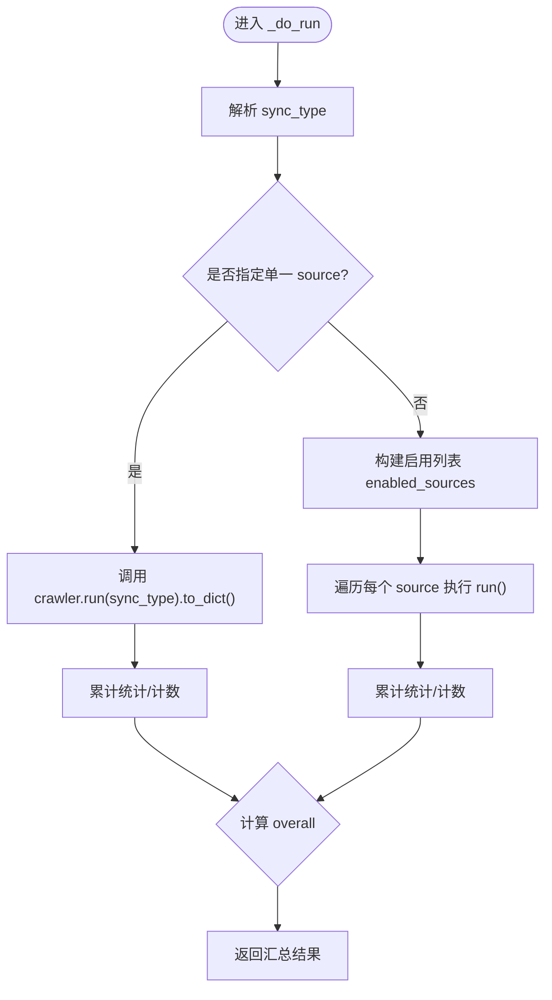
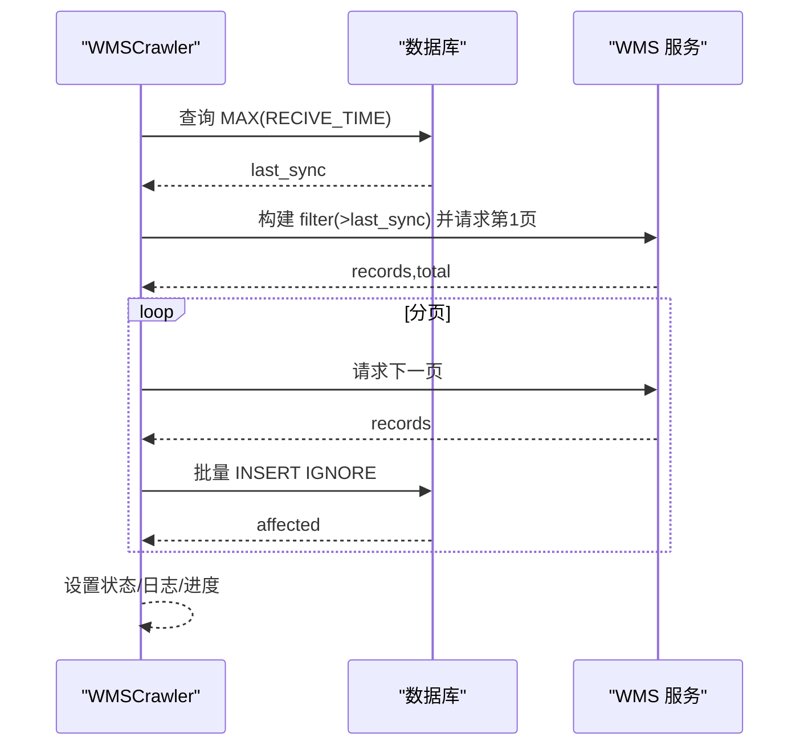
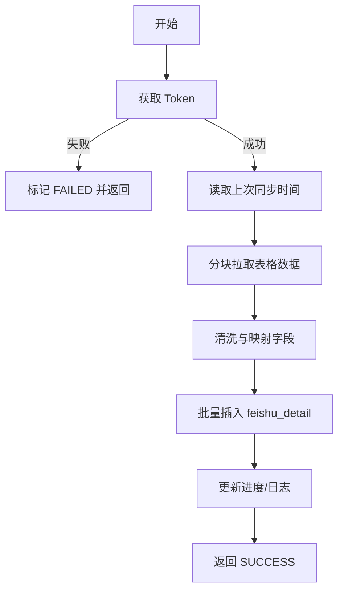
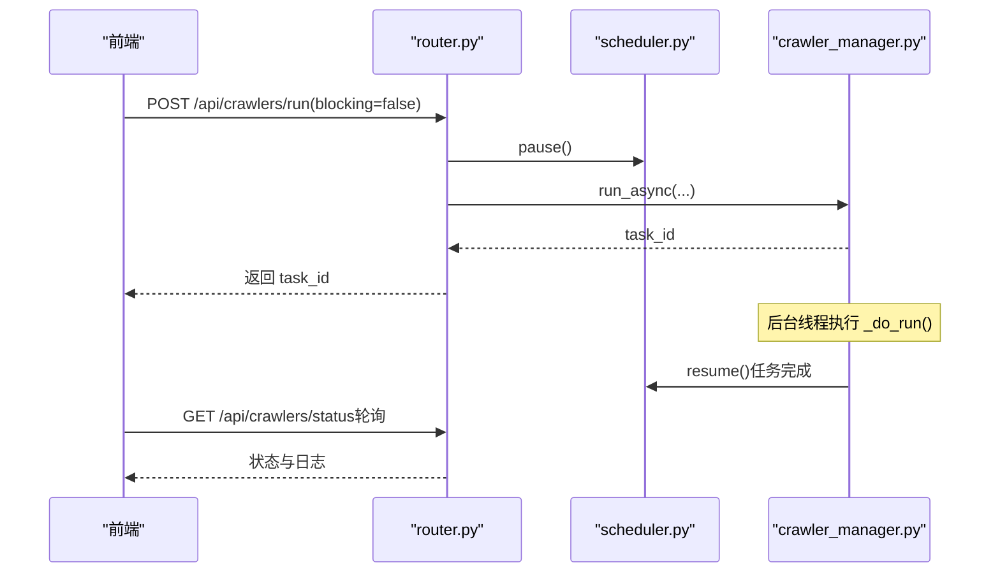
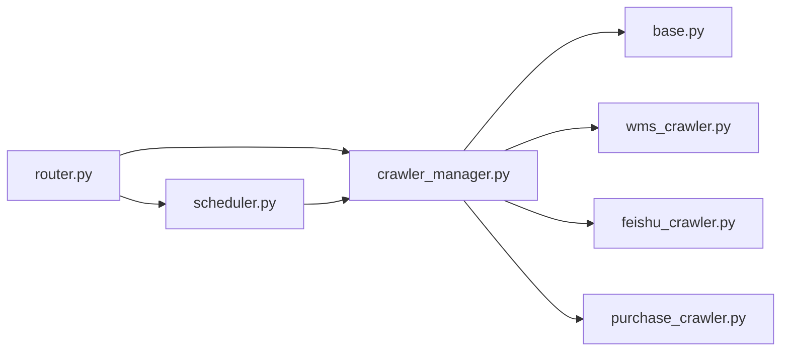

# 爬虫架构设计

<cite>
**本文引用的文件**
- [backend/crawlers/base.py](file://backend/crawlers/base.py)
- [backend/crawlers/crawler_manager.py](file://backend/crawlers/crawler_manager.py)
- [backend/crawlers/router.py](file://backend/crawlers/router.py)
- [backend/scheduling/scheduler.py](file://backend/scheduling/scheduler.py)
- [backend/main.py](file://backend/main.py)
- [backend/crawlers/wms_crawler.py](file://backend/crawlers/wms_crawler.py)
- [backend/crawlers/feishu_crawler.py](file://backend/crawlers/feishu_crawler.py)
- [backend/crawlers/purchase_crawler.py](file://backend/crawlers/purchase_crawler.py)
</cite>

## 目录
1. [简介](#简介)
2. [项目结构](#项目结构)
3. [核心组件](#核心组件)
4. [架构总览](#架构总览)
5. [详细组件分析](#详细组件分析)
6. [依赖关系分析](#依赖关系分析)
7. [性能与并发特性](#性能与并发特性)
8. [故障排查指南](#故障排查指南)
9. [结论](#结论)
10. [附录：扩展新爬虫最佳实践](#附录：扩展新爬虫最佳实践)

## 简介
本仓库实现了一个可扩展、可调度、支持多数据源的爬虫系统。其核心设计围绕以下目标展开：
- 统一抽象：通过 BaseCrawler 定义统一的接口、状态管理与结果封装，屏蔽不同数据源差异。
- 集中管理：CrawlerManager 负责爬虫实例的注册、调度、生命周期与并发控制。
- 异步执行：提供同步阻塞与后台线程异步两种模式，便于前端实时日志与轮询。
- 任务队列：基于内存任务元信息记录任务运行态，配合路由层暴露查询接口。
- 同步类型：支持自动（AUTO）、全量（FULL）、增量（INCREMENTAL）三种同步策略。
- 定时调度：SchedulerService 在后台按配置周期执行增量同步，避免与手动触发冲突。

## 项目结构
后端以 FastAPI 为 Web 框架，爬虫相关代码集中在 backend/crawlers 目录；调度器位于 backend/scheduling；主应用入口在 backend/main.py。

**图表来源**
- [backend/main.py:18-83](file://backend/main.py#L18-L83)
- [backend/crawlers/router.py:1-225](file://backend/crawlers/router.py#L1-L225)
- [backend/crawlers/crawler_manager.py:1-305](file://backend/crawlers/crawler_manager.py#L1-L305)
- [backend/scheduling/scheduler.py:1-196](file://backend/scheduling/scheduler.py#L1-L196)

**章节来源**
- [backend/main.py:18-83](file://backend/main.py#L18-L83)
- [backend/crawlers/router.py:1-225](file://backend/crawlers/router.py#L1-L225)
- [backend/crawlers/crawler_manager.py:1-305](file://backend/crawlers/crawler_manager.py#L1-L305)
- [backend/scheduling/scheduler.py:1-196](file://backend/scheduling/scheduler.py#L1-L196)

## 核心组件
- BaseCrawler 抽象基类：定义 run、get_status、get_source 等统一接口，以及 SyncType、CrawlerStatus、CrawlerResult 等核心枚举与数据结构。
- CrawlerManager：维护爬虫实例字典、任务元信息、停止标志；提供同步/异步执行、状态查询、停止控制等方法。
- 具体爬虫实现：WMSCrawler、FeishuCrawler、PurchaseCrawler 继承 BaseCrawler，实现各自的数据获取、清洗与入库逻辑。
- Router：暴露 HTTP API，处理请求参数、调用管理器、协调调度器暂停/恢复。
- SchedulerService：后台线程循环读取配置，按间隔执行增量同步，避免与手动任务冲突。

**章节来源**
- [backend/crawlers/base.py:12-67](file://backend/crawlers/base.py#L12-L67)
- [backend/crawlers/crawler_manager.py:22-305](file://backend/crawlers/crawler_manager.py#L22-L305)
- [backend/crawlers/wms_crawler.py:44-477](file://backend/crawlers/wms_crawler.py#L44-L477)
- [backend/crawlers/feishu_crawler.py:55-419](file://backend/crawlers/feishu_crawler.py#L55-L419)
- [backend/crawlers/purchase_crawler.py:12-49](file://backend/crawlers/purchase_crawler.py#L12-L49)
- [backend/crawlers/router.py:43-225](file://backend/crawlers/router.py#L43-L225)
- [backend/scheduling/scheduler.py:16-196](file://backend/scheduling/scheduler.py#L16-L196)

## 架构总览
整体采用“路由层 -> 管理器 -> 具体爬虫”的分层架构，配合后台调度器实现自动化增量同步。

**图表来源**
- [backend/crawlers/router.py:89-147](file://backend/crawlers/router.py#L89-L147)
- [backend/crawlers/crawler_manager.py:134-197](file://backend/crawlers/crawler_manager.py#L134-L197)
- [backend/crawlers/crawler_manager.py:200-301](file://backend/crawlers/crawler_manager.py#L200-L301)
- [backend/scheduling/scheduler.py:155-184](file://backend/scheduling/scheduler.py#L155-L184)

## 详细组件分析

### BaseCrawler 抽象基类与结果模型
- 统一接口
  - run(sync_type): 执行爬取并返回 CrawlerResult。
  - get_status(): 返回当前状态、进度、日志与最近一次结果。
  - get_source(): 返回数据源名称。
- 同步类型
  - AUTO: 自动识别（数据库为空则全量，否则增量）。
  - FULL: 全量同步（通常先清空表再拉取）。
  - INCREMENTAL: 增量同步（基于时间戳或唯一键过滤）。
- 状态枚举
  - IDLE、RUNNING、SUCCESS、FAILED、CANCELLED。
- 结果对象
  - source、status、total、inserted、updated、message、error，并提供 to_dict() 用于序列化。

**图表来源**
- [backend/crawlers/base.py:12-67](file://backend/crawlers/base.py#L12-L67)

**章节来源**
- [backend/crawlers/base.py:12-67](file://backend/crawlers/base.py#L12-L67)

### CrawlerManager 管理器模式
- 职责
  - 注册爬虫实例：_init_crawlers() 中集中注册 wms、feishu、purchase。
  - 任务管理：维护 _tasks 字典，记录 task_id、running、start_time、end_time、result、status 等。
  - 生命周期控制：request_stop/reset_stop_flag/is_any_running/stop_source。
  - 执行入口：run（同步阻塞）、run_async（后台线程非阻塞）、_do_run（内部核心）。
- 并发与停止
  - 全局停止标志 _stop_requested 与各爬虫实例的 _stop_requested 协同，确保优雅退出。
  - 异步任务完成后恢复调度器，避免手动触发后调度器永久暂停。
- 聚合结果
  - 单源或多源执行时汇总 total/inserted/updated，计算 overall 状态（success/partial/failed）。

**图表来源**
- [backend/crawlers/crawler_manager.py:200-301](file://backend/crawlers/crawler_manager.py#L200-L301)

**章节来源**
- [backend/crawlers/crawler_manager.py:22-305](file://backend/crawlers/crawler_manager.py#L22-L305)

### 具体爬虫实现要点

#### WMSCrawler
- 增量同步：通过构造服务端 filter 数组传入 RECIVE_TIME > last_time，由服务端直接返回增量数据。
- 全量同步：TRUNCATE 目标表后再拉取。
- 分页与重试：requests.Session 复用连接，指数退避重试网络异常。
- 日志与进度：每页写入共享日志与进度，供前端轮询。
- 时间处理：UTC 与北京时间转换，保证 API 过滤条件与数据库存储一致。

**图表来源**
- [backend/crawlers/wms_crawler.py:313-467](file://backend/crawlers/wms_crawler.py#L313-L467)

**章节来源**
- [backend/crawlers/wms_crawler.py:44-477](file://backend/crawlers/wms_crawler.py#L44-L477)

#### FeishuCrawler
- 数据源：飞书表格 v2 API，分块读取避免大小限制。
- 增量同步：读取 feishu_detail 表最大 RECIVE_TIME，仅处理大于该时间的行。
- 数据清洗：规范化数值、日期、仓库名称等字段。
- 批量入库：按批次插入，减少数据库交互次数。

**图表来源**
- [backend/crawlers/feishu_crawler.py:251-399](file://backend/crawlers/feishu_crawler.py#L251-L399)

**章节来源**
- [backend/crawlers/feishu_crawler.py:55-419](file://backend/crawlers/feishu_crawler.py#L55-L419)

#### PurchaseCrawler
- 占位实现：尚未接入采购系统 API，返回 FAILED 并提示管理员配置。
- 扩展参考：遵循 BaseCrawler 接口，后续只需实现 run/get_status 即可接入管理器。

**章节来源**
- [backend/crawlers/purchase_crawler.py:12-49](file://backend/crawlers/purchase_crawler.py#L12-L49)

### 路由层与调度器协作
- 路由层
  - /api/crawlers/run：解析请求参数，选择同步或异步执行；异步模式下暂停调度器，任务完成后恢复。
  - /api/crawlers/status：返回所有爬虫状态（含 logs/progress）与配置。
  - /api/crawlers/start_scheduler / stop_scheduler：启停自动调度器。
  - /api/crawlers/stop：停止指定或全部爬虫任务。
- 调度器
  - 后台线程循环读取配置，按间隔执行增量同步。
  - 检测是否有爬虫正在运行，避免重复执行。
  - 支持 pause/resume/reconfigure，配合路由层与异步任务。

**图表来源**
- [backend/crawlers/router.py:89-147](file://backend/crawlers/router.py#L89-L147)
- [backend/scheduling/scheduler.py:53-65](file://backend/scheduling/scheduler.py#L53-L65)
- [backend/scheduling/scheduler.py:155-184](file://backend/scheduling/scheduler.py#L155-L184)

**章节来源**
- [backend/crawlers/router.py:43-225](file://backend/crawlers/router.py#L43-L225)
- [backend/scheduling/scheduler.py:16-196](file://backend/scheduling/scheduler.py#L16-L196)

## 依赖关系分析
- 模块耦合
  - router 依赖 crawler_manager 与 scheduler_service，解耦了业务逻辑与调度控制。
  - crawler_manager 依赖具体爬虫实现，但通过抽象基类保持松耦合。
  - scheduler_service 通过全局单例访问 crawler_manager，避免重复启动与资源竞争。
- 外部依赖
  - requests 用于 HTTP 调用（WMS、飞书）。
  - 数据库操作通过 database 模块封装（query_all、execute、execute_all）。
  - 配置与凭证通过 system.credentials 模块读取与保存。

**图表来源**
- [backend/crawlers/router.py:1-225](file://backend/crawlers/router.py#L1-L225)
- [backend/crawlers/crawler_manager.py:1-305](file://backend/crawlers/crawler_manager.py#L1-L305)
- [backend/scheduling/scheduler.py:1-196](file://backend/scheduling/scheduler.py#L1-L196)

**章节来源**
- [backend/crawlers/router.py:1-225](file://backend/crawlers/router.py#L1-L225)
- [backend/crawlers/crawler_manager.py:1-305](file://backend/crawlers/crawler_manager.py#L1-L305)
- [backend/scheduling/scheduler.py:1-196](file://backend/scheduling/scheduler.py#L1-L196)

## 性能与并发特性
- 连接复用：requests.Session 复用 TCP 连接，降低握手开销。
- 批量插入：使用 executemany + INSERT IGNORE，提升入库效率并去重。
- 重试机制：指数退避重试网络超时与连接错误，提高鲁棒性。
- 异步执行：后台线程执行爬虫任务，前端通过轮询获取实时日志。
- 调度器节流：避免与手动任务冲突，检测运行状态跳过重复执行。
- 日志缓冲：限制日志条数（如 500 行），防止内存无限增长。

[本节为通用性能讨论，不直接分析具体文件]

## 故障排查指南
- 常见问题
  - 凭证无效：检查系统设置中的授权/Token/Cookie，确认已正确配置。
  - 接口超时/连接失败：查看爬虫日志中的重试记录，适当调整超时与重试次数。
  - 增量未生效：确认数据库中存在有效 RECIVE_TIME，且时间格式与时区正确。
  - 调度器未执行：检查配置是否为 auto 模式，间隔是否合理；确认没有爬虫正在运行。
- 定位方法
  - 通过 /api/crawlers/status 查看各爬虫的 logs 与 progress。
  - 通过 /api/crawlers/task/{task_id} 查看异步任务元信息与最终结果。
  - 查看后端日志文件，关注异常堆栈与警告信息。

**章节来源**
- [backend/crawlers/wms_crawler.py:111-125](file://backend/crawlers/wms_crawler.py#L111-L125)
- [backend/crawlers/feishu_crawler.py:72-82](file://backend/crawlers/feishu_crawler.py#L72-L82)
- [backend/crawlers/router.py:80-86](file://backend/crawlers/router.py#L80-L86)

## 结论
本爬虫架构通过抽象基类统一接口、管理器集中调度、异步执行与后台调度器协作，实现了高内聚、低耦合、易扩展的多源数据采集方案。新增数据源仅需继承 BaseCrawler 并在管理器中注册，即可无缝融入现有体系。

[本节为总结性内容，不直接分析具体文件]

## 附录：扩展新爬虫最佳实践
- 步骤
  1. 新建爬虫类继承 BaseCrawler，实现 run(sync_type) 与 get_status()。
  2. 在 __init__ 中初始化状态、日志缓冲区、进度与停止标志。
  3. 在 run 中实现数据获取、清洗、入库逻辑，并持续更新日志与进度。
  4. 在 CrawlerManager._init_crawlers() 中注册新爬虫实例。
  5. 如需支持增量同步，依据数据源特性实现时间过滤或唯一键判断。
- 建议
  - 使用 requests.Session 复用连接，设置合理的超时与重试。
  - 批量入库时使用 executemany + INSERT IGNORE，减少数据库压力。
  - 日志条目限制长度，避免内存占用过大。
  - 遇到异常及时记录错误信息并返回 FAILED 状态。
  - 遵循 BaseCrawler 的接口约定，确保管理器能正确聚合结果。

**章节来源**
- [backend/crawlers/base.py:51-67](file://backend/crawlers/base.py#L51-L67)
- [backend/crawlers/crawler_manager.py:90-97](file://backend/crawlers/crawler_manager.py#L90-L97)
- [backend/crawlers/wms_crawler.py:313-467](file://backend/crawlers/wms_crawler.py#L313-L467)
- [backend/crawlers/feishu_crawler.py:251-399](file://backend/crawlers/feishu_crawler.py#L251-L399)