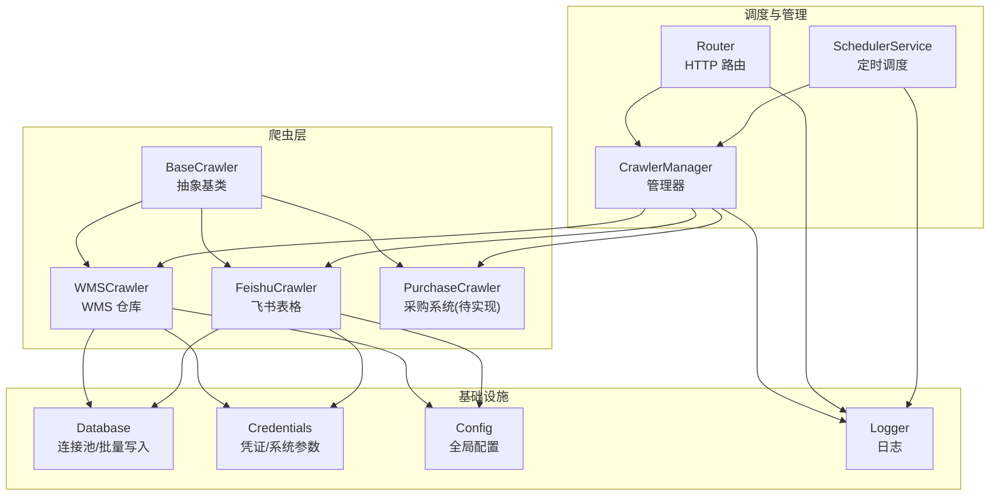
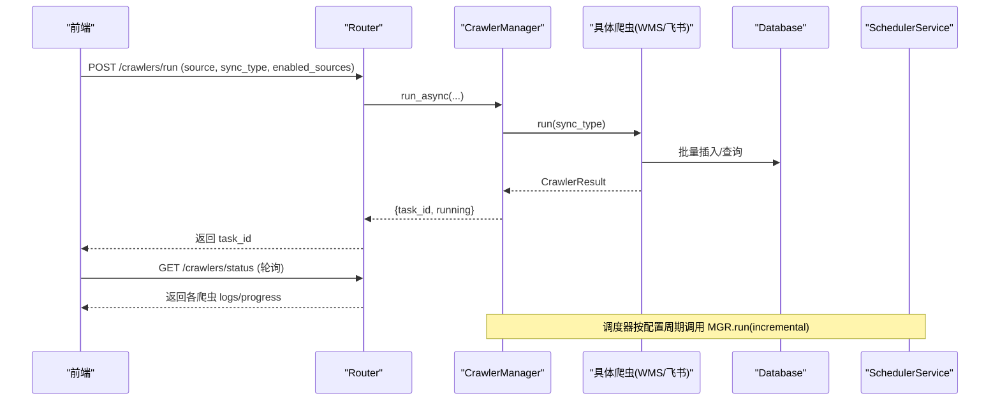
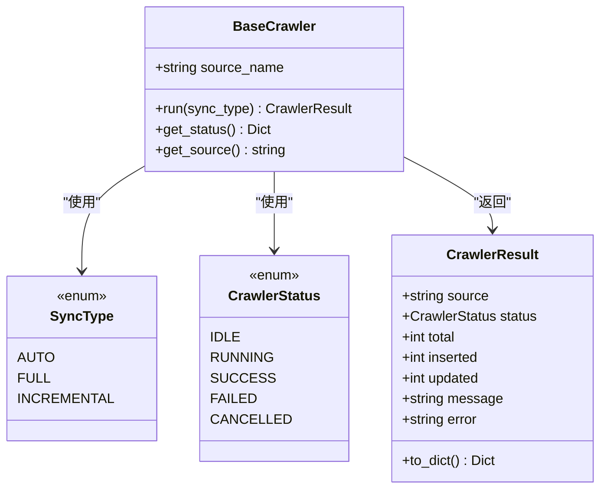
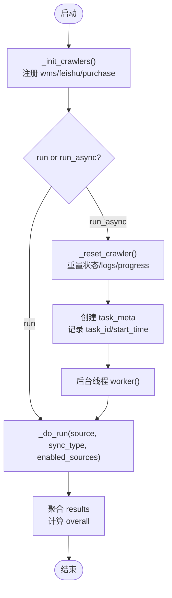
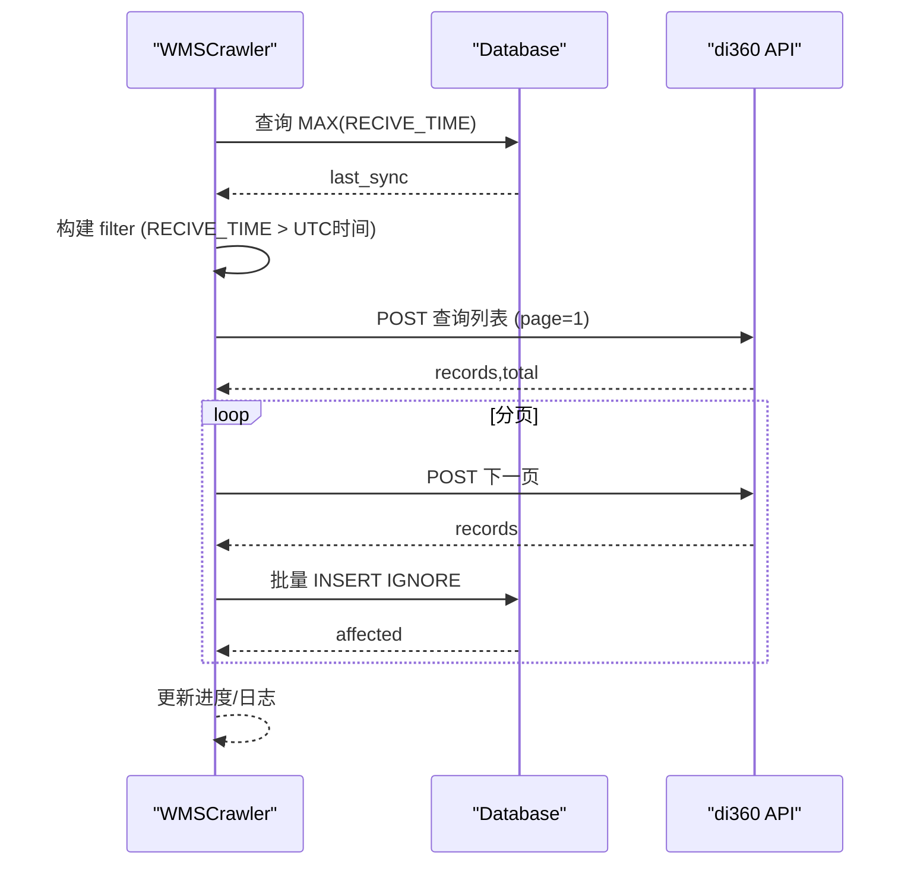
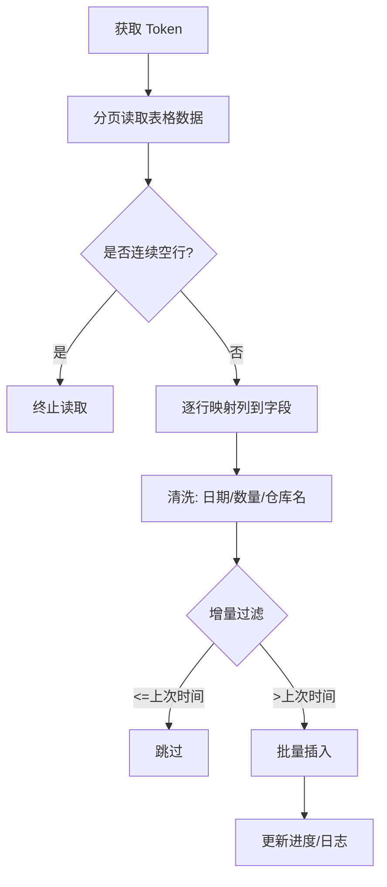
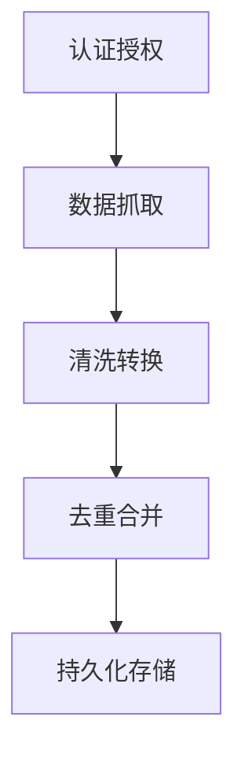
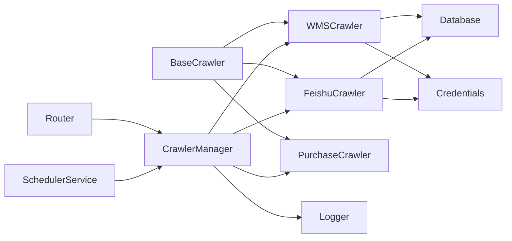

# 爬虫系统

<cite>
**本文引用的文件**
- [backend/crawlers/base.py](file://backend/crawlers/base.py)
- [backend/crawlers/crawler_manager.py](file://backend/crawlers/crawler_manager.py)
- [backend/crawlers/wms_crawler.py](file://backend/crawlers/wms_crawler.py)
- [backend/crawlers/feishu_crawler.py](file://backend/crawlers/feishu_crawler.py)
- [backend/crawlers/purchase_crawler.py](file://backend/crawlers/purchase_crawler.py)
- [backend/crawlers/router.py](file://backend/crawlers/router.py)
- [backend/system/credentials.py](file://backend/system/credentials.py)
- [backend/config.py](file://backend/config.py)
- [backend/database.py](file://backend/database.py)
- [backend/delivery/dedup_merger.py](file://backend/delivery/dedup_merger.py)
- [backend/scheduling/scheduler.py](file://backend/scheduling/scheduler.py)
- [backend/logger.py](file://backend/logger.py)
- [backend/scripts/run_crawler.py](file://backend/scripts/run_crawler.py)
</cite>

## 目录
1. [简介](#简介)
2. [项目结构](#项目结构)
3. [核心组件](#核心组件)
4. [架构总览](#架构总览)
5. [详细组件分析](#详细组件分析)
6. [依赖关系分析](#依赖关系分析)
7. [性能考量](#性能考量)
8. [故障排查指南](#故障排查指南)
9. [结论](#结论)
10. [附录](#附录)

## 简介
本爬虫系统为试制资源数智化管理系统提供多源数据采集与同步能力，涵盖 WMS（di360）仓库数据、飞书共享表格数据，以及预留的采购系统对接。系统采用“基类抽象 + 管理器调度 + 异步执行”的设计，支持自动/全量/增量三种同步模式，具备重试、日志、状态监控、配置管理、定时调度等能力，并提供统一 API 供前端实时查看任务进度与结果。

## 项目结构
爬虫子系统位于 backend/crawlers，围绕 BaseCrawler 抽象基类扩展具体数据源实现；crawler_manager 负责实例化与调度；router 暴露 HTTP 接口；system/credentials 集中管理凭证与系统参数；database 提供连接池与批量写入；scheduling 提供后台定时任务；delivery/dedup_merger 提供多源去重合并能力。

图表来源
- [backend/crawlers/base.py:51-67](file://backend/crawlers/base.py#L51-L67)
- [backend/crawlers/crawler_manager.py:22-97](file://backend/crawlers/crawler_manager.py#L22-L97)
- [backend/crawlers/wms_crawler.py:44-62](file://backend/crawlers/wms_crawler.py#L44-L62)
- [backend/crawlers/feishu_crawler.py:55-70](file://backend/crawlers/feishu_crawler.py#L55-L70)
- [backend/crawlers/purchase_crawler.py:12-22](file://backend/crawlers/purchase_crawler.py#L12-L22)
- [backend/crawlers/router.py:13-177](file://backend/crawlers/router.py#L13-L177)
- [backend/scheduling/scheduler.py:16-74](file://backend/scheduling/scheduler.py#L16-L74)
- [backend/database.py:12-43](file://backend/database.py#L12-L43)
- [backend/system/credentials.py:297-401](file://backend/system/credentials.py#L297-L401)
- [backend/config.py:48-98](file://backend/config.py#L48-L98)
- [backend/logger.py:14-38](file://backend/logger.py#L14-L38)

章节来源
- [backend/crawlers/base.py:51-67](file://backend/crawlers/base.py#L51-L67)
- [backend/crawlers/crawler_manager.py:22-97](file://backend/crawlers/crawler_manager.py#L22-L97)
- [backend/crawlers/router.py:43-177](file://backend/crawlers/router.py#L43-L177)
- [backend/scheduling/scheduler.py:16-74](file://backend/scheduling/scheduler.py#L16-L74)
- [backend/database.py:12-43](file://backend/database.py#L12-L43)
- [backend/system/credentials.py:297-401](file://backend/system/credentials.py#L297-L401)
- [backend/config.py:48-98](file://backend/config.py#L48-L98)
- [backend/logger.py:14-38](file://backend/logger.py#L14-L38)

## 核心组件
- 抽象基类：定义统一的 run/get_status 接口、同步类型枚举、结果对象，规范各数据源行为。
- 管理器：注册所有爬虫实例，提供同步/异步执行、停止控制、任务元信息跟踪、聚合统计。
- 数据源爬虫：
  - WMS：对接 di360 仓库 API，支持增量/全量、分页拉取、时间过滤、批量入库、指数退避重试。
  - 飞书：通过 v2 API 分页读取共享表，字段映射与清洗，批量入库，增量过滤。
  - 采购：占位实现，预留扩展点。
- 路由：提供配置读写、运行、状态查询、摘要、调度器启停、停止任务等 REST 接口。
- 凭证与系统参数：统一管理登录凭证、Token、Cookie、系统参数（含启用数据源、间隔等）。
- 数据库：连接池、批量写入、事务回滚保护。
- 调度器：后台线程按配置周期执行增量同步，避免与手动任务冲突。
- 日志：统一文件+控制台输出，按模块命名，便于定位问题。

章节来源
- [backend/crawlers/base.py:12-67](file://backend/crawlers/base.py#L12-L67)
- [backend/crawlers/crawler_manager.py:22-305](file://backend/crawlers/crawler_manager.py#L22-L305)
- [backend/crawlers/wms_crawler.py:44-477](file://backend/crawlers/wms_crawler.py#L44-L477)
- [backend/crawlers/feishu_crawler.py:55-419](file://backend/crawlers/feishu_crawler.py#L55-L419)
- [backend/crawlers/purchase_crawler.py:12-49](file://backend/crawlers/purchase_crawler.py#L12-L49)
- [backend/crawlers/router.py:43-225](file://backend/crawlers/router.py#L43-L225)
- [backend/system/credentials.py:297-573](file://backend/system/credentials.py#L297-L573)
- [backend/database.py:12-116](file://backend/database.py#L12-L116)
- [backend/scheduling/scheduler.py:16-196](file://backend/scheduling/scheduler.py#L16-L196)
- [backend/logger.py:14-43](file://backend/logger.py#L14-L43)

## 架构总览
系统以“基类 + 管理器”为核心，爬虫作为插件式扩展；HTTP 路由暴露统一入口；调度器在后台按配置周期触发；凭证与配置集中管理；数据库提供高并发写入能力；日志贯穿全流程。

图表来源
- [backend/crawlers/router.py:89-147](file://backend/crawlers/router.py#L89-L147)
- [backend/crawlers/crawler_manager.py:134-197](file://backend/crawlers/crawler_manager.py#L134-L197)
- [backend/crawlers/wms_crawler.py:313-467](file://backend/crawlers/wms_crawler.py#L313-L467)
- [backend/crawlers/feishu_crawler.py:251-409](file://backend/crawlers/feishu_crawler.py#L251-L409)
- [backend/scheduling/scheduler.py:155-184](file://backend/scheduling/scheduler.py#L155-L184)

## 详细组件分析

### 基类设计与同步类型
- 同步类型：auto/full/incremental，用于控制首次或历史数据的处理策略。
- 结果对象：包含来源、状态、总数、新增、更新、消息、错误等，便于统一上报。
- 抽象方法：run 与 get_status，强制各爬虫实现执行与状态查询。

图表来源
- [backend/crawlers/base.py:12-67](file://backend/crawlers/base.py#L12-L67)

章节来源
- [backend/crawlers/base.py:12-67](file://backend/crawlers/base.py#L12-L67)

### 管理器模式与异步执行机制
- 注册中心：_init_crawlers 集中注册数据源，新增只需在此登记。
- 同步/异步：run 阻塞执行；run_async 立即返回 task_id，后台线程执行，前端轮询 /status 获取日志。
- 停止控制：request_stop/stop_source 设置 _stop_requested，爬虫循环中检查并优雅退出。
- 任务追踪：记录 task_id、running、start/end_time、result、status、error。
- 聚合统计：汇总 total/inserted/updated、success_count/failed_count、overall 状态。

图表来源
- [backend/crawlers/crawler_manager.py:90-197](file://backend/crawlers/crawler_manager.py#L90-L197)
- [backend/crawlers/crawler_manager.py:200-301](file://backend/crawlers/crawler_manager.py#L200-L301)

章节来源
- [backend/crawlers/crawler_manager.py:22-305](file://backend/crawlers/crawler_manager.py#L22-L305)

### WMS 系统集成（di360）
- 认证授权：从 spider_credentials 读取 authorization/cookie，构造请求头，禁用证书校验。
- 数据抓取：构建 filter 数组（嵌套括号），传入 RECIVE_TIME > start_time_str，服务端直接返回增量数据；分页拉取，默认每页 2000 条。
- 清洗转换：RECIVE_TIME 由 UTC 转换为北京时间；数值字段规范化；空值处理。
- 去重合并：INSERT IGNORE 利用唯一键去重；后续 delivery/dedup_merger 提供多维度合并分析。
- 重试机制：网络超时/连接失败指数退避重试，最多 3 次。
- 日志与进度：每条日志带时间戳、级别、来源；进度包含当前页、总页数、已入库、已处理。

图表来源
- [backend/crawlers/wms_crawler.py:127-178](file://backend/crawlers/wms_crawler.py#L127-L178)
- [backend/crawlers/wms_crawler.py:180-213](file://backend/crawlers/wms_crawler.py#L180-L213)
- [backend/crawlers/wms_crawler.py:216-310](file://backend/crawlers/wms_crawler.py#L216-L310)
- [backend/crawlers/wms_crawler.py:313-467](file://backend/crawlers/wms_crawler.py#L313-L467)

章节来源
- [backend/crawlers/wms_crawler.py:44-477](file://backend/crawlers/wms_crawler.py#L44-L477)
- [backend/system/credentials.py:25-118](file://backend/system/credentials.py#L25-L118)
- [backend/database.py:104-116](file://backend/database.py#L104-L116)

### 飞书表格同步
- 认证授权：通过 credentials 获取 tenant_access_token，自动刷新过期 token。
- 数据抓取：v2 API 分页读取，按行范围分批拉取，避免 10MB 限制；连续空行检测提前终止。
- 清洗转换：日期多种格式解析；数量字段清理逗号；仓库名称归一化（内库/外库映射）。
- 去重合并：INSERT IGNORE 去重；增量模式下基于 RECIVE_TIME 过滤旧数据。
- 重试机制：超时/HTTP 错误指数退避重试。

图表来源
- [backend/crawlers/feishu_crawler.py:132-203](file://backend/crawlers/feishu_crawler.py#L132-L203)
- [backend/crawlers/feishu_crawler.py:205-249](file://backend/crawlers/feishu_crawler.py#L205-L249)
- [backend/crawlers/feishu_crawler.py:251-409](file://backend/crawlers/feishu_crawler.py#L251-L409)
- [backend/system/credentials.py:448-573](file://backend/system/credentials.py#L448-L573)

章节来源
- [backend/crawlers/feishu_crawler.py:55-419](file://backend/crawlers/feishu_crawler.py#L55-L419)
- [backend/system/credentials.py:448-573](file://backend/system/credentials.py#L448-L573)

### 采购系统对接（预留）
- 当前为占位实现，返回失败状态与提示，等待后续接入 API。
- 扩展方式：继承 BaseCrawler，实现 run 与 get_status，并在管理器中注册。

章节来源
- [backend/crawlers/purchase_crawler.py:12-49](file://backend/crawlers/purchase_crawler.py#L12-L49)

### 数据采集流程（认证授权 → 抓取 → 清洗 → 去重合并）
- 认证授权：WMS 读取 authorization/cookie；飞书通过 app_id/app_secret 获取 tenant_access_token。
- 数据抓取：WMS 分页拉取，filter 条件服务端过滤；飞书分页读取表格。
- 清洗转换：时间格式统一、数值清理、仓库名称归一化。
- 去重合并：INSERT IGNORE 保证幂等；DedupMerger 提供多维度合并分析（项目号、零件号、数量、日期、单据号）。

图表来源
- [backend/system/credentials.py:25-118](file://backend/system/credentials.py#L25-L118)
- [backend/system/credentials.py:448-573](file://backend/system/credentials.py#L448-L573)
- [backend/crawlers/wms_crawler.py:180-310](file://backend/crawlers/wms_crawler.py#L180-L310)
- [backend/crawlers/feishu_crawler.py:132-249](file://backend/crawlers/feishu_crawler.py#L132-L249)
- [backend/delivery/dedup_merger.py:7-128](file://backend/delivery/dedup_merger.py#L7-L128)

章节来源
- [backend/delivery/dedup_merger.py:7-128](file://backend/delivery/dedup_merger.py#L7-L128)

### 配置管理、错误重试、日志记录与监控告警
- 配置管理：system_params 存储爬虫模式、间隔、启用数据源等；支持动态重载。
- 错误重试：WMS/飞书均实现指数退避重试，捕获超时/连接异常。
- 日志记录：每个爬虫维护 _logs 缓冲区（最近 500 条），同时写入文件日志；统一 logger 模块。
- 监控告警：/crawlers/status 提供实时日志与进度；/summary 汇总状态；调度器状态可查；可通过外部监控集成日志文件。

章节来源
- [backend/system/credentials.py:297-401](file://backend/system/credentials.py#L297-L401)
- [backend/crawlers/wms_crawler.py:111-125](file://backend/crawlers/wms_crawler.py#L111-L125)
- [backend/crawlers/feishu_crawler.py:72-82](file://backend/crawlers/feishu_crawler.py#L72-L82)
- [backend/logger.py:14-43](file://backend/logger.py#L14-L43)
- [backend/crawlers/router.py:61-177](file://backend/crawlers/router.py#L61-L177)

### 新增数据源的扩展指南与最佳实践
- 步骤：
  1. 新建爬虫类继承 BaseCrawler，实现 run 与 get_status。
  2. 在 crawler_manager._init_crawlers 中注册新爬虫。
  3. 如需凭证，参考 system/credentials 实现登录或 Token 管理。
  4. 使用 database.execute_all 批量写入，确保幂等与去重。
  5. 遵循统一日志格式与进度上报。
- 最佳实践：
  - 使用增量同步减少重复数据。
  - 合理设置 PAGE_SIZE 与 SLEEP_SECONDS 平衡吞吐与稳定性。
  - 对第三方 API 增加超时与重试，避免雪崩。
  - 对关键字段进行清洗与校验，防止脏数据入库。
  - 通过 /crawlers/status 实时监控，结合日志文件定位问题。

章节来源
- [backend/crawlers/base.py:51-67](file://backend/crawlers/base.py#L51-L67)
- [backend/crawlers/crawler_manager.py:90-97](file://backend/crawlers/crawler_manager.py#L90-L97)
- [backend/database.py:104-116](file://backend/database.py#L104-L116)

### 实际集成示例与调试技巧
- 手动执行：python -m backend.scripts.run_crawler [wms|feishu|purchase|all] [auto|full|incremental]
- 异步运行：POST /crawlers/run，携带 source/sync_type/enabled_sources，返回 task_id，轮询 /crawlers/status 获取日志。
- 调试技巧：
  - 查看爬虫日志：/crawlers/status/{source} 的 logs 字段。
  - 检查凭证：system/credentials 列表与有效性。
  - 验证数据库连接：确认 .env 配置正确，连接池初始化成功。
  - 观察调度器：/crawlers/summary 中的 scheduler 状态。

章节来源
- [backend/scripts/run_crawler.py:17-23](file://backend/scripts/run_crawler.py#L17-L23)
- [backend/crawlers/router.py:89-147](file://backend/crawlers/router.py#L89-L147)
- [backend/crawlers/router.py:61-86](file://backend/crawlers/router.py#L61-L86)
- [backend/system/credentials.py:174-247](file://backend/system/credentials.py#L174-L247)
- [backend/database.py:12-43](file://backend/database.py#L12-L43)

## 依赖关系分析
- 低耦合：BaseCrawler 抽象出通用接口，具体爬虫仅关注数据源细节。
- 管理器解耦：通过 _init_crawlers 注册，新增数据源无需修改其他逻辑。
- 配置与凭证分离：config.py 管理全局配置，credentials.py 管理动态凭证与系统参数。
- 数据库抽象：database.py 封装连接池与批量操作，爬虫不关心底层实现。
- 调度器独立：scheduler.py 后台线程按配置执行，避免与前端交互耦合。

图表来源
- [backend/crawlers/base.py:51-67](file://backend/crawlers/base.py#L51-L67)
- [backend/crawlers/crawler_manager.py:90-97](file://backend/crawlers/crawler_manager.py#L90-L97)
- [backend/crawlers/router.py:13-177](file://backend/crawlers/router.py#L13-L177)
- [backend/scheduling/scheduler.py:16-74](file://backend/scheduling/scheduler.py#L16-L74)
- [backend/database.py:12-43](file://backend/database.py#L12-L43)
- [backend/system/credentials.py:297-573](file://backend/system/credentials.py#L297-L573)
- [backend/logger.py:14-43](file://backend/logger.py#L14-L43)

章节来源
- [backend/crawlers/crawler_manager.py:90-97](file://backend/crawlers/crawler_manager.py#L90-L97)
- [backend/crawlers/router.py:13-177](file://backend/crawlers/router.py#L13-L177)
- [backend/scheduling/scheduler.py:16-74](file://backend/scheduling/scheduler.py#L16-L74)

## 性能考量
- 批量写入：使用 executemany 提升插入效率，减少数据库往返。
- 分页拉取：WMS 每页 2000 条，飞书按行范围分批，避免大响应体。
- 增量同步：优先增量，减少无效数据抓取与写入。
- 连接复用：requests.Session 复用连接，降低握手开销。
- 重试与退避：指数退避避免瞬时拥塞，提高鲁棒性。
- 日志缓冲：限制 _logs 大小，避免内存无限增长。
- 调度器间隔：合理设置 SPIDER_INTERVAL_MINUTES，避免频繁触发。

[本节为通用性能建议，不直接分析具体文件]

## 故障排查指南
- 凭证无效：检查 spider_credentials 中 authorization/cookie/token 是否有效；WMS 需公司内网访问。
- 飞书 Token 过期：credentials.get_feishu_token 自动刷新；若失败，检查 app_id/app_secret 配置。
- 数据库连接失败：确认 .env 中 DB_HOST/PORT/USER/PASSWORD/DATABASE 正确；连接池初始化会报错并提示。
- 爬取无数据：检查 filter 条件是否正确；WMS 时间字段是否为 UTC；飞书表格是否有数据。
- 任务未停止：确认 _stop_requested 标志是否被设置；路由器 /stop 接口是否调用成功。
- 调度器未执行：检查 system_params 中 crawler_mode 是否为 auto；enabled_sources_list 是否配置；是否有爬虫正在运行。

章节来源
- [backend/system/credentials.py:25-118](file://backend/system/credentials.py#L25-L118)
- [backend/system/credentials.py:448-573](file://backend/system/credentials.py#L448-L573)
- [backend/database.py:12-43](file://backend/database.py#L12-L43)
- [backend/crawlers/wms_crawler.py:127-178](file://backend/crawlers/wms_crawler.py#L127-L178)
- [backend/crawlers/feishu_crawler.py:132-203](file://backend/crawlers/feishu_crawler.py#L132-L203)
- [backend/crawlers/router.py:204-225](file://backend/crawlers/router.py#L204-L225)
- [backend/scheduling/scheduler.py:76-147](file://backend/scheduling/scheduler.py#L76-L147)

## 结论
本爬虫系统通过清晰的基类设计、管理器调度与异步执行机制，实现了 WMS 与飞书数据的高效采集与同步，并预留采购系统扩展点。系统具备完善的配置管理、错误重试、日志记录与监控能力，适合在生产环境中稳定运行。通过合理的增量策略、批量写入与分页拉取，系统在吞吐与稳定性之间取得良好平衡。

[本节为总结性内容，不直接分析具体文件]

## 附录
- 常用接口：
  - /crawlers/config：读取/保存爬虫配置
  - /crawlers/run：异步执行爬虫
  - /crawlers/status：获取所有爬虫状态
  - /crawlers/status/{source}：获取指定爬虫状态
  - /crawlers/summary：执行摘要
  - /crawlers/start_scheduler / stop_scheduler：调度器启停
  - /crawlers/stop：停止任务
- 脚本工具：
  - python -m backend.scripts.run_crawler [source] [sync_type]

章节来源
- [backend/crawlers/router.py:43-225](file://backend/crawlers/router.py#L43-L225)
- [backend/scripts/run_crawler.py:17-23](file://backend/scripts/run_crawler.py#L17-L23)