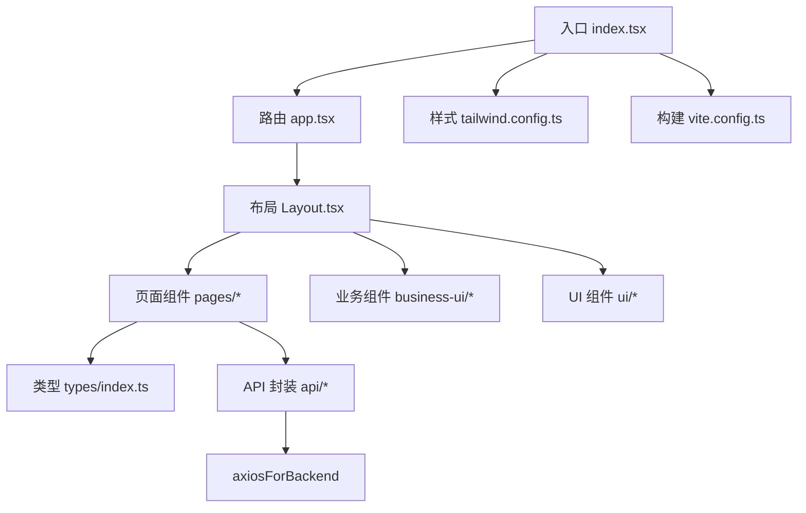
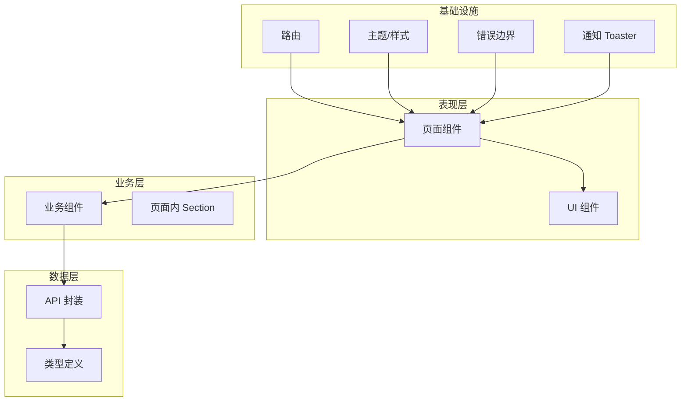
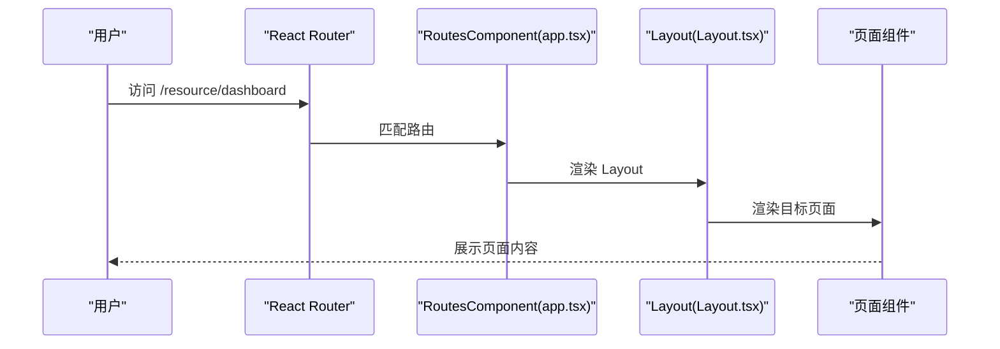
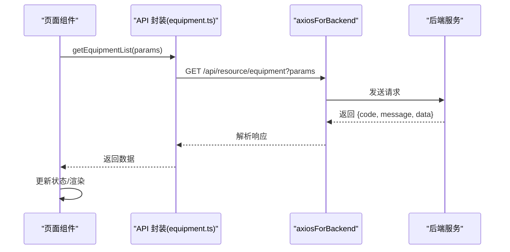
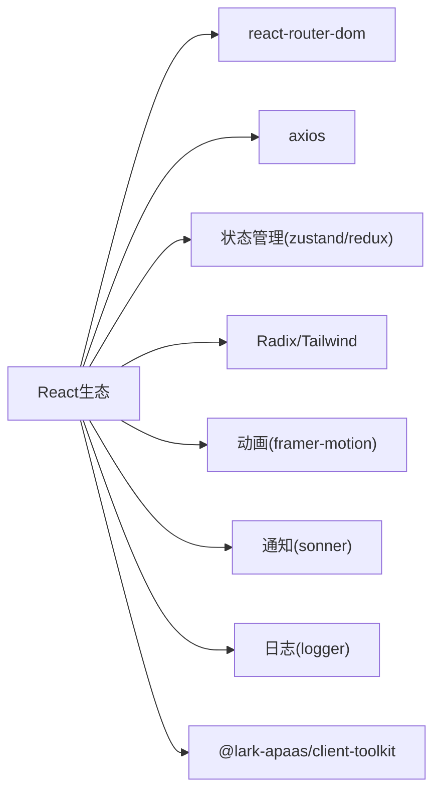

# 前端架构

<cite>
**本文引用的文件**
- [package.json](file://webui_ref/package.json)
- [vite.config.ts](file://webui_ref/vite.config.ts)
- [tailwind.config.ts](file://webui_ref/tailwind.config.ts)
- [tsconfig.json](file://webui_ref/tsconfig.json)
- [index.tsx](file://webui_ref/client/src/index.tsx)
- [app.tsx](file://webui_ref/client/src/app.tsx)
- [Layout.tsx](file://webui_ref/client/src/components/Layout.tsx)
- [types/index.ts](file://webui_ref/client/src/types/index.ts)
- [api/index.ts](file://webui_ref/client/src/api/index.ts)
- [equipment.ts](file://webui_ref/client/src/api/resource/equipment.ts)
</cite>

## 目录
1. [简介](#简介)
2. [项目结构](#项目结构)
3. [核心组件](#核心组件)
4. [架构总览](#架构总览)
5. [详细组件分析](#详细组件分析)
6. [依赖分析](#依赖分析)
7. [性能考虑](#性能考虑)
8. [故障排查指南](#故障排查指南)
9. [结论](#结论)
10. [附录](#附录)

## 简介
本仓库的前端采用 React + TypeScript，基于 Vite 构建，使用 Tailwind CSS 进行样式管理，并通过 react-router-dom 实现页面路由。整体采用“页面组件 - 业务组件 - UI 组件”的分层组织方式：页面组件负责组合业务逻辑与数据展示；业务组件封装领域能力（如表单、选择器、编辑器等）；UI 组件提供原子化界面元素。状态管理采用局部状态为主、全局状态为辅的策略，结合工具库提供的用户上下文与通知能力。前后端通过统一的 axios 实例进行通信，并集中处理错误与日志。样式方面采用 Tailwind 预设与主题定制，支持响应式布局与深色模式。构建流程由 Vite 驱动，开发时通过代理转发 API 请求到后端服务。

## 项目结构
前端代码位于 webui_ref/client/src 目录下，入口为 index.tsx，应用根路由在 app.tsx 中定义，布局组件 Layout.tsx 提供侧边栏、面包屑、用户信息与主内容区。类型定义集中在 types/index.ts，API 封装位于 api 目录，按模块划分（如 resource/equipment.ts）。样式配置在 tailwind.config.ts，构建配置在 vite.config.ts，脚本与依赖在 package.json。

图表来源
- [index.tsx:1-37](file://webui_ref/client/src/index.tsx#L1-L37)
- [app.tsx:1-56](file://webui_ref/client/src/app.tsx#L1-L56)
- [Layout.tsx:1-399](file://webui_ref/client/src/components/Layout.tsx#L1-L399)
- [tailwind.config.ts:1-9](file://webui_ref/tailwind.config.ts#L1-L9)
- [vite.config.ts:1-20](file://webui_ref/vite.config.ts#L1-L20)

章节来源
- [index.tsx:1-37](file://webui_ref/client/src/index.tsx#L1-L37)
- [app.tsx:1-56](file://webui_ref/client/src/app.tsx#L1-L56)
- [Layout.tsx:1-399](file://webui_ref/client/src/components/Layout.tsx#L1-L399)
- [tailwind.config.ts:1-9](file://webui_ref/tailwind.config.ts#L1-L9)
- [vite.config.ts:1-20](file://webui_ref/vite.config.ts#L1-L20)

## 核心组件
- 应用容器与错误边界：入口使用 AppContainer 包裹应用并提供默认主题，ErrorBoundary 捕获渲染异常并统一降级展示。
- 路由与导航：BrowserRouter 提供客户端路由，app.tsx 集中声明页面路由，Layout.tsx 提供侧边栏、面包屑与用户信息。
- 页面组件：每个业务域对应一个页面文件夹（如 ProjectsPage、ResourceDashboardPage），页面内再拆分为若干 Section 组件以增强可维护性。
- 业务组件：business-ui 下包含表单、选择器、编辑器等复合组件，封装领域交互与数据绑定。
- UI 组件：ui 下提供按钮、卡片、表格、弹窗等基础控件，配合 Tailwind 类名快速组合。
- 类型系统：types/index.ts 统一定义前后端共享的数据模型与枚举，确保类型安全。
- API 封装：api 目录按模块组织，统一使用 axiosForBackend 发起请求，返回标准化数据结构。

章节来源
- [index.tsx:1-37](file://webui_ref/client/src/index.tsx#L1-L37)
- [app.tsx:1-56](file://webui_ref/client/src/app.tsx#L1-L56)
- [Layout.tsx:1-399](file://webui_ref/client/src/components/Layout.tsx#L1-L399)
- [types/index.ts:1-299](file://webui_ref/client/src/types/index.ts#L1-L299)
- [api/index.ts:1-20](file://webui_ref/client/src/api/index.ts#L1-L20)

## 架构总览
前端采用分层架构：
- 表现层：页面组件与 UI 组件，负责视图渲染与用户交互。
- 业务层：业务组件与页面内的 Section，封装领域逻辑与数据组装。
- 数据层：API 封装与类型定义，统一网络请求与数据结构。
- 基础设施：路由、主题、构建配置、错误边界与通知。

图表来源
- [app.tsx:1-56](file://webui_ref/client/src/app.tsx#L1-L56)
- [Layout.tsx:1-399](file://webui_ref/client/src/components/Layout.tsx#L1-L399)
- [types/index.ts:1-299](file://webui_ref/client/src/types/index.ts#L1-L299)
- [api/index.ts:1-20](file://webui_ref/client/src/api/index.ts#L1-L20)

## 详细组件分析

### 路由设计与页面导航
- 路由入口：BrowserRouter 设置 basename，便于部署在不同路径下。
- 路由表：app.tsx 集中声明所有页面路由，包括项目相关与试制资源模块路由，支持动态参数（如 projects/:id）。
- 布局与导航：Layout.tsx 提供侧边栏菜单、面包屑、用户信息与退出登录；根据当前路径高亮菜单项，并渲染 Outlet 显示子页面。
- 权限控制：当前未实现基于角色的路由守卫；可在 Layout 或路由层集成鉴权中间件，对敏感路由进行访问控制。

图表来源
- [index.tsx:1-37](file://webui_ref/client/src/index.tsx#L1-L37)
- [app.tsx:1-56](file://webui_ref/client/src/app.tsx#L1-L56)
- [Layout.tsx:1-399](file://webui_ref/client/src/components/Layout.tsx#L1-L399)

章节来源
- [app.tsx:1-56](file://webui_ref/client/src/app.tsx#L1-L56)
- [Layout.tsx:1-399](file://webui_ref/client/src/components/Layout.tsx#L1-L399)

### 状态管理模式
- 局部状态：页面组件内部使用 useState/useEffect 管理表单、列表筛选、分页等局部状态。
- 全局状态：通过 @lark-apaas/client-toolkit 的用户上下文获取当前用户信息；通知通过 Toaster 全局弹出。
- 策略建议：对于跨页面共享的轻量状态（如用户信息、主题），优先使用工具库提供的上下文；复杂状态可使用 Zustand 或 Redux Toolkit（已引入依赖），但当前代码未见显式 store 使用。

章节来源
- [index.tsx:1-37](file://webui_ref/client/src/index.tsx#L1-L37)
- [Layout.tsx:1-399](file://webui_ref/client/src/components/Layout.tsx#L1-L399)
- [package.json:1-211](file://webui_ref/package.json#L1-L211)

### 前后端数据交互
- 统一实例：API 封装统一使用 axiosForBackend，避免重复配置 baseURL、拦截器等。
- 模块化组织：按业务域拆分 API 文件（如 resource/equipment.ts），导出类型与函数，便于复用与维护。
- 错误处理：示例中通过 logger.error 记录错误；建议在拦截器中统一处理 HTTP 错误码与业务错误码，并转换为友好的用户提示。
- 加载状态：页面组件可通过本地状态或查询库（如 react-query）管理 loading、error、data 三态。

图表来源
- [equipment.ts:1-254](file://webui_ref/client/src/api/resource/equipment.ts#L1-L254)
- [api/index.ts:1-20](file://webui_ref/client/src/api/index.ts#L1-L20)

章节来源
- [api/index.ts:1-20](file://webui_ref/client/src/api/index.ts#L1-L20)
- [equipment.ts:1-254](file://webui_ref/client/src/api/resource/equipment.ts#L1-L254)

### 样式架构
- 框架与预设：Tailwind CSS 通过 createTailwindPresetOfSimple 提供基础预设，content 扫描 client/src 下的 TS/TSX/CSS。
- 主题定制：index.tsx 使用 AppContainer 设置默认主题为 light；Layout.tsx 通过样式覆盖与媒体查询支持深色模式。
- 响应式设计：使用 Tailwind 断点与布局类实现移动端适配；侧边栏支持折叠与图标模式。
- 组件样式：UI 组件基于 Tailwind 类名组合，保持无状态与可复用。

章节来源
- [tailwind.config.ts:1-9](file://webui_ref/tailwind.config.ts#L1-L9)
- [index.tsx:1-37](file://webui_ref/client/src/index.tsx#L1-L37)
- [Layout.tsx:1-399](file://webui_ref/client/src/components/Layout.tsx#L1-L399)

### 构建流程与环境配置
- 构建工具：Vite 作为开发与构建工具，提供热更新与快速构建。
- 别名配置：@ 指向 client/src，简化导入路径。
- 开发服务器：端口 5173，代理 /api 到 http://localhost:8000，解决跨域问题。
- 脚本命令：dev/dev:client/dev:server/build/build:prod 等脚本统一管理开发、构建与启动流程。
- 类型检查：tsc 分别对客户端与服务端进行类型检查，保证类型安全。

章节来源
- [vite.config.ts:1-20](file://webui_ref/vite.config.ts#L1-L20)
- [package.json:1-211](file://webui_ref/package.json#L1-L211)
- [tsconfig.json:1-8](file://webui_ref/tsconfig.json#L1-L8)

## 依赖分析
前端依赖主要包含：
- 运行时：react、react-dom、react-router-dom、axios、dayjs、echarts 等。
- 状态与表单：zustand、@tanstack/react-form、react-hook-form。
- UI 与动画：radix-ui、tailwindcss、framer-motion、sonner。
- 工具与测试：eslint、prettier、jest、ts-jest。
- 平台集成：@lark-apaas/client-toolkit 提供 AppContainer、用户上下文、日志与 axios 实例。

图表来源
- [package.json:1-211](file://webui_ref/package.json#L1-L211)

章节来源
- [package.json:1-211](file://webui_ref/package.json#L1-L211)

## 性能考虑
- 路由级代码分割：利用 React.lazy 与 Suspense 对页面组件进行懒加载，减少首屏体积。
- 组件级优化：避免不必要的重渲染，合理使用 useMemo/useCallback；大列表使用虚拟滚动。
- 网络请求优化：合并请求、缓存策略（如 react-query）、分页与增量更新。
- 样式优化：按需引入 Tailwind 类，避免冗余；使用 CSS 变量与主题切换减少重绘。
- 构建优化：开启生产环境压缩与 Tree Shaking；图片与静态资源使用 CDN 与懒加载。

[本节为通用指导，不直接分析具体文件]

## 故障排查指南
- 路由问题：检查 BrowserRouter 的 basename 与 app.tsx 中的路由定义是否一致；确认 Layout 的 Outlet 是否正确渲染子页面。
- 样式问题：确认 tailwind.config.ts 的 content 路径包含实际使用的源文件；检查主题覆盖是否与组件属性冲突。
- API 调用失败：查看浏览器网络面板与日志输出；确认 axiosForBackend 的配置与后端接口路径一致；检查错误码与消息处理逻辑。
- 构建失败：检查 TypeScript 类型错误与 ESLint 规则；确认依赖版本兼容性与 Node 版本要求。

章节来源
- [index.tsx:1-37](file://webui_ref/client/src/index.tsx#L1-L37)
- [app.tsx:1-56](file://webui_ref/client/src/app.tsx#L1-L56)
- [equipment.ts:1-254](file://webui_ref/client/src/api/resource/equipment.ts#L1-L254)
- [tailwind.config.ts:1-9](file://webui_ref/tailwind.config.ts#L1-L9)

## 结论
该前端架构以 React + TypeScript 为核心，采用清晰的分层组织与模块化设计，结合 Vite、Tailwind 与工具库实现了高效开发与良好体验。路由集中管理、API 统一封装、类型系统完善，为后续扩展与维护提供了坚实基础。建议在权限控制、状态管理与性能优化方面持续迭代，以提升系统的健壮性与可维护性。

[本节为总结，不直接分析具体文件]

## 附录
- 关键类型定义：项目、零件、到货记录、装配推荐、系统设置等，详见 types/index.ts。
- API 示例：设备台账相关接口封装，详见 api/resource/equipment.ts。
- 构建与脚本：开发、构建、类型检查与格式化命令，详见 package.json。

章节来源
- [types/index.ts:1-299](file://webui_ref/client/src/types/index.ts#L1-L299)
- [equipment.ts:1-254](file://webui_ref/client/src/api/resource/equipment.ts#L1-L254)
- [package.json:1-211](file://webui_ref/package.json#L1-L211)