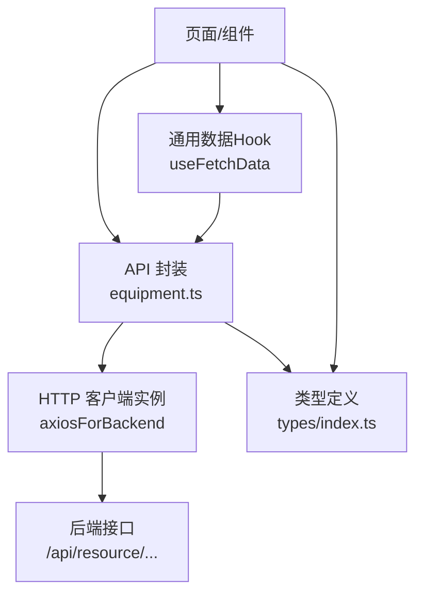
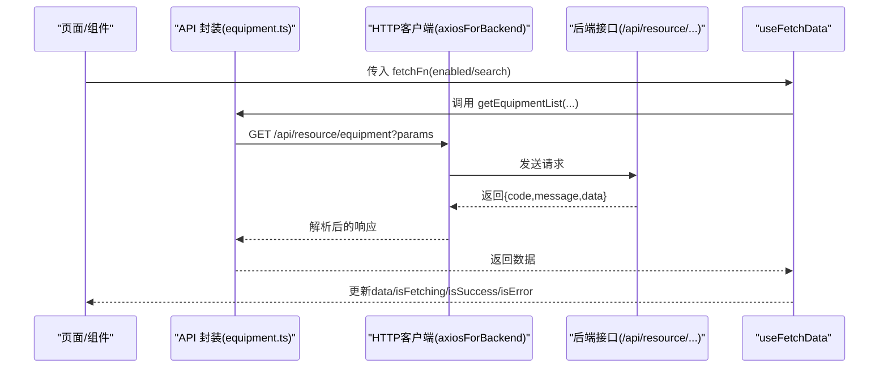
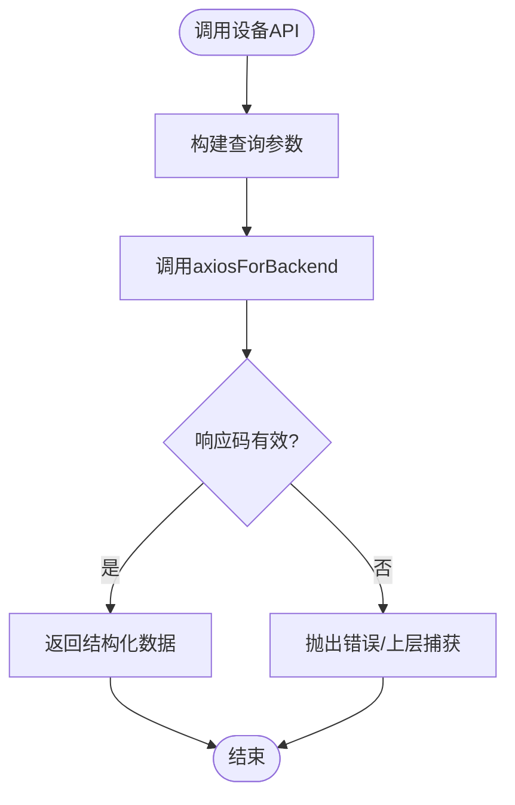
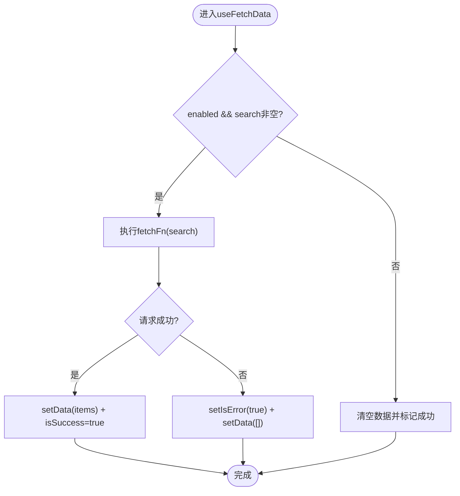
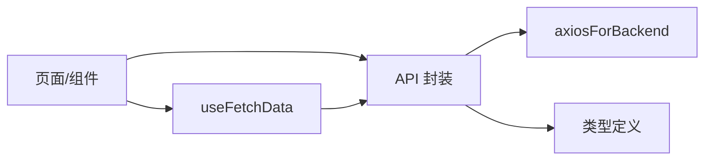

# 数据获取与管理

<cite>
**本文引用的文件**
- [webui_ref/client/src/api/index.ts](file://webui_ref/client/src/api/index.ts)
- [webui_ref/client/src/api/resource/equipment.ts](file://webui_ref/client/src/api/resource/equipment.ts)
- [webui_ref/client/src/components/business-ui/entity-combobox/use-fetch-data.tsx](file://webui_ref/client/src/components/business-ui/entity-combobox/use-fetch-data.tsx)
- [webui_ref/client/src/types/index.ts](file://webui_ref/client/src/types/index.ts)
- [webui_ref/shared/api.interface.ts](file://webui_ref/shared/api.interface.ts)
</cite>

## 目录
1. [简介](#简介)
2. [项目结构](#项目结构)
3. [核心组件](#核心组件)
4. [架构总览](#架构总览)
5. [详细组件分析](#详细组件分析)
6. [依赖关系分析](#依赖关系分析)
7. [性能考虑](#性能考虑)
8. [故障排查指南](#故障排查指南)
9. [结论](#结论)
10. [附录](#附录)

## 简介
本文件聚焦前端数据获取与管理的整体方案，围绕前后端交互模式、API 服务组织、请求/响应处理、错误与重试策略、缓存与同步、加载状态与用户体验优化、数据验证与类型安全（含 TypeScript），以及 WebSocket 实时更新的接入方式展开。文档基于仓库中现有实现进行归纳与扩展建议，帮助读者快速理解并落地统一的数据层规范。

## 项目结构
前端数据相关代码主要分布在以下位置：
- API 封装层：按业务域划分，如设备台账模块的接口定义与调用封装。
- 通用数据拉取 Hook：提供统一的查询生命周期管理（加载、成功、失败、重试）。
- 类型定义：集中维护前后端共享或前端内部使用的数据结构。
- 共享类型占位：用于前后端契约对齐。

图表来源
- [webui_ref/client/src/api/resource/equipment.ts:1-254](file://webui_ref/client/src/api/resource/equipment.ts#L1-L254)
- [webui_ref/client/src/components/business-ui/entity-combobox/use-fetch-data.tsx:1-82](file://webui_ref/client/src/components/business-ui/entity-combobox/use-fetch-data.tsx#L1-L82)
- [webui_ref/client/src/types/index.ts:1-299](file://webui_ref/client/src/types/index.ts#L1-L299)

章节来源
- [webui_ref/client/src/api/index.ts:1-20](file://webui_ref/client/src/api/index.ts#L1-L20)
- [webui_ref/client/src/api/resource/equipment.ts:1-254](file://webui_ref/client/src/api/resource/equipment.ts#L1-L254)
- [webui_ref/client/src/components/business-ui/entity-combobox/use-fetch-data.tsx:1-82](file://webui_ref/client/src/components/business-ui/entity-combobox/use-fetch-data.tsx#L1-L82)
- [webui_ref/client/src/types/index.ts:1-299](file://webui_ref/client/src/types/index.ts#L1-L299)
- [webui_ref/shared/api.interface.ts:1-1](file://webui_ref/shared/api.interface.ts#L1-L1)

## 核心组件
- API 服务组织
  - 以业务域为维度拆分 API 文件，例如设备台账在 resource/equipment.ts 中集中定义接口、参数与返回类型，便于复用与维护。
  - 通过统一的 HTTP 客户端 axiosForBackend 发起请求，避免在各处重复配置基础路径与拦截逻辑。
- 通用数据拉取 Hook
  - useFetchData 提供标准化的查询生命周期：enabled 控制是否触发、search 作为查询条件、isFetching/isError/isSuccess/fetchStatus 等状态管理、refetch 手动刷新能力。
- 类型系统
  - types/index.ts 集中定义领域模型与枚举，配合 API 层的接口类型，形成强类型约束，提升可维护性与可读性。
  - shared/api.interface.ts 作为前后端共享类型的占位，便于后续契约对齐。

章节来源
- [webui_ref/client/src/api/resource/equipment.ts:1-254](file://webui_ref/client/src/api/resource/equipment.ts#L1-L254)
- [webui_ref/client/src/components/business-ui/entity-combobox/use-fetch-data.tsx:1-82](file://webui_ref/client/src/components/business-ui/entity-combobox/use-fetch-data.tsx#L1-L82)
- [webui_ref/client/src/types/index.ts:1-299](file://webui_ref/client/src/types/index.ts#L1-L299)
- [webui_ref/shared/api.interface.ts:1-1](file://webui_ref/shared/api.interface.ts#L1-L1)

## 架构总览
下图展示了从页面到后端的完整数据流，包括 API 封装、HTTP 客户端、类型校验与状态管理。

图表来源
- [webui_ref/client/src/api/resource/equipment.ts:116-178](file://webui_ref/client/src/api/resource/equipment.ts#L116-L178)
- [webui_ref/client/src/components/business-ui/entity-combobox/use-fetch-data.tsx:22-81](file://webui_ref/client/src/components/business-ui/entity-combobox/use-fetch-data.tsx#L22-L81)

## 详细组件分析

### API 服务：设备台账模块
- 职责边界
  - 定义设备、维护记录等实体类型与列表/统计等响应结构。
  - 暴露增删改查与统计等函数，统一使用 axiosForBackend 发起请求。
- 关键方法
  - 列表查询：支持分页、状态、区域、类型、关键词过滤。
  - 详情查询：按设备编码获取单条设备信息。
  - 创建/更新/删除：对设备主数据进行 CRUD。
  - 状态更新：更新设备运行状态与操作人。
  - 统计：返回设备状态分布等聚合数据。
  - 维护记录：列表、新增、状态更新。
- 类型与映射
  - 使用 TypeScript 接口描述请求体与响应体。
  - 提供枚举映射表（状态、类型、维护类型等），便于 UI 渲染。

图表来源
- [webui_ref/client/src/api/resource/equipment.ts:116-216](file://webui_ref/client/src/api/resource/equipment.ts#L116-L216)

章节来源
- [webui_ref/client/src/api/resource/equipment.ts:1-254](file://webui_ref/client/src/api/resource/equipment.ts#L1-L254)

### 通用数据拉取 Hook：useFetchData
- 设计要点
  - enabled 控制是否启用查询；search 作为搜索关键字；当 search 为空时直接清空数据并标记成功。
  - 生命周期：开始请求前设置 isFetching=true，成功后置 isSuccess=true 并写入 data，失败时设置 isError=true。
  - 提供 refetch 以便外部主动刷新。
- 适用场景
  - 下拉框远程搜索、表格搜索、懒加载列表等需要“按需拉取 + 状态管理”的场景。

图表来源
- [webui_ref/client/src/components/business-ui/entity-combobox/use-fetch-data.tsx:22-81](file://webui_ref/client/src/components/business-ui/entity-combobox/use-fetch-data.tsx#L22-L81)

章节来源
- [webui_ref/client/src/components/business-ui/entity-combobox/use-fetch-data.tsx:1-82](file://webui_ref/client/src/components/business-ui/entity-combobox/use-fetch-data.tsx#L1-L82)

### 类型系统与数据验证
- 类型集中管理
  - types/index.ts 定义了项目、零件、到货、配置、推荐等多类领域模型，确保跨组件一致的数据结构。
  - API 层针对每个接口定义明确的请求/响应类型，减少运行时类型错误。
- 前后端契约
  - shared/api.interface.ts 作为共享类型占位，建议将前后端共用的枚举、字段名、校验规则在此统一声明，降低联调成本。
- 建议的验证策略
  - 在 API 层对入参做基础校验（如必填、格式），对出参做必要转换与兜底。
  - 结合表单库的校验规则，保证用户输入与后端期望一致。

章节来源
- [webui_ref/client/src/types/index.ts:1-299](file://webui_ref/client/src/types/index.ts#L1-L299)
- [webui_ref/shared/api.interface.ts:1-1](file://webui_ref/shared/api.interface.ts#L1-L1)

### 请求/响应拦截器与错误处理
- 现状说明
  - 当前 API 层直接使用 axiosForBackend，未在本仓库中见到自定义拦截器的实现。
- 建议实践
  - 请求拦截器：统一注入鉴权头、租户标识、请求追踪 ID；对敏感信息进行脱敏日志。
  - 响应拦截器：统一处理 code/message/data 结构，将业务异常转换为标准错误对象；对 401/403/404/5xx 做差异化提示与跳转。
  - 错误上报：结合 logger 输出上下文（URL、参数、耗时、堆栈），便于定位问题。

章节来源
- [webui_ref/client/src/api/index.ts:1-20](file://webui_ref/client/src/api/index.ts#L1-L20)
- [webui_ref/client/src/api/resource/equipment.ts:116-216](file://webui_ref/client/src/api/resource/equipment.ts#L116-L216)

### 重试策略
- 现状说明
  - 当前未实现自动重试机制。
- 建议实践
  - 幂等读请求（GET）：在网络抖动时可进行有限次指数退避重试。
  - 写请求（POST/PUT/DELETE）：谨慎重试，必要时引入分布式锁或幂等键。
  - 重试上限与退避：最大次数、初始延迟、最大延迟、抖动因子。
  - 取消与竞态：结合 AbortController 取消过期请求，避免旧响应覆盖新数据。

[本节为通用建议，不直接引用具体文件]

### 数据缓存与同步
- 现状说明
  - 当前未内置全局缓存层。
- 建议实践
  - 内存缓存：对热点只读数据（如字典、配置）使用 Map/WeakMap 缓存，设置 TTL 与失效策略。
  - 浏览器存储：对轻量级数据使用 localStorage/sessionStorage，注意容量与序列化。
  - 服务端缓存：利用后端缓存（Redis/DB）减少压力；前端通过版本号或时间戳判断失效。
  - 一致性：写操作后主动失效相关缓存；长轮询或 WebSocket 推送变更事件。

[本节为通用建议，不直接引用具体文件]

### 加载状态管理与用户体验优化
- 现状说明
  - useFetchData 已提供 isFetching/isSuccess/isError 等状态，可用于展示骨架屏、空态、错误提示。
- 建议实践
  - 列表页：首屏骨架屏 + 分页懒加载；滚动到底部自动加载更多。
  - 搜索：防抖输入，避免频繁请求；显示“正在搜索”提示。
  - 错误恢复：提供“重试”按钮；网络恢复后自动刷新。
  - 并发控制：同一资源多次请求合并；取消过时请求。

章节来源
- [webui_ref/client/src/components/business-ui/entity-combobox/use-fetch-data.tsx:22-81](file://webui_ref/client/src/components/business-ui/entity-combobox/use-fetch-data.tsx#L22-L81)

### WebSocket 实时数据更新
- 现状说明
  - 当前仓库未发现 WebSocket 相关实现。
- 建议实践
  - 连接管理：建立连接池，自动重连、心跳保活、断线通知。
  - 消息协议：定义事件类型、载荷结构与版本兼容策略。
  - 数据同步：收到推送后增量更新本地缓存，并触发 UI 刷新。
  - 权限与安全：握手阶段鉴权，限制订阅频道，防止恶意推送。
  - 降级策略：WebSocket 不可用时回退到轮询。

[本节为通用建议，不直接引用具体文件]

## 依赖关系分析
- 组件依赖
  - 页面/组件依赖 API 封装函数与 useFetchData Hook。
  - API 封装依赖统一的 HTTP 客户端与类型定义。
- 耦合与内聚
  - API 层按业务域内聚，降低耦合；Hook 层抽象通用查询逻辑，提高复用度。
- 潜在风险
  - 若未统一拦截器与错误处理，可能导致各模块行为不一致。
  - 类型分散会增加维护成本，建议逐步收敛至共享类型。

图表来源
- [webui_ref/client/src/api/resource/equipment.ts:116-216](file://webui_ref/client/src/api/resource/equipment.ts#L116-L216)
- [webui_ref/client/src/components/business-ui/entity-combobox/use-fetch-data.tsx:22-81](file://webui_ref/client/src/components/business-ui/entity-combobox/use-fetch-data.tsx#L22-L81)
- [webui_ref/client/src/types/index.ts:1-299](file://webui_ref/client/src/types/index.ts#L1-L299)

章节来源
- [webui_ref/client/src/api/resource/equipment.ts:116-216](file://webui_ref/client/src/api/resource/equipment.ts#L116-L216)
- [webui_ref/client/src/components/business-ui/entity-combobox/use-fetch-data.tsx:22-81](file://webui_ref/client/src/components/business-ui/entity-combobox/use-fetch-data.tsx#L22-L81)
- [webui_ref/client/src/types/index.ts:1-299](file://webui_ref/client/src/types/index.ts#L1-L299)

## 性能考虑
- 请求合并与去重：相同资源的并发请求应合并，避免重复网络开销。
- 分页与虚拟滚动：大数据量列表采用分页与虚拟化渲染。
- 防抖与节流：搜索与高频事件需加防抖/节流。
- 缓存命中：热点数据优先走缓存，减少后端压力。
- 资源压缩与懒加载：静态资源按需加载，首屏更快。

[本节为通用建议，不直接引用具体文件]

## 故障排查指南
- 常见问题
  - 网络异常：检查拦截器是否正确处理超时与重试；查看网络面板与日志。
  - 鉴权失败：确认请求头携带正确凭证；检查 401/403 处理逻辑。
  - 数据不一致：检查缓存失效策略与推送通道是否生效。
  - 类型错误：核对前后端字段命名与类型定义是否一致。
- 调试建议
  - 开启详细日志，记录请求 URL、参数、响应码与耗时。
  - 使用浏览器开发者工具抓包，对比前后端契约。
  - 对关键流程添加埋点，便于定位瓶颈与异常。

章节来源
- [webui_ref/client/src/api/index.ts:1-20](file://webui_ref/client/src/api/index.ts#L1-L20)
- [webui_ref/client/src/api/resource/equipment.ts:116-216](file://webui_ref/client/src/api/resource/equipment.ts#L116-L216)

## 结论
本项目已具备清晰的 API 分层与通用的数据拉取 Hook，类型体系初具规模。建议在现有基础上补充统一的请求/响应拦截器、错误与重试策略、缓存与同步机制，并引入 WebSocket 实现实时数据更新。通过这些增强，可显著提升系统的稳定性、可维护性与用户体验。

## 附录
- 术语
  - 拦截器：在请求发出前或响应返回后执行的钩子函数。
  - 幂等：多次执行与单次执行结果一致的操作。
  - 退避：重试时逐步增加等待时间的策略。
- 参考
  - 设备台账 API 与类型定义见 equipment.ts 与 types/index.ts。
  - 通用数据拉取 Hook 见 use-fetch-data.tsx。