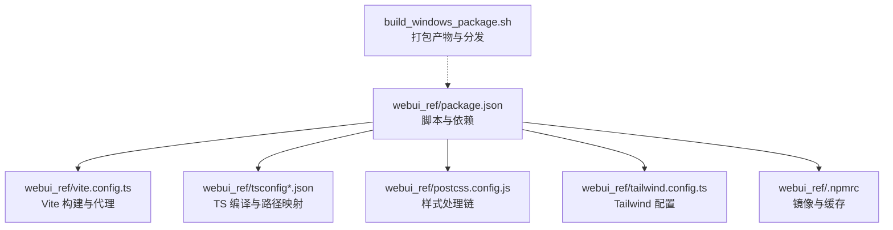
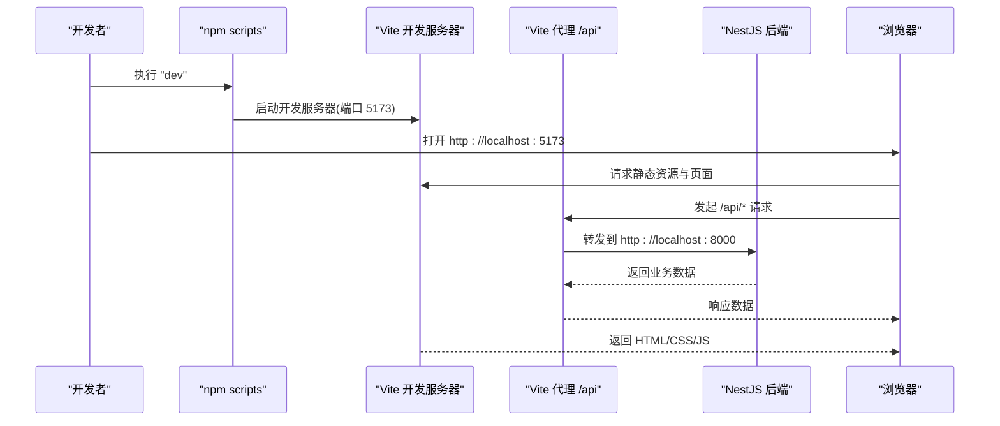
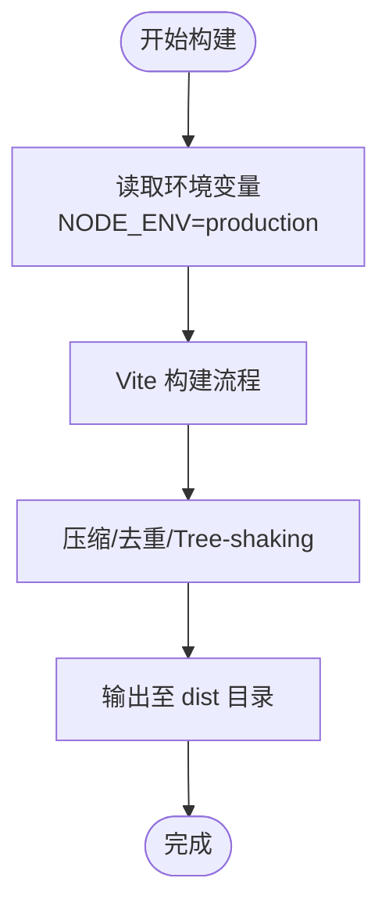
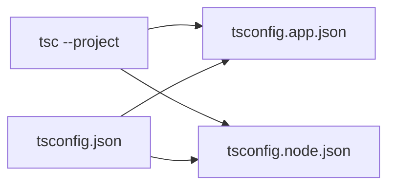
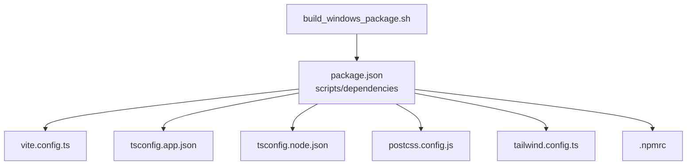

# 构建与部署

<cite>
**本文引用的文件**
- [vite.config.ts](file://webui_ref/vite.config.ts)
- [package.json](file://webui_ref/package.json)
- [tsconfig.json](file://webui_ref/tsconfig.json)
- [tsconfig.app.json](file://webui_ref/tsconfig.app.json)
- [tsconfig.node.json](file://webui_ref/tsconfig.node.json)
- [.npmrc](file://webui_ref/.npmrc)
- [postcss.config.js](file://webui_ref/postcss.config.js)
- [tailwind.config.ts](file://webui_ref/tailwind.config.ts)
- [build_windows_package.sh](file://build_windows_package.sh)
</cite>

## 目录
1. [简介](#简介)
2. [项目结构](#项目结构)
3. [核心组件](#核心组件)
4. [架构总览](#架构总览)
5. [详细组件分析](#详细组件分析)
6. [依赖关系分析](#依赖关系分析)
7. [性能考虑](#性能考虑)
8. [故障排查指南](#故障排查指南)
9. [结论](#结论)
10. [附录](#附录)

## 简介
本文件面向前端工程（位于 webui_ref）的构建与部署，系统性说明基于 Vite 的构建流程、TypeScript 编译与类型检查、依赖管理与版本策略、开发/生产环境差异、代码分割与资源优化、缓存策略、CI/CD 集成建议、性能监控与错误追踪接入方案，以及容器化与环境变量管理。内容严格依据仓库中的配置文件与脚本进行归纳与解读，便于不同技术背景的读者快速上手并落地实践。

## 项目结构
前端工程采用前后端同仓组织：
- 前端源码位于 webui_ref/client/src，入口为 client/index.html，Vite 配置在根级 vite.config.ts。
- 后端 NestJS 服务位于 webui_ref/server，通过 package.json 的脚本统一编排开发与构建。
- 共享类型与常量位于 shared 目录，被前后端共同引用。
- 样式体系使用 Tailwind CSS，PostCSS 管线由 postcss.config.js 驱动。
- TypeScript 编译配置拆分为 app/node 两套 tsconfig，并通过顶层 tsconfig.json 引用。

图表来源
- [package.json:11-34](file://webui_ref/package.json#L11-L34)
- [vite.config.ts:1-19](file://webui_ref/vite.config.ts#L1-L19)
- [tsconfig.json:1-8](file://webui_ref/tsconfig.json#L1-L8)
- [postcss.config.js:1-11](file://webui_ref/postcss.config.js#L1-L11)
- [tailwind.config.ts:1-9](file://webui_ref/tailwind.config.ts#L1-L9)
- [.npmrc:1-2](file://webui_ref/.npmrc#L1-L2)
- [build_windows_package.sh:1-235](file://build_windows_package.sh#L1-L235)

章节来源
- [package.json:11-34](file://webui_ref/package.json#L11-L34)
- [vite.config.ts:1-19](file://webui_ref/vite.config.ts#L1-L19)
- [tsconfig.json:1-8](file://webui_ref/tsconfig.json#L1-L8)
- [postcss.config.js:1-11](file://webui_ref/postcss.config.js#L1-L11)
- [tailwind.config.ts:1-9](file://webui_ref/tailwind.config.ts#L1-L9)
- [.npmrc:1-2](file://webui_ref/.npmrc#L1-L2)
- [build_windows_package.sh:1-235](file://build_windows_package.sh#L1-L235)

## 核心组件
- 构建工具与预设
  - Vite 通过 @lark-apaas/fullstack-vite-preset 提供的 defineConfig 进行统一配置，简化开发服务器、别名与插件集成。
  - 开发服务器端口与 API 代理已内置，便于本地联调后端服务。
- TypeScript 编译与类型检查
  - 应用侧与 Node 侧分别维护 tsconfig，顶层 tsconfig 通过 references 关联，支持增量编译与并行类型检查。
  - 路径别名覆盖客户端、服务端与共享模块，提升可维护性。
- 样式与资源
  - PostCSS 管线包含 import、Tailwind 与 autoprefixer，配合 Tailwind 配置扫描 client/src 下的样式源。
- 依赖与脚本
  - package.json 提供 dev/build/start/test/lint/type-check 等脚本，统一开发体验与流水线命令。
  - .npmrc 指定国内镜像与缓存目录，加速安装与构建。

章节来源
- [vite.config.ts:1-19](file://webui_ref/vite.config.ts#L1-L19)
- [tsconfig.json:1-8](file://webui_ref/tsconfig.json#L1-L8)
- [tsconfig.app.json:1-24](file://webui_ref/tsconfig.app.json#L1-L24)
- [tsconfig.node.json:1-17](file://webui_ref/tsconfig.node.json#L1-L17)
- [postcss.config.js:1-11](file://webui_ref/postcss.config.js#L1-L11)
- [tailwind.config.ts:1-9](file://webui_ref/tailwind.config.ts#L1-L9)
- [package.json:11-34](file://webui_ref/package.json#L11-L34)
- [.npmrc:1-2](file://webui_ref/.npmrc#L1-L2)

## 架构总览
下图展示了从开发者执行 npm run dev 到浏览器访问应用的完整链路，包括 Vite 开发服务器、API 代理与 NestJS 后端。

图表来源
- [package.json:11-21](file://webui_ref/package.json#L11-L21)
- [vite.config.ts:10-18](file://webui_ref/vite.config.ts#L10-L18)

章节来源
- [package.json:11-21](file://webui_ref/package.json#L11-L21)
- [vite.config.ts:10-18](file://webui_ref/vite.config.ts#L10-L18)

## 详细组件分析

### Vite 构建与开发服务器
- 开发服务器
  - 端口固定为 5173，便于与其他服务共存。
  - 对 /api 路径启用代理，目标为 http://localhost:8000，并开启 changeOrigin 以兼容跨域。
- 构建输出
  - 通过 package.json 的 build:client 调用 Vite 构建，环境变量 NODE_ENV=production 触发生产优化。
  - 结合 fullstack-vite-preset 的默认优化策略，通常包含压缩、Tree-shaking、按需加载等。
- 路径别名
  - 使用 @ 指向 client/src，简化导入路径，提升可读性与可维护性。

图表来源
- [package.json:17-20](file://webui_ref/package.json#L17-L20)
- [vite.config.ts:1-19](file://webui_ref/vite.config.ts#L1-L19)

章节来源
- [vite.config.ts:1-19](file://webui_ref/vite.config.ts#L1-L19)
- [package.json:17-20](file://webui_ref/package.json#L17-L20)

### TypeScript 编译与类型检查
- 双配置分离
  - tsconfig.app.json：针对客户端应用，包含路径映射与增量编译开关。
  - tsconfig.node.json：针对服务端与 Node 侧脚本，设置输出目录与监听排除规则。
  - 顶层 tsconfig.json：通过 references 将两者关联，便于 IDE 与工具链识别。
- 类型检查命令
  - type:check 并发执行 server 与 client 的类型检查，确保前后端类型一致性。
  - type:check:client 与 type:check:server 分别对应应用与服务端配置。

图表来源
- [tsconfig.json:1-8](file://webui_ref/tsconfig.json#L1-L8)
- [tsconfig.app.json:1-24](file://webui_ref/tsconfig.app.json#L1-L24)
- [tsconfig.node.json:1-17](file://webui_ref/tsconfig.node.json#L1-L17)
- [package.json:27-29](file://webui_ref/package.json#L27-L29)

章节来源
- [tsconfig.json:1-8](file://webui_ref/tsconfig.json#L1-L8)
- [tsconfig.app.json:1-24](file://webui_ref/tsconfig.app.json#L1-L24)
- [tsconfig.node.json:1-17](file://webui_ref/tsconfig.node.json#L1-L17)
- [package.json:27-29](file://webui_ref/package.json#L27-L29)

### 样式与资源处理
- PostCSS 管线
  - postcss-import：处理 @import 与模块化样式。
  - @tailwindcss/postcss：Tailwind v4 的 PostCSS 插件，负责生成样式。
  - autoprefixer：自动添加浏览器前缀。
- Tailwind 配置
  - 使用 preset 简化主题与默认值。
  - content 仅扫描 client/src 下的 TS/TSX/CSS，减少无用样式体积。

章节来源
- [postcss.config.js:1-11](file://webui_ref/postcss.config.js#L1-L11)
- [tailwind.config.ts:1-9](file://webui_ref/tailwind.config.ts#L1-L9)

### 依赖管理与包版本控制策略
- 依赖分类
  - dependencies：运行时依赖，如 React、NestJS、Axios、ECharts 等。
  - devDependencies：构建与开发期依赖，如 Vite、TypeScript、ESLint、Prettier、Tailwind 等。
- 版本策略
  - 使用语义化版本范围（^、~），平衡稳定性与更新频率。
  - 通过 overrides 锁定特定依赖版本，解决冲突或安全漏洞。
- 镜像与缓存
  - .npmrc 配置华为云镜像与缓存目录，提升安装与构建速度。
- 引擎约束
  - engines 声明 Node 与 npm 最低版本，保证运行环境一致。

章节来源
- [package.json:36-190](file://webui_ref/package.json#L36-L190)
- [package.json:191-205](file://webui_ref/package.json#L191-L205)
- [.npmrc:1-2](file://webui_ref/.npmrc#L1-L2)

### 开发环境与生产环境的差异化配置
- 环境变量
  - 开发：NODE_ENV=development，用于关闭部分优化、开启热更新与调试信息。
  - 生产：NODE_ENV=production，启用压缩、代码分割与缓存友好输出。
- 开发服务器
  - 本地代理 /api 到后端 8000 端口，避免跨域问题。
- 构建产物
  - 生产构建输出至 dist，供静态资源服务器或后端托管。
- 脚本编排
  - dev/dev:client/dev:server 区分前后端开发任务。
  - build/build:prod 串联服务端与客户端构建。

章节来源
- [package.json:11-21](file://webui_ref/package.json#L11-L21)
- [vite.config.ts:10-18](file://webui_ref/vite.config.ts#L10-L18)

### 代码分割、资源优化与缓存策略
- 代码分割
  - 基于路由与组件懒加载，Vite 默认按功能块拆分 JS 与 CSS，降低首屏体积。
- 资源优化
  - 图片、字体等资源由 Vite 与插件自动优化；Tailwind 仅保留使用的样式类。
- 缓存策略
  - 生产构建文件名含哈希，利于浏览器长期缓存；静态资源可通过 CDN 进一步加速。
- 增量编译
  - TypeScript 开启 incremental，提升二次编译速度。

章节来源
- [tsconfig.app.json:11-12](file://webui_ref/tsconfig.app.json#L11-L12)
- [package.json:17-20](file://webui_ref/package.json#L17-L20)
- [tailwind.config.ts:5-7](file://webui_ref/tailwind.config.ts#L5-L7)

### CI/CD 流水线集成方案
- 推荐步骤
  - 安装依赖：使用 .npmrc 镜像加速，缓存 node_modules。
  - 类型检查：执行 type:check 确保类型正确。
  - 构建：执行 build:client 与 build:server，产出 dist 与后端产物。
  - 测试：可选执行 test 与 test:e2e。
  - 发布：将构建产物上传至制品库或部署到目标环境。
- 缓存与并行
  - 缓存 npm 包与 TypeScript 增量编译产物，缩短构建时间。
  - 并行执行 lint、type:check、test 等任务。

章节来源
- [package.json:11-34](file://webui_ref/package.json#L11-L34)
- [.npmrc:1-2](file://webui_ref/.npmrc#L1-L2)

### 性能监控与错误追踪集成方法
- 前端埋点
  - 在应用入口引入监控 SDK，上报页面加载耗时、接口错误与用户操作事件。
  - 利用 React Error Boundary 捕获渲染异常，上报堆栈与上下文。
- 后端日志
  - 统一日志格式与级别，关键错误写入集中式日志系统。
- 指标采集
  - 采集前端性能指标（FCP/LCP/CLS）与后端接口耗时，形成看板。

[本节为通用实践建议，不直接分析具体文件]

### Docker 容器化部署与环境变量管理
- 多阶段构建
  - 构建阶段：安装依赖、执行类型检查与构建，产出最小化 dist。
  - 运行阶段：仅包含运行时依赖与静态资源，减小镜像体积。
- 环境变量
  - 通过环境变量注入后端地址、API 密钥等敏感信息，避免硬编码。
  - 使用 .env.example 作为模板，实际 .env 不应纳入版本库。
- 健康检查与重启策略
  - 配置健康检查探针与自动重启策略，提高可用性。

[本节为通用实践建议，不直接分析具体文件]

## 依赖关系分析
下图展示脚本、配置与工具之间的依赖关系，帮助理解构建与开发流程。

图表来源
- [package.json:11-34](file://webui_ref/package.json#L11-L34)
- [vite.config.ts:1-19](file://webui_ref/vite.config.ts#L1-L19)
- [tsconfig.app.json:1-24](file://webui_ref/tsconfig.app.json#L1-L24)
- [tsconfig.node.json:1-17](file://webui_ref/tsconfig.node.json#L1-L17)
- [postcss.config.js:1-11](file://webui_ref/postcss.config.js#L1-L11)
- [tailwind.config.ts:1-9](file://webui_ref/tailwind.config.ts#L1-L9)
- [.npmrc:1-2](file://webui_ref/.npmrc#L1-L2)
- [build_windows_package.sh:1-235](file://build_windows_package.sh#L1-L235)

章节来源
- [package.json:11-34](file://webui_ref/package.json#L11-L34)
- [vite.config.ts:1-19](file://webui_ref/vite.config.ts#L1-L19)
- [tsconfig.app.json:1-24](file://webui_ref/tsconfig.app.json#L1-L24)
- [tsconfig.node.json:1-17](file://webui_ref/tsconfig.node.json#L1-L17)
- [postcss.config.js:1-11](file://webui_ref/postcss.config.js#L1-L11)
- [tailwind.config.ts:1-9](file://webui_ref/tailwind.config.ts#L1-L9)
- [.npmrc:1-2](file://webui_ref/.npmrc#L1-L2)
- [build_windows_package.sh:1-235](file://build_windows_package.sh#L1-L235)

## 性能考虑
- 构建性能
  - 使用增量编译与缓存，减少重复计算。
  - 合理划分依赖，避免大体积库全量引入。
- 运行时性能
  - 启用路由级懒加载与组件级动态导入。
  - 图片与媒体资源使用现代格式与自适应尺寸。
- 网络性能
  - 启用 Gzip/Brotli 压缩与 HTTP/2。
  - 静态资源上 CDN，利用强缓存与协商缓存。

[本节提供通用指导，不直接分析具体文件]

## 故障排查指南
- 常见问题
  - 端口冲突：确认 5173 与 8000 未被占用。
  - 代理失败：检查后端是否启动且路径匹配 /api。
  - 类型错误：执行 type:check 定位 TS 错误。
  - 样式未生效：确认 Tailwind content 路径与 PostCSS 插件顺序。
- 诊断步骤
  - 清理缓存后重试：删除 node_modules 与 dist，重新安装与构建。
  - 逐步禁用插件：定位 PostCSS/Vite 插件导致的构建问题。
  - 查看日志：关注 Vite 控制台与后端日志。

章节来源
- [package.json:11-21](file://webui_ref/package.json#L11-L21)
- [vite.config.ts:10-18](file://webui_ref/vite.config.ts#L10-L18)
- [postcss.config.js:1-11](file://webui_ref/postcss.config.js#L1-L11)

## 结论
本项目基于 Vite 与 TypeScript 构建了高效的前端工程，配合 Tailwind 与 PostCSS 实现现代化样式管线。通过清晰的脚本编排与环境变量管理，实现了开发/生产的平滑切换。建议在 CI/CD 中固化类型检查、构建与测试流程，并结合监控与错误追踪提升线上质量。容器化部署时遵循最小镜像原则与环境变量隔离，确保可移植性与安全性。

## 附录
- Windows 打包与分发
  - 使用 build_windows_package.sh 生成部署压缩包，自动复制必要目录与脚本，并生成快速部署指引。
  - 该脚本会排除敏感文件（如 .env），并创建运行时所需空目录，便于一键解压部署。

章节来源
- [build_windows_package.sh:1-235](file://build_windows_package.sh#L1-L235)