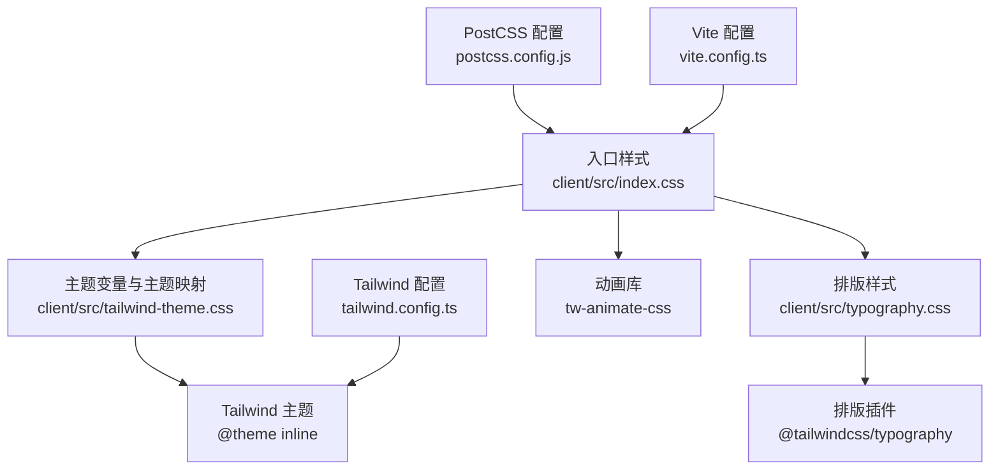
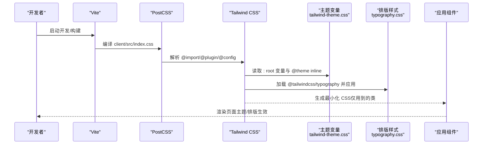
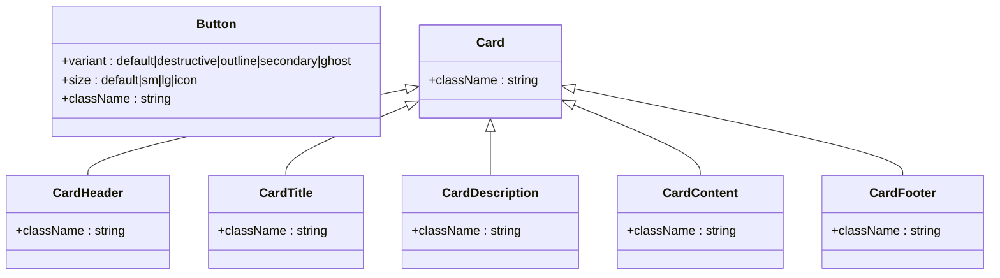
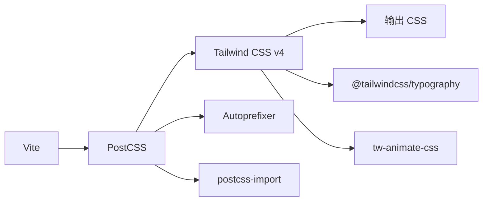

# 样式与主题

<cite>
**本文引用的文件**
- [tailwind.config.ts](file://webui_ref/tailwind.config.ts)
- [postcss.config.js](file://webui_ref/postcss.config.js)
- [package.json](file://webui_ref/package.json)
- [vite.config.ts](file://webui_ref/vite.config.ts)
- [index.css](file://webui_ref/client/src/index.css)
- [tailwind-theme.css](file://webui_ref/client/src/tailwind-theme.css)
- [typography.css](file://webui_ref/client/src/typography.css)
- [components.json](file://webui_ref/components.json)
- [button.tsx](file://webui_ref/client/src/components/ui/button.tsx)
- [card.tsx](file://webui_ref/client/src/components/ui/card.tsx)
</cite>

## 目录
1. [简介](#简介)
2. [项目结构](#项目结构)
3. [核心组件](#核心组件)
4. [架构总览](#架构总览)
5. [详细组件分析](#详细组件分析)
6. [依赖分析](#依赖分析)
7. [性能考虑](#性能考虑)
8. [故障排查指南](#故障排查指南)
9. [结论](#结论)
10. [附录](#附录)

## 简介
本文件面向前端样式与主题系统，系统性阐述 Tailwind CSS 的集成与配置、CSS 模块化组织与命名约定、主题定制机制（颜色、字体、间距等）、响应式设计与断点管理、组件样式作用域与隔离方案、样式性能优化技巧（压缩、按需加载等），以及无障碍访问与浏览器兼容性处理。内容基于仓库中 webui_ref 客户端工程的前端样式实现进行梳理与总结。

## 项目结构
前端样式体系围绕 Tailwind CSS v4 构建，采用 PostCSS 管线与 Vite 打包工具链。入口样式通过 index.css 引入主题、排版插件与动画库；主题变量集中定义在 tailwind-theme.css，并通过 @theme inline 暴露给 Tailwind 使用；排版样式由 typography.css 统一注入到 prose 实用类；Tailwind 配置位于 tailwind.config.ts，PostCSS 配置位于 postcss.config.js，Vite 配置位于 vite.config.ts。

图表来源
- [index.css:1-8](file://webui_ref/client/src/index.css#L1-L8)
- [tailwind-theme.css:92-149](file://webui_ref/client/src/tailwind-theme.css#L92-L149)
- [typography.css:1-42](file://webui_ref/client/src/typography.css#L1-L42)
- [tailwind.config.ts:1-9](file://webui_ref/tailwind.config.ts#L1-L9)
- [postcss.config.js:1-11](file://webui_ref/postcss.config.js#L1-L11)
- [vite.config.ts:1-20](file://webui_ref/vite.config.ts#L1-L20)

章节来源
- [index.css:1-8](file://webui_ref/client/src/index.css#L1-L8)
- [tailwind.config.ts:1-9](file://webui_ref/tailwind.config.ts#L1-L9)
- [postcss.config.js:1-11](file://webui_ref/postcss.config.js#L1-L11)
- [vite.config.ts:1-20](file://webui_ref/vite.config.ts#L1-L20)

## 核心组件
- 主题变量与映射：通过 :root 定义语义化 CSS 变量（背景、前景、卡片、信息、破坏、成功、警告、边框、输入、环、图表色、侧边栏等），并在 @theme inline 中映射为 Tailwind 可用的 --color-*、--font-*、--radius-*、--shadow-* 等主题键，使业务组件可一致地使用主题。
- 排版系统：启用 @tailwindcss/typography，并通过自定义 utility 将 prose 的颜色、边框、引用、代码块等样式绑定到主题变量，保证文章/文档区域与全局主题一致。
- 交互提升层：提供 hover-elevate / active-elevate / toggle-elevate 等工具类，利用伪元素叠加半透明遮罩实现“浮起”效果，并自动适配带边框的元素。
- 组件样式：UI 组件（如 Button、Card）通过 class-variance-authority 组合变体与尺寸，结合 cn 工具合并类名，确保样式可组合、可扩展且与主题一致。

章节来源
- [tailwind-theme.css:1-149](file://webui_ref/client/src/tailwind-theme.css#L1-L149)
- [typography.css:1-42](file://webui_ref/client/src/typography.css#L1-L42)
- [button.tsx:1-70](file://webui_ref/client/src/components/ui/button.tsx#L1-L70)
- [card.tsx:1-83](file://webui_ref/client/src/components/ui/card.tsx#L1-L83)

## 架构总览
下图展示了从入口样式到主题、排版、组件样式的完整链路，以及构建时 PostCSS 与 Tailwind 的处理流程。

图表来源
- [postcss.config.js:1-11](file://webui_ref/postcss.config.js#L1-L11)
- [index.css:1-8](file://webui_ref/client/src/index.css#L1-L8)
- [tailwind-theme.css:92-149](file://webui_ref/client/src/tailwind-theme.css#L92-L149)
- [typography.css:1-42](file://webui_ref/client/src/typography.css#L1-L42)
- [tailwind.config.ts:1-9](file://webui_ref/tailwind.config.ts#L1-L9)

## 详细组件分析

### 主题定制机制（颜色、字体、间距）
- 颜色系统：在 :root 中定义语义化颜色变量（primary、secondary、muted、accent、info、destructive、success、warning、border、input、ring、chart-1~5、sidebar 系列等），并通过 @theme inline 映射为 Tailwind 主题键，便于在组件中以 color-* 形式使用。
- 字体规范：定义 sans/serif/mono 字体栈，覆盖默认字体族，确保跨平台一致性。
- 圆角与阴影：统一 radius 与 shadow 层级，提供 2xs~2xl 多档阴影，保持视觉层次一致。
- 计算型边框：通过 hsl relative color syntax 与强度变量，动态计算主/次/破坏/强调/静音等按钮边框色，保证在不同背景下具备一致的深度感。
- 侧边栏主题：独立 sidebar 色系，便于导航区域与主内容区分。

章节来源
- [tailwind-theme.css:1-149](file://webui_ref/client/src/tailwind-theme.css#L1-L149)

### 排版系统（Typography）
- 启用 @tailwindcss/typography，并通过自定义 utility 将 prose 的各子项颜色、边框、引用、代码块等绑定到主题变量，确保文章内容区域与全局主题一致。
- 支持 invert 模式下的反色排版，便于在深色或高对比度场景下保持一致的可读性。

章节来源
- [typography.css:1-42](file://webui_ref/client/src/typography.css#L1-L42)

### 交互提升层（Elevation System）
- 提供 hover-elevate / active-elevate / toggle-elevate 等工具类，通过伪元素叠加半透明遮罩实现“浮起”效果。
- 自动适配带边框元素（通过 inset 微调），避免边框被遮挡。
- 提供 no-default-hover-elevate / no-default-active-elevate 作为“逃生口”，允许组件自行控制交互反馈。

章节来源
- [tailwind-theme.css:151-260](file://webui_ref/client/src/tailwind-theme.css#L151-L260)

### 组件样式与作用域隔离
- 按钮组件（Button）：
  - 使用 class-variance-authority 定义 variant（default、destructive、outline、secondary、ghost）与 size（default、sm、lg、icon）。
  - 基础样式包含 hover/active 的 elevate 效果，边框色通过主题计算的 border-* 变量，确保不同变体的一致性。
  - 通过 cn 工具合并外部传入 className，支持灵活扩展。
- 卡片组件（Card）：
  - 使用主题色（bg-card、text-card-foreground、border-card-border）与阴影，形成统一的容器风格。
  - 拆分子组件（Header、Title、Description、Content、Footer），职责清晰，便于复用。

图表来源
- [button.tsx:1-70](file://webui_ref/client/src/components/ui/button.tsx#L1-L70)
- [card.tsx:1-83](file://webui_ref/client/src/components/ui/card.tsx#L1-L83)

章节来源
- [button.tsx:1-70](file://webui_ref/client/src/components/ui/button.tsx#L1-L70)
- [card.tsx:1-83](file://webui_ref/client/src/components/ui/card.tsx#L1-L83)

### 响应式设计与断点管理
- 本项目未显式定义自定义断点，遵循 Tailwind CSS v4 的默认断点策略。建议在需要时通过 tailwind.config.ts 的 theme.extend.breakpoints 扩展断点，或在组件中使用 Tailwind 内置响应式前缀（如 md:、lg:）进行布局调整。
- 对于复杂布局，建议以移动端优先的方式编写样式，逐步增强到大屏体验。

章节来源
- [tailwind.config.ts:1-9](file://webui_ref/tailwind.config.ts#L1-L9)

### CSS 模块化组织与命名约定
- 入口样式：index.css 负责聚合导入主题、排版与动画库，保持单一入口。
- 主题样式：tailwind-theme.css 集中管理所有主题变量与 @theme 映射，便于统一维护。
- 排版样式：typography.css 聚焦于文章内容排版，与主题解耦但共享变量。
- 组件样式：组件级样式尽量以 Tailwind 实用类为主，必要时通过组件内 cva 组合变体，减少全局 CSS 污染。
- 命名约定：
  - 主题变量使用语义化命名（如 primary、muted、sidebar-*）。
  - 组件类名遵循功能导向（如 button、card），变体通过 props 或数据属性驱动。
  - 工具类集中在 utilities 层，避免与业务样式混用。

章节来源
- [index.css:1-8](file://webui_ref/client/src/index.css#L1-L8)
- [tailwind-theme.css:1-149](file://webui_ref/client/src/tailwind-theme.css#L1-L149)
- [typography.css:1-42](file://webui_ref/client/src/typography.css#L1-L42)
- [button.tsx:1-70](file://webui_ref/client/src/components/ui/button.tsx#L1-L70)
- [card.tsx:1-83](file://webui_ref/client/src/components/ui/card.tsx#L1-L83)

## 依赖分析
- 构建与样式管线：
  - Vite 负责模块解析与代理配置，PostCSS 负责样式预处理，Tailwind CSS v4 负责生成最小化 CSS。
  - 依赖包括 autoprefixer、@tailwindcss/postcss、postcss-import、@tailwindcss/typography、tw-animate-css 等。
- 组件与样式库：
  - 使用 Radix UI 原子组件、class-variance-authority 管理变体、clsx 与 tailwind-merge 合并类名。
  - 通过 components.json 配置 shadcn/ui 风格与别名，便于组件生成与引用。

图表来源
- [postcss.config.js:1-11](file://webui_ref/postcss.config.js#L1-L11)
- [package.json:100-180](file://webui_ref/package.json#L100-L180)
- [tailwind.config.ts:1-9](file://webui_ref/tailwind.config.ts#L1-L9)

章节来源
- [postcss.config.js:1-11](file://webui_ref/postcss.config.js#L1-L11)
- [package.json:100-180](file://webui_ref/package.json#L100-L180)
- [tailwind.config.ts:1-9](file://webui_ref/tailwind.config.ts#L1-L9)

## 性能考虑
- 按需生成 CSS：Tailwind v4 会扫描 content 路径中的 TS/TSX/CSS 文件，仅生成使用的类，减小产物体积。
- 构建优化：
  - 生产构建时启用压缩与去重（由 Vite/Tailwind 默认处理）。
  - 使用 tw-animate-css 提供轻量动画，避免手写冗余关键帧。
- 运行时优化：
  - 组件样式以实用类为主，减少额外 CSS 文件。
  - 合理使用 cn 合并类名，避免重复与冲突。
- 资源加载：
  - 通过 Vite 的 alias 与代理优化开发与构建体验。
  - 对第三方库（如 streamdown）使用 @source 声明，确保 Tailwind 能正确扫描其内部类。

章节来源
- [tailwind.config.ts:1-9](file://webui_ref/tailwind.config.ts#L1-L9)
- [index.css:1-8](file://webui_ref/client/src/index.css#L1-L8)
- [vite.config.ts:1-20](file://webui_ref/vite.config.ts#L1-L20)

## 故障排查指南
- 主题变量未生效：
  - 确认 index.css 已按顺序引入主题与排版样式。
  - 检查 @theme inline 是否正确映射到 Tailwind 主题键。
- 排版样式异常：
  - 确认 typography.css 已启用 @tailwindcss/typography，并在目标元素上应用 prose 类。
- 组件样式冲突：
  - 使用 cn 合并类名，避免重复或覆盖。
  - 若需禁用默认交互提升，添加 no-default-hover-elevate / no-default-active-elevate。
- 构建问题：
  - 检查 postcss.config.js 是否包含必要的插件。
  - 确认 package.json 中 Tailwind 与相关插件版本兼容。

章节来源
- [index.css:1-8](file://webui_ref/client/src/index.css#L1-L8)
- [tailwind-theme.css:92-149](file://webui_ref/client/src/tailwind-theme.css#L92-L149)
- [typography.css:1-42](file://webui_ref/client/src/typography.css#L1-L42)
- [postcss.config.js:1-11](file://webui_ref/postcss.config.js#L1-L11)
- [package.json:100-180](file://webui_ref/package.json#L100-L180)

## 结论
本项目采用 Tailwind CSS v4 作为样式框架，通过集中化的主题变量与 @theme 映射，实现了高度一致的主题体系；借助 PostCSS 与 Vite 构建管线，达成按需生成与高效构建；组件层面以实用类与变体组合为主，兼顾可维护性与扩展性。在此基础上，可通过扩展断点、完善无障碍标签与键盘交互、持续优化构建产物等方式进一步提升体验与性能。

## 附录
- 无障碍访问建议：
  - 为交互元素提供合适的 aria-* 属性（如 aria-label、aria-expanded）。
  - 确保焦点可见性（focus-visible）与键盘可达性。
  - 使用语义化 HTML 标签（如 button、nav、main）提升屏幕阅读器体验。
- 浏览器兼容性：
  - 依赖 autoprefixer 自动补全前缀。
  - 注意旧版浏览器对 CSS 变量与相对颜色语法的支持情况，必要时提供降级方案。

[本节为通用指导，不直接分析具体文件]