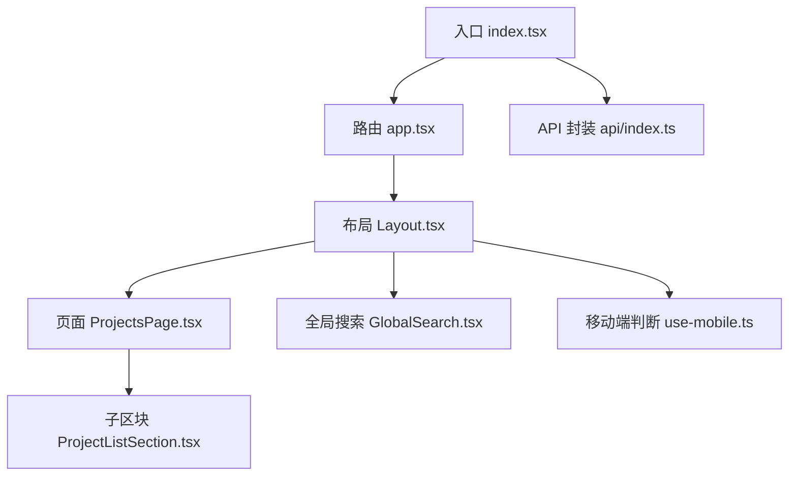
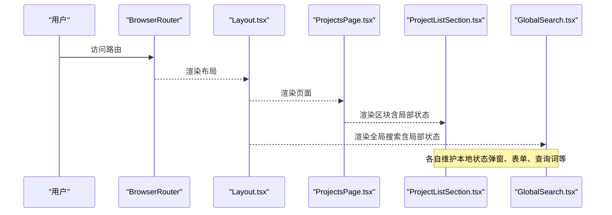
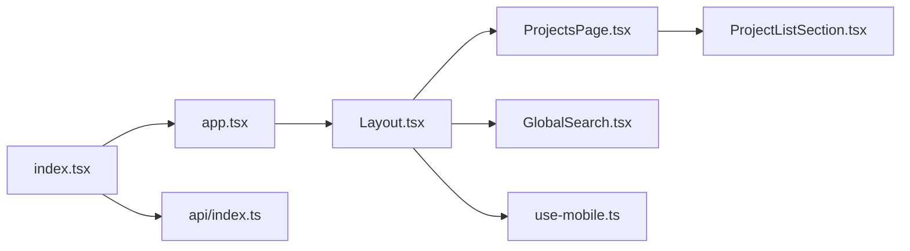

# 状态管理

<cite>
**本文引用的文件**
- [index.tsx](file://webui_ref/client/src/index.tsx)
- [app.tsx](file://webui_ref/client/src/app.tsx)
- [Layout.tsx](file://webui_ref/client/src/components/Layout.tsx)
- [GlobalSearch.tsx](file://webui_ref/client/src/components/GlobalSearch.tsx)
- [ProjectsPage.tsx](file://webui_ref/client/src/pages/ProjectsPage/ProjectsPage.tsx)
- [ProjectListSection.tsx](file://webui_ref/client/src/pages/ProjectsPage/ProjectListSection.tsx)
- [use-mobile.ts](file://webui_ref/client/src/hooks/use-mobile.ts)
- [api/index.ts](file://webui_ref/client/src/api/index.ts)
</cite>

## 目录
1. [简介](#简介)
2. [项目结构](#项目结构)
3. [核心组件](#核心组件)
4. [架构总览](#架构总览)
5. [详细组件分析](#详细组件分析)
6. [依赖关系分析](#依赖关系分析)
7. [性能考量](#性能考量)
8. [故障排查指南](#故障排查指南)
9. [结论](#结论)
10. [附录](#附录)

## 简介
本文件聚焦于前端状态管理，围绕 React 应用中的局部状态（useState、useReducer）、全局状态策略（上下文与跨组件共享）、自定义 Hook 设计模式（数据获取、表单处理、用户交互）、上下文 API 的使用场景与最佳实践、状态持久化与缓存策略、调试与监控工具，以及性能优化与避免不必要重渲染的策略进行系统化说明。文档基于仓库中 webui_ref/client 的实际代码进行分析与归纳，确保内容可落地、可执行。

## 项目结构
前端采用 React + React Router 的页面路由组织方式，入口通过 BrowserRouter 包裹应用并提供错误边界与通知中心；页面级组件按功能模块划分，布局组件负责导航、面包屑与全局交互；搜索等跨页面能力以独立组件实现，并通过本地状态与静态数据进行组合展示。

图表来源
- [index.tsx:1-37](file://webui_ref/client/src/index.tsx#L1-L37)
- [app.tsx:1-56](file://webui_ref/client/src/app.tsx#L1-L56)
- [Layout.tsx:1-200](file://webui_ref/client/src/components/Layout.tsx#L1-L200)
- [ProjectsPage.tsx:1-35](file://webui_ref/client/src/pages/ProjectsPage/ProjectsPage.tsx#L1-L35)
- [ProjectListSection.tsx:1-200](file://webui_ref/client/src/pages/ProjectsPage/ProjectListSection.tsx#L1-L200)
- [GlobalSearch.tsx:1-200](file://webui_ref/client/src/components/GlobalSearch.tsx#L1-L200)
- [use-mobile.ts:1-20](file://webui_ref/client/src/hooks/use-mobile.ts#L1-L20)
- [api/index.ts:1-20](file://webui_ref/client/src/api/index.ts#L1-L20)

章节来源
- [index.tsx:1-37](file://webui_ref/client/src/index.tsx#L1-L37)
- [app.tsx:1-56](file://webui_ref/client/src/app.tsx#L1-L56)

## 核心组件
- 入口与全局容器：使用 BrowserRouter 提供路由上下文，ErrorBoundary 捕获渲染异常，Toaster 提供全局通知。
- 路由层：集中定义页面路由，将不同业务模块映射到对应页面组件。
- 布局层：维护侧边栏、面包屑、用户信息、登出逻辑，并在路由切换时滚动到顶部。
- 页面与区块：页面作为容器，内部由多个区块组件组成，区块内使用 useState/useEffect 管理局部状态（如弹窗、表单、列表筛选）。
- 全局搜索：聚合多类数据源，使用本地状态管理查询词、结果分组与高亮显示。
- 自定义 Hook：封装设备尺寸检测等通用逻辑，便于在多处复用。
- API 封装：统一请求实例与日志记录，为后续数据获取与缓存扩展提供基础。

章节来源
- [index.tsx:1-37](file://webui_ref/client/src/index.tsx#L1-L37)
- [app.tsx:1-56](file://webui_ref/client/src/app.tsx#L1-L56)
- [Layout.tsx:1-200](file://webui_ref/client/src/components/Layout.tsx#L1-L200)
- [ProjectsPage.tsx:1-35](file://webui_ref/client/src/pages/ProjectsPage/ProjectsPage.tsx#L1-L35)
- [ProjectListSection.tsx:1-200](file://webui_ref/client/src/pages/ProjectsPage/ProjectListSection.tsx#L1-L200)
- [GlobalSearch.tsx:1-200](file://webui_ref/client/src/components/GlobalSearch.tsx#L1-L200)
- [use-mobile.ts:1-20](file://webui_ref/client/src/hooks/use-mobile.ts#L1-L20)
- [api/index.ts:1-20](file://webui_ref/client/src/api/index.ts#L1-L20)

## 架构总览
下图展示了从入口到页面再到局部状态管理的调用链路与数据流向，强调局部状态与跨组件通信的方式。

图表来源
- [index.tsx:1-37](file://webui_ref/client/src/index.tsx#L1-L37)
- [app.tsx:1-56](file://webui_ref/client/src/app.tsx#L1-L56)
- [Layout.tsx:1-200](file://webui_ref/client/src/components/Layout.tsx#L1-L200)
- [ProjectsPage.tsx:1-35](file://webui_ref/client/src/pages/ProjectsPage/ProjectsPage.tsx#L1-L35)
- [ProjectListSection.tsx:1-200](file://webui_ref/client/src/pages/ProjectsPage/ProjectListSection.tsx#L1-L200)
- [GlobalSearch.tsx:1-200](file://webui_ref/client/src/components/GlobalSearch.tsx#L1-L200)

## 详细组件分析

### 入口与全局容器（index.tsx）
- 使用 BrowserRouter 提供路由上下文，并设置 basename 以适配部署路径。
- 通过 ErrorBoundary 捕获渲染期错误，结合平台提供的 ErrorRender 展示错误界面与重置能力。
- 使用 createPortal 将 Toaster 挂载到 body，保证全局通知不受层级影响。
- 状态管理要点：入口不持有业务状态，仅负责装配全局能力（路由、错误边界、通知）。

章节来源
- [index.tsx:1-37](file://webui_ref/client/src/index.tsx#L1-L37)

### 路由层（app.tsx）
- 集中声明所有页面路由，将业务模块映射到具体页面组件。
- 状态管理要点：路由本身不承载业务状态，但路由变化会触发页面重新渲染，需配合页面内部状态与副作用管理。

章节来源
- [app.tsx:1-56](file://webui_ref/client/src/app.tsx#L1-L56)

### 布局组件（Layout.tsx）
- 维护侧边栏、面包屑、用户信息与登出流程；在路由切换时滚动到顶部。
- 使用 useState/useEffect 管理搜索面板开关、当前激活项等局部状态。
- 通过 useLocation 读取当前路由，驱动面包屑与导航高亮。
- 状态管理要点：布局内的状态多为 UI 控制型（如菜单展开、搜索面板），避免将业务数据提升到布局层。

章节来源
- [Layout.tsx:1-200](file://webui_ref/client/src/components/Layout.tsx#L1-L200)

### 页面与区块（ProjectsPage.tsx / ProjectListSection.tsx）
- ProjectsPage 作为页面容器，组合统计卡片、风险图表与项目列表区块。
- ProjectListSection 包含大量局部状态：
  - 弹窗打开/关闭状态
  - 表单字段与校验错误状态
  - 列表筛选、排序、分页等交互状态
  - 使用 useMemo/useCallback 优化计算与回调引用稳定性
- 状态管理要点：
  - 表单状态集中在区块内，通过受控输入与校验函数管理。
  - 列表操作（编辑、删除）通过事件回调向上传递，保持区块对数据的局部所有权。
  - 复杂计算（如趋势方向、风险等级）使用派生状态或工具函数，减少重复计算。

章节来源
- [ProjectsPage.tsx:1-35](file://webui_ref/client/src/pages/ProjectsPage/ProjectsPage.tsx#L1-L35)
- [ProjectListSection.tsx:1-200](file://webui_ref/client/src/pages/ProjectsPage/ProjectListSection.tsx#L1-L200)

### 全局搜索（GlobalSearch.tsx）
- 聚合项目、零件、到货记录三类数据，使用本地状态管理：
  - 查询词
  - 搜索结果集合
  - 当前选中项
  - 分组标题与计数
- 使用 useMemo 对搜索结果进行派生计算，提升性能。
- 状态管理要点：
  - 搜索状态完全本地化，避免污染其他组件。
  - 结果高亮与分组展示通过派生状态生成，减少重复渲染。

章节来源
- [GlobalSearch.tsx:1-200](file://webui_ref/client/src/components/GlobalSearch.tsx#L1-L200)

### 自定义 Hook（use-mobile.ts）
- 封装设备宽度检测逻辑，监听窗口尺寸变化，返回布尔值表示是否处于移动端。
- 使用 useEffect 注册/移除事件监听，确保资源释放。
- 状态管理要点：将响应式状态封装为 Hook，便于在任意组件中复用，避免重复逻辑。

章节来源
- [use-mobile.ts:1-20](file://webui_ref/client/src/hooks/use-mobile.ts#L1-L20)

### API 封装（api/index.ts）
- 提供统一的 axios 实例与日志记录，便于后续扩展数据获取、错误处理与重试机制。
- 状态管理要点：当前未直接持有状态，但可作为未来引入数据缓存、请求去抖、批量更新的基础。

章节来源
- [api/index.ts:1-20](file://webui_ref/client/src/api/index.ts#L1-L20)

## 依赖关系分析
- 入口依赖路由与全局容器，路由依赖各页面组件，页面依赖区块组件。
- 布局依赖路由上下文与用户信息 Hook，同时承载全局搜索组件。
- 区块组件依赖类型定义与静态数据，必要时可扩展为异步数据源。
- 自定义 Hook 被多处复用，降低耦合度。

图表来源
- [index.tsx:1-37](file://webui_ref/client/src/index.tsx#L1-L37)
- [app.tsx:1-56](file://webui_ref/client/src/app.tsx#L1-L56)
- [Layout.tsx:1-200](file://webui_ref/client/src/components/Layout.tsx#L1-L200)
- [ProjectsPage.tsx:1-35](file://webui_ref/client/src/pages/ProjectsPage/ProjectsPage.tsx#L1-L35)
- [ProjectListSection.tsx:1-200](file://webui_ref/client/src/pages/ProjectsPage/ProjectListSection.tsx#L1-L200)
- [GlobalSearch.tsx:1-200](file://webui_ref/client/src/components/GlobalSearch.tsx#L1-L200)
- [use-mobile.ts:1-20](file://webui_ref/client/src/hooks/use-mobile.ts#L1-L20)
- [api/index.ts:1-20](file://webui_ref/client/src/api/index.ts#L1-L20)

章节来源
- [Layout.tsx:1-200](file://webui_ref/client/src/components/Layout.tsx#L1-L200)
- [ProjectListSection.tsx:1-200](file://webui_ref/client/src/pages/ProjectsPage/ProjectListSection.tsx#L1-L200)
- [GlobalSearch.tsx:1-200](file://webui_ref/client/src/components/GlobalSearch.tsx#L1-L200)

## 性能考量
- 局部状态最小化：仅在需要的组件内维护状态，避免不必要的提升。
- 派生状态与记忆化：
  - 使用 useMemo 缓存昂贵计算（如搜索结果、趋势方向）。
  - 使用 useCallback 稳定回调引用，减少子组件重渲染。
- 事件与副作用：
  - 在 useEffect 中正确清理监听器（如窗口尺寸监听）。
  - 路由切换时滚动到顶部，避免累积滚动位置导致的体验问题。
- 列表渲染优化：
  - 对大型列表考虑虚拟滚动或分页加载。
  - 使用 key 稳定标识，避免不必要的重建。
- 避免不必要重渲染：
  - 拆分细粒度组件，减少父组件状态变更引发的子树重渲染。
  - 合理使用 React.memo 对纯展示组件进行优化。

[本节为通用性能建议，不直接分析具体文件]

## 故障排查指南
- 错误边界：通过 ErrorBoundary 捕获渲染期错误，结合 ErrorRender 展示错误信息并支持重置。
- 通知系统：使用 Toaster 提供全局提示，便于反馈用户操作结果。
- 常见问题定位：
  - 路由跳转后状态丢失：检查是否在页面卸载时清除了必要状态或缓存。
  - 表单校验异常：确认受控输入与校验逻辑同步更新，避免状态不一致。
  - 搜索无结果：检查查询词与数据源的匹配逻辑，确认 useMemo 依赖是否正确。

章节来源
- [index.tsx:1-37](file://webui_ref/client/src/index.tsx#L1-L37)
- [GlobalSearch.tsx:1-200](file://webui_ref/client/src/components/GlobalSearch.tsx#L1-L200)

## 结论
本项目在前端状态管理方面采用“局部优先、按需共享”的策略：大部分状态位于页面与区块组件内，通过 useState/useEffect 管理 UI 与交互；跨组件能力（如全局搜索、设备尺寸检测）通过独立组件与自定义 Hook 封装；入口与布局提供全局基础设施（路由、错误边界、通知）。该模式清晰、易维护，适合中等规模的前端应用。未来可在 API 层引入缓存与请求去抖，进一步提升性能与用户体验。

[本节为总结性内容，不直接分析具体文件]

## 附录

### 状态管理模式对照表
- 局部状态：useState/useEffect（表单、弹窗、筛选、搜索词）
- 派生状态：useMemo（搜索结果、趋势方向、风险等级）
- 回调稳定：useCallback（事件处理器）
- 自定义 Hook：useIsMobile（设备尺寸检测）
- 全局能力：ErrorBoundary、Toaster、BrowserRouter

[本节为概念性说明，不直接分析具体文件]