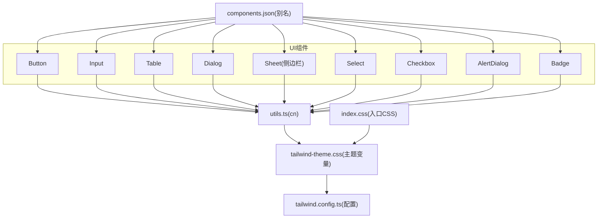
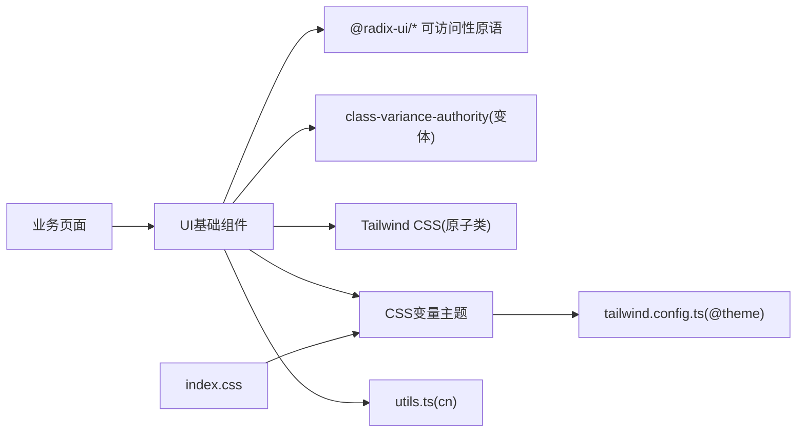
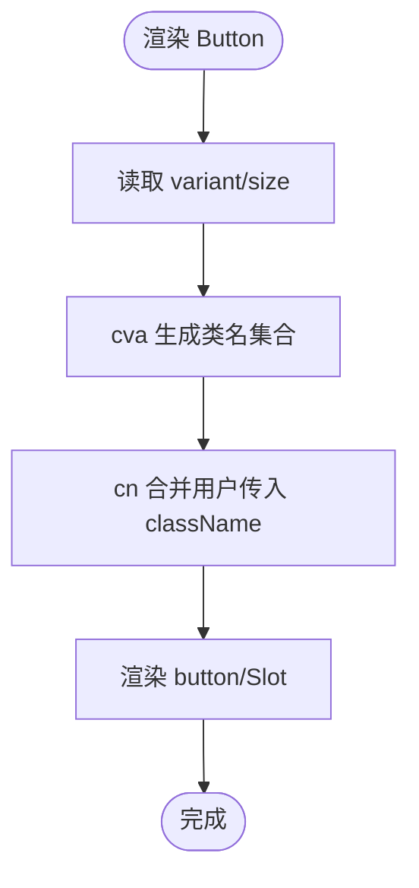
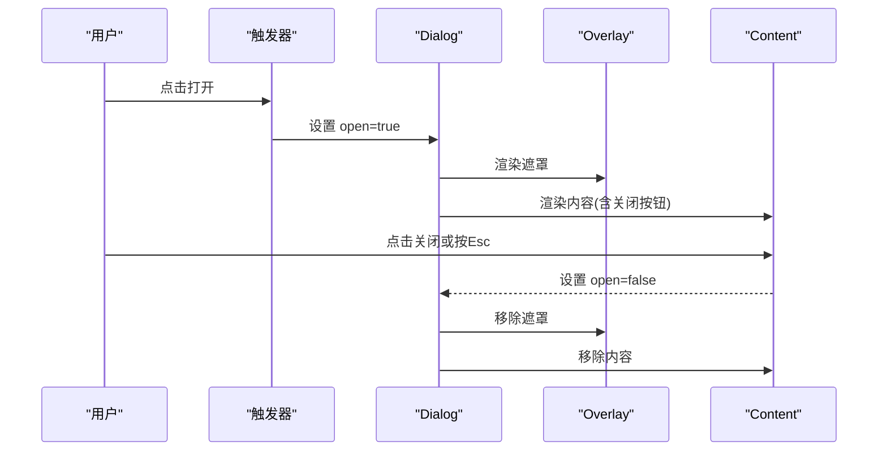
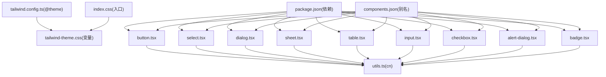

# UI基础组件

<cite>
**本文引用的文件**
- [button.tsx](file://webui_ref/client/src/components/ui/button.tsx)
- [input.tsx](file://webui_ref/client/src/components/ui/input.tsx)
- [table.tsx](file://webui_ref/client/src/components/ui/table.tsx)
- [dialog.tsx](file://webui_ref/client/src/components/ui/dialog.tsx)
- [sheet.tsx](file://webui_ref/client/src/components/ui/sheet.tsx)
- [select.tsx](file://webui_ref/client/src/components/ui/select.tsx)
- [checkbox.tsx](file://webui_ref/client/src/components/ui/checkbox.tsx)
- [alert-dialog.tsx](file://webui_ref/client/src/components/ui/alert-dialog.tsx)
- [badge.tsx](file://webui_ref/client/src/components/ui/badge.tsx)
- [utils.ts](file://webui_ref/client/src/lib/utils.ts)
- [tailwind.config.ts](file://webui_ref/tailwind.config.ts)
- [index.css](file://webui_ref/client/src/index.css)
- [tailwind-theme.css](file://webui_ref/client/src/tailwind-theme.css)
- [components.json](file://webui_ref/components.json)
- [package.json](file://webui_ref/package.json)
</cite>

## 目录
1. [简介](#简介)
2. [项目结构](#项目结构)
3. [核心组件](#核心组件)
4. [架构总览](#架构总览)
5. [详细组件分析](#详细组件分析)
6. [依赖关系分析](#依赖关系分析)
7. [性能考量](#性能考量)
8. [故障排查指南](#故障排查指南)
9. [结论](#结论)
10. [附录](#附录)

## 简介
本文件面向UI基础组件的设计规范与实现标准，覆盖按钮、输入框、表格、对话框、侧边栏等通用组件。文档从主题系统、样式定制、响应式、无障碍访问、国际化、性能优化与测试覆盖等维度进行系统化说明，并提供最佳实践与代码示例路径，帮助团队统一开发标准与质量基线。

## 项目结构
前端UI基础组件位于 webui_ref/client/src/components/ui 目录下，采用基于 Radix UI 的无样式底层组件 + Tailwind CSS 原子类 + class-variance-authority（cva）变体系统的组合方式。主题通过 CSS 变量集中管理，并通过 Tailwind 的 @theme 映射到语义化颜色与阴影。工具函数 cn 负责合并类名，避免冲突并支持条件类。

图表来源
- [button.tsx:1-70](file://webui_ref/client/src/components/ui/button.tsx#L1-L70)
- [input.tsx:1-22](file://webui_ref/client/src/components/ui/input.tsx#L1-L22)
- [table.tsx:1-117](file://webui_ref/client/src/components/ui/table.tsx#L1-L117)
- [dialog.tsx:1-144](file://webui_ref/client/src/components/ui/dialog.tsx#L1-L144)
- [sheet.tsx:1-140](file://webui_ref/client/src/components/ui/sheet.tsx#L1-L140)
- [select.tsx:1-244](file://webui_ref/client/src/components/ui/select.tsx#L1-L244)
- [checkbox.tsx:1-33](file://webui_ref/client/src/components/ui/checkbox.tsx#L1-L33)
- [alert-dialog.tsx:1-158](file://webui_ref/client/src/components/ui/alert-dialog.tsx#L1-L158)
- [badge.tsx:1-43](file://webui_ref/client/src/components/ui/badge.tsx#L1-L43)
- [utils.ts:1-6](file://webui_ref/client/src/lib/utils.ts#L1-L6)
- [tailwind-theme.css:1-260](file://webui_ref/client/src/tailwind-theme.css#L1-L260)
- [tailwind.config.ts:1-9](file://webui_ref/tailwind.config.ts#L1-L9)
- [index.css:1-8](file://webui_ref/client/src/index.css#L1-L8)
- [components.json:1-21](file://webui_ref/components.json#L1-L21)

章节来源
- [components.json:1-21](file://webui_ref/components.json#L1-L21)
- [tailwind.config.ts:1-9](file://webui_ref/tailwind.config.ts#L1-L9)
- [index.css:1-8](file://webui_ref/client/src/index.css#L1-L8)
- [tailwind-theme.css:1-260](file://webui_ref/client/src/tailwind-theme.css#L1-L260)
- [utils.ts:1-6](file://webui_ref/client/src/lib/utils.ts#L1-L6)

## 核心组件
- 按钮 Button：使用 cva 定义多变体与尺寸，支持 asChild 透传；内置 hover/active 提升效果与边框计算。
- 输入框 Input：统一的边框、聚焦环、禁用态与无效态样式，兼容移动端字号。
- 表格 Table：容器滚动、表头/表体/页脚/行/单元格/标题语义化封装，支持选中态高亮。
- 对话框 Dialog：基于 Radix Dialog，包含 Overlay、Content、Header/Footer、Title/Description，提供关闭按钮与动画。
- 侧边栏 Sheet：基于 Radix Dialog 的抽屉面板，支持四向滑入与响应式宽度。
- 选择器 Select：完整封装 Root/Trigger/Content/Item/Label/Separator/Scroll 按钮，处理空值映射与键盘交互。
- 复选框 Checkbox：状态指示、焦点环、禁用态与无效态样式。
- 警告对话框 AlertDialog：在 Dialog 基础上复用按钮变体，提供确认/取消动作。
- 徽章 Badge：用于标签/状态展示，支持多种变体与阴影。

章节来源
- [button.tsx:1-70](file://webui_ref/client/src/components/ui/button.tsx#L1-L70)
- [input.tsx:1-22](file://webui_ref/client/src/components/ui/input.tsx#L1-L22)
- [table.tsx:1-117](file://webui_ref/client/src/components/ui/table.tsx#L1-L117)
- [dialog.tsx:1-144](file://webui_ref/client/src/components/ui/dialog.tsx#L1-L144)
- [sheet.tsx:1-140](file://webui_ref/client/src/components/ui/sheet.tsx#L1-L140)
- [select.tsx:1-244](file://webui_ref/client/src/components/ui/select.tsx#L1-L244)
- [checkbox.tsx:1-33](file://webui_ref/client/src/components/ui/checkbox.tsx#L1-L33)
- [alert-dialog.tsx:1-158](file://webui_ref/client/src/components/ui/alert-dialog.tsx#L1-L158)
- [badge.tsx:1-43](file://webui_ref/client/src/components/ui/badge.tsx#L1-L43)

## 架构总览
UI组件层以Radix为可访问性底座，通过Tailwind原子类与CSS变量实现主题化与样式一致性；通过cva管理变体与尺寸；通过cn合并类名；通过components.json的别名统一导入路径；通过index.css引入主题与排版。

图表来源
- [button.tsx:1-70](file://webui_ref/client/src/components/ui/button.tsx#L1-L70)
- [select.tsx:1-244](file://webui_ref/client/src/components/ui/select.tsx#L1-L244)
- [dialog.tsx:1-144](file://webui_ref/client/src/components/ui/dialog.tsx#L1-L144)
- [tailwind-theme.css:1-260](file://webui_ref/client/src/tailwind-theme.css#L1-L260)
- [tailwind.config.ts:1-9](file://webui_ref/tailwind.config.ts#L1-L9)
- [index.css:1-8](file://webui_ref/client/src/index.css#L1-L8)

## 详细组件分析

### 按钮 Button
- 设计要点
  - 变体：default、destructive、outline、secondary、ghost，适配不同语义与层级。
  - 尺寸：default、sm、lg、icon，最小高度保证内容自适应。
  - 交互：hover/active 提升叠加层，边框自动对比度计算。
  - 可组合：asChild 透传至 Slot，便于与路由/图标等组合。
- 关键实现
  - 使用 cva 声明变体与默认值，结合 cn 合并 className。
  - 通过 data-slot 标记便于测试定位。
- 无障碍
  - 原生 button 语义，focus-visible 聚焦环可见。
- 主题与样式
  - 颜色来自 CSS 变量，边框通过 computed border 变量保持一致深度。
- 性能
  - 无额外渲染开销，纯样式驱动。

图表来源
- [button.tsx:7-69](file://webui_ref/client/src/components/ui/button.tsx#L7-L69)
- [utils.ts:1-6](file://webui_ref/client/src/lib/utils.ts#L1-L6)

章节来源
- [button.tsx:1-70](file://webui_ref/client/src/components/ui/button.tsx#L1-L70)
- [tailwind-theme.css:1-260](file://webui_ref/client/src/tailwind-theme.css#L1-L260)

### 输入框 Input
- 设计要点
  - 统一边框、占位符、禁用态、无效态与聚焦环。
  - 移动端字体缩放与文件上传控件样式兼容。
- 关键实现
  - 直接包裹原生 input，data-slot 便于定位。
  - 通过 aria-invalid 控制错误态样式。
- 无障碍
  - 原生 input 语义，focus-visible 聚焦环。
- 主题与样式
  - 颜色与边框来自主题变量，确保一致体验。

章节来源
- [input.tsx:1-22](file://webui_ref/client/src/components/ui/input.tsx#L1-L22)
- [tailwind-theme.css:1-260](file://webui_ref/client/src/tailwind-theme.css#L1-L260)

### 表格 Table
- 设计要点
  - 容器横向滚动，表头/表体/页脚/行/单元格/标题语义化。
  - 行悬停与选中态高亮，底部 caption 描述。
- 关键实现
  - 每个子组件独立封装，data-slot 标记。
  - 使用 Tailwind 对齐与间距，保持紧凑布局。
- 无障碍
  - 使用 table/thead/tbody/tr/th/td/caption 语义元素。
- 主题与样式
  - 背景与文字色来自主题变量，边框与分隔清晰。

章节来源
- [table.tsx:1-117](file://webui_ref/client/src/components/ui/table.tsx#L1-L117)

### 对话框 Dialog
- 设计要点
  - 基于 Radix Dialog，提供 Overlay、Content、Header/Footer、Title/Description。
  - 支持可选关闭按钮与入场/出场动画。
- 关键实现
  - Portal 挂载到根节点，避免层级问题。
  - 居中定位与最大宽度限制，移动端自适应。
- 无障碍
  - 由 Radix 管理焦点陷阱、Esc 关闭、屏幕阅读器提示。
- 主题与样式
  - 背景遮罩、圆角、阴影与动效统一。

图表来源
- [dialog.tsx:9-143](file://webui_ref/client/src/components/ui/dialog.tsx#L9-L143)

章节来源
- [dialog.tsx:1-144](file://webui_ref/client/src/components/ui/dialog.tsx#L1-L144)

### 侧边栏 Sheet
- 设计要点
  - 基于 Radix Dialog 的抽屉面板，支持 top/right/bottom/left 四向滑入。
  - 响应式宽度与全屏适配，自带关闭按钮。
- 关键实现
  - 通过 side 属性切换滑入方向与边框位置。
  - 使用 Portal 与 Overlay 保证层级与遮罩。
- 无障碍
  - 焦点管理与 Esc 关闭由 Radix 提供。
- 主题与样式
  - 背景、阴影与过渡动画统一。

章节来源
- [sheet.tsx:1-140](file://webui_ref/client/src/components/ui/sheet.tsx#L1-L140)

### 选择器 Select
- 设计要点
  - 完整封装 Root/Trigger/Content/Item/Label/Separator/Scroll 按钮。
  - 支持大小尺寸与空字符串值映射，避免 Radix 内部空值歧义。
- 关键实现
  - Trigger 内嵌下拉箭头，展开时旋转。
  - Content 使用 Popper 定位，支持视口自适应与滚动。
  - Item 支持禁用态与键盘导航。
- 无障碍
  - 键盘操作、ARIA 状态与焦点管理由 Radix 提供。
- 主题与样式
  - 边框、背景、选中态与图标颜色来自主题变量。

章节来源
- [select.tsx:1-244](file://webui_ref/client/src/components/ui/select.tsx#L1-L244)

### 复选框 Checkbox
- 设计要点
  - 勾选状态指示、禁用态与无效态样式。
  - 聚焦环与尺寸固定，适合表单场景。
- 关键实现
  - 基于 Radix Checkbox，Indicator 显示对勾图标。
- 无障碍
  - 原生 checkbox 语义与键盘交互。
- 主题与样式
  - 颜色与边框来自主题变量。

章节来源
- [checkbox.tsx:1-33](file://webui_ref/client/src/components/ui/checkbox.tsx#L1-L33)

### 警告对话框 AlertDialog
- 设计要点
  - 在 Dialog 基础上提供 Action/Cancel 按钮，复用 Button 变体。
  - 用于危险操作的二次确认。
- 关键实现
  - 结构与 Dialog 类似，但强调确认/取消语义。
- 无障碍
  - 焦点与键盘行为由 Radix 管理。
- 主题与样式
  - 按钮样式与对话框样式统一。

章节来源
- [alert-dialog.tsx:1-158](file://webui_ref/client/src/components/ui/alert-dialog.tsx#L1-L158)
- [button.tsx:1-70](file://webui_ref/client/src/components/ui/button.tsx#L1-L70)

### 徽章 Badge
- 设计要点
  - 用于状态/标签展示，不可换行，支持多种变体。
- 关键实现
  - 使用 cva 管理变体，阴影与边框一致。
- 主题与样式
  - 颜色与边框来自主题变量。

章节来源
- [badge.tsx:1-43](file://webui_ref/client/src/components/ui/badge.tsx#L1-L43)

## 依赖关系分析
- 组件依赖
  - 所有UI组件依赖 utils.ts 的 cn 合并类名。
  - 按钮、徽章等使用 class-variance-authority 管理变体。
  - 对话框、侧边栏、选择器等基于 @radix-ui/react-* 提供可访问性与状态管理。
- 主题与样式
  - tailwind-theme.css 定义 CSS 变量与阴影、圆角、字体族。
  - tailwind.config.ts 通过 @theme 将变量映射到 Tailwind 语义化 token。
  - index.css 引入主题与排版样式，作为入口。
- 构建与别名
  - components.json 定义 @/components、@/lib、@/ui 等别名，统一导入路径。
  - package.json 列出 Radix、Tailwind、cva、clsx、tw-animate-css 等依赖。

图表来源
- [package.json:36-189](file://webui_ref/package.json#L36-L189)
- [components.json:1-21](file://webui_ref/components.json#L1-L21)
- [tailwind.config.ts:1-9](file://webui_ref/tailwind.config.ts#L1-L9)
- [tailwind-theme.css:1-260](file://webui_ref/client/src/tailwind-theme.css#L1-L260)
- [index.css:1-8](file://webui_ref/client/src/index.css#L1-L8)
- [button.tsx:1-70](file://webui_ref/client/src/components/ui/button.tsx#L1-L70)
- [select.tsx:1-244](file://webui_ref/client/src/components/ui/select.tsx#L1-L244)
- [dialog.tsx:1-144](file://webui_ref/client/src/components/ui/dialog.tsx#L1-L144)
- [sheet.tsx:1-140](file://webui_ref/client/src/components/ui/sheet.tsx#L1-L140)
- [table.tsx:1-117](file://webui_ref/client/src/components/ui/table.tsx#L1-L117)
- [input.tsx:1-22](file://webui_ref/client/src/components/ui/input.tsx#L1-L22)
- [checkbox.tsx:1-33](file://webui_ref/client/src/components/ui/checkbox.tsx#L1-L33)
- [alert-dialog.tsx:1-158](file://webui_ref/client/src/components/ui/alert-dialog.tsx#L1-L158)
- [badge.tsx:1-43](file://webui_ref/client/src/components/ui/badge.tsx#L1-L43)
- [utils.ts:1-6](file://webui_ref/client/src/lib/utils.ts#L1-L6)

章节来源
- [package.json:36-189](file://webui_ref/package.json#L36-L189)
- [components.json:1-21](file://webui_ref/components.json#L1-L21)
- [tailwind.config.ts:1-9](file://webui_ref/tailwind.config.ts#L1-L9)
- [index.css:1-8](file://webui_ref/client/src/index.css#L1-L8)
- [tailwind-theme.css:1-260](file://webui_ref/client/src/tailwind-theme.css#L1-L260)

## 性能考量
- 样式与主题
  - 使用 CSS 变量与 Tailwind 原子类，减少运行时样式计算；避免重复样式与过度嵌套。
  - 利用 hover/active 提升层（elevate）实现轻量反馈，避免复杂动画。
- 组件渲染
  - 按钮、输入框等轻量组件无状态，渲染成本低。
  - 对话框/侧边栏使用 Portal 挂载，避免父级 overflow 影响；按需渲染内容。
  - 表格容器启用横向滚动，避免列宽过大导致重排。
- 第三方库
  - Radix 提供无样式且高性能的可访问性原语，减少自研复杂度。
  - cva 在编译期生成类名，运行时无额外开销。
- 资源加载
  - 图标使用 lucide-react 矢量图标，按需引入。
  - 动画库 tw-animate-css 提供轻量过渡。

[本节为通用指导，不直接分析具体文件]

## 故障排查指南
- 样式未生效
  - 检查 index.css 是否引入主题与排版样式。
  - 确认 tailwind.config.ts 的 content 路径包含组件目录。
  - 确认 components.json 的别名与导入路径一致。
- 主题变量不生效
  - 确认 tailwind-theme.css 中 :root 变量已定义，并在 @theme 中映射。
  - 若自定义颜色未生效，检查是否在 Tailwind 配置中被覆盖。
- 对话框/侧边栏层级异常
  - 确认使用 Portal 渲染，避免被父容器 z-index 或 overflow:hidden 遮挡。
- 表单验证状态不正确
  - 输入框与选择器通过 aria-invalid 控制错误态，确保上层状态正确传递。
- 键盘交互异常
  - 对话框/侧边栏/选择器的键盘行为由 Radix 管理，检查是否拦截了默认事件。

章节来源
- [index.css:1-8](file://webui_ref/client/src/index.css#L1-L8)
- [tailwind.config.ts:1-9](file://webui_ref/tailwind.config.ts#L1-L9)
- [components.json:1-21](file://webui_ref/components.json#L1-L21)
- [dialog.tsx:1-144](file://webui_ref/client/src/components/ui/dialog.tsx#L1-L144)
- [sheet.tsx:1-140](file://webui_ref/client/src/components/ui/sheet.tsx#L1-L140)
- [select.tsx:1-244](file://webui_ref/client/src/components/ui/select.tsx#L1-L244)
- [input.tsx:1-22](file://webui_ref/client/src/components/ui/input.tsx#L1-L22)

## 结论
本项目UI基础组件以Radix为可访问性底座，结合Tailwind与CSS变量实现主题化与一致性；通过cva管理变体，通过cn合并类名，形成稳定、可扩展的组件体系。建议在业务页面中优先使用这些基础组件，遵循统一的API设计与样式规范，确保可维护性与可访问性。

[本节为总结性内容，不直接分析具体文件]

## 附录

### 主题系统与样式定制
- 主题变量
  - 在 tailwind-theme.css 中定义背景、前景、主色、辅助色、边框、阴影、圆角等变量。
  - 通过 @theme 将变量映射到 Tailwind 语义化 token，如 color-primary、color-background 等。
- 自定义主题
  - 修改 :root 中的变量即可全局切换主题；如需深色模式，可在根节点切换 data-theme 或类名并覆盖变量。
- 按钮与徽章边框
  - 使用 computed border 变量保证在不同主色下的边框对比度一致。

章节来源
- [tailwind-theme.css:1-260](file://webui_ref/client/src/tailwind-theme.css#L1-L260)
- [tailwind.config.ts:1-9](file://webui_ref/tailwind.config.ts#L1-L9)

### 响应式设计
- 表格
  - 容器启用横向滚动，适配小屏设备。
- 对话框/侧边栏
  - 移动端最大宽度与间距调整，确保可用空间。
- 输入框/选择器
  - 移动端字体与触控区域优化。

章节来源
- [table.tsx:1-117](file://webui_ref/client/src/components/ui/table.tsx#L1-L117)
- [dialog.tsx:1-144](file://webui_ref/client/src/components/ui/dialog.tsx#L1-L144)
- [sheet.tsx:1-140](file://webui_ref/client/src/components/ui/sheet.tsx#L1-L140)
- [input.tsx:1-22](file://webui_ref/client/src/components/ui/input.tsx#L1-L22)
- [select.tsx:1-244](file://webui_ref/client/src/components/ui/select.tsx#L1-L244)

### 无障碍访问支持
- 使用 Radix 提供的可访问性原语，确保键盘导航、焦点管理、屏幕阅读器支持。
- 通过 aria-invalid、role、aria-label 等属性增强语义。
- 按钮与输入框保留原生语义，确保浏览器默认行为。

章节来源
- [dialog.tsx:1-144](file://webui_ref/client/src/components/ui/dialog.tsx#L1-L144)
- [sheet.tsx:1-140](file://webui_ref/client/src/components/ui/sheet.tsx#L1-L140)
- [select.tsx:1-244](file://webui_ref/client/src/components/ui/select.tsx#L1-L244)
- [input.tsx:1-22](file://webui_ref/client/src/components/ui/input.tsx#L1-L22)
- [checkbox.tsx:1-33](file://webui_ref/client/src/components/ui/checkbox.tsx#L1-L33)

### 国际化方案
- 当前组件层未内置 i18n，建议在业务层通过 props 传入文案或使用 i18n 库包装。
- 对于固定提示（如“关闭”），可在业务层统一替换，避免硬编码。

[本节为通用指导，不直接分析具体文件]

### 性能优化策略
- 使用 cva 与 Tailwind 原子类，减少运行时样式计算。
- 对话框/侧边栏使用 Portal 避免层级与溢出问题。
- 表格容器滚动避免重排。
- 图标与动画使用轻量库，按需引入。

[本节为通用指导，不直接分析具体文件]

### 测试覆盖方案
- 单元测试
  - 针对按钮、输入框等简单组件，验证 props 与 className 合并逻辑。
  - 针对 Select 的空值映射，验证 onValueChange 回调。
- 交互测试
  - 使用 Radix 的测试工具验证键盘导航、焦点陷阱、Esc 关闭等行为。
- 视觉回归
  - 对对话框、侧边栏、表格等布局组件进行截图对比。

[本节为通用指导，不直接分析具体文件]

### 最佳实践与API设计
- API设计
  - 按钮：variant、size、asChild；输入框：type、disabled、placeholder；表格：语义化子组件；对话框/侧边栏：open、onOpenChange、side（Sheet）。
- 事件处理
  - 表单组件通过 onChange/onValueChange 暴露状态变更；对话框通过 onOpenChange 控制显隐。
- 状态管理
  - 组件保持受控与非受控两种模式，推荐业务层统一管理状态。
- 样式定制
  - 通过 className 扩展样式；主题通过 CSS 变量统一调整。

章节来源
- [button.tsx:1-70](file://webui_ref/client/src/components/ui/button.tsx#L1-L70)
- [input.tsx:1-22](file://webui_ref/client/src/components/ui/input.tsx#L1-L22)
- [table.tsx:1-117](file://webui_ref/client/src/components/ui/table.tsx#L1-L117)
- [dialog.tsx:1-144](file://webui_ref/client/src/components/ui/dialog.tsx#L1-L144)
- [sheet.tsx:1-140](file://webui_ref/client/src/components/ui/sheet.tsx#L1-L140)
- [select.tsx:1-244](file://webui_ref/client/src/components/ui/select.tsx#L1-L244)