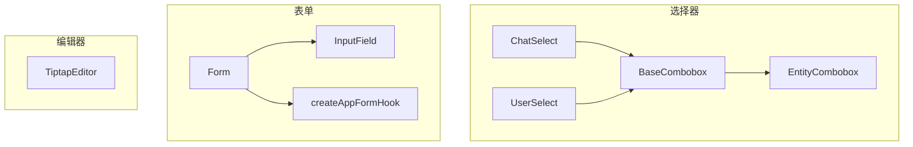
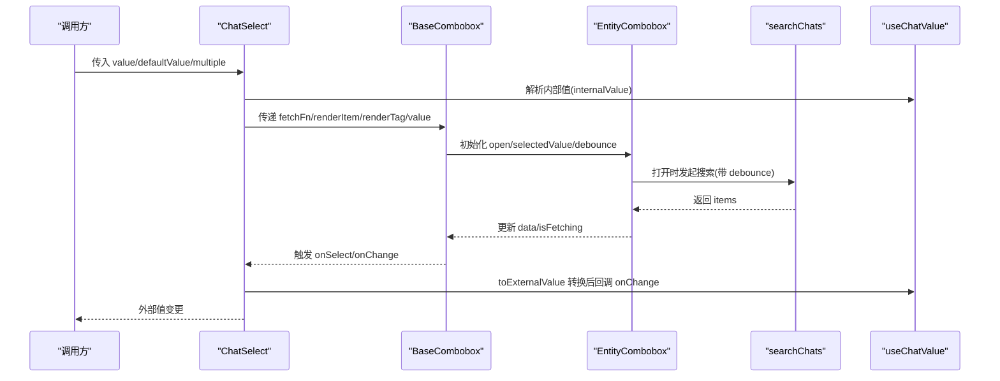
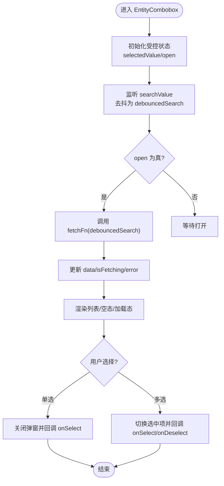
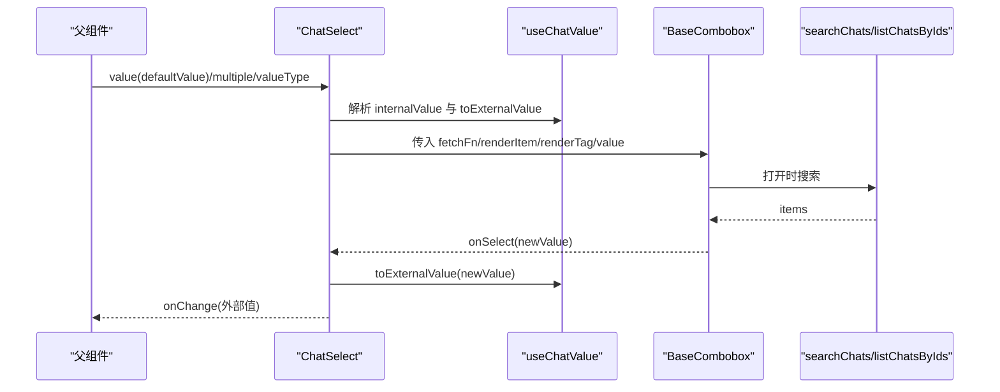
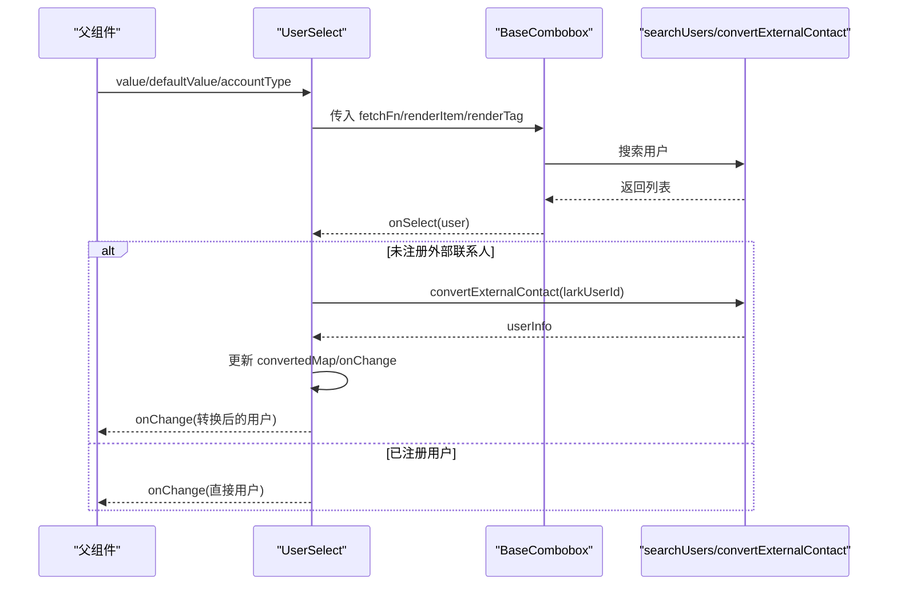
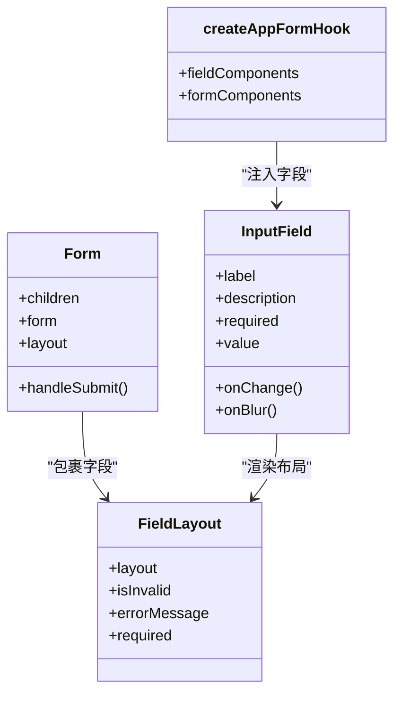
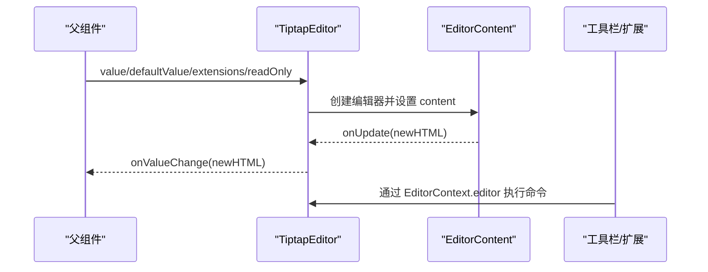
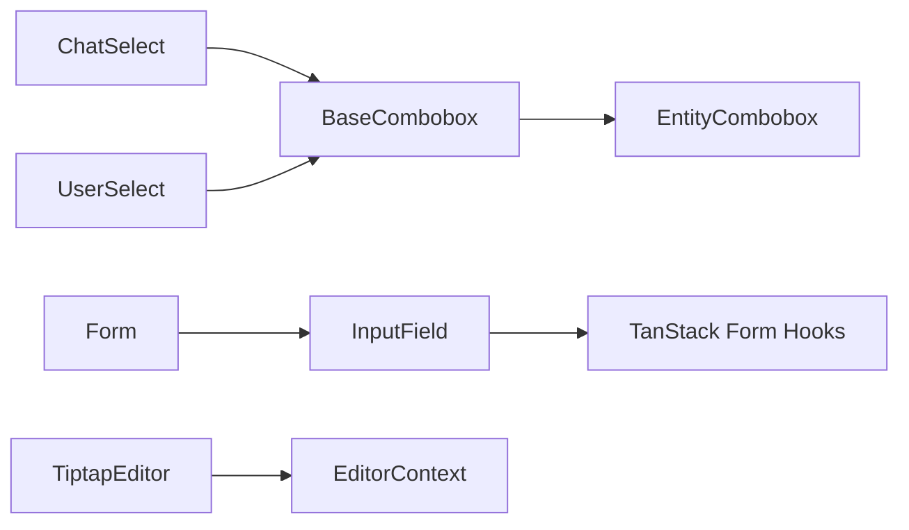

# 业务组件设计

<cite>
**本文引用的文件**
- [webui_ref/client/src/components/business-ui/form/index.tsx](file://webui_ref/client/src/components/business-ui/form/index.tsx)
- [webui_ref/client/src/components/business-ui/form/form.tsx](file://webui_ref/client/src/components/business-ui/form/form.tsx)
- [webui_ref/client/src/components/business-ui/form/input-field.tsx](file://webui_ref/client/src/components/business-ui/form/input-field.tsx)
- [webui_ref/client/src/components/business-ui/form/hooks/form.tsx](file://webui_ref/client/src/components/business-ui/form/hooks/form.tsx)
- [webui_ref/client/src/components/business-ui/entity-combobox/index.tsx](file://webui_ref/client/src/components/business-ui/entity-combobox/index.tsx)
- [webui_ref/client/src/components/business-ui/entity-combobox/entity-combobox.tsx](file://webui_ref/client/src/components/business-ui/entity-combobox/entity-combobox.tsx)
- [webui_ref/client/src/components/business-ui/entity-combobox/base-combobox.tsx](file://webui_ref/client/src/components/business-ui/entity-combobox/base-combobox.tsx)
- [webui_ref/client/src/components/business-ui/chat-select/index.tsx](file://webui_ref/client/src/components/business-ui/chat-select/index.tsx)
- [webui_ref/client/src/components/business-ui/chat-select/chat-select.tsx](file://webui_ref/client/src/components/business-ui/chat-select/chat-select.tsx)
- [webui_ref/client/src/components/business-ui/chat-select/use-chat-value.ts](file://webui_ref/client/src/components/business-ui/chat-select/use-chat-value.ts)
- [webui_ref/client/src/components/business-ui/user-select/index.tsx](file://webui_ref/client/src/components/business-ui/user-select/index.tsx)
- [webui_ref/client/src/components/business-ui/user-select/user-select.tsx](file://webui_ref/client/src/components/business-ui/user-select/user-select.tsx)
- [webui_ref/client/src/components/business-ui/tiptap-editor/index.ts](file://webui_ref/client/src/components/business-ui/tiptap-editor/index.ts)
- [webui_ref/client/src/components/business-ui/tiptap-editor/tiptap-editor.tsx](file://webui_ref/client/src/components/business-ui/tiptap-editor/tiptap-editor.tsx)
</cite>

## 目录
1. [简介](#简介)
2. [项目结构](#项目结构)
3. [核心组件](#核心组件)
4. [架构总览](#架构总览)
5. [详细组件分析](#详细组件分析)
6. [依赖关系分析](#依赖关系分析)
7. [性能考量](#性能考量)
8. [故障排查指南](#故障排查指南)
9. [结论](#结论)
10. [附录](#附录)

## 简介
本文件面向复杂业务组件的设计与实现，聚焦表单组件、选择器组件与编辑器组件三大类。文档从设计原则、状态管理、事件处理、验证机制、可复用性与配置化方案、与 API 层集成模式、错误处理策略以及最佳实践（自定义 Hook、组合式 API、高阶/包装组件）等维度进行系统化阐述，并结合仓库中的实际代码路径给出参考定位，帮助读者快速理解并落地高质量的业务组件。

## 项目结构
业务组件集中在 webui_ref/client/src/components/business-ui 目录下，采用“按能力分层 + 按领域聚合”的组织方式：
- 基础能力层：EntityCombobox 提供通用的下拉选择能力（搜索、分页、多选、受控/非受控、上下文共享）。
- 领域选择器：ChatSelect、UserSelect、DepartmentSelect 等基于 EntityCombobox 组合而成，封装领域数据获取、值转换与展示。
- 表单体系：Form、FieldLayout、InputField 等基于 TanStack Form 扩展，统一布局、校验与字段上下文。
- 编辑器：TiptapEditor 提供富文本编辑能力，支持扩展与工具栏组合。

图表来源
- [webui_ref/client/src/components/business-ui/entity-combobox/entity-combobox.tsx:1-146](file://webui_ref/client/src/components/business-ui/entity-combobox/entity-combobox.tsx#L1-L146)
- [webui_ref/client/src/components/business-ui/entity-combobox/base-combobox.tsx:1-133](file://webui_ref/client/src/components/business-ui/entity-combobox/base-combobox.tsx#L1-L133)
- [webui_ref/client/src/components/business-ui/chat-select/chat-select.tsx:1-198](file://webui_ref/client/src/components/business-ui/chat-select/chat-select.tsx#L1-L198)
- [webui_ref/client/src/components/business-ui/user-select/user-select.tsx:1-360](file://webui_ref/client/src/components/business-ui/user-select/user-select.tsx#L1-L360)
- [webui_ref/client/src/components/business-ui/form/form.tsx:1-55](file://webui_ref/client/src/components/business-ui/form/form.tsx#L1-L55)
- [webui_ref/client/src/components/business-ui/form/input-field.tsx:1-75](file://webui_ref/client/src/components/business-ui/form/input-field.tsx#L1-L75)
- [webui_ref/client/src/components/business-ui/form/hooks/form.tsx:1-41](file://webui_ref/client/src/components/business-ui/form/hooks/form.tsx#L1-L41)

章节来源
- [webui_ref/client/src/components/business-ui/entity-combobox/index.tsx:1-32](file://webui_ref/client/src/components/business-ui/entity-combobox/index.tsx#L1-L32)
- [webui_ref/client/src/components/business-ui/chat-select/index.tsx:1-13](file://webui_ref/client/src/components/business-ui/chat-select/index.tsx#L1-L13)
- [webui_ref/client/src/components/business-ui/user-select/index.tsx:1-29](file://webui_ref/client/src/components/business-ui/user-select/index.tsx#L1-L29)
- [webui_ref/client/src/components/business-ui/form/index.tsx:1-5](file://webui_ref/client/src/components/business-ui/form/index.tsx#L1-L5)
- [webui_ref/client/src/components/business-ui/tiptap-editor/index.ts:1-39](file://webui_ref/client/src/components/business-ui/tiptap-editor/index.ts#L1-L39)

## 核心组件
- 实体组合框（EntityCombobox/BaseCombobox）
  - 职责：统一的搜索、选择、多选、受控/非受控、加载/空态/错误态、上下文共享。
  - 关键特性：debounce 搜索、fetchFn 数据源、getItemValue 标准化、open 状态控制、选择/取消选择/清空回调。
- 聊天选择器（ChatSelect）
  - 职责：基于 BaseCombobox 封装群组搜索与值类型转换（ID/对象），支持标签展示与加载态。
  - 关键特性：useChatValue 负责 ID→对象解析与回写；fetchFn 调用 searchChats。
- 用户选择器（UserSelect）
  - 职责：基于 BaseCombobox 封装用户搜索、外部联系人开户流程、值类型转换。
  - 关键特性：开户拦截与防重复点击、已开户结果回填、open 状态保护。
- 表单系统（Form/InputField/createAppFormHook）
  - 职责：基于 TanStack Form 的表单容器、字段布局、校验与上下文。
  - 关键特性：统一 layout、FieldLayout 渲染、useFieldValidation 校验、createAppFormHook 注入字段组件。
- 富文本编辑器（TiptapEditor）
  - 职责：基于 Tiptap 的受控编辑器，提供内容区、工具栏、扩展点。
  - 关键特性：受控 value 同步、readOnly/ariaDisabled、EditorContext 暴露 editor。

章节来源
- [webui_ref/client/src/components/business-ui/entity-combobox/entity-combobox.tsx:1-146](file://webui_ref/client/src/components/business-ui/entity-combobox/entity-combobox.tsx#L1-L146)
- [webui_ref/client/src/components/business-ui/entity-combobox/base-combobox.tsx:1-133](file://webui_ref/client/src/components/business-ui/entity-combobox/base-combobox.tsx#L1-L133)
- [webui_ref/client/src/components/business-ui/chat-select/chat-select.tsx:1-198](file://webui_ref/client/src/components/business-ui/chat-select/chat-select.tsx#L1-L198)
- [webui_ref/client/src/components/business-ui/chat-select/use-chat-value.ts:1-182](file://webui_ref/client/src/components/business-ui/chat-select/use-chat-value.ts#L1-L182)
- [webui_ref/client/src/components/business-ui/user-select/user-select.tsx:1-360](file://webui_ref/client/src/components/business-ui/user-select/user-select.tsx#L1-L360)
- [webui_ref/client/src/components/business-ui/form/form.tsx:1-55](file://webui_ref/client/src/components/business-ui/form/form.tsx#L1-L55)
- [webui_ref/client/src/components/business-ui/form/input-field.tsx:1-75](file://webui_ref/client/src/components/business-ui/form/input-field.tsx#L1-L75)
- [webui_ref/client/src/components/business-ui/form/hooks/form.tsx:1-41](file://webui_ref/client/src/components/business-ui/form/hooks/form.tsx#L1-L41)
- [webui_ref/client/src/components/business-ui/tiptap-editor/tiptap-editor.tsx:1-170](file://webui_ref/client/src/components/business-ui/tiptap-editor/tiptap-editor.tsx#L1-L170)

## 架构总览
业务组件遵循“通用能力 + 领域封装”的分层架构：
- 通用能力层：EntityCombobox 提供选择器的核心状态机（受控/非受控、搜索去抖、数据请求、选择逻辑）、上下文（open/searchValue/selectedValue/size/disabled 等）与子槽（Search/List/Item/Empty/Loading）。
- 领域封装层：ChatSelect/UserSelect 通过 BaseCombobox 组合，注入 fetchFn、renderItem/renderTag、值转换 Hook（useChatValue/useUserValue），屏蔽底层差异。
- 表单层：Form 作为容器，FieldLayout 统一布局与校验提示，InputField 等具体字段接入 TanStack Form 的 fieldContext 与 useFieldValidation。
- 编辑器层：TiptapEditor 以 EditorContext 暴露 editor，配合工具栏与扩展完成富文本编辑。

图表来源
- [webui_ref/client/src/components/business-ui/chat-select/chat-select.tsx:1-198](file://webui_ref/client/src/components/business-ui/chat-select/chat-select.tsx#L1-L198)
- [webui_ref/client/src/components/business-ui/entity-combobox/base-combobox.tsx:1-133](file://webui_ref/client/src/components/business-ui/entity-combobox/base-combobox.tsx#L1-L133)
- [webui_ref/client/src/components/business-ui/entity-combobox/entity-combobox.tsx:1-146](file://webui_ref/client/src/components/business-ui/entity-combobox/entity-combobox.tsx#L1-L146)
- [webui_ref/client/src/components/business-ui/chat-select/use-chat-value.ts:1-182](file://webui_ref/client/src/components/business-ui/chat-select/use-chat-value.ts#L1-L182)

## 详细组件分析

### 实体组合框（EntityCombobox / BaseCombobox）
- 设计要点
  - 受控与非受控并存：使用 useControllableState 管理 selectedValue 与 open。
  - 搜索去抖：searchValue → debouncedSearch → fetchFn。
  - 选择逻辑：单选关闭弹窗；多选维护数组，支持 onDeselect。
  - 上下文共享：open/searchValue/selectedValue/size/disabled/data/refetch 等通过 Provider 向下透传。
  - 数据适配：getItemValue 将任意 item 标准化为 {id,name,avatar,raw}。
- 复杂度
  - 时间：每次搜索 O(n) 过滤（由后端或前端列表决定）；选择/取消选择 O(k)（k 为选中项数）。
  - 空间：缓存 data 与 selectedValue，O(n)。
- 优化建议
  - 大数据量建议使用虚拟滚动（可在 List 层扩展）。
  - 对 fetchFn 做幂等与重试策略（在领域组件中封装）。

图表来源
- [webui_ref/client/src/components/business-ui/entity-combobox/entity-combobox.tsx:1-146](file://webui_ref/client/src/components/business-ui/entity-combobox/entity-combobox.tsx#L1-L146)
- [webui_ref/client/src/components/business-ui/entity-combobox/base-combobox.tsx:1-133](file://webui_ref/client/src/components/business-ui/entity-combobox/base-combobox.tsx#L1-L133)

章节来源
- [webui_ref/client/src/components/business-ui/entity-combobox/entity-combobox.tsx:1-146](file://webui_ref/client/src/components/business-ui/entity-combobox/entity-combobox.tsx#L1-L146)
- [webui_ref/client/src/components/business-ui/entity-combobox/base-combobox.tsx:1-133](file://webui_ref/client/src/components/business-ui/entity-combobox/base-combobox.tsx#L1-L133)

### 聊天选择器（ChatSelect）
- 设计要点
  - 值类型转换：useChatValue 支持 valueType='string'（ID 模式）与 'object'（Chat 对象模式），并在 ID 模式下通过 listChatsByIds 解析完整信息。
  - 数据源：createChatsFetcher 封装 searchChats，返回 Chat 列表。
  - 展示：ChatItemWrapper/ChatSelectTagWrapper 读取 context.size 与 searchValue，保持视觉一致。
- 事件与状态
  - onChange 通过 toExternalValue 将内部 Chat 转换为外部值（字符串或对象）。
  - 支持多选、标签关闭、最大显示数量等。
- 错误处理
  - 未找到 ID 生成“未知群组”占位，避免白屏。
  - 网络异常记录日志并降级。

图表来源
- [webui_ref/client/src/components/business-ui/chat-select/chat-select.tsx:1-198](file://webui_ref/client/src/components/business-ui/chat-select/chat-select.tsx#L1-L198)
- [webui_ref/client/src/components/business-ui/chat-select/use-chat-value.ts:1-182](file://webui_ref/client/src/components/business-ui/chat-select/use-chat-value.ts#L1-L182)

章节来源
- [webui_ref/client/src/components/business-ui/chat-select/chat-select.tsx:1-198](file://webui_ref/client/src/components/business-ui/chat-select/chat-select.tsx#L1-L198)
- [webui_ref/client/src/components/business-ui/chat-select/use-chat-value.ts:1-182](file://webui_ref/client/src/components/business-ui/chat-select/use-chat-value.ts#L1-L182)
- [webui_ref/client/src/components/business-ui/chat-select/index.tsx:1-13](file://webui_ref/client/src/components/business-ui/chat-select/index.tsx#L1-L13)

### 用户选择器（UserSelect）
- 设计要点
  - 账户类型：accountType='apaas'|'lark'，影响搜索与展示。
  - 外部联系人开户：检测到未注册用户时，阻止关闭弹窗，调用 convertExternalContact 完成开户，成功后回填并更新待选列表。
  - 防重复点击：convertingSet 标记正在开户的用户，禁用对应选项。
  - 值转换：useUserValue 类似 useChatValue，支持 ID/对象两种外部值模式。
- 事件与状态
  - handleChange 过滤未注册用户并设置 pendingConvertRef，阻止 handleOpenChange 关闭。
  - handleSelect 执行开户流程，成功后手动调用 onChange 回填。
- 错误处理
  - 开户失败 toast 提示；finally 清理 convertingSet 与 pending 标记。

图表来源
- [webui_ref/client/src/components/business-ui/user-select/user-select.tsx:1-360](file://webui_ref/client/src/components/business-ui/user-select/user-select.tsx#L1-L360)

章节来源
- [webui_ref/client/src/components/business-ui/user-select/user-select.tsx:1-360](file://webui_ref/client/src/components/business-ui/user-select/user-select.tsx#L1-L360)
- [webui_ref/client/src/components/business-ui/user-select/index.tsx:1-29](file://webui_ref/client/src/components/business-ui/user-select/index.tsx#L1-L29)

### 表单组件（Form / InputField / createAppFormHook）
- 设计要点
  - 容器：Form 提供 FormProvider 与 FieldGroup，统一布局与提交行为。
  - 字段：InputField 接入 fieldContext 与 useFieldValidation，绑定 name/id/value/blur/change，并渲染 FieldLayout 展示 label/description/required/错误信息。
  - 工厂：createAppFormHook 注入常用字段组件（Input/Switch/RadioGroup/Checkbox/Select/Textarea），便于在表单中以 <form.Input /> 形式声明式使用。
- 验证机制
  - 通过 useFieldValidation 获取 isInvalid 与 errorMessage，结合 FieldLayout 展示。
- 事件处理
  - 提交时 form.handleSubmit()，防止默认行为与冒泡。

图表来源
- [webui_ref/client/src/components/business-ui/form/form.tsx:1-55](file://webui_ref/client/src/components/business-ui/form/form.tsx#L1-L55)
- [webui_ref/client/src/components/business-ui/form/input-field.tsx:1-75](file://webui_ref/client/src/components/business-ui/form/input-field.tsx#L1-L75)
- [webui_ref/client/src/components/business-ui/form/hooks/form.tsx:1-41](file://webui_ref/client/src/components/business-ui/form/hooks/form.tsx#L1-L41)

章节来源
- [webui_ref/client/src/components/business-ui/form/form.tsx:1-55](file://webui_ref/client/src/components/business-ui/form/form.tsx#L1-L55)
- [webui_ref/client/src/components/business-ui/form/input-field.tsx:1-75](file://webui_ref/client/src/components/business-ui/form/input-field.tsx#L1-L75)
- [webui_ref/client/src/components/business-ui/form/hooks/form.tsx:1-41](file://webui_ref/client/src/components/business-ui/form/hooks/form.tsx#L1-L41)
- [webui_ref/client/src/components/business-ui/form/index.tsx:1-5](file://webui_ref/client/src/components/business-ui/form/index.tsx#L1-L5)

### 富文本编辑器（TiptapEditor）
- 设计要点
  - 受控：value/defaultValue/onValueChange，内部使用 queueMicrotask 延迟同步以避免 flushSync 冲突。
  - 只读：readOnly/ariaDisabled 控制 editable。
  - 扩展：extensions 默认包含 CompleteKit，支持按需替换。
  - 组合：TiptapEditorContent/TiptapEditorToolbar/TiptapEditorToolbarSeparator 提供插槽式组合。
- 事件与状态
  - onUpdate 回调最新 HTML。
  - EditorContext 暴露 editor，供工具栏按钮调用命令。

图表来源
- [webui_ref/client/src/components/business-ui/tiptap-editor/tiptap-editor.tsx:1-170](file://webui_ref/client/src/components/business-ui/tiptap-editor/tiptap-editor.tsx#L1-L170)
- [webui_ref/client/src/components/business-ui/tiptap-editor/index.ts:1-39](file://webui_ref/client/src/components/business-ui/tiptap-editor/index.ts#L1-L39)

章节来源
- [webui_ref/client/src/components/business-ui/tiptap-editor/tiptap-editor.tsx:1-170](file://webui_ref/client/src/components/business-ui/tiptap-editor/tiptap-editor.tsx#L1-L170)
- [webui_ref/client/src/components/business-ui/tiptap-editor/index.ts:1-39](file://webui_ref/client/src/components/business-ui/tiptap-editor/index.ts#L1-L39)

## 依赖关系分析
- 组件耦合
  - ChatSelect/UserSelect 强依赖 BaseCombobox/EntityCombobox 的状态与上下文，属于“组合式”复用。
  - 表单字段依赖 TanStack Form 的 fieldContext 与 useFieldValidation，形成“框架驱动”的耦合。
  - 编辑器依赖 Tiptap 生态，通过 EditorContext 解耦工具栏与内容区。
- 外部依赖
  - 选择器依赖 API 服务（searchChats/searchUsers/convertExternalContact/listChatsByIds）。
  - 表单依赖 TanStack Form。
  - 编辑器依赖 @tiptap/react 与 Radix UI Slot。
- 潜在循环依赖
  - 当前结构无循环导入迹象，领域组件仅向上依赖通用能力层。

图表来源
- [webui_ref/client/src/components/business-ui/chat-select/chat-select.tsx:1-198](file://webui_ref/client/src/components/business-ui/chat-select/chat-select.tsx#L1-L198)
- [webui_ref/client/src/components/business-ui/user-select/user-select.tsx:1-360](file://webui_ref/client/src/components/business-ui/user-select/user-select.tsx#L1-L360)
- [webui_ref/client/src/components/business-ui/entity-combobox/base-combobox.tsx:1-133](file://webui_ref/client/src/components/business-ui/entity-combobox/base-combobox.tsx#L1-L133)
- [webui_ref/client/src/components/business-ui/entity-combobox/entity-combobox.tsx:1-146](file://webui_ref/client/src/components/business-ui/entity-combobox/entity-combobox.tsx#L1-L146)
- [webui_ref/client/src/components/business-ui/form/form.tsx:1-55](file://webui_ref/client/src/components/business-ui/form/form.tsx#L1-L55)
- [webui_ref/client/src/components/business-ui/form/input-field.tsx:1-75](file://webui_ref/client/src/components/business-ui/form/input-field.tsx#L1-L75)
- [webui_ref/client/src/components/business-ui/tiptap-editor/tiptap-editor.tsx:1-170](file://webui_ref/client/src/components/business-ui/tiptap-editor/tiptap-editor.tsx#L1-L170)

章节来源
- [webui_ref/client/src/components/business-ui/entity-combobox/index.tsx:1-32](file://webui_ref/client/src/components/business-ui/entity-combobox/index.tsx#L1-L32)
- [webui_ref/client/src/components/business-ui/chat-select/index.tsx:1-13](file://webui_ref/client/src/components/business-ui/chat-select/index.tsx#L1-L13)
- [webui_ref/client/src/components/business-ui/user-select/index.tsx:1-29](file://webui_ref/client/src/components/business-ui/user-select/index.tsx#L1-L29)
- [webui_ref/client/src/components/business-ui/form/index.tsx:1-5](file://webui_ref/client/src/components/business-ui/form/index.tsx#L1-L5)
- [webui_ref/client/src/components/business-ui/tiptap-editor/index.ts:1-39](file://webui_ref/client/src/components/business-ui/tiptap-editor/index.ts#L1-L39)

## 性能考量
- 搜索去抖：EntityCombobox 内置 debounce，减少频繁请求。
- 数据缓存：ChatSelect 使用 Map 缓存已解析的 Chat，避免重复请求。
- 列表渲染：建议在 BaseCombobox.List 层引入虚拟滚动以应对大数据集。
- 受控同步：TiptapEditor 使用 queueMicrotask 降低重排开销。
- 最小化重渲染：通过 useMemo/useCallback 稳定引用（如 ChatSelect/UserSelect 的 fetchFn、handleChange）。

[本节为通用指导，不直接分析具体文件]

## 故障排查指南
- 选择器相关问题
  - 搜索无结果：检查 fetchFn 是否被正确传入 BaseCombobox，确认 open 状态与 debounce 参数。
  - 多选状态异常：确认 multiple 与 getItemValue 的 id 唯一性。
  - 用户开户失败：查看 convertExternalContact 的错误分支与 toast 提示，确保 convertingSet 清理。
- 表单相关问题
  - 校验不生效：确认 useFieldValidation 与 FieldLayout 的 isInvalid/message 绑定。
  - 提交无效：检查 Form 的 onSubmit 是否调用 form.handleSubmit()。
- 编辑器相关问题
  - 内容不同步：确认 value 变化时 queueMicrotask 是否执行，readOnly/ariaDisabled 是否正确。
  - 工具栏无效：确认 EditorContext 可用且命令调用时机正确。

章节来源
- [webui_ref/client/src/components/business-ui/user-select/user-select.tsx:1-360](file://webui_ref/client/src/components/business-ui/user-select/user-select.tsx#L1-L360)
- [webui_ref/client/src/components/business-ui/form/form.tsx:1-55](file://webui_ref/client/src/components/business-ui/form/form.tsx#L1-L55)
- [webui_ref/client/src/components/business-ui/form/input-field.tsx:1-75](file://webui_ref/client/src/components/business-ui/form/input-field.tsx#L1-L75)
- [webui_ref/client/src/components/business-ui/tiptap-editor/tiptap-editor.tsx:1-170](file://webui_ref/client/src/components/business-ui/tiptap-editor/tiptap-editor.tsx#L1-L170)

## 结论
该业务组件体系以“通用能力 + 领域封装”为核心，通过 EntityCombobox 抽象选择器共性，ChatSelect/UserSelect 专注领域逻辑与值转换；表单体系基于 TanStack Form 提供一致的布局与校验；编辑器通过 Tiptap 生态实现可扩展的富文本能力。整体具备良好的可复用性、配置化能力与清晰的职责边界，适合在复杂业务场景中持续演进。

[本节为总结性内容，不直接分析具体文件]

## 附录
- 开发最佳实践
  - 优先使用受控模式，保证状态可预测；必要时提供 defaultValue 与非受控用法。
  - 通过 getItemValue 标准化数据，避免下游组件对数据结构强耦合。
  - 使用自定义 Hook（如 useChatValue/useUserValue）封装值转换与异步解析，提升复用度。
  - 组合式 API：BaseCombobox.Content/Search/List/Item/Empty/Loading 支持细粒度定制。
  - 错误处理：在网络层与组件层双重兜底，提供降级展示与用户反馈。
  - 性能：合理使用 useMemo/useCallback，避免不必要的重渲染；大数据列表引入虚拟滚动。
- 参考路径
  - 选择器：[entity-combobox:1-146](file://webui_ref/client/src/components/business-ui/entity-combobox/entity-combobox.tsx#L1-L146)、[base-combobox:1-133](file://webui_ref/client/src/components/business-ui/entity-combobox/base-combobox.tsx#L1-L133)
  - 聊天选择器：[chat-select:1-198](file://webui_ref/client/src/components/business-ui/chat-select/chat-select.tsx#L1-L198)、[use-chat-value:1-182](file://webui_ref/client/src/components/business-ui/chat-select/use-chat-value.ts#L1-L182)
  - 用户选择器：[user-select:1-360](file://webui_ref/client/src/components/business-ui/user-select/user-select.tsx#L1-L360)
  - 表单：[form:1-55](file://webui_ref/client/src/components/business-ui/form/form.tsx#L1-L55)、[input-field:1-75](file://webui_ref/client/src/components/business-ui/form/input-field.tsx#L1-L75)、[createAppFormHook:1-41](file://webui_ref/client/src/components/business-ui/form/hooks/form.tsx#L1-L41)
  - 编辑器：[tiptap-editor:1-170](file://webui_ref/client/src/components/business-ui/tiptap-editor/tiptap-editor.tsx#L1-L170)

[本节为补充说明，不直接分析具体文件]