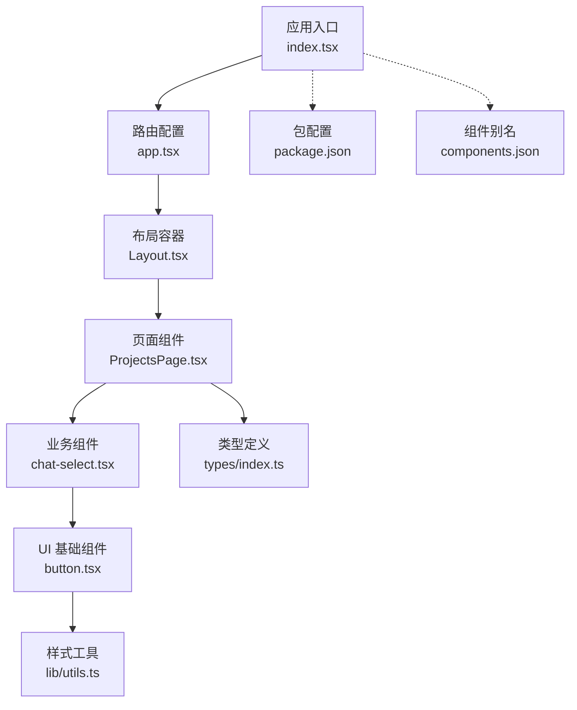
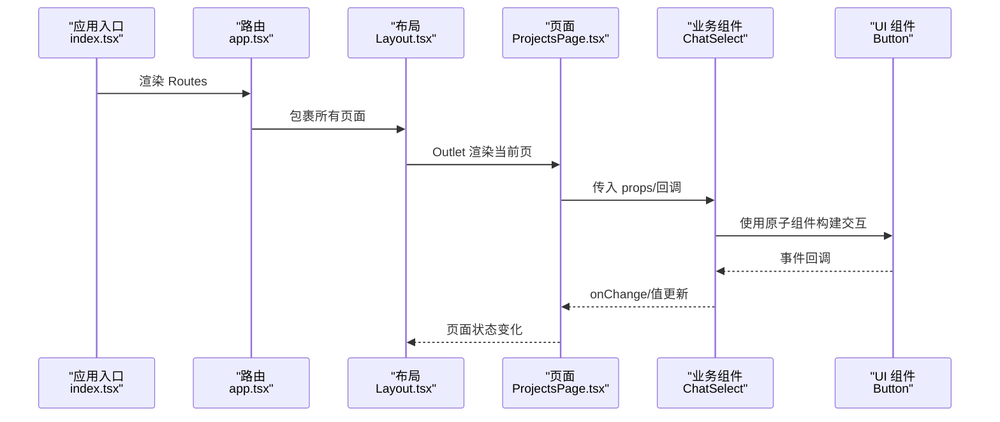
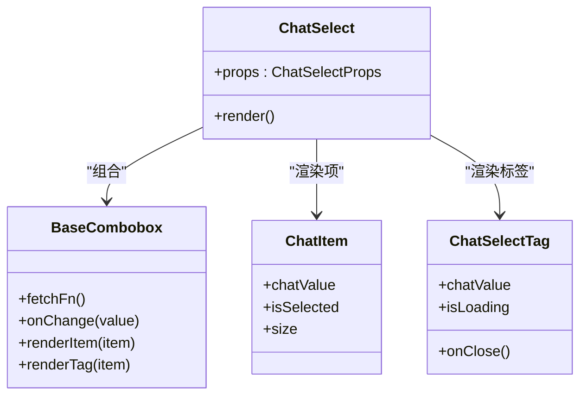
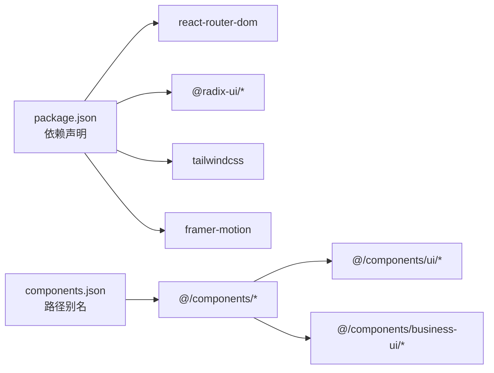

# 组件架构设计

<cite>
**本文引用的文件**
- [index.tsx](file://webui_ref/client/src/index.tsx)
- [app.tsx](file://webui_ref/client/src/app.tsx)
- [Layout.tsx](file://webui_ref/client/src/components/Layout.tsx)
- [ProjectsPage.tsx](file://webui_ref/client/src/pages/ProjectsPage/ProjectsPage.tsx)
- [button.tsx](file://webui_ref/client/src/components/ui/button.tsx)
- [chat-select.tsx](file://webui_ref/client/src/components/business-ui/chat-select/chat-select.tsx)
- [index.ts](file://webui_ref/client/src/types/index.ts)
- [utils.ts](file://webui_ref/client/src/lib/utils.ts)
- [package.json](file://webui_ref/package.json)
- [components.json](file://webui_ref/components.json)
</cite>

## 目录
1. [简介](#简介)
2. [项目结构](#项目结构)
3. [核心组件](#核心组件)
4. [架构总览](#架构总览)
5. [详细组件分析](#详细组件分析)
6. [依赖关系分析](#依赖关系分析)
7. [性能考虑](#性能考虑)
8. [故障排查指南](#故障排查指南)
9. [结论](#结论)
10. [附录](#附录)

## 简介
本文件面向前端工程，系统化阐述 React 组件的分层组织模式与职责边界，覆盖页面组件、业务组件、UI 基础组件的设计原则（单一职责、可复用性、可测试性），并说明组件间通信机制（props、事件回调、状态提升）、目录结构与命名规范、最佳实践与代码示例路径。同时给出性能优化策略与懒加载方案，帮助团队在现有工程基础上持续演进高质量的前端架构。

## 项目结构
本项目采用“按能力分层 + 按领域分模块”的组织方式：
- 应用入口与路由：应用根节点、错误边界、全局容器与路由表集中管理。
- 页面组件（pages）：按业务域划分，每个页面由若干“区块组件”组合而成，聚焦数据展示与交互编排。
- 业务组件（business-ui）：封装跨页面复用的复杂业务控件（如聊天选择器、部门选择器、实体组合框等），内部再拆分为 UI 子组件与工具函数。
- UI 基础组件（ui）：基于 Radix/Tailwind 的原子化 UI 组件（按钮、表单、抽屉、表格等），强调无业务语义、高内聚、低耦合。
- 类型与工具（types、lib）：统一类型定义与样式合并工具，保证前后端契约一致与样式类名安全拼接。

图表来源
- [index.tsx:1-37](file://webui_ref/client/src/index.tsx#L1-L37)
- [app.tsx:1-56](file://webui_ref/client/src/app.tsx#L1-L56)
- [Layout.tsx:1-399](file://webui_ref/client/src/components/Layout.tsx#L1-L399)
- [ProjectsPage.tsx:1-35](file://webui_ref/client/src/pages/ProjectsPage/ProjectsPage.tsx#L1-L35)
- [chat-select.tsx:1-198](file://webui_ref/client/src/components/business-ui/chat-select/chat-select.tsx#L1-L198)
- [button.tsx:1-70](file://webui_ref/client/src/components/ui/button.tsx#L1-L70)
- [index.ts:1-299](file://webui_ref/client/src/types/index.ts#L1-L299)
- [utils.ts:1-6](file://webui_ref/client/src/lib/utils.ts#L1-L6)
- [package.json:1-211](file://webui_ref/package.json#L1-L211)
- [components.json:1-21](file://webui_ref/components.json#L1-L21)

章节来源
- [index.tsx:1-37](file://webui_ref/client/src/index.tsx#L1-L37)
- [app.tsx:1-56](file://webui_ref/client/src/app.tsx#L1-L56)
- [Layout.tsx:1-399](file://webui_ref/client/src/components/Layout.tsx#L1-L399)
- [ProjectsPage.tsx:1-35](file://webui_ref/client/src/pages/ProjectsPage/ProjectsPage.tsx#L1-L35)
- [chat-select.tsx:1-198](file://webui_ref/client/src/components/business-ui/chat-select/chat-select.tsx#L1-L198)
- [button.tsx:1-70](file://webui_ref/client/src/components/ui/button.tsx#L1-L70)
- [index.ts:1-299](file://webui_ref/client/src/types/index.ts#L1-L299)
- [utils.ts:1-6](file://webui_ref/client/src/lib/utils.ts#L1-L6)
- [package.json:1-211](file://webui_ref/package.json#L1-L211)
- [components.json:1-21](file://webui_ref/components.json#L1-L21)

## 核心组件
- 应用入口与全局容器
  - 负责初始化路由、主题容器、错误边界与全局提示，确保异常可恢复、通知全局可用。
- 路由与布局
  - 路由表集中声明页面与资源模块路由；布局组件提供侧边栏、面包屑、用户信息与内容区，承载导航与上下文。
- 页面组件
  - 以 ProjectsPage 为代表，通过组合多个“区块组件”完成页面级编排，关注数据装配与交互流程。
- 业务组件
  - 以 ChatSelect 为代表，封装复杂业务选择逻辑（搜索、分页、多选标签、值转换），对外暴露简洁 props。
- UI 基础组件
  - 以 Button 为代表，基于变体系统（variant/size）与样式工具实现一致的视觉与交互基元。
- 类型与工具
  - types/index.ts 统一定义领域模型与枚举；lib/utils.ts 提供样式类名合并工具，保障样式一致性。

章节来源
- [index.tsx:1-37](file://webui_ref/client/src/index.tsx#L1-L37)
- [app.tsx:1-56](file://webui_ref/client/src/app.tsx#L1-L56)
- [Layout.tsx:1-399](file://webui_ref/client/src/components/Layout.tsx#L1-L399)
- [ProjectsPage.tsx:1-35](file://webui_ref/client/src/pages/ProjectsPage/ProjectsPage.tsx#L1-L35)
- [chat-select.tsx:1-198](file://webui_ref/client/src/components/business-ui/chat-select/chat-select.tsx#L1-L198)
- [button.tsx:1-70](file://webui_ref/client/src/components/ui/button.tsx#L1-L70)
- [index.ts:1-299](file://webui_ref/client/src/types/index.ts#L1-L299)
- [utils.ts:1-6](file://webui_ref/client/src/lib/utils.ts#L1-L6)

## 架构总览
下图展示了从应用入口到页面、再到业务与 UI 组件的调用链路与数据流向，体现“页面编排 → 业务组件 → UI 原子”的分层关系。

图表来源
- [index.tsx:1-37](file://webui_ref/client/src/index.tsx#L1-L37)
- [app.tsx:1-56](file://webui_ref/client/src/app.tsx#L1-L56)
- [Layout.tsx:1-399](file://webui_ref/client/src/components/Layout.tsx#L1-L399)
- [ProjectsPage.tsx:1-35](file://webui_ref/client/src/pages/ProjectsPage/ProjectsPage.tsx#L1-L35)
- [chat-select.tsx:1-198](file://webui_ref/client/src/components/business-ui/chat-select/chat-select.tsx#L1-L198)
- [button.tsx:1-70](file://webui_ref/client/src/components/ui/button.tsx#L1-L70)

## 详细组件分析

### 应用入口与路由
- 职责
  - 挂载根节点、配置路由 basename、注入主题容器与错误边界、挂载全局提示。
- 关键点
  - 错误边界用于捕获渲染期异常并提供恢复能力。
  - 路由表集中维护页面与资源模块路由，便于权限与菜单联动。
- 建议
  - 新增页面时优先在路由表注册，避免分散式路由导致维护困难。

章节来源
- [index.tsx:1-37](file://webui_ref/client/src/index.tsx#L1-L37)
- [app.tsx:1-56](file://webui_ref/client/src/app.tsx#L1-L56)

### 布局组件（Layout）
- 职责
  - 提供侧边栏导航、面包屑、用户信息、全局搜索与通知中心，统一页面骨架。
- 关键点
  - 导航项与面包屑映射集中配置，支持主模块与“试制资源”模块分组。
  - 路由切换时滚动至顶部，提升用户体验。
- 建议
  - 将新增模块的导航与面包屑映射集中在同一处，保持导航一致性。

章节来源
- [Layout.tsx:1-399](file://webui_ref/client/src/components/Layout.tsx#L1-L399)

### 页面组件（以 ProjectsPage 为例）
- 职责
  - 组合统计卡片、风险图表、项目列表等区块，驱动页面级动画与布局。
- 关键点
  - 使用区块化拆分，便于独立测试与复用。
- 建议
  - 页面仅做编排与数据装配，具体交互下沉到区块或业务组件。

章节来源
- [ProjectsPage.tsx:1-35](file://webui_ref/client/src/pages/ProjectsPage/ProjectsPage.tsx#L1-L35)

### 业务组件（以 ChatSelect 为例）
- 职责
  - 封装聊天实体的搜索、选择、多选标签、值格式转换与加载态处理。
- 关键点
  - 通过 BaseCombobox 抽象通用行为，外部仅需传入 fetchFn、渲染函数与回调。
  - 支持受控与非受控模式，自动处理 ID/对象两种值类型。
- 建议
  - 对复杂选择器统一采用“值转换器 + 上下文尺寸/禁用态”的模式，降低接入成本。

章节来源
- [chat-select.tsx:1-198](file://webui_ref/client/src/components/business-ui/chat-select/chat-select.tsx#L1-L198)

### UI 基础组件（以 Button 为例）
- 职责
  - 提供统一的按钮变体（默认、次要、破坏、轮廓、幽灵）与尺寸体系。
- 关键点
  - 基于 class-variance-authority 管理变体，结合样式工具进行类名合并。
- 建议
  - 新增变体需同步更新文档与用例，保证视觉一致性。

章节来源
- [button.tsx:1-70](file://webui_ref/client/src/components/ui/button.tsx#L1-L70)

### 类型与工具
- 类型定义
  - 统一领域模型（项目、零件、到货记录、装配推荐等）与枚举，作为前后端契约与组件 props 的类型基础。
- 样式工具
  - 提供 clsx + tailwind-merge 的 cn 工具，确保动态类名安全合并。

章节来源
- [index.ts:1-299](file://webui_ref/client/src/types/index.ts#L1-L299)
- [utils.ts:1-6](file://webui_ref/client/src/lib/utils.ts#L1-L6)

### 组件类图（ChatSelect 及其依赖）

图表来源
- [chat-select.tsx:1-198](file://webui_ref/client/src/components/business-ui/chat-select/chat-select.tsx#L1-L198)

## 依赖关系分析
- 运行时依赖
  - React、React Router、Radix UI、Tailwind、Framer Motion、Zustand、TanStack Query 等，支撑路由、交互、样式与状态管理。
- 构建与别名
  - components.json 定义 @/components、@/ui、@/lib、@/hooks 等别名，统一导入路径。
- 组件耦合
  - 页面依赖业务组件，业务组件依赖 UI 基础组件；类型定义被多处共享，形成稳定的契约层。

图表来源
- [package.json:1-211](file://webui_ref/package.json#L1-L211)
- [components.json:1-21](file://webui_ref/components.json#L1-L21)

章节来源
- [package.json:1-211](file://webui_ref/package.json#L1-L211)
- [components.json:1-21](file://webui_ref/components.json#L1-L21)

## 性能考虑
- 组件粒度与惰性加载
  - 页面级按需加载：利用 React.lazy + Suspense 对大体积页面进行路由级懒加载，减少首屏体积。
  - 业务组件按需引入：对重型编辑器、图表等组件使用动态 import，仅在需要时加载。
- 渲染优化
  - 使用 memo/useMemo/useCallback 缓存计算结果与回调，避免不必要的重渲染。
  - 列表渲染使用稳定 key，必要时配合虚拟滚动。
- 网络与数据
  - 查询缓存与去抖：对搜索型输入（如 ChatSelect）设置 debounce，减少请求频率。
  - 增量更新与分页：长列表采用分页或无限滚动，避免一次性渲染过多节点。
- 样式与主题
  - 使用 Tailwind 原子类与 cn 工具，减少重复样式与冲突。
  - 主题变量集中管理，便于多主题切换与一致性控制。

[本节为通用指导，不直接分析具体文件]

## 故障排查指南
- 错误边界
  - 应用入口已集成错误边界，可在渲染异常时降级展示并支持重置，便于定位问题组件。
- 常见问题定位
  - 路由跳转后未回到顶部：检查布局中路由监听与滚动逻辑。
  - 组件样式错乱：确认是否正确使用 cn 工具合并类名，避免 Tailwind 类名冲突。
  - 类型不一致：核对 types/index.ts 中的领域模型是否与后端返回一致。
- 调试建议
  - 在业务组件中打印关键 props/state，或使用浏览器开发者工具的组件面板观察状态变化。
  - 对复杂选择器（如 ChatSelect）先以静态数据验证渲染逻辑，再接入真实接口。

章节来源
- [index.tsx:1-37](file://webui_ref/client/src/index.tsx#L1-L37)
- [Layout.tsx:1-399](file://webui_ref/client/src/components/Layout.tsx#L1-L399)
- [chat-select.tsx:1-198](file://webui_ref/client/src/components/business-ui/chat-select/chat-select.tsx#L1-L198)
- [utils.ts:1-6](file://webui_ref/client/src/lib/utils.ts#L1-L6)
- [index.ts:1-299](file://webui_ref/client/src/types/index.ts#L1-L299)

## 结论
本项目采用清晰的分层架构：应用入口与路由负责全局编排，布局组件提供统一外壳，页面组件专注业务编排，业务组件封装复杂交互，UI 基础组件提供原子能力。通过统一的类型定义与样式工具，保证了组件的可复用性与一致性。建议在后续迭代中继续遵循单一职责、可测试性与可维护性原则，逐步完善懒加载与性能优化策略，持续提升用户体验与开发效率。

## 附录
- 组件通信模式
  - Props 传递：父组件向子组件传递数据与回调，子组件通过事件回调上报变更。
  - 事件冒泡与合成事件：在 UI 基础组件中统一处理点击、键盘等事件，向上抛出标准化回调。
  - 状态提升：当多个兄弟组件需要同步状态时，将状态提升至最近公共父组件或布局层。
- 目录与命名规范
  - 目录：pages（页面）、business-ui（业务组件）、ui（UI 基础组件）、types（类型）、lib（工具）。
  - 命名：组件文件名使用 PascalCase，导出默认组件；类型使用 I 前缀（如 IProject）。
- 最佳实践清单
  - 页面只做编排，复杂逻辑下沉到业务组件。
  - 使用受控/非受控双模式，对外暴露最小必要 props。
  - 所有样式通过 cn 工具合并，避免硬编码类名。
  - 对重型组件实施懒加载与缓存策略。
  - 类型先行，确保前后端契约一致。

[本节为通用指导，不直接分析具体文件]