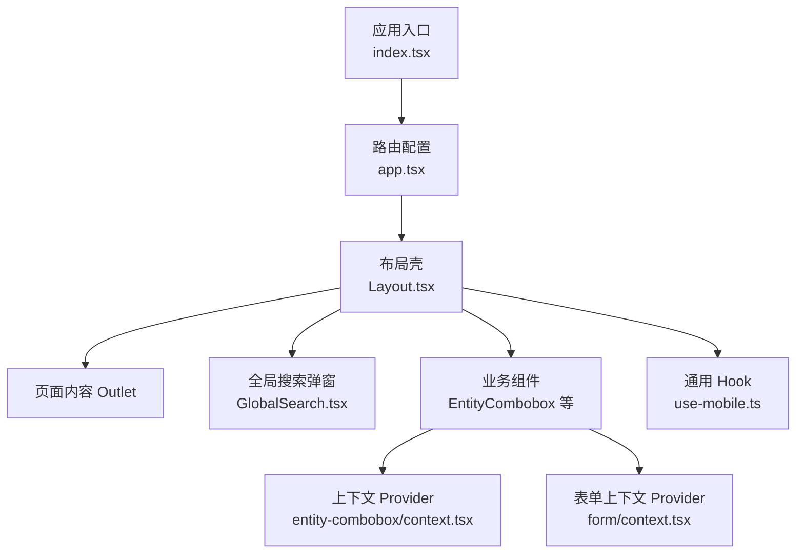
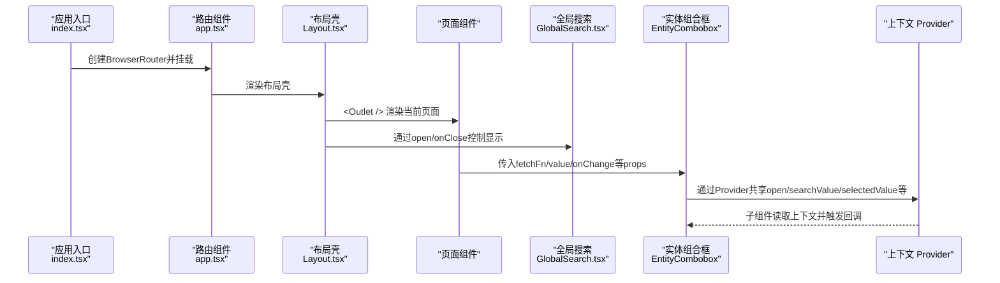
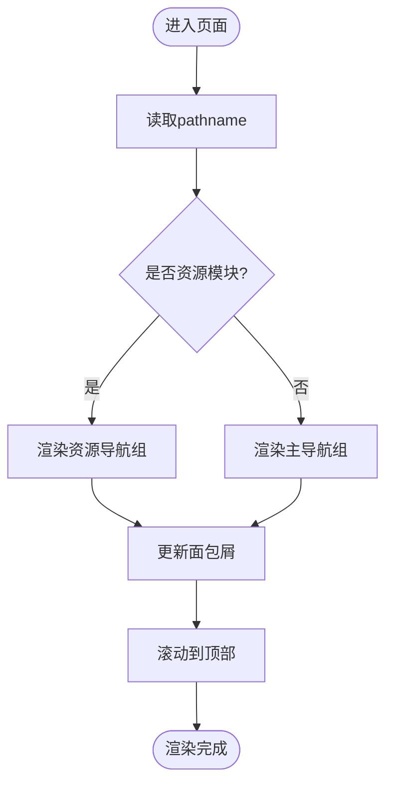
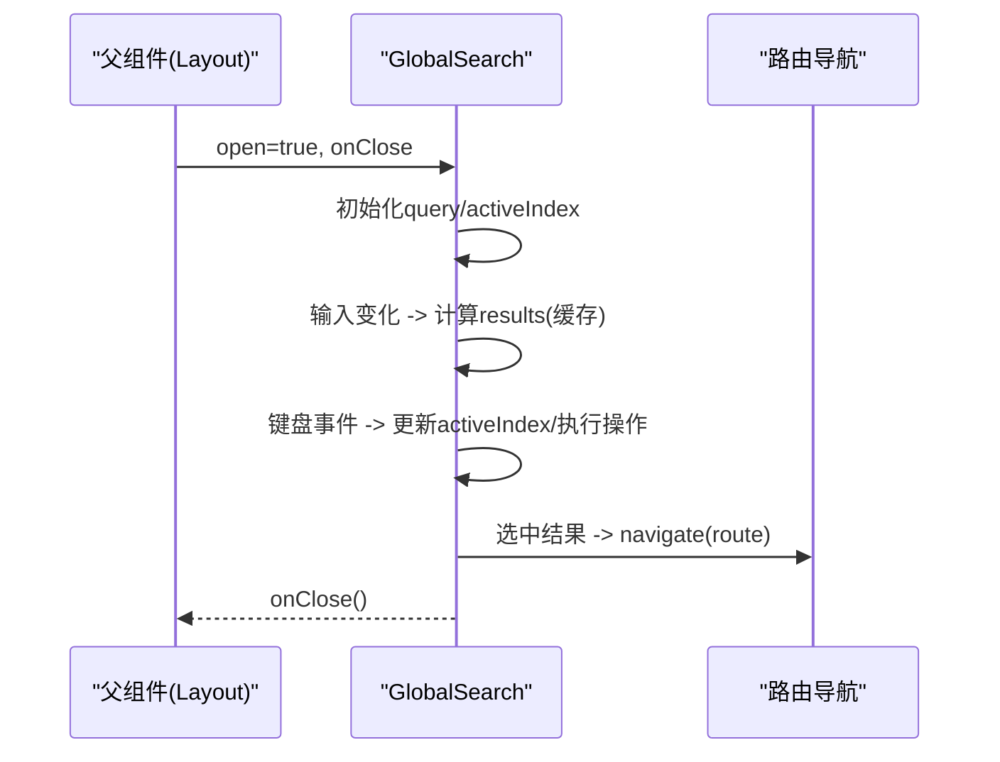
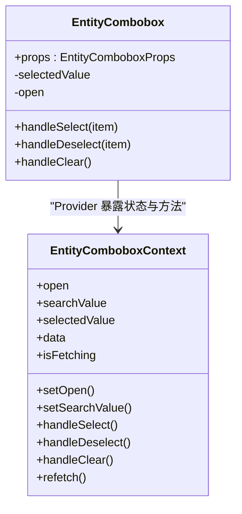
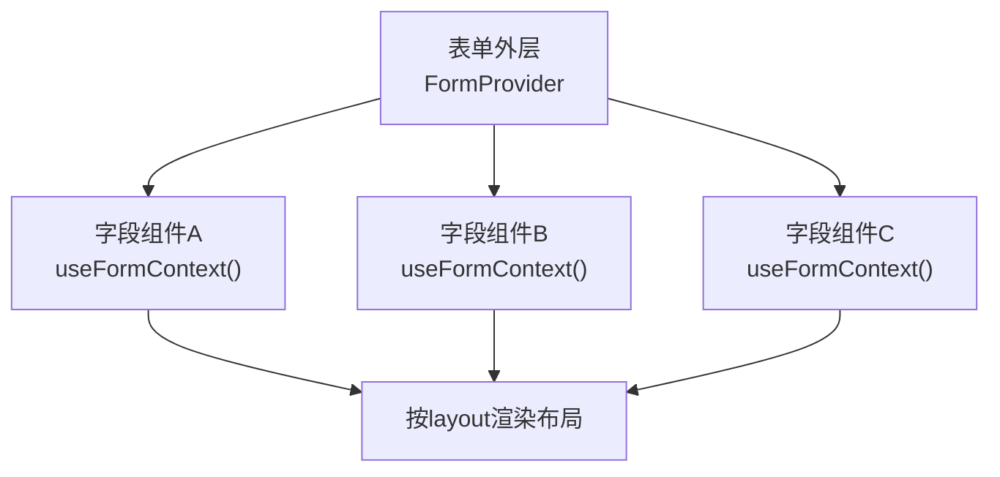
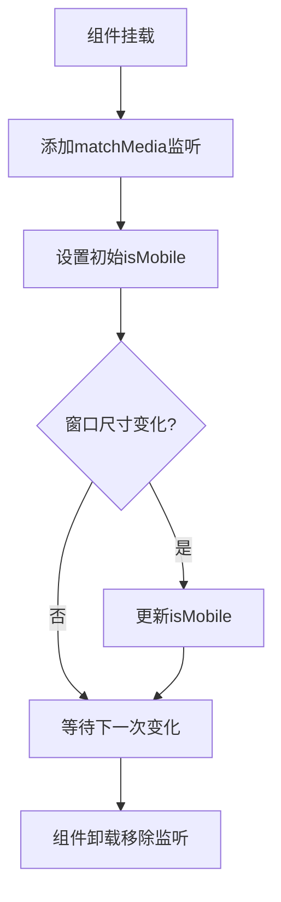
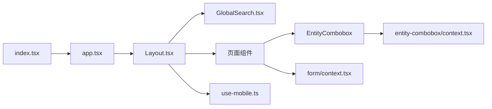

# 组件通信机制

<cite>
**本文引用的文件**
- [index.tsx](file://webui_ref/client/src/index.tsx)
- [app.tsx](file://webui_ref/client/src/app.tsx)
- [Layout.tsx](file://webui_ref/client/src/components/Layout.tsx)
- [GlobalSearch.tsx](file://webui_ref/client/src/components/GlobalSearch.tsx)
- [entity-combobox.tsx](file://webui_ref/client/src/components/business-ui/entity-combobox/entity-combobox.tsx)
- [context.tsx（实体组合框）](file://webui_ref/client/src/components/business-ui/entity-combobox/context.tsx)
- [context.tsx（表单上下文）](file://webui_ref/client/src/components/business-ui/form/context.tsx)
- [use-mobile.ts](file://webui_ref/client/src/hooks/use-mobile.ts)
</cite>

## 目录
1. [简介](#简介)
2. [项目结构](#项目结构)
3. [核心组件](#核心组件)
4. [架构总览](#架构总览)
5. [详细组件分析](#详细组件分析)
6. [依赖关系分析](#依赖关系分析)
7. [性能考量](#性能考量)
8. [故障排查指南](#故障排查指南)
9. [结论](#结论)
10. [附录](#附录)

## 简介
本文件聚焦于前端 React 应用的组件通信机制，围绕数据传递与事件通信模式展开，涵盖 props 传递、事件回调、状态提升、上下文 API（Context）、以及跨层级组件协作。结合仓库中的实际代码，说明全局/局部/异步状态的组织方式，并给出解耦设计、性能优化与内存泄漏防护的实践建议。同时提供基于本项目实现的自定义 Hook、Provider 模式等高级通信模式的要点与参考路径。

## 项目结构
应用以 React Router 管理页面路由，根入口通过 BrowserRouter 包裹应用并提供错误边界与主题容器；布局层 Layout 负责侧边栏、面包屑、用户信息与全局搜索弹窗；业务组件通过 Context 与受控组件模式实现内部状态共享与跨子组件通信；通用 Hook 封装设备适配等横切能力。

图表来源
- [index.tsx:16-36](file://webui_ref/client/src/index.tsx#L16-L36)
- [app.tsx:26-55](file://webui_ref/client/src/app.tsx#L26-L55)
- [Layout.tsx:162-399](file://webui_ref/client/src/components/Layout.tsx#L162-L399)
- [GlobalSearch.tsx:217-504](file://webui_ref/client/src/components/GlobalSearch.tsx#L217-L504)
- [entity-combobox.tsx:14-146](file://webui_ref/client/src/components/business-ui/entity-combobox/entity-combobox.tsx#L14-L146)
- [context.tsx（实体组合框）:1-20](file://webui_ref/client/src/components/business-ui/entity-combobox/context.tsx#L1-L20)
- [context.tsx（表单上下文）:1-39](file://webui_ref/client/src/components/business-ui/form/context.tsx#L1-L39)
- [use-mobile.ts:1-20](file://webui_ref/client/src/hooks/use-mobile.ts#L1-L20)

章节来源
- [index.tsx:16-36](file://webui_ref/client/src/index.tsx#L16-L36)
- [app.tsx:26-55](file://webui_ref/client/src/app.tsx#L26-L55)
- [Layout.tsx:162-399](file://webui_ref/client/src/components/Layout.tsx#L162-L399)

## 核心组件
- 应用入口与路由：在根入口中创建浏览器路由、错误边界与主题容器，并将路由组件挂载到 DOM。路由集中定义各页面路径与对应组件，便于统一导航与权限控制。
- 布局组件：承载侧边栏、顶部栏、面包屑、用户信息、全局搜索弹窗与页面内容区。通过路由钩子获取当前路径，驱动 UI 状态（如高亮菜单项、面包屑标题）。
- 全局搜索弹窗：作为独立浮层组件，接收 open/onClose 的 props，内部维护查询词、结果集与键盘交互逻辑，并通过路由跳转完成导航。
- 实体组合框（EntityCombobox）：采用“受控状态 + 上下文”的组合，将选择状态、打开状态、搜索与数据请求等能力聚合，并通过 Context 暴露给子组件消费。
- 表单上下文（FormContext）：为表单族组件提供统一的布局与行为约定，避免层层透传重复配置。
- 通用 Hook（useIsMobile）：封装响应式断点监听，提供 isMobile 布尔值，供布局或组件根据设备尺寸调整交互。

章节来源
- [index.tsx:16-36](file://webui_ref/client/src/index.tsx#L16-L36)
- [app.tsx:26-55](file://webui_ref/client/src/app.tsx#L26-L55)
- [Layout.tsx:162-399](file://webui_ref/client/src/components/Layout.tsx#L162-L399)
- [GlobalSearch.tsx:217-504](file://webui_ref/client/src/components/GlobalSearch.tsx#L217-L504)
- [entity-combobox.tsx:14-146](file://webui_ref/client/src/components/business-ui/entity-combobox/entity-combobox.tsx#L14-L146)
- [context.tsx（实体组合框）:1-20](file://webui_ref/client/src/components/business-ui/entity-combobox/context.tsx#L1-L20)
- [context.tsx（表单上下文）:1-39](file://webui_ref/client/src/components/business-ui/form/context.tsx#L1-L39)
- [use-mobile.ts:1-20](file://webui_ref/client/src/hooks/use-mobile.ts#L1-L20)

## 架构总览
下图展示了从入口到页面再到业务组件的调用链路与通信方式：路由决定渲染哪个页面，布局提供全局外壳，业务组件通过 props、Context 与自定义 Hook 进行通信与状态共享。

图表来源
- [index.tsx:16-36](file://webui_ref/client/src/index.tsx#L16-L36)
- [app.tsx:26-55](file://webui_ref/client/src/app.tsx#L26-L55)
- [Layout.tsx:162-399](file://webui_ref/client/src/components/Layout.tsx#L162-L399)
- [GlobalSearch.tsx:217-504](file://webui_ref/client/src/components/GlobalSearch.tsx#L217-L504)
- [entity-combobox.tsx:14-146](file://webui_ref/client/src/components/business-ui/entity-combobox/entity-combobox.tsx#L14-L146)
- [context.tsx（实体组合框）:1-20](file://webui_ref/client/src/components/business-ui/entity-combobox/context.tsx#L1-L20)

## 详细组件分析

### 布局与路由通信（Layout + app.tsx）
- 路由驱动 UI：使用 useLocation 获取 pathname，用于高亮菜单项、计算面包屑标题、滚动到顶部等行为。
- 父子通信：Layout 通过 props 控制全局搜索弹窗的 open/onClose；页面通过 <Outlet /> 注入到布局的内容区域。
- 跨模块导航：资源模块与主模块通过统一的路径前缀组织，便于在布局中区分渲染不同的导航分组。

图表来源
- [Layout.tsx:78-160](file://webui_ref/client/src/components/Layout.tsx#L78-L160)
- [Layout.tsx:162-399](file://webui_ref/client/src/components/Layout.tsx#L162-L399)
- [app.tsx:26-55](file://webui_ref/client/src/app.tsx#L26-L55)

章节来源
- [Layout.tsx:78-160](file://webui_ref/client/src/components/Layout.tsx#L78-L160)
- [Layout.tsx:162-399](file://webui_ref/client/src/components/Layout.tsx#L162-L399)
- [app.tsx:26-55](file://webui_ref/client/src/app.tsx#L26-L55)

### 全局搜索弹窗（GlobalSearch）
- 通信模式：父组件通过 open/onClose 控制弹窗显隐；弹窗内部维护查询词、结果集与键盘导航状态。
- 事件回调：点击搜索结果后，通过路由跳转并关闭弹窗；支持 ESC 关闭、方向键导航与回车打开。
- 性能优化：使用 useMemo 对搜索结果进行分组与统计，减少重复计算；使用 useRef 聚焦输入框，避免不必要的重渲染。

图表来源
- [GlobalSearch.tsx:217-504](file://webui_ref/client/src/components/GlobalSearch.tsx#L217-L504)

章节来源
- [GlobalSearch.tsx:217-504](file://webui_ref/client/src/components/GlobalSearch.tsx#L217-L504)

### 实体组合框（EntityCombobox）与上下文
- 受控状态：通过 useControllableState 管理 selectedValue 与 open，支持外部 value/open 与默认值，并在变更时触发 onChange/onOpenChange。
- 上下文共享：将 open、searchValue、selectedValue、handleSelect/handleDeselect/handleClear、数据加载状态等放入 Context，供子组件（如列表、标签、清空按钮）直接消费，避免深层 props 透传。
- 异步数据：封装 useFetchData 处理 fetchFn、搜索参数与 enabled 开关，支持 refetch 与状态反馈（isFetching/isError/isSuccess）。

图表来源
- [entity-combobox.tsx:14-146](file://webui_ref/client/src/components/business-ui/entity-combobox/entity-combobox.tsx#L14-L146)
- [context.tsx（实体组合框）:1-20](file://webui_ref/client/src/components/business-ui/entity-combobox/context.tsx#L1-L20)

章节来源
- [entity-combobox.tsx:14-146](file://webui_ref/client/src/components/business-ui/entity-combobox/entity-combobox.tsx#L14-L146)
- [context.tsx（实体组合框）:1-20](file://webui_ref/client/src/components/business-ui/entity-combobox/context.tsx#L1-L20)

### 表单上下文（FormContext）
- 作用：为表单族组件提供统一的布局模式（vertical/responsive/horizontal），避免在每个字段组件中重复判断。
- 使用方式：在表单外层包裹 FormProvider，子组件通过 useFormContext 读取布局配置，保证一致的视觉与交互。

图表来源
- [context.tsx（表单上下文）:1-39](file://webui_ref/client/src/components/business-ui/form/context.tsx#L1-L39)

章节来源
- [context.tsx（表单上下文）:1-39](file://webui_ref/client/src/components/business-ui/form/context.tsx#L1-L39)

### 通用 Hook（useIsMobile）
- 功能：监听窗口宽度变化，返回 isMobile 布尔值，用于响应式布局切换。
- 生命周期：在 effect 中注册/移除事件监听，确保组件卸载时清理，防止内存泄漏。

图表来源
- [use-mobile.ts:1-20](file://webui_ref/client/src/hooks/use-mobile.ts#L1-L20)

章节来源
- [use-mobile.ts:1-20](file://webui_ref/client/src/hooks/use-mobile.ts#L1-L20)

## 依赖关系分析
- 入口依赖路由与错误边界，路由依赖布局与各页面组件。
- 布局依赖路由钩子、UI 组件库与全局搜索弹窗。
- 业务组件依赖上下文与自定义 Hook，形成“组件内聚 + 上下文共享”的通信模式。
- 无循环依赖迹象：入口 → 路由 → 布局 → 页面/弹窗 → 业务组件 → 上下文/Hook，层次清晰。

图表来源
- [index.tsx:16-36](file://webui_ref/client/src/index.tsx#L16-L36)
- [app.tsx:26-55](file://webui_ref/client/src/app.tsx#L26-L55)
- [Layout.tsx:162-399](file://webui_ref/client/src/components/Layout.tsx#L162-L399)
- [GlobalSearch.tsx:217-504](file://webui_ref/client/src/components/GlobalSearch.tsx#L217-L504)
- [entity-combobox.tsx:14-146](file://webui_ref/client/src/components/business-ui/entity-combobox/entity-combobox.tsx#L14-L146)
- [context.tsx（实体组合框）:1-20](file://webui_ref/client/src/components/business-ui/entity-combobox/context.tsx#L1-L20)
- [context.tsx（表单上下文）:1-39](file://webui_ref/client/src/components/business-ui/form/context.tsx#L1-L39)
- [use-mobile.ts:1-20](file://webui_ref/client/src/hooks/use-mobile.ts#L1-L20)

章节来源
- [index.tsx:16-36](file://webui_ref/client/src/index.tsx#L16-L36)
- [app.tsx:26-55](file://webui_ref/client/src/app.tsx#L26-L55)
- [Layout.tsx:162-399](file://webui_ref/client/src/components/Layout.tsx#L162-L399)

## 性能考量
- 减少不必要重渲染
  - 使用 useMemo 缓存搜索结果与分组统计，避免每次输入都重新计算。
  - 使用 useCallback 稳定回调引用，降低子组件因 props 引用变化导致的重渲染。
- 合理拆分与懒加载
  - 将全局搜索弹窗与复杂业务组件按需渲染，仅在 open 时构建 DOM。
- 事件监听清理
  - 在 useEffect 中正确移除事件监听（如 matchMedia），防止内存泄漏。
- 上下文粒度
  - 将频繁变化的状态与稳定的方法分离，必要时拆分为多个 Context，缩小订阅范围。
- 受控与非受控结合
  - 对外暴露受控接口（value/onChange），内部维护非受控状态以提升交互流畅度。

[本节为通用指导，不直接分析具体文件]

## 故障排查指南
- 上下文未提供导致报错
  - 现象：在 Context 消费者中使用 useContext 抛出“必须在 Provider 内使用”的错误。
  - 排查：确认组件树中存在对应的 Provider 包裹；检查导入路径与作用域。
  - 参考位置：[context.tsx（实体组合框）:11-19](file://webui_ref/client/src/components/business-ui/entity-combobox/context.tsx#L11-L19)、[context.tsx（表单上下文）:13-19](file://webui_ref/client/src/components/business-ui/form/context.tsx#L13-L19)
- 路由跳转无效
  - 现象：点击搜索结果无反应或跳转到错误路径。
  - 排查：确认是否在 BrowserRouter 内；检查 navigate 调用与路由定义是否匹配。
  - 参考位置：[index.tsx:18-32](file://webui_ref/client/src/index.tsx#L18-L32)、[GlobalSearch.tsx:324-330](file://webui_ref/client/src/components/GlobalSearch.tsx#L324-L330)
- 弹窗无法关闭或焦点异常
  - 现象：ESC 无效或输入框未自动聚焦。
  - 排查：检查 onClose 是否正确传递给父组件；确认 focus 时机与 ref 可用性。
  - 参考位置：[GlobalSearch.tsx:229-236](file://webui_ref/client/src/components/GlobalSearch.tsx#L229-L236)、[GlobalSearch.tsx:305-322](file://webui_ref/client/src/components/GlobalSearch.tsx#L305-L322)
- 内存泄漏风险
  - 现象：组件卸载后仍有定时器/监听器运行。
  - 排查：确保在 useEffect 的清理函数中移除监听器与取消请求。
  - 参考位置：[use-mobile.ts:8-16](file://webui_ref/client/src/hooks/use-mobile.ts#L8-L16)

章节来源
- [context.tsx（实体组合框）:11-19](file://webui_ref/client/src/components/business-ui/entity-combobox/context.tsx#L11-L19)
- [context.tsx（表单上下文）:13-19](file://webui_ref/client/src/components/business-ui/form/context.tsx#L13-L19)
- [index.tsx:18-32](file://webui_ref/client/src/index.tsx#L18-L32)
- [GlobalSearch.tsx:229-236](file://webui_ref/client/src/components/GlobalSearch.tsx#L229-L236)
- [GlobalSearch.tsx:305-322](file://webui_ref/client/src/components/GlobalSearch.tsx#L305-L322)
- [use-mobile.ts:8-16](file://webui_ref/client/src/hooks/use-mobile.ts#L8-L16)

## 结论
本项目采用“路由驱动 + 布局外壳 + 上下文共享 + 受控组件”的通信体系，实现了清晰的层级与职责划分。通过 Context 解决跨层级状态共享，通过 props 与回调实现父子通信，通过自定义 Hook 封装横切能力。配合合理的性能优化与生命周期管理，保证了可维护性与扩展性。建议在后续演进中继续遵循“最小化上下文粒度”“受控与非受控结合”“严格清理副作用”的原则，持续提升组件通信的质量与稳定性。

[本节为总结性内容，不直接分析具体文件]

## 附录
- 最佳实践清单
  - 使用受控组件管理关键状态，对外暴露 value/onChange，内部维护非受控以提升体验。
  - 将频繁变动的状态与稳定方法拆分到不同 Context，减少无关组件重渲染。
  - 在 effect 中注册/移除事件监听，避免内存泄漏。
  - 使用 useMemo/useCallback 缓存计算结果与回调，降低重渲染成本。
  - 通过路由集中管理页面跳转，保持导航一致性。
- 高级模式参考
  - Provider 模式：见表单上下文与实体组合框上下文，适合跨多层级共享配置与能力。
  - 自定义 Hook：如 useIsMobile，封装设备适配逻辑，复用性强。
  - 事件总线：在本项目中未直接使用，可通过 Context 或轻量发布订阅替代，注意作用域与清理。

[本节为通用指导，不直接分析具体文件]