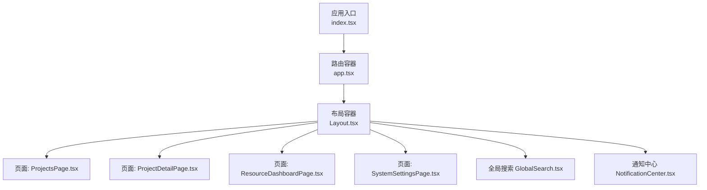
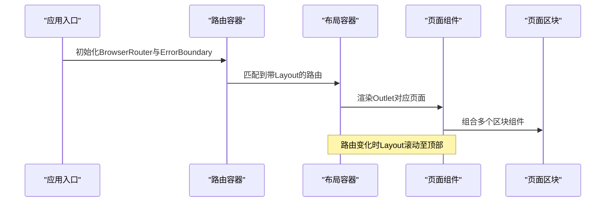
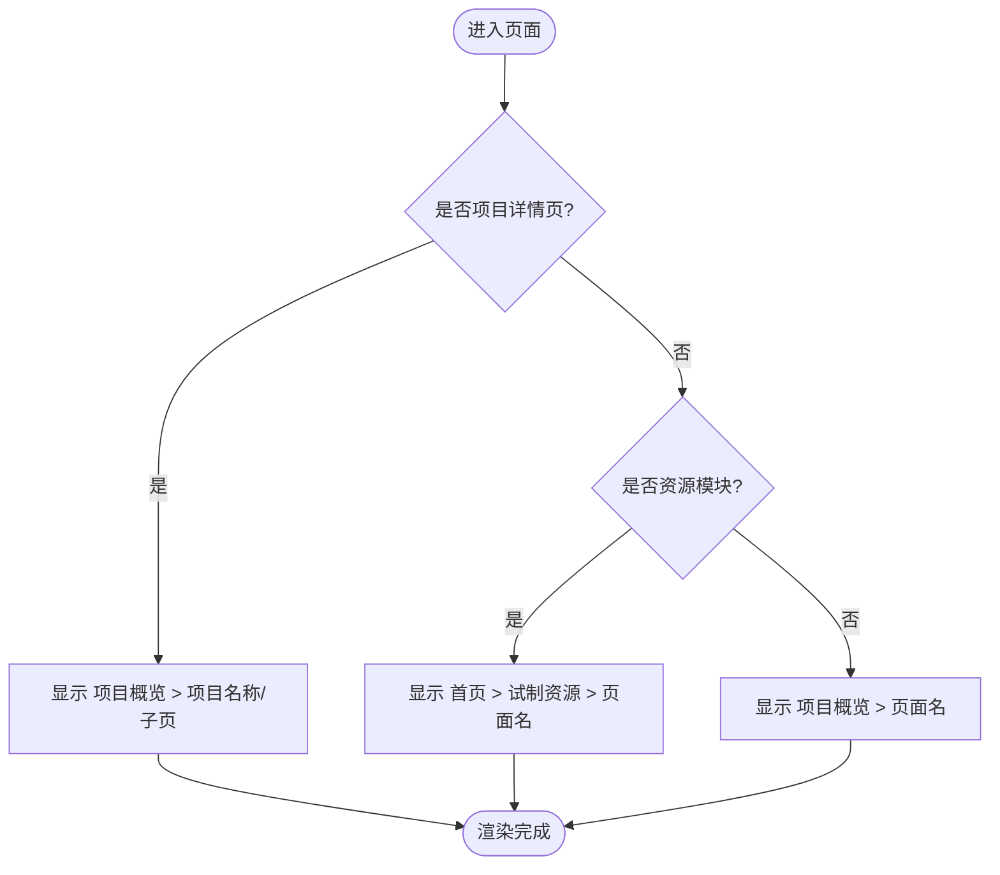
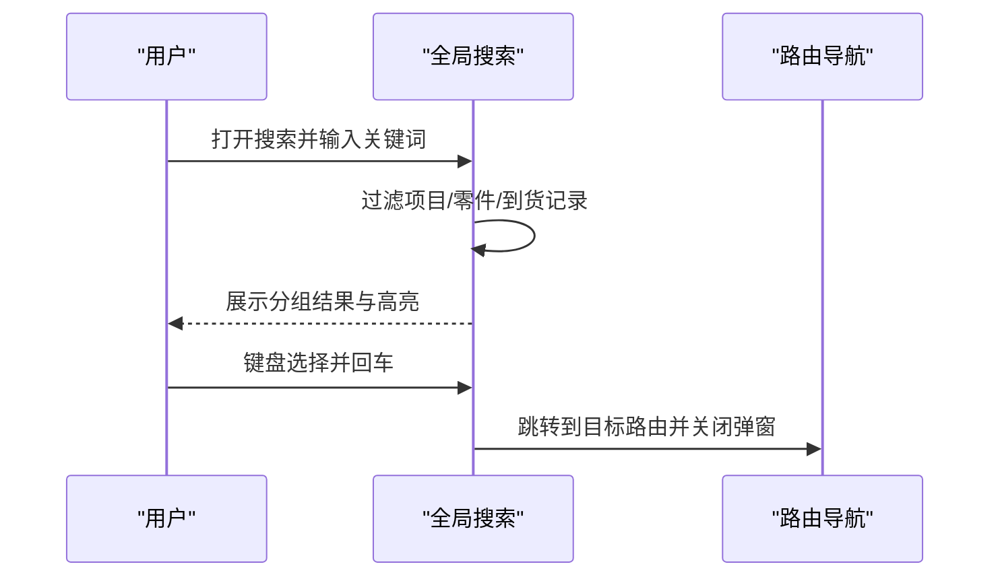
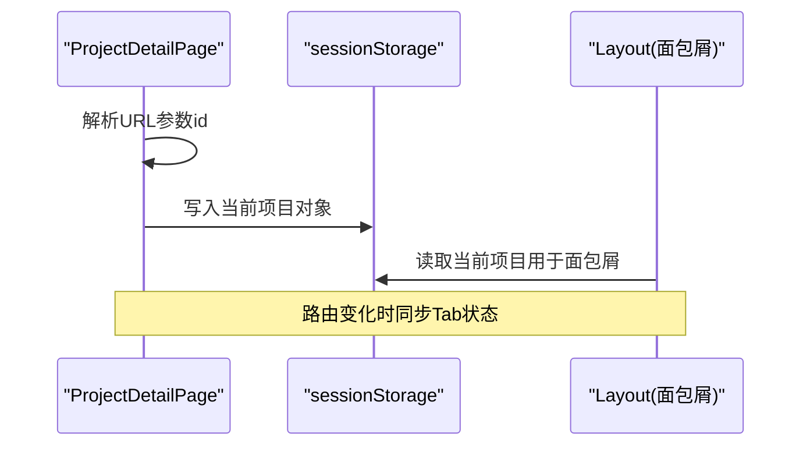
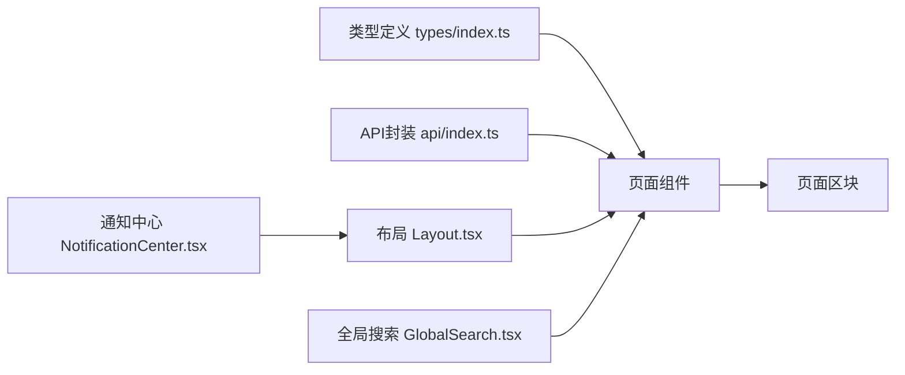

# 页面组件设计

<cite>
**本文引用的文件**
- [index.tsx](file://webui_ref/client/src/index.tsx)
- [app.tsx](file://webui_ref/client/src/app.tsx)
- [Layout.tsx](file://webui_ref/client/src/components/Layout.tsx)
- [GlobalSearch.tsx](file://webui_ref/client/src/components/GlobalSearch.tsx)
- [NotificationCenter.tsx](file://webui_ref/client/src/components/NotificationCenter.tsx)
- [ProjectsPage.tsx](file://webui_ref/client/src/pages/ProjectsPage/ProjectsPage.tsx)
- [ProjectDetailPage.tsx](file://webui_ref/client/src/pages/ProjectDetailPage/ProjectDetailPage.tsx)
- [ResourceDashboardPage.tsx](file://webui_ref/client/src/pages/ResourceDashboardPage/ResourceDashboardPage.tsx)
- [SystemSettingsPage.tsx](file://webui_ref/client/src/pages/SystemSettingsPage/SystemSettingsPage.tsx)
- [types/index.ts](file://webui_ref/client/src/types/index.ts)
- [api/index.ts](file://webui_ref/client/src/api/index.ts)
</cite>

## 目录
1. [简介](#简介)
2. [项目结构](#项目结构)
3. [核心组件](#核心组件)
4. [架构总览](#架构总览)
5. [详细组件分析](#详细组件分析)
6. [依赖关系分析](#依赖关系分析)
7. [性能考量](#性能考量)
8. [故障排查指南](#故障排查指南)
9. [结论](#结论)
10. [附录](#附录)

## 简介
本文件面向React前端工程，系统化阐述页面组件的组织方式与职责划分，覆盖页面容器模式、路由配置、状态管理、生命周期管理、数据获取策略、错误处理机制、跨页导航与状态共享、响应式设计与性能优化，并给出可落地的最佳实践与示例路径。

## 项目结构
- 应用入口与全局容器：在应用根层使用浏览器路由、全局错误边界、主题容器与消息提示（Toaster），统一挂载路由与全局能力。
- 路由与布局：集中定义所有页面路由，并通过统一的侧边栏布局包裹内容区域，提供面包屑、用户信息、全局搜索与通知等横切能力。
- 页面组织：每个业务模块以“页面文件夹 + 页面主组件”的形式组织，页面内部进一步拆分为多个“区块（Section）”组件，实现高内聚低耦合。
- 类型与API：集中定义前后端交互的数据类型；API层预留基于后端Axios实例的请求封装位置。

图表来源
- [index.tsx:1-37](file://webui_ref/client/src/index.tsx#L1-L37)
- [app.tsx:1-56](file://webui_ref/client/src/app.tsx#L1-L56)
- [Layout.tsx:1-399](file://webui_ref/client/src/components/Layout.tsx#L1-L399)

章节来源
- [index.tsx:1-37](file://webui_ref/client/src/index.tsx#L1-L37)
- [app.tsx:1-56](file://webui_ref/client/src/app.tsx#L1-L56)

## 核心组件
- 应用入口与全局错误边界
  - 使用浏览器路由作为根容器，设置基础路径；通过全局错误边界捕获渲染期异常，并提供恢复能力；注入主题容器与全局消息提示。
- 路由与布局
  - 集中声明所有页面路由，采用嵌套路由将通用布局与具体页面解耦；布局负责侧边栏导航、面包屑、用户信息、滚动复位、全局搜索与通知等。
- 页面组件
  - 页面组件聚焦于“组合与编排”，将复杂页面拆分为多个区块组件；通过动画增强首屏体验；通过URL参数或本地存储进行跨页状态共享。
- 全局能力
  - 全局搜索：聚合多类实体（项目、零件、到货记录）的检索与跳转；键盘导航与结果分组展示。
  - 通知中心：下拉面板展示通知列表，支持标记已读、未读数统计与外部点击关闭。

章节来源
- [index.tsx:1-37](file://webui_ref/client/src/index.tsx#L1-L37)
- [app.tsx:1-56](file://webui_ref/client/src/app.tsx#L1-L56)
- [Layout.tsx:1-399](file://webui_ref/client/src/components/Layout.tsx#L1-L399)
- [GlobalSearch.tsx:1-504](file://webui_ref/client/src/components/GlobalSearch.tsx#L1-L504)
- [NotificationCenter.tsx:1-281](file://webui_ref/client/src/components/NotificationCenter.tsx#L1-L281)

## 架构总览
下图展示了从应用入口到页面渲染的关键调用链与组件关系，体现“路由—布局—页面—区块”的分层组织。

图表来源
- [index.tsx:1-37](file://webui_ref/client/src/index.tsx#L1-L37)
- [app.tsx:1-56](file://webui_ref/client/src/app.tsx#L1-L56)
- [Layout.tsx:162-177](file://webui_ref/client/src/components/Layout.tsx#L162-L177)

## 详细组件分析

### 应用入口与全局错误边界
- 职责
  - 提供浏览器路由上下文、全局错误边界、主题容器与全局消息提示。
  - 通过环境变量控制基础路径，便于部署在不同子路径。
- 关键点
  - 错误边界使用第三方组件提供错误渲染与重置能力。
  - Toaster通过Portal挂载到body，避免层级问题。

章节来源
- [index.tsx:1-37](file://webui_ref/client/src/index.tsx#L1-L37)

### 路由配置与页面容器
- 职责
  - 集中声明所有页面路由，使用嵌套路由将通用布局与页面分离。
  - 为不同业务域（项目域、试制资源域）提供清晰的路径前缀。
- 关键点
  - 首页与一级页面、项目详情页及其子页面、资源模块各页面均通过Routes统一管理。
  - 未匹配路由指向NotFound。

章节来源
- [app.tsx:1-56](file://webui_ref/client/src/app.tsx#L1-L56)

### 布局容器（侧边栏、面包屑、头部）
- 职责
  - 提供侧边栏导航、面包屑、用户信息、全局搜索与通知入口。
  - 路由切换时自动滚动到页面顶部，保证一致的阅读体验。
  - 根据当前路径动态计算面包屑标题，支持项目详情与资源模块的多级面包屑。
- 关键点
  - 导航项按业务域分组，支持折叠与激活态样式。
  - 用户退出登录通过平台会话接口完成。
  - 面包屑对“项目详情页的子Tab”做了特殊处理，避免冗余层级。

图表来源
- [Layout.tsx:78-160](file://webui_ref/client/src/components/Layout.tsx#L78-L160)

章节来源
- [Layout.tsx:1-399](file://webui_ref/client/src/components/Layout.tsx#L1-L399)

### 全局搜索
- 职责
  - 提供跨实体的快速检索与跳转，支持键盘导航与结果分组。
  - 对匹配文本进行高亮显示，提升可读性。
- 关键点
  - 数据来源为静态JSON（项目、零件、到货记录）。
  - 结果按类型分组，支持上下键选择与回车跳转。
  - 打开时自动聚焦输入框，ESC关闭。

图表来源
- [GlobalSearch.tsx:222-330](file://webui_ref/client/src/components/GlobalSearch.tsx#L222-L330)

章节来源
- [GlobalSearch.tsx:1-504](file://webui_ref/client/src/components/GlobalSearch.tsx#L1-L504)

### 通知中心
- 职责
  - 展示系统通知，支持未读计数、全部已读、单条已读与外部点击关闭。
- 关键点
  - 通知类型为枚举，不同类型使用不同图标与配色。
  - 使用动画呈现展开/收起，提升交互流畅度。

章节来源
- [NotificationCenter.tsx:1-281](file://webui_ref/client/src/components/NotificationCenter.tsx#L1-L281)

### 页面组件：项目概览（ProjectsPage）
- 职责
  - 组合统计卡片、风险图表与项目列表三个区块，形成项目概览视图。
- 关键点
  - 使用页面级入场动画，提升首屏体验。
  - 区块组件各自负责数据与展示，页面仅做编排。

章节来源
- [ProjectsPage.tsx:1-35](file://webui_ref/client/src/pages/ProjectsPage/ProjectsPage.tsx#L1-L35)

### 页面组件：项目详情（ProjectDetailPage）
- 职责
  - 根据URL参数加载项目信息，提供“到货监控”和“装车计划”两个Tab。
  - 将当前项目写入sessionStorage，供其他页面读取（如面包屑显示项目名称）。
- 关键点
  - Tab切换不改变路由，仅在URL末尾追加/assembly-plan时同步Tab状态。
  - 当项目不存在时，提供返回引导。

图表来源
- [ProjectDetailPage.tsx:42-75](file://webui_ref/client/src/pages/ProjectDetailPage/ProjectDetailPage.tsx#L42-L75)
- [Layout.tsx:84-96](file://webui_ref/client/src/components/Layout.tsx#L84-L96)

章节来源
- [ProjectDetailPage.tsx:1-188](file://webui_ref/client/src/pages/ProjectDetailPage/ProjectDetailPage.tsx#L1-L188)

### 页面组件：综合驾驶舱（ResourceDashboardPage）
- 职责
  - 作为资源模块的综合驾驶舱占位页面，后续扩展为全局概览仪表盘。
- 关键点
  - 当前为占位实现，保持与其他页面一致的布局与风格。

章节来源
- [ResourceDashboardPage.tsx:1-16](file://webui_ref/client/src/pages/ResourceDashboardPage/ResourceDashboardPage.tsx#L1-L16)

### 页面组件：系统设置（SystemSettingsPage）
- 职责
  - 组合凭证、飞书凭证、爬虫控制与系统参数等区块，提供系统配置入口。
- 关键点
  - 使用页面级入场动画，区块化组织复杂表单与配置项。

章节来源
- [SystemSettingsPage.tsx:1-34](file://webui_ref/client/src/pages/SystemSettingsPage/SystemSettingsPage.tsx#L1-L34)

## 依赖关系分析
- 组件耦合
  - 布局与页面通过路由解耦；页面与区块通过组合解耦；全局能力（搜索、通知）通过独立组件暴露。
- 数据流
  - 页面通过URL参数与本地存储（sessionStorage）进行跨页状态共享；API层预留了基于后端Axios实例的请求封装位置，便于后续接入真实数据。
- 类型契约
  - 通过集中类型定义约束前后端数据结构，确保组件间数据一致性。

图表来源
- [types/index.ts:1-299](file://webui_ref/client/src/types/index.ts#L1-L299)
- [api/index.ts:1-20](file://webui_ref/client/src/api/index.ts#L1-L20)
- [Layout.tsx:1-399](file://webui_ref/client/src/components/Layout.tsx#L1-L399)
- [GlobalSearch.tsx:1-504](file://webui_ref/client/src/components/GlobalSearch.tsx#L1-L504)
- [NotificationCenter.tsx:1-281](file://webui_ref/client/src/components/NotificationCenter.tsx#L1-L281)

章节来源
- [types/index.ts:1-299](file://webui_ref/client/src/types/index.ts#L1-L299)
- [api/index.ts:1-20](file://webui_ref/client/src/api/index.ts#L1-L20)

## 性能考量
- 首屏与过渡
  - 页面级入场动画（framer-motion）提升感知性能，但应避免过度动画导致卡顿。
- 渲染优化
  - 使用useMemo缓存计算结果（如搜索结果、分组统计），减少重复计算。
  - 列表渲染注意key的稳定性和唯一性。
- 网络请求
  - 建议引入请求去抖/节流、分页与虚拟滚动（大数据量场景）。
  - 使用Suspense与懒加载拆分路由或区块，降低首屏体积。
- 内存与副作用
  - 及时清理定时器与事件监听器；避免在渲染中执行昂贵操作。
- 样式与主题
  - 利用Tailwind原子类与主题变量，减少自定义样式复杂度。

[本节为通用指导，无需特定文件引用]

## 故障排查指南
- 全局错误边界
  - 若页面出现白屏或崩溃，检查ErrorBoundary是否正确包裹路由；查看错误渲染组件提供的错误信息与重置按钮。
- 路由与布局
  - 确认路由路径与Layout嵌套正确；检查面包屑映射是否与路由一致。
- 状态共享
  - 项目详情与面包屑通过sessionStorage共享，若名称显示异常，检查写入与读取逻辑及JSON序列化。
- 搜索与通知
  - 搜索无结果时，检查静态数据源与过滤条件；通知未读计数异常时，检查状态更新逻辑与外部点击关闭事件。

章节来源
- [index.tsx:18-31](file://webui_ref/client/src/index.tsx#L18-L31)
- [Layout.tsx:78-160](file://webui_ref/client/src/components/Layout.tsx#L78-L160)
- [ProjectDetailPage.tsx:63-75](file://webui_ref/client/src/pages/ProjectDetailPage/ProjectDetailPage.tsx#L63-L75)
- [GlobalSearch.tsx:238-297](file://webui_ref/client/src/components/GlobalSearch.tsx#L238-L297)
- [NotificationCenter.tsx:111-140](file://webui_ref/client/src/components/NotificationCenter.tsx#L111-L140)

## 结论
该前端工程采用“路由—布局—页面—区块”的分层架构，结合全局错误边界、主题容器与消息提示，提供了稳定的应用基座。页面组件通过组合与动画提升用户体验，并通过URL参数与本地存储实现跨页状态共享。未来可在API层引入真实数据与缓存策略，进一步优化性能与可维护性。

[本节为总结，无需特定文件引用]

## 附录

### 页面组件开发最佳实践清单
- 页面容器
  - 使用嵌套路由将通用布局与页面解耦；未匹配路由指向NotFound。
  - 在布局中统一处理滚动复位、面包屑与用户信息。
- 路由配置
  - 按业务域划分路由前缀；保持路径语义化与可维护性。
- 状态管理
  - 简单跨页状态可使用URL参数与本地存储；复杂状态建议引入状态管理库。
- 数据获取
  - 在API层统一封装请求与错误处理；在页面中使用useEffect按需拉取数据。
- 错误处理
  - 使用全局错误边界捕获渲染期异常；在组件层处理业务错误并友好提示。
- 懒加载
  - 对大体积页面或区块使用React.lazy与Suspense进行代码分割。
- 响应式设计
  - 使用Tailwind栅格与断点适配不同屏幕尺寸；确保布局在移动端可用。
- 性能优化
  - 合理使用useMemo/useCallback；避免不必要的重渲染；大数据列表使用虚拟滚动。

[本节为通用指导，无需特定文件引用]