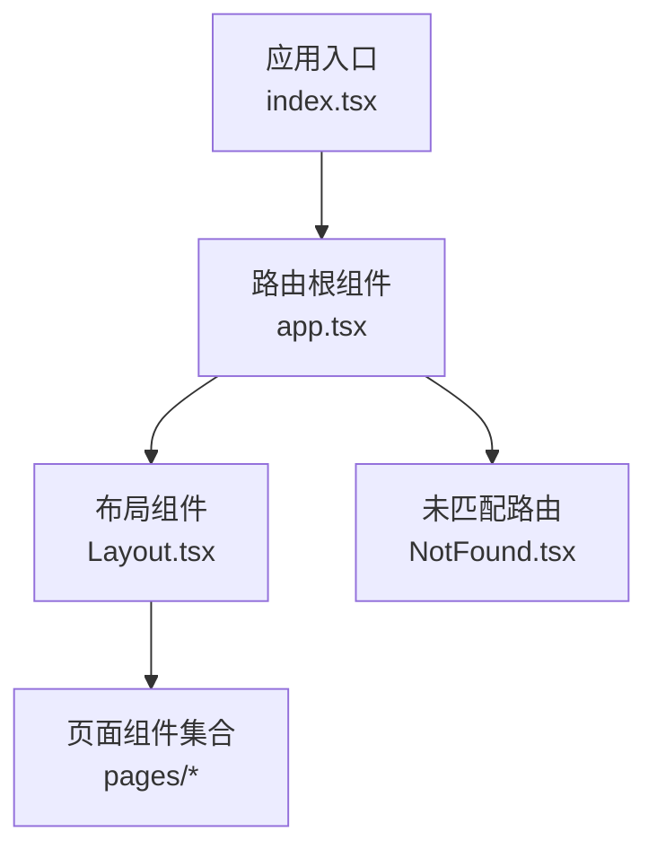
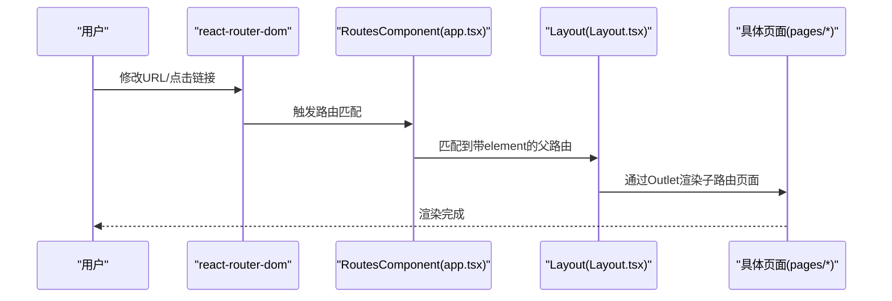
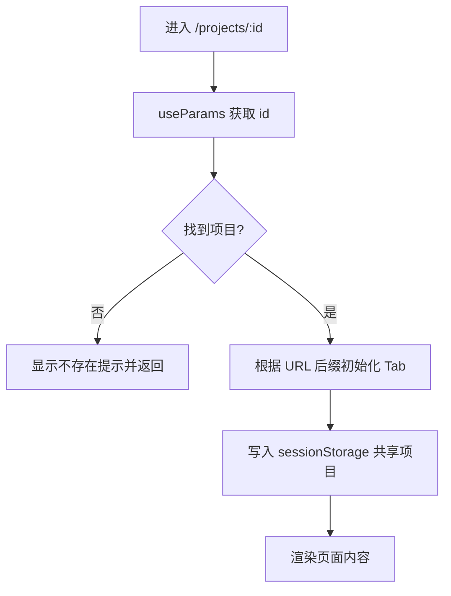
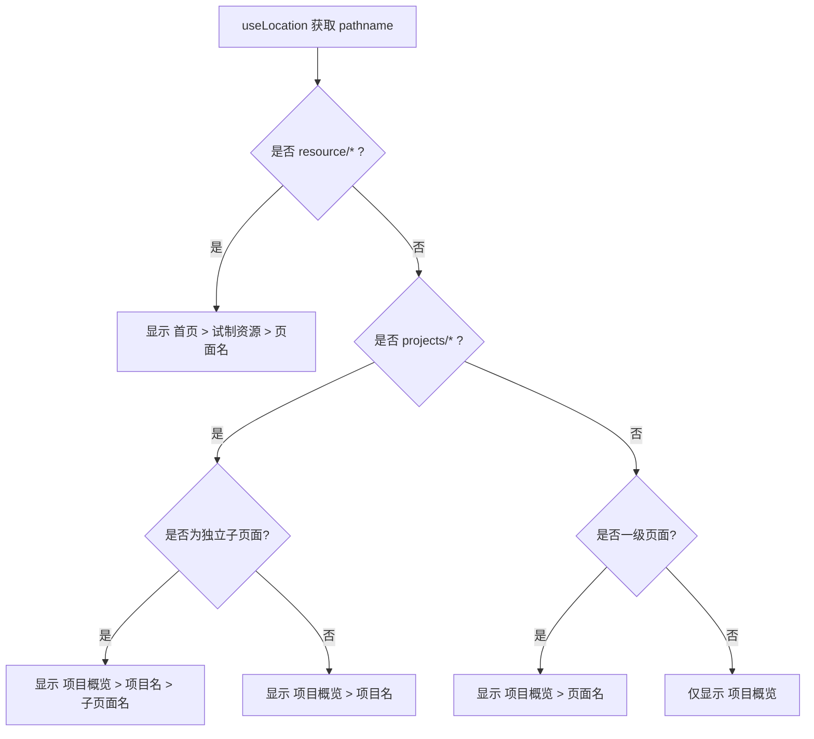
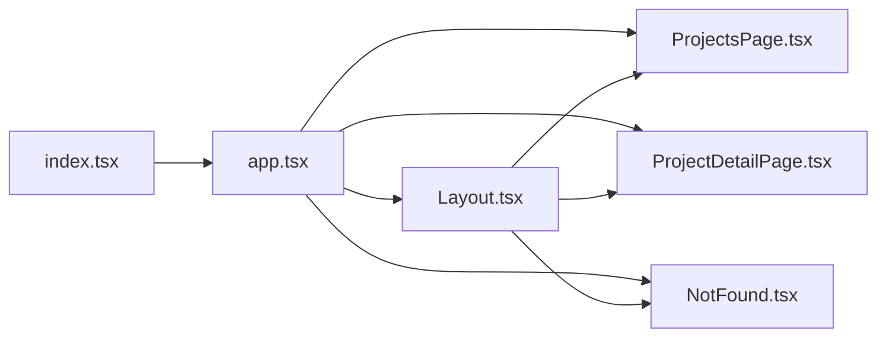

# 路由与导航

<cite>
**本文引用的文件**
- [index.tsx](file://webui_ref/client/src/index.tsx)
- [app.tsx](file://webui_ref/client/src/app.tsx)
- [Layout.tsx](file://webui_ref/client/src/components/Layout.tsx)
- [ProjectDetailPage.tsx](file://webui_ref/client/src/pages/ProjectDetailPage/ProjectDetailPage.tsx)
- [NotFound.tsx](file://webui_ref/client/src/pages/NotFound/NotFound.tsx)
- [ProjectsPage.tsx](file://webui_ref/client/src/pages/ProjectsPage/ProjectsPage.tsx)
</cite>

## 目录
1. [简介](#简介)
2. [项目结构](#项目结构)
3. [核心组件](#核心组件)
4. [架构总览](#架构总览)
5. [详细组件分析](#详细组件分析)
6. [依赖关系分析](#依赖关系分析)
7. [性能考虑](#性能考虑)
8. [故障排查指南](#故障排查指南)
9. [结论](#结论)
10. [附录](#附录)

## 简介
本章节面向前端路由与导航，围绕基于 react-router-dom 的路由配置、组织方式、动态路由、嵌套路由与布局、404 页面与错误边界、以及跳转与参数传递的最佳实践进行系统化说明。文档同时给出可落地的优化建议（如代码分割与懒加载），帮助在保持可读性的前提下提升首屏与交互性能。

## 项目结构
本项目采用“集中式路由 + 布局包裹”的组织方式：
- 应用入口使用 BrowserRouter 提供路由上下文，并挂载全局错误边界与通知等基础设施。
- 路由表集中在 app.tsx，通过 Routes/Route 声明式定义所有页面路由。
- 统一布局 Layout 作为外层容器，负责侧边栏、面包屑、顶部栏与内容区 Outlet。
- 页面按功能模块拆分到 pages 目录，子页面通过相对路径或编程式导航访问。

图表来源
- [index.tsx:16-33](file://webui_ref/client/src/index.tsx#L16-L33)
- [app.tsx:26-51](file://webui_ref/client/src/app.tsx#L26-L51)
- [Layout.tsx:390-396](file://webui_ref/client/src/components/Layout.tsx#L390-L396)
- [NotFound.tsx:3-9](file://webui_ref/client/src/pages/NotFound/NotFound.tsx#L3-L9)

章节来源
- [index.tsx:1-37](file://webui_ref/client/src/index.tsx#L1-L37)
- [app.tsx:1-56](file://webui_ref/client/src/app.tsx#L1-L56)

## 核心组件
- 应用入口与全局上下文
  - 使用 BrowserRouter 设置 basename，便于部署在不同基础路径下。
  - 使用 ErrorBoundary 捕获渲染期异常，并通过平台提供的 ErrorRender 展示错误界面。
  - 将 Toaster 通过 Portal 挂载到 body，确保消息提示层级正确。
- 路由表与嵌套路由
  - 以 <Route element={<Layout />}> 包裹一组路由，实现共享布局与侧边栏。
  - 首页 index 指向项目概览；资源模块以 resource/* 前缀分组；项目详情及子页以 projects/:id 动态段组织。
  - 兜底路由 path="*" 指向 NotFound 页面。
- 布局与导航
  - Layout 提供 Sidebar、Header、Breadcrumb 与 Outlet，承载页面内容。
  - 面包屑根据当前 pathname 动态计算，支持项目详情页与资源模块的层级显示。
  - 侧边栏菜单项与面包屑标题映射集中维护，保证导航一致性。

章节来源
- [index.tsx:16-33](file://webui_ref/client/src/index.tsx#L16-L33)
- [app.tsx:26-51](file://webui_ref/client/src/app.tsx#L26-L51)
- [Layout.tsx:78-160](file://webui_ref/client/src/components/Layout.tsx#L78-L160)
- [Layout.tsx:179-201](file://webui_ref/client/src/components/Layout.tsx#L179-L201)

## 架构总览
下图展示了从浏览器地址变化到页面渲染的关键流程，包括路由匹配、布局注入与页面渲染。

图表来源
- [index.tsx:16-33](file://webui_ref/client/src/index.tsx#L16-L33)
- [app.tsx:26-51](file://webui_ref/client/src/app.tsx#L26-L51)
- [Layout.tsx:390-396](file://webui_ref/client/src/components/Layout.tsx#L390-L396)

## 详细组件分析

### 路由表与嵌套路由（app.tsx）
- 路由组织
  - 首页：index 指向项目概览。
  - 项目域：projects/:id 及其子路由 pending-inspection、unqualified-pending、assembly-plan。
  - 通用页：all-parts、audit-log、settings。
  - 资源域：resource/dashboard、equipment、zones、utilization、personnel、gantt、efficiency、alerts、tasks。
  - 兜底：path="*" 指向 NotFound。
- 设计要点
  - 使用 element={<Layout />} 将一组路由纳入统一布局。
  - 动态段 :id 用于项目详情与子页的参数传递。
  - 资源模块通过 resource/* 前缀形成清晰的功能域划分。

章节来源
- [app.tsx:26-51](file://webui_ref/client/src/app.tsx#L26-L51)

### 动态路由与参数传递（项目详情）
- 参数获取
  - 项目详情页通过 useParams 读取 id，并据此查找项目数据。
  - 当找不到对应项目时，提供返回按钮回到项目概览。
- Tab 与 URL 同步
  - 通过 useLocation 判断是否处于 assembly-plan 子路径，从而初始化 activeTab。
  - 监听 location.pathname 变化，保持 Tab 状态与 URL 一致。
- 跨页面共享
  - 进入项目详情后，将当前项目信息写入 sessionStorage，供其他页面（如面包屑）读取，避免重复查询。

图表来源
- [ProjectDetailPage.tsx:42-75](file://webui_ref/client/src/pages/ProjectDetailPage/ProjectDetailPage.tsx#L42-L75)
- [ProjectDetailPage.tsx:77-104](file://webui_ref/client/src/pages/ProjectDetailPage/ProjectDetailPage.tsx#L77-L104)

章节来源
- [ProjectDetailPage.tsx:42-104](file://webui_ref/client/src/pages/ProjectDetailPage/ProjectDetailPage.tsx#L42-L104)

### 布局组件与面包屑（Layout.tsx）
- 布局职责
  - 提供 Sidebar、Header、Breadcrumb 与 Outlet。
  - 路由切换时滚动到页面顶部，提升体验一致性。
- 面包屑逻辑
  - 针对 resource/* 与 projects/* 两类路径分别处理层级。
  - 项目详情页的子页面中，assembly-plan 作为内嵌 Tab 不显示第三级，其余子页面显示两级。
  - 一级页面（非首页）直接显示二级面包屑。
- 导航项管理
  - 主菜单与资源模块菜单集中定义，Link 组件绑定 to 属性进行声明式跳转。
  - 高亮当前激活项，增强导航感知。

图表来源
- [Layout.tsx:78-160](file://webui_ref/client/src/components/Layout.tsx#L78-L160)
- [Layout.tsx:162-171](file://webui_ref/client/src/components/Layout.tsx#L162-L171)

章节来源
- [Layout.tsx:78-160](file://webui_ref/client/src/components/Layout.tsx#L78-L160)
- [Layout.tsx:162-171](file://webui_ref/client/src/components/Layout.tsx#L162-L171)

### 404 页面与错误边界
- 404 页面
  - 路由表末尾的 path="*" 指向 NotFound，使用平台提供的 NotFoundRender 展示标准 404 界面。
- 错误边界
  - 应用入口使用 ErrorBoundary 包裹路由树，捕获渲染期异常。
  - 通过 ErrorRender 展示错误信息与重置操作，保障用户体验与可恢复性。

章节来源
- [app.tsx:50-51](file://webui_ref/client/src/app.tsx#L50-L51)
- [NotFound.tsx:3-9](file://webui_ref/client/src/pages/NotFound/NotFound.tsx#L3-L9)
- [index.tsx:20-30](file://webui_ref/client/src/index.tsx#L20-L30)

### 路由跳转与参数传递最佳实践
- 声明式跳转
  - 使用 Link 组件进行静态路径跳转，适用于侧边栏、面包屑等场景。
- 编程式跳转
  - 使用 useNavigate 进行条件跳转或携带目标参数的跳转，例如从列表进入项目详情。
- 动态段与查询字符串
  - 动态段通过 :id 传递关键标识；如需多条件筛选，建议使用查询字符串（search）配合 useSearchParams（若引入）。
  - 对于复杂筛选，可将查询参数序列化到 URL，便于分享与回退。
- 状态与 URL 同步
  - 将 UI 状态（如 Tab）与 URL 片段同步，保证刷新与分享的一致性。

章节来源
- [Layout.tsx:179-201](file://webui_ref/client/src/components/Layout.tsx#L179-L201)
- [ProjectDetailPage.tsx:42-75](file://webui_ref/client/src/pages/ProjectDetailPage/ProjectDetailPage.tsx#L42-L75)
- [ProjectsPage.tsx:1-35](file://webui_ref/client/src/pages/ProjectsPage/ProjectsPage.tsx#L1-L35)

### 路由守卫与权限控制（现状与建议）
- 现状
  - 当前路由表未包含显式的鉴权守卫组件；登录态由平台 AppContainer 与 dataloom session 管理。
  - 退出登录通过调用 dataloom service.session.signOut 并刷新页面实现。
- 建议方案
  - 在 app.tsx 中为需要鉴权的路由组添加高阶包装组件，校验登录态与角色后再渲染子路由。
  - 对敏感路由（如 settings）增加额外权限检查，无权限时重定向至 403 或首页。
  - 结合 useLocation/useNavigate 实现登录后回跳原页面的体验。

章节来源
- [index.tsx:16-33](file://webui_ref/client/src/index.tsx#L16-L33)
- [Layout.tsx:173-177](file://webui_ref/client/src/components/Layout.tsx#L173-L177)

## 依赖关系分析
- 入口依赖
  - index.tsx 依赖 react-router-dom 的 BrowserRouter，并挂载 ErrorBoundary、Toaster。
- 路由表依赖
  - app.tsx 依赖 Layout 与各页面组件，构成路由到组件的映射。
- 布局依赖
  - Layout.tsx 依赖 react-router-dom 的 Link、Outlet、useLocation，以及 UI 组件库与平台工具。
- 页面依赖
  - ProjectDetailPage 依赖 useParams、useNavigate、useLocation 进行参数读取与跳转。

图表来源
- [index.tsx:16-33](file://webui_ref/client/src/index.tsx#L16-L33)
- [app.tsx:26-51](file://webui_ref/client/src/app.tsx#L26-L51)
- [Layout.tsx:390-396](file://webui_ref/client/src/components/Layout.tsx#L390-L396)

章节来源
- [index.tsx:1-37](file://webui_ref/client/src/index.tsx#L1-L37)
- [app.tsx:1-56](file://webui_ref/client/src/app.tsx#L1-L56)
- [Layout.tsx:1-399](file://webui_ref/client/src/components/Layout.tsx#L1-L399)

## 性能考虑
- 代码分割与懒加载
  - 使用 React.lazy 与 Suspense 对项目级页面进行按需加载，减少首屏体积。
  - 对大型图表、编辑器等重型组件进一步拆分，仅在进入相关路由时加载。
- 路由级预取
  - 在进入路由前，利用 Link prefetch 或路由钩子预取必要数据，降低白屏时间。
- 缓存策略
  - 对频繁访问的项目详情数据做内存缓存（如 Map），并结合 URL 变更失效策略。
- 渲染优化
  - 使用 memo、useMemo、useCallback 减少不必要的重渲染。
  - 列表分页与虚拟滚动，避免一次性渲染大量节点。
- 构建优化
  - 合理拆分 vendor 与业务包，启用 gzip/brotli 压缩与 CDN 缓存。

[本节为通用性能建议，不直接引用具体文件]

## 故障排查指南
- 路由不生效
  - 检查 BrowserRouter 的 basename 是否与部署路径一致。
  - 确认路由表中的 path 与页面导入是否正确。
- 动态参数为空
  - 检查 useParams 的类型声明与实际路径段是否匹配。
  - 确认父路由是否使用了正确的 element 包裹，导致 Outlet 未渲染。
- 404 页面出现
  - 确认是否存在未匹配的 path="*" 之前的更具体路由。
  - 检查是否有拼写错误或大小写不一致导致的匹配失败。
- 错误边界触发
  - 查看 ErrorRender 的错误堆栈，定位组件渲染异常。
  - 必要时在可疑组件周围追加局部 ErrorBoundary 缩小问题范围。

章节来源
- [index.tsx:20-30](file://webui_ref/client/src/index.tsx#L20-L30)
- [app.tsx:50-51](file://webui_ref/client/src/app.tsx#L50-L51)
- [NotFound.tsx:3-9](file://webui_ref/client/src/pages/NotFound/NotFound.tsx#L3-L9)

## 结论
本项目采用集中式路由与布局包裹的模式，结构清晰、扩展性强。动态路由与嵌套路由在项目详情与资源模块中得到良好应用。404 页面与错误边界提供了稳定的容错能力。后续可在鉴权守卫、代码分割与数据预取方面进一步增强，以提升安全性与性能。

## 附录
- 常用 Hook 速查
  - useParams：读取动态段参数（如项目 id）。
  - useNavigate：编程式跳转。
  - useLocation：读取当前路径与搜索串，用于状态同步与面包屑计算。
  - Link：声明式跳转，适合菜单与面包屑。
- 推荐实践
  - 将路由表按模块拆分并聚合，便于维护。
  - 使用统一的布局与面包屑，保持一致的用户体验。
  - 将鉴权与权限控制抽象为高阶组件或路由守卫，集中管理。

[本节为概念性补充，不直接引用具体文件]