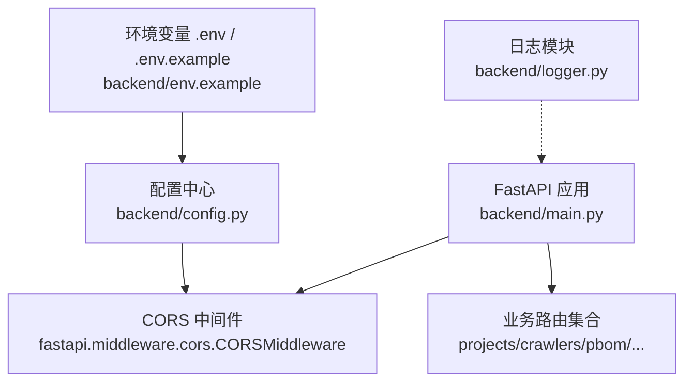
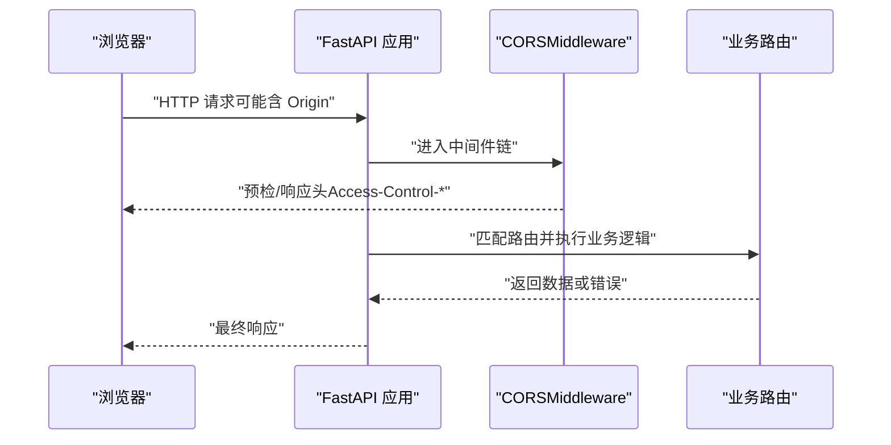
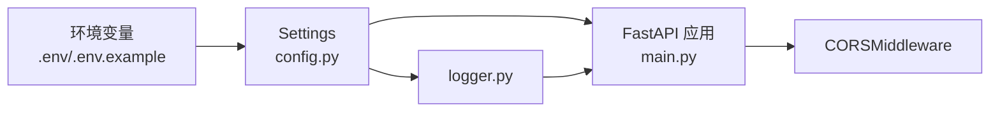

# CORS跨域中间件

<cite>
**本文引用的文件**
- [backend/main.py](file://backend/main.py)
- [backend/config.py](file://backend/config.py)
- [backend/env.example](file://backend/env.example)
- [backend/logger.py](file://backend/logger.py)
</cite>

## 目录
1. [简介](#简介)
2. [项目结构](#项目结构)
3. [核心组件](#核心组件)
4. [架构总览](#架构总览)
5. [详细组件分析](#详细组件分析)
6. [依赖关系分析](#依赖关系分析)
7. [性能与安全考量](#性能与安全考量)
8. [故障排查指南](#故障排查指南)
9. [结论](#结论)
10. [附录：配置示例与最佳实践](#附录配置示例与最佳实践)

## 简介
本文件围绕 FastAPI 的 CORS 跨域中间件，结合本项目实际代码，系统阐述如何配置 allow_origins、allow_credentials、allow_methods、allow_headers 等关键参数，并给出开发/生产环境的差异化策略、常见问题排查方法与安全最佳实践。

## 项目结构
本项目在应用启动时加载全局配置，随后注册 CORSMiddleware 中间件，再挂载各业务路由。CORS 相关配置来源于环境变量，并通过 Settings 类集中管理。

图表来源
- [backend/main.py:29-83](file://backend/main.py#L29-L83)
- [backend/config.py:48-98](file://backend/config.py#L48-L98)
- [backend/env.example:14-20](file://backend/env.example#L14-L20)
- [backend/logger.py:14-42](file://backend/logger.py#L14-L42)

章节来源
- [backend/main.py:29-83](file://backend/main.py#L29-L83)
- [backend/config.py:48-98](file://backend/config.py#L48-L98)
- [backend/env.example:14-20](file://backend/env.example#L14-L20)

## 核心组件
- FastAPI 应用入口：负责创建应用实例、注册中间件与路由。
- CORS 中间件：基于 FastAPI 内置 CORSMiddleware，控制跨域访问策略。
- 配置中心：从环境变量读取 CORS_ORIGINS 等服务配置，供中间件使用。
- 日志模块：根据 DEBUG 开关调整日志级别，辅助问题定位。

章节来源
- [backend/main.py:11-16](file://backend/main.py#L11-L16)
- [backend/main.py:65-72](file://backend/main.py#L65-L72)
- [backend/config.py:48-98](file://backend/config.py#L48-L98)
- [backend/logger.py:14-42](file://backend/logger.py#L14-L42)

## 架构总览
下图展示了请求进入后的处理顺序：浏览器发起跨域请求 → FastAPI 应用 → CORSMiddleware 校验并添加响应头 → 路由处理器 → 返回响应。

图表来源
- [backend/main.py:65-83](file://backend/main.py#L65-L83)

## 详细组件分析

### CORS 中间件配置与行为
- 允许的来源域名 allow_origins：来自 settings.CORS_ORIGINS，默认值为 ["*"]，表示允许任意来源。可通过环境变量 CORS_ORIGINS 设置为逗号分隔的域名列表，例如 "http://localhost:3000,https://app.example.com"。
- 是否允许携带凭据 allow_credentials：当前设置为 True，表示允许跨域请求携带 Cookie/Authorization 等凭据。注意：当 allow_credentials=True 时，allow_origins 不能为 "*"，需显式列出可信来源。
- 允许的请求方法 allow_methods：当前为 ["*"]，即允许所有 HTTP 方法（GET/POST/PUT/DELETE/OPTIONS 等）。
- 允许的请求头 allow_headers：当前为 ["*"]，即允许所有自定义请求头。

上述配置位于应用启动阶段，通过 app.add_middleware 注册到中间件链中。

章节来源
- [backend/main.py:65-72](file://backend/main.py#L65-L72)
- [backend/config.py:81-85](file://backend/config.py#L81-L85)
- [backend/env.example:19-20](file://backend/env.example#L19-L20)

### 配置来源与环境变量
- CORS_ORIGINS：读取自环境变量，若未设置则回退为 ["*"]。支持以逗号分隔的多个来源。
- SERVER_HOST/SERVER_PORT/DEBUG：用于服务监听与调试模式，影响日志级别与热重载行为。
- QR_BASE_URL：用于生成二维码中的页面地址，与前端访问地址一致。

章节来源
- [backend/config.py:41-45](file://backend/config.py#L41-L45)
- [backend/config.py:81-88](file://backend/config.py#L81-L88)
- [backend/env.example:14-20](file://backend/env.example#L14-L20)

### 日志与调试
- 日志级别由 settings.DEBUG 决定：DEBUG=true 时使用 DEBUG 级别，便于捕获更多细节；否则使用 INFO。
- 日志输出包含时间、级别、模块名与消息，便于定位跨域相关问题。

章节来源
- [backend/logger.py:14-21](file://backend/logger.py#L14-L21)
- [backend/logger.py:23-36](file://backend/logger.py#L23-L36)

## 依赖关系分析
- main.py 依赖 config.py 提供的 settings，从而将环境变量注入到 CORSMiddleware 的配置中。
- env.example 提供可复制的环境变量模板，便于在不同环境快速配置。
- logger.py 受 settings.DEBUG 影响，间接影响跨域问题的排查效率。

图表来源
- [backend/config.py:48-98](file://backend/config.py#L48-L98)
- [backend/main.py:65-83](file://backend/main.py#L65-L83)
- [backend/env.example:14-20](file://backend/env.example#L14-L20)
- [backend/logger.py:14-21](file://backend/logger.py#L14-L21)

章节来源
- [backend/config.py:48-98](file://backend/config.py#L48-L98)
- [backend/main.py:65-83](file://backend/main.py#L65-L83)
- [backend/env.example:14-20](file://backend/env.example#L14-L20)
- [backend/logger.py:14-21](file://backend/logger.py#L14-L21)

## 性能与安全考量
- 性能
  - 预检请求（OPTIONS）：当 allow_methods/allow_headers 较宽泛时，浏览器会频繁发送预检请求。建议在生产环境精确限制 allow_methods 与 allow_headers，减少不必要的预检。
  - 日志级别：DEBUG=false 时降低日志量，提升吞吐。
- 安全
  - allow_credentials=True 时，必须显式设置 allow_origins 为具体可信域名，禁止使用通配符 "*"，防止任意站点携带凭据访问。
  - 最小权限原则：仅开放必要的 HTTP 方法与请求头，避免过度放行。
  - 配合反向代理（如 Nginx）进行二次校验与限流，增强整体安全性。

[本节为通用指导，不直接分析具体文件]

## 故障排查指南
常见跨域问题及定位步骤：
- 现象：浏览器控制台出现 “No 'Access-Control-Allow-Origin' header” 或 “Request was preflighted” 错误。
- 检查项
  - 确认 allow_origins 已包含请求的 Origin（区分 http/https、端口、子域名）。
  - 若启用 allow_credentials=True，确保 allow_origins 不是 "*"，而是明确列出的域名。
  - 确认 allow_methods 包含 OPTIONS（预检），以及业务所需的方法。
  - 确认 allow_headers 包含前端发送的自定义请求头（如 Authorization、X-Custom-Header）。
  - 检查环境变量 CORS_ORIGINS 是否正确加载（查看 .env 或部署平台的环境变量）。
  - 开启 DEBUG=true 并查看日志，确认中间件是否生效、是否有异常拦截。
- 验证方法
  - 使用 curl 或 Postman 模拟跨域请求，观察响应头是否包含 Access-Control-Allow-Origin、Access-Control-Allow-Credentials 等。
  - 在浏览器开发者工具的 Network 面板查看请求与响应头。

章节来源
- [backend/main.py:65-72](file://backend/main.py#L65-L72)
- [backend/config.py:81-85](file://backend/config.py#L81-L85)
- [backend/env.example:19-20](file://backend/env.example#L19-L20)
- [backend/logger.py:14-21](file://backend/logger.py#L14-L21)

## 结论
本项目通过 FastAPI 内置的 CORSMiddleware 实现了灵活的跨域控制，配置集中于环境变量，便于多环境管理。开发环境可使用宽松策略以提升效率，生产环境应遵循最小权限原则，严格限定来源、方法与头部，并在启用凭据时避免通配符。结合日志与规范化的配置流程，可有效降低跨域问题的发生概率并提升排障效率。

[本节为总结性内容，不直接分析具体文件]

## 附录：配置示例与最佳实践
- 开发环境
  - CORS_ORIGINS=*：便于本地前后端联调。
  - DEBUG=true：提高日志详细度，便于定位问题。
- 生产环境
  - CORS_ORIGINS=http://frontend.example.com,https://admin.example.com：仅允许可信域名。
  - allow_credentials=True：仅在需要携带 Cookie/Session 时启用，并确保 allow_origins 为具体域名。
  - allow_methods：按需限制，如 ["GET","POST","PUT","DELETE","OPTIONS"]。
  - allow_headers：仅放行必要头部，如 ["Content-Type","Authorization"]。
- 最佳实践
  - 使用环境变量管理敏感与易变配置，避免硬编码。
  - 在反向代理层做额外校验与限流。
  - 定期审计 allow_origins/allow_methods/allow_headers，及时收敛权限。
  - 对涉及凭据的接口加强服务端鉴权与防重放机制。

[本节为通用指导，不直接分析具体文件]