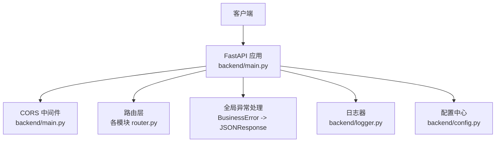
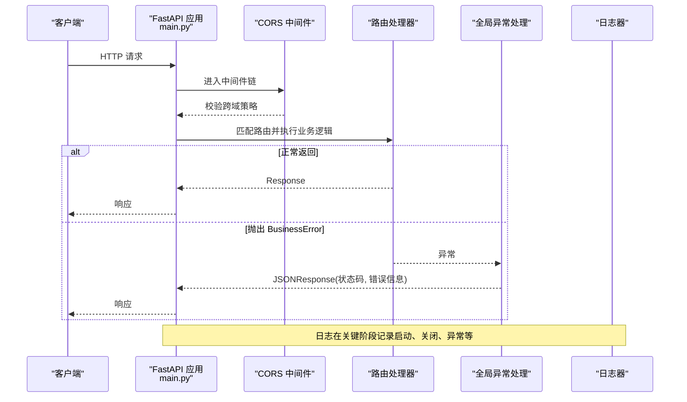
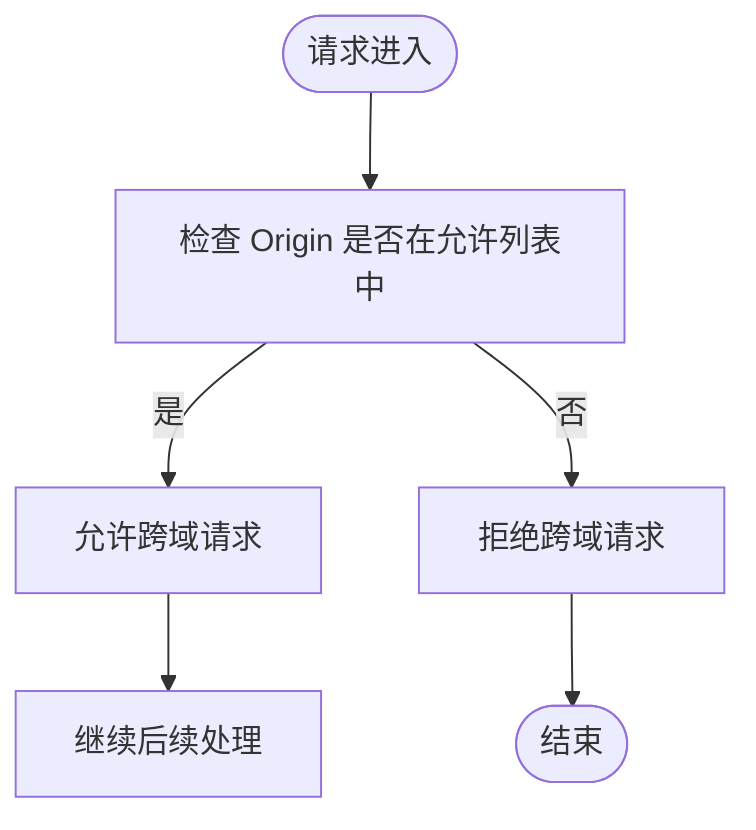
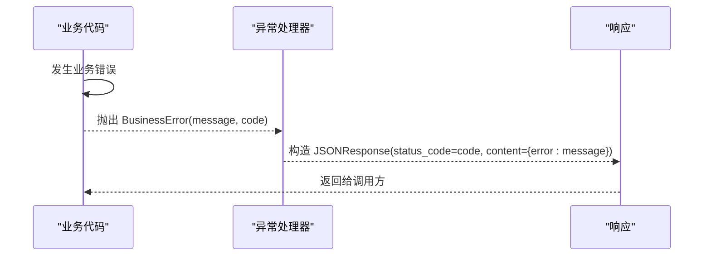
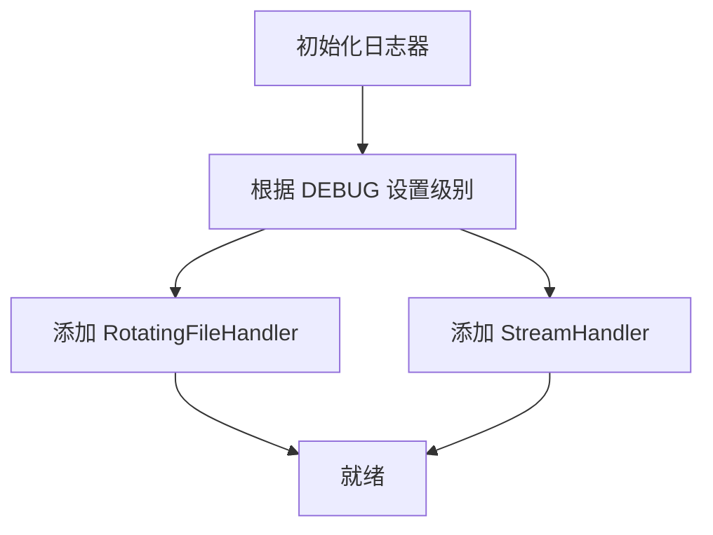
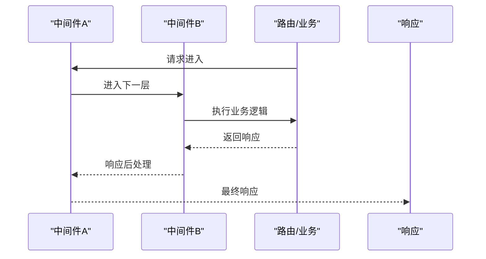
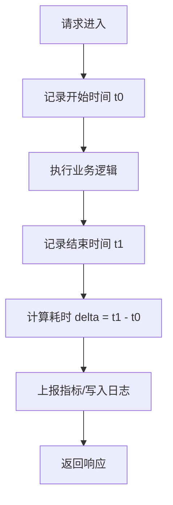
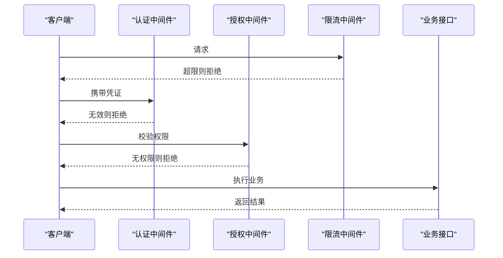
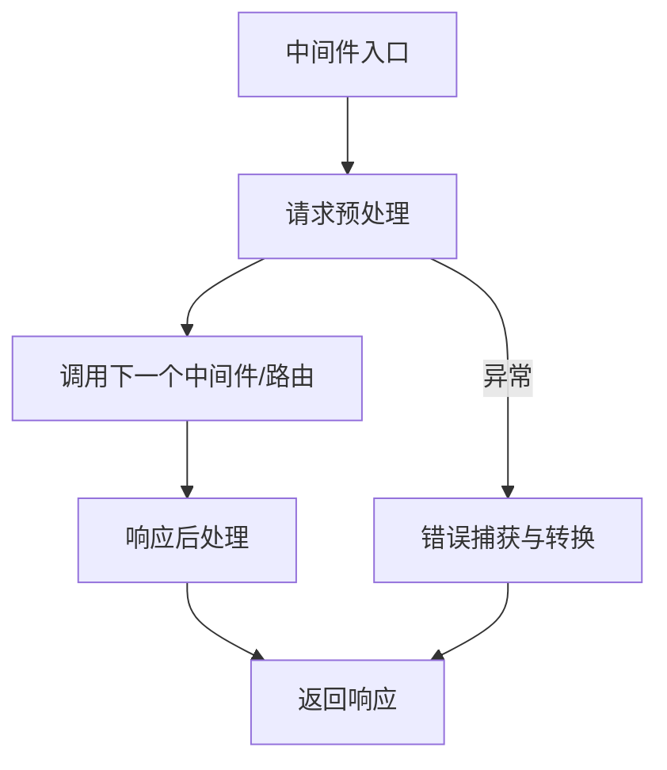
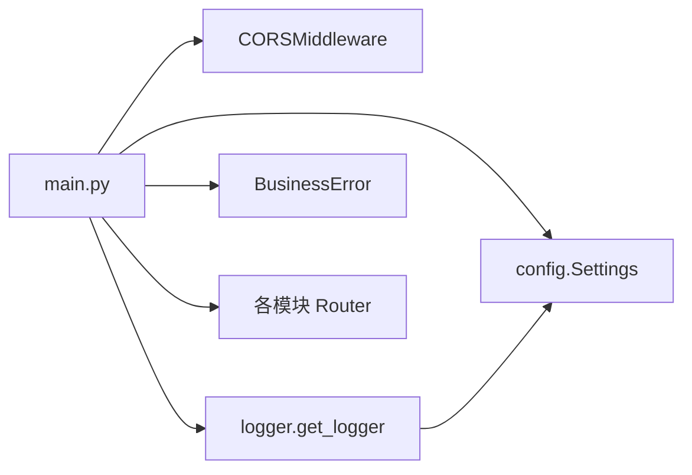

# 中间件系统

<cite>
**本文引用的文件**
- [backend/main.py](file://backend/main.py)
- [backend/logger.py](file://backend/logger.py)
- [backend/config.py](file://backend/config.py)
- [backend/core/exceptions.py](file://backend/core/exceptions.py)
- [backend/system/router.py](file://backend/system/router.py)
</cite>

## 目录
1. [简介](#简介)
2. [项目结构](#项目结构)
3. [核心组件](#核心组件)
4. [架构总览](#架构总览)
5. [详细组件分析](#详细组件分析)
6. [依赖关系分析](#依赖关系分析)
7. [性能考虑](#性能考虑)
8. [故障排查指南](#故障排查指南)
9. [结论](#结论)
10. [附录](#附录)

## 简介
本文件聚焦于 FastAPI 应用的中间件体系与横切关注点实现，涵盖：
- CORS 跨域配置
- 全局异常处理
- 日志记录
- 请求拦截（可扩展）
- 自定义中间件的编写方法（请求预处理、响应后处理、错误捕获）
- 中间件执行顺序与管道式处理模型
- 性能监控中间件（请求耗时统计、指标收集）
- 安全相关中间件（身份验证、权限检查、请求限流）
- 开发最佳实践与调试技巧

## 项目结构
后端采用模块化路由组织，应用入口集中管理中间件、启动事件、全局异常处理器与健康检查。关键文件职责如下：
- backend/main.py：FastAPI 应用初始化、CORS 中间件注册、路由聚合、全局异常处理、健康检查与 SPA 回退
- backend/logger.py：统一日志器封装，支持控制台与轮转文件输出
- backend/config.py：环境变量加载与全局 Settings，包含 CORS_ORIGINS、服务端口等
- backend/core/exceptions.py：业务异常基类 BusinessError
- backend/system/router.py：系统设置路由（登录、凭证管理等），用于演示鉴权场景的扩展点

图表来源
- [backend/main.py:29-83](file://backend/main.py#L29-L83)
- [backend/logger.py:14-42](file://backend/logger.py#L14-L42)
- [backend/config.py:48-98](file://backend/config.py#L48-L98)

章节来源
- [backend/main.py:29-83](file://backend/main.py#L29-L83)
- [backend/logger.py:14-42](file://backend/logger.py#L14-L42)
- [backend/config.py:48-98](file://backend/config.py#L48-L98)

## 核心组件
- CORS 跨域中间件：通过 FastAPI 内置 CORSMiddleware 启用，允许来源、凭据、方法与头由配置控制
- 全局异常处理：为 BusinessError 提供统一的 JSON 响应格式
- 日志系统：基于 logging 的 RotatingFileHandler，按大小轮转并保留历史文件
- 配置管理：从 .env 读取 CORS_ORIGINS、服务器地址端口、调试开关等

章节来源
- [backend/main.py:66-72](file://backend/main.py#L66-L72)
- [backend/main.py:86-92](file://backend/main.py#L86-L92)
- [backend/logger.py:14-42](file://backend/logger.py#L14-L42)
- [backend/config.py:81-86](file://backend/config.py#L81-L86)

## 架构总览
下图展示了请求进入 FastAPI 后的中间件与处理链路，包括 CORS、路由分发、异常处理与日志记录。

图表来源
- [backend/main.py:66-72](file://backend/main.py#L66-L72)
- [backend/main.py:86-92](file://backend/main.py#L86-L92)
- [backend/logger.py:14-42](file://backend/logger.py#L14-L42)

## 详细组件分析

### CORS 跨域配置
- 使用 FastAPI 内置 CORSMiddleware
- 允许的来源列表来自配置 settings.CORS_ORIGINS
- 允许携带凭据（allow_credentials=True）
- 允许所有方法与请求头（适合开发环境；生产建议收紧）

图表来源
- [backend/main.py:66-72](file://backend/main.py#L66-L72)
- [backend/config.py:81-86](file://backend/config.py#L81-L86)

章节来源
- [backend/main.py:66-72](file://backend/main.py#L66-L72)
- [backend/config.py:81-86](file://backend/config.py#L81-L86)

### 全局异常处理
- 定义业务异常基类 BusinessError，包含 message 与 code
- 在应用入口注册 @app.exception_handler(BusinessError)，将业务异常转换为 JSONResponse
- 便于前端统一解析错误码与消息

图表来源
- [backend/core/exceptions.py:2-8](file://backend/core/exceptions.py#L2-L8)
- [backend/main.py:86-92](file://backend/main.py#L86-L92)

章节来源
- [backend/core/exceptions.py:2-8](file://backend/core/exceptions.py#L2-L8)
- [backend/main.py:86-92](file://backend/main.py#L86-L92)

### 日志记录
- 统一通过 get_logger(name) 获取 logger，避免重复添加处理器
- 同时输出到控制台与轮转文件（单文件最大 10MB，保留 7 个历史文件）
- 日志级别根据 settings.DEBUG 动态调整

图表来源
- [backend/logger.py:14-42](file://backend/logger.py#L14-L42)
- [backend/config.py:81-86](file://backend/config.py#L81-L86)

章节来源
- [backend/logger.py:14-42](file://backend/logger.py#L14-L42)
- [backend/config.py:81-86](file://backend/config.py#L81-L86)

### 请求拦截与管道式处理模型
- FastAPI 中间件以“洋葱模型”运行：请求依次进入每个中间件，再到达路由；响应则反向逐层返回
- 当前已注册 CORS 中间件；可在其前后增加自定义中间件以实现：
  - 请求预处理：解析/注入上下文、参数校验、审计字段填充
  - 响应后处理：统一包装响应体、追加追踪 ID、压缩/缓存头
  - 错误捕获：捕获未处理异常并转为标准错误响应
- 建议将横切逻辑拆分为独立中间件，保持高内聚、低耦合

图表来源
- [backend/main.py:66-72](file://backend/main.py#L66-L72)

章节来源
- [backend/main.py:66-72](file://backend/main.py#L66-L72)

### 性能监控中间件（建议实现）
- 目标：统计请求耗时、成功率、P95/P99 延迟、慢请求告警
- 关键点：
  - 在请求进入时记录开始时间戳
  - 在响应离开时计算耗时并写入指标（可导出至 Prometheus 或写入日志）
  - 对慢请求进行采样或告警
  - 注意避免在高吞吐路径中进行昂贵操作（如频繁写盘）

[本节为概念性设计，不直接对应具体源码]

### 安全相关中间件（建议实现）
- 身份验证：解析 Authorization Header（如 JWT），校验签名与过期时间，注入用户上下文
- 权限检查：基于角色/资源访问控制（RBAC/ABAC），在路由前校验
- 请求限流：基于 IP/用户维度限制 QPS，防止滥用
- 输入校验：结合 Pydantic 模型与自定义校验器，防御恶意输入
- 敏感信息脱敏：在日志中过滤密码、Token 等

[本节为概念性设计，不直接对应具体源码]

### 自定义中间件编写要点
- 请求预处理：
  - 解析/标准化请求头、URL、Body
  - 注入追踪 ID、租户 ID、用户上下文
  - 参数校验与白名单过滤
- 响应后处理：
  - 统一响应结构（如 {code, data, message}）
  - 附加性能指标（耗时、缓存命中）
  - 设置安全头（CSP、X-Frame-Options 等）
- 错误捕获：
  - 捕获并分类异常（业务异常、系统异常）
  - 记录结构化日志（含请求上下文）
  - 返回友好错误响应

[本节为概念性设计，不直接对应具体源码]

## 依赖关系分析
- main.py 依赖：
  - FastAPI 与 CORSMiddleware
  - 配置模块 config.Settings（CORS_ORIGINS、SERVER_HOST/PORT、DEBUG）
  - 日志器 logger
  - 业务异常 BusinessError
  - 各模块路由（projects、crawlers、pbom、qr_arrival、delivery、critical、scheduling、system、resource）
- logger.py 依赖：
  - 配置模块（DEBUG）
  - Python 标准库 logging 与 RotatingFileHandler
- config.py 依赖：
  - dotenv 加载 .env
  - 类型提示与基础工具函数

图表来源
- [backend/main.py:11-27](file://backend/main.py#L11-L27)
- [backend/main.py:66-83](file://backend/main.py#L66-L83)
- [backend/logger.py:14-42](file://backend/logger.py#L14-L42)
- [backend/config.py:48-98](file://backend/config.py#L48-L98)

章节来源
- [backend/main.py:11-27](file://backend/main.py#L11-L27)
- [backend/main.py:66-83](file://backend/main.py#L66-L83)
- [backend/logger.py:14-42](file://backend/logger.py#L14-L42)
- [backend/config.py:48-98](file://backend/config.py#L48-L98)

## 性能考虑
- 中间件链应尽量轻量，避免阻塞 I/O 与复杂计算
- 日志写入采用异步或批量方式（当前为同步，需注意高并发下的 IO 开销）
- 指标采集建议使用内存计数器+周期性导出，避免每次请求都落盘
- CORS 允许范围在生产环境应最小化，减少不必要的安全风险
- 对大 Body 的请求，建议在中间件层做大小限制与超时控制

[本节提供通用指导，不直接分析具体文件]

## 故障排查指南
- 跨域问题：
  - 检查浏览器请求的 Origin 是否包含在 settings.CORS_ORIGINS
  - 确认 allow_credentials 与 allow_headers 配置是否符合预期
- 异常未捕获：
  - 确认业务代码抛出的是 BusinessError 或其子类
  - 检查全局异常处理器是否被正确注册
- 日志缺失：
  - 确认日志目录存在且可写
  - 检查 DEBUG 级别与日志器初始化是否成功
- 启动/关闭异常：
  - 查看调度器与爬虫管理器停止逻辑中的异常日志

章节来源
- [backend/main.py:36-55](file://backend/main.py#L36-L55)
- [backend/main.py:86-92](file://backend/main.py#L86-L92)
- [backend/logger.py:23-36](file://backend/logger.py#L23-L36)

## 结论
本项目已具备基础的中间件能力：CORS 跨域、全局异常处理与统一日志。在此基础上，可通过新增中间件逐步完善请求拦截、性能监控与安全控制。建议遵循“小步快跑、单一职责”的原则，将横切关注点模块化，并通过配置驱动行为，确保可维护性与可观测性。

## 附录
- 示例：系统设置路由中包含登录与凭证管理，可作为身份验证与权限控制的扩展参考
- 建议：在 system 模块中引入认证中间件，统一校验 Authorization 头并注入用户上下文，再在各业务路由中使用依赖注入获取用户信息

章节来源
- [backend/system/router.py:52-109](file://backend/system/router.py#L52-L109)