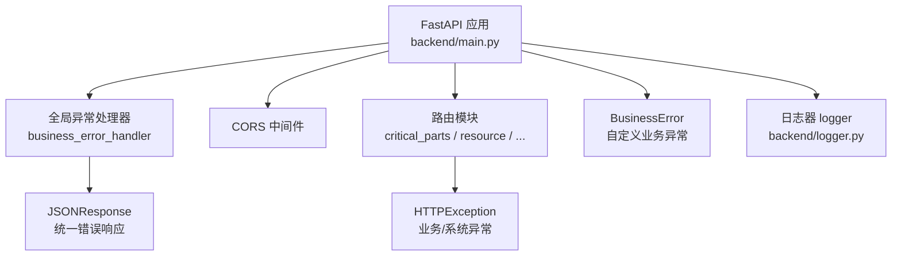
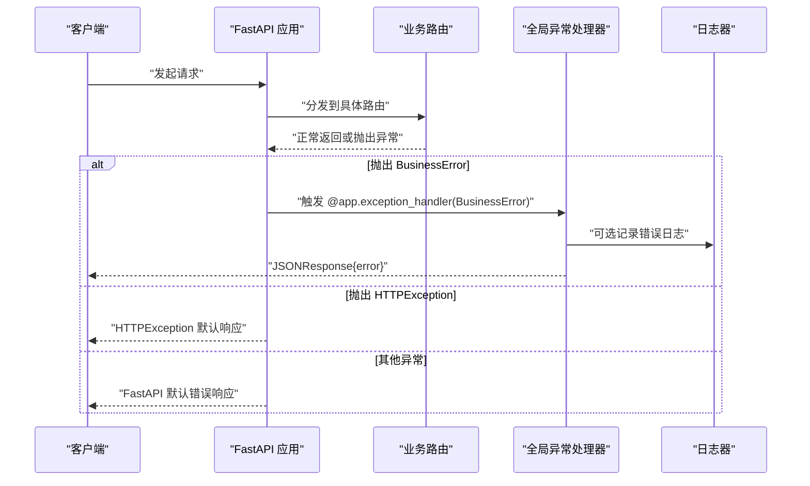
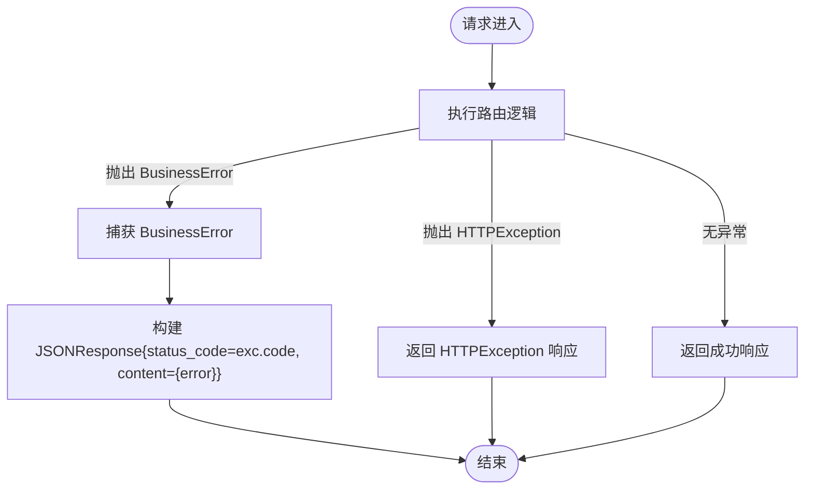
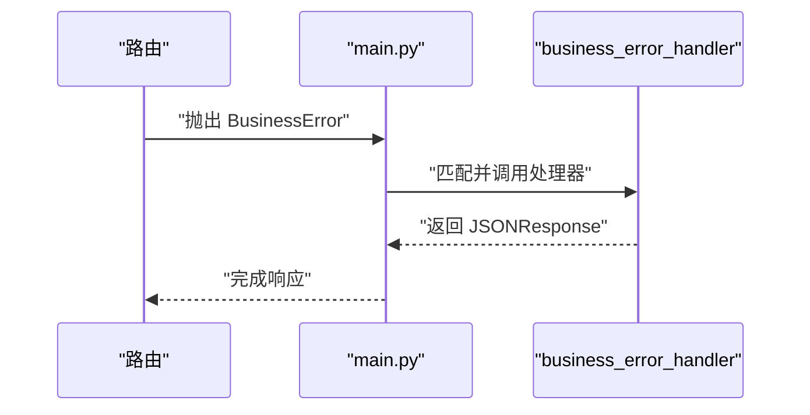
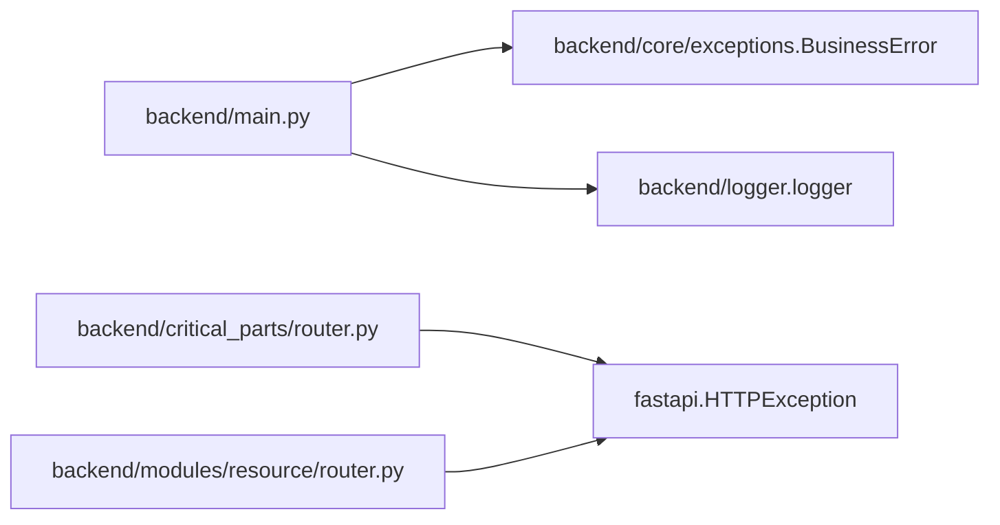

# 全局异常处理器

<cite>
**本文引用的文件**
- [backend/core/exceptions.py](file://backend/core/exceptions.py)
- [backend/main.py](file://backend/main.py)
- [backend/critical_parts/router.py](file://backend/critical_parts/router.py)
- [backend/modules/resource/router.py](file://backend/modules/resource/router.py)
- [backend/logger.py](file://backend/logger.py)
</cite>

## 目录
1. [简介](#简介)
2. [项目结构](#项目结构)
3. [核心组件](#核心组件)
4. [架构总览](#架构总览)
5. [详细组件分析](#详细组件分析)
6. [依赖关系分析](#依赖关系分析)
7. [性能考虑](#性能考虑)
8. [故障排查指南](#故障排查指南)
9. [结论](#结论)
10. [附录：错误码与最佳实践](#附录错误码与最佳实践)

## 简介
本文件聚焦于 FastAPI 应用中的全局异常处理机制，围绕自定义业务异常 BusinessError、HTTPException 的使用策略、异常处理器的注册与执行流程、统一错误响应格式设计，以及调试与排错技巧进行系统化说明。目标是帮助开发者在 spiderV5 后端中建立一致、可维护、可观测的异常处理体系。

## 项目结构
本项目采用模块化路由组织，异常处理相关代码主要分布在以下位置：
- 自定义业务异常定义：backend/core/exceptions.py
- 应用入口与全局异常处理器注册：backend/main.py
- 各模块路由中的异常抛出示例：backend/critical_parts/router.py、backend/modules/resource/router.py
- 日志记录：backend/logger.py（用于异常与错误信息记录）

图表来源
- [backend/main.py:29-92](file://backend/main.py#L29-L92)
- [backend/core/exceptions.py:1-8](file://backend/core/exceptions.py#L1-L8)
- [backend/logger.py:14-42](file://backend/logger.py#L14-L42)

章节来源
- [backend/main.py:29-92](file://backend/main.py#L29-L92)
- [backend/core/exceptions.py:1-8](file://backend/core/exceptions.py#L1-L8)
- [backend/logger.py:14-42](file://backend/logger.py#L14-L42)

## 核心组件
- 自定义业务异常 BusinessError：用于表达“业务规则不满足”的错误，携带 message 与 code 字段，便于上层统一返回语义化错误。
- 全局异常处理器 business_error_handler：捕获 BusinessError，并以 JSONResponse 形式返回统一格式的错误响应。
- HTTPException：在各路由中被广泛使用，表示参数校验失败、资源不存在、服务器内部错误等场景。
- 日志器 logger：提供结构化日志输出，便于定位异常上下文。

章节来源
- [backend/core/exceptions.py:1-8](file://backend/core/exceptions.py#L1-L8)
- [backend/main.py:86-92](file://backend/main.py#L86-L92)
- [backend/critical_parts/router.py:23-86](file://backend/critical_parts/router.py#L23-L86)
- [backend/modules/resource/router.py:70-201](file://backend/modules/resource/router.py#L70-L201)
- [backend/logger.py:14-42](file://backend/logger.py#L14-L42)

## 架构总览
FastAPI 请求进入后，先经过中间件（如 CORS），再进入路由处理。若路由或业务逻辑抛出异常：
- 若为 BusinessError，则由全局异常处理器捕获并返回统一错误响应。
- 若为 HTTPException，则按 FastAPI 默认行为返回对应状态码与 detail。
- 其他未捕获异常将走 FastAPI 默认错误处理路径。

图表来源
- [backend/main.py:86-92](file://backend/main.py#L86-L92)
- [backend/critical_parts/router.py:23-86](file://backend/critical_parts/router.py#L23-L86)
- [backend/modules/resource/router.py:70-201](file://backend/modules/resource/router.py#L70-L201)
- [backend/logger.py:14-42](file://backend/logger.py#L14-L42)

## 详细组件分析

### 自定义业务异常 BusinessError
- 职责：封装业务层面的错误，包含 message 与 code，便于上层统一格式化。
- 使用建议：在业务校验失败时优先抛出 BusinessError，以明确区分“业务错误”和“系统错误”。
- 扩展性：可在子类中增加更多上下文字段（如 trace_id、field_name）。

章节来源
- [backend/core/exceptions.py:1-8](file://backend/core/exceptions.py#L1-L8)

### 全局异常处理器 business_error_handler
- 注册方式：通过 @app.exception_handler(BusinessError) 装饰器注册。
- 执行时机：当路由或业务逻辑抛出 BusinessError 时触发。
- 返回格式：JSONResponse，状态码取自 exc.code，消息体包含 error 字段。
- 日志集成：建议在处理器内记录错误日志，便于追踪问题。

图表来源
- [backend/main.py:86-92](file://backend/main.py#L86-L92)

章节来源
- [backend/main.py:86-92](file://backend/main.py#L86-L92)

### 业务异常与系统异常的区分策略
- 业务异常（BusinessError）：用于表达“业务规则不满足”，例如参数缺失、数据不一致、权限不足等。应携带明确的错误码与消息。
- 系统异常（HTTPException）：用于表达“系统层错误”，如 404 资源不存在、500 服务器内部错误、400 参数校验失败等。
- 建议：
  - 业务层优先抛出 BusinessError，由全局处理器统一返回；
  - 路由层对已知错误使用 HTTPException 快速返回；
  - 未知异常尽量捕获并转为 HTTPException(500)，避免泄露堆栈细节。

章节来源
- [backend/critical_parts/router.py:23-86](file://backend/critical_parts/router.py#L23-L86)
- [backend/modules/resource/router.py:70-201](file://backend/modules/resource/router.py#L70-L201)

### 统一错误响应格式设计
当前 BusinessError 处理器返回的 JSON 结构为：
- status_code：来自 exc.code
- content：包含 error 字段（字符串）

建议后续统一为更丰富的结构，例如：
- code：业务错误码（数字）
- message：人类可读的错误消息
- detail：可选的详细错误信息（如字段名、原因）
- request_id：可选的请求追踪 ID

注意：当前实现仅包含 error 字段，如需扩展，请在全局处理器中调整返回结构，并在所有调用方保持一致。

章节来源
- [backend/main.py:86-92](file://backend/main.py#L86-L92)

### 异常处理器的注册方式与执行流程
- 注册：在应用启动时通过 @app.exception_handler(BusinessError) 注册处理器。
- 执行流程：
  1) 路由抛出 BusinessError；
  2) FastAPI 查找匹配的异常处理器；
  3) 调用 business_error_handler(request, exc)；
  4) 返回 JSONResponse。

图表来源
- [backend/main.py:86-92](file://backend/main.py#L86-L92)

章节来源
- [backend/main.py:86-92](file://backend/main.py#L86-L92)

### 典型异常处理示例
- 关键件评分路由：在资源不存在时抛出 HTTPException(404)。
- 试制资源路由：在参数错误或资源不存在时抛出 HTTPException(400/404)，在未知异常时抛出 HTTPException(500)。

章节来源
- [backend/critical_parts/router.py:23-86](file://backend/critical_parts/router.py#L23-L86)
- [backend/modules/resource/router.py:70-201](file://backend/modules/resource/router.py#L70-L201)

## 依赖关系分析
- main.py 依赖 BusinessError 并注册其处理器。
- 各路由模块依赖 HTTPException 表达常见错误。
- logger.py 提供统一的日志能力，可用于异常记录。

图表来源
- [backend/main.py:16-92](file://backend/main.py#L16-L92)
- [backend/critical_parts/router.py:7-86](file://backend/critical_parts/router.py#L7-L86)
- [backend/modules/resource/router.py:7-201](file://backend/modules/resource/router.py#L7-L201)
- [backend/logger.py:14-42](file://backend/logger.py#L14-L42)

章节来源
- [backend/main.py:16-92](file://backend/main.py#L16-L92)
- [backend/critical_parts/router.py:7-86](file://backend/critical_parts/router.py#L7-L86)
- [backend/modules/resource/router.py:7-201](file://backend/modules/resource/router.py#L7-L201)
- [backend/logger.py:14-42](file://backend/logger.py#L14-L42)

## 性能考虑
- 异常处理器应尽量轻量，避免在处理器中进行复杂计算或外部 IO。
- 日志写入建议使用异步或缓冲策略，减少 I/O 阻塞。
- 对于高频错误，建议在上层进行重试或降级，避免重复抛异常造成性能抖动。
- 在生产环境关闭详细堆栈输出，防止敏感信息泄露。

[本节为通用指导，无需特定文件引用]

## 故障排查指南
- 定位 BusinessError：检查路由或业务逻辑是否抛出 BusinessError，确认 exc.code 与 exc.message 是否符合预期。
- 定位 HTTPException：查看路由中对 HTTPException 的抛出点，确认状态码与 detail 是否合理。
- 日志排查：通过 backend/logger.py 输出的日志文件，结合时间戳与错误信息进行定位。
- 常见问题：
  - 未捕获异常导致 500：确保在路由层捕获未知异常并转为 HTTPException(500)。
  - 错误消息不清晰：在 BusinessError 或 HTTPException.detail 中提供更具体的上下文。
  - 前端无法解析错误：确保全局处理器返回的 JSON 结构与前端期望一致。

章节来源
- [backend/logger.py:14-42](file://backend/logger.py#L14-L42)
- [backend/critical_parts/router.py:23-86](file://backend/critical_parts/router.py#L23-L86)
- [backend/modules/resource/router.py:70-201](file://backend/modules/resource/router.py#L70-L201)

## 结论
本项目已具备基础的异常处理能力：通过 BusinessError 与全局处理器实现业务异常的标准化返回，并通过 HTTPException 覆盖常见系统错误。建议后续统一错误响应结构、增强日志记录、完善错误码规范，以提升可维护性与可观测性。

[本节为总结，无需特定文件引用]

## 附录：错误码与最佳实践

### 错误码规范建议
- 2xx：成功
- 400：参数校验失败或业务规则不满足（BusinessError 或 HTTPException(400)）
- 404：资源不存在（HTTPException(404)）
- 500：服务器内部错误（HTTPException(500)）

章节来源
- [backend/critical_parts/router.py:23-86](file://backend/critical_parts/router.py#L23-L86)
- [backend/modules/resource/router.py:70-201](file://backend/modules/resource/router.py#L70-L201)

### 最佳实践
- 业务层优先抛出 BusinessError，携带清晰的 message 与 code。
- 路由层对已知错误使用 HTTPException，避免裸异常上抛。
- 在全局处理器中记录错误日志，便于追踪。
- 统一错误响应结构，前后端约定一致。
- 生产环境隐藏堆栈细节，仅返回必要信息。

章节来源
- [backend/main.py:86-92](file://backend/main.py#L86-L92)
- [backend/logger.py:14-42](file://backend/logger.py#L14-L42)