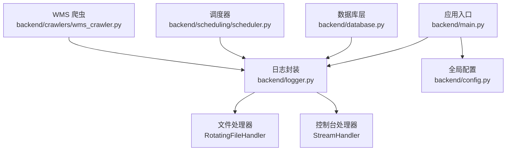
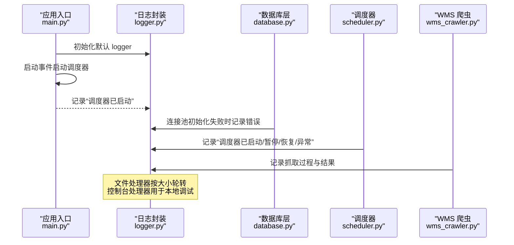
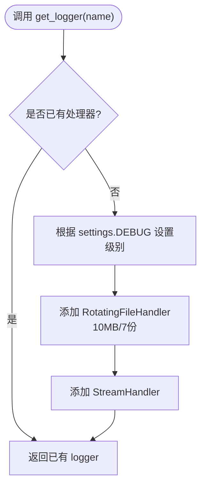
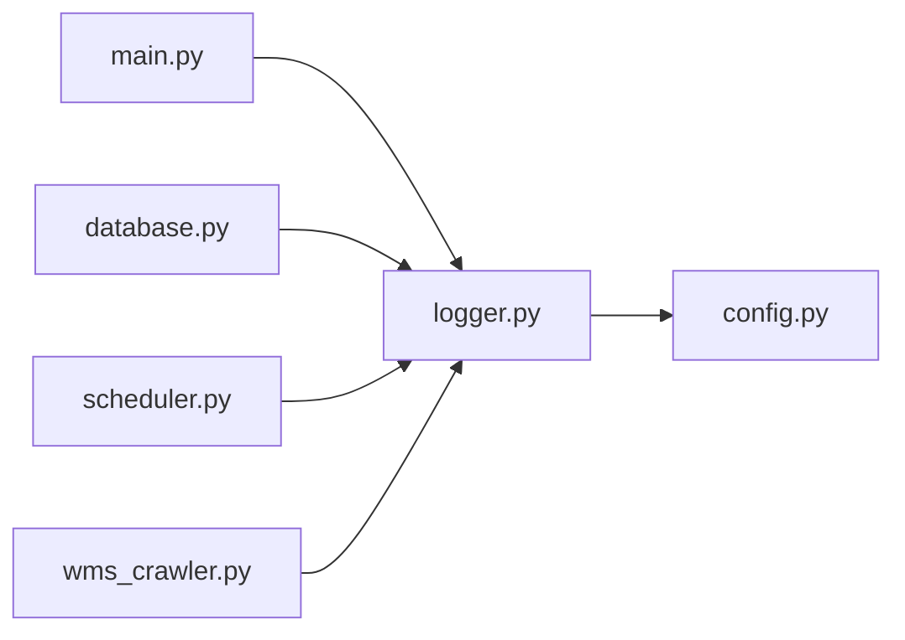

# 日志记录系统

<cite>
**本文引用的文件**
- [backend/logger.py](file://backend/logger.py)
- [backend/config.py](file://backend/config.py)
- [backend/main.py](file://backend/main.py)
- [backend/database.py](file://backend/database.py)
- [backend/scheduling/scheduler.py](file://backend/scheduling/scheduler.py)
- [backend/crawlers/wms_crawler.py](file://backend/crawlers/wms_crawler.py)
- [backend/env.example](file://backend/env.example)
</cite>

## 目录
1. [简介](#简介)
2. [项目结构](#项目结构)
3. [核心组件](#核心组件)
4. [架构总览](#架构总览)
5. [详细组件分析](#详细组件分析)
6. [依赖关系分析](#依赖关系分析)
7. [性能考量](#性能考量)
8. [故障排查指南](#故障排查指南)
9. [结论](#结论)
10. [附录：使用示例与配置模板](#附录使用示例与配置模板)

## 简介
本文件系统性地梳理并文档化后端 Python 日志记录体系。该体系基于标准库 logging，结合 RotatingFileHandler 实现按大小轮转的文件日志，并通过统一入口 get_logger 提供一致的日志级别、格式化与输出目标（文件+控制台）。日志级别根据运行环境（DEBUG/非 DEBUG）自动切换；日志文件按模块名分文件存储，便于定位问题。本文还涵盖不同环境的配置差异、日志查询与分析建议、性能优化与监控集成方案，以及可直接复用的配置模板与使用示例路径。

## 项目结构
- 日志核心封装位于 backend/logger.py，负责创建 logger、设置级别、添加处理器与格式化器。
- 全局配置位于 backend/config.py，通过环境变量加载 Settings，其中包含 DEBUG 等开关，影响日志级别。
- 应用入口 backend/main.py 在启动时初始化服务并记录关键生命周期事件。
- 各业务模块（数据库、调度器、爬虫等）通过导入 logger 或 get_logger 进行日志记录。
- 环境变量模板 backend/env.example 提供可复制的 .env 配置样例。

图表来源
- [backend/main.py:1-159](file://backend/main.py#L1-L159)
- [backend/logger.py:1-43](file://backend/logger.py#L1-L43)
- [backend/config.py:1-102](file://backend/config.py#L1-L102)
- [backend/database.py:1-116](file://backend/database.py#L1-L116)
- [backend/scheduling/scheduler.py:1-196](file://backend/scheduling/scheduler.py#L1-L196)
- [backend/crawlers/wms_crawler.py:1-200](file://backend/crawlers/wms_crawler.py#L1-L200)

章节来源
- [backend/logger.py:1-43](file://backend/logger.py#L1-L43)
- [backend/config.py:1-102](file://backend/config.py#L1-L102)
- [backend/main.py:1-159](file://backend/main.py#L1-L159)

## 核心组件
- 日志封装模块（backend/logger.py）
  - 提供 get_logger(name) 获取或复用 logger 实例，避免重复注册处理器。
  - 根据 settings.DEBUG 动态设置日志级别：开发为 DEBUG，生产为 INFO。
  - 文件处理器：RotatingFileHandler，单文件最大 10MB，保留最近 7 个历史文件，UTF-8 编码。
  - 控制台处理器：StreamHandler，便于本地调试。
  - 统一格式：时间戳 + 级别 + 模块名 + 消息。
- 全局配置（backend/config.py）
  - 从 .env 加载配置，提供 Settings 对象，含 DEBUG、CORS_ORIGINS、SERVER_* 等。
  - 布尔值解析支持多种写法（true/false、1/0、yes/no/on）。
- 应用入口（backend/main.py）
  - 启动/关闭事件记录调度器状态变更。
  - 健康检查接口与健康信息。
  - 启动时记录服务器地址与前端静态资源加载情况。
- 数据访问层（backend/database.py）
  - 连接池初始化失败时记录错误日志，提示检查 .env 配置。
- 调度器（backend/scheduling/scheduler.py）
  - 后台线程循环执行定时任务，记录启动、暂停、恢复、异常等关键事件。
- WMS 爬虫（backend/crawlers/wms_crawler.py）
  - 内部维护运行时日志缓冲区（供前端读取），同时写入文件日志。
  - 限制缓冲区大小，避免内存无限增长。

章节来源
- [backend/logger.py:14-38](file://backend/logger.py#L14-L38)
- [backend/config.py:48-98](file://backend/config.py#L48-L98)
- [backend/main.py:36-55](file://backend/main.py#L36-L55)
- [backend/database.py:12-43](file://backend/database.py#L12-L43)
- [backend/scheduling/scheduler.py:34-66](file://backend/scheduling/scheduler.py#L34-L66)
- [backend/crawlers/wms_crawler.py:111-125](file://backend/crawlers/wms_crawler.py#L111-L125)

## 架构总览
下图展示了日志系统在应用中的整体交互：应用启动后，各模块通过统一的 logger 或 get_logger 记录日志；日志同时输出到文件与控制台；文件按模块名分文件存储并按大小轮转。

图表来源
- [backend/main.py:36-55](file://backend/main.py#L36-L55)
- [backend/logger.py:14-38](file://backend/logger.py#L14-L38)
- [backend/database.py:12-43](file://backend/database.py#L12-L43)
- [backend/scheduling/scheduler.py:34-66](file://backend/scheduling/scheduler.py#L34-L66)
- [backend/crawlers/wms_crawler.py:111-125](file://backend/crawlers/wms_crawler.py#L111-L125)

## 详细组件分析

### 日志封装模块（backend/logger.py）
- 设计要点
  - 单例化：get_logger 通过命名空间复用 logger，避免重复添加处理器。
  - 级别策略：settings.DEBUG 为真时使用 DEBUG，否则使用 INFO。
  - 文件轮转：RotatingFileHandler，maxBytes=10MB，backupCount=7，UTF-8 编码。
  - 格式化：统一的时间、级别、模块名、消息格式。
- 复杂度与性能
  - 首次调用会创建处理器并设置格式化器，后续调用直接返回已有 logger，开销极低。
  - 文件 I/O 由底层 handler 管理，轮转策略避免单文件过大。
- 可扩展点
  - 可按需增加 JSON 格式化器以对接集中式日志平台。
  - 可增加异步处理器或第三方 sink（如 Sentry、ELK）。

图表来源
- [backend/logger.py:14-38](file://backend/logger.py#L14-L38)

章节来源
- [backend/logger.py:1-43](file://backend/logger.py#L1-L43)

### 全局配置与环境变量（backend/config.py, backend/env.example）
- 作用
  - 集中管理数据库、服务、爬虫、第三方 API 等配置。
  - 提供类型安全的读取函数（整数、布尔、列表）。
  - 通过 DEBUG 控制日志级别。
- 环境变量
  - DEBUG=true 表示开发模式（更详细的日志）。
  - SERVER_HOST/SERVER_PORT 控制服务监听地址与端口。
  - CORS_ORIGINS 控制跨域来源。
  - 其他如数据库、WMS、飞书、采购系统、LLM 等配置项。
- 最佳实践
  - 生产环境将 DEBUG 设为 false，减少日志量并提升性能。
  - 使用 .env 隔离敏感信息，避免提交到版本库。

章节来源
- [backend/config.py:25-98](file://backend/config.py#L25-L98)
- [backend/env.example:1-49](file://backend/env.example#L1-L49)

### 应用入口与生命周期日志（backend/main.py）
- 启动事件
  - 启动调度器并记录成功/失败。
  - 记录前端静态首页加载情况。
- 关闭事件
  - 停止调度器并记录状态。
- 健康检查
  - 提供 /api/health 接口返回运行状态。
- 服务器启动
  - 记录服务器地址与 uvicorn 启动参数。

章节来源
- [backend/main.py:36-55](file://backend/main.py#L36-L55)
- [backend/main.py:85-120](file://backend/main.py#L85-L120)

### 数据库层日志（backend/database.py）
- 连接池初始化失败时记录错误，并给出明确的排查指引（检查 .env 中 DB_* 配置）。
- 所有写操作在异常时回滚并抛出异常，确保数据一致性。

章节来源
- [backend/database.py:12-43](file://backend/database.py#L12-L43)
- [backend/database.py:73-116](file://backend/database.py#L73-L116)

### 调度器日志（backend/scheduling/scheduler.py）
- 记录调度器生命周期：启动、暂停、恢复、异常、退出。
- 自动增量同步流程中记录开始、完成及统计信息。
- 配置读取失败或无效时记录警告并降级处理。

章节来源
- [backend/scheduling/scheduler.py:34-66](file://backend/scheduling/scheduler.py#L34-L66)
- [backend/scheduling/scheduler.py:93-153](file://backend/scheduling/scheduler.py#L93-L153)
- [backend/scheduling/scheduler.py:155-196](file://backend/scheduling/scheduler.py#L155-L196)

### WMS 爬虫日志（backend/crawlers/wms_crawler.py）
- 内部 _log 方法将每条日志加入内存缓冲区（限制 500 行），同时调用 logger 写入文件日志。
- 提供 get_logs 供外部读取当前运行日志快照，便于前端展示。
- 网络请求失败或接口异常时记录 warn 级别日志，便于快速定位问题。

章节来源
- [backend/crawlers/wms_crawler.py:111-125](file://backend/crawlers/wms_crawler.py#L111-L125)
- [backend/crawlers/wms_crawler.py:180-200](file://backend/crawlers/wms_crawler.py#L180-L200)

## 依赖关系分析
- 耦合与内聚
  - logger.py 仅依赖 config.py 的 settings，低耦合、高内聚。
  - 各模块通过导入 logger 或 get_logger 使用日志，职责清晰。
- 外部依赖
  - logging 标准库与 RotatingFileHandler。
  - dotenv 用于加载 .env。
- 潜在风险
  - 若未正确设置 .env，可能导致数据库连接失败并在日志中报错。
  - 生产环境若未关闭 DEBUG，可能产生过多日志影响性能。

图表来源
- [backend/logger.py:1-43](file://backend/logger.py#L1-L43)
- [backend/config.py:1-102](file://backend/config.py#L1-L102)
- [backend/main.py:1-159](file://backend/main.py#L1-L159)
- [backend/database.py:1-116](file://backend/database.py#L1-L116)
- [backend/scheduling/scheduler.py:1-196](file://backend/scheduling/scheduler.py#L1-L196)
- [backend/crawlers/wms_crawler.py:1-200](file://backend/crawlers/wms_crawler.py#L1-L200)

章节来源
- [backend/logger.py:1-43](file://backend/logger.py#L1-L43)
- [backend/config.py:1-102](file://backend/config.py#L1-L102)

## 性能考量
- 日志级别
  - 生产环境建议设置 DEBUG=false，降低日志量与 I/O 压力。
- 文件轮转
  - 单文件 10MB、保留 7 份，避免磁盘占用过大；可根据业务调整 maxBytes 与 backupCount。
- 缓冲与限流
  - WMS 爬虫内存日志缓冲区限制 500 行，防止内存泄漏。
- 并发与线程安全
  - logging 模块本身线程安全；调度器使用 daemon 线程，避免阻塞进程退出。
- 扩展建议
  - 在高吞吐场景可考虑异步日志或批量写入。
  - 对接集中式日志平台（JSON 格式）以提升检索与分析效率。

[本节为通用指导，不直接分析具体文件]

## 故障排查指南
- 数据库连接失败
  - 现象：连接池初始化失败，记录错误日志并提示检查 .env。
  - 处理：确认 DB_HOST、DB_PORT、DB_USER、DB_PASSWORD、DB_DATABASE 配置正确；确保 .env 存在且有效。
- 调度器异常
  - 现象：调度器循环捕获异常并记录堆栈，等待 30 秒重试。
  - 处理：查看对应异常日志，检查配置读取与爬虫管理器状态。
- 爬虫接口异常
  - 现象：接口返回异常或网络超时，记录 warn 日志。
  - 处理：检查凭证、网络连通性与接口可用性；必要时调整超时与重试策略。
- 日志文件过大
  - 现象：logs 目录下文件增长较快。
  - 处理：调整轮转参数（maxBytes、backupCount），或接入日志归档与清理策略。

章节来源
- [backend/database.py:12-43](file://backend/database.py#L12-L43)
- [backend/scheduling/scheduler.py:149-153](file://backend/scheduling/scheduler.py#L149-L153)
- [backend/crawlers/wms_crawler.py:180-200](file://backend/crawlers/wms_crawler.py#L180-L200)

## 结论
本项目采用标准库 logging 构建统一、可配置的日志体系，结合 RotatingFileHandler 实现文件轮转，满足开发与生产环境的差异化需求。通过全局配置与环境变量控制日志级别与行为，各模块职责清晰、易于维护。建议在生产环境关闭 DEBUG、合理设置轮转策略，并考虑引入集中式日志平台以提升可观测性。

[本节为总结性内容，不直接分析具体文件]

## 附录：使用示例与配置模板

### 日志使用示例（路径引用）
- 应用入口记录生命周期事件
  - [backend/main.py:36-55](file://backend/main.py#L36-L55)
  - [backend/main.py:120-159](file://backend/main.py#L120-L159)
- 数据库层记录连接池初始化错误
  - [backend/database.py:12-43](file://backend/database.py#L12-L43)
- 调度器记录启动、暂停、恢复与异常
  - [backend/scheduling/scheduler.py:34-66](file://backend/scheduling/scheduler.py#L34-L66)
  - [backend/scheduling/scheduler.py:93-153](file://backend/scheduling/scheduler.py#L93-L153)
  - [backend/scheduling/scheduler.py:155-196](file://backend/scheduling/scheduler.py#L155-L196)
- WMS 爬虫记录抓取过程与结果
  - [backend/crawlers/wms_crawler.py:111-125](file://backend/crawlers/wms_crawler.py#L111-L125)
  - [backend/crawlers/wms_crawler.py:180-200](file://backend/crawlers/wms_crawler.py#L180-L200)

### 配置模板与环境差异
- 开发环境
  - DEBUG=true，启用更详细的日志（DEBUG 级别）。
  - 参考模板：[backend/env.example:14-20](file://backend/env.example#L14-L20)
- 生产环境
  - DEBUG=false，仅记录 INFO 及以上级别，减少日志量。
  - 建议配合日志轮转策略与集中式日志平台。
  - 参考模板：[backend/env.example:14-20](file://backend/env.example#L14-L20)

### 日志文件格式与轮转策略
- 格式：时间戳 + 级别 + 模块名 + 消息
  - 定义位置：[backend/logger.py:10-11](file://backend/logger.py#L10-L11)
- 轮转：单文件 10MB，保留 7 份历史文件
  - 定义位置：[backend/logger.py:23-31](file://backend/logger.py#L23-L31)

### 日志查询与分析最佳实践
- 按模块名过滤：日志文件名与 logger name 一致，便于定位模块问题。
- 按级别筛选：优先关注 ERROR/WARN，再回溯 INFO/DEBUG。
- 时间范围检索：利用时间戳字段快速定位特定时间段的问题。
- 结合业务上下文：在关键路径记录必要上下文（如请求 ID、用户 ID、数据源名称）。

### 监控集成方案建议
- 结构化日志：将日志改为 JSON 格式，便于 ELK/Loki 等平台解析与检索。
- 指标上报：在关键路径记录性能指标（耗时、成功率、错误率）。
- 告警规则：对 ERROR 频率、特定关键字（如“连接失败”、“接口异常”）设置告警。
- 日志归档：定期压缩与归档历史日志，降低存储成本。

[本节为通用指导与模板说明，不直接分析具体文件]