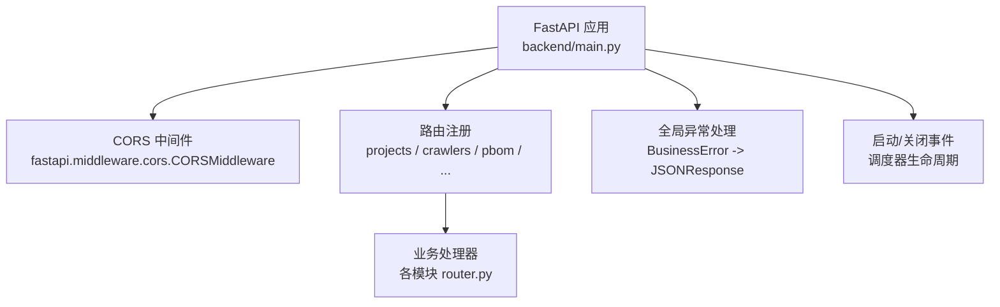
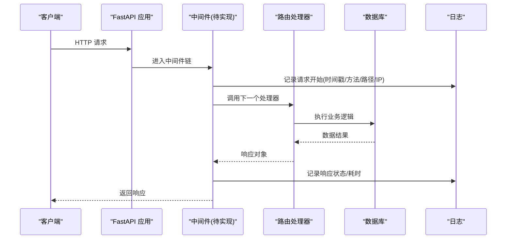
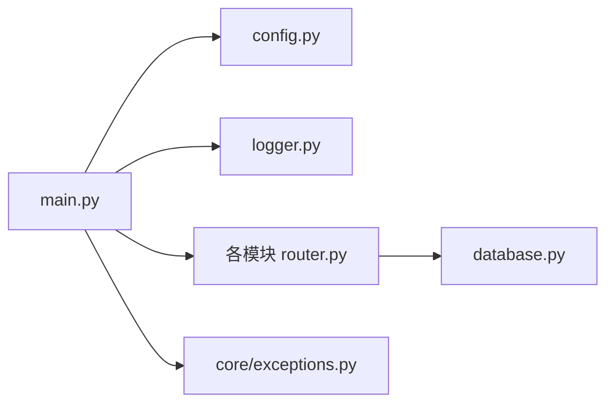

# 自定义中间件开发

<cite>
**本文引用的文件**
- [backend/main.py](file://backend/main.py)
- [backend/config.py](file://backend/config.py)
- [backend/core/exceptions.py](file://backend/core/exceptions.py)
- [backend/logger.py](file://backend/logger.py)
- [backend/database.py](file://backend/database.py)
- [backend/projects/router.py](file://backend/projects/router.py)
</cite>

## 目录
1. [简介](#简介)
2. [项目结构](#项目结构)
3. [核心组件](#核心组件)
4. [架构总览](#架构总览)
5. [详细组件分析](#详细组件分析)
6. [依赖关系分析](#依赖关系分析)
7. [性能考虑](#性能考虑)
8. [故障排查指南](#故障排查指南)
9. [结论](#结论)
10. [附录：示例实现清单](#附录示例实现清单)

## 简介
本文件面向希望在 FastAPI 中开发“可复用、可配置、可测试”的自定义中间件的工程师，结合本项目现有代码与最佳实践，系统阐述以下主题：
- 请求预处理、响应后处理、错误捕获机制
- 中间件执行顺序与管道式处理模型
- 可复用中间件的设计（参数配置、依赖注入）
- 性能考量与最佳实践
- 调试与测试方法
- 常见场景示例：请求验证、缓存、限流等

## 项目结构
本项目采用模块化路由组织，应用入口在 backend/main.py，全局配置在 backend/config.py，日志在 backend/logger.py，数据库访问在 backend/database.py，业务路由分散在各模块 router.py。当前已使用内置 CORS 中间件，尚未包含业务级自定义中间件。

图表来源
- [backend/main.py:29-83](file://backend/main.py#L29-L83)
- [backend/main.py:85-97](file://backend/main.py#L85-L97)

章节来源
- [backend/main.py:29-83](file://backend/main.py#L29-L83)
- [backend/config.py:48-98](file://backend/config.py#L48-L98)

## 核心组件
- 应用入口与中间件挂载点：FastAPI 实例创建、add_middleware、路由 include_router、全局异常处理器、健康检查与 SPA 回退。
- 配置中心：Settings 类集中管理环境变量，提供类型安全的配置读取。
- 日志：统一 logger，支持按模块命名与轮转文件输出。
- 数据库：连接池封装，提供查询与写操作函数。
- 业务路由：以 APIRouter 组织，遵循统一的返回结构与错误抛出方式。

章节来源
- [backend/main.py:29-83](file://backend/main.py#L29-L83)
- [backend/config.py:48-98](file://backend/config.py#L48-L98)
- [backend/logger.py:14-43](file://backend/logger.py#L14-L43)
- [backend/database.py:12-43](file://backend/database.py#L12-L43)
- [backend/projects/router.py:32-81](file://backend/projects/router.py#L32-L81)

## 架构总览
下图展示请求从进入 FastAPI 到返回响应的完整路径，以及中间件在其中的位置与作用点。

图表来源
- [backend/main.py:66-83](file://backend/main.py#L66-L83)
- [backend/logger.py:14-43](file://backend/logger.py#L14-L43)
- [backend/database.py:51-85](file://backend/database.py#L51-L85)

## 详细组件分析

### 中间件执行顺序与管道模型
- FastAPI 中间件以“洋葱模型”运行：请求进入时自外向内依次执行，响应返回时自内向外依次执行。
- 当前仅挂载了 CORS 中间件；后续新增的业务中间件将按 add_middleware 的调用顺序形成新的链路。
- 建议将“通用横切关注点”（如鉴权、限流、审计、缓存）拆分为独立中间件，并通过 Settings 进行开关与参数控制。

章节来源
- [backend/main.py:66-83](file://backend/main.py#L66-L83)

### 请求预处理
- 目标：在到达业务路由前完成参数校验、签名校验、IP 白名单、请求体大小限制、租户上下文注入等。
- 设计要点：
  - 基于 Request 对象读取 headers、query、path_params、body。
  - 对非法输入快速失败，返回标准错误格式。
  - 通过依赖注入或闭包传入外部服务（如 Redis、RateLimit 服务）。
- 在本项目中，可复用 logger 记录请求元信息，便于追踪。

章节来源
- [backend/logger.py:14-43](file://backend/logger.py#L14-L43)

### 响应后处理
- 目标：统一添加响应头（如 trace_id）、统计耗时、敏感字段脱敏、压缩策略等。
- 设计要点：
  - 在调用 next(request) 之后获取 Response，再写入额外信息。
  - 避免阻塞 I/O，尽量轻量。
  - 对大响应体谨慎压缩，权衡 CPU 与带宽。

章节来源
- [backend/main.py:85-97](file://backend/main.py#L85-L97)

### 错误捕获机制
- 当前已定义 BusinessError 并在 main 中注册全局异常处理器，将业务异常转换为 JSONResponse。
- 中间件中应优先抛出结构化异常（如 BusinessError），由全局处理器统一收敛，避免散落的 try/except。
- 对于第三方库异常，建议在中间件层捕获并转换为业务友好错误。

章节来源
- [backend/core/exceptions.py:1-8](file://backend/core/exceptions.py#L1-L8)
- [backend/main.py:85-92](file://backend/main.py#L85-L92)

### 可复用中间件组件（参数配置与依赖注入）
- 参数配置：通过 Settings 暴露开关与阈值（例如是否启用限流、QPS 上限、缓存 TTL 等），保持运行时可配置。
- 依赖注入：中间件内部通过工厂函数或类封装，接收外部服务实例（如缓存、限流器、认证服务），便于单元测试替换为 Mock。
- 组合性：每个中间件职责单一，可自由组合；复杂流程可通过“中间件编排器”统一管理。

章节来源
- [backend/config.py:48-98](file://backend/config.py#L48-L98)

### 性能考虑与最佳实践
- 最小化 I/O：避免在中间件中进行同步阻塞 IO；必要时使用异步 I/O。
- 早失败：在中间件早期阶段拒绝明显非法请求，减少下游开销。
- 缓存命中优先：对读多写少的接口，优先尝试缓存命中，未命中再落库。
- 限流保护：在高并发下对关键接口实施令牌桶/漏桶限流，防止雪崩。
- 日志采样：高频接口可采用采样日志，降低磁盘压力。
- 资源释放：确保连接、句柄在使用后及时释放，避免泄漏。

[本节为通用指导，不直接分析具体文件]

### 调试与测试方法
- 调试：
  - 开启 DEBUG 模式，配合详细日志定位问题。
  - 在中间件前后打点，记录耗时与关键变量（注意脱敏）。
- 测试：
  - 使用 TestClient 构造请求，断言响应码、响应体与响应头。
  - 针对中间件单独编写用例：覆盖正常路径、边界条件、异常分支。
  - 使用 Mock 替换外部依赖（数据库、缓存、第三方 API）。

章节来源
- [backend/config.py:84-85](file://backend/config.py#L84-L85)
- [backend/logger.py:20-36](file://backend/logger.py#L20-L36)

## 依赖关系分析
- 应用入口依赖配置、日志、路由与异常处理。
- 路由依赖数据库访问与业务逻辑。
- 中间件（未来新增）将依赖配置、日志与可能的缓存/限流服务。

图表来源
- [backend/main.py:29-83](file://backend/main.py#L29-L83)
- [backend/config.py:48-98](file://backend/config.py#L48-L98)
- [backend/logger.py:14-43](file://backend/logger.py#L14-L43)
- [backend/database.py:12-43](file://backend/database.py#L12-L43)
- [backend/core/exceptions.py:1-8](file://backend/core/exceptions.py#L1-L8)

章节来源
- [backend/main.py:29-83](file://backend/main.py#L29-L83)
- [backend/config.py:48-98](file://backend/config.py#L48-L98)
- [backend/logger.py:14-43](file://backend/logger.py#L14-L43)
- [backend/database.py:12-43](file://backend/database.py#L12-L43)
- [backend/core/exceptions.py:1-8](file://backend/core/exceptions.py#L1-L8)

## 性能考虑
- 中间件应尽量无状态或共享只读状态，避免在每个请求中重建昂贵对象。
- 对高吞吐接口，优先使用异步 I/O，避免阻塞事件循环。
- 合理设置日志级别与采样率，避免日志成为瓶颈。
- 对大响应体启用按需压缩，并结合缓存减少重复计算。
- 数据库连接池已配置，注意在中间件中不要持有长连接。

[本节为通用指导，不直接分析具体文件]

## 故障排查指南
- 常见问题：
  - 配置缺失：当 .env 未正确配置时，数据库连接会失败并记录明确错误信息。
  - 中间件异常：若中间件抛出未捕获异常，将被全局异常处理器统一收敛。
  - 日志过大：检查日志轮转策略与采样配置。
- 定位步骤：
  - 查看 logs 目录下对应模块日志，确认请求进入与退出时间点。
  - 检查中间件链顺序，确认是否在预期阶段拦截。
  - 对疑似问题中间件增加更细粒度的日志与指标埋点。

章节来源
- [backend/database.py:18-43](file://backend/database.py#L18-L43)
- [backend/logger.py:20-36](file://backend/logger.py#L20-L36)
- [backend/main.py:85-92](file://backend/main.py#L85-L92)

## 结论
本项目已具备构建高质量中间件的基础设施：清晰的入口与路由组织、统一的配置与日志、健壮的全局异常处理。在此基础上，可按需实现请求验证、缓存、限流等中间件，并通过参数化与依赖注入提升可复用性与可测试性。建议遵循“单一职责、低耦合、可观测、高性能”的原则逐步落地。

[本节为总结性内容，不直接分析具体文件]

## 附录：示例实现清单
以下为可在本项目中落地的中间件示例清单（概念性说明，不包含具体代码）：
- 请求验证中间件
  - 功能：校验请求头、参数、签名、租户标识等。
  - 关键点：早失败、标准化错误、可配置规则集。
  - 参考：利用 logger 记录校验结果与失败原因。
- 缓存中间件
  - 功能：对 GET 请求进行缓存命中/回填，支持 TTL、键生成策略。
  - 关键点：缓存穿透/击穿防护、一致性策略、降级回源。
  - 参考：结合 Settings 控制开关与阈值。
- 限流中间件
  - 功能：按 IP/用户/接口维度限流，支持滑动窗口或令牌桶。
  - 关键点：高并发下的原子计数、分布式扩展、优雅降级。
  - 参考：对超限请求返回标准错误码。
- 审计与追踪中间件
  - 功能：记录请求全链路信息（trace_id、耗时、状态码）。
  - 关键点：非阻塞、采样、脱敏。
  - 参考：统一写入日志与指标系统。
- 安全相关中间件
  - 功能：CSP、HSTS、XSS/CSRF 防护、敏感头清理。
  - 关键点：与 CORS 的顺序与兼容性。

[本节为概念性说明，不直接分析具体文件]