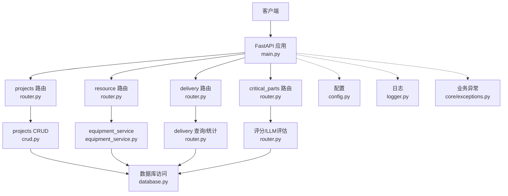
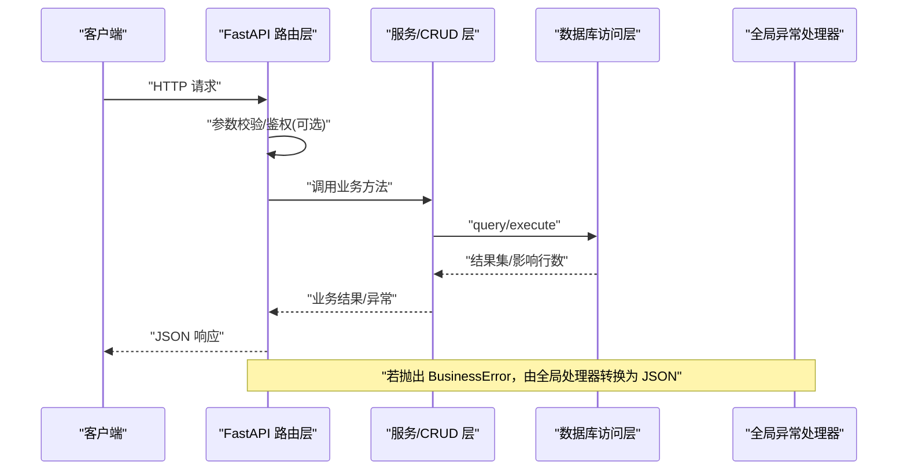
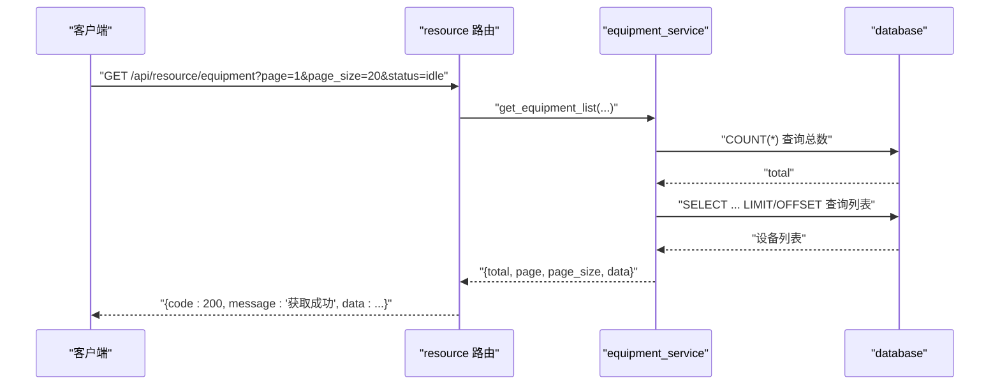
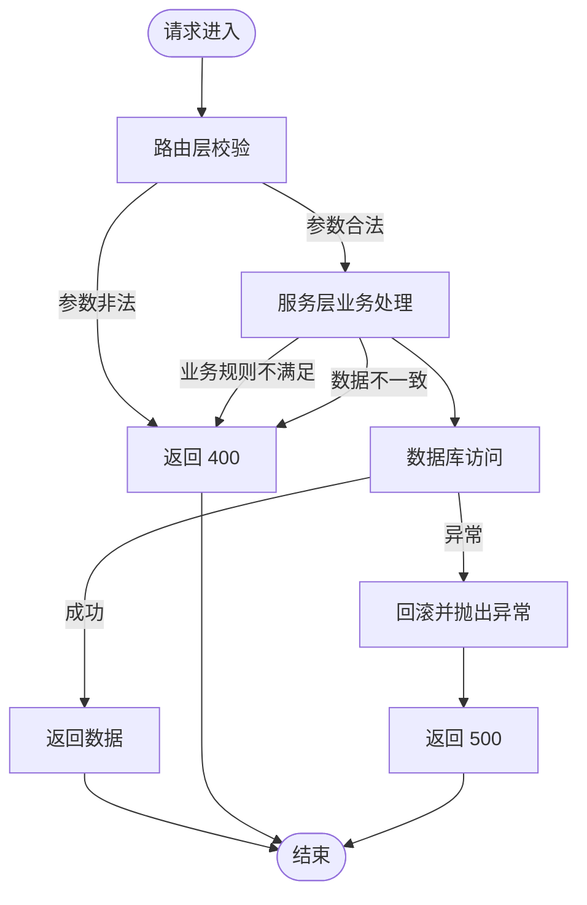
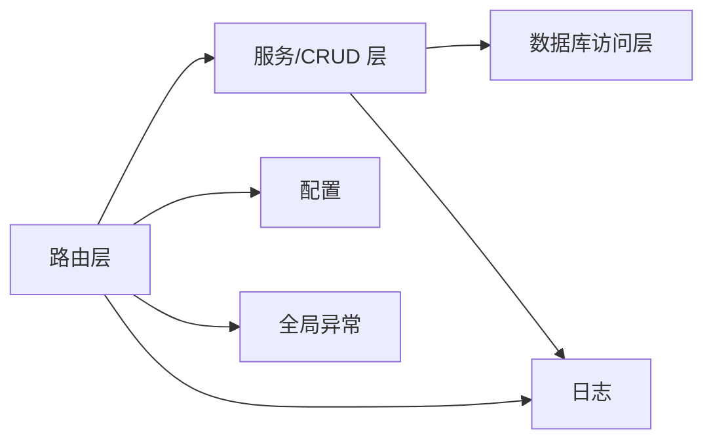

# 分层架构设计

<cite>
**本文引用的文件**
- [backend/main.py](file://backend/main.py)
- [backend/config.py](file://backend/config.py)
- [backend/database.py](file://backend/database.py)
- [backend/core/exceptions.py](file://backend/core/exceptions.py)
- [backend/logger.py](file://backend/logger.py)
- [backend/projects/router.py](file://backend/projects/router.py)
- [backend/projects/crud.py](file://backend/projects/crud.py)
- [backend/projects/schemas.py](file://backend/projects/schemas.py)
- [backend/modules/resource/router.py](file://backend/modules/resource/router.py)
- [backend/modules/resource/services/equipment_service.py](file://backend/modules/resource/services/equipment_service.py)
- [backend/delivery/router.py](file://backend/delivery/router.py)
- [backend/critical_parts/router.py](file://backend/critical_parts/router.py)
</cite>

## 目录
1. [简介](#简介)
2. [项目结构](#项目结构)
3. [核心组件](#核心组件)
4. [架构总览](#架构总览)
5. [详细组件分析](#详细组件分析)
6. [依赖关系分析](#依赖关系分析)
7. [性能考虑](#性能考虑)
8. [故障排查指南](#故障排查指南)
9. [结论](#结论)
10. [附录](#附录)

## 简介
本文件面向 FastAPI 应用的分层架构设计与实现，聚焦表现层（路由层）、业务逻辑层（服务层）与数据访问层的职责分离、交互方式与数据流向。文档通过代码级示例路径与图示，说明请求从 HTTP 进入路由层，经业务逻辑处理，最终落到数据库操作的完整链路；并阐述异常在各层的传播机制与错误响应规范，帮助读者以松耦合的方式扩展与维护系统。

## 项目结构
后端采用“模块 + 分层”的组织方式：
- 表现层（路由层）：FastAPI 路由定义、参数校验、统一响应包装、异常转换
- 业务逻辑层（服务层）：领域规则、流程编排、跨表聚合、状态校验
- 数据访问层：数据库连接池、SQL 执行封装、事务边界控制
- 横切关注点：配置、日志、全局异常处理器、健康检查、CORS、静态资源托管

图表来源
- [backend/main.py:11-83](file://backend/main.py#L11-L83)
- [backend/projects/router.py:1-231](file://backend/projects/router.py#L1-L231)
- [backend/modules/resource/router.py:1-800](file://backend/modules/resource/router.py#L1-L800)
- [backend/delivery/router.py:1-259](file://backend/delivery/router.py#L1-L259)
- [backend/critical_parts/router.py:1-95](file://backend/critical_parts/router.py#L1-L95)
- [backend/projects/crud.py:1-311](file://backend/projects/crud.py#L1-L311)
- [backend/modules/resource/services/equipment_service.py:1-495](file://backend/modules/resource/services/equipment_service.py#L1-L495)
- [backend/database.py:1-116](file://backend/database.py#L1-L116)
- [backend/config.py:48-102](file://backend/config.py#L48-L102)
- [backend/logger.py:14-43](file://backend/logger.py#L14-L43)
- [backend/core/exceptions.py:1-8](file://backend/core/exceptions.py#L1-L8)

章节来源
- [backend/main.py:11-83](file://backend/main.py#L11-L83)
- [backend/config.py:48-102](file://backend/config.py#L48-L102)
- [backend/logger.py:14-43](file://backend/logger.py#L14-L43)

## 核心组件
- 应用入口与中间件：注册路由、CORS、启动/关闭事件、SPA 回退、全局异常处理
- 配置中心：集中读取环境变量，提供类型安全的 Settings
- 数据库访问：PooledDB 连接池，统一的 query/execute 封装，自动提交/回滚
- 日志：按模块命名，滚动文件+控制台输出
- 业务模块：
  - projects：项目与零件清单的 CRUD、PBOM 导入与匹配
  - resource：设备、人员、任务等试制资源管理（路由 + 服务层）
  - delivery：多源到货明细查询、统计与合并
  - critical_parts：关键件评分与 LLM 评估

章节来源
- [backend/main.py:29-83](file://backend/main.py#L29-L83)
- [backend/config.py:48-102](file://backend/config.py#L48-L102)
- [backend/database.py:12-116](file://backend/database.py#L12-L116)
- [backend/logger.py:14-43](file://backend/logger.py#L14-L43)
- [backend/projects/router.py:1-231](file://backend/projects/router.py#L1-L231)
- [backend/modules/resource/router.py:1-800](file://backend/modules/resource/router.py#L1-L800)
- [backend/delivery/router.py:1-259](file://backend/delivery/router.py#L1-L259)
- [backend/critical_parts/router.py:1-95](file://backend/critical_parts/router.py#L1-L95)

## 架构总览
下图展示一个典型请求的生命周期：HTTP 请求进入路由层，路由层进行参数校验与简单预处理后，调用服务层或 CRUD 层执行业务逻辑，再经由数据库访问层完成持久化操作，最后返回统一格式响应。

图表来源
- [backend/main.py:85-92](file://backend/main.py#L85-L92)
- [backend/database.py:51-116](file://backend/database.py#L51-L116)
- [backend/projects/router.py:32-81](file://backend/projects/router.py#L32-L81)
- [backend/modules/resource/router.py:58-175](file://backend/modules/resource/router.py#L58-L175)
- [backend/delivery/router.py:41-118](file://backend/delivery/router.py#L41-L118)
- [backend/critical_parts/router.py:23-49](file://backend/critical_parts/router.py#L23-L49)

## 详细组件分析

### 表现层（路由层）
- 职责
  - 接收 HTTP 请求，解析路径/查询/请求体
  - 使用 Pydantic 模型做入参校验
  - 调用服务层/CRUD 获取数据
  - 将业务结果包装为统一响应格式
  - 捕获异常并转换为 HTTP 状态码与消息
- 示例模式
  - 列表接口：分页、筛选、关键词搜索，调用服务层后返回 {code, message, data}
  - 详情接口：根据 ID/编码查询，不存在时返回 404
  - 写操作：创建/更新/删除，失败时返回 400/500
  - 文件上传：校验扩展名与大小，落盘后触发后续处理
- 最佳实践
  - 路由层保持薄，不包含复杂业务逻辑
  - 对时间字段在路由层做格式化后再下发给前端
  - 对可选字段使用 exclude_none 减少无效更新

章节来源
- [backend/projects/router.py:32-81](file://backend/projects/router.py#L32-L81)
- [backend/projects/router.py:152-231](file://backend/projects/router.py#L152-L231)
- [backend/modules/resource/router.py:58-175](file://backend/modules/resource/router.py#L58-L175)
- [backend/modules/resource/router.py:221-302](file://backend/modules/resource/router.py#L221-L302)
- [backend/modules/resource/router.py:356-556](file://backend/modules/resource/router.py#L356-L556)
- [backend/modules/resource/router.py:646-799](file://backend/modules/resource/router.py#L646-L799)

### 业务逻辑层（服务层）
- 职责
  - 封装领域规则与业务流程（如状态合法性校验、关联数据一致性）
  - 组合多个数据访问操作，形成原子性业务单元
  - 对外暴露稳定的函数式接口，屏蔽 SQL 细节
- 示例模式
  - 设备服务：列表分页、详情、创建、更新、删除、状态变更、维护记录、统计
  - 维护记录：创建时校验设备存在，更新状态时自动补全结束时间
- 最佳实践
  - 所有外部输入先校验，非法值抛出 ValueError 或自定义异常
  - 对时间字段在服务层统一格式化为字符串
  - 对跨表关联进行必要的一致性检查（如区域是否存在）

章节来源
- [backend/modules/resource/services/equipment_service.py:11-103](file://backend/modules/resource/services/equipment_service.py#L11-L103)
- [backend/modules/resource/services/equipment_service.py:140-229](file://backend/modules/resource/services/equipment_service.py#L140-L229)
- [backend/modules/resource/services/equipment_service.py:262-301](file://backend/modules/resource/services/equipment_service.py#L262-L301)
- [backend/modules/resource/services/equipment_service.py:396-495](file://backend/modules/resource/services/equipment_service.py#L396-L495)

### 数据访问层
- 职责
  - 管理数据库连接池，提供线程安全连接
  - 封装常用 SQL 操作：查询单条/多条、执行写操作、批量执行、返回自增ID
  - 保证事务语义：写操作失败自动回滚
- 示例模式
  - 延迟初始化连接池，避免启动期配置错误导致崩溃
  - 所有写操作在 finally 中关闭连接，确保资源释放
- 最佳实践
  - 使用参数化查询防止 SQL 注入
  - 对复杂查询拆分 count 与 list，便于分页
  - 对异常进行日志记录并向上抛出，交由上层处理

章节来源
- [backend/database.py:12-43](file://backend/database.py#L12-L43)
- [backend/database.py:51-116](file://backend/database.py#L51-L116)

### 配置与横切关注点
- 配置
  - 通过 .env 加载数据库、爬虫、WMS、LLM、服务器等配置
  - 提供类型安全的 Settings，支持默认值与列表解析
- 日志
  - 按模块命名 logger，滚动文件+控制台输出
  - DEBUG 模式下提高日志级别
- 全局异常
  - 自定义 BusinessError，统一转换为 JSON 响应
  - 路由层也可用 HTTPException 表达具体错误场景

章节来源
- [backend/config.py:48-102](file://backend/config.py#L48-L102)
- [backend/logger.py:14-43](file://backend/logger.py#L14-L43)
- [backend/core/exceptions.py:1-8](file://backend/core/exceptions.py#L1-L8)
- [backend/main.py:85-92](file://backend/main.py#L85-L92)

### 请求处理流程（端到端）
以下以一个设备列表查询为例，展示从 HTTP 到数据库的完整链路：

图表来源
- [backend/modules/resource/router.py:58-86](file://backend/modules/resource/router.py#L58-L86)
- [backend/modules/resource/services/equipment_service.py:11-103](file://backend/modules/resource/services/equipment_service.py#L11-L103)
- [backend/database.py:51-70](file://backend/database.py#L51-L70)

### 异常处理与各层传播机制
- 路由层
  - 使用 HTTPException 表达参数错误、资源不存在、服务端错误
  - 对时间字段格式化失败等异常统一捕获并返回 500
- 服务层
  - 对业务约束违反抛出 ValueError（如重复编号、无效状态）
  - 对数据一致性校验失败抛出 ValueError（如区域不存在）
- 数据访问层
  - 写操作失败自动回滚并抛出异常，由上层捕获
- 全局异常处理器
  - BusinessError 被统一转换为 JSON 响应，包含错误码与消息

图表来源
- [backend/main.py:85-92](file://backend/main.py#L85-L92)
- [backend/core/exceptions.py:1-8](file://backend/core/exceptions.py#L1-L8)
- [backend/modules/resource/router.py:58-175](file://backend/modules/resource/router.py#L58-L175)
- [backend/modules/resource/services/equipment_service.py:140-229](file://backend/modules/resource/services/equipment_service.py#L140-L229)
- [backend/database.py:73-116](file://backend/database.py#L73-L116)

### 接口抽象与松耦合设计
- 路由层仅依赖服务层/CRUD 的函数式接口，不关心 SQL 实现
- 服务层通过 database.py 提供的统一接口访问数据，屏蔽连接池细节
- 配置通过 settings 集中管理，各层按需读取，降低耦合
- 日志通过 get_logger 获取，便于追踪问题

章节来源
- [backend/projects/router.py:32-81](file://backend/projects/router.py#L32-L81)
- [backend/projects/crud.py:1-311](file://backend/projects/crud.py#L1-L311)
- [backend/modules/resource/services/equipment_service.py:11-103](file://backend/modules/resource/services/equipment_service.py#L11-L103)
- [backend/database.py:12-43](file://backend/database.py#L12-L43)
- [backend/config.py:48-102](file://backend/config.py#L48-L102)
- [backend/logger.py:14-43](file://backend/logger.py#L14-L43)

## 依赖关系分析
- 路由层依赖
  - FastAPI 框架、Pydantic 模型、数据库访问层、业务服务层
- 服务层依赖
  - 数据库访问层、日志、配置（可选）
- 数据访问层依赖
  - 配置（数据库连接信息）、日志
- 横切依赖
  - 全局异常处理器、CORS、静态资源托管

图表来源
- [backend/main.py:11-83](file://backend/main.py#L11-L83)
- [backend/projects/router.py:1-231](file://backend/projects/router.py#L1-L231)
- [backend/modules/resource/router.py:1-800](file://backend/modules/resource/router.py#L1-L800)
- [backend/projects/crud.py:1-311](file://backend/projects/crud.py#L1-L311)
- [backend/modules/resource/services/equipment_service.py:1-495](file://backend/modules/resource/services/equipment_service.py#L1-L495)
- [backend/database.py:1-116](file://backend/database.py#L1-L116)
- [backend/config.py:48-102](file://backend/config.py#L48-L102)
- [backend/logger.py:14-43](file://backend/logger.py#L14-L43)
- [backend/core/exceptions.py:1-8](file://backend/core/exceptions.py#L1-L8)

章节来源
- [backend/main.py:11-83](file://backend/main.py#L11-L83)
- [backend/projects/router.py:1-231](file://backend/projects/router.py#L1-L231)
- [backend/modules/resource/router.py:1-800](file://backend/modules/resource/router.py#L1-L800)
- [backend/projects/crud.py:1-311](file://backend/projects/crud.py#L1-L311)
- [backend/modules/resource/services/equipment_service.py:1-495](file://backend/modules/resource/services/equipment_service.py#L1-L495)
- [backend/database.py:1-116](file://backend/database.py#L1-L116)
- [backend/config.py:48-102](file://backend/config.py#L48-L102)
- [backend/logger.py:14-43](file://backend/logger.py#L14-L43)
- [backend/core/exceptions.py:1-8](file://backend/core/exceptions.py#L1-L8)

## 性能考虑
- 数据库连接池
  - 使用 PooledDB，限制最大连接数，避免资源耗尽
  - 延迟初始化连接池，启动阶段不预建连接，降低冷启动失败风险
- 查询优化
  - 分页查询拆分为 count 与 list，减少不必要的数据传输
  - 条件拼接使用参数化查询，避免 SQL 注入与重复计算
- 写入事务
  - 写操作失败自动回滚，保证数据一致性
- 日志与监控
  - 滚动日志文件，避免磁盘占满
  - 关键操作记录日志，便于定位瓶颈

[本节为通用指导，无需特定文件引用]

## 故障排查指南
- 数据库连接失败
  - 检查 .env 中的 DB_HOST、DB_PORT、DB_USER、DB_PASSWORD、DB_DATABASE
  - 查看数据库连接池初始化失败的日志提示
- 路由层异常
  - 400：参数校验失败或业务规则不满足
  - 404：资源不存在
  - 500：服务层或数据库层异常
- 服务层异常
  - ValueError：常见于重复键、无效状态、关联数据不存在
- 全局异常
  - BusinessError：统一错误码与消息，便于前端处理

章节来源
- [backend/database.py:12-43](file://backend/database.py#L12-L43)
- [backend/core/exceptions.py:1-8](file://backend/core/exceptions.py#L1-L8)
- [backend/main.py:85-92](file://backend/main.py#L85-L92)
- [backend/modules/resource/router.py:58-175](file://backend/modules/resource/router.py#L58-L175)
- [backend/modules/resource/services/equipment_service.py:140-229](file://backend/modules/resource/services/equipment_service.py#L140-L229)

## 结论
该 FastAPI 应用采用清晰的分层架构：路由层负责请求接入与响应包装，服务层封装业务规则与流程，数据访问层提供稳定可靠的数据库操作。通过配置集中、日志可观测、异常统一处理，系统在可扩展性与可维护性上具备良好基础。建议在后续迭代中继续强化服务层抽象、完善单元测试与接口契约，以提升整体质量与交付效率。

[本节为总结，无需特定文件引用]

## 附录
- 统一响应格式建议
  - code：状态码（200 表示成功）
  - message：提示信息
  - data：业务数据
- 常见错误码
  - 400：参数错误或业务规则不满足
  - 404：资源不存在
  - 500：服务端异常

[本节为补充说明，无需特定文件引用]