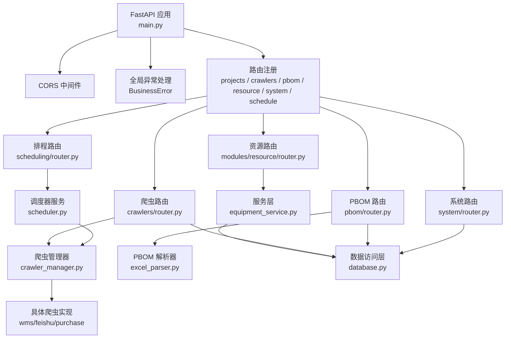
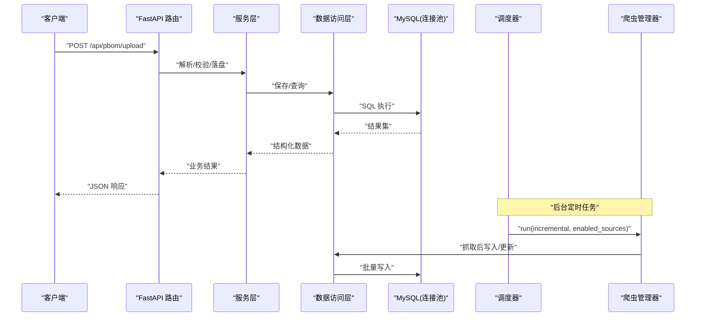
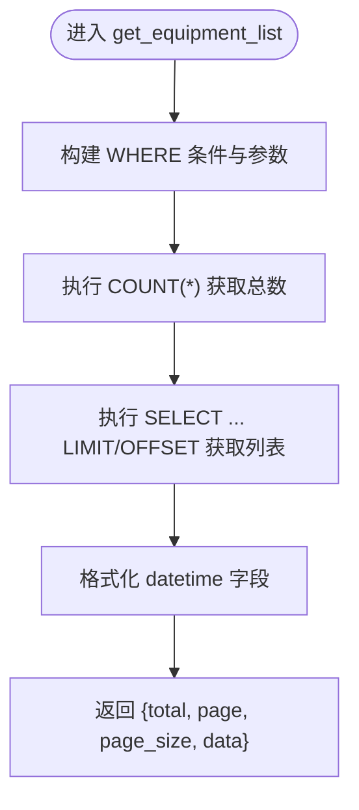
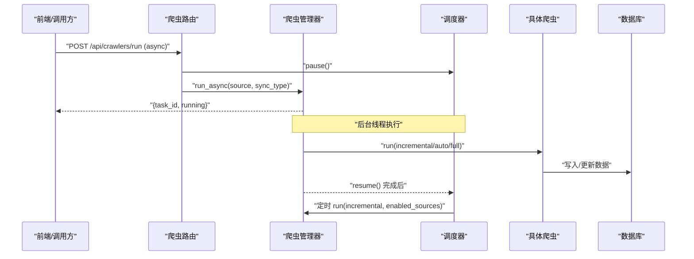
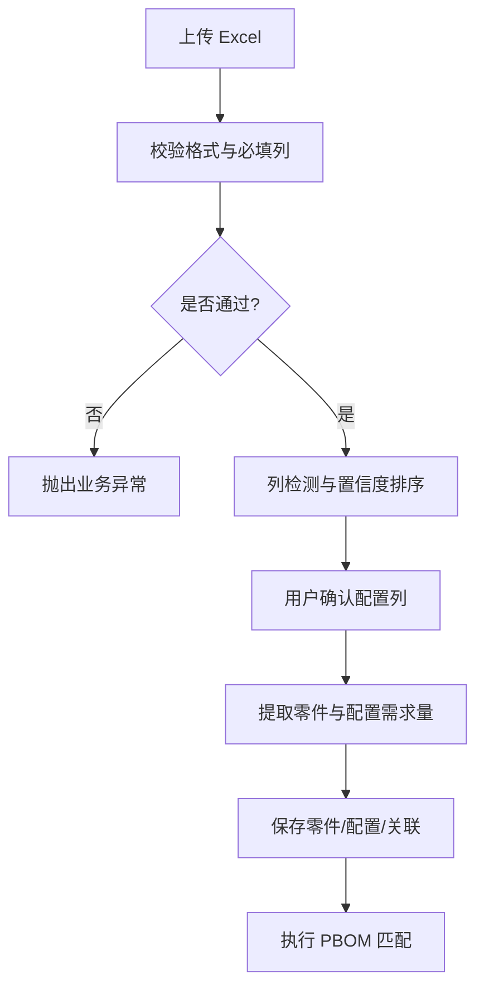
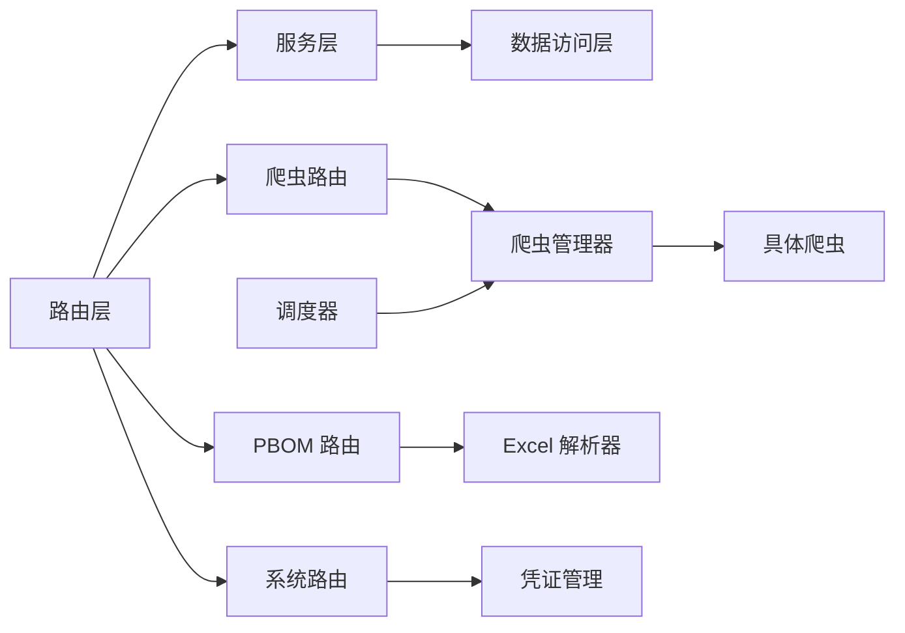

# 后端架构

<cite>
**本文引用的文件**
- [backend/main.py](file://backend/main.py)
- [backend/config.py](file://backend/config.py)
- [backend/database.py](file://backend/database.py)
- [backend/logger.py](file://backend/logger.py)
- [backend/core/exceptions.py](file://backend/core/exceptions.py)
- [backend/crawlers/router.py](file://backend/crawlers/router.py)
- [backend/crawlers/crawler_manager.py](file://backend/crawlers/crawler_manager.py)
- [backend/scheduling/scheduler.py](file://backend/scheduling/scheduler.py)
- [backend/pbom/router.py](file://backend/pbom/router.py)
- [backend/pbom/excel_parser.py](file://backend/pbom/excel_parser.py)
- [backend/modules/resource/router.py](file://backend/modules/resource/router.py)
- [backend/modules/resource/services/equipment_service.py](file://backend/modules/resource/services/equipment_service.py)
- [backend/system/router.py](file://backend/system/router.py)
- [backend/system/credentials.py](file://backend/system/credentials.py)
</cite>

## 目录
1. [简介](#简介)
2. [项目结构](#项目结构)
3. [核心组件](#核心组件)
4. [架构总览](#架构总览)
5. [详细组件分析](#详细组件分析)
6. [依赖关系分析](#依赖关系分析)
7. [性能考量](#性能考量)
8. [故障排查指南](#故障排查指南)
9. [结论](#结论)
10. [附录](#附录)

## 简介
本文件面向后端开发者与运维人员，系统化阐述 spiderV5 PBOM 智能装配系统的 FastAPI 后端架构。内容覆盖分层设计（路由层、服务层、数据访问层）、模块化组织（资源管理、爬虫系统、PBOM 解析等）、横切关注点（CORS、异常处理、日志）、异步与调度机制、数据库连接池与 ORM 策略、模块间通信协议与数据交换规范、错误处理与日志最佳实践。

## 项目结构
后端采用“按领域模块 + 横切能力”的组织方式：
- 应用入口与中间件：FastAPI 应用初始化、CORS、全局异常处理器、静态 SPA 回退、健康检查、启动/关闭钩子。
- 配置中心：集中读取 .env 环境变量，提供统一 Settings。
- 数据访问层：基于 pymysql + PooledDB 的连接池封装，提供查询与写操作工具函数。
- 日志子系统：RotatingFileHandler + 控制台输出，支持 DEBUG/INFO 级别切换。
- 业务模块：
  - 爬虫系统：多源抓取（WMS、飞书、采购），任务管理与状态轮询。
  - PBOM 解析：Excel 上传、列检测、解析入库、匹配到货。
  - 试制资源：设备、人员、任务、维护等 CRUD 与统计。
  - 系统设置：凭证管理、登录获取 Token、系统参数。
  - 排程模块：占位路由，后续接入 BFWS/CP-SAT 求解。
- 调度器：后台线程定时执行增量同步，支持暂停/恢复与重配置。

图表来源
- [backend/main.py:29-83](file://backend/main.py#L29-L83)
- [backend/crawlers/router.py:1-225](file://backend/crawlers/router.py#L1-L225)
- [backend/pbom/router.py:1-166](file://backend/pbom/router.py#L1-L166)
- [backend/modules/resource/router.py:1-800](file://backend/modules/resource/router.py#L1-L800)
- [backend/system/router.py:1-109](file://backend/system/router.py#L1-L109)
- [backend/scheduling/scheduler.py:1-196](file://backend/scheduling/scheduler.py#L1-L196)
- [backend/database.py:1-116](file://backend/database.py#L1-L116)

章节来源
- [backend/main.py:29-120](file://backend/main.py#L29-L120)
- [backend/config.py:48-102](file://backend/config.py#L48-L102)

## 核心组件
- 应用入口与生命周期
  - 启动时自动启动调度器；关闭时停止调度器；进程退出信号处理确保资源清理。
  - 注册各模块路由，暴露统一 API 前缀与标签。
- 配置管理
  - 从 .env 加载 DB、爬虫间隔、WMS/飞书/采购接口地址、DeepSeek LLM、服务端口、CORS 等。
  - 提供类型安全的读取方法与默认值回退。
- 数据访问层
  - 单例连接池延迟初始化，失败时记录明确提示并抛出异常。
  - 提供 query_all/query_one/execute/execute_last_id/execute_all 等原子方法，统一事务提交与回滚。
- 日志系统
  - 按模块命名 logger，文件滚动（10MB，保留 7 份）+ 控制台输出，DEBUG/INFO 随配置切换。
- 异常处理
  - 自定义 BusinessError，统一返回 {error} 结构与 HTTP 状态码。
- 爬虫系统与调度
  - 管理器统一管理多个爬虫实例，支持同步阻塞与后台线程异步执行，任务元信息跟踪与状态轮询。
  - 调度器后台循环读取配置，按间隔触发增量同步，支持暂停/恢复与重配置。
- PBOM 解析
  - Excel 上传、必填列校验、三层列检测、按配置列合并需求量、持久化零件与配置关联、匹配到货。
- 试制资源模块
  - 设备、人员、任务、维护的完整 CRUD，分页筛选、统计看板、状态流转。
- 系统设置
  - 凭证管理（WMS/飞书/采购），自动登录获取 Token，手动同步 Cookie/Token，系统参数读写。

章节来源
- [backend/main.py:36-56](file://backend/main.py#L36-L56)
- [backend/config.py:48-102](file://backend/config.py#L48-L102)
- [backend/database.py:12-43](file://backend/database.py#L12-L43)
- [backend/logger.py:14-43](file://backend/logger.py#L14-L43)
- [backend/core/exceptions.py:1-8](file://backend/core/exceptions.py#L1-L8)
- [backend/crawlers/crawler_manager.py:22-197](file://backend/crawlers/crawler_manager.py#L22-L197)
- [backend/scheduling/scheduler.py:16-196](file://backend/scheduling/scheduler.py#L16-L196)
- [backend/pbom/router.py:23-166](file://backend/pbom/router.py#L23-L166)
- [backend/modules/resource/router.py:47-800](file://backend/modules/resource/router.py#L47-L800)
- [backend/system/router.py:52-109](file://backend/system/router.py#L52-L109)

## 架构总览
整体采用分层与模块化结合的设计：
- 表现层（路由层）：FastAPI Router，负责请求校验、参数绑定、调用服务层、响应格式化。
- 业务层（服务层）：领域服务（如 equipment_service），封装复杂业务规则、跨表聚合、状态机。
- 数据访问层：数据库连接池封装与 SQL 执行工具，屏蔽底层驱动细节。
- 横切能力：CORS、异常处理、日志、配置、调度器、凭证管理。

图表来源
- [backend/pbom/router.py:23-166](file://backend/pbom/router.py#L23-L166)
- [backend/modules/resource/services/equipment_service.py:11-103](file://backend/modules/resource/services/equipment_service.py#L11-L103)
- [backend/database.py:51-116](file://backend/database.py#L51-L116)
- [backend/scheduling/scheduler.py:155-196](file://backend/scheduling/scheduler.py#L155-L196)
- [backend/crawlers/crawler_manager.py:199-301](file://backend/crawlers/crawler_manager.py#L199-L301)

## 详细组件分析

### 路由层与模块划分
- 路由职责
  - 参数校验与转换（Pydantic Model）。
  - 调用服务层完成业务逻辑。
  - 统一响应格式与错误映射。
- 模块边界
  - crawlers：爬虫控制面（配置、运行、状态、摘要）。
  - pbom：PBOM 上传、列检测、解析、匹配。
  - modules/resource：设备、人员、任务、维护等试制资源。
  - system：凭证、登录、系统参数。
  - scheduling：排程模块占位路由。

章节来源
- [backend/crawlers/router.py:43-225](file://backend/crawlers/router.py#L43-L225)
- [backend/pbom/router.py:23-166](file://backend/pbom/router.py#L23-L166)
- [backend/modules/resource/router.py:47-800](file://backend/modules/resource/router.py#L47-L800)
- [backend/system/router.py:52-109](file://backend/system/router.py#L52-L109)
- [backend/scheduling/router.py:1-14](file://backend/scheduling/router.py#L1-L14)

### 服务层：以设备为例
- 职责分离
  - 路由仅做入参校验与转发。
  - 服务层负责条件构建、分页、聚合、状态校验、时间字段格式化。
  - 数据访问层专注 SQL 执行与连接管理。
- 关键流程
  - 列表查询：动态 WHERE、COUNT、LIMIT/OFFSET、JOIN 扩展字段。
  - 创建/更新/删除：存在性校验、外键约束校验、级联处理。
  - 统计：分组计数、汇总指标。

图表来源
- [backend/modules/resource/services/equipment_service.py:11-103](file://backend/modules/resource/services/equipment_service.py#L11-L103)

章节来源
- [backend/modules/resource/services/equipment_service.py:11-495](file://backend/modules/resource/services/equipment_service.py#L11-L495)

### 爬虫系统与调度
- 管理器
  - 维护爬虫实例字典，支持单源/全量运行。
  - 同步阻塞模式与后台线程异步模式，任务元信息跟踪（task_id、running、start/end_time、result）。
  - 优雅停止标志，避免中断页处理。
- 调度器
  - 后台线程主循环，读取配置（模式、间隔、启用源）。
  - 支持暂停/恢复，避免与手动任务冲突。
  - 自动增量同步，完成后更新最近执行时间与状态。

图表来源
- [backend/crawlers/router.py:89-147](file://backend/crawlers/router.py#L89-L147)
- [backend/crawlers/crawler_manager.py:134-197](file://backend/crawlers/crawler_manager.py#L134-L197)
- [backend/scheduling/scheduler.py:93-196](file://backend/scheduling/scheduler.py#L93-L196)

章节来源
- [backend/crawlers/crawler_manager.py:22-305](file://backend/crawlers/crawler_manager.py#L22-L305)
- [backend/scheduling/scheduler.py:16-196](file://backend/scheduling/scheduler.py#L16-L196)
- [backend/crawlers/router.py:43-225](file://backend/crawlers/router.py#L43-L225)

### PBOM 解析模块
- 上传与校验
  - 限制文件格式，流式写入磁盘，记录大小与路径。
  - 必填列检测，缺失则抛出业务异常。
- 列检测与解析
  - 三层列检测器（Layer 1 + Layer 2）识别配置列，置信度排序，需人工确认阈值。
  - 按配置列合并需求量，相同零件号去重求和。
- 持久化与匹配
  - 保存零件清单与配置项，建立零件-配置关联。
  - 调用匹配器将 PBOM 与到货数据进行匹配。

图表来源
- [backend/pbom/router.py:23-166](file://backend/pbom/router.py#L23-L166)
- [backend/pbom/excel_parser.py:24-203](file://backend/pbom/excel_parser.py#L24-L203)

章节来源
- [backend/pbom/router.py:23-166](file://backend/pbom/router.py#L23-L166)
- [backend/pbom/excel_parser.py:14-203](file://backend/pbom/excel_parser.py#L14-L203)

### 系统设置与凭证管理
- 登录与 Token
  - 自动登录 WMS 获取 JWT/Cookie，失败时降级保存用户名密码供后续使用。
  - 飞书应用登录获取 tenant_access_token，支持过期自动刷新。
- 凭证存储
  - 同一 source 新凭证插入时标记旧凭证失效，保证唯一激活态。
  - 兼容多种 token 字段名与 Cookie 作为凭证。
- 系统参数
  - 爬虫同步配置（模式、间隔、启用源、自动登录开关、最近执行时间/状态）。
  - 通用参数读写接口。

章节来源
- [backend/system/router.py:52-109](file://backend/system/router.py#L52-L109)
- [backend/system/credentials.py:25-149](file://backend/system/credentials.py#L25-L149)
- [backend/system/credentials.py:294-441](file://backend/system/credentials.py#L294-L441)
- [backend/system/credentials.py:444-573](file://backend/system/credentials.py#L444-L573)

## 依赖关系分析
- 模块耦合
  - 路由层依赖服务层与数据访问层，低耦合高内聚。
  - 爬虫路由与调度器通过管理器解耦，调度器不直接持有爬虫实例。
  - PBOM 路由依赖解析器与匹配器，解析器依赖 pandas/openpyxl/xlrd。
- 外部依赖
  - MySQL（pymysql + PooledDB）。
  - 第三方 API（WMS、飞书、DeepSeek LLM）。
  - 文件系统（上传目录、日志目录）。
- 潜在环依赖
  - 路由到服务到 DAO，无反向依赖；调度器与爬虫管理器为单向依赖。

图表来源
- [backend/modules/resource/router.py:1-800](file://backend/modules/resource/router.py#L1-L800)
- [backend/modules/resource/services/equipment_service.py:1-495](file://backend/modules/resource/services/equipment_service.py#L1-L495)
- [backend/database.py:1-116](file://backend/database.py#L1-L116)
- [backend/crawlers/crawler_manager.py:1-305](file://backend/crawlers/crawler_manager.py#L1-L305)
- [backend/pbom/router.py:1-166](file://backend/pbom/router.py#L1-L166)
- [backend/pbom/excel_parser.py:1-203](file://backend/pbom/excel_parser.py#L1-L203)
- [backend/system/router.py:1-109](file://backend/system/router.py#L1-L109)
- [backend/system/credentials.py:1-573](file://backend/system/credentials.py#L1-L573)
- [backend/scheduling/scheduler.py:1-196](file://backend/scheduling/scheduler.py#L1-L196)

章节来源
- [backend/main.py:74-83](file://backend/main.py#L74-L83)
- [backend/crawlers/crawler_manager.py:90-97](file://backend/crawlers/crawler_manager.py#L90-L97)
- [backend/scheduling/scheduler.py:76-91](file://backend/scheduling/scheduler.py#L76-L91)

## 性能考量
- 数据库连接池
  - 延迟初始化连接池，避免启动失败导致服务崩溃。
  - 合理设置 maxconnections/mincached/maxcached，减少连接抖动。
- 异步与并发
  - 爬虫异步执行，立即返回 task_id，前端轮询日志，提升用户体验。
  - 调度器后台线程独立运行，避免阻塞请求线程。
- 文件处理
  - 大文件分块写入，降低内存占用。
  - 使用 pandas 进行表格解析，注意大数据集时的内存与性能优化。
- 日志与监控
  - 文件滚动日志避免磁盘爆满。
  - 健康检查接口便于容器编排与健康探测。

[本节为通用指导，无需特定文件引用]

## 故障排查指南
- 数据库连接失败
  - 现象：连接池初始化报错。
  - 排查：检查 .env 中 DB_HOST/DB_PORT/DB_USER/DB_PASSWORD/DB_DATABASE 是否正确；确认网络连通性与权限。
- 爬虫执行失败
  - 现象：任务状态 failed，日志中出现异常堆栈。
  - 排查：查看对应爬虫日志；检查凭证是否有效；确认目标系统可达；必要时手动触发并观察实时日志。
- PBOM 解析失败
  - 现象：缺少必填列或无法提取零件。
  - 排查：确认 Excel 表头包含必需列；根据列检测结果调整配置列；检查数值列是否为数字。
- 调度器未执行
  - 现象：自动增量同步未触发。
  - 排查：确认 crawler_mode=auto；检查 enabled_sources 是否配置；查看调度器状态与最近执行时间。
- 凭证无效
  - 现象：登录失败或 Token 过期。
  - 排查：重新登录或手动同步 Token/Cookie；检查飞书 app_id/app_secret；确认系统参数中的自动登录开关。

章节来源
- [backend/database.py:12-43](file://backend/database.py#L12-L43)
- [backend/crawlers/router.py:89-147](file://backend/crawlers/router.py#L89-L147)
- [backend/pbom/router.py:50-113](file://backend/pbom/router.py#L50-L113)
- [backend/scheduling/scheduler.py:93-153](file://backend/scheduling/scheduler.py#L93-L153)
- [backend/system/credentials.py:25-149](file://backend/system/credentials.py#L25-L149)

## 结论
本项目采用清晰的层次化与模块化设计，路由层聚焦请求处理，服务层承载业务规则，数据访问层统一数据库交互。爬虫系统与调度器实现了稳定的后台任务管理，PBOM 解析提供了灵活的 Excel 处理能力，试制资源模块完善了设备/人员/任务的管理闭环。通过统一的配置、日志与异常处理机制，系统在可维护性与可扩展性方面具备良好基础。后续可在排程模块引入更复杂的求解算法，并在资源模块完善更多统计与可视化能力。

[本节为总结性内容，无需特定文件引用]

## 附录

### 后端模块间通信协议与数据交换规范
- 统一响应结构
  - 成功：{ success: true, data: ..., message?: string }
  - 失败：{ success: false, error: string, message?: string }
  - 资源模块部分接口使用 { code: 200, message: "...", data: ... }
- 认证与凭证
  - 系统设置提供登录与凭证管理接口，支持自动登录与手动同步。
  - 爬虫与飞书模块通过凭证管理获取有效 Token/Cookie。
- 任务与状态
  - 爬虫任务通过 task_id 标识，前端轮询 /crawlers/status 获取进度与日志。
  - 调度器状态可通过 /crawlers/summary 或内部状态接口获取。
- 配置与参数
  - 爬虫同步配置通过系统参数持久化，支持模式、间隔、启用源、自动登录开关等。
  - 系统参数读写接口用于动态调整行为。

章节来源
- [backend/crawlers/router.py:43-225](file://backend/crawlers/router.py#L43-L225)
- [backend/system/router.py:52-109](file://backend/system/router.py#L52-L109)
- [backend/system/credentials.py:294-441](file://backend/system/credentials.py#L294-L441)
- [backend/modules/resource/router.py:47-800](file://backend/modules/resource/router.py#L47-L800)