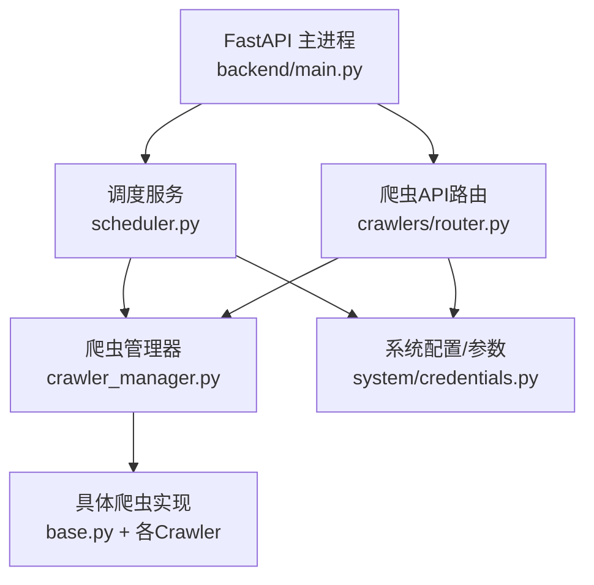
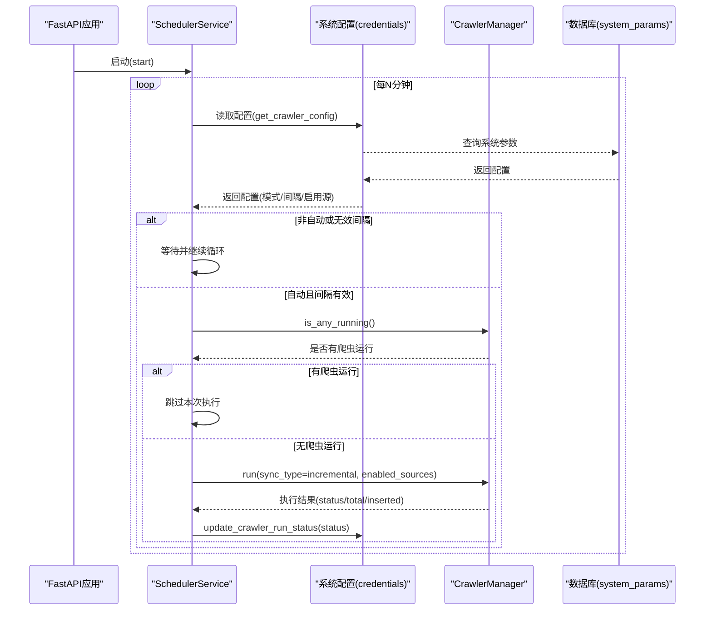
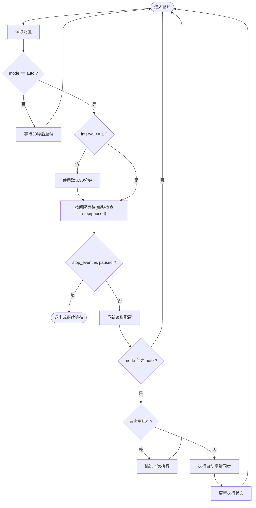
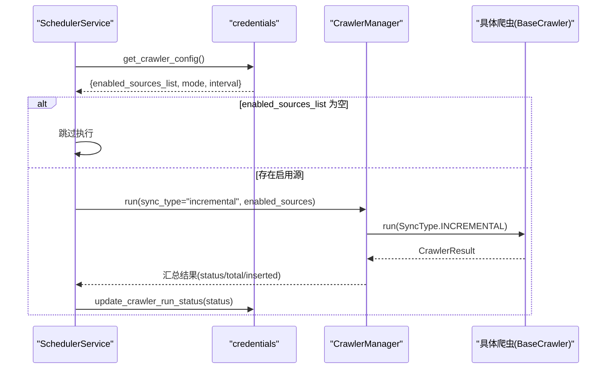
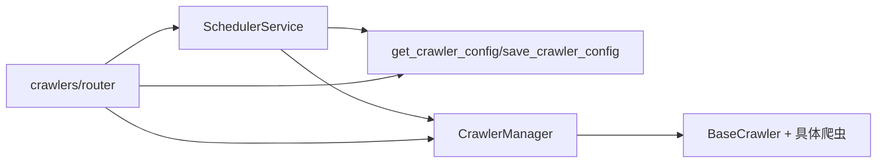

# 任务调度器

<cite>
**本文引用的文件**
- [backend/scheduling/scheduler.py](file://backend/scheduling/scheduler.py)
- [backend/scheduling/router.py](file://backend/scheduling/router.py)
- [backend/crawlers/crawler_manager.py](file://backend/crawlers/crawler_manager.py)
- [backend/crawlers/base.py](file://backend/crawlers/base.py)
- [backend/system/credentials.py](file://backend/system/credentials.py)
- [backend/config.py](file://backend/config.py)
- [backend/main.py](file://backend/main.py)
- [backend/crawlers/router.py](file://backend/crawlers/router.py)
</cite>

## 目录
1. [简介](#简介)
2. [项目结构](#项目结构)
3. [核心组件](#核心组件)
4. [架构总览](#架构总览)
5. [详细组件分析](#详细组件分析)
6. [依赖关系分析](#依赖关系分析)
7. [性能考量](#性能考量)
8. [故障排查指南](#故障排查指南)
9. [结论](#结论)
10. [附录](#附录)

## 简介
本文件面向“任务调度器”的完整实现与使用，重点围绕 SchedulerService 类展开，涵盖后台线程管理、定时循环、状态控制、启动/停止/暂停/恢复机制、配置读取与动态重加载（从数据库获取爬虫配置与间隔时间）、自动增量同步执行流程（数据源检查、任务执行、状态更新）、与爬虫管理器的集成方式、并发冲突处理与异常处理策略，以及监控与调试方法。

## 项目结构
与任务调度器直接相关的代码主要分布在以下模块：
- 调度服务：backend/scheduling/scheduler.py
- 调度路由（健康检查占位）：backend/scheduling/router.py
- 爬虫管理器：backend/crawlers/crawler_manager.py
- 爬虫基类与枚举：backend/crawlers/base.py
- 系统凭证与配置读写：backend/system/credentials.py
- 应用全局配置：backend/config.py
- 应用入口（生命周期钩子）：backend/main.py
- 爬虫API路由（含调度器控制接口）：backend/crawlers/router.py

图表来源
- [backend/main.py:36-55](file://backend/main.py#L36-L55)
- [backend/scheduling/scheduler.py:16-196](file://backend/scheduling/scheduler.py#L16-L196)
- [backend/crawlers/router.py:43-225](file://backend/crawlers/router.py#L43-L225)
- [backend/crawlers/crawler_manager.py:22-305](file://backend/crawlers/crawler_manager.py#L22-L305)
- [backend/system/credentials.py:339-441](file://backend/system/credentials.py#L339-L441)
- [backend/crawlers/base.py:12-67](file://backend/crawlers/base.py#L12-L67)

章节来源
- [backend/main.py:36-55](file://backend/main.py#L36-L55)
- [backend/scheduling/scheduler.py:16-196](file://backend/scheduling/scheduler.py#L16-L196)
- [backend/crawlers/router.py:43-225](file://backend/crawlers/router.py#L43-L225)

## 核心组件
- SchedulerService：负责后台线程、定时循环、状态控制、配置重载、自动增量同步触发。
- CrawlerManager：统一调度所有爬虫实例，支持同步/异步执行、任务追踪、停止信号、状态汇总。
- BaseCrawler/SyncType/CrawlerStatus：定义爬虫抽象接口、同步类型与运行状态枚举。
- credentials.get_crawler_config/save_crawler_config/update_crawler_run_status：从 system_params 表读取/保存爬虫配置，并记录最近执行时间与状态。
- main.py：在应用启动时自动启动调度器，关闭时优雅停止；注册各模块路由。
- crawlers/router.py：提供爬虫相关API，包括配置读写、任务执行、调度器启停、摘要查询等。

章节来源
- [backend/scheduling/scheduler.py:16-196](file://backend/scheduling/scheduler.py#L16-L196)
- [backend/crawlers/crawler_manager.py:22-305](file://backend/crawlers/crawler_manager.py#L22-L305)
- [backend/crawlers/base.py:12-67](file://backend/crawlers/base.py#L12-L67)
- [backend/system/credentials.py:339-441](file://backend/system/credentials.py#L339-L441)
- [backend/main.py:36-55](file://backend/main.py#L36-L55)
- [backend/crawlers/router.py:43-225](file://backend/crawlers/router.py#L43-L225)

## 架构总览
调度器作为独立后台线程运行，周期性地从数据库读取配置，判断是否处于自动模式与有效间隔，若满足条件且无爬虫正在运行，则调用爬虫管理器执行增量同步，并更新执行状态。手动触发爬虫任务时会暂停调度器以避免冲突，任务完成后自动恢复。

图表来源
- [backend/scheduling/scheduler.py:93-153](file://backend/scheduling/scheduler.py#L93-L153)
- [backend/system/credentials.py:339-410](file://backend/system/credentials.py#L339-L410)
- [backend/crawlers/crawler_manager.py:200-301](file://backend/crawlers/crawler_manager.py#L200-L301)

## 详细组件分析

### SchedulerService 实现原理
- 后台线程管理
  - 通过 threading.Thread 创建守护线程执行 _run_loop。
  - 使用 threading.Event 作为停止信号，支持安全退出。
  - 维护 running、paused、_current_interval_minutes、_last_run_at 等状态字段。
- 定时任务循环
  - 每次循环读取配置，解析 crawler_mode 与 crawler_incremental_interval_minutes。
  - 在非自动模式或间隔无效时，短暂等待后重试。
  - 在等待期间每秒检查 stop_event 与 paused 状态，确保响应及时。
  - 执行前再次读取配置，避免等待期间配置变更导致误执行。
  - 检测是否有爬虫正在运行，若有则跳过本次自动执行。
- 状态控制
  - start/stop/pause/resume/reconfigure/get_status 提供完整的生命周期控制与状态查询。
  - reconfigure 仅做通知标记，实际重载发生在下一次循环读取配置时。
- 自动增量同步
  - 从配置中获取 enabled_sources_list，若无启用源则跳过。
  - 调用 CrawlerManager.run 执行增量同步，记录 last_run_at 与最终状态。
  - 异常路径下尝试将状态更新为 failed，保证可观测性。

图表来源
- [backend/scheduling/scheduler.py:93-153](file://backend/scheduling/scheduler.py#L93-L153)
- [backend/scheduling/scheduler.py:155-192](file://backend/scheduling/scheduler.py#L155-L192)

章节来源
- [backend/scheduling/scheduler.py:16-196](file://backend/scheduling/scheduler.py#L16-L196)

### 启动、停止、暂停与恢复机制
- 启动
  - FastAPI 启动事件触发 scheduler_service.start()，创建并启动后台线程。
- 停止
  - 设置停止事件，置 running=False，线程检测到事件后退出循环。
- 暂停
  - 设置 paused=True，循环在等待阶段忽略执行，直到 resume。
- 恢复
  - 设置 paused=False，循环继续正常执行。
- 配置重加载
  - 收到 reconfigure 通知后，下次循环会重新读取配置，无需重启线程。

章节来源
- [backend/main.py:36-55](file://backend/main.py#L36-L55)
- [backend/scheduling/scheduler.py:34-74](file://backend/scheduling/scheduler.py#L34-L74)
- [backend/crawlers/router.py:16-40](file://backend/crawlers/router.py#L16-L40)

### 配置读取与动态重加载
- 配置来源
  - 从 system_params 表读取爬虫相关参数键值对，包含模式、增量/全量间隔、启用数据源、自动登录开关、最近执行时间与状态等。
  - get_crawler_config 会将字符串列表转换为 enabled_sources_list 供调度器使用。
- 动态重加载
  - 保存配置后，爬虫路由会调用 scheduler_service.reconfigure() 通知调度器。
  - 调度器在下一次循环读取配置时生效新配置，无需重启。

章节来源
- [backend/system/credentials.py:297-410](file://backend/system/credentials.py#L297-L410)
- [backend/crawlers/router.py:43-58](file://backend/crawlers/router.py#L43-L58)
- [backend/scheduling/scheduler.py:63-83](file://backend/scheduling/scheduler.py#L63-L83)

### 自动增量同步执行流程
- 数据源检查
  - 从配置中获取 enabled_sources_list，为空则跳过。
- 任务执行
  - 调用 CrawlerManager.run(sync_type="incremental", enabled_sources=...) 执行增量同步。
  - 管理器内部根据 enabled_sources 过滤未启用数据源，逐个执行具体爬虫。
- 状态更新
  - 根据执行结果更新 crawler_last_run_at 与 crawler_last_status。
  - 异常情况下尝试更新为 failed，保证可观测性。

图表来源
- [backend/scheduling/scheduler.py:155-192](file://backend/scheduling/scheduler.py#L155-L192)
- [backend/crawlers/crawler_manager.py:200-301](file://backend/crawlers/crawler_manager.py#L200-L301)
- [backend/crawlers/base.py:12-67](file://backend/crawlers/base.py#L12-L67)
- [backend/system/credentials.py:404-410](file://backend/system/credentials.py#L404-L410)

章节来源
- [backend/scheduling/scheduler.py:155-192](file://backend/scheduling/scheduler.py#L155-L192)
- [backend/crawlers/crawler_manager.py:200-301](file://backend/crawlers/crawler_manager.py#L200-L301)
- [backend/system/credentials.py:404-410](file://backend/system/credentials.py#L404-L410)

### 与爬虫管理器的集成及并发冲突处理
- 集成方式
  - 调度器通过 CrawlerManager.run 执行增量同步；管理器负责实例化并调用具体爬虫。
  - 管理器暴露 is_any_running 用于冲突检测，避免重复执行。
- 并发冲突处理
  - 自动模式下，若检测到有爬虫运行，则跳过本次执行。
  - 手动触发爬虫任务时，先暂停调度器，防止自动任务与手动任务同时运行。
  - 异步任务完成后，自动恢复调度器，避免永久暂停。
- 停止与优雅退出
  - 支持 request_stop 与 stop_source，设置停止标志，爬虫在合适时机退出。
  - 应用退出时，信号处理器会停止调度器与爬虫管理器，确保资源释放。

章节来源
- [backend/crawlers/crawler_manager.py:39-66](file://backend/crawlers/crawler_manager.py#L39-L66)
- [backend/crawlers/crawler_manager.py:134-197](file://backend/crawlers/crawler_manager.py#L134-L197)
- [backend/crawlers/router.py:128-147](file://backend/crawlers/router.py#L128-L147)
- [backend/main.py:129-148](file://backend/main.py#L129-L148)

### 监控与调试方法
- 调度器状态查询
  - 通过 /api/crawlers/summary 获取调度器状态（running/paused/interval/last_run_at）。
- 爬虫状态与日志
  - /api/crawlers/status 获取所有爬虫状态（含进度与日志）。
  - /api/crawlers/task/{task_id} 获取异步任务的元信息（running/result/end_time）。
- 配置查看与修改
  - GET /api/crawlers/config 读取当前配置。
  - POST /api/crawlers/config 保存配置并触发调度器重加载。
- 调度器启停
  - POST /api/crawlers/start_scheduler 启动自动调度器。
  - POST /api/crawlers/stop_scheduler 停止自动调度器。
- 健康检查
  - GET /api/health 检查服务健康状态。

章节来源
- [backend/crawlers/router.py:43-225](file://backend/crawlers/router.py#L43-L225)
- [backend/main.py:94-97](file://backend/main.py#L94-L97)

## 依赖关系分析
- 低耦合设计
  - 调度器仅依赖配置读取与爬虫管理器接口，不直接了解具体爬虫实现。
  - 爬虫管理器集中管理爬虫实例与任务状态，屏蔽底层差异。
- 外部依赖
  - 数据库 system_params 表存储爬虫配置与执行状态。
  - 各爬虫可能依赖外部系统（WMS、飞书、采购系统等），由各自实现处理认证与网络请求。
- 可能的循环依赖
  - 爬虫管理器在异步任务完成时回调调度器恢复，属于单向依赖（管理器→调度器），不会形成循环。

图表来源
- [backend/scheduling/scheduler.py:76-91](file://backend/scheduling/scheduler.py#L76-L91)
- [backend/crawlers/crawler_manager.py:90-107](file://backend/crawlers/crawler_manager.py#L90-L107)
- [backend/crawlers/router.py:43-225](file://backend/crawlers/router.py#L43-L225)

章节来源
- [backend/scheduling/scheduler.py:76-91](file://backend/scheduling/scheduler.py#L76-L91)
- [backend/crawlers/crawler_manager.py:90-107](file://backend/crawlers/crawler_manager.py#L90-L107)
- [backend/crawlers/router.py:43-225](file://backend/crawlers/router.py#L43-L225)

## 性能考量
- 等待间隔优化
  - 使用每秒轮询 stop_event 与 paused，避免长时间阻塞，提高响应性。
- 配置读取频率
  - 每次循环读取配置，确保动态重加载即时生效；可通过增大间隔降低数据库压力。
- 并发控制
  - 通过 is_any_running 避免重复执行，减少资源竞争。
- 异步任务
  - 手动触发采用异步模式，立即返回 task_id，前端轮询日志，提升用户体验。
- 错误重试
  - 配置读取失败时等待30秒重试，增强鲁棒性。

[本节为通用指导，不直接分析具体文件]

## 故障排查指南
- 无法读取配置
  - 检查 system_params 表是否存在对应键值；确认数据库连接正常。
  - 关注日志中的“读取配置失败”提示。
- 自动模式未执行
  - 确认 crawler_mode 为 auto，且 interval 大于等于1。
  - 检查是否有爬虫正在运行导致跳过。
- 手动任务后调度器未恢复
  - 确认异步任务已完成并触发 resume；必要时调用 /api/crawlers/start_scheduler 重新启动。
- 爬虫执行失败
  - 查看 /api/crawlers/status 与 /api/crawlers/task/{task_id} 的错误信息。
  - 检查外部系统连通性与凭证有效性。
- 服务退出时资源清理
  - 确认信号处理器已调用 scheduler.stop() 与 crawler_manager.request_stop()。

章节来源
- [backend/scheduling/scheduler.py:76-83](file://backend/scheduling/scheduler.py#L76-L83)
- [backend/scheduling/scheduler.py:93-153](file://backend/scheduling/scheduler.py#L93-L153)
- [backend/crawlers/router.py:128-147](file://backend/crawlers/router.py#L128-L147)
- [backend/main.py:129-148](file://backend/main.py#L129-L148)

## 结论
SchedulerService 以简洁可靠的后台线程与事件驱动模型实现了定时调度与状态控制，结合 CrawlerManager 的统一执行接口与 credentials 的动态配置能力，形成了稳定可扩展的任务调度体系。通过完善的监控接口与异常处理策略，系统可在生产环境中持续稳定运行，并支持灵活的运维操作。

[本节为总结性内容，不直接分析具体文件]

## 附录
- 关键API速查
  - GET /api/crawlers/config：读取爬虫配置
  - POST /api/crawlers/config：保存爬虫配置
  - GET /api/crawlers/status：获取所有爬虫状态
  - GET /api/crawlers/task/{task_id}：获取任务元信息
  - POST /api/crawlers/run：异步执行爬虫任务
  - POST /api/crawlers/start_scheduler：启动自动调度器
  - POST /api/crawlers/stop_scheduler：停止自动调度器
  - GET /api/health：健康检查

章节来源
- [backend/crawlers/router.py:43-225](file://backend/crawlers/router.py#L43-L225)
- [backend/main.py:94-97](file://backend/main.py#L94-L97)