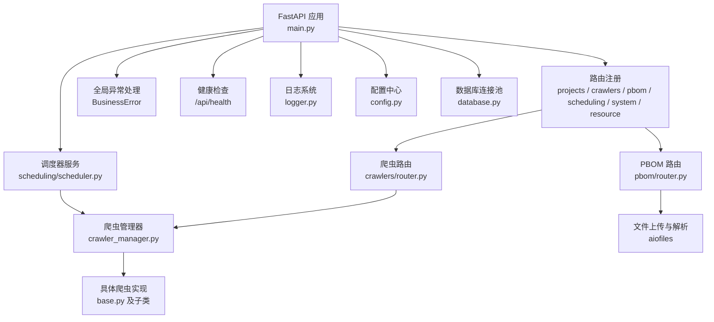
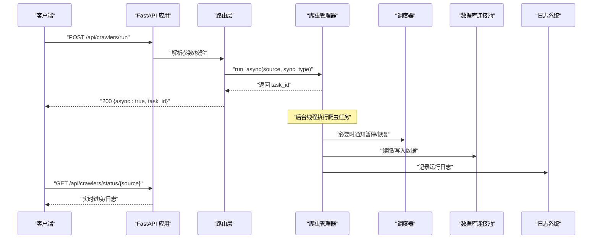
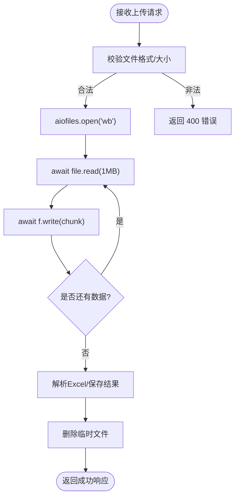
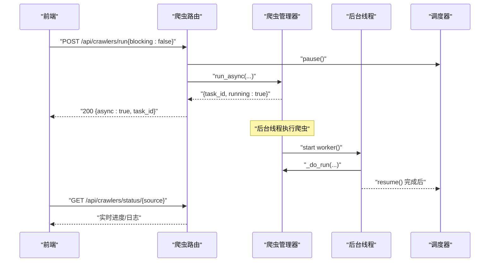
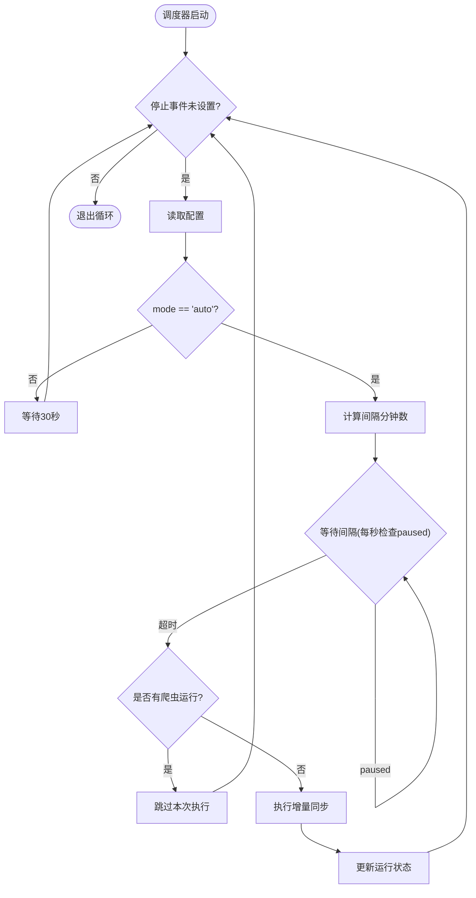
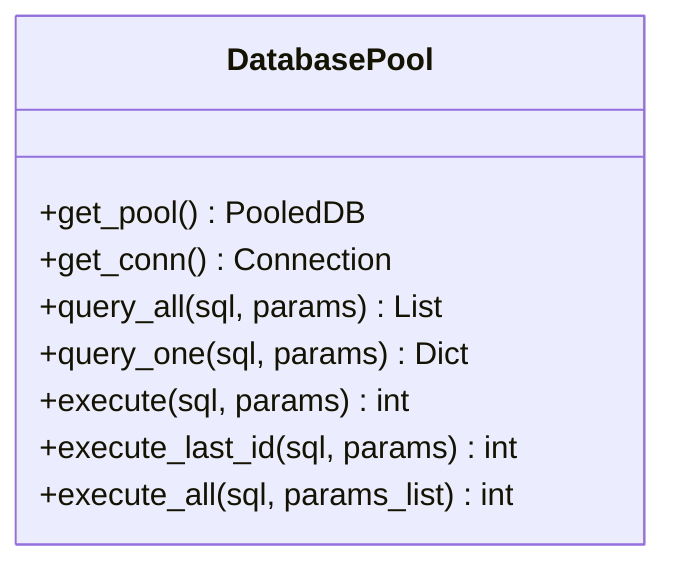
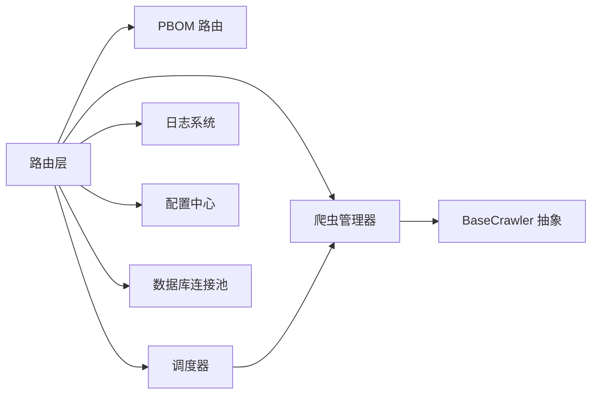

# 异步I/O优化

<cite>
**本文引用的文件**
- [backend/main.py](file://backend/main.py)
- [backend/logger.py](file://backend/logger.py)
- [backend/config.py](file://backend/config.py)
- [backend/database.py](file://backend/database.py)
- [backend/core/exceptions.py](file://backend/core/exceptions.py)
- [backend/crawlers/router.py](file://backend/crawlers/router.py)
- [backend/crawlers/crawler_manager.py](file://backend/crawlers/crawler_manager.py)
- [backend/crawlers/base.py](file://backend/crawlers/base.py)
- [backend/scheduling/scheduler.py](file://backend/scheduling/scheduler.py)
- [backend/projects/router.py](file://backend/projects/router.py)
- [backend/pbom/router.py](file://backend/pbom/router.py)
</cite>

## 目录
1. [简介](#简介)
2. [项目结构](#项目结构)
3. [核心组件](#核心组件)
4. [架构总览](#架构总览)
5. [详细组件分析](#详细组件分析)
6. [依赖关系分析](#依赖关系分析)
7. [性能考量](#性能考量)
8. [故障排查指南](#故障排查指南)
9. [结论](#结论)
10. [附录](#附录)

## 简介
本文件聚焦于 FastAPI 应用的异步 I/O 优化实践，围绕以下目标展开：
- 异步路由与处理器设计、请求响应流式处理与内存管理
- 网络请求、文件操作、外部 API 调用的异步化改造要点
- 异步日志记录（异步写入、缓冲策略与性能影响）
- 异步异常处理机制（全局捕获、错误分类与降级策略）
- 性能监控与调优（CPU、内存、响应时间）
- 常见异步陷阱识别与解决方案

本项目在 FastAPI 中采用“同步阻塞 + 后台线程”的混合模式实现爬虫任务调度，同时在文件上传等场景使用 aiofiles 进行非阻塞 I/O。数据库访问通过连接池封装，未提供原生异步驱动。整体设计兼顾了高并发下的吞吐能力与稳定性。

## 项目结构
后端以模块化路由组织功能，关键入口为 FastAPI 应用初始化、CORS、路由注册、全局异常处理与健康检查；爬虫模块提供异步触发与状态轮询；PBOM 解析模块提供异步文件上传与解析；调度器在后台线程按配置周期执行增量同步；日志与配置集中管理。

图表来源
- [backend/main.py:29-83](file://backend/main.py#L29-L83)
- [backend/crawlers/router.py:1-225](file://backend/crawlers/router.py#L1-L225)
- [backend/crawlers/crawler_manager.py:22-305](file://backend/crawlers/crawler_manager.py#L22-L305)
- [backend/pbom/router.py:23-166](file://backend/pbom/router.py#L23-L166)
- [backend/scheduling/scheduler.py:16-196](file://backend/scheduling/scheduler.py#L16-L196)
- [backend/logger.py:14-43](file://backend/logger.py#L14-L43)
- [backend/config.py:48-102](file://backend/config.py#L48-L102)
- [backend/database.py:12-116](file://backend/database.py#L12-L116)

章节来源
- [backend/main.py:29-120](file://backend/main.py#L29-L120)
- [backend/config.py:48-102](file://backend/config.py#L48-L102)

## 核心组件
- 应用启动与生命周期：在启动时启动调度器，关闭时停止调度器；注册 CORS、路由与健康检查；提供 SPA 静态资源回退。
- 全局异常处理：针对业务异常 BusinessError 返回结构化 JSON 响应。
- 爬虫异步执行：支持同步阻塞与后台线程异步两种模式；异步模式下立即返回 task_id，前端轮询状态与日志。
- PBOM 异步上传与解析：使用 aiofiles 分块读写大文件，避免阻塞事件循环；解析后入库并可选执行匹配。
- 调度器：后台线程按配置间隔自动执行增量同步，支持暂停/恢复与配置重载。
- 日志系统：基于 RotatingFileHandler 的文件+控制台输出，便于生产环境日志滚动与调试。
- 数据库访问：PooledDB 连接池封装查询与写操作，提供批量执行接口。

章节来源
- [backend/main.py:36-97](file://backend/main.py#L36-L97)
- [backend/core/exceptions.py:1-8](file://backend/core/exceptions.py#L1-L8)
- [backend/crawlers/router.py:89-147](file://backend/crawlers/router.py#L89-L147)
- [backend/crawlers/crawler_manager.py:134-197](file://backend/crawlers/crawler_manager.py#L134-L197)
- [backend/pbom/router.py:23-47](file://backend/pbom/router.py#L23-L47)
- [backend/projects/router.py:152-231](file://backend/projects/router.py#L152-L231)
- [backend/scheduling/scheduler.py:34-61](file://backend/scheduling/scheduler.py#L34-L61)
- [backend/logger.py:14-43](file://backend/logger.py#L14-L43)
- [backend/database.py:12-116](file://backend/database.py#L12-L116)

## 架构总览
下图展示了请求从进入 FastAPI 到调用爬虫或 PBOM 处理的完整流程，以及调度器的后台运行方式。

图表来源
- [backend/crawlers/router.py:89-147](file://backend/crawlers/router.py#L89-L147)
- [backend/crawlers/crawler_manager.py:134-197](file://backend/crawlers/crawler_manager.py#L134-L197)
- [backend/scheduling/scheduler.py:93-153](file://backend/scheduling/scheduler.py#L93-L153)
- [backend/database.py:51-116](file://backend/database.py#L51-L116)
- [backend/logger.py:14-43](file://backend/logger.py#L14-L43)

## 详细组件分析

### 异步路由与处理器设计
- 文件上传与流式处理：PBOM 与项目模块均使用 aiofiles 对 UploadFile 进行分块读写，避免一次性加载大文件导致内存峰值过高。
- 异步处理器：路由函数声明为 async，配合 aiofiles 的非阻塞 I/O，提升并发处理能力。
- 响应体设计：统一返回包含 success/data/message 的结构，便于前端处理。

图表来源
- [backend/pbom/router.py:23-47](file://backend/pbom/router.py#L23-L47)
- [backend/projects/router.py:152-231](file://backend/projects/router.py#L152-L231)

章节来源
- [backend/pbom/router.py:23-47](file://backend/pbom/router.py#L23-L47)
- [backend/projects/router.py:152-231](file://backend/projects/router.py#L152-L231)

### 爬虫异步执行与状态轮询
- 异步触发：/api/crawlers/run 默认异步模式，立即返回 task_id，前端通过 /api/crawlers/status 轮询。
- 后台线程：crawler_manager.run_async 使用 daemon 线程执行 _do_run，保证不阻塞事件循环。
- 状态管理：每个爬虫维护 logs、progress、status，便于前端展示实时进度。
- 调度器协作：手动触发前暂停调度器，完成后恢复，避免重复执行。

图表来源
- [backend/crawlers/router.py:89-147](file://backend/crawlers/router.py#L89-L147)
- [backend/crawlers/crawler_manager.py:134-197](file://backend/crawlers/crawler_manager.py#L134-L197)
- [backend/scheduling/scheduler.py:53-61](file://backend/scheduling/scheduler.py#L53-L61)

章节来源
- [backend/crawlers/router.py:89-147](file://backend/crawlers/router.py#L89-L147)
- [backend/crawlers/crawler_manager.py:134-197](file://backend/crawlers/crawler_manager.py#L134-L197)
- [backend/scheduling/scheduler.py:53-61](file://backend/scheduling/scheduler.py#L53-L61)

### 调度器后台执行与自动增量同步
- 后台线程：SchedulerService 在独立线程中循环读取配置、等待间隔、执行自动增量同步。
- 防冲突：检测是否有爬虫正在运行，若有则跳过本次自动执行。
- 可配置：支持暂停/恢复、配置变更通知与重新读取。

图表来源
- [backend/scheduling/scheduler.py:93-153](file://backend/scheduling/scheduler.py#L93-L153)
- [backend/scheduling/scheduler.py:155-193](file://backend/scheduling/scheduler.py#L155-L193)

章节来源
- [backend/scheduling/scheduler.py:93-153](file://backend/scheduling/scheduler.py#L93-L153)
- [backend/scheduling/scheduler.py:155-193](file://backend/scheduling/scheduler.py#L155-L193)

### 数据库访问与连接池
- 连接池：PooledDB 单例延迟初始化，避免启动失败导致服务崩溃。
- 事务与回滚：写操作在异常时回滚，确保一致性。
- 批量执行：executemany 提高批量写入效率。

图表来源
- [backend/database.py:12-116](file://backend/database.py#L12-L116)

章节来源
- [backend/database.py:12-116](file://backend/database.py#L12-L116)

### 日志系统与异步写入建议
- 当前实现：RotatingFileHandler + StreamHandler，按文件大小滚动，保留历史文件。
- 性能影响：同步写入可能在高并发下成为瓶颈；建议引入异步队列（如 asyncio.Queue）将日志写入解耦到专用线程或进程，降低请求路径开销。
- 缓冲策略：合理设置 maxBytes 与 backupCount，避免频繁磁盘 IO。

章节来源
- [backend/logger.py:14-43](file://backend/logger.py#L14-L43)

### 全局异常处理与降级策略
- 业务异常：BusinessError 携带 code 与 message，统一由 FastAPI 异常处理器返回 JSON。
- 降级策略：在 PBOM 匹配或配置列保存失败时，记录警告并继续后续流程，保障主流程可用性。
- 健壮性：调度器与爬虫管理器在异常路径中记录堆栈并尽量恢复（如恢复调度器）。

章节来源
- [backend/core/exceptions.py:1-8](file://backend/core/exceptions.py#L1-L8)
- [backend/main.py:85-92](file://backend/main.py#L85-L92)
- [backend/pbom/router.py:88-144](file://backend/pbom/router.py#L88-L144)
- [backend/crawlers/crawler_manager.py:168-197](file://backend/crawlers/crawler_manager.py#L168-L197)

## 依赖关系分析
- 路由层依赖：各模块 router 依赖各自的服务与 CRUD，并通过 logger 记录日志。
- 爬虫管理器依赖：BaseCrawler 抽象类定义统一接口，具体爬虫实现继承该基类。
- 调度器依赖：scheduler 依赖 crawler_manager 执行自动增量同步，并读取系统配置。
- 配置与日志：config 提供全局配置，logger 提供统一日志输出。

图表来源
- [backend/crawlers/router.py:1-225](file://backend/crawlers/router.py#L1-L225)
- [backend/crawlers/base.py:51-67](file://backend/crawlers/base.py#L51-L67)
- [backend/scheduling/scheduler.py:16-196](file://backend/scheduling/scheduler.py#L16-L196)
- [backend/logger.py:14-43](file://backend/logger.py#L14-L43)
- [backend/config.py:48-102](file://backend/config.py#L48-L102)
- [backend/database.py:12-116](file://backend/database.py#L12-L116)

章节来源
- [backend/crawlers/base.py:51-67](file://backend/crawlers/base.py#L51-L67)
- [backend/crawlers/router.py:1-225](file://backend/crawlers/router.py#L1-L225)
- [backend/scheduling/scheduler.py:16-196](file://backend/scheduling/scheduler.py#L16-L196)

## 性能考量
- 文件上传：使用 aiofiles 分块读写，控制单次读取大小（例如 1MB），降低内存占用并提升吞吐。
- 数据库连接池：合理设置 maxconnections、maxcached，避免连接耗尽或过多创建连接。
- 异步与线程：爬虫任务使用后台线程执行，避免阻塞事件循环；调度器在独立线程运行，互不影响。
- 日志写入：当前为同步写入，高并发下可能成为瓶颈；建议引入异步队列与批处理写入以降低延迟。
- 响应时间：异步路由与非阻塞 I/O 可降低长耗时操作的响应时间；对于 CPU 密集型任务，考虑使用进程池或外部任务队列。

[本节为通用指导，不直接分析具体文件]

## 故障排查指南
- 数据库连接失败：检查 .env 中的 DB_HOST、DB_PORT、DB_USER、DB_PASSWORD、DB_DATABASE；连接池初始化失败会记录详细错误信息。
- 爬虫任务异常：查看 crawler_manager 的异常日志与任务元信息（error、status、end_time）；确认是否设置了停止标志。
- 调度器未执行：检查 mode 是否为 auto；确认 interval_minutes 配置有效；查看是否有爬虫正在运行导致跳过。
- 文件上传失败：确认文件格式与大小限制；检查临时文件路径权限与磁盘空间。
- 日志缺失：确认日志目录存在且可写；检查 RotatingFileHandler 配置与磁盘配额。

章节来源
- [backend/database.py:12-43](file://backend/database.py#L12-L43)
- [backend/crawlers/crawler_manager.py:168-197](file://backend/crawlers/crawler_manager.py#L168-L197)
- [backend/scheduling/scheduler.py:93-153](file://backend/scheduling/scheduler.py#L93-L153)
- [backend/pbom/router.py:23-47](file://backend/pbom/router.py#L23-L47)
- [backend/logger.py:14-43](file://backend/logger.py#L14-L43)

## 结论
本项目在 FastAPI 中实现了较为完善的异步 I/O 优化：文件上传采用 aiofiles 非阻塞 I/O，爬虫任务通过后台线程异步执行，调度器在独立线程按配置周期运行，数据库访问通过连接池提升并发能力。全局异常处理与降级策略增强了系统的健壮性。为进一步优化，建议引入异步日志写入队列、评估数据库异步驱动替换方案，并对 CPU 密集型任务进行进程级隔离或外部任务队列化处理。

[本节为总结，不直接分析具体文件]

## 附录
- 常用接口
  - 健康检查：/api/health
  - 爬虫配置：/api/crawlers/config
  - 爬虫执行：/api/crawlers/run（支持 blocking=true 兼容旧模式）
  - 爬虫状态：/api/crawlers/status/{source}
  - PBOM 上传与解析：/api/pbom/upload、/api/pbom/detect-columns、/api/pbom/parse
  - 项目 PBOM 上传：/api/projects/{project_id}/pbom-upload

章节来源
- [backend/main.py:94-97](file://backend/main.py#L94-L97)
- [backend/crawlers/router.py:43-147](file://backend/crawlers/router.py#L43-L147)
- [backend/pbom/router.py:23-166](file://backend/pbom/router.py#L23-L166)
- [backend/projects/router.py:152-231](file://backend/projects/router.py#L152-L231)