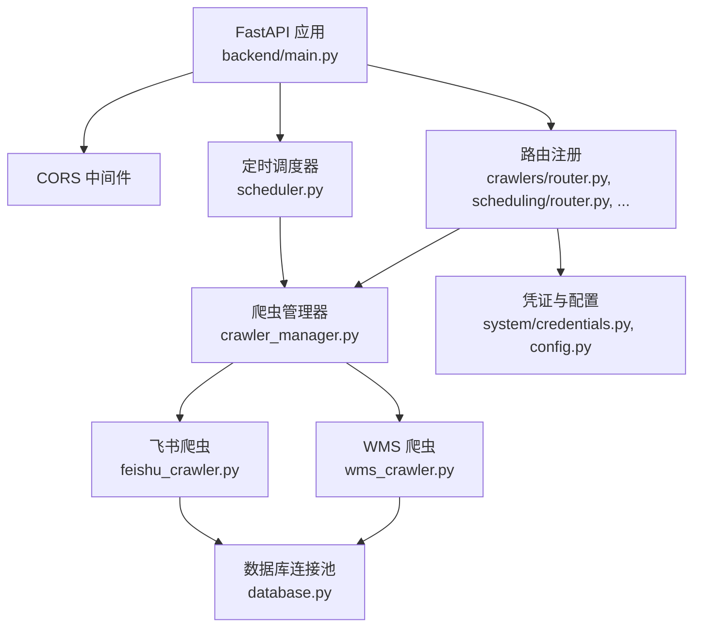
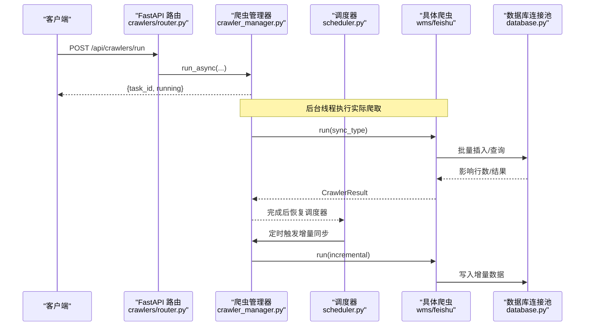
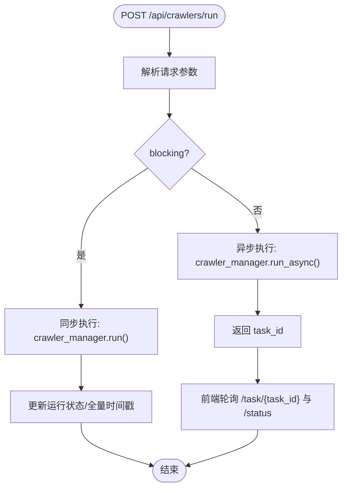
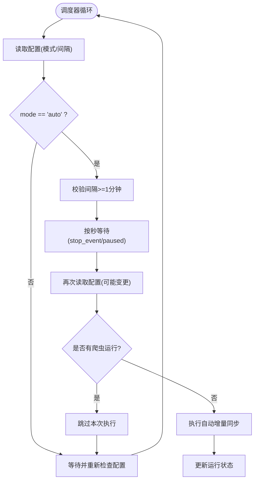
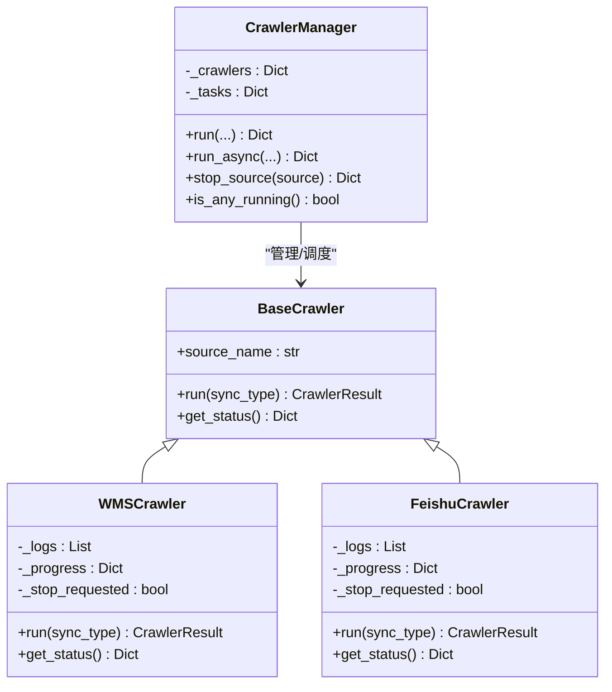
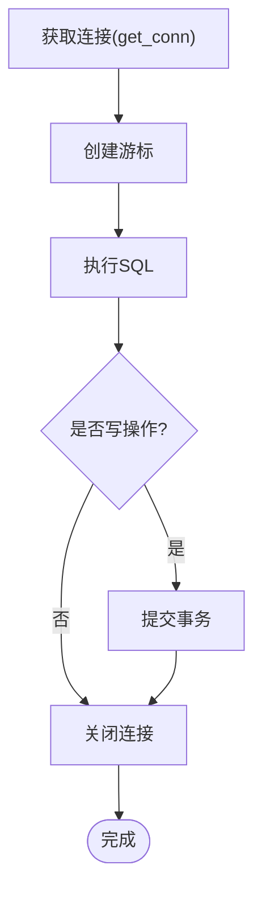
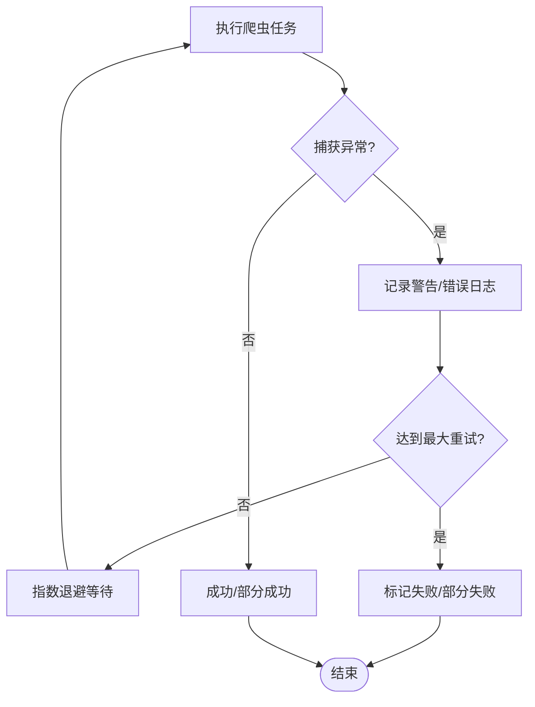
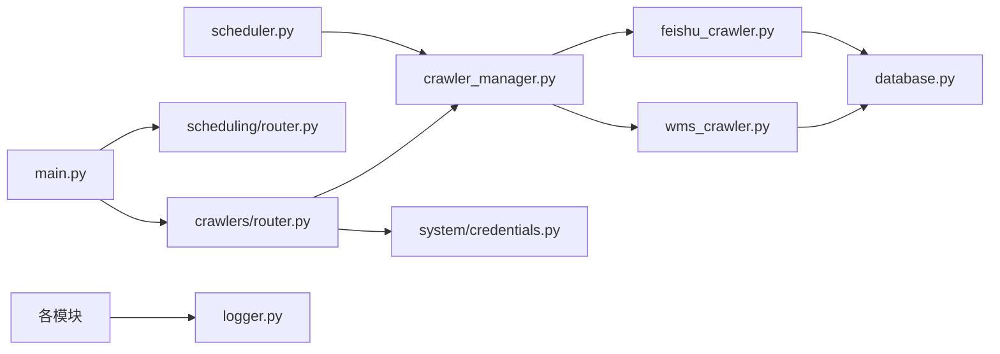

# 异步处理机制

<cite>
**本文引用的文件**
- [backend/main.py](file://backend/main.py)
- [backend/config.py](file://backend/config.py)
- [backend/database.py](file://backend/database.py)
- [backend/logger.py](file://backend/logger.py)
- [backend/core/exceptions.py](file://backend/core/exceptions.py)
- [backend/scheduling/scheduler.py](file://backend/scheduling/scheduler.py)
- [backend/scheduling/router.py](file://backend/scheduling/router.py)
- [backend/crawlers/base.py](file://backend/crawlers/base.py)
- [backend/crawlers/crawler_manager.py](file://backend/crawlers/crawler_manager.py)
- [backend/crawlers/router.py](file://backend/crawlers/router.py)
- [backend/crawlers/wms_crawler.py](file://backend/crawlers/wms_crawler.py)
- [backend/crawlers/feishu_crawler.py](file://backend/crawlers/feishu_crawler.py)
- [backend/system/credentials.py](file://backend/system/credentials.py)
</cite>

## 目录
1. [简介](#简介)
2. [项目结构](#项目结构)
3. [核心组件](#核心组件)
4. [架构总览](#架构总览)
5. [详细组件分析](#详细组件分析)
6. [依赖关系分析](#依赖关系分析)
7. [性能考量与优化](#性能考量与优化)
8. [故障排查指南](#故障排查指南)
9. [结论](#结论)
10. [附录](#附录)

## 简介
本文件围绕本项目在 FastAPI 中的“异步处理机制”进行系统化说明，重点覆盖：
- 异步路由处理、协程任务与并发控制（FastAPI + Uvicorn）
- 后台任务调度器（定时任务管理、任务队列与优先级调度思路）
- 爬虫任务的异步执行机制（并发爬取、任务分发、资源池管理）
- 数据库操作与连接池策略
- 异步 I/O 优化与性能调优技巧
- 异常处理与失败重试机制
- 最佳实践与常见陷阱

## 项目结构
后端采用模块化组织，关键模块职责如下：
- 应用入口与生命周期：main.py
- 配置中心：config.py
- 数据库访问与连接池：database.py
- 日志系统：logger.py
- 业务异常定义与全局处理：core/exceptions.py
- 定时调度器：scheduling/scheduler.py
- 爬虫管理与路由：crawlers/*
- 凭证与系统参数：system/credentials.py

图表来源
- [backend/main.py:29-83](file://backend/main.py#L29-L83)
- [backend/crawlers/router.py:1-225](file://backend/crawlers/router.py#L1-L225)
- [backend/scheduling/scheduler.py:16-196](file://backend/scheduling/scheduler.py#L16-L196)
- [backend/database.py:1-116](file://backend/database.py#L1-L116)

章节来源
- [backend/main.py:29-83](file://backend/main.py#L29-L83)
- [backend/config.py:48-102](file://backend/config.py#L48-L102)

## 核心组件
- 应用启动与关闭钩子：在应用启动时自动启动调度器，关闭时停止调度器；提供健康检查与 SPA 回退路由。
- 定时调度器：独立线程运行，按配置间隔触发增量同步，支持暂停/恢复、配置热重载。
- 爬虫管理器：统一调度各数据源爬虫，支持同步阻塞与后台线程非阻塞两种模式，维护任务元信息。
- 爬虫基类与各实现：抽象 run/get_status 接口，封装日志、进度、状态机与批量入库逻辑。
- 数据库连接池：基于 PooledDB 的 MySQL 连接池，提供查询与写操作的封装，保证连接复用与事务安全。
- 凭证与配置：集中管理爬虫同步配置、系统参数、外部系统 Token 等。

章节来源
- [backend/main.py:36-55](file://backend/main.py#L36-L55)
- [backend/scheduling/scheduler.py:16-196](file://backend/scheduling/scheduler.py#L16-L196)
- [backend/crawlers/crawler_manager.py:22-305](file://backend/crawlers/crawler_manager.py#L22-L305)
- [backend/crawlers/base.py:12-67](file://backend/crawlers/base.py#L12-L67)
- [backend/database.py:12-116](file://backend/database.py#L12-L116)
- [backend/system/credentials.py:297-441](file://backend/system/credentials.py#L297-L441)

## 架构总览
下图展示了从 HTTP 请求到爬虫执行、再到数据库写入的整体流程，以及调度器的独立循环。

图表来源
- [backend/crawlers/router.py:89-147](file://backend/crawlers/router.py#L89-L147)
- [backend/crawlers/crawler_manager.py:134-197](file://backend/crawlers/crawler_manager.py#L134-L197)
- [backend/scheduling/scheduler.py:93-153](file://backend/scheduling/scheduler.py#L93-L153)
- [backend/database.py:51-116](file://backend/database.py#L51-L116)

## 详细组件分析

### 异步路由与协程任务
- FastAPI 路由默认以协程方式处理请求，适合短耗时 I/O 或快速返回。对于长耗时任务（如爬虫），采用“立即返回 task_id + 后台线程执行”的模式，前端轮询任务状态与日志。
- 通过 crawler_manager.run_async 创建后台线程执行 _do_run，避免阻塞事件循环；任务完成后自动恢复调度器，防止手动触发后调度器永久暂停。

图表来源
- [backend/crawlers/router.py:89-147](file://backend/crawlers/router.py#L89-L147)
- [backend/crawlers/crawler_manager.py:134-197](file://backend/crawlers/crawler_manager.py#L134-L197)

章节来源
- [backend/crawlers/router.py:89-147](file://backend/crawlers/router.py#L89-L147)
- [backend/crawlers/crawler_manager.py:134-197](file://backend/crawlers/crawler_manager.py#L134-L197)

### 后台任务调度器（定时任务管理）
- 调度器以独立守护线程运行，读取系统参数决定模式与间隔，支持暂停/恢复与配置热重载。
- 自动增量同步：当模式为 auto 且无爬虫运行时，按配置的分钟数触发一次增量同步；若检测到爬虫正在运行则跳过本次执行，避免重复。
- 任务队列与优先级：当前实现为单线程循环+条件等待，未引入复杂队列与优先级；可通过扩展为多生产者-消费者模型或引入消息队列以实现更复杂的调度。

图表来源
- [backend/scheduling/scheduler.py:93-153](file://backend/scheduling/scheduler.py#L93-L153)

章节来源
- [backend/scheduling/scheduler.py:16-196](file://backend/scheduling/scheduler.py#L16-L196)

### 爬虫任务的异步执行机制
- 任务分发：crawler_manager 根据 source/enabled_sources 选择要执行的爬虫；支持全部或指定数据源。
- 并发爬取：当前实现为串行遍历 enabled_sources，每个爬虫内部顺序分页拉取与入库；如需更高并发，可在管理器层对多个爬虫使用线程池或进程池并行执行。
- 资源池管理：HTTP 使用 requests.Session 复用连接；数据库使用 PooledDB 连接池；每页抓取后批量入库，减少 IO 次数。
- 停止与取消：通过 _stop_requested 标志位在各爬虫循环中检查，支持优雅退出。

图表来源
- [backend/crawlers/base.py:12-67](file://backend/crawlers/base.py#L12-L67)
- [backend/crawlers/wms_crawler.py:44-477](file://backend/crawlers/wms_crawler.py#L44-L477)
- [backend/crawlers/feishu_crawler.py:55-419](file://backend/crawlers/feishu_crawler.py#L55-L419)
- [backend/crawlers/crawler_manager.py:22-305](file://backend/crawlers/crawler_manager.py#L22-L305)

章节来源
- [backend/crawlers/crawler_manager.py:22-305](file://backend/crawlers/crawler_manager.py#L22-L305)
- [backend/crawlers/wms_crawler.py:44-477](file://backend/crawlers/wms_crawler.py#L44-L477)
- [backend/crawlers/feishu_crawler.py:55-419](file://backend/crawlers/feishu_crawler.py#L55-L419)

### 异步数据库操作与连接池管理
- 连接池：PooledDB 单例延迟初始化，避免启动时因配置错误导致服务崩溃；可配置最大连接数、缓存连接数与阻塞行为。
- 读写封装：query_all/query_one/execute/execute_last_id/execute_all 统一封装连接获取、游标使用、提交/回滚与释放。
- 事务与一致性：写操作在 try/except 中捕获异常并回滚，确保数据一致性；批量插入使用 executemany 提升吞吐。
- 注意：当前数据库访问为同步调用，爬虫在后台线程中执行以避免阻塞事件循环；若需完全异步，可考虑改用异步驱动（如 aiomysql）并结合连接池。

图表来源
- [backend/database.py:46-116](file://backend/database.py#L46-L116)

章节来源
- [backend/database.py:12-116](file://backend/database.py#L12-L116)

### 异步 I/O 优化与性能调优
- HTTP 层：
  - 使用 requests.Session 复用 TCP 连接，减少握手开销。
  - 设置合理的超时与重试（指数退避），提高网络不稳定时的鲁棒性。
  - 分页拉取与批量入库，降低数据库压力。
- 数据库层：
  - 连接池大小与缓存连接数根据负载调整，避免过多连接导致上下文切换。
  - 使用 INSERT IGNORE + executemany 批量写入，减少锁竞争与往返次数。
- 调度与并发：
  - 调度器避免与手动任务冲突（暂停/恢复机制）。
  - 可扩展为多线程/多进程并行执行多个爬虫，或使用消息队列解耦生产与消费。
- 日志与监控：
  - 滚动日志文件限制大小与保留数量，避免磁盘占用过大。
  - 暴露健康检查与摘要接口，便于监控与告警。

章节来源
- [backend/crawlers/wms_crawler.py:180-213](file://backend/crawlers/wms_crawler.py#L180-L213)
- [backend/crawlers/feishu_crawler.py:132-203](file://backend/crawlers/feishu_crawler.py#L132-L203)
- [backend/database.py:12-43](file://backend/database.py#L12-L43)
- [backend/logger.py:14-43](file://backend/logger.py#L14-L43)

### 异常处理与失败重试
- 业务异常：BusinessError 作为统一业务异常类型，由全局异常处理器返回结构化 JSON 响应。
- 网络异常：爬虫内部对超时、连接错误进行指数退避重试，记录警告日志并继续或终止。
- 调度器异常：主循环捕获异常并等待一段时间重试，避免频繁失败导致 CPU 抖动。
- 任务失败：crawler_manager 在 _do_run 中捕获单个爬虫异常，汇总整体状态（success/partial/failed），并记录错误信息。

图表来源
- [backend/core/exceptions.py:1-8](file://backend/core/exceptions.py#L1-L8)
- [backend/crawlers/wms_crawler.py:180-213](file://backend/crawlers/wms_crawler.py#L180-L213)
- [backend/crawlers/feishu_crawler.py:146-198](file://backend/crawlers/feishu_crawler.py#L146-L198)
- [backend/scheduling/scheduler.py:149-152](file://backend/scheduling/scheduler.py#L149-L152)
- [backend/crawlers/crawler_manager.py:259-286](file://backend/crawlers/crawler_manager.py#L259-L286)

章节来源
- [backend/core/exceptions.py:1-8](file://backend/core/exceptions.py#L1-L8)
- [backend/crawlers/wms_crawler.py:180-213](file://backend/crawlers/wms_crawler.py#L180-L213)
- [backend/crawlers/feishu_crawler.py:146-198](file://backend/crawlers/feishu_crawler.py#L146-L198)
- [backend/scheduling/scheduler.py:149-152](file://backend/scheduling/scheduler.py#L149-L152)
- [backend/crawlers/crawler_manager.py:259-286](file://backend/crawlers/crawler_manager.py#L259-L286)

## 依赖关系分析
- main.py 依赖各模块路由与调度器，负责生命周期与中间件。
- crawlers/router.py 依赖 crawler_manager 与 system/credentials，提供爬虫配置、状态、运行与调度控制接口。
- scheduler.py 依赖 credentials 与 crawler_manager，实现定时触发与状态协调。
- database.py 被各爬虫与凭证模块使用，提供统一的连接池与 SQL 封装。
- logger.py 为所有模块提供统一日志输出。

图表来源
- [backend/main.py:18-83](file://backend/main.py#L18-L83)
- [backend/crawlers/router.py:1-225](file://backend/crawlers/router.py#L1-L225)
- [backend/scheduling/scheduler.py:16-196](file://backend/scheduling/scheduler.py#L16-L196)
- [backend/database.py:1-116](file://backend/database.py#L1-L116)
- [backend/logger.py:14-43](file://backend/logger.py#L14-L43)

章节来源
- [backend/main.py:18-83](file://backend/main.py#L18-L83)
- [backend/crawlers/router.py:1-225](file://backend/crawlers/router.py#L1-L225)
- [backend/scheduling/scheduler.py:16-196](file://backend/scheduling/scheduler.py#L16-L196)
- [backend/database.py:1-116](file://backend/database.py#L1-L116)
- [backend/logger.py:14-43](file://backend/logger.py#L14-L43)

## 性能考量与优化
- 连接池调优：根据并发请求与爬虫规模调整 maxconnections/maxcached，避免连接耗尽或空闲浪费。
- 批处理与去重：使用 INSERT IGNORE 与 executemany 减少锁竞争与网络往返；合理设置批次大小。
- 网络重试与限流：指数退避避免雪崩；对第三方 API 增加速率限制与熔断保护。
- 调度粒度：将大任务拆分为小批次，结合前端轮询提升用户体验；必要时引入消息队列实现削峰填谷。
- 日志与监控：启用滚动日志与健康检查；对关键指标（成功率、耗时、队列长度）进行采集与告警。

[本节为通用指导，不直接分析具体文件]

## 故障排查指南
- 数据库连接失败：检查 .env 中 DB_* 配置是否正确；查看连接池初始化日志提示。
- 爬虫无法登录：确认凭证已正确保存（authorization/cookie/token），并在系统设置中激活；查看凭证列表与最近登录结果。
- 调度器未执行：检查 mode 是否为 auto；确认没有爬虫正在运行；查看调度器状态与日志。
- 任务长时间无响应：检查 task_id 是否存在；确认后台线程是否正常；查看爬虫日志与进度。
- 网络异常：关注超时与连接错误日志；适当调整 MAX_RETRIES 与超时参数。

章节来源
- [backend/database.py:12-43](file://backend/database.py#L12-L43)
- [backend/system/credentials.py:174-247](file://backend/system/credentials.py#L174-L247)
- [backend/scheduling/scheduler.py:67-74](file://backend/scheduling/scheduler.py#L67-L74)
- [backend/crawlers/router.py:80-86](file://backend/crawlers/router.py#L80-L86)

## 结论
本项目在 FastAPI 中通过“协程路由 + 后台线程任务”的方式实现了爬虫的异步执行，配合独立的定时调度器与连接池化的数据库访问，形成了稳定高效的异步处理体系。未来可进一步引入真正的异步 I/O（aiomysql/asyncio）、任务队列（Celery/RQ）与分布式调度，以提升可扩展性与容错能力。

[本节为总结，不直接分析具体文件]

## 附录
- 常用接口参考：
  - 爬虫配置：GET/POST /api/crawlers/config
  - 运行爬虫：POST /api/crawlers/run（支持 blocking=true 兼容旧模式）
  - 任务状态：GET /api/crawlers/task/{task_id}
  - 调度器控制：POST /api/crawlers/start_scheduler, /api/crawlers/stop_scheduler
  - 健康检查：GET /api/health

章节来源
- [backend/crawlers/router.py:43-201](file://backend/crawlers/router.py#L43-L201)
- [backend/main.py:94-97](file://backend/main.py#L94-L97)