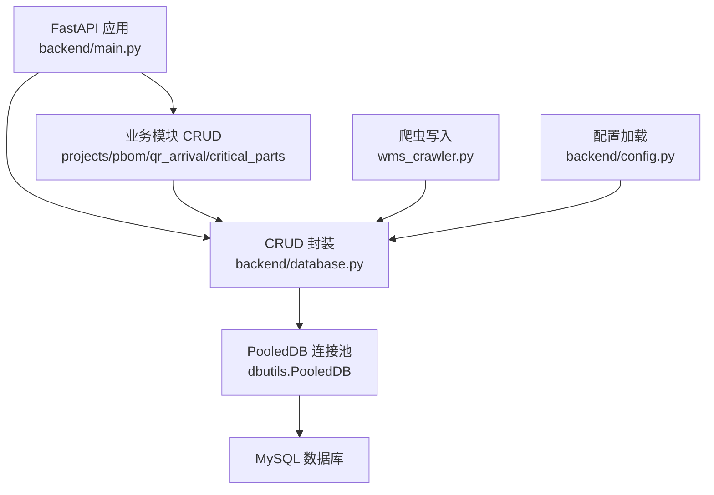
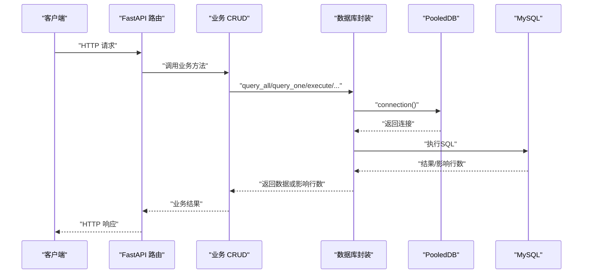
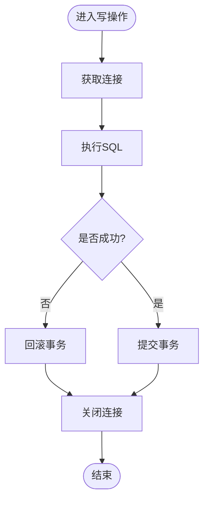
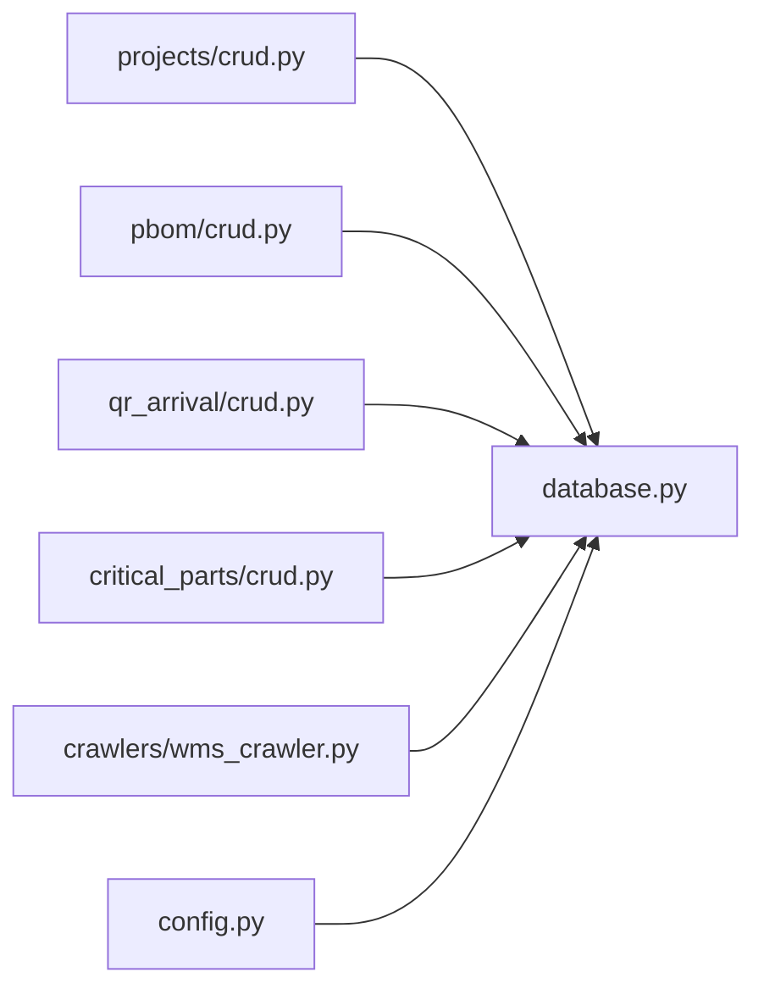

# 异步数据库操作

<cite>
**本文引用的文件**
- [backend/database.py](file://backend/database.py)
- [backend/config.py](file://backend/config.py)
- [backend/main.py](file://backend/main.py)
- [backend/projects/crud.py](file://backend/projects/crud.py)
- [backend/pbom/crud.py](file://backend/pbom/crud.py)
- [backend/qr_arrival/crud.py](file://backend/qr_arrival/crud.py)
- [backend/critical_parts/crud.py](file://backend/critical_parts/crud.py)
- [backend/crawlers/wms_crawler.py](file://backend/crawlers/wms_crawler.py)
</cite>

## 目录
1. [简介](#简介)
2. [项目结构](#项目结构)
3. [核心组件](#核心组件)
4. [架构总览](#架构总览)
5. [详细组件分析](#详细组件分析)
6. [依赖关系分析](#依赖关系分析)
7. [性能考量](#性能考量)
8. [故障排查指南](#故障排查指南)
9. [结论](#结论)
10. [附录](#附录)

## 简介
本文件聚焦于后端数据库访问层的设计与实现，围绕连接池管理、查询封装、事务与批量写入、并发访问控制、健康检查与自动重连、慢查询监控与优化、异常处理与恢复策略进行系统化说明。当前代码库采用同步的 PyMySQL + dbutils PooledDB 作为数据库访问基础，并通过统一的 CRUD 封装暴露给业务模块；同时提供健康检查接口用于服务可用性探测。文档在尊重现有实现的基础上，补充了面向异步场景的最佳实践建议（如 SQLAlchemy AsyncSession、连接池参数调优、慢查询日志等），以便后续演进时参考。

## 项目结构
- 数据库访问层：backend/database.py 提供连接池初始化、连接获取、读/写/批量写入封装。
- 配置中心：backend/config.py 集中加载 .env 中的数据库连接参数。
- 应用入口与健康检查：backend/main.py 注册路由并暴露 /api/health 健康检查端点。
- 业务数据访问：各模块 crud.py（projects、pbom、qr_arrival、critical_parts）通过统一封装进行 SQL 操作。
- 爬虫写入：crawlers/wms_crawler.py 使用批量写入接口将抓取数据持久化。

图示来源
- [backend/main.py:74-83](file://backend/main.py#L74-L83)
- [backend/database.py:12-43](file://backend/database.py#L12-L43)
- [backend/config.py:48-57](file://backend/config.py#L48-L57)

章节来源
- [backend/main.py:74-83](file://backend/main.py#L74-L83)
- [backend/database.py:12-43](file://backend/database.py#L12-L43)
- [backend/config.py:48-57](file://backend/config.py#L48-L57)

## 核心组件
- 连接池与连接管理
  - 单例延迟初始化 PooledDB，避免启动失败导致进程崩溃；连接失败时记录明确错误信息并抛出异常。
  - 提供 get_conn() 从池中获取连接，query_all/query_one/execute/execute_last_id/execute_all 统一封装读写与事务边界。
- 配置
  - 通过 Settings 类读取 DB_HOST/DB_PORT/DB_USER/DB_PASSWORD/DB_DATABASE 等环境变量，支持默认值与类型转换。
- 健康检查
  - /api/health 返回服务运行状态，便于负载均衡与健康探针。

章节来源
- [backend/database.py:12-43](file://backend/database.py#L12-L43)
- [backend/database.py:46-116](file://backend/database.py#L46-L116)
- [backend/config.py:48-57](file://backend/config.py#L48-L57)
- [backend/main.py:94-97](file://backend/main.py#L94-L97)

## 架构总览
下图展示请求到数据库的调用链路与关键职责划分：

图示来源
- [backend/main.py:74-83](file://backend/main.py#L74-L83)
- [backend/database.py:46-116](file://backend/database.py#L46-L116)
- [backend/database.py:12-43](file://backend/database.py#L12-L43)

## 详细组件分析

### 连接池与连接生命周期
- 连接创建
  - 首次访问 get_pool() 时创建 PooledDB，设置最大连接数、缓存连接数、阻塞模式及字符集等参数。
  - 初始化失败会记录包含配置提示的错误日志并抛出异常，便于快速定位 .env 问题。
- 连接复用
  - 每次查询/写入通过 get_conn() 从池中取连接，使用 with conn.cursor() 上下文确保游标正确关闭。
- 连接释放
  - finally 块中显式 conn.close()，保证连接归还到池中，避免泄漏。
- 事务语义
  - 写操作 execute/execute_last_id/execute_all 在执行成功后 commit，发生异常时 rollback，确保原子性。

图示来源
- [backend/database.py:73-116](file://backend/database.py#L73-L116)

章节来源
- [backend/database.py:12-43](file://backend/database.py#L12-L43)
- [backend/database.py:46-116](file://backend/database.py#L46-L116)

### 异步数据库查询与事务管理（现状与建议）
- 现状
  - 当前数据库访问为同步实现（PyMySQL + PooledDB），所有 CRUD 均为同步函数。
- 建议（后续演进）
  - 引入 SQLAlchemy AsyncEngine + AsyncSession，结合 FastAPI 的依赖注入，在每个请求内维护会话生命周期。
  - 使用 async with session.begin(): 包裹事务，确保异常时自动回滚；查询使用 select() 与 await session.execute()。
  - 将连接池参数（pool_size、max_overflow、pool_recycle、pool_pre_ping）纳入配置，配合 pool_pre_ping 做连接健康检测。
  - 对耗时查询增加超时与重试策略，避免长事务占用连接。

章节来源
- [backend/database.py:12-43](file://backend/database.py#L12-L43)
- [backend/database.py:46-116](file://backend/database.py#L46-L116)

### 并发访问、锁机制与死锁避免
- 并发模型
  - 当前基于线程安全的连接池，每个请求独立获取连接，适合高并发场景。
- 锁与一致性
  - 未使用显式行级锁；对于幂等写入（如 ON DUPLICATE KEY UPDATE）可避免重复插入导致的竞争。
- 死锁避免建议
  - 固定多表更新顺序，减少交叉锁等待。
  - 尽量使用唯一键冲突解决（ON DUPLICATE KEY UPDATE）替代先查后写的竞态条件。
  - 缩短事务范围，避免在事务中进行外部网络调用。
  - 对热点行加索引，减少锁升级概率。

章节来源
- [backend/pbom/crud.py:10-28](file://backend/pbom/crud.py#L10-L28)
- [backend/critical_parts/crud.py:4-34](file://backend/critical_parts/crud.py#L4-L34)

### 健康检查与自动重连
- 健康检查
  - 提供 /api/health 返回服务状态，可用于负载均衡器健康探针。
- 自动重连
  - PooledDB 内部具备连接管理与重连能力；建议在连接获取处捕获连接异常并重试有限次数。
  - 若迁移至 SQLAlchemy，启用 pool_pre_ping 并在连接失败时触发重建。

章节来源
- [backend/main.py:94-97](file://backend/main.py#L94-L97)
- [backend/database.py:12-43](file://backend/database.py#L12-L43)

### 慢查询监控与性能优化
- 监控
  - 可在数据库层开启 slow_query_log，或在应用层对关键查询打点计时，记录超过阈值的 SQL 与参数。
- 优化技巧
  - 分页查询使用 LIMIT/OFFSET，避免全表扫描。
  - 批量写入优先使用 executemany 或批量 INSERT，减少往返开销。
  - 合理建索引，覆盖常用过滤字段（如 project_id、part_code）。
  - 合并多次小查询为一次聚合查询，减少 N+1 问题。

章节来源
- [backend/projects/crud.py:5-49](file://backend/projects/crud.py#L5-L49)
- [backend/pbom/crud.py:10-28](file://backend/pbom/crud.py#L10-L28)

### 最佳实践：批量操作、连接池调优与内存优化
- 批量操作
  - 使用 execute_all 进行批量写入，降低网络与解析开销。
  - 分批提交，避免单次事务过大导致锁竞争与回滚代价过高。
- 连接池调优
  - maxconnections 根据并发度与数据库承载能力调整；mincached=0 避免冷启动浪费；maxcached 控制空闲连接上限。
  - blocking=True 在高并发下排队获取连接，防止资源耗尽。
- 内存优化
  - 使用 DictCursor 返回字典结果，注意大结果集的分页与流式处理，避免一次性加载过多数据。
  - 及时关闭游标与连接，避免内存泄漏。

章节来源
- [backend/database.py:20-33](file://backend/database.py#L20-L33)
- [backend/database.py:104-116](file://backend/database.py#L104-L116)
- [backend/crawlers/wms_crawler.py:303-310](file://backend/crawlers/wms_crawler.py#L303-L310)

### 异常处理与错误恢复
- 连接初始化失败
  - 记录详细错误信息（含配置项提示），并抛出异常，阻止服务以错误配置运行。
- 写操作异常
  - 统一在异常分支执行 rollback，确保数据一致性。
- 爬虫写入异常
  - 捕获异常并记录日志，返回空结果或降级处理，避免影响主流程。

章节来源
- [backend/database.py:34-43](file://backend/database.py#L34-L43)
- [backend/database.py:73-116](file://backend/database.py#L73-L116)
- [backend/crawlers/wms_crawler.py:303-310](file://backend/crawlers/wms_crawler.py#L303-L310)

## 依赖关系分析
- 模块耦合
  - 业务模块通过导入 backend.database 提供的函数访问数据库，耦合点清晰。
  - 配置集中在 backend.config.Settings，便于统一管理与测试替换。
- 外部依赖
  - pymysql 驱动、dbutils.pooled_db 连接池。
- 潜在风险
  - 全局单例 _pool 的生命周期由进程负责，需确保进程退出时资源清理。
  - 大量并发写入时需关注连接池大小与数据库负载。

图示来源
- [backend/projects/crud.py:1-3](file://backend/projects/crud.py#L1-L3)
- [backend/pbom/crud.py:1-8](file://backend/pbom/crud.py#L1-L8)
- [backend/qr_arrival/crud.py:1-2](file://backend/qr_arrival/crud.py#L1-L2)
- [backend/critical_parts/crud.py:1-2](file://backend/critical_parts/crud.py#L1-L2)
- [backend/crawlers/wms_crawler.py:216-310](file://backend/crawlers/wms_crawler.py#L216-L310)
- [backend/config.py:48-57](file://backend/config.py#L48-L57)

章节来源
- [backend/projects/crud.py:1-3](file://backend/projects/crud.py#L1-L3)
- [backend/pbom/crud.py:1-8](file://backend/pbom/crud.py#L1-L8)
- [backend/qr_arrival/crud.py:1-2](file://backend/qr_arrival/crud.py#L1-L2)
- [backend/critical_parts/crud.py:1-2](file://backend/critical_parts/crud.py#L1-L2)
- [backend/crawlers/wms_crawler.py:216-310](file://backend/crawlers/wms_crawler.py#L216-L310)
- [backend/config.py:48-57](file://backend/config.py#L48-L57)

## 性能考量
- 连接池参数
  - maxconnections 决定最大并发连接数，需结合数据库最大连接限制与业务峰值评估。
  - mincached=0 避免冷启动预分配连接；maxcached 控制空闲连接数量，平衡内存与建立连接的开销。
- 查询优化
  - 分页与投影：只选择必要字段，减少数据传输。
  - 聚合与去重：在 SQL 层完成统计与去重，减少 Python 侧计算。
- 写入优化
  - 批量写入：使用 executemany 或批量 INSERT，减少往返。
  - 事务粒度：将相关写入放入同一事务，减少提交次数。
- 监控与告警
  - 开启慢查询日志，定期分析 TOP SQL。
  - 对关键接口增加耗时埋点，设置阈值告警。

章节来源
- [backend/database.py:20-33](file://backend/database.py#L20-L33)
- [backend/projects/crud.py:5-49](file://backend/projects/crud.py#L5-L49)
- [backend/pbom/crud.py:10-28](file://backend/pbom/crud.py#L10-L28)

## 故障排查指南
- 连接池初始化失败
  - 现象：服务启动或首次访问时报错，日志包含配置提示。
  - 排查：检查 .env 中 DB_HOST/DB_PORT/DB_USER/DB_PASSWORD/DB_DATABASE 是否正确；确认数据库可达。
- 写操作异常
  - 现象：INSERT/UPDATE/DELETE 报错，数据未生效。
  - 排查：查看异常堆栈；确认事务是否回滚；检查约束与索引冲突。
- 爬虫批量写入失败
  - 现象：大批量插入返回 0 或异常。
  - 排查：检查网络波动、数据库负载；适当降低批次大小或增加重试间隔。
- 健康检查
  - 使用 /api/health 验证服务存活；若失败，检查依赖服务与端口占用。

章节来源
- [backend/database.py:34-43](file://backend/database.py#L34-L43)
- [backend/database.py:73-116](file://backend/database.py#L73-L116)
- [backend/crawlers/wms_crawler.py:303-310](file://backend/crawlers/wms_crawler.py#L303-L310)
- [backend/main.py:94-97](file://backend/main.py#L94-L97)

## 结论
当前系统通过 PooledDB 实现了稳定可靠的同步数据库访问层，提供了清晰的连接生命周期管理与事务边界，满足大多数业务场景。为进一步提升并发能力与可观测性，建议逐步引入 SQLAlchemy 异步会话、完善慢查询监控与连接健康检查，并结合业务峰值调优连接池参数。遵循批量写入、事务最小化与索引优化等最佳实践，可有效提升整体性能与稳定性。

## 附录
- 关键路径参考
  - 连接池初始化与获取：[backend/database.py:12-43](file://backend/database.py#L12-L43)
  - 读写封装与事务：[backend/database.py:46-116](file://backend/database.py#L46-L116)
  - 配置加载：[backend/config.py:48-57](file://backend/config.py#L48-L57)
  - 健康检查：[backend/main.py:94-97](file://backend/main.py#L94-L97)
  - 批量写入示例：[backend/crawlers/wms_crawler.py:303-310](file://backend/crawlers/wms_crawler.py#L303-L310)
  - 分页与聚合查询：[backend/projects/crud.py:5-49](file://backend/projects/crud.py#L5-L49)
  - 幂等写入（冲突更新）：[backend/critical_parts/crud.py:4-34](file://backend/critical_parts/crud.py#L4-L34)