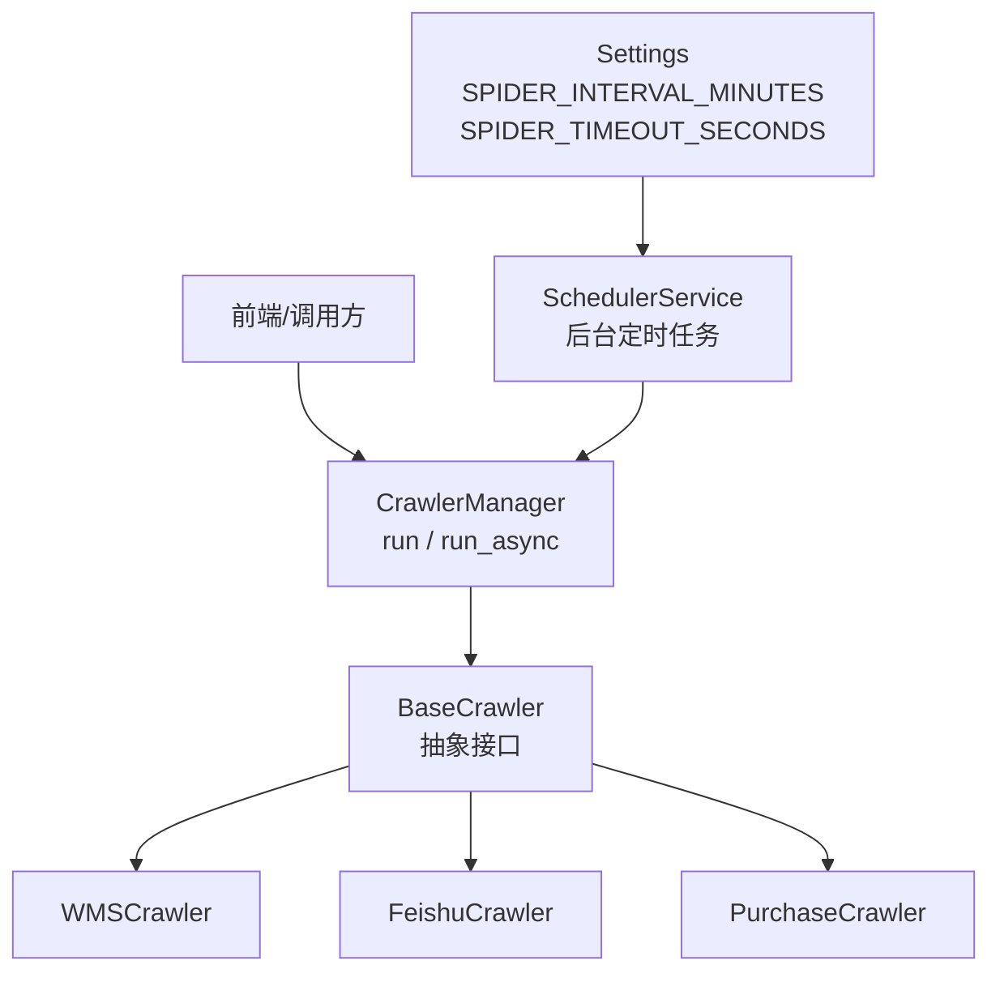
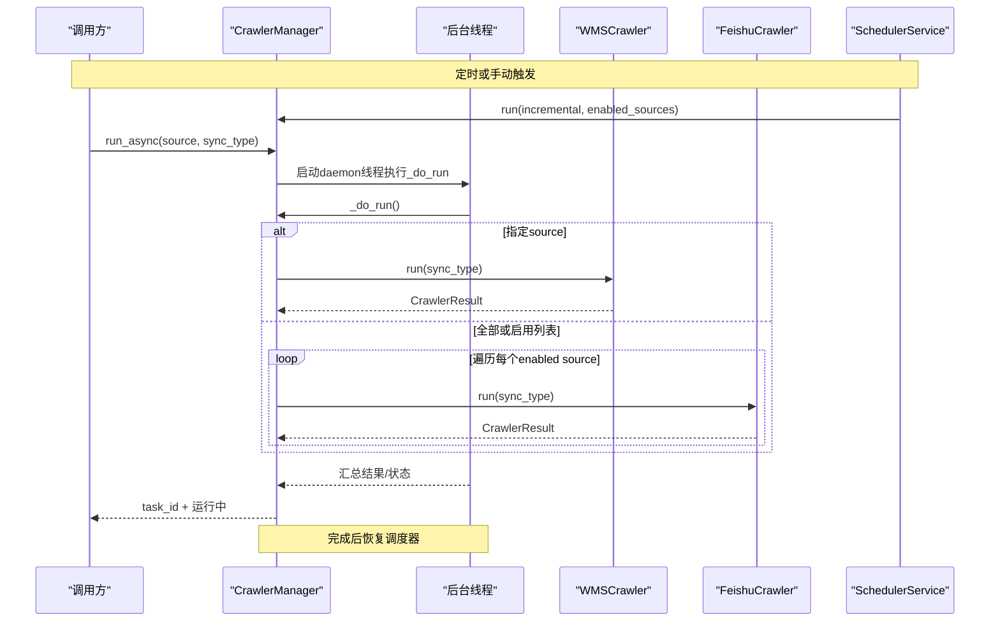
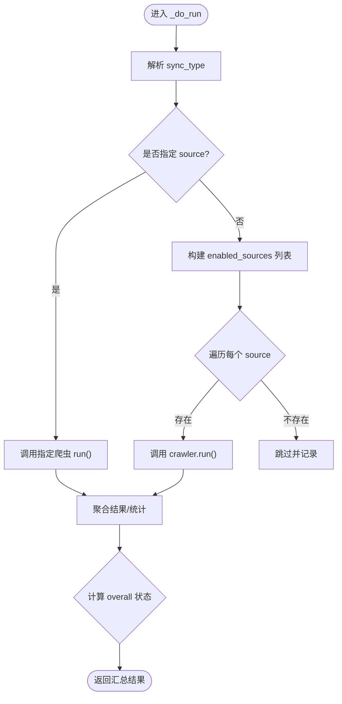
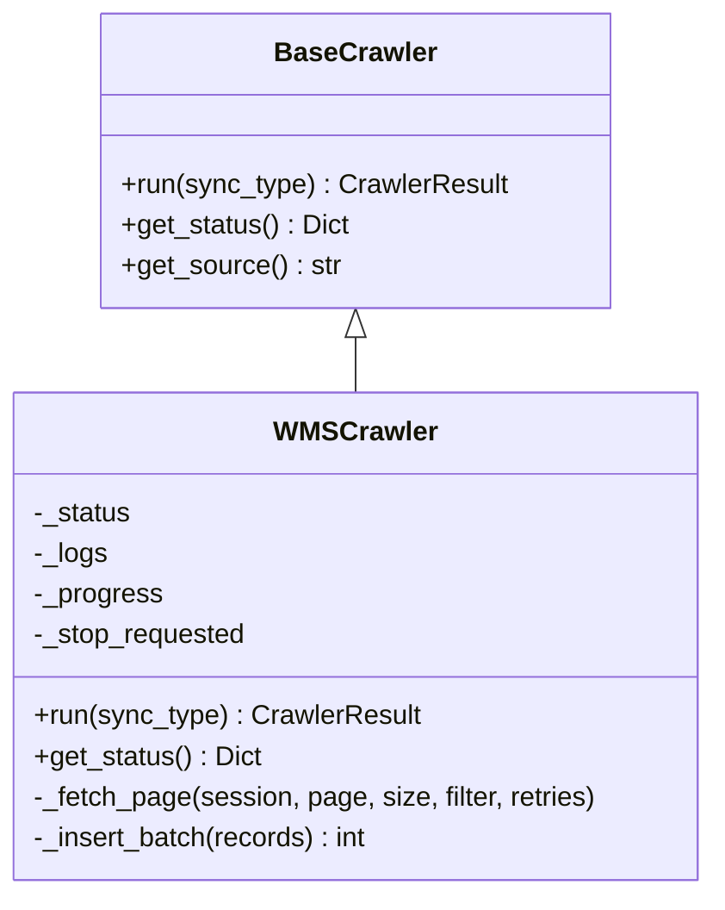
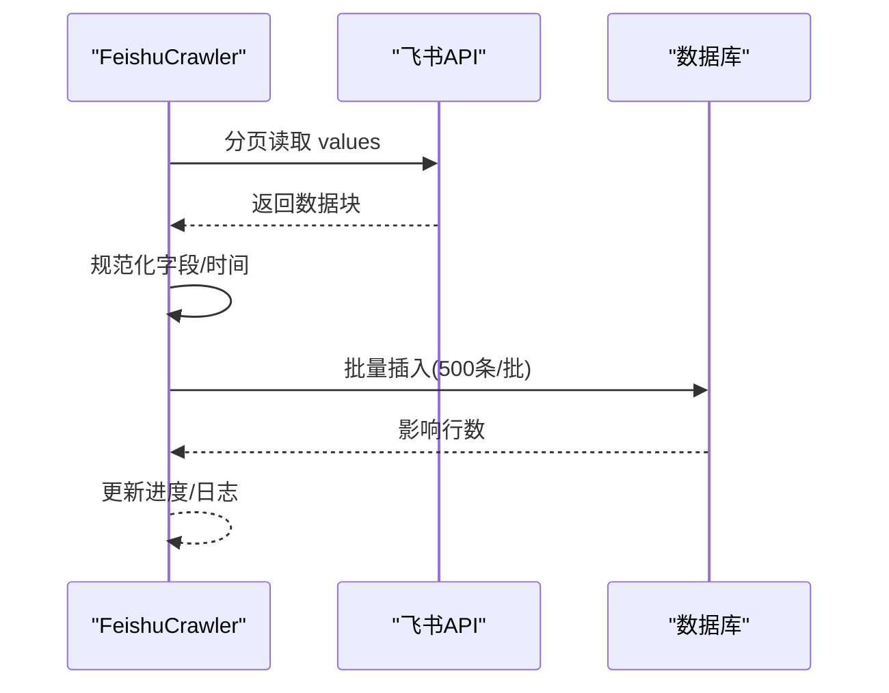
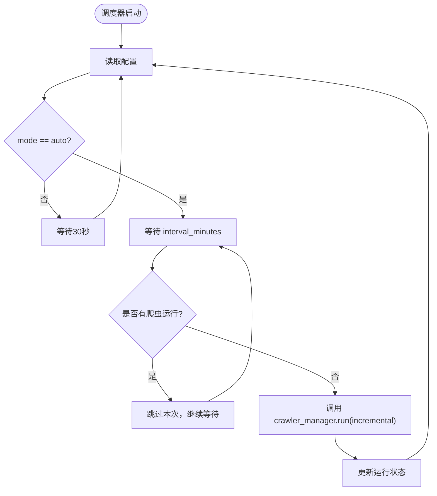
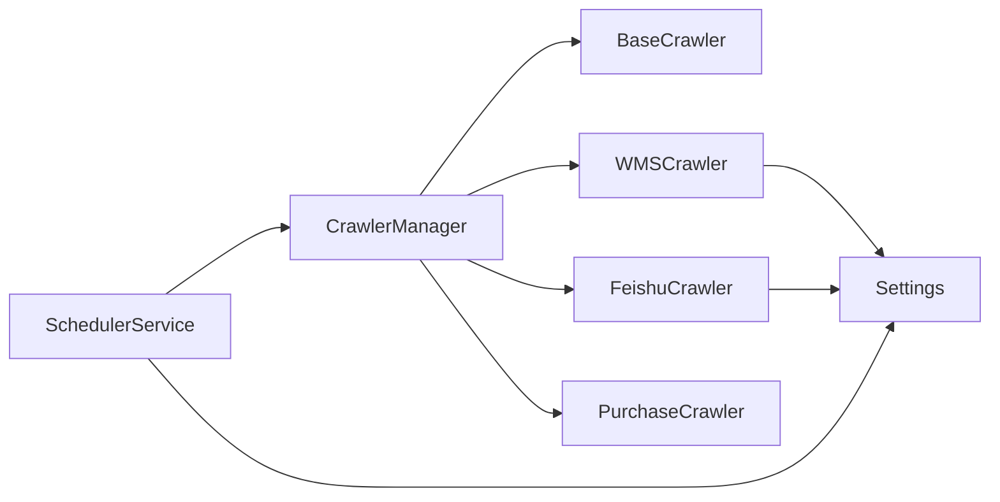

# 爬虫并发控制

<cite>
**本文引用的文件**
- [crawler_manager.py](file://backend/crawlers/crawler_manager.py)
- [base.py](file://backend/crawlers/base.py)
- [wms_crawler.py](file://backend/crawlers/wms_crawler.py)
- [feishu_crawler.py](file://backend/crawlers/feishu_crawler.py)
- [purchase_crawler.py](file://backend/crawlers/purchase_crawler.py)
- [scheduler.py](file://backend/scheduling/scheduler.py)
- [config.py](file://backend/config.py)
</cite>

## 目录
1. [简介](#简介)
2. [项目结构](#项目结构)
3. [核心组件](#核心组件)
4. [架构总览](#架构总览)
5. [详细组件分析](#详细组件分析)
6. [依赖关系分析](#依赖关系分析)
7. [性能与资源优化](#性能与资源优化)
8. [故障排查指南](#故障排查指南)
9. [结论](#结论)
10. [附录](#附录)

## 简介
本文件聚焦于爬虫系统的并发控制机制，围绕 CrawlerManager 的线程调度、任务队列管理、资源池控制、实例生命周期（创建/调度/销毁）、并发策略（最大并发、优先级、负载均衡）、状态监控与进度跟踪、失败重试与超时处理、异常恢复，以及异步执行模式与协程最佳实践进行系统化说明。目标是帮助读者在不深入代码细节的前提下，理解并掌握该系统的并发设计与调优方法。

## 项目结构
后端爬虫相关代码主要位于 backend/crawlers 与 backend/scheduling：
- crawlers：定义爬虫基类与各数据源实现（WMS、飞书、采购），并提供统一管理器 CrawlerManager。
- scheduling：提供定时调度器 SchedulerService，按配置周期自动触发增量同步。
- config：集中读取环境变量与系统参数，包含爬虫间隔、超时等关键配置项。

图表来源
- [crawler_manager.py:22-197](file://backend/crawlers/crawler_manager.py#L22-L197)
- [base.py:12-67](file://backend/crawlers/base.py#L12-L67)
- [scheduler.py:16-196](file://backend/scheduling/scheduler.py#L16-L196)
- [config.py:48-61](file://backend/config.py#L48-L61)

章节来源
- [crawler_manager.py:22-197](file://backend/crawlers/crawler_manager.py#L22-L197)
- [scheduler.py:16-196](file://backend/scheduling/scheduler.py#L16-L196)
- [config.py:48-61](file://backend/config.py#L48-L61)

## 核心组件
- BaseCrawler：定义所有爬虫的统一接口（run、get_status）与结果模型（CrawlerResult、CrawlerStatus）。
- CrawlerManager：统一管理多个爬虫实例，提供同步/异步执行入口、任务元信息记录、停止标志广播、状态查询。
- 具体爬虫实现：WMSCrawler、FeishuCrawler、PurchaseCrawler，各自实现数据获取、批处理入库、日志与进度更新。
- SchedulerService：后台线程周期性读取配置，避免与手动任务冲突，触发增量同步。

章节来源
- [base.py:12-67](file://backend/crawlers/base.py#L12-L67)
- [crawler_manager.py:22-197](file://backend/crawlers/crawler_manager.py#L22-L197)
- [wms_crawler.py:44-477](file://backend/crawlers/wms_crawler.py#L44-L477)
- [feishu_crawler.py:55-419](file://backend/crawlers/feishu_crawler.py#L55-L419)
- [purchase_crawler.py:12-49](file://backend/crawlers/purchase_crawler.py#L12-L49)
- [scheduler.py:16-196](file://backend/scheduling/scheduler.py#L16-L196)

## 架构总览
下图展示了从调度到执行的完整流程，包括异步任务线程、任务状态追踪、以及各爬虫内部的分页抓取与批量入库。

图表来源
- [scheduler.py:155-184](file://backend/scheduling/scheduler.py#L155-L184)
- [crawler_manager.py:134-197](file://backend/crawlers/crawler_manager.py#L134-L197)
- [crawler_manager.py:200-301](file://backend/crawlers/crawler_manager.py#L200-L301)
- [wms_crawler.py:313-467](file://backend/crawlers/wms_crawler.py#L313-L467)
- [feishu_crawler.py:251-409](file://backend/crawlers/feishu_crawler.py#L251-L409)

## 详细组件分析

### CrawlerManager 并发管理机制
- 多线程执行：run_async 使用 threading.Thread 以 daemon 方式启动后台线程执行 _do_run，立即返回 task_id，便于前端轮询状态。
- 任务队列管理：_tasks 字典维护任务元信息（task_id、source、sync_type、running、start_time、end_time、result、status），供 get_task 查询。
- 资源池控制：当前未引入显式线程池或信号量；通过串行遍历 enabled_sources 依次调用各爬虫 run，属于“顺序并发”（外部由调度器控制频率，内部爬虫自身可并发网络请求但数据库写入为批处理）。
- 实例生命周期：
  - 创建：__init__ 中注册 wms、feishu、purchase 三个爬虫实例。
  - 调度：_do_run 根据 source/enabled_sources 选择目标爬虫并调用 run。
  - 销毁：无显式销毁逻辑；爬虫实例为单例常驻内存，通过 stop_source/request_stop 设置停止标志优雅退出。
- 并发策略：
  - 最大并发数限制：当前未实现全局并发上限；可通过扩展 _do_run 增加 Semaphore/ThreadPoolExecutor 控制。
  - 任务优先级：未实现；可按业务需求在 enabled_sources 排序或引入优先级队列。
  - 负载均衡：未实现；可扩展为基于爬虫负载或错误率的动态调度。
- 停止与重启：request_stop/reset_stop_flag 设置全局停止标志，并在各爬虫循环中检查，支持优雅退出；run_async 结束后恢复调度器。

图表来源
- [crawler_manager.py:200-301](file://backend/crawlers/crawler_manager.py#L200-L301)

章节来源
- [crawler_manager.py:22-197](file://backend/crawlers/crawler_manager.py#L22-L197)
- [crawler_manager.py:200-301](file://backend/crawlers/crawler_manager.py#L200-L301)

### 爬虫实例：WMSCrawler
- 并发与重试：
  - 分页抓取采用 requests.Session 复用连接，降低握手开销。
  - 每页请求带指数退避重试（MAX_RETRIES=3），捕获 Timeout/ConnectionError 并等待后重试。
- 批处理入库：使用 INSERT IGNORE + executemany 批量插入，减少数据库往返。
- 进度与日志：维护 _progress（current_page、total_pages、inserted、processed）与 _logs（限长缓冲），供前端实时读取。
- 停止机制：循环中检查 _stop_requested，支持中途取消并返回 CANCELLED 状态。
- 时间处理：API 使用 UTC，数据库使用北京时间，提供转换函数确保增量条件正确。

图表来源
- [base.py:51-67](file://backend/crawlers/base.py#L51-L67)
- [wms_crawler.py:44-477](file://backend/crawlers/wms_crawler.py#L44-L477)

章节来源
- [wms_crawler.py:44-477](file://backend/crawlers/wms_crawler.py#L44-L477)

### 爬虫实例：FeishuCrawler
- 数据获取：通过飞书 v2 API 分页读取表格值，避免单次过大响应；内置重试与连续空行检测。
- 批处理入库：按 500 条分批提交，减少内存占用与数据库压力。
- 增量过滤：依据 RECIVE_TIME 过滤历史数据，提升效率。
- 停止机制：逐行处理时检查 _stop_requested，支持中途取消。
- 进度与日志：维护 _progress 与 _logs，便于前端展示。

图表来源
- [feishu_crawler.py:132-203](file://backend/crawlers/feishu_crawler.py#L132-L203)
- [feishu_crawler.py:222-249](file://backend/crawlers/feishu_crawler.py#L222-L249)
- [feishu_crawler.py:251-409](file://backend/crawlers/feishu_crawler.py#L251-L409)

章节来源
- [feishu_crawler.py:55-419](file://backend/crawlers/feishu_crawler.py#L55-L419)

### 爬虫实例：PurchaseCrawler
- 当前为占位实现，返回失败状态并提示 API 尚未接入。后续接入时可参照 WMS/Feishu 的实现模式，补充网络请求、重试、批处理与进度上报。

章节来源
- [purchase_crawler.py:12-49](file://backend/crawlers/purchase_crawler.py#L12-L49)

### 调度器：SchedulerService
- 后台线程：独立 daemon 线程循环读取配置，按间隔触发自动增量同步。
- 防冲突：若检测到有爬虫正在运行，则跳过本次自动执行，避免重复任务。
- 暂停/恢复：支持 pause/resume，用于手动触发任务期间暂停自动调度。
- 配置重载：收到配置变更通知后，下次循环重新读取。

图表来源
- [scheduler.py:93-153](file://backend/scheduling/scheduler.py#L93-L153)
- [scheduler.py:155-184](file://backend/scheduling/scheduler.py#L155-L184)

章节来源
- [scheduler.py:16-196](file://backend/scheduling/scheduler.py#L16-L196)

## 依赖关系分析
- CrawlerManager 依赖 BaseCrawler 接口与各具体爬虫实现，负责编排执行与状态汇总。
- 各爬虫依赖 database 模块进行批量读写，依赖 config 获取超时与间隔等参数。
- SchedulerService 依赖 crawler_manager 与 system.credentials 获取配置与执行状态。

图表来源
- [crawler_manager.py:22-197](file://backend/crawlers/crawler_manager.py#L22-L197)
- [scheduler.py:16-196](file://backend/scheduling/scheduler.py#L16-L196)
- [config.py:48-61](file://backend/config.py#L48-L61)

章节来源
- [crawler_manager.py:22-197](file://backend/crawlers/crawler_manager.py#L22-L197)
- [scheduler.py:16-196](file://backend/scheduling/scheduler.py#L16-L196)
- [config.py:48-61](file://backend/config.py#L48-L61)

## 性能与资源优化
- 网络层优化
  - 复用连接：WMS 使用 requests.Session，减少 TCP/TLS 握手成本。
  - 超时与重试：统一设置超时，结合指数退避重试，提高鲁棒性。
  - 分页拉取：WMS/Feishu 均按页拉取，避免大响应导致的内存峰值。
- 数据库层优化
  - 批量插入：使用 executemany + INSERT IGNORE，减少往返与锁竞争。
  - 去重策略：利用唯一键/IGNORE 避免重复写入。
- 并发控制建议（当前未实现）
  - 引入 ThreadPoolExecutor 或 asyncio.Semaphore 限制最大并发请求数，防止对上游 API 或数据库造成压力。
  - 针对不同数据源设置差异化并发上限（如 WMS 高吞吐、Feishu 低并发）。
- 资源使用优化
  - 日志缓冲限长：避免 _logs 无限增长导致内存泄漏。
  - 分批次处理：Feishu 按 500 条分批入库，降低内存占用。
  - 合理设置 SPIDER_INTERVAL_MINUTES 与 SPIDER_TIMEOUT_SECONDS，平衡时效性与资源消耗。

[本节为通用指导，不直接分析具体文件]

## 故障排查指南
- 常见问题定位
  - 凭证无效：WMS 登录失败会记录警告并返回 FAILED；请检查系统设置中的授权与 Cookie。
  - 接口异常：WMS/Feishu 在请求失败时会记录 warn/error，并尝试重试；多次失败后返回部分成功或失败。
  - 停止任务：通过 request_stop 或 stop_source 设置停止标志，爬虫会在下一次循环检查点退出。
- 监控与诊断
  - 使用 get_status 获取每个爬虫的状态、进度与最近日志快照。
  - 使用 get_task 查询异步任务的元信息与最终结果。
  - 查看调度器状态，确认是否处于运行/暂停状态及上次运行时间。
- 恢复策略
  - 自动重试：网络超时/连接错误会指数退避重试。
  - 增量同步：优先使用增量模式，减少重复数据量。
  - 调度恢复：异步任务完成后自动恢复调度器，避免手动触发后调度器永久暂停。

章节来源
- [wms_crawler.py:80-121](file://backend/crawlers/wms_crawler.py#L80-L121)
- [wms_crawler.py:180-213](file://backend/crawlers/wms_crawler.py#L180-L213)
- [feishu_crawler.py:132-203](file://backend/crawlers/feishu_crawler.py#L132-L203)
- [crawler_manager.py:39-88](file://backend/crawlers/crawler_manager.py#L39-L88)
- [scheduler.py:53-74](file://backend/scheduling/scheduler.py#L53-L74)

## 结论
当前系统通过 CrawlerManager 提供了统一的爬虫管理与异步执行能力，配合 SchedulerService 实现了后台定时增量同步。各爬虫实现具备重试、批处理、进度与日志上报等基础能力。为进一步提升并发性能与稳定性，建议在管理器层引入显式的并发控制（线程池/信号量）、任务优先级与负载均衡策略，并结合更细粒度的超时与熔断机制，以应对大规模数据源的高并发场景。

[本节为总结性内容，不直接分析具体文件]

## 附录

### 并发控制现状与改进建议
- 现状
  - 异步执行：run_async 使用后台线程执行 _do_run，非阻塞返回 task_id。
  - 串行遍历：_do_run 对 enabled_sources 逐个调用 run，未并行化。
  - 无全局并发上限：未使用线程池或信号量限制并发度。
- 改进建议
  - 引入 ThreadPoolExecutor 或 asyncio.Semaphore，按数据源类型配置并发上限。
  - 增加任务优先级队列，支持紧急数据源优先执行。
  - 增加熔断与降级：当某数据源持续失败时，暂时跳过并告警。
  - 增强监控：暴露 Prometheus 指标（并发数、成功率、延迟分布）。

[本节为概念性内容，不直接分析具体文件]

### 异步执行模式与协程最佳实践
- 当前模式
  - 基于 threading.Thread 的后台线程执行，适合 I/O 密集型爬虫。
- 协程建议
  - 将爬虫网络请求改为 async/await，使用 aiohttp 替代 requests，提升并发吞吐。
  - 使用 asyncio.Semaphore 控制并发度，避免对上游 API 造成压力。
  - 使用 asyncio.Queue 作为任务队列，解耦生产者与消费者。
  - 统一异常处理与重试：封装重试装饰器，支持指数退避与幂等性保障。

[本节为概念性内容，不直接分析具体文件]