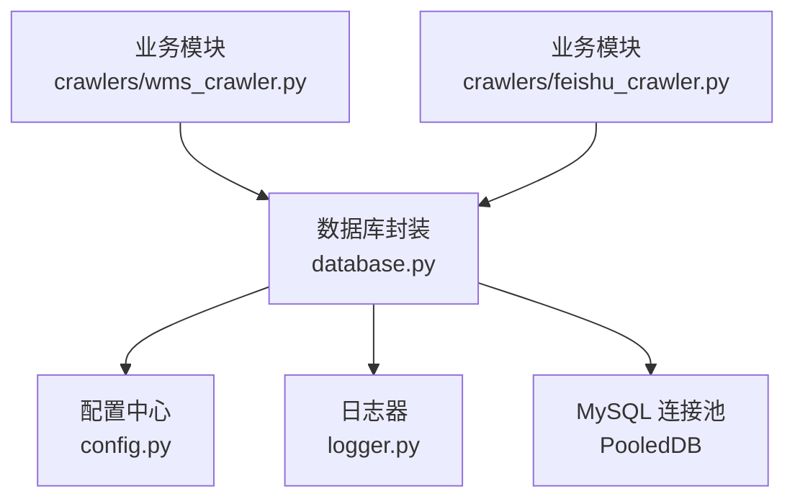
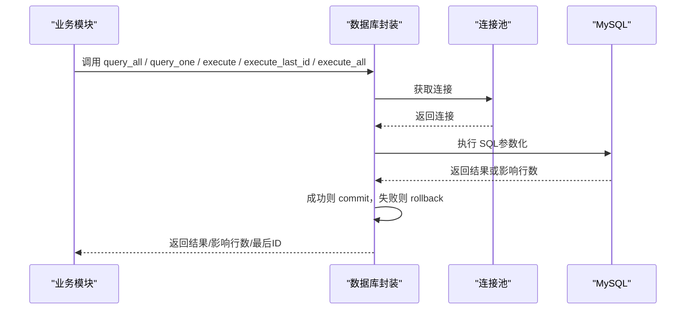
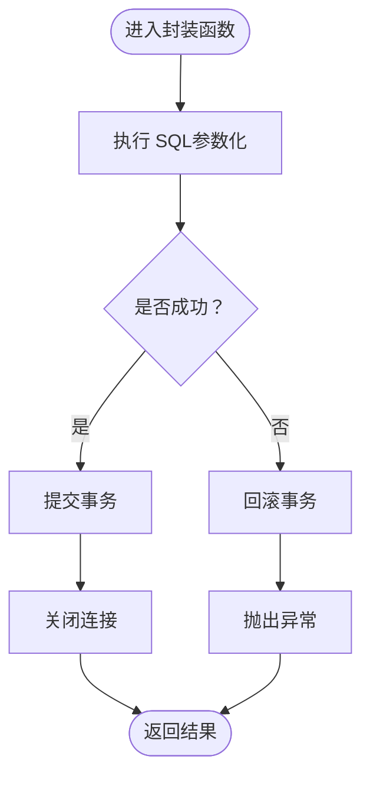
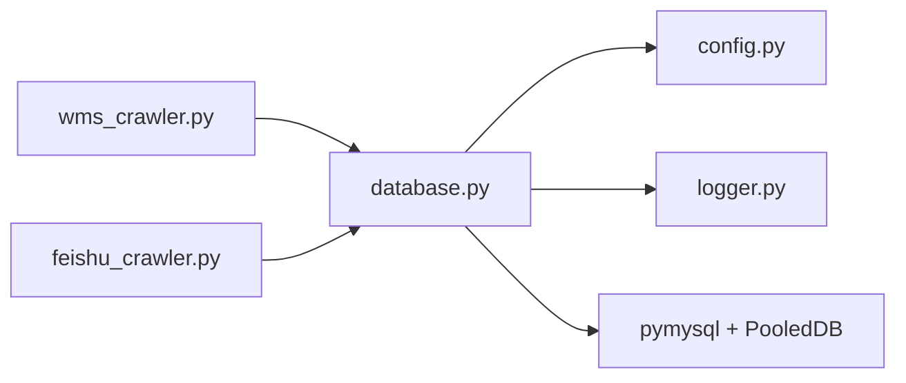

# 数据库操作封装

<cite>
**本文引用的文件**
- [backend/database.py](file://backend/database.py)
- [backend/config.py](file://backend/config.py)
- [backend/logger.py](file://backend/logger.py)
- [backend/core/exceptions.py](file://backend/core/exceptions.py)
- [backend/crawlers/wms_crawler.py](file://backend/crawlers/wms_crawler.py)
- [backend/crawlers/feishu_crawler.py](file://backend/crawlers/feishu_crawler.py)
</cite>

## 目录
1. [简介](#简介)
2. [项目结构](#项目结构)
3. [核心组件](#核心组件)
4. [架构总览](#架构总览)
5. [详细组件分析](#详细组件分析)
6. [依赖关系分析](#依赖关系分析)
7. [性能考量](#性能考量)
8. [故障排查指南](#故障排查指南)
9. [结论](#结论)
10. [附录：常用查询模式与最佳实践](#附录：常用查询模式与最佳实践)

## 简介
本文件面向后端数据库访问层，系统化说明 CRUD 操作的封装方法、事务管理机制、批量操作优化、SQL 注入防护、错误处理与日志记录的最佳实践。该封装基于连接池与参数化查询，提供统一的 query_all、query_one、execute、execute_last_id、execute_all 等接口，供爬虫与服务模块复用，确保一致性、可维护性与安全性。

## 项目结构
数据库相关代码集中在 backend/database.py，配合配置 backend/config.py 与日志 backend/logger.py；业务侧通过爬虫模块（wms_crawler、feishu_crawler）调用这些封装函数完成数据同步与入库。

图表来源
- [backend/database.py:12-48](file://backend/database.py#L12-L48)
- [backend/config.py:48-56](file://backend/config.py#L48-L56)
- [backend/logger.py:14-42](file://backend/logger.py#L14-L42)
- [backend/crawlers/wms_crawler.py:273-310](file://backend/crawlers/wms_crawler.py#L273-L310)
- [backend/crawlers/feishu_crawler.py:222-249](file://backend/crawlers/feishu_crawler.py#L222-L249)

章节来源
- [backend/database.py:12-48](file://backend/database.py#L12-L48)
- [backend/config.py:48-56](file://backend/config.py#L48-L56)
- [backend/logger.py:14-42](file://backend/logger.py#L14-L42)

## 核心组件
- 连接池管理：延迟初始化单例连接池，统一 host/port/user/password/database 等配置，使用 DictCursor 返回字典结果集。
- 读操作封装：query_all、query_one 负责查询所有与单条记录。
- 写操作封装：execute 执行 INSERT/UPDATE/DELETE；execute_last_id 在插入后返回自增 ID；execute_all 支持批量写入。
- 事务与回滚：每个封装函数内部以“最小单元”进行 commit/rollback，异常时自动回滚并抛出异常。
- 配置与日志：从 settings 读取数据库连接信息；失败时记录错误日志并提示配置检查。

章节来源
- [backend/database.py:12-48](file://backend/database.py#L12-L48)
- [backend/database.py:51-116](file://backend/database.py#L51-L116)
- [backend/config.py:48-56](file://backend/config.py#L48-L56)
- [backend/logger.py:14-42](file://backend/logger.py#L14-L42)

## 架构总览
数据库封装位于业务模块与底层驱动之间，屏蔽连接获取、游标管理、提交/回滚、异常处理等细节，向上提供简洁一致的 API。

图表来源
- [backend/database.py:51-116](file://backend/database.py#L51-L116)
- [backend/database.py:12-48](file://backend/database.py#L12-L48)

## 详细组件分析

### 连接池与配置
- 延迟初始化：首次使用时创建 PooledDB，避免启动阶段因配置错误导致服务崩溃。
- 连接参数：host/port/user/password/database 来自配置；字符集 utf8mb4；游标为 DictCursor。
- 失败处理：初始化失败记录错误日志，并给出 .env 配置检查提示。

章节来源
- [backend/database.py:12-48](file://backend/database.py#L12-L48)
- [backend/config.py:48-56](file://backend/config.py#L48-L56)
- [backend/logger.py:14-42](file://backend/logger.py#L14-L42)

### 读操作：query_all、query_one
- 功能：分别返回多行与单行结果，均使用参数化查询。
- 资源管理：with 语句管理游标；finally 中关闭连接，防止泄漏。
- 返回值：字典列表或单条字典，便于上层直接按字段名访问。

章节来源
- [backend/database.py:51-70](file://backend/database.py#L51-L70)

### 写操作：execute、execute_last_id
- execute：执行写 SQL，成功后提交；异常时回滚并抛出异常。
- execute_last_id：执行插入后返回 lastrowid，用于关联主键回填。
- 事务边界：每个函数独立提交/回滚，适合短事务场景。

章节来源
- [backend/database.py:73-101](file://backend/database.py#L73-L101)

### 批量写：execute_all
- 功能：使用 executemany 批量写入，提升吞吐。
- 事务边界：一次批量提交；异常时整体回滚，保证原子性。
- 典型用法：爬虫将多页数据组装为元组列表后批量插入。

章节来源
- [backend/database.py:104-116](file://backend/database.py#L104-L116)
- [backend/crawlers/wms_crawler.py:273-310](file://backend/crawlers/wms_crawler.py#L273-L310)
- [backend/crawlers/feishu_crawler.py:222-249](file://backend/crawlers/feishu_crawler.py#L222-L249)

### 事务管理机制
- 自动提交：每个封装函数在执行成功后显式 commit。
- 回滚策略：任何异常触发 rollback，确保数据一致性。
- 异常处理：异常被重新抛出，由上层捕获并记录日志或转换为业务异常。

图表来源
- [backend/database.py:73-116](file://backend/database.py#L73-L116)

### 安全：SQL 注入防护
- 参数化查询：所有封装函数均以 params 传入参数，避免字符串拼接 SQL。
- 输入校验：建议在上层对关键参数进行类型与范围校验（如数字、日期格式）。
- 白名单列名：动态拼接列名时应使用白名单校验，避免用户可控的列名参与拼接。

章节来源
- [backend/database.py:51-116](file://backend/database.py#L51-L116)

### 错误处理与日志记录
- 连接池初始化失败：记录错误日志并提示检查 .env 配置。
- 写操作异常：自动回滚并抛出异常，上层可捕获后记录业务日志。
- 日志输出：统一使用 logger，包含时间、级别、模块名与消息。

章节来源
- [backend/database.py:34-42](file://backend/database.py#L34-L42)
- [backend/logger.py:14-42](file://backend/logger.py#L14-L42)
- [backend/core/exceptions.py:2-8](file://backend/core/exceptions.py#L2-L8)

## 依赖关系分析
- database.py 依赖 config.py 获取数据库连接参数，依赖 logger.py 记录日志。
- 爬虫模块依赖 database.py 提供的 CRUD 接口进行数据同步与入库。
- 连接池使用 pymysql 与 dbutils.pooled_db 实现。

图表来源
- [backend/crawlers/wms_crawler.py:273-310](file://backend/crawlers/wms_crawler.py#L273-L310)
- [backend/crawlers/feishu_crawler.py:222-249](file://backend/crawlers/feishu_crawler.py#L222-L249)
- [backend/database.py:12-48](file://backend/database.py#L12-L48)
- [backend/config.py:48-56](file://backend/config.py#L48-L56)
- [backend/logger.py:14-42](file://backend/logger.py#L14-L42)

章节来源
- [backend/database.py:12-48](file://backend/database.py#L12-L48)
- [backend/crawlers/wms_crawler.py:273-310](file://backend/crawlers/wms_crawler.py#L273-L310)
- [backend/crawlers/feishu_crawler.py:222-249](file://backend/crawlers/feishu_crawler.py#L222-L249)

## 性能考量
- 连接池：默认最大连接数 10，可根据并发与数据库负载调整。
- 批量大小：execute_all 使用 executemany，建议分批提交，常见批大小为 500~1000，结合网络与内存权衡。
- 去重策略：使用 INSERT IGNORE 减少重复插入开销（爬虫示例）。
- 增量同步：先查询已有数据或最新时间戳，仅拉取新增数据，降低带宽与写入压力。
- 游标类型：DictCursor 便于按字段访问，但略高于普通元组游标的开销；若追求极致性能可评估切换。

章节来源
- [backend/database.py:20-33](file://backend/database.py#L20-L33)
- [backend/crawlers/wms_crawler.py:273-310](file://backend/crawlers/wms_crawler.py#L273-L310)
- [backend/crawlers/feishu_crawler.py:222-249](file://backend/crawlers/feishu_crawler.py#L222-L249)

## 故障排查指南
- 连接池初始化失败：检查 .env 中的 DB_HOST、DB_PORT、DB_USER、DB_PASSWORD、DB_DATABASE 是否正确；确认数据库可达。
- 写操作异常：查看日志定位具体 SQL 与参数；确认约束冲突、字段长度、数据类型等问题。
- 批量插入失败：检查批次大小与数据格式；必要时减小批次或过滤非法值。
- 性能问题：监控连接池使用率、慢查询；调整批大小与连接池上限。

章节来源
- [backend/database.py:34-42](file://backend/database.py#L34-L42)
- [backend/logger.py:14-42](file://backend/logger.py#L14-L42)

## 结论
本封装以连接池为基础，提供统一、安全、易用的数据库 CRUD 接口，内置事务提交/回滚与异常处理，并通过参数化查询防范 SQL 注入。配合爬虫模块的批量写入与增量同步策略，可在高吞吐场景下保持稳定的数据入库能力。建议在生产环境根据负载调优连接池与批大小，并在上层加强输入校验与日志记录。

## 附录：常用查询模式与最佳实践

- 查询所有记录
  - 使用场景：分页列表、统计汇总、导出前全量读取。
  - 参数：sql（含 %s 占位符），params（元组或列表）。
  - 注意：大数据量建议使用 LIMIT/OFFSET 或游标流式读取。

- 查询单条记录
  - 使用场景：按主键或唯一索引获取实体。
  - 参数：同上。
  - 注意：无结果时返回 None，需在上层判空。

- 执行写操作
  - 使用场景：INSERT/UPDATE/DELETE。
  - 参数：同上。
  - 注意：异常自动回滚；返回影响行数。

- 插入并返回自增ID
  - 使用场景：需要立即获取新记录主键的场景。
  - 参数：同上。
  - 注意：仅在插入语句有效。

- 批量写入
  - 使用场景：大量数据导入、爬虫入库。
  - 参数：sql（含 %s 占位符），params_list（元组列表）。
  - 注意：合理设置批次大小；结合 INSERT IGNORE 或唯一索引去重。

- 事务边界
  - 当前封装以“单次调用”为单位提交/回滚；如需跨多次调用的长事务，应在上层自行管理连接与事务。

- SQL 注入防护
  - 始终使用参数化查询；禁止拼接用户输入到 SQL。
  - 动态列名/表名必须经白名单校验。

- 错误处理与日志
  - 捕获异常并记录上下文（SQL、参数、耗时）。
  - 区分系统异常与业务异常，必要时抛出自定义异常。

章节来源
- [backend/database.py:51-116](file://backend/database.py#L51-L116)
- [backend/crawlers/wms_crawler.py:273-310](file://backend/crawlers/wms_crawler.py#L273-L310)
- [backend/crawlers/feishu_crawler.py:222-249](file://backend/crawlers/feishu_crawler.py#L222-L249)
- [backend/logger.py:14-42](file://backend/logger.py#L14-L42)
- [backend/core/exceptions.py:2-8](file://backend/core/exceptions.py#L2-L8)