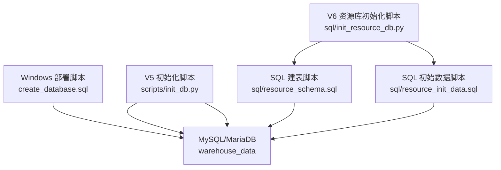
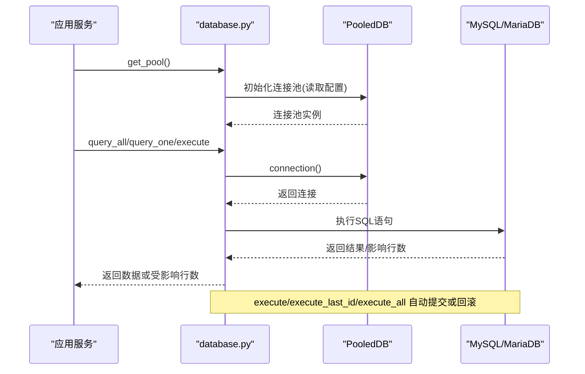
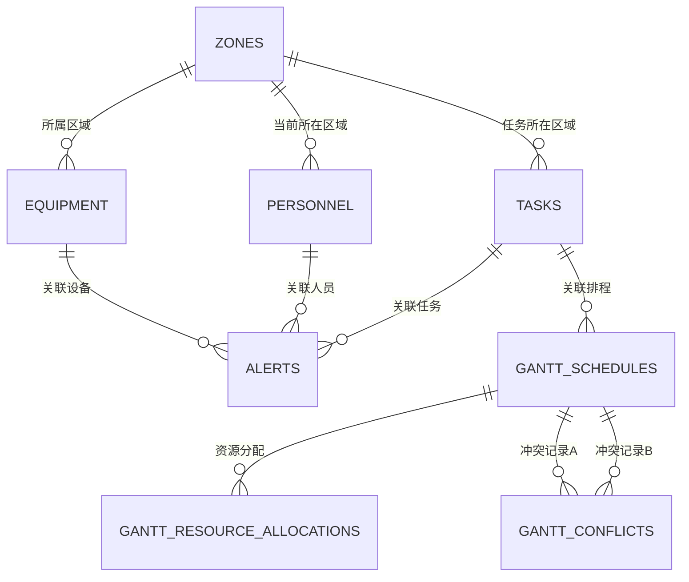
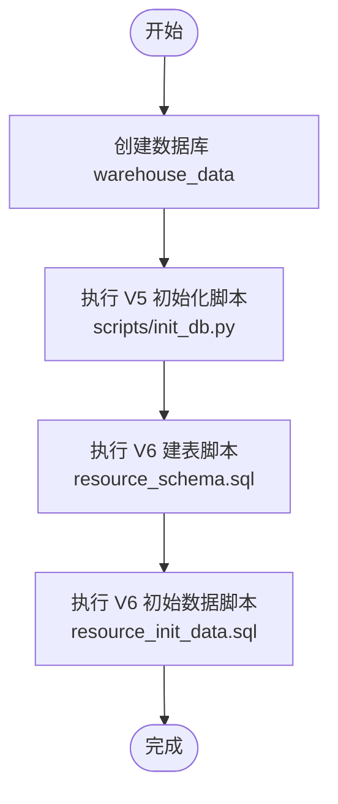
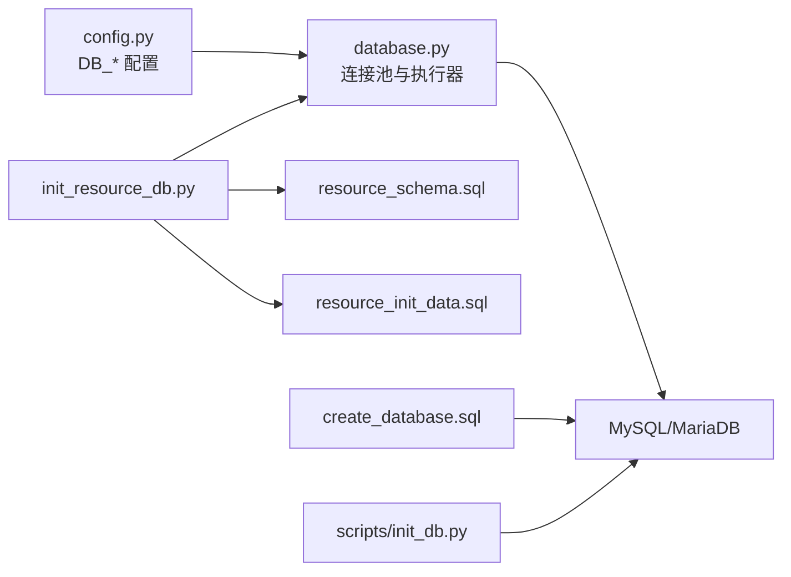

# 数据库架构管理

<cite>
**本文引用的文件**
- [backend/database.py](file://backend/database.py)
- [backend/config.py](file://backend/config.py)
- [backend/sql/resource_schema.sql](file://backend/sql/resource_schema.sql)
- [backend/sql/init_resource_db.py](file://backend/sql/init_resource_db.py)
- [backend/sql/resource_init_data.sql](file://backend/sql/resource_init_data.sql)
- [backend/scripts/init_db.py](file://backend/scripts/init_db.py)
- [windows_setup/sql/create_database.sql](file://windows_setup/sql/create_database.sql)
</cite>

## 目录
1. [简介](#简介)
2. [项目结构](#项目结构)
3. [核心组件](#核心组件)
4. [架构总览](#架构总览)
5. [详细组件分析](#详细组件分析)
6. [依赖关系分析](#依赖关系分析)
7. [性能考虑](#性能考虑)
8. [故障排查指南](#故障排查指南)
9. [结论](#结论)
10. [附录](#附录)

## 简介
本文件面向“试制资源数智化管理系统”的数据库架构管理，覆盖表结构设计、初始化流程、版本与迁移策略、数据完整性约束、性能优化建议以及备份恢复策略。文档基于仓库中的 SQL 脚本、Python 初始化脚本与数据库连接配置进行梳理，帮助读者快速理解并安全地维护数据库。

## 项目结构
本项目包含两套数据库初始化路径：
- V5 业务库初始化：通过 Python 脚本在运行时创建表结构与默认参数，适用于 PBOM/交付/凭证等模块。
- V6 资源库初始化：通过 SQL 脚本集中定义资源域（设备、区域、人员、任务、预警、甘特排程等）的表结构与初始数据，并通过独立脚本执行。

图表来源
- [windows_setup/sql/create_database.sql:1-36](file://windows_setup/sql/create_database.sql#L1-L36)
- [backend/scripts/init_db.py:17-293](file://backend/scripts/init_db.py#L17-L293)
- [backend/sql/init_resource_db.py:21-68](file://backend/sql/init_resource_db.py#L21-L68)
- [backend/sql/resource_schema.sql:1-326](file://backend/sql/resource_schema.sql#L1-L326)
- [backend/sql/resource_init_data.sql:1-127](file://backend/sql/resource_init_data.sql#L1-L127)

章节来源
- [windows_setup/sql/create_database.sql:1-36](file://windows_setup/sql/create_database.sql#L1-L36)
- [backend/scripts/init_db.py:17-293](file://backend/scripts/init_db.py#L17-L293)
- [backend/sql/init_resource_db.py:21-68](file://backend/sql/init_resource_db.py#L21-L68)
- [backend/sql/resource_schema.sql:1-326](file://backend/sql/resource_schema.sql#L1-L326)
- [backend/sql/resource_init_data.sql:1-127](file://backend/sql/resource_init_data.sql#L1-L127)

## 核心组件
- 数据库连接与连接池：提供单例连接池、查询与写操作封装，支持事务回滚与错误日志。
- 配置加载：从 .env 读取数据库主机、端口、用户、密码、库名等。
- V5 初始化：以 Python 脚本方式创建业务表、外键、索引与默认系统参数。
- V6 资源库初始化：以 SQL 脚本方式集中定义资源域表结构、索引与初始数据，并由 Python 脚本顺序执行。

章节来源
- [backend/database.py:12-116](file://backend/database.py#L12-L116)
- [backend/config.py:48-57](file://backend/config.py#L48-L57)
- [backend/scripts/init_db.py:17-293](file://backend/scripts/init_db.py#L17-L293)
- [backend/sql/init_resource_db.py:21-68](file://backend/sql/init_resource_db.py#L21-L68)

## 架构总览
下图展示了应用启动到数据库访问的关键路径，包括连接池获取、SQL 执行与事务处理。

图表来源
- [backend/database.py:12-116](file://backend/database.py#L12-L116)
- [backend/config.py:48-57](file://backend/config.py#L48-L57)

## 详细组件分析

### 实体关系图（ERD）
资源域核心实体及关系如下：
- zones（区域）1:N equipment（设备）
- tasks（任务）N:1 zones（任务所在区域）
- personnel（人员）N:1 zones（人员当前所在区域）
- alerts（预警）可关联 task/equipment/personnel 等（通过冗余字段与类型标识）
- gantt_schedules（甘特排程）N:1 tasks（可选关联）
- gantt_resource_allocations（资源分配）N:1 gantt_schedules
- gantt_conflicts（冲突记录）N:1 gantt_schedules（A/B两端）

图表来源
- [backend/sql/resource_schema.sql:13-326](file://backend/sql/resource_schema.sql#L13-L326)

章节来源
- [backend/sql/resource_schema.sql:13-326](file://backend/sql/resource_schema.sql#L13-L326)

### 表结构与字段定义要点
- 字符集与引擎：统一使用 utf8mb4 / utf8mb4_unicode_ci，InnoDB 引擎。
- 主键：所有表均使用自增 INT 主键 id。
- 唯一性：关键字段设置 UNIQUE，如 equipment_code、zone_code、personnel_code、task_code、alert_code、schedule_code、allocation_code、conflict_code。
- 枚举与默认值：广泛使用 ENUM 表达状态与类型，并提供合理默认值，便于前端展示与后端校验。
- 时间戳：created_at/updated_at 配合 ON UPDATE CURRENT_TIMESTAMP 实现自动更新；部分业务时间字段使用 DATETIME/DATE。
- 索引：为高频过滤与排序字段建立索引，如 status、type、priority、zone_code、equipment_code、raised_at、plan_start_time、plan_end_time 等。
- 冗余字段：在 alerts/gantt_schedules/gantt_resource_allocations/gantt_conflicts 中保留必要冗余（如名称、编码），提升查询与展示效率。

章节来源
- [backend/sql/resource_schema.sql:13-326](file://backend/sql/resource_schema.sql#L13-L326)

### 数据完整性约束
- 主键约束：所有表的主键均为自增整数，确保行级唯一性与稳定性。
- 唯一性约束：关键业务编号（设备、区域、人员、任务、预警、排程、分配、冲突）均设 UNIQUE，避免重复录入。
- 外键约束：
  - V5 业务表存在显式外键（如 project_parts.project_id -> projects.id）。
  - V6 资源域表未声明物理外键，采用逻辑关联与冗余字段设计，便于跨库/分库扩展与高并发写入。
- 检查约束：通过 ENUM 限制取值范围，达到类似 CHECK 的效果。
- 非空约束：关键字段 NOT NULL，保证数据质量。

章节来源
- [backend/scripts/init_db.py:21-232](file://backend/scripts/init_db.py#L21-L232)
- [backend/sql/resource_schema.sql:13-326](file://backend/sql/resource_schema.sql#L13-L326)

### 数据库初始化流程
- Windows 环境建库：
  - 执行 create_database.sql 创建数据库 warehouse_data，并可选创建专用用户 spider_v5 授权。
- V5 业务库初始化：
  - 运行 backend/scripts/init_db.py，按顺序创建 projects、project_parts、configs、part_configs、qr_arrival_records、critical_scores、spider_credentials、delivery_records、feishu_detail、system_params 等表，并插入默认系统参数。
- V6 资源库初始化：
  - 运行 backend/sql/init_resource_db.py，依次执行 resource_schema.sql（建表+索引）与 resource_init_data.sql（基础区域、设备、人员、任务、预警、维护记录等初始数据）。

图表来源
- [windows_setup/sql/create_database.sql:1-36](file://windows_setup/sql/create_database.sql#L1-L36)
- [backend/scripts/init_db.py:17-293](file://backend/scripts/init_db.py#L17-L293)
- [backend/sql/init_resource_db.py:21-68](file://backend/sql/init_resource_db.py#L21-L68)
- [backend/sql/resource_schema.sql:1-326](file://backend/sql/resource_schema.sql#L1-L326)
- [backend/sql/resource_init_data.sql:1-127](file://backend/sql/resource_init_data.sql#L1-L127)

章节来源
- [windows_setup/sql/create_database.sql:1-36](file://windows_setup/sql/create_database.sql#L1-L36)
- [backend/scripts/init_db.py:17-293](file://backend/scripts/init_db.py#L17-L293)
- [backend/sql/init_resource_db.py:21-68](file://backend/sql/init_resource_db.py#L21-L68)
- [backend/sql/resource_schema.sql:1-326](file://backend/sql/resource_schema.sql#L1-L326)
- [backend/sql/resource_init_data.sql:1-127](file://backend/sql/resource_init_data.sql#L1-L127)

### 版本管理与迁移策略
- 现状：
  - V5：通过 Python 脚本内联 DDL 与 ALTER TABLE 增量扩展列，具备幂等性（IF NOT EXISTS、IGNORE INSERT、异常捕获后继续）。
  - V6：通过 SQL 脚本集中管理表结构，初始化脚本顺序执行 schema 与 data。
- 建议的迁移规范（落地步骤）：
  - 引入版本号表 migration_versions（version PK, applied_at, description），每次迁移前检查是否已应用。
  - 将变更拆分为正向迁移（add_column/add_index/alter_table）与反向迁移（drop_column/drop_index/rollback_ddl）脚本，命名含版本号。
  - 迁移脚本需幂等：使用 IF NOT EXISTS、DROP INDEX IF EXISTS、ALTER IGNORE 等策略，避免重复执行失败。
  - 大表变更采用在线 DDL（如 pt-online-schema-change）或在低峰期执行，减少锁表时间。
  - 对涉及数据的迁移，先写只读验证脚本，再执行写变更，最后清理临时对象。
- 回滚机制：
  - 每个正向迁移配套反向脚本，记录变更前后状态。
  - 批量执行时开启事务（DDL 在 MySQL 中不可事务化，需分段控制与快照回滚）。
  - 发布前在预发环境演练回滚，确认数据一致性与可用性。

章节来源
- [backend/scripts/init_db.py:234-293](file://backend/scripts/init_db.py#L234-L293)
- [backend/sql/init_resource_db.py:21-68](file://backend/sql/init_resource_db.py#L21-L68)

### 数据完整性约束（补充说明）
- 主键：自增 INT，稳定且高效。
- 唯一性：业务编号字段 UNIQUE，防止重复。
- 外键：V5 使用物理外键；V6 资源域采用逻辑外键（冗余字段 + 索引），利于扩展与解耦。
- 检查约束：通过 ENUM 限制取值，结合应用层校验。
- 非空：关键字段 NOT NULL，保障数据质量。

章节来源
- [backend/scripts/init_db.py:21-232](file://backend/scripts/init_db.py#L21-L232)
- [backend/sql/resource_schema.sql:13-326](file://backend/sql/resource_schema.sql#L13-L326)

### 性能优化建议
- 索引设计：
  - 为高频过滤字段建立索引（status、type、priority、zone_code、equipment_code、raised_at、plan_start_time、plan_end_time）。
  - 复合索引用于常见查询组合（如 schedule_id + task_code、resource_type + resource_code）。
  - 定期使用 EXPLAIN 分析慢查询，调整索引与查询计划。
- 查询优化：
  - 避免 SELECT *，仅选择必要字段。
  - 分页查询使用 LIMIT/OFFSET 或游标分页。
  - 合理使用 JOIN 与子查询，必要时用冗余字段减少 JOIN。
- 存储引擎与字符集：
  - 统一 InnoDB，utf8mb4，确保多语言与表情符号支持。
- 连接池与事务：
  - 使用 PooledDB 连接池，合理设置 maxconnections/mincached/maxcached。
  - 写操作使用事务，异常时回滚，避免脏数据。
- 批处理与批量写入：
  - 使用 executemany 批量插入，降低网络往返开销。
- 监控与审计：
  - 启用慢查询日志，定期分析。
  - 对关键表增加 updated_at 与审计字段，便于追踪变更。

章节来源
- [backend/database.py:12-116](file://backend/database.py#L12-L116)
- [backend/sql/resource_schema.sql:13-326](file://backend/sql/resource_schema.sql#L13-L326)

### 备份与恢复策略
- 备份策略（建议）：
  - 全量备份：每日凌晨使用 mysqldump 导出 warehouse_data，压缩并异地存储。
  - 增量备份：开启 binlog，按时间点恢复；或使用 Percona XtraBackup 进行热备。
  - 备份校验：定期恢复演练，验证备份可用性与一致性。
- 恢复策略（建议）：
  - 误删恢复：基于最近全量备份 + binlog 恢复到指定时间点。
  - 表级恢复：针对单表损坏，单独导入该表备份。
  - 灾难恢复：制定 RTO/RPO 目标，准备自动化恢复脚本与预案。
- 注意事项：
  - 备份期间尽量降低写入负载，或使用只读副本备份。
  - 备份文件加密传输与存储，权限最小化。
  - 记录备份元数据（时间、大小、校验和），便于检索与审计。

[本节为通用实践建议，不直接引用具体代码文件]

## 依赖关系分析
- 配置依赖：database.py 通过 config.py 读取 DB_HOST/DB_PORT/DB_USER/DB_PASSWORD/DB_DATABASE。
- 初始化依赖：init_resource_db.py 依赖 database.py 提供的连接能力，顺序执行 SQL 脚本。
- 部署依赖：Windows 一键部署脚本调用 create_database.sql 创建库，再执行 init_db.py 初始化业务表。

图表来源
- [backend/config.py:48-57](file://backend/config.py#L48-L57)
- [backend/database.py:12-116](file://backend/database.py#L12-L116)
- [backend/sql/init_resource_db.py:21-68](file://backend/sql/init_resource_db.py#L21-L68)
- [backend/sql/resource_schema.sql:1-326](file://backend/sql/resource_schema.sql#L1-L326)
- [backend/sql/resource_init_data.sql:1-127](file://backend/sql/resource_init_data.sql#L1-L127)
- [windows_setup/sql/create_database.sql:1-36](file://windows_setup/sql/create_database.sql#L1-L36)
- [backend/scripts/init_db.py:17-293](file://backend/scripts/init_db.py#L17-L293)

章节来源
- [backend/config.py:48-57](file://backend/config.py#L48-L57)
- [backend/database.py:12-116](file://backend/database.py#L12-L116)
- [backend/sql/init_resource_db.py:21-68](file://backend/sql/init_resource_db.py#L21-L68)
- [backend/sql/resource_schema.sql:1-326](file://backend/sql/resource_schema.sql#L1-L326)
- [backend/sql/resource_init_data.sql:1-127](file://backend/sql/resource_init_data.sql#L1-L127)
- [windows_setup/sql/create_database.sql:1-36](file://windows_setup/sql/create_database.sql#L1-L36)
- [backend/scripts/init_db.py:17-293](file://backend/scripts/init_db.py#L17-L293)

## 性能考虑
- 连接池调优：根据并发量调整 maxconnections，避免过多连接导致上下文切换开销。
- 索引维护：定期分析索引使用情况，删除无用索引，合并复合索引。
- 查询优化：避免 N+1 查询，使用批量接口与缓存热点数据。
- 存储选型：InnoDB 适合事务型业务；若读多写少，可考虑读写分离与只读副本。
- 监控告警：对慢查询、连接数、锁等待、磁盘空间设置阈值告警。

[本节为通用实践建议，不直接引用具体代码文件]

## 故障排查指南
- 连接失败：
  - 检查 .env 中 DB_HOST/DB_PORT/DB_USER/DB_PASSWORD/DB_DATABASE 是否正确。
  - 确认 MySQL 服务运行且端口可达。
  - 查看 database.py 的错误日志提示。
- 初始化失败：
  - 检查 SQL 语法与权限，确认数据库存在且字符集正确。
  - 对于 init_resource_db.py，确认 resource_schema.sql 与 resource_init_data.sql 路径正确。
  - 对于 scripts/init_db.py，确认依赖库安装与环境变量配置。
- 数据不一致：
  - 核对唯一性约束与业务编号生成规则。
  - 检查是否有并发写入导致的数据竞争，必要时加锁或串行化。
- 性能问题：
  - 使用 EXPLAIN 分析慢查询，补充或调整索引。
  - 检查连接池配置与事务边界，避免长事务。

章节来源
- [backend/database.py:12-43](file://backend/database.py#L12-L43)
- [backend/sql/init_resource_db.py:21-68](file://backend/sql/init_resource_db.py#L21-L68)
- [backend/scripts/init_db.py:17-293](file://backend/scripts/init_db.py#L17-L293)

## 结论
本项目提供了清晰的数据库架构与初始化方案：V5 通过 Python 脚本灵活管理业务表与参数，V6 通过 SQL 脚本集中管理资源域表结构与初始数据。连接池与事务封装提升了稳定性与可维护性。建议在后续演进中引入统一的迁移框架与版本管理，完善备份恢复策略，持续优化索引与查询，确保系统在规模增长下的性能与可靠性。

## 附录
- 常用命令参考（示例）：
  - 创建数据库：执行 windows_setup/sql/create_database.sql
  - 初始化 V5 表：python backend/scripts/init_db.py
  - 初始化 V6 资源库：python backend/sql/init_resource_db.py
- 环境变量示例（backend/.env）：
  - DB_HOST、DB_PORT、DB_USER、DB_PASSWORD、DB_DATABASE
  - SERVER_HOST、SERVER_PORT、DEBUG、CORS_ORIGINS
  - SPIDER_INTERVAL_MINUTES、SPIDER_TIMEOUT_SECONDS
  - FEISHU_APP_ID、FEISHU_APP_SECRET、FEISHU_SHEET_URL
  - DEEPSEEK_API_KEY、DEEPSEEK_BASE_URL、DEEPSEEK_MODEL

章节来源
- [backend/config.py:48-98](file://backend/config.py#L48-L98)
- [windows_setup/sql/create_database.sql:1-36](file://windows_setup/sql/create_database.sql#L1-L36)
- [backend/scripts/init_db.py:17-293](file://backend/scripts/init_db.py#L17-L293)
- [backend/sql/init_resource_db.py:21-68](file://backend/sql/init_resource_db.py#L21-L68)