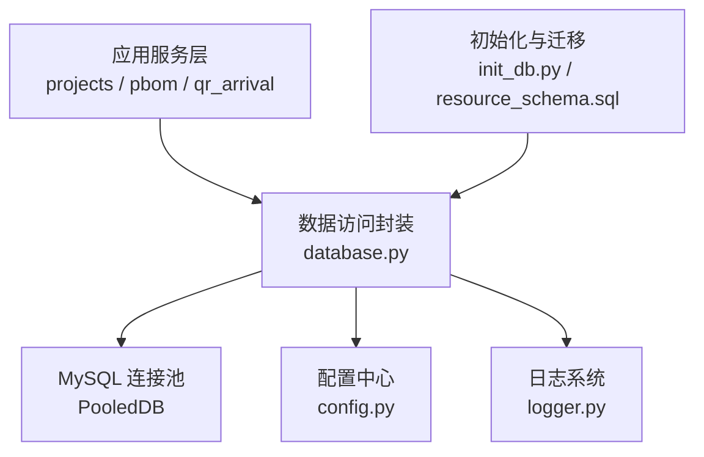
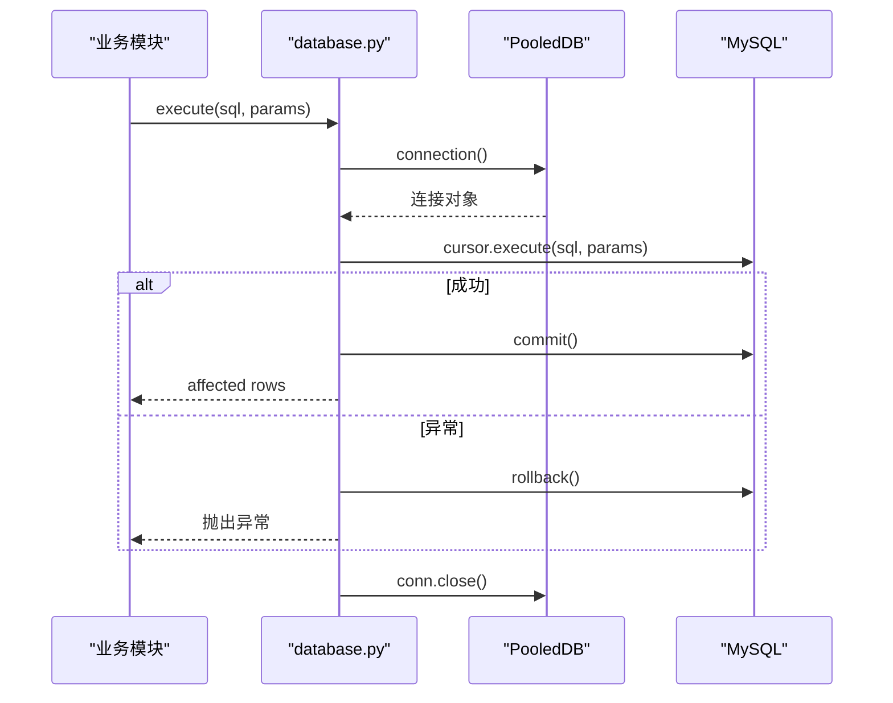
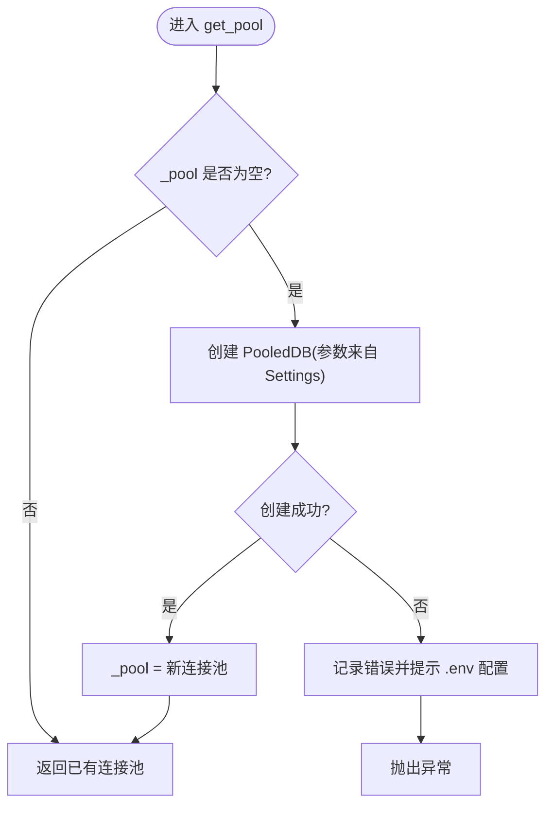
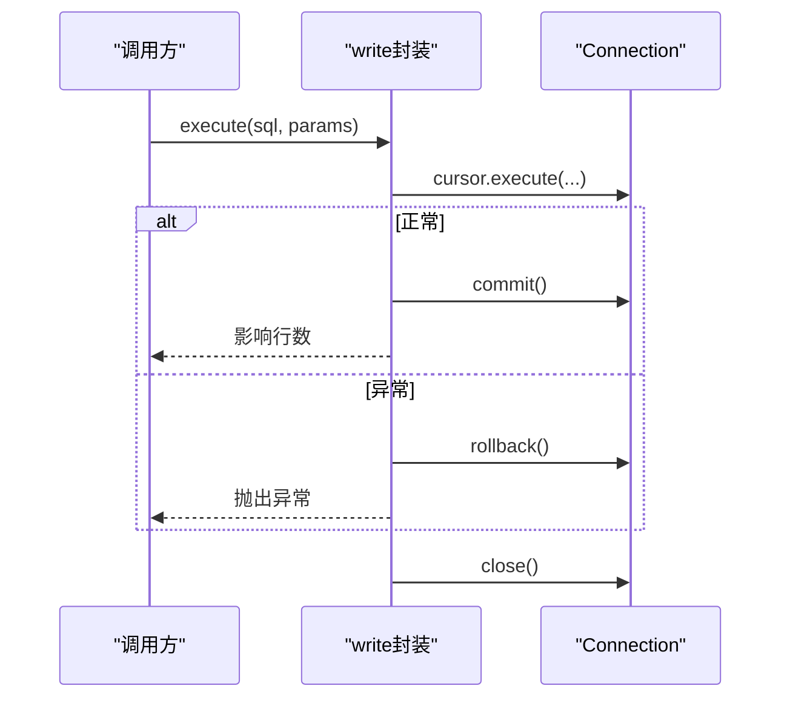
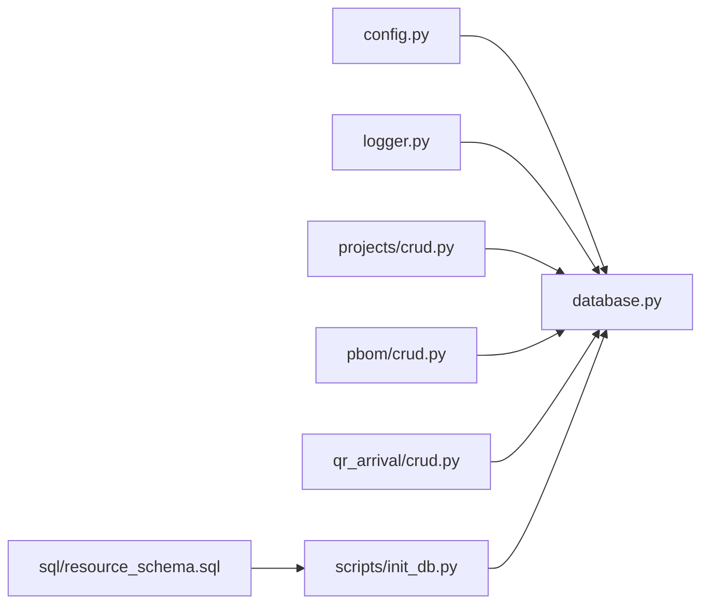

# 数据访问层

<cite>
**本文引用的文件**
- [backend/database.py](file://backend/database.py)
- [backend/config.py](file://backend/config.py)
- [backend/logger.py](file://backend/logger.py)
- [backend/scripts/init_db.py](file://backend/scripts/init_db.py)
- [backend/sql/resource_schema.sql](file://backend/sql/resource_schema.sql)
- [backend/projects/crud.py](file://backend/projects/crud.py)
- [backend/pbom/crud.py](file://backend/pbom/crud.py)
- [backend/qr_arrival/crud.py](file://backend/qr_arrival/crud.py)
</cite>

## 目录
1. [简介](#简介)
2. [项目结构](#项目结构)
3. [核心组件](#核心组件)
4. [架构总览](#架构总览)
5. [详细组件分析](#详细组件分析)
6. [依赖关系分析](#依赖关系分析)
7. [性能考虑](#性能考虑)
8. [故障排查指南](#故障排查指南)
9. [结论](#结论)
10. [附录](#附录)

## 简介
本文件聚焦于后端数据访问层，围绕数据库连接池管理、ORM策略（当前为原生SQL封装）、事务边界与回滚、迁移与版本管理、查询优化与安全、以及测试与模拟数据生成等方面，提供系统化说明与实践建议。该数据访问层以连接池为核心，通过统一接口暴露查询与写入能力，并在各业务模块中复用。

## 项目结构
数据访问相关代码主要分布在以下位置：
- 连接池与基础操作：backend/database.py
- 配置加载：backend/config.py
- 日志记录：backend/logger.py
- 数据库初始化与迁移脚本：backend/scripts/init_db.py、backend/sql/resource_schema.sql
- 业务CRUD：backend/projects/crud.py、backend/pbom/crud.py、backend/qr_arrival/crud.py

图表来源
- [backend/database.py:12-48](file://backend/database.py#L12-L48)
- [backend/config.py:48-98](file://backend/config.py#L48-L98)
- [backend/logger.py:14-42](file://backend/logger.py#L14-L42)
- [backend/scripts/init_db.py:17-293](file://backend/scripts/init_db.py#L17-L293)
- [backend/sql/resource_schema.sql:13-325](file://backend/sql/resource_schema.sql#L13-L325)

章节来源
- [backend/database.py:12-116](file://backend/database.py#L12-L116)
- [backend/config.py:48-98](file://backend/config.py#L48-L98)
- [backend/logger.py:14-42](file://backend/logger.py#L14-L42)
- [backend/scripts/init_db.py:17-293](file://backend/scripts/init_db.py#L17-L293)
- [backend/sql/resource_schema.sql:13-325](file://backend/sql/resource_schema.sql#L13-L325)

## 核心组件
- 连接池与连接获取：基于 PooledDB 的单例连接池，延迟初始化，支持最大连接数、缓存连接数、阻塞获取等参数；提供 get_pool/get_conn 方法。
- 基础操作封装：query_all/query_one/execute/execute_last_id/execute_all，统一处理游标、提交与回滚、异常与资源释放。
- 配置管理：集中读取 DB_HOST/DB_PORT/DB_USER/DB_PASSWORD/DB_DATABASE 等环境变量，并提供类型转换与默认值。
- 日志：按级别输出到控制台与轮转文件，便于问题定位。
- 初始化与迁移：通过 SQL 脚本创建表结构与索引，并做增量兼容（ALTER TABLE）。

章节来源
- [backend/database.py:12-116](file://backend/database.py#L12-L116)
- [backend/config.py:48-98](file://backend/config.py#L48-L98)
- [backend/logger.py:14-42](file://backend/logger.py#L14-L42)
- [backend/scripts/init_db.py:17-293](file://backend/scripts/init_db.py#L17-L293)

## 架构总览
数据访问层采用“连接池 + 轻量封装”的架构：上层业务模块通过 CRUD 调用 database 提供的统一接口，底层由连接池负责连接复用与生命周期管理。所有写操作在封装层进行事务提交/回滚，保证一致性。

图表来源
- [backend/database.py:73-85](file://backend/database.py#L73-L85)
- [backend/database.py:12-48](file://backend/database.py#L12-L48)

## 详细组件分析

### 数据库连接池管理与配置
- 单例与延迟初始化：get_pool 首次调用时创建 PooledDB，避免启动期失败导致进程崩溃。
- 连接复用：maxconnections 限制并发上限，maxcached 控制空闲连接缓存，blocking=True 确保高负载下排队等待而非直接失败。
- 连接泄漏防护：所有封装函数使用 try/finally 确保 conn.close() 执行；游标使用 with 上下文自动关闭。
- 健康检查：当前未实现主动心跳检测；建议在监控或定时任务中加入“SELECT 1”探测，结合连接池指标观察。
- 配置项：host/port/user/password/database 来自 config.Settings，字符集 utf8mb4，返回字典游标。

图表来源
- [backend/database.py:12-43](file://backend/database.py#L12-L43)
- [backend/config.py:48-98](file://backend/config.py#L48-L98)

章节来源
- [backend/database.py:12-48](file://backend/database.py#L12-L48)
- [backend/config.py:48-98](file://backend/config.py#L48-L98)

### ORM 框架使用策略（当前为原生SQL封装）
- 模型定义：无 ORM 模型类，表结构由 SQL 脚本定义（resource_schema.sql 与 init_db.py）。
- 关系映射：通过外键与索引表达关系（如 project_parts.project_id -> projects.id），查询中使用 JOIN 或子查询组装结果。
- 查询优化：
  - 分页：LIMIT/OFFSET 用于列表接口。
  - 聚合：COALESCE/SUM/COUNT 减少多次往返。
  - 索引：对高频过滤字段建立索引（如 status、created_at、part_code、project_id 等）。
  - 去重：对重复零件号使用集合去重。
- 建议：若后续引入 ORM（如 SQLAlchemy），可在此封装之上增加模型层与查询构建器，保持现有接口稳定。

章节来源
- [backend/scripts/init_db.py:21-293](file://backend/scripts/init_db.py#L21-L293)
- [backend/sql/resource_schema.sql:13-325](file://backend/sql/resource_schema.sql#L13-L325)
- [backend/projects/crud.py:5-49](file://backend/projects/crud.py#L5-L49)
- [backend/projects/crud.py:171-232](file://backend/projects/crud.py#L171-L232)

### 事务管理机制
- 事务边界：每个 write 封装函数（execute/execute_last_id/execute_all）内部显式 commit；异常路径统一 rollback。
- 细粒度事务：当前以单条语句为单位的事务，适合简单场景；复杂多步更新建议在上层组合为单一事务（例如使用外部事务管理器包裹多个 execute 调用）。
- 回滚策略：任何异常都会触发回滚并向上抛出，保证数据一致性。
- 批量操作：execute_all 使用 executemany 提升吞吐，同时保持一次提交。

图表来源
- [backend/database.py:73-85](file://backend/database.py#L73-L85)
- [backend/database.py:88-101](file://backend/database.py#L88-L101)
- [backend/database.py:104-116](file://backend/database.py#L104-L116)

章节来源
- [backend/database.py:73-116](file://backend/database.py#L73-L116)

### 数据库迁移与版本管理
- 初始化脚本：init_db.py 创建核心表（projects、project_parts、configs、part_configs、qr_arrival_records、critical_scores、spider_credentials、delivery_records、feishu_detail、system_params），并插入默认系统参数。
- 增量兼容：通过 try/except 包裹 ALTER TABLE，确保重复执行不报错。
- 资源库表结构：resource_schema.sql 定义了设备、区域、人员、任务、预警、效率统计、维护、甘特排程与冲突等表及索引。
- 版本管理建议：引入迁移工具（如 Alembic）管理 DDL 变更，将 init_db.py 作为“首次部署”脚本，后续变更以迁移脚本形式演进。

章节来源
- [backend/scripts/init_db.py:17-293](file://backend/scripts/init_db.py#L17-L293)
- [backend/sql/resource_schema.sql:13-325](file://backend/sql/resource_schema.sql#L13-L325)

### 数据访问的性能优化
- 连接池参数：合理设置 maxconnections 与 maxcached，避免连接耗尽或过多内存占用。
- 查询优化：
  - 使用索引字段过滤与排序（status、created_at、part_code、project_id 等）。
  - 聚合计算在数据库侧完成，减少应用层处理。
  - 分页查询限制返回量。
- 批量写入：使用 executemany 降低网络往返与事务开销。
- 建议：
  - 对热点查询建立覆盖索引。
  - 定期分析慢查询日志并优化 SQL。
  - 对大表分片或归档历史数据。

章节来源
- [backend/database.py:20-33](file://backend/database.py#L20-L33)
- [backend/projects/crud.py:5-49](file://backend/projects/crud.py#L5-L49)
- [backend/projects/crud.py:171-232](file://backend/projects/crud.py#L171-L232)
- [backend/database.py:104-116](file://backend/database.py#L104-L116)

### 安全配置与防注入
- 参数化查询：所有封装函数均使用 %s 占位符传参，避免字符串拼接，有效防止 SQL 注入。
- 最小权限：建议使用只读账号用于查询，读写账号仅授予必要权限。
- 敏感信息：数据库凭据通过环境变量加载，避免硬编码。
- 建议：
  - 开启数据库审计与慢查询日志。
  - 对外部输入进行白名单校验（如枚举字段）。
  - 对动态列名/表名进行严格白名单校验后再拼接到 SQL。

章节来源
- [backend/database.py:51-116](file://backend/database.py#L51-L116)
- [backend/config.py:48-98](file://backend/config.py#L48-L98)

### 测试策略与模拟数据
- 单元测试：针对 CRUD 函数构造不同参数，验证返回结构与边界条件（空结果、分页、去重）。
- 集成测试：使用独立测试数据库，运行 init_db.py 初始化后执行用例，结束后清理。
- 模拟数据：
  - 利用 init_db.py 中的 INSERT IGNORE 逻辑与随机数据生成脚本，构造项目、零件、到货记录等。
  - 使用 execute_all 批量插入以提升效率。
- 建议：
  - 使用 pytest 与 fixtures 管理测试数据生命周期。
  - 对关键流程（如到件匹配、缺件统计）编写端到端用例。

章节来源
- [backend/scripts/init_db.py:271-293](file://backend/scripts/init_db.py#L271-L293)
- [backend/database.py:104-116](file://backend/database.py#L104-L116)

## 依赖关系分析
- database.py 依赖 config.Settings 提供数据库连接参数，依赖 logger 记录错误。
- 各业务 CRUD 模块依赖 database 的基础操作，形成稳定的数据访问契约。
- 初始化脚本依赖 database 的 execute 接口执行 DDL/DML。

图表来源
- [backend/database.py:12-48](file://backend/database.py#L12-L48)
- [backend/config.py:48-98](file://backend/config.py#L48-L98)
- [backend/logger.py:14-42](file://backend/logger.py#L14-L42)
- [backend/projects/crud.py:1-311](file://backend/projects/crud.py#L1-L311)
- [backend/pbom/crud.py:1-91](file://backend/pbom/crud.py#L1-L91)
- [backend/qr_arrival/crud.py:1-104](file://backend/qr_arrival/crud.py#L1-L104)
- [backend/scripts/init_db.py:17-293](file://backend/scripts/init_db.py#L17-L293)
- [backend/sql/resource_schema.sql:13-325](file://backend/sql/resource_schema.sql#L13-L325)

章节来源
- [backend/database.py:12-116](file://backend/database.py#L12-L116)
- [backend/config.py:48-98](file://backend/config.py#L48-L98)
- [backend/logger.py:14-42](file://backend/logger.py#L14-L42)
- [backend/projects/crud.py:1-311](file://backend/projects/crud.py#L1-L311)
- [backend/pbom/crud.py:1-91](file://backend/pbom/crud.py#L1-L91)
- [backend/qr_arrival/crud.py:1-104](file://backend/qr_arrival/crud.py#L1-L104)
- [backend/scripts/init_db.py:17-293](file://backend/scripts/init_db.py#L17-L293)
- [backend/sql/resource_schema.sql:13-325](file://backend/sql/resource_schema.sql#L13-L325)

## 性能考虑
- 连接池调优：根据并发请求峰值调整 maxconnections，避免连接不足导致的阻塞；maxcached 不宜过大以免占用内存。
- 查询设计：优先使用索引字段过滤；避免 SELECT *；合理使用聚合与子查询减少往返。
- 批量写入：大批量数据使用 executemany，必要时拆分为多批次提交以降低锁竞争。
- 监控与诊断：结合日志与数据库慢查询日志定位瓶颈；对热点表关注锁等待与死锁情况。

[本节为通用指导，无需特定文件引用]

## 故障排查指南
- 连接池初始化失败：检查 backend/.env 中的 DB_HOST/DB_PORT/DB_USER/DB_PASSWORD/DB_DATABASE 是否正确；查看日志中的错误提示。
- 连接泄漏：确认所有封装函数是否都正确关闭连接；避免绕过封装直接使用底层连接。
- 事务不一致：检查异常路径是否触发 rollback；复杂多步操作建议在上层统一事务边界。
- 慢查询：启用慢查询日志，分析执行计划，补充或优化索引。

章节来源
- [backend/database.py:34-43](file://backend/database.py#L34-L43)
- [backend/database.py:73-116](file://backend/database.py#L73-L116)
- [backend/logger.py:20-36](file://backend/logger.py#L20-L36)

## 结论
该数据访问层以连接池为核心，提供了统一的查询与写入接口，具备基本的连接复用、异常回滚与日志记录能力。表结构与索引较为完善，满足当前业务需求。后续可在连接健康检查、事务边界抽象、ORM 引入与迁移管理方面进一步增强，以提升可维护性与扩展性。

[本节为总结，无需特定文件引用]

## 附录
- 常用接口速查：
  - 查询：query_all、query_one
  - 写入：execute、execute_last_id、execute_all
  - 连接：get_pool、get_conn
- 关键配置项：DB_HOST、DB_PORT、DB_USER、DB_PASSWORD、DB_DATABASE
- 初始化入口：backend/scripts/init_db.py
- 资源库表结构：backend/sql/resource_schema.sql

[本节为参考信息，无需特定文件引用]