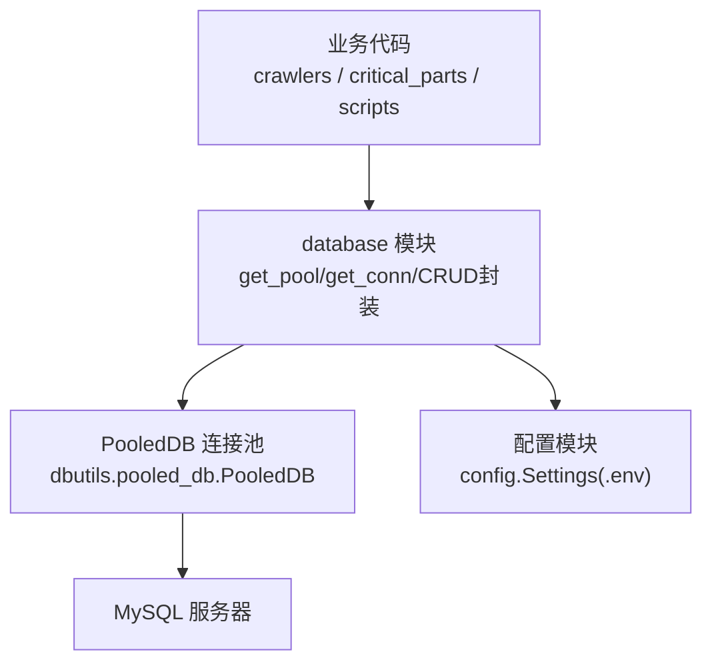
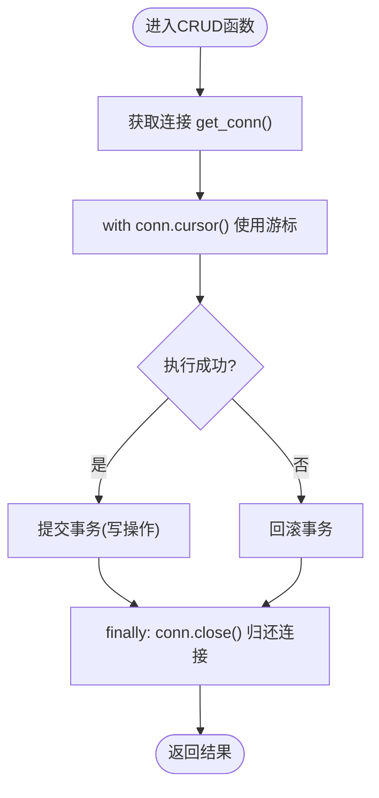
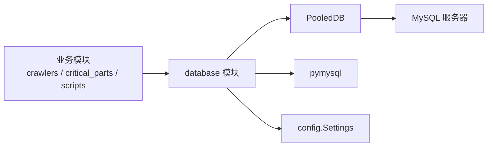

# 连接池管理

<cite>
**本文引用的文件**
- [backend/database.py](file://backend/database.py)
- [backend/config.py](file://backend/config.py)
- [backend/env.example](file://backend/env.example)
- [backend/critical_parts/crud.py](file://backend/critical_parts/crud.py)
- [backend/scripts/init_db.py](file://backend/scripts/init_db.py)
</cite>

## 目录
1. [简介](#简介)
2. [项目结构](#项目结构)
3. [核心组件](#核心组件)
4. [架构总览](#架构总览)
5. [详细组件分析](#详细组件分析)
6. [依赖关系分析](#依赖关系分析)
7. [性能考量与调优](#性能考量与调优)
8. [故障排查指南](#故障排查指南)
9. [结论](#结论)
10. [附录](#附录)

## 简介
本文件围绕后端数据库连接池管理进行系统化说明，重点覆盖以下方面：
- PooledDB 连接池配置参数（maxconnections、mincached、maxcached、blocking）的作用与调优策略
- 单例模式实现（延迟初始化、线程安全）
- 连接获取与释放的生命周期管理（复用、泄漏防护、健康检查）
- 监控与调试方法（连接状态查看、性能指标收集）
- 最佳实践与常见问题解决方案

## 项目结构
本项目在后端通过 dbutils 的 PooledDB 提供 MySQL 连接池能力，并通过统一的 database 模块对外暴露查询与执行接口。配置集中由 config.py 从 .env 加载，避免硬编码。



图表来源
- [backend/database.py:12-48](file://backend/database.py#L12-L48)
- [backend/config.py:48-98](file://backend/config.py#L48-L98)

章节来源
- [backend/database.py:1-116](file://backend/database.py#L1-L116)
- [backend/config.py:1-102](file://backend/config.py#L1-L102)

## 核心组件
- 连接池单例与延迟初始化：通过全局变量 _pool 与 get_pool() 实现首次使用时创建，后续复用。
- 连接获取与释放：get_conn() 从池中取连接；所有 CRUD 函数在 finally 中确保关闭连接，防止泄漏。
- 事务与错误处理：写操作在异常时回滚，成功则提交，保证一致性。
- 配置加载：Settings 类统一读取 .env 中的数据库连接信息。

章节来源
- [backend/database.py:12-48](file://backend/database.py#L12-L48)
- [backend/database.py:46-116](file://backend/database.py#L46-L116)
- [backend/config.py:48-98](file://backend/config.py#L48-L98)

## 架构总览
下图展示了从业务调用到数据库连接的完整流程，包括连接池的延迟初始化、连接借用与归还、以及异常时的回滚路径。

```mermaid
sequenceDiagram
participant App as "业务代码"
participant DBM as "database 模块"
participant Pool as "PooledDB"
participant MySQL as "MySQL"
App->>DBM : 调用 query_all / execute / execute_last_id
DBM->>DBM : get_conn() -> get_pool().connection()
DBM->>Pool : 请求连接
Pool-->>DBM : 返回可用连接或等待(阻塞)
DBM->>MySQL : 执行SQL
MySQL-->>DBM : 返回结果/影响行数
DBM->>DBM : 异常? 是 : rollback; 否 : commit
DBM->>Pool : conn.close() 归还连接
DBM-->>App : 返回数据/影响行数
```

图表来源
- [backend/database.py:12-48](file://backend/database.py#L12-L48)
- [backend/database.py:51-116](file://backend/database.py#L51-L116)

## 详细组件分析

### 连接池单例与延迟初始化
- 单例设计：全局 _pool 变量保存连接池实例，get_pool() 仅在 None 时创建，避免重复初始化开销。
- 延迟初始化：服务启动不立即建立连接，首次访问时才创建，降低冷启动失败风险。
- 线程安全：Python GIL 与 dbutils 内部锁机制共同保障多线程并发下的连接池安全。

章节来源
- [backend/database.py:8-43](file://backend/database.py#L8-L43)

### 连接获取与释放生命周期
- 获取：get_conn() 通过 pool.connection() 从池中借出连接。
- 使用：CRUD 函数使用 with 上下文管理器创建 cursor，自动释放资源。
- 释放：finally 块中调用 conn.close() 将连接归还给池，避免连接泄漏。
- 事务：execute / execute_last_id / execute_all 在异常时回滚，成功提交。



图表来源
- [backend/database.py:51-116](file://backend/database.py#L51-L116)

章节来源
- [backend/database.py:46-116](file://backend/database.py#L46-L116)

### PooledDB 配置参数与作用
- maxconnections=10：连接池最大连接数，限制同时活跃连接上限，防止耗尽数据库资源。
- mincached=0：启动时不预建连接，按需创建，减少冷启动压力与无效连接占用。
- maxcached=5：空闲连接池大小，控制最多缓存的空闲连接数量，平衡复用与内存占用。
- blocking=True：当连接池耗尽时，请求线程阻塞等待可用连接，避免直接抛错导致级联失败。

调优建议（结合当前默认值）：
- 低并发场景：保持默认即可；若出现“连接耗尽”告警，可适当提高 maxconnections。
- 高并发读多写少：适当增大 maxcached，提升连接复用率，减少握手开销。
- 突发流量：blocking=True 可平滑排队，但需配合超时与监控，避免长队列堆积。
- 资源受限环境：降低 maxcached，减少空闲连接占用；必要时降低 maxconnections。

章节来源
- [backend/database.py:20-33](file://backend/database.py#L20-L33)

### 配置管理与环境变量
- Settings 类集中管理数据库与服务配置，优先从 .env 读取，未找到时给出警告并使用默认值。
- 数据库相关键：DB_HOST、DB_PORT、DB_USER、DB_PASSWORD、DB_DATABASE。
- 示例配置文件 env.example 提供默认占位值，便于快速部署。

章节来源
- [backend/config.py:48-98](file://backend/config.py#L48-L98)
- [backend/env.example:7-12](file://backend/env.example#L7-L12)

### 业务层使用示例
- 关键件评分模块通过 query_all 与 execute_last_id 完成读写，体现连接池的透明使用。
- 初始化脚本 init_db.py 使用 execute 与 query_all 创建表结构与默认参数，验证连接池可用性。

章节来源
- [backend/critical_parts/crud.py:1-62](file://backend/critical_parts/crud.py#L1-L62)
- [backend/scripts/init_db.py:11-297](file://backend/scripts/init_db.py#L11-L297)

## 依赖关系分析
- database 模块依赖 dbutils.pooled_db.PooledDB 与 pymysql，负责连接池与底层驱动。
- config 模块提供运行时配置，database 模块消费其设置项。
- 业务模块（如 crawlers、critical_parts、scripts）仅依赖 database 模块提供的统一接口，解耦具体连接细节。



图表来源
- [backend/database.py:1-6](file://backend/database.py#L1-L6)
- [backend/config.py:48-98](file://backend/config.py#L48-L98)

章节来源
- [backend/database.py:1-116](file://backend/database.py#L1-L116)
- [backend/config.py:1-102](file://backend/config.py#L1-L102)

## 性能考量与调优
- 连接复用：通过 maxcached 控制空闲连接缓存，减少频繁创建/销毁带来的握手成本。
- 阻塞策略：blocking=True 在连接耗尽时排队等待，适合短时峰值；需配合监控观察队列长度与等待时间。
- 最小预热：mincached=0 避免启动时建立大量无用连接；可在冷启动后根据负载逐步增长。
- 最大连接：maxconnections 应小于数据库 server_max_connections，并考虑应用并发度与每个请求的并发连接数。
- 事务粒度：尽量缩短事务范围，减少长时间持有连接的风险。
- 批量操作：使用 executemany（execute_all）降低往返次数，提高吞吐。

[本节为通用性能指导，不直接分析具体文件]

## 故障排查指南
- 连接池初始化失败
  - 现象：服务启动后首次访问数据库报错，日志提示配置问题。
  - 排查：检查 backend/.env 是否存在且包含正确的 DB_HOST、DB_PORT、DB_USER、DB_PASSWORD、DB_DATABASE。
  - 参考：初始化失败日志输出位置。

- 连接泄漏
  - 现象：连接数持续增长，最终达到 maxconnections 导致阻塞或拒绝新请求。
  - 排查：确认所有 CRUD 函数是否在 finally 中关闭连接；避免手动持有连接对象过久。
  - 参考：各 CRUD 函数的 finally 关闭逻辑。

- 高并发下响应变慢
  - 现象：请求排队明显，等待连接时间增加。
  - 排查：评估 maxconnections 与 maxcached 是否合理；检查慢查询与事务时长；必要时扩容数据库或优化 SQL。
  - 参考：连接池参数定义与使用点。

- 配置缺失或错误
  - 现象：连接失败，日志提示未找到 .env 或配置项为空。
  - 排查：复制 env.example 为 .env 并填写真实值；确认端口、用户名、密码、库名正确。
  - 参考：配置加载与默认值回退逻辑。

章节来源
- [backend/database.py:18-43](file://backend/database.py#L18-L43)
- [backend/database.py:51-116](file://backend/database.py#L51-L116)
- [backend/config.py:15-22](file://backend/config.py#L15-L22)
- [backend/env.example:7-12](file://backend/env.example#L7-L12)

## 结论
本项目通过 PooledDB 实现了稳定、易用的数据库连接池管理。采用单例与延迟初始化降低启动成本，统一的 CRUD 封装简化了连接生命周期管理，配合合理的参数调优与完善的异常处理，能够在不同负载环境下提供可靠的数据库访问能力。建议在上线前结合压测确定合适的连接池参数，并持续监控连接使用与慢查询情况，以保障系统稳定性与性能。

[本节为总结性内容，不直接分析具体文件]

## 附录

### 连接池参数速查
- maxconnections：最大连接数，控制并发上限。
- mincached：启动时预建连接数，设为 0 表示按需创建。
- maxcached：空闲连接缓存上限，提升复用率。
- blocking：连接耗尽时是否阻塞等待。

章节来源
- [backend/database.py:20-33](file://backend/database.py#L20-L33)

### 常用接口与用途
- get_pool()：获取连接池单例。
- get_conn()：从池中获取连接。
- query_all / query_one：查询接口，自动关闭连接。
- execute / execute_last_id / execute_all：写操作接口，支持事务与批量写入。

章节来源
- [backend/database.py:46-116](file://backend/database.py#L46-L116)