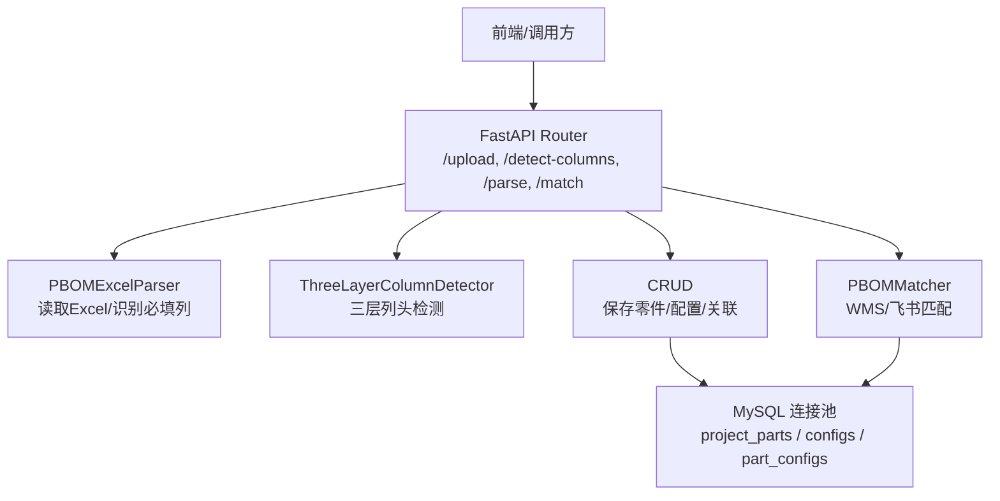
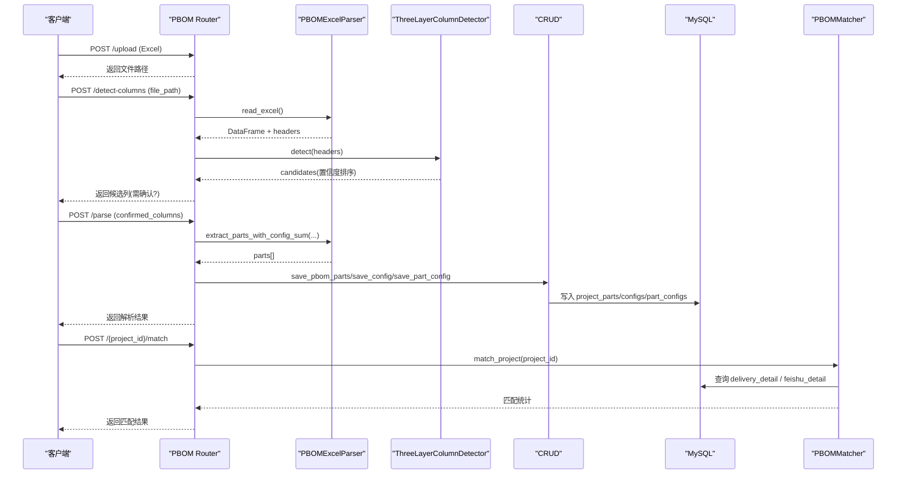
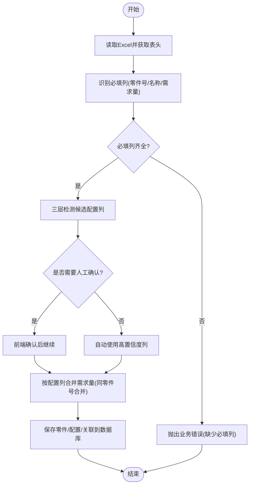
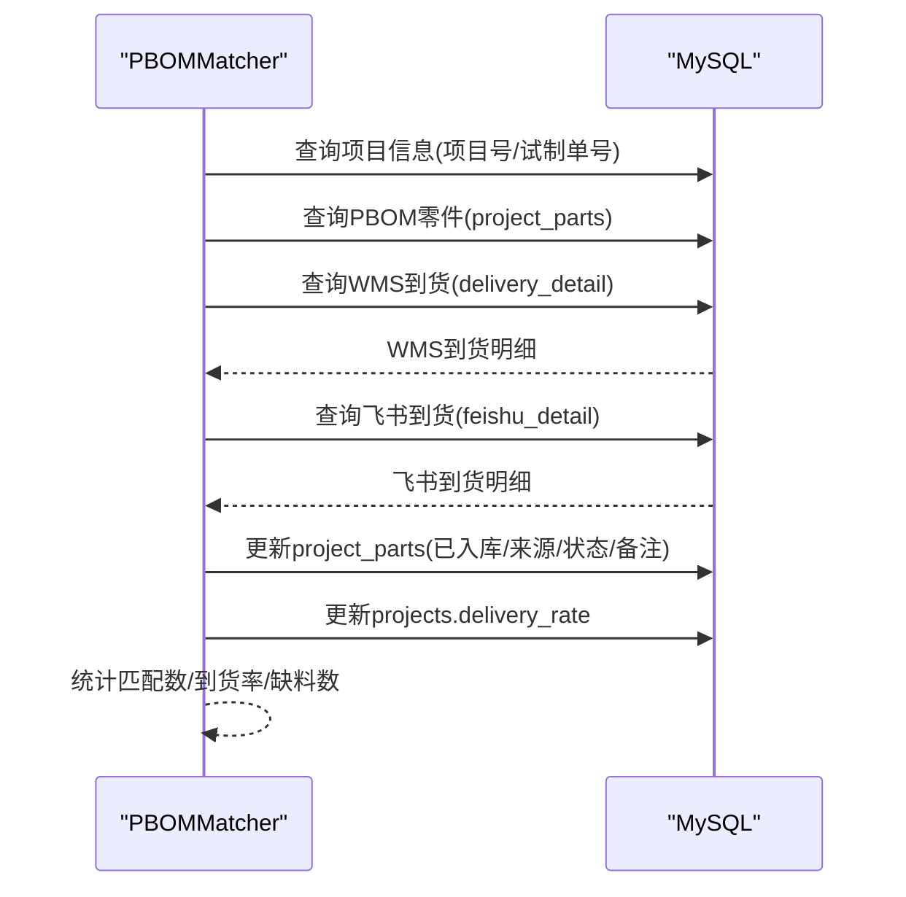
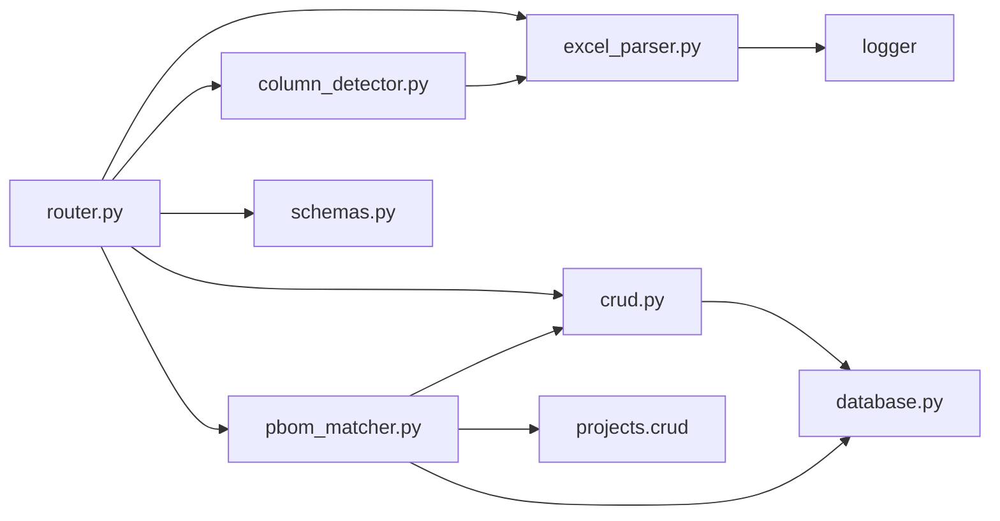

# PBOM解析模块

<cite>
**本文引用的文件**
- [excel_parser.py](file://backend/pbom/excel_parser.py)
- [column_detector.py](file://backend/pbom/column_detector.py)
- [router.py](file://backend/pbom/router.py)
- [schemas.py](file://backend/pbom/schemas.py)
- [crud.py](file://backend/pbom/crud.py)
- [pbom_matcher.py](file://backend/pbom/pbom_matcher.py)
- [database.py](file://backend/database.py)
- [config.py](file://backend/config.py)
- [init_db.py](file://backend/scripts/init_db.py)
</cite>

## 目录
1. [简介](#简介)
2. [项目结构](#项目结构)
3. [核心组件](#核心组件)
4. [架构总览](#架构总览)
5. [详细组件分析](#详细组件分析)
6. [依赖关系分析](#依赖关系分析)
7. [性能与大数据处理](#性能与大数据处理)
8. [故障排查指南](#故障排查指南)
9. [结论](#结论)
10. [附录：PBOM模板设计与最佳实践](#附录pbom模板设计与最佳实践)

## 简介
本模块提供PBOM（产品物料清单）的智能解析能力，支持从Excel文件自动识别列头、检测配置列、合并多配置需求数量，并将结果持久化到数据库。随后通过匹配器将PBOM零件与WMS/飞书到货数据进行智能匹配，计算到货率并更新项目统计。模块具备错误处理、数据校验与日志记录，确保解析结果的可靠性与可追溯性。

## 项目结构
PBOM模块位于后端服务的 backend/pbom 目录下，主要包含以下职责划分：
- Excel解析与列头识别：excel_parser.py、column_detector.py
- API路由与流程编排：router.py
- 数据模型与响应结构：schemas.py
- 数据库操作：crud.py
- 匹配逻辑：pbom_matcher.py
- 共享基础设施：database.py、config.py

图表来源
- [router.py:23-166](file://backend/pbom/router.py#L23-L166)
- [excel_parser.py:14-203](file://backend/pbom/excel_parser.py#L14-L203)
- [column_detector.py:55-242](file://backend/pbom/column_detector.py#L55-L242)
- [crud.py:10-91](file://backend/pbom/crud.py#L10-L91)
- [pbom_matcher.py:18-240](file://backend/pbom/pbom_matcher.py#L18-L240)
- [database.py:12-116](file://backend/database.py#L12-L116)

章节来源
- [router.py:23-166](file://backend/pbom/router.py#L23-L166)
- [config.py:48-102](file://backend/config.py#L48-L102)

## 核心组件
- PBOMExcelParser：负责读取Excel、识别必填列（零件号、零件名称、需求量）、提取零件及按配置列合并需求量。
- ThreeLayerColumnDetector：基于规则+数值统计+用户确认的三层递进式配置列检测器。
- PBOMMatcher：将PBOM零件与WMS/飞书到货数据匹配，汇总已入库数量，更新项目到货率。
- CRUD：封装对 project_parts、configs、part_configs 等表的增删改查。
- Router：暴露上传、列头检测、解析、匹配等API。
- Schemas：定义请求/响应数据结构。

章节来源
- [excel_parser.py:14-203](file://backend/pbom/excel_parser.py#L14-L203)
- [column_detector.py:55-242](file://backend/pbom/column_detector.py#L55-L242)
- [pbom_matcher.py:18-240](file://backend/pbom/pbom_matcher.py#L18-L240)
- [crud.py:10-91](file://backend/pbom/crud.py#L10-L91)
- [router.py:23-166](file://backend/pbom/router.py#L23-L166)
- [schemas.py:6-48](file://backend/pbom/schemas.py#L6-L48)

## 架构总览
整体流程分为“解析阶段”和“匹配阶段”。解析阶段完成Excel读取、列头识别、配置列检测、零件提取与存储；匹配阶段从WMS优先、飞书兜底进行到货匹配，更新项目到货率。

图表来源
- [router.py:23-166](file://backend/pbom/router.py#L23-L166)
- [excel_parser.py:24-187](file://backend/pbom/excel_parser.py#L24-L187)
- [column_detector.py:129-242](file://backend/pbom/column_detector.py#L129-L242)
- [crud.py:10-91](file://backend/pbom/crud.py#L10-L91)
- [pbom_matcher.py:21-240](file://backend/pbom/pbom_matcher.py#L21-L240)

## 详细组件分析

### Excel解析与列头自动检测
- 读取Excel：根据扩展名选择openpyxl或xlrd引擎，返回DataFrame与列名列表。
- 必填列识别：通过关键词匹配定位“零件号/物料号/零件编码/MATTER_CODE”、“零件名称/名称/MATTER_NAME”、“总消耗/需求量/QTY”等列。
- 配置列检测（三层）：
  - Layer1 规则引擎：排除固定列（如序号、工序、力矩、备注等）与需求量列；匹配配置列模式（如M101、M101.1、车型代号等）；对数值列加分；考虑相邻连续数值列特征；过滤低非空比例与过长列名。
  - Layer2 数值统计验证：计算非空比例、唯一值数、数值范围等，辅助判断是否为配置列。
  - Layer3 用户确认兜底：当候选置信度低于阈值时提示人工确认。
- 零件提取与数量合并：
  - 基础提取：单列需求量。
  - 配置列求和：同一行多个配置列数值相加，相同零件号自动合并。
  - 配置粒度提取：为每个配置列生成“零件号→需求量”映射，便于后续关联存储。

图表来源
- [excel_parser.py:24-203](file://backend/pbom/excel_parser.py#L24-L203)
- [column_detector.py:129-242](file://backend/pbom/column_detector.py#L129-L242)
- [router.py:50-144](file://backend/pbom/router.py#L50-L144)

章节来源
- [excel_parser.py:24-203](file://backend/pbom/excel_parser.py#L24-L203)
- [column_detector.py:55-242](file://backend/pbom/column_detector.py#L55-L242)
- [router.py:50-144](file://backend/pbom/router.py#L50-L144)

### 零件信息提取算法
- 输入：零件号列、零件名称列、可选的需求量列或多配置列集合。
- 处理：
  - 遍历每一行，清洗零件号与名称，忽略空行。
  - 若存在需求量列则转换为整数；否则默认0。
  - 若使用多配置列，则对同行各配置列数值求和，并按零件号聚合合并。
- 输出：去重后的零件列表，含零件号、名称与合并后的需求量。

章节来源
- [excel_parser.py:126-187](file://backend/pbom/excel_parser.py#L126-L187)

### 配置列自动识别与数量合并逻辑
- 自动识别：
  - 固定列排除：序号、线别、工序、零件号/名称、需求量、力矩、关重标识、备注等。
  - 配置列模式匹配：M\d+、M\d+\.\d+、车型代号、工程代号等。
  - 数值列加分与相邻列加分：提升连续数值列为配置列的置信度。
  - 统计过滤：非空比例过低、唯一值过多且范围过大视为数据列而非配置列。
- 数量合并：
  - 同一行多个配置列数值相加得到该行的总需求。
  - 相同零件号在不同行出现时，需求量累加合并。
  - 为每个配置列单独生成“零件号→需求量”映射，用于保存配置粒度数据。

章节来源
- [column_detector.py:22-53](file://backend/pbom/column_detector.py#L22-L53)
- [column_detector.py:129-221](file://backend/pbom/column_detector.py#L129-L221)
- [excel_parser.py:150-203](file://backend/pbom/excel_parser.py#L150-L203)

### 零件匹配算法（PBOM与库存系统）
- 数据来源优先级：
  - 第一步：WMS到货明细（delivery_detail），按项目号与试制申请号筛选，汇总每个零件的入库数量与状态信息。
  - 第二步：若WMS未匹配到，尝试从飞书共享表（feishu_detail）按试制申请号匹配，汇总到货数量与跟踪信息。
- 匹配与更新：
  - 逐零件比较需求量与到货量，更新 project_parts 的已入库数量、来源、仓库、专业工程师、状态、缺料备注等字段。
  - 统计匹配数、到货率、缺料数，并更新项目的 delivery_rate。
- 容错与日志：
  - 无WMS数据时记录警告；无飞书数据时记录信息；最终输出匹配统计。

图表来源
- [pbom_matcher.py:21-240](file://backend/pbom/pbom_matcher.py#L21-L240)
- [database.py:51-116](file://backend/database.py#L51-L116)

章节来源
- [pbom_matcher.py:21-240](file://backend/pbom/pbom_matcher.py#L21-L240)

### 数据验证规则与错误处理机制
- 必填列校验：缺失零件号或零件名称时抛出业务错误。
- 文件格式校验：仅支持.xlsx/.xls，否则拒绝上传。
- 数据合法性：
  - 需求量与配置列数值转换失败时回退为0。
  - 非空比例过低或唯一值异常时降低置信度或排除。
- 事务与一致性：
  - 解析前清空项目旧数据（零件、配置、关联、评分），避免脏数据。
  - 数据库写操作统一通过连接池执行，异常时回滚。
- 日志与可观测性：
  - 关键步骤记录日志（读取失败、匹配统计、解析结果）。

章节来源
- [router.py:23-113](file://backend/pbom/router.py#L23-L113)
- [excel_parser.py:24-100](file://backend/pbom/excel_parser.py#L24-L100)
- [crud.py:10-37](file://backend/pbom/crud.py#L10-L37)
- [database.py:73-116](file://backend/database.py#L73-L116)

### 性能优化策略与大文件处理能力
- 流式上传：使用异步文件读写分块写入，避免一次性加载大文件导致内存峰值。
- 解析优化：
  - 使用pandas读取Excel，按需只处理必要列。
  - 配置列检测采用规则+统计快速过滤，减少无效列计算。
  - 零件提取与合并使用有序字典聚合，避免重复插入。
- 数据库优化：
  - 使用连接池与批量提交，减少连接开销。
  - 解析前清理旧数据，保证写入原子性与一致性。
- 匹配优化：
  - 按项目号与试制单号精确筛选WMS/飞书数据，减少全表扫描。
  - 使用字典聚合到货数量与最新状态，避免多次查询。

章节来源
- [router.py:23-47](file://backend/pbom/router.py#L23-L47)
- [excel_parser.py:126-203](file://backend/pbom/excel_parser.py#L126-L203)
- [column_detector.py:129-221](file://backend/pbom/column_detector.py#L129-L221)
- [database.py:12-116](file://backend/database.py#L12-L116)
- [pbom_matcher.py:42-126](file://backend/pbom/pbom_matcher.py#L42-L126)

## 依赖关系分析
- 模块内依赖：
  - router依赖parser、detector、crud、matcher与schemas。
  - parser依赖logger与pandas。
  - detector依赖parser与pandas。
  - matcher依赖crud、projects.crud与database。
  - crud依赖database。
- 外部依赖：
  - MySQL数据库（通过PyMySQL连接池）。
  - FastAPI框架。
  - openpyxl/xlrd用于Excel读取。

图表来源
- [router.py:1-166](file://backend/pbom/router.py#L1-L166)
- [excel_parser.py:1-203](file://backend/pbom/excel_parser.py#L1-L203)
- [column_detector.py:1-242](file://backend/pbom/column_detector.py#L1-L242)
- [crud.py:1-91](file://backend/pbom/crud.py#L1-L91)
- [pbom_matcher.py:1-240](file://backend/pbom/pbom_matcher.py#L1-L240)
- [database.py:1-116](file://backend/database.py#L1-L116)

章节来源
- [router.py:1-166](file://backend/pbom/router.py#L1-L166)
- [database.py:1-116](file://backend/database.py#L1-L116)

## 性能与大数据处理
- 建议：
  - 控制Excel文件大小与列数，避免超大表格导致内存压力。
  - 合理设计配置列，尽量保持连续与命名规范，提高自动识别准确率。
  - 在匹配阶段限定项目号与试制单号范围，减少不必要的数据扫描。
  - 定期清理历史解析结果与临时文件，保持系统整洁。
- 监控与日志：
  - 关注解析与匹配过程的日志输出，及时发现异常与瓶颈。
  - 对慢查询进行索引优化（如project_id、part_code、apply_code等）。

[本节为通用指导，不直接分析具体文件]

## 故障排查指南
- 上传失败：
  - 检查文件格式是否支持（xlsx/xls）。
  - 检查上传目录权限与磁盘空间。
- 列头检测不准确：
  - 检查列名是否符合配置列模式（如M101、M101.1）。
  - 查看候选列的置信度与统计信息，必要时人工确认。
- 解析结果为空：
  - 检查必填列是否存在（零件号、零件名称）。
  - 检查需求量或配置列是否为数值类型。
- 匹配结果为0：
  - 检查项目号与试制单号是否正确。
  - 检查WMS/飞书数据源是否包含对应零件号。
- 数据库错误：
  - 检查.env配置是否正确（DB_HOST/PORT/USER/PASSWORD/DATABASE）。
  - 检查表结构与索引是否初始化成功。

章节来源
- [router.py:23-113](file://backend/pbom/router.py#L23-L113)
- [database.py:12-43](file://backend/database.py#L12-L43)
- [init_db.py:40-97](file://backend/scripts/init_db.py#L40-L97)

## 结论
PBOM解析模块通过智能列头识别、三层配置列检测与多配置数量合并，实现了从Excel到结构化数据的可靠转换；结合WMS/飞书到货数据匹配，形成完整的PBOM管理与到货追踪闭环。模块具备良好的错误处理与日志记录，适用于多种Excel格式与不同企业模板。配合合理的模板设计与最佳实践，可显著提升BOM解析效率与准确性。

[本节为总结性内容，不直接分析具体文件]

## 附录：PBOM模板设计与最佳实践
- 模板设计要点：
  - 固定列：序号、线别、安装工序、零件号、零件名称、需求量/总消耗、力矩、关重标识、备注等。
  - 配置列：建议使用M\d+或M\d+\.\d+模式（如M101、M101.1），并保持连续排列；也可使用车型代号或工程代号。
  - 需求量列：明确标注“总消耗/需求量/QTY”，避免与配置列混淆。
- 最佳实践：
  - 保持列名简洁规范，避免过长或歧义列名。
  - 配置列尽量为整型数值，便于自动识别与合并。
  - 同一零件号在同一配置下只出现一次，避免重复导致统计偏差。
  - 上传前检查必填列与数值列的完整性，减少解析失败概率。
  - 对于复杂模板，优先使用“列头检测”功能，并根据置信度进行人工确认。

[本节为概念性指导，不直接分析具体文件]