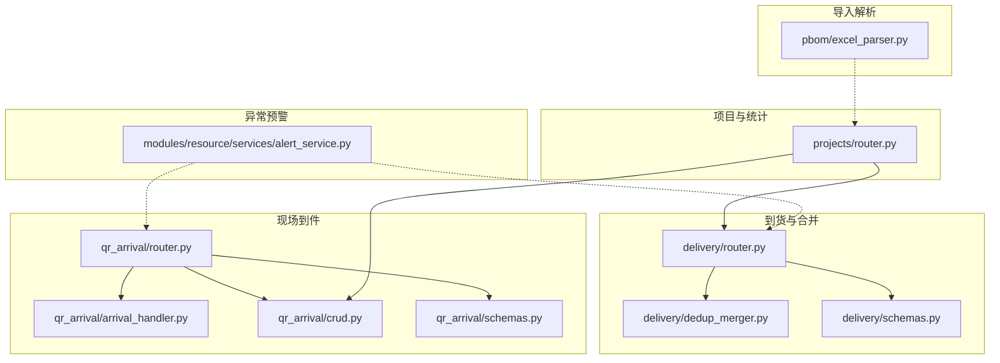
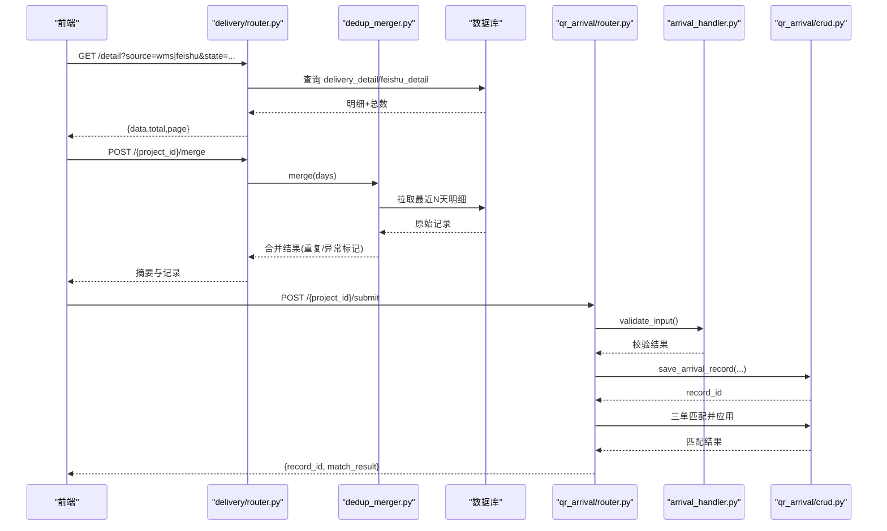
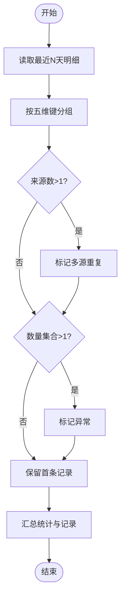
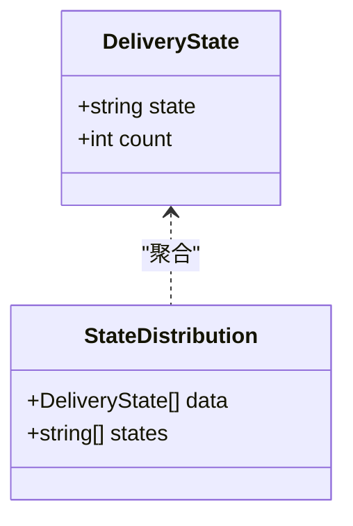
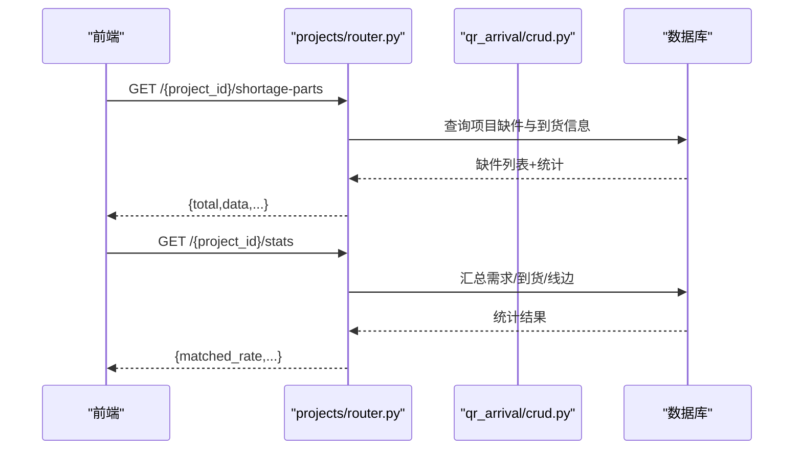
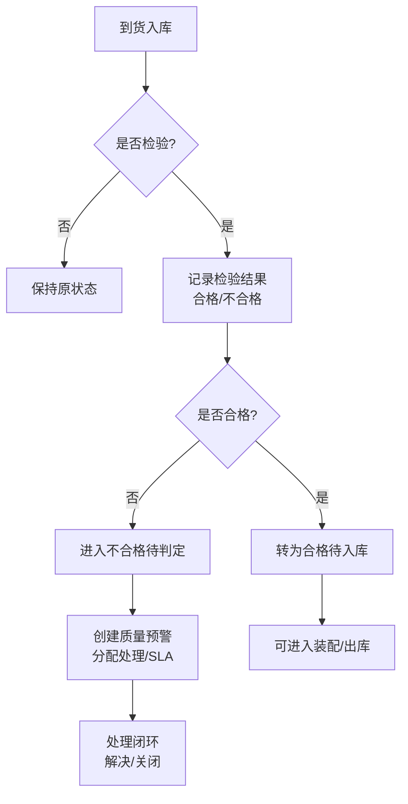
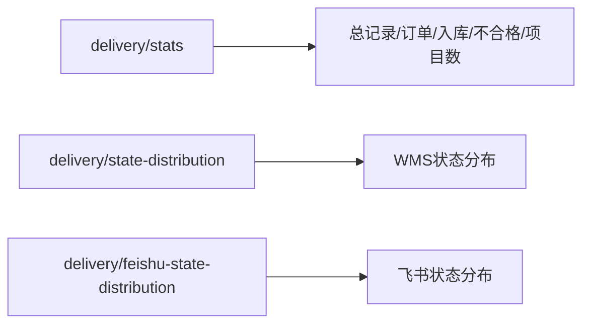
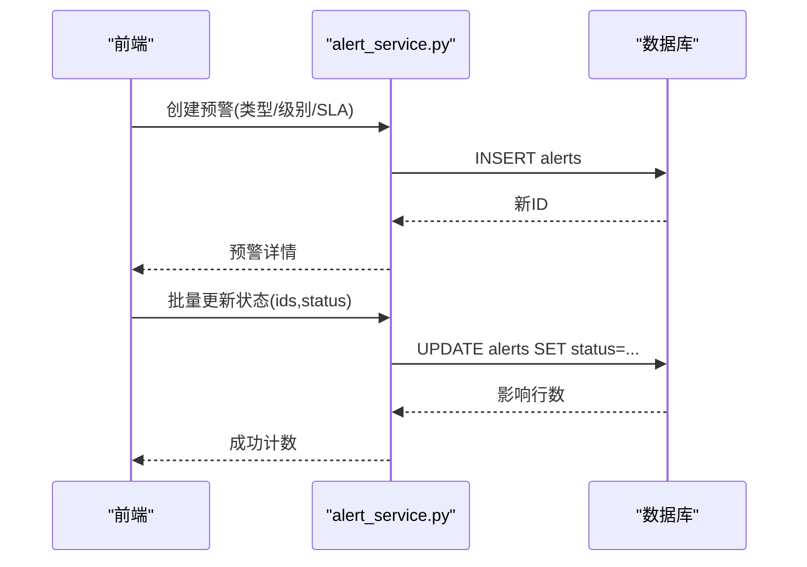
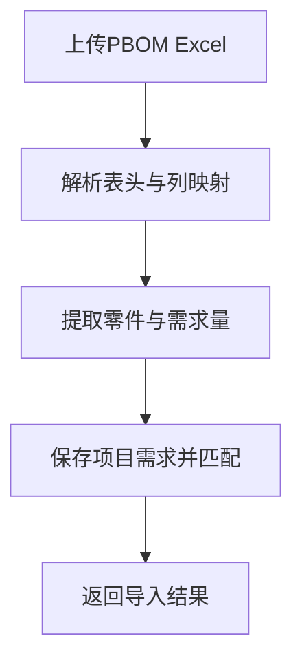
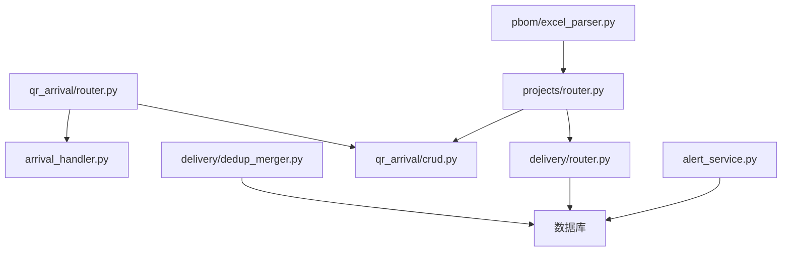

# 到货管理模块

<cite>
**本文引用的文件**
- [backend/delivery/dedup_merger.py](file://backend/delivery/dedup_merger.py)
- [backend/delivery/router.py](file://backend/delivery/router.py)
- [backend/delivery/schemas.py](file://backend/delivery/schemas.py)
- [backend/qr_arrival/arrival_handler.py](file://backend/qr_arrival/arrival_handler.py)
- [backend/qr_arrival/crud.py](file://backend/qr_arrival/crud.py)
- [backend/qr_arrival/router.py](file://backend/qr_arrival/router.py)
- [backend/qr_arrival/schemas.py](file://backend/qr_arrival/schemas.py)
- [backend/projects/router.py](file://backend/projects/router.py)
- [backend/modules/resource/services/alert_service.py](file://backend/modules/resource/services/alert_service.py)
- [backend/pbom/excel_parser.py](file://backend/pbom/excel_parser.py)
</cite>

## 目录
1. [简介](#简介)
2. [项目结构](#项目结构)
3. [核心组件](#核心组件)
4. [架构总览](#架构总览)
5. [详细组件分析](#详细组件分析)
6. [依赖关系分析](#依赖关系分析)
7. [性能考量](#性能考量)
8. [故障排查指南](#故障排查指南)
9. [结论](#结论)
10. [附录](#附录)

## 简介
本模块围绕“到货管理”提供端到端能力：多源数据（WMS、飞书等）的采集与去重合并、到货状态跟踪（入库、检验、合格、不合格等）、按项目维度统计到货进度、质量管控（质检结果记录与不合格品处理）、数据分析（趋势、供应商绩效等）、异常预警（延迟到货、质量问题等），以及导入导出与批量操作接口。

## 项目结构
后端以 FastAPI 路由为核心，结合领域服务与数据库访问层组织代码：
- 到货数据与合并：delivery 模块负责明细查询、状态分布、合并摘要与执行合并。
- 现场到件：qr_arrival 模块支持扫码录入、三单匹配、线边库存更新与项目级汇总。
- 项目关联：projects 模块提供缺件清单、单据状态分布等统计。
- 异常预警：modules/resource/services/alert_service.py 提供预警创建、SLA、升级与统计。
- 导入解析：pbom/excel_parser.py 用于 PBOM Excel 解析与需求提取。

**图示来源**
- [backend/delivery/router.py:1-259](file://backend/delivery/router.py#L1-L259)
- [backend/delivery/dedup_merger.py:1-128](file://backend/delivery/dedup_merger.py#L1-L128)
- [backend/qr_arrival/router.py:1-88](file://backend/qr_arrival/router.py#L1-L88)
- [backend/qr_arrival/arrival_handler.py:1-72](file://backend/qr_arrival/arrival_handler.py#L1-L72)
- [backend/qr_arrival/crud.py:1-104](file://backend/qr_arrival/crud.py#L1-L104)
- [backend/projects/router.py:1-231](file://backend/projects/router.py#L1-L231)
- [backend/modules/resource/services/alert_service.py:1-399](file://backend/modules/resource/services/alert_service.py#L1-L399)
- [backend/pbom/excel_parser.py:1-203](file://backend/pbom/excel_parser.py#L1-L203)

**章节来源**
- [backend/delivery/router.py:1-259](file://backend/delivery/router.py#L1-L259)
- [backend/qr_arrival/router.py:1-88](file://backend/qr_arrival/router.py#L1-L88)
- [backend/projects/router.py:1-231](file://backend/projects/router.py#L1-L231)
- [backend/modules/resource/services/alert_service.py:1-399](file://backend/modules/resource/services/alert_service.py#L1-L399)
- [backend/pbom/excel_parser.py:1-203](file://backend/pbom/excel_parser.py#L1-L203)

## 核心组件
- 多源到货去重合并器：基于五维键（项目号、零件号、数量、时间天级、单据号）进行分组与合并，识别多源重复与异常（同组数量不一致）。
- 到货明细与统计接口：支持分页、多字段筛选、状态过滤、时间窗口；提供 WMS 与飞书双源统计与状态分布。
- 现场到件处理：校验输入、落库、三单匹配（订单/到货/需求）、更新线边库存与项目到货状态。
- 项目维度统计：缺件清单、单据状态分布、到货进度汇总。
- 异常预警：类型、级别、SLA、升级、批处理与统计。
- 导入解析：PBOM Excel 解析与配置列求和，支撑需求与到货对比。

**章节来源**
- [backend/delivery/dedup_merger.py:7-128](file://backend/delivery/dedup_merger.py#L7-L128)
- [backend/delivery/router.py:33-164](file://backend/delivery/router.py#L33-L164)
- [backend/qr_arrival/arrival_handler.py:7-72](file://backend/qr_arrival/arrival_handler.py#L7-L72)
- [backend/qr_arrival/crud.py:4-104](file://backend/qr_arrival/crud.py#L4-L104)
- [backend/projects/router.py:84-140](file://backend/projects/router.py#L84-L140)
- [backend/modules/resource/services/alert_service.py:12-399](file://backend/modules/resource/services/alert_service.py#L12-L399)
- [backend/pbom/excel_parser.py:14-203](file://backend/pbom/excel_parser.py#L14-L203)

## 架构总览
系统通过 API 路由暴露能力，调用领域服务完成数据获取、清洗、合并与持久化，同时为前端提供统计与可视化所需的数据。

**图示来源**
- [backend/delivery/router.py:41-118](file://backend/delivery/router.py#L41-L118)
- [backend/delivery/router.py:229-259](file://backend/delivery/router.py#L229-L259)
- [backend/delivery/dedup_merger.py:36-128](file://backend/delivery/dedup_merger.py#L36-L128)
- [backend/qr_arrival/router.py:44-74](file://backend/qr_arrival/router.py#L44-L74)
- [backend/qr_arrival/arrival_handler.py:10-72](file://backend/qr_arrival/arrival_handler.py#L10-L72)
- [backend/qr_arrival/crud.py:4-24](file://backend/qr_arrival/crud.py#L4-L24)

## 详细组件分析

### 多源到货数据去重合并算法
- 合并键设计：五维键（项目号、零件号、数量、时间天级、单据号），将同一天的同项目同零件同数量同单据号视为同一条记录。
- 分组与聚合：按合并键分组，收集来源集合与数量集合；若来源数>1则标记多源重复；若数量集合大小>1则标记异常。
- 输出指标：原始记录数、合并后记录数、重复数、异常数及合并后的明细列表。

**图示来源**
- [backend/delivery/dedup_merger.py:21-34](file://backend/delivery/dedup_merger.py#L21-L34)
- [backend/delivery/dedup_merger.py:64-115](file://backend/delivery/dedup_merger.py#L64-L115)

**章节来源**
- [backend/delivery/dedup_merger.py:7-128](file://backend/delivery/dedup_merger.py#L7-L128)
- [backend/delivery/schemas.py:6-30](file://backend/delivery/schemas.py#L6-L30)

### 到货状态跟踪与管理
- 状态来源：WMS 的 STATE 字段（如“入库完成”“已检待入库”“合格待入库”“不合格待判定”“待检”），空值统一规范化为“未标注”。
- 状态分布：提供 WMS 与飞书各自的状态分布接口，便于看板展示。
- 项目维度：结合项目缺件清单与到货明细，可计算各项目的到货进度与缺口。

**图示来源**
- [backend/delivery/router.py:167-201](file://backend/delivery/router.py#L167-L201)
- [backend/delivery/router.py:204-226](file://backend/delivery/router.py#L204-L226)

**章节来源**
- [backend/delivery/router.py:14-26](file://backend/delivery/router.py#L14-L26)
- [backend/delivery/router.py:167-226](file://backend/delivery/router.py#L167-L226)

### 到货与项目关联与进度统计
- 项目信息：通过项目ID获取项目基本信息，作为到货与缺件的上下文。
- 缺件清单：按项目查询缺件零件，支持关键词搜索、单据状态与仓库筛选。
- 到货进度：结合项目零件需求、仓库到货量与线边到货量，计算匹配率与进度。

**图示来源**
- [backend/projects/router.py:84-140](file://backend/projects/router.py#L84-L140)
- [backend/qr_arrival/crud.py:86-104](file://backend/qr_arrival/crud.py#L86-L104)

**章节来源**
- [backend/projects/router.py:32-140](file://backend/projects/router.py#L32-L140)
- [backend/qr_arrival/crud.py:86-104](file://backend/qr_arrival/crud.py#L86-L104)

### 质量管控流程（质检与不合格品处理）
- 质检结果记录：在到货明细中通过 STATE 字段体现（如“已检待入库”“不合格待判定”），并在状态分布中统计。
- 不合格品处理：结合异常预警模块，对质量问题生成预警、分配处理人、设置 SLA 与升级策略，形成闭环。
- 线边质量：现场到件匹配成功后，更新线边库存与状态，便于后续装配与追溯。

**图示来源**
- [backend/delivery/router.py:167-201](file://backend/delivery/router.py#L167-L201)
- [backend/modules/resource/services/alert_service.py:188-314](file://backend/modules/resource/services/alert_service.py#L188-L314)

**章节来源**
- [backend/delivery/router.py:167-201](file://backend/delivery/router.py#L167-L201)
- [backend/modules/resource/services/alert_service.py:188-314](file://backend/modules/resource/services/alert_service.py#L188-L314)

### 到货数据分析（趋势与供应商绩效）
- 趋势统计：可按时间窗口统计到货总量、订单总量、入库总量、不合格总量与涉及项目数。
- 供应商绩效：结合数据来源（WMS/飞书）与到货明细中的供应商字段（如仓库/专业师等），可进一步扩展报表。
- 状态分布：WMS 与飞书分别提供状态分布，辅助评估到货健康度。

**图示来源**
- [backend/delivery/router.py:121-164](file://backend/delivery/router.py#L121-L164)
- [backend/delivery/router.py:167-226](file://backend/delivery/router.py#L167-L226)

**章节来源**
- [backend/delivery/router.py:121-164](file://backend/delivery/router.py#L121-L164)
- [backend/delivery/router.py:167-226](file://backend/delivery/router.py#L167-L226)

### 异常预警机制（延迟到货、质量问题）
- 预警类型：任务延迟、质量缺陷、设备故障、物料短缺、人员缺口、安全隐患、排程超期、工艺违规、外部协调等。
- SLA 与升级：根据级别自动填充响应时长，支持升级至更高层级并记录原因。
- 批处理：支持批量修改预警状态（待处理→处理中→解决→关闭），自动补齐时间戳。
- 统计：提供级别、状态、类型分布与近7天新增趋势。

**图示来源**
- [backend/modules/resource/services/alert_service.py:188-334](file://backend/modules/resource/services/alert_service.py#L188-L334)

**章节来源**
- [backend/modules/resource/services/alert_service.py:12-399](file://backend/modules/resource/services/alert_service.py#L12-L399)

### 到货数据导入导出与批量操作
- 导入：PBOM Excel 解析支持必填列检测、配置列识别与需求量求和，便于构建项目需求基线。
- 导出：前端具备导出功能（Excel），后端可通过统计接口提供结构化数据供导出使用。
- 批量操作：预警模块提供批量状态更新；到货合并接口支持按项目批量执行去重合并。

**图示来源**
- [backend/pbom/excel_parser.py:14-203](file://backend/pbom/excel_parser.py#L14-L203)
- [backend/projects/router.py:152-231](file://backend/projects/router.py#L152-L231)

**章节来源**
- [backend/pbom/excel_parser.py:14-203](file://backend/pbom/excel_parser.py#L14-L203)
- [backend/projects/router.py:152-231](file://backend/projects/router.py#L152-L231)

## 依赖关系分析
- delivery 模块依赖数据库访问与日志，提供明细、统计与合并能力。
- qr_arrival 模块依赖 arrival_handler 与 crud，实现现场到件录入与匹配。
- projects 模块提供项目与缺件统计，与 qr_arrival 和 delivery 协同。
- alert_service 独立于到货模块，但可与到货状态联动（质量问题触发预警）。
- excel_parser 为 PBOM 导入提供基础能力，服务于项目需求管理。

**图示来源**
- [backend/delivery/router.py:1-259](file://backend/delivery/router.py#L1-L259)
- [backend/delivery/dedup_merger.py:1-128](file://backend/delivery/dedup_merger.py#L1-L128)
- [backend/qr_arrival/router.py:1-88](file://backend/qr_arrival/router.py#L1-L88)
- [backend/qr_arrival/arrival_handler.py:1-72](file://backend/qr_arrival/arrival_handler.py#L1-L72)
- [backend/qr_arrival/crud.py:1-104](file://backend/qr_arrival/crud.py#L1-L104)
- [backend/projects/router.py:1-231](file://backend/projects/router.py#L1-L231)
- [backend/modules/resource/services/alert_service.py:1-399](file://backend/modules/resource/services/alert_service.py#L1-L399)
- [backend/pbom/excel_parser.py:1-203](file://backend/pbom/excel_parser.py#L1-L203)

**章节来源**
- [backend/delivery/router.py:1-259](file://backend/delivery/router.py#L1-L259)
- [backend/qr_arrival/router.py:1-88](file://backend/qr_arrival/router.py#L1-L88)
- [backend/projects/router.py:1-231](file://backend/projects/router.py#L1-L231)
- [backend/modules/resource/services/alert_service.py:1-399](file://backend/modules/resource/services/alert_service.py#L1-L399)
- [backend/pbom/excel_parser.py:1-203](file://backend/pbom/excel_parser.py#L1-L203)

## 性能考量
- 去重合并：按天级时间粒度与五维键分组，避免跨天误判；建议合理设置 days 参数以减少扫描范围。
- 查询优化：明细接口支持分页与条件过滤，减少数据传输；状态分布按 GROUP BY 聚合，注意索引覆盖。
- 导入解析：Excel 解析采用逐行迭代与配置列求和，建议在大数据量时分批处理或异步执行。
- 预警批处理：批量更新使用 IN 子句与事务性写入，降低多次往返开销。

[本节为通用指导，不直接分析具体文件]

## 故障排查指南
- 状态为空或空白：统一规范为“未标注”，检查数据库 STATE 字段是否为 NULL 或空格。
- 合并异常：当同组合数量不一致时标记异常，需核对不同来源的数量差异与单据号一致性。
- 导入失败：检查 Excel 必填列是否存在，确认列名映射是否正确；查看解析日志定位问题列。
- 预警未生效：确认级别与 SLA 设置，检查 raised_at 与 sla_hours 计算是否导致超期；批量更新时确认 IDs 有效。

**章节来源**
- [backend/delivery/router.py:14-26](file://backend/delivery/router.py#L14-L26)
- [backend/delivery/dedup_merger.py:94-115](file://backend/delivery/dedup_merger.py#L94-L115)
- [backend/pbom/excel_parser.py:85-100](file://backend/pbom/excel_parser.py#L85-L100)
- [backend/modules/resource/services/alert_service.py:337-399](file://backend/modules/resource/services/alert_service.py#L337-L399)

## 结论
到货管理模块通过多源数据去重合并、状态跟踪、项目关联、质量管控、数据分析与异常预警，构建了完整的到货业务闭环。结合导入解析与批量操作，提升了数据处理效率与可维护性。建议在生产环境中完善索引、监控与告警，持续优化查询与合并性能。

[本节为总结性内容，不直接分析具体文件]

## 附录
- 关键接口一览
  - 到货明细查询：GET /detail（支持 source、state、days、分页与多字段筛选）
  - 到货统计：GET /stats（WMS+飞书合并统计）
  - 状态分布：GET /state-distribution（WMS）、GET /feishu-state-distribution（飞书）
  - 去重合并：POST /{project_id}/merge（执行合并）、GET /{project_id}/merge-summary（摘要）
  - 现场到件：POST /{project_id}/submit（提交）、GET /{project_id}/records（记录列表）、GET /{project_id}/status（项目到货状态）
  - 项目缺件与统计：GET /{project_id}/shortage-parts、GET /{project_id}/stats、GET /{project_id}/doc-state-distribution
  - 预警：创建、批量更新、统计（详见 alert_service）

**章节来源**
- [backend/delivery/router.py:41-259](file://backend/delivery/router.py#L41-L259)
- [backend/qr_arrival/router.py:14-88](file://backend/qr_arrival/router.py#L14-L88)
- [backend/projects/router.py:84-140](file://backend/projects/router.py#L84-L140)
- [backend/modules/resource/services/alert_service.py:47-399](file://backend/modules/resource/services/alert_service.py#L47-L399)