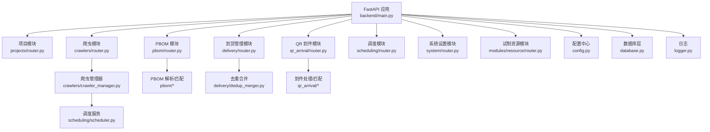
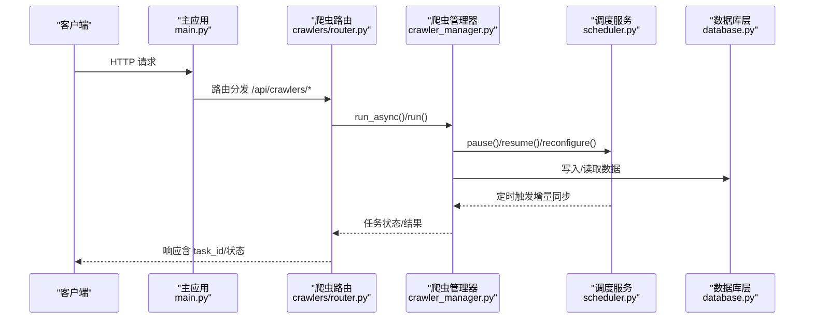
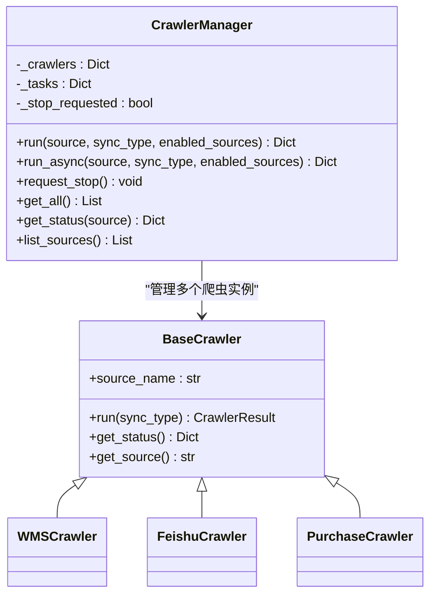
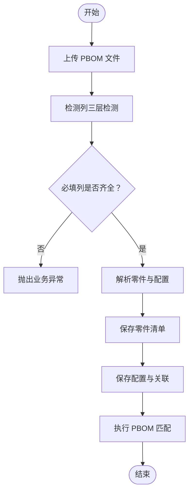
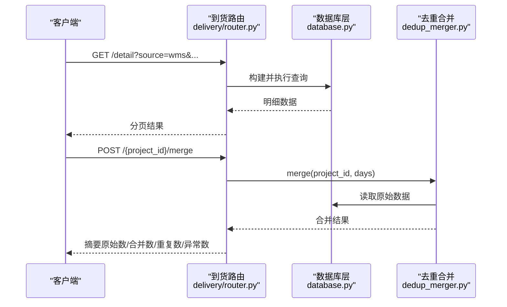
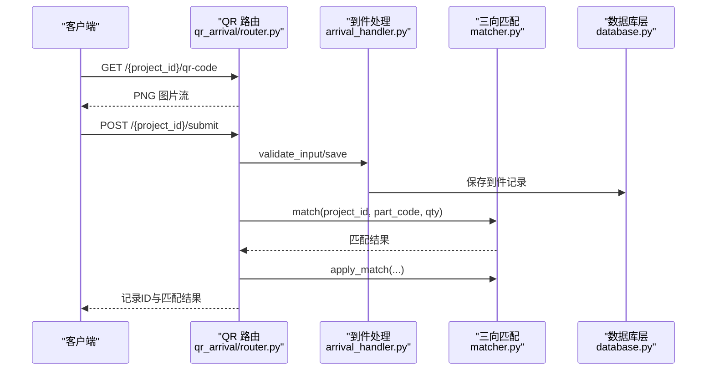
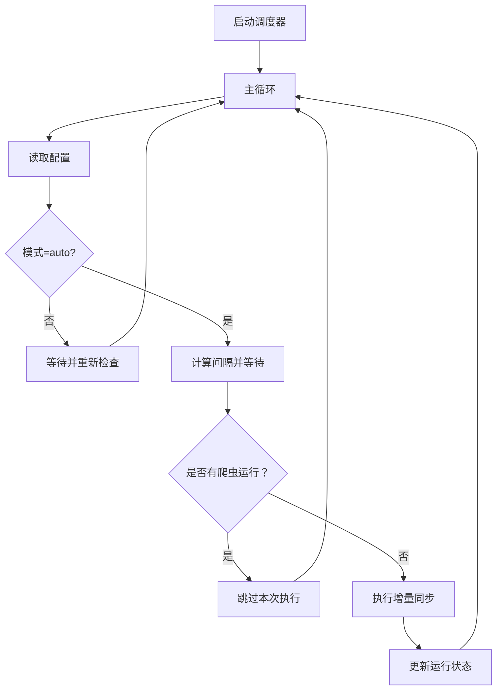
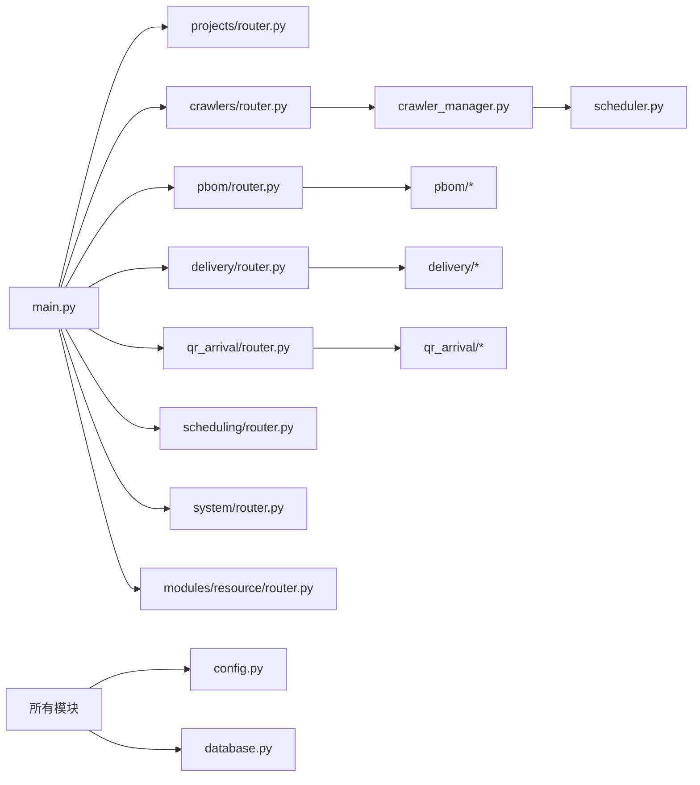

# 模块化设计

<cite>
**本文引用的文件**
- [backend/main.py](file://backend/main.py)
- [backend/config.py](file://backend/config.py)
- [backend/database.py](file://backend/database.py)
- [backend/logger.py](file://backend/logger.py)
- [backend/core/exceptions.py](file://backend/core/exceptions.py)
- [backend/crawlers/router.py](file://backend/crawlers/router.py)
- [backend/crawlers/crawler_manager.py](file://backend/crawlers/crawler_manager.py)
- [backend/crawlers/base.py](file://backend/crawlers/base.py)
- [backend/scheduling/scheduler.py](file://backend/scheduling/scheduler.py)
- [backend/pbom/router.py](file://backend/pbom/router.py)
- [backend/delivery/router.py](file://backend/delivery/router.py)
- [backend/qr_arrival/router.py](file://backend/qr_arrival/router.py)
- [backend/modules/resource/router.py](file://backend/modules/resource/router.py)
- [backend/projects/router.py](file://backend/projects/router.py)
- [backend/system/router.py](file://backend/system/router.py)
</cite>

## 目录
1. [简介](#简介)
2. [项目结构](#项目结构)
3. [核心组件](#核心组件)
4. [架构总览](#架构总览)
5. [详细组件分析](#详细组件分析)
6. [依赖关系分析](#依赖关系分析)
7. [性能考虑](#性能考虑)
8. [故障排查指南](#故障排查指南)
9. [结论](#结论)
10. [附录：模块扩展与集成规范](#附录模块扩展与集成规范)

## 简介
本文件面向后端系统的模块化设计，围绕项目模块、爬虫模块、PBOM解析模块、到货管理模块、调度模块等核心功能，系统阐述其组织结构、模块间依赖与通信机制、路由注册解耦方式、配置与环境变量隔离策略、扩展机制、数据共享协议与事件驱动通信模式，以及模块开发与集成规范。目标是帮助开发者在不影响现有系统的前提下，快速理解并安全扩展系统能力。

## 项目结构
后端采用按“业务域”划分的模块化组织方式，每个模块以 FastAPI Router 为对外边界，通过主应用统一注册路由实现解耦。关键目录与职责如下：
- backend/main.py：FastAPI 应用入口，集中注册各模块路由，处理启动/关闭生命周期、CORS、全局异常与静态资源托管。
- backend/config.py：集中式配置加载（基于 .env），提供 Settings 单例供全系统读取。
- backend/database.py：数据库连接池与通用 SQL 操作封装，所有模块通过该层访问数据。
- backend/logger.py：统一日志输出，支持分级与轮转。
- backend/core/exceptions.py：业务异常基类，配合全局异常处理器返回统一错误格式。
- 业务模块：
  - crawlers：爬虫管理与多源数据采集（WMS、飞书、采购）。
  - pbom：PBOM Excel 上传、列检测、解析与匹配。
  - delivery：多源到货数据查询、统计与去重合并。
  - qr_arrival：现场到件扫码录入、三向匹配与状态汇总。
  - projects：项目管理、PBOM 导入与缺件分析。
  - scheduling：后台定时调度器，自动增量同步。
  - system：系统设置、凭证管理与登录。
  - modules/resource：试制资源管理（设备、人员、任务等）的独立子模块。

**图表来源**
- [backend/main.py:18-83](file://backend/main.py#L18-L83)
- [backend/crawlers/crawler_manager.py:90-97](file://backend/crawlers/crawler_manager.py#L90-L97)
- [backend/scheduling/scheduler.py:16-74](file://backend/scheduling/scheduler.py#L16-L74)
- [backend/pbom/router.py:23-166](file://backend/pbom/router.py#L23-L166)
- [backend/delivery/router.py:28-259](file://backend/delivery/router.py#L28-L259)
- [backend/qr_arrival/router.py:14-88](file://backend/qr_arrival/router.py#L14-L88)
- [backend/config.py:48-101](file://backend/config.py#L48-L101)
- [backend/database.py:12-116](file://backend/database.py#L12-L116)
- [backend/logger.py:14-42](file://backend/logger.py#L14-L42)

**章节来源**
- [backend/main.py:18-83](file://backend/main.py#L18-L83)
- [backend/config.py:48-101](file://backend/config.py#L48-L101)
- [backend/database.py:12-116](file://backend/database.py#L12-L116)
- [backend/logger.py:14-42](file://backend/logger.py#L14-L42)

## 核心组件
- 应用入口与路由注册：在 main.py 中集中 include_router，将各模块以独立前缀暴露，便于独立部署与权限控制。
- 配置与环境变量：通过 config.py 的 Settings 类集中读取 .env，提供类型安全的配置项（数据库、爬虫间隔、WMS 接口、LLM、服务端口、CORS、上传目录等）。
- 数据库访问：database.py 提供连接池与常用 SQL 方法，所有模块通过该层访问数据，保证连接复用与事务一致性。
- 日志与异常：logger.py 提供统一日志；core/exceptions.py 定义业务异常，main.py 中全局处理返回标准 JSON。
- 爬虫与调度：crawler_manager.py 统一管理爬虫实例，支持同步/异步执行；scheduler.py 作为后台线程定时触发增量同步，避免与手动任务冲突。
- PBOM 解析：pbom/router.py 提供上传、列检测、解析与匹配接口，结合 excel_parser 与 matcher 完成结构化入库与匹配。
- 到货管理：delivery/router.py 提供明细查询、统计、状态分布与去重合并，支持 WMS 与飞书双源。
- QR 到件：qr_arrival/router.py 提供二维码生成、项目信息、提交到件、匹配与状态汇总。
- 试制资源：modules/resource/router.py 提供设备、人员、任务等资源的 CRUD 与看板统计，内部通过 services 层解耦。
- 项目管理：projects/router.py 提供项目 CRUD、PBOM 模板下载、项目级 PBOM 导入与缺件分析。
- 系统设置：system/router.py 提供凭证管理、登录获取 Token、参数更新等。

**章节来源**
- [backend/main.py:18-83](file://backend/main.py#L18-L83)
- [backend/config.py:48-101](file://backend/config.py#L48-L101)
- [backend/database.py:12-116](file://backend/database.py#L12-L116)
- [backend/core/exceptions.py:1-8](file://backend/core/exceptions.py#L1-L8)
- [backend/crawlers/crawler_manager.py:22-97](file://backend/crawlers/crawler_manager.py#L22-L97)
- [backend/scheduling/scheduler.py:16-74](file://backend/scheduling/scheduler.py#L16-L74)
- [backend/pbom/router.py:23-166](file://backend/pbom/router.py#L23-L166)
- [backend/delivery/router.py:28-259](file://backend/delivery/router.py#L28-L259)
- [backend/qr_arrival/router.py:14-88](file://backend/qr_arrival/router.py#L14-L88)
- [backend/modules/resource/router.py:47-800](file://backend/modules/resource/router.py#L47-L800)
- [backend/projects/router.py:20-231](file://backend/projects/router.py#L20-L231)
- [backend/system/router.py:52-109](file://backend/system/router.py#L52-L109)

## 架构总览
系统采用“路由即模块边界”的架构：每个业务域一个 Router，主应用负责聚合与生命周期管理。模块之间通过以下方式协作：
- 路由注册解耦：main.py 集中注册，新增模块只需新增 Router 并在 main.py include_router。
- 配置隔离：各模块通过 config.Settings 读取环境变量，避免硬编码。
- 数据共享：通过 database.py 提供的连接池与 SQL 方法共享数据。
- 事件驱动：爬虫模块与调度模块通过函数调用进行轻量事件通知（暂停/恢复/重新配置），避免紧耦合。
- 外部系统集成：通过 system 模块管理凭证与登录，爬虫模块按需调用外部 API。

**图表来源**
- [backend/main.py:18-83](file://backend/main.py#L18-L83)
- [backend/crawlers/router.py:16-40](file://backend/crawlers/router.py#L16-L40)
- [backend/crawlers/crawler_manager.py:134-197](file://backend/crawlers/crawler_manager.py#L134-L197)
- [backend/scheduling/scheduler.py:93-153](file://backend/scheduling/scheduler.py#L93-L153)
- [backend/database.py:12-116](file://backend/database.py#L12-L116)

**章节来源**
- [backend/main.py:18-83](file://backend/main.py#L18-L83)
- [backend/crawlers/router.py:16-40](file://backend/crawlers/router.py#L16-L40)
- [backend/crawlers/crawler_manager.py:134-197](file://backend/crawlers/crawler_manager.py#L134-L197)
- [backend/scheduling/scheduler.py:93-153](file://backend/scheduling/scheduler.py#L93-L153)
- [backend/database.py:12-116](file://backend/database.py#L12-L116)

## 详细组件分析

### 爬虫模块（crawlers）
- 目标：统一管理多源数据抓取（WMS、飞书、采购），支持同步阻塞与后台异步两种模式，提供任务状态查询与摘要。
- 关键设计：
  - BaseCrawler 抽象基类定义 run/get_status 接口，新增数据源仅需继承并注册。
  - CrawlerManager 维护爬虫实例字典，提供 run/run_async/_do_run 等统一入口，支持 enabled_sources 过滤。
  - router 暴露配置读写、状态查询、任务运行、调度器启停、停止任务等接口。
  - 与调度器的交互：通过 _notify_scheduler_* 函数调用 scheduler_service 的 pause/resume/reconfigure，实现松耦合的事件通知。

**图表来源**
- [backend/crawlers/base.py:12-67](file://backend/crawlers/base.py#L12-L67)
- [backend/crawlers/crawler_manager.py:22-97](file://backend/crawlers/crawler_manager.py#L22-L97)

**章节来源**
- [backend/crawlers/base.py:12-67](file://backend/crawlers/base.py#L12-L67)
- [backend/crawlers/crawler_manager.py:22-97](file://backend/crawlers/crawler_manager.py#L22-L97)
- [backend/crawlers/router.py:43-225](file://backend/crawlers/router.py#L43-L225)

### PBOM 解析模块（pbom）
- 目标：上传 PBOM Excel，自动检测列，解析零件与配置，保存至数据库，并与到货数据进行匹配。
- 关键流程：
  - 上传文件：校验扩展名，流式写入临时文件。
  - 列检测：使用 ThreeLayerColumnDetector 对表头进行三层检测，返回候选列及置信度。
  - 解析保存：提取零件与配置需求量，批量保存零件与配置关联。
  - 匹配：调用 PBOMMatcher 对项目进行匹配，返回匹配结果。

**图表来源**
- [backend/pbom/router.py:23-166](file://backend/pbom/router.py#L23-L166)

**章节来源**
- [backend/pbom/router.py:23-166](file://backend/pbom/router.py#L23-L166)

### 到货管理模块（delivery）
- 目标：提供多源到货数据的查询、统计、状态分布与去重合并。
- 关键能力：
  - 明细查询：支持分页、多字段筛选、精确/模糊匹配、时间范围、数据源选择（wms/feishu）。
  - 统计与分布：聚合 wms 与 feishu 数据，提供总量与状态分布。
  - 去重合并：基于五维键（项目号、零件号、数量、时间、单据号）进行合并，返回摘要。

**图表来源**
- [backend/delivery/router.py:41-259](file://backend/delivery/router.py#L41-L259)
- [backend/database.py:51-116](file://backend/database.py#L51-L116)

**章节来源**
- [backend/delivery/router.py:41-259](file://backend/delivery/router.py#L41-L259)

### QR 到件模块（qr_arrival）
- 目标：现场扫码录入到件信息，进行三向匹配，并提供项目到件状态汇总。
- 关键流程：
  - 生成二维码：返回 PNG 图片流。
  - 项目信息：根据 project_id 查询项目基本信息。
  - 提交到件：校验输入，保存记录，执行三向匹配并应用结果。
  - 记录与状态：列出到件记录与项目汇总状态。

**图表来源**
- [backend/qr_arrival/router.py:14-88](file://backend/qr_arrival/router.py#L14-L88)

**章节来源**
- [backend/qr_arrival/router.py:14-88](file://backend/qr_arrival/router.py#L14-L88)

### 调度模块（scheduling）
- 目标：后台定时调度器，按配置间隔自动执行增量同步，避免与手动任务冲突。
- 关键行为：
  - 启动/停止/暂停/恢复：通过线程与事件控制循环。
  - 配置重载：每次循环读取最新配置，支持动态调整。
  - 执行逻辑：检查是否有爬虫运行，若空闲则执行增量同步并更新状态。

**图表来源**
- [backend/scheduling/scheduler.py:34-74](file://backend/scheduling/scheduler.py#L34-L74)
- [backend/scheduling/scheduler.py:93-153](file://backend/scheduling/scheduler.py#L93-L153)

**章节来源**
- [backend/scheduling/scheduler.py:34-74](file://backend/scheduling/scheduler.py#L34-L74)
- [backend/scheduling/scheduler.py:93-153](file://backend/scheduling/scheduler.py#L93-L153)

### 试制资源模块（modules/resource）
- 目标：提供设备、人员、任务等资源的完整 CRUD 与看板统计，内部通过 services 层解耦业务逻辑。
- 关键能力：
  - 设备台账：增删改查、状态更新、维护记录、统计。
  - 人员管理：增删改查、状态切换、来源分布、地图覆盖层数据。
  - 任务管理：增删改查、状态分布、KPI 统计。
  - 健康检查：模块就绪状态与版本信息。

**章节来源**
- [backend/modules/resource/router.py:47-800](file://backend/modules/resource/router.py#L47-L800)

### 项目管理模块（projects）
- 目标：项目管理、PBOM 模板下载、项目级 PBOM 导入与缺件分析。
- 关键能力：
  - 项目 CRUD：创建、更新、删除、详情。
  - PBOM 导入：上传后自动识别列、解析零件与配置、执行匹配。
  - 缺件分析：分页查询缺件零件，支持关键词搜索与单据状态/仓库筛选。
  - 统计：项目维度统计（零件数、需求、到货、线边、匹配率）。

**章节来源**
- [backend/projects/router.py:20-231](file://backend/projects/router.py#L20-L231)

### 系统设置模块（system）
- 目标：凭证管理、登录获取 Token、参数更新。
- 关键能力：
  - 登录：WMS 登录与飞书应用登录。
  - 凭证：列表、创建/更新、删除、手动同步（复制 JWT/Cookie）。
  - 参数：列表与更新。

**章节来源**
- [backend/system/router.py:52-109](file://backend/system/router.py#L52-L109)

## 依赖关系分析
- 模块内聚与耦合：
  - 高内聚：每个模块聚焦单一业务域，Router 仅负责请求分发与参数校验，业务逻辑下沉至 services 或专用类（如 crawler_manager、pbom_matcher、dedup_merger）。
  - 低耦合：模块间通过主应用路由注册与函数调用进行松耦合通信，避免直接 import 业务对象。
- 直接依赖：
  - 所有模块依赖 config.Settings 与 database 层。
  - 爬虫模块依赖调度服务进行暂停/恢复/重新配置。
  - PBOM 模块依赖 excel_parser 与 matcher。
  - 到货模块依赖 dedup_merger。
  - QR 模块依赖 arrival_handler 与 matcher。
- 间接依赖：
  - 主应用依赖各模块 Router，但不感知内部实现细节。
  - 调度器通过函数调用与爬虫模块交互，不持有爬虫实例。
- 潜在循环依赖：
  - 通过延迟 import（如 router 中 from ... import scheduler_service）避免启动时循环依赖。

**图表来源**
- [backend/main.py:18-83](file://backend/main.py#L18-L83)
- [backend/crawlers/crawler_manager.py:90-97](file://backend/crawlers/crawler_manager.py#L90-L97)
- [backend/scheduling/scheduler.py:16-74](file://backend/scheduling/scheduler.py#L16-L74)
- [backend/pbom/router.py:23-166](file://backend/pbom/router.py#L23-L166)
- [backend/delivery/router.py:28-259](file://backend/delivery/router.py#L28-L259)
- [backend/qr_arrival/router.py:14-88](file://backend/qr_arrival/router.py#L14-L88)
- [backend/config.py:48-101](file://backend/config.py#L48-L101)
- [backend/database.py:12-116](file://backend/database.py#L12-L116)

**章节来源**
- [backend/main.py:18-83](file://backend/main.py#L18-L83)
- [backend/crawlers/crawler_manager.py:90-97](file://backend/crawlers/crawler_manager.py#L90-L97)
- [backend/scheduling/scheduler.py:16-74](file://backend/scheduling/scheduler.py#L16-L74)
- [backend/config.py:48-101](file://backend/config.py#L48-L101)
- [backend/database.py:12-116](file://backend/database.py#L12-L116)

## 性能考虑
- 数据库连接池：使用 PooledDB 限制最大连接数，避免连接泄漏；写操作失败时回滚，确保一致性。
- 异步爬虫：run_async 使用后台线程立即返回 task_id，前端轮询状态，提升用户体验。
- 调度器间隔：默认 30 分钟，可配置；避免频繁执行导致资源争用。
- 文件上传：分块写入临时文件，减少内存占用；上传后及时清理。
- 日志轮转：RotatingFileHandler 限制文件大小与保留数量，避免磁盘占满。
- 建议优化：
  - 对高频查询增加索引与缓存。
  - 对大文件解析使用流式处理与分批写入。
  - 对爬虫任务增加限流与重试机制。

[本节为通用性能指导，无需特定文件引用]

## 故障排查指南
- 数据库连接失败：检查 backend/.env 中的 DB_HOST/DB_PORT/DB_USER/DB_PASSWORD/DB_DATABASE；查看 database.py 初始化日志。
- 爬虫配置无效：确认 enabled_sources_list 与 crawler_mode；查看 crawler.router 与 scheduler 日志。
- PBOM 解析失败：检查必填列与表格格式；查看 pbom.router 与 excel_parser 日志。
- 到货合并异常：核对五维匹配键与数据源字段；查看 delivery.router 与 dedup_merger 日志。
- QR 到件匹配失败：确认项目存在与到件数据完整性；查看 qr_arrival.router 与 matcher 日志。
- 全局异常：BusinessError 会被 main.py 的全局处理器捕获，返回标准 JSON 错误。

**章节来源**
- [backend/database.py:12-43](file://backend/database.py#L12-L43)
- [backend/crawlers/router.py:43-225](file://backend/crawlers/router.py#L43-L225)
- [backend/pbom/router.py:23-166](file://backend/pbom/router.py#L23-L166)
- [backend/delivery/router.py:229-259](file://backend/delivery/router.py#L229-L259)
- [backend/qr_arrival/router.py:44-88](file://backend/qr_arrival/router.py#L44-L88)
- [backend/core/exceptions.py:1-8](file://backend/core/exceptions.py#L1-L8)
- [backend/main.py:85-97](file://backend/main.py#L85-L97)

## 结论
本系统通过“路由即模块边界”的设计实现了高内聚、低耦合的模块化架构。各模块通过统一的配置与数据库层共享资源，通过轻量事件通知实现松耦合通信。新增模块只需遵循路由注册与配置隔离规范，即可快速集成并独立部署。整体设计兼顾了可扩展性、可维护性与运行时稳定性。

[本节为总结性内容，无需特定文件引用]

## 附录：模块扩展与集成规范
- 新增模块步骤：
  1. 在 backend 下新建模块目录，包含 router.py、schemas.py、services/ 等。
  2. 在 router.py 中定义 APIRouter，实现业务接口。
  3. 在 main.py 中 include_router，指定 prefix 与 tags。
  4. 如需外部依赖，通过 config.Settings 读取环境变量，避免硬编码。
  5. 使用 database.py 进行数据访问，确保连接池与事务一致。
  6. 添加单元测试与集成测试，验证接口与数据一致性。
- 模块间通信：
  - 优先通过 HTTP 路由调用，保持松耦合。
  - 同进程内调用可通过函数调用（如爬虫与调度器），但避免循环 import。
  - 事件驱动：通过通知函数（如 _notify_scheduler_*）触发跨模块行为。
- 配置与环境变量隔离：
  - 所有配置项集中在 config.py 的 Settings 类中，使用 .env 管理。
  - 不同环境通过不同 .env 文件切换，避免代码变更。
- 数据共享协议：
  - 统一使用 Pydantic BaseModel 定义请求/响应模型，确保类型安全。
  - 数据库访问统一通过 database.py 的方法，避免 SQL 注入与连接泄漏。
- 集成指南：
  - 新增爬虫：继承 BaseCrawler，实现 run/get_status，在 crawler_manager._init_crawlers 中注册。
  - 新增 PBOM 解析：扩展 excel_parser 与 column_detector，保持向后兼容。
  - 新增到货规则：在 delivery/dedup_merger.py 中扩展匹配逻辑，保持五维键约定。
  - 新增资源实体：在 modules/resource/services 中添加 service，router 中暴露接口。

**章节来源**
- [backend/main.py:18-83](file://backend/main.py#L18-L83)
- [backend/config.py:48-101](file://backend/config.py#L48-L101)
- [backend/crawlers/base.py:51-67](file://backend/crawlers/base.py#L51-L67)
- [backend/crawlers/crawler_manager.py:90-97](file://backend/crawlers/crawler_manager.py#L90-L97)
- [backend/pbom/router.py:23-166](file://backend/pbom/router.py#L23-L166)
- [backend/delivery/router.py:229-259](file://backend/delivery/router.py#L229-L259)
- [backend/modules/resource/router.py:47-800](file://backend/modules/resource/router.py#L47-L800)