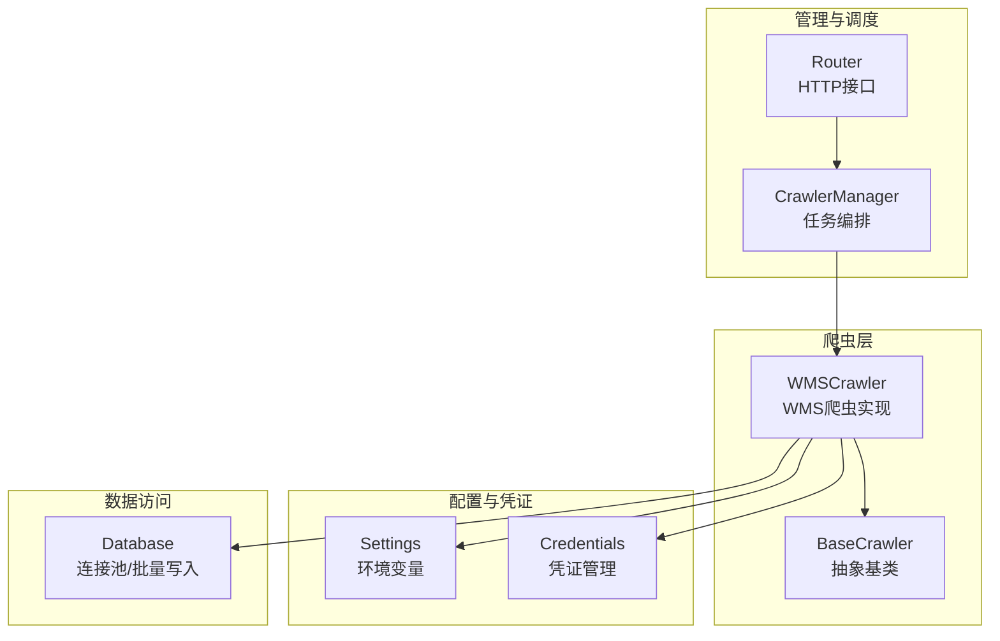
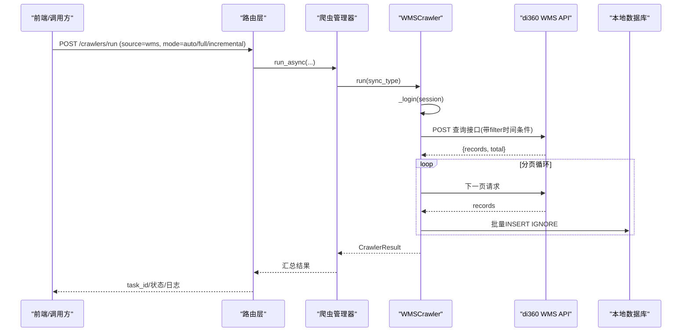
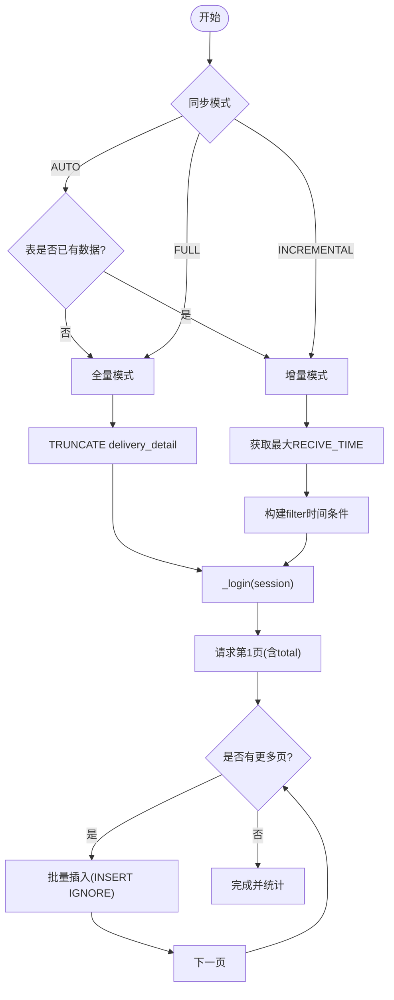
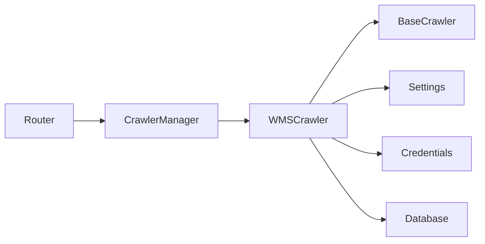

# WMS系统集成

<cite>
**本文引用的文件**
- [wms_crawler.py](file://backend/crawlers/wms_crawler.py)
- [base.py](file://backend/crawlers/base.py)
- [crawler_manager.py](file://backend/crawlers/crawler_manager.py)
- [router.py](file://backend/crawlers/router.py)
- [config.py](file://backend/config.py)
- [database.py](file://backend/database.py)
- [credentials.py](file://backend/system/credentials.py)
- [exceptions.py](file://backend/core/exceptions.py)
</cite>

## 目录
1. [简介](#简介)
2. [项目结构](#项目结构)
3. [核心组件](#核心组件)
4. [架构总览](#架构总览)
5. [详细组件分析](#详细组件分析)
6. [依赖关系分析](#依赖关系分析)
7. [性能考量](#性能考量)
8. [故障排查指南](#故障排查指南)
9. [结论](#结论)
10. [附录：配置参数说明](#附录：配置参数说明)

## 简介
本文件面向WMS系统集成的实现与运维，聚焦以下目标：
- 阐述WMS爬虫的实现原理：API认证机制、数据同步策略（全量/增量）、增量更新逻辑。
- 说明库存数据获取流程：仓库信息同步、物料主数据更新、库存状态查询（基于现有代码的边界说明）。
- 解释数据映射规则：将WMS数据结构转换为系统内部标准格式。
- 描述异常处理机制：网络超时重试、数据校验失败处理、部分数据回滚策略。
- 总结性能优化措施：分页查询、批量操作、连接池管理。
- 提供配置参数说明与故障排查指南。

## 项目结构
围绕WMS集成，后端主要涉及如下模块：
- 爬虫层：定义通用接口与具体WMS爬虫实现。
- 调度与管理：统一启动、停止、状态查询与任务编排。
- 配置与凭证：环境变量与数据库中的凭证管理。
- 数据访问：数据库连接池与批量写入封装。
- 路由层：对外暴露运行、状态、配置等接口。

图表来源
- [wms_crawler.py:44-122](file://backend/crawlers/wms_crawler.py#L44-L122)
- [base.py:12-67](file://backend/crawlers/base.py#L12-L67)
- [crawler_manager.py:22-95](file://backend/crawlers/crawler_manager.py#L22-L95)
- [router.py:43-147](file://backend/crawlers/router.py#L43-L147)
- [config.py:48-88](file://backend/config.py#L48-L88)
- [database.py:12-116](file://backend/database.py#L12-L116)
- [credentials.py:25-148](file://backend/system/credentials.py#L25-L148)

章节来源
- [wms_crawler.py:1-477](file://backend/crawlers/wms_crawler.py#L1-L477)
- [base.py:1-67](file://backend/crawlers/base.py#L1-L67)
- [crawler_manager.py:1-305](file://backend/crawlers/crawler_manager.py#L1-L305)
- [router.py:1-225](file://backend/crawlers/router.py#L1-L225)
- [config.py:1-102](file://backend/config.py#L1-L102)
- [database.py:1-116](file://backend/database.py#L1-L116)
- [credentials.py:1-573](file://backend/system/credentials.py#L1-L573)

## 核心组件
- WMSCrawler：实现di360 WMS的数据拉取、增量过滤、分页请求、批量入库、日志与进度上报。
- BaseCrawler：定义所有爬虫的统一接口（run/get_status）与结果模型。
- CrawlerManager：统一管理多个爬虫实例，支持同步/异步执行、停止、状态聚合。
- Router：暴露REST接口用于触发运行、查询状态、读取/保存配置。
- Settings：集中读取环境变量（数据库、WMS接口地址、服务端口等）。
- Database：封装PooledDB连接池与常用SQL操作（含批量写入）。
- Credentials：多源凭证管理，支持自动登录获取token或手动同步。

章节来源
- [wms_crawler.py:44-477](file://backend/crawlers/wms_crawler.py#L44-L477)
- [base.py:12-67](file://backend/crawlers/base.py#L12-L67)
- [crawler_manager.py:22-305](file://backend/crawlers/crawler_manager.py#L22-L305)
- [router.py:43-225](file://backend/crawlers/router.py#L43-L225)
- [config.py:48-102](file://backend/config.py#L48-L102)
- [database.py:12-116](file://backend/database.py#L12-L116)
- [credentials.py:25-148](file://backend/system/credentials.py#L25-L148)

## 架构总览
WMS集成通过HTTP API从di360 WMS拉取到货明细数据，按页获取并批量写入本地数据库；支持全量与增量两种模式，并通过时间戳进行增量过滤。凭证由系统设置维护，支持自动登录或手动粘贴Token/Cookie。

图表来源
- [router.py:89-147](file://backend/crawlers/router.py#L89-L147)
- [crawler_manager.py:134-197](file://backend/crawlers/crawler_manager.py#L134-L197)
- [wms_crawler.py:80-122](file://backend/crawlers/wms_crawler.py#L80-L122)
- [wms_crawler.py:154-213](file://backend/crawlers/wms_crawler.py#L154-L213)
- [wms_crawler.py:273-310](file://backend/crawlers/wms_crawler.py#L273-L310)
- [database.py:104-116](file://backend/database.py#L104-L116)

## 详细组件分析

### WMSCrawler：WMS爬虫实现
- API认证机制
  - 从数据库读取激活的凭证（authorization/cookie），注入到requests.Session的请求头中，禁用SSL校验以兼容内网环境。
  - 若缺少Authorization，直接返回失败并提示配置凭证。
- 数据同步策略
  - 全量同步：清空delivery_detail表后重新拉取全部数据。
  - 增量同步：根据数据库中最大RECIVE_TIME构造服务端filter，仅拉取大于该时间的记录。
  - 自动模式：首次检测表是否为空决定full/incremental。
- 增量更新逻辑
  - 读取最大RECIVE_TIME，必要时进行时区转换（UTC↔北京时间）后再传给API作为过滤条件。
  - 使用严格大于避免重复插入最后一条。
- 库存数据获取流程
  - 当前实现针对“到货明细”视图进行分页拉取与入库，未包含独立的仓库主数据、物料主数据、库存快照等专用接口；如需扩展，可在现有框架上增加新的抓取器或方法。
- 数据映射规则
  - 将API返回字段映射为delivery_detail表的固定列顺序，并对数值型字段做安全转换，对RECIVE_TIME进行时区规范化。
- 异常处理
  - 网络超时/连接错误采用指数退避重试（最多3次）。
  - 接口返回非成功码时记录告警并跳过该页。
  - 批量插入失败记录错误日志，不中断整体流程。
- 性能优化
  - 分页大小2000条，页间短休眠降低压力。
  - 使用INSERT IGNORE + executemany批量写入，减少IO与锁竞争。
  - requests.Session复用连接，减少握手开销。

图表来源
- [wms_crawler.py:313-467](file://backend/crawlers/wms_crawler.py#L313-L467)
- [wms_crawler.py:127-178](file://backend/crawlers/wms_crawler.py#L127-L178)
- [wms_crawler.py:216-271](file://backend/crawlers/wms_crawler.py#L216-L271)
- [wms_crawler.py:273-310](file://backend/crawlers/wms_crawler.py#L273-L310)

章节来源
- [wms_crawler.py:44-477](file://backend/crawlers/wms_crawler.py#L44-L477)

### BaseCrawler与结果模型
- 定义SyncType（auto/full/incremental）、CrawlerStatus（idle/running/success/failed/cancelled）与CrawlerResult（包含总数、新增、更新、消息、错误）。
- 抽象出run与get_status接口，便于扩展新数据源。

章节来源
- [base.py:12-67](file://backend/crawlers/base.py#L12-L67)

### CrawlerManager：任务编排
- 注册各数据源爬虫（wms/feishu/purchase）。
- 支持同步阻塞与后台线程异步执行，返回task_id供前端轮询。
- 提供停止标志，使正在运行的爬虫在下一检查点优雅退出。
- 汇总多源执行结果，计算总体状态（success/partial/failed）。

章节来源
- [crawler_manager.py:22-305](file://backend/crawlers/crawler_manager.py#L22-L305)

### Router：对外接口
- /crawlers/run：触发运行，支持source、sync_type、enabled_sources、force_full、blocking等参数。
- /crawlers/status：查询所有爬虫状态及配置。
- /crawlers/config：读取/保存爬虫调度配置（如间隔、启用源、自动登录开关等）。
- /crawlers/start_scheduler / stop_scheduler：启停自动调度器。
- /crawlers/stop：停止指定或全部爬虫。

章节来源
- [router.py:43-225](file://backend/crawlers/router.py#L43-L225)

### 配置与凭证
- Settings：集中加载.env变量，包括数据库、WMS接口地址、服务端口、CORS等。
- Credentials：
  - spider_login：模拟登录di360，提取token/cookie并持久化。
  - manual_sync_credentials：支持手动粘贴Token/Cookie或用户名密码。
  - list_credentials/get_credential：列出与获取凭证。
  - save_crawler_config/update_param：持久化爬虫调度参数。

章节来源
- [config.py:48-102](file://backend/config.py#L48-L102)
- [credentials.py:25-148](file://backend/system/credentials.py#L25-L148)
- [credentials.py:297-441](file://backend/system/credentials.py#L297-L441)

### 数据访问与连接池
- PooledDB：延迟初始化连接池，默认最大连接数10，最小缓存0，阻塞获取连接。
- 提供query_all/query_one/execute/execute_last_id/execute_all等封装，写操作失败自动回滚。
- 批量写入：execute_all底层executemany，配合INSERT IGNORE实现幂等入库。

章节来源
- [database.py:12-116](file://backend/database.py#L12-L116)

## 依赖关系分析
- WMSCrawler依赖：
  - BaseCrawler（接口契约）
  - Settings（WMS接口URL、超时等）
  - Credentials（凭证读取）
  - Database（查询上次同步时间、批量写入）
- CrawlerManager依赖：
  - 各爬虫实例（wms/feishu/purchase）
  - Logger（日志）
- Router依赖：
  - CrawlerManager（执行与状态）
  - Credentials（配置读写）
  - Scheduler（可选，启停自动调度）

图表来源
- [router.py:43-147](file://backend/crawlers/router.py#L43-L147)
- [crawler_manager.py:90-95](file://backend/crawlers/crawler_manager.py#L90-L95)
- [wms_crawler.py:20-25](file://backend/crawlers/wms_crawler.py#L20-L25)

章节来源
- [wms_crawler.py:20-25](file://backend/crawlers/wms_crawler.py#L20-L25)
- [crawler_manager.py:90-95](file://backend/crawlers/crawler_manager.py#L90-L95)
- [router.py:43-147](file://backend/crawlers/router.py#L43-L147)

## 性能考量
- 分页查询：PAGE_SIZE=2000，先请求第1页获取total，再按需翻页，避免一次性拉取过大负载。
- 批量操作：使用INSERT IGNORE + executemany批量写入，减少往返次数与锁竞争。
- 连接池管理：PooledDB限制最大连接数，避免数据库过载；写操作失败自动回滚保证一致性。
- 网络重试：指数退避重试（2^attempt秒），缓解瞬时网络抖动。
- 会话复用：requests.Session复用TCP连接，降低握手成本。
- 节流控制：页间短暂休眠，降低对WMS端压力。

[本节为通用性能建议，无需特定文件引用]

## 故障排查指南
- 无法登录或凭证无效
  - 现象：_login返回False，日志提示缺少Authorization。
  - 排查：确认spider_credentials中wms源is_active=1且存在有效authorization或cookie；或通过spider_login自动刷新。
  - 参考路径：[wms_crawler.py:64-109](file://backend/crawlers/wms_crawler.py#L64-L109)、[credentials.py:25-118](file://backend/system/credentials.py#L25-L118)
- 接口返回异常或无数据
  - 现象：接口code非200或success=false，或records为空。
  - 排查：检查QUERY_URL可达性、filter时间条件是否正确、WMS端权限与数据范围。
  - 参考路径：[wms_crawler.py:180-213](file://backend/crawlers/wms_crawler.py#L180-L213)
- 数据库写入失败
  - 现象：批量插入抛出异常。
  - 排查：检查数据库连接、表结构、字段类型；确认INSERT IGNORE约束是否满足。
  - 参考路径：[wms_crawler.py:273-310](file://backend/crawlers/wms_crawler.py#L273-L310)、[database.py:104-116](file://backend/database.py#L104-L116)
- 增量同步未生效
  - 现象：每次全量或重复数据。
  - 排查：确认数据库中RECIVE_TIME是否有效；检查时间转换逻辑（UTC↔北京时间）；核对filter构造。
  - 参考路径：[wms_crawler.py:216-271](file://backend/crawlers/wms_crawler.py#L216-L271)
- 任务被意外停止
  - 现象：状态为cancelled。
  - 排查：检查是否调用了停止接口或设置了停止标志；确认manager的停止标志传递。
  - 参考路径：[crawler_manager.py:39-88](file://backend/crawlers/crawler_manager.py#L39-L88)、[wms_crawler.py:401-414](file://backend/crawlers/wms_crawler.py#L401-L414)

章节来源
- [wms_crawler.py:64-109](file://backend/crawlers/wms_crawler.py#L64-L109)
- [wms_crawler.py:180-213](file://backend/crawlers/wms_crawler.py#L180-L213)
- [wms_crawler.py:216-271](file://backend/crawlers/wms_crawler.py#L216-L271)
- [wms_crawler.py:273-310](file://backend/crawlers/wms_crawler.py#L273-L310)
- [wms_crawler.py:401-414](file://backend/crawlers/wms_crawler.py#L401-L414)
- [crawler_manager.py:39-88](file://backend/crawlers/crawler_manager.py#L39-L88)
- [database.py:104-116](file://backend/database.py#L104-L116)
- [credentials.py:25-118](file://backend/system/credentials.py#L25-L118)

## 结论
本集成以WMSCrawler为核心，结合统一的爬虫基类、任务管理器与路由层，实现了WMS数据的稳定拉取与入库。通过增量过滤、分页与批量写入、连接池与重试机制，兼顾了可靠性与性能。后续可按需扩展仓库主数据、物料主数据、库存快照等能力，复用现有框架快速接入。

[本节为总结性内容，无需特定文件引用]

## 附录：配置参数说明
- 环境变量（Settings）
  - DB_HOST/DB_PORT/DB_USER/DB_PASSWORD/DB_DATABASE：数据库连接参数。
  - LOGIN_URL/QUERY_URL：WMS登录与查询接口地址。
  - SERVER_HOST/SERVER_PORT/DEBUG/CORS_ORIGINS：服务监听与调试选项。
  - QR_BASE_URL：二维码基础URL。
  - 参考路径：[config.py:48-88](file://backend/config.py#L48-L88)
- 爬虫调度配置（system_params）
  - crawler_mode：auto/manual。
  - crawler_incremental_interval_minutes：增量同步间隔（分钟）。
  - crawler_full_interval_hours：全量同步间隔（小时）。
  - crawler_enabled_sources：启用的数据源（逗号分隔）。
  - crawler_auto_login：是否自动登录刷新token（on/off）。
  - crawler_last_run_at/crawler_last_full_run_at/crawler_last_status：最近执行时间与状态。
  - 参考路径：[credentials.py:297-441](file://backend/system/credentials.py#L297-L441)
- 凭证管理
  - spider_login：自动登录获取token/cookie并持久化。
  - manual_sync_credentials：手动同步Token/Cookie或用户名密码。
  - list_credentials/get_credential：查看与获取凭证。
  - 参考路径：[credentials.py:25-148](file://backend/system/credentials.py#L25-L148)

章节来源
- [config.py:48-88](file://backend/config.py#L48-L88)
- [credentials.py:297-441](file://backend/system/credentials.py#L297-L441)
- [credentials.py:25-148](file://backend/system/credentials.py#L25-L148)