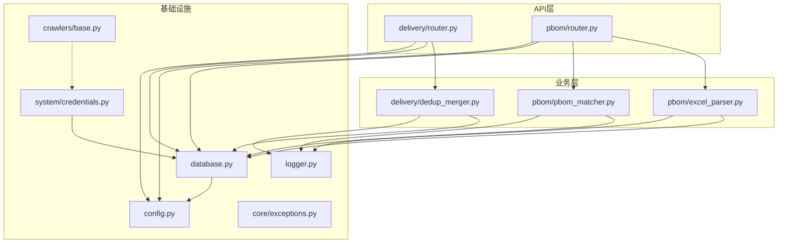
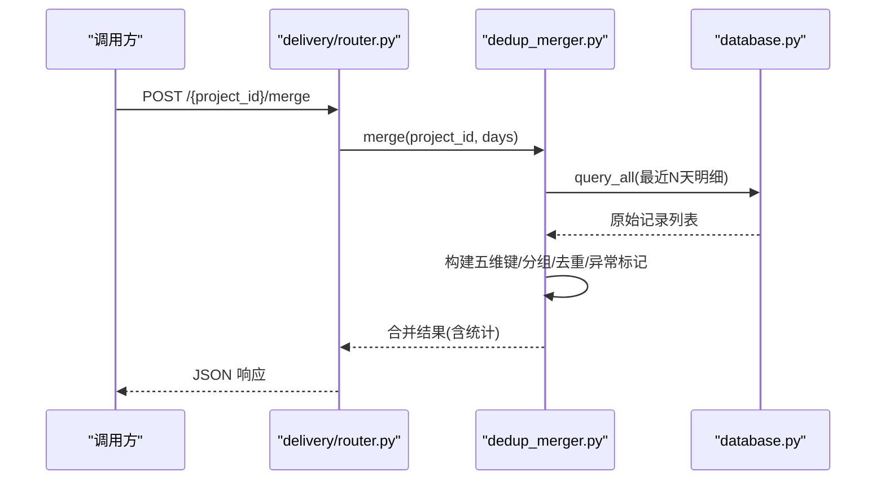
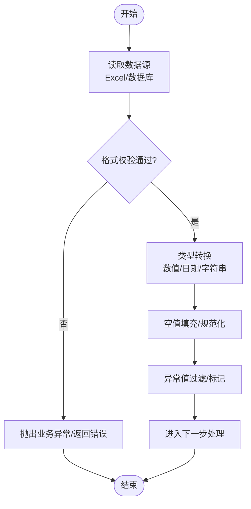
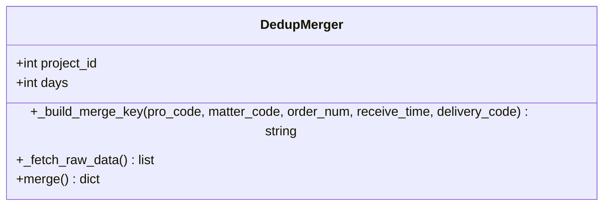
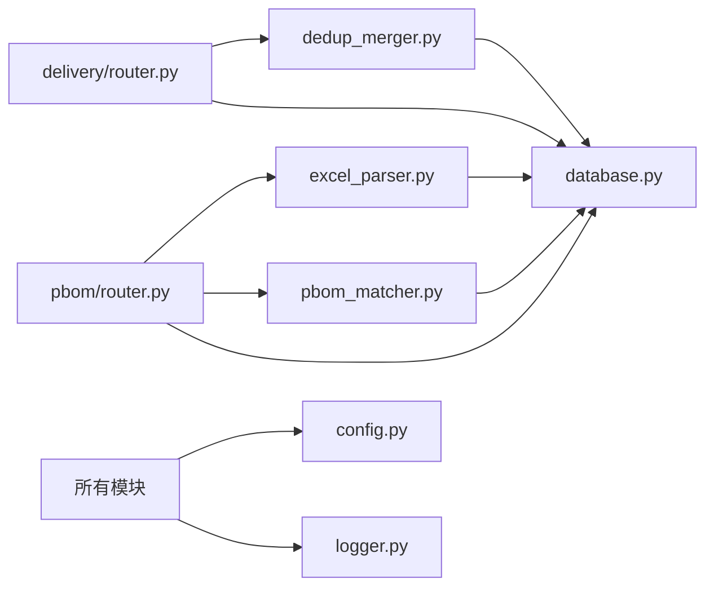

# 数据处理与转换

<cite>
**本文引用的文件**
- [backend/delivery/dedup_merger.py](file://backend/delivery/dedup_merger.py)
- [backend/delivery/router.py](file://backend/delivery/router.py)
- [backend/pbom/excel_parser.py](file://backend/pbom/excel_parser.py)
- [backend/pbom/pbom_matcher.py](file://backend/pbom/pbom_matcher.py)
- [backend/pbom/router.py](file://backend/pbom/router.py)
- [backend/database.py](file://backend/database.py)
- [backend/core/exceptions.py](file://backend/core/exceptions.py)
- [backend/config.py](file://backend/config.py)
- [backend/logger.py](file://backend/logger.py)
- [backend/crawlers/base.py](file://backend/crawlers/base.py)
- [backend/system/credentials.py](file://backend/system/credentials.py)
- [backend/qr_arrival/arrival_handler.py](file://backend/qr_arrival/arrival_handler.py)
</cite>

## 目录
1. [简介](#简介)
2. [项目结构](#项目结构)
3. [核心组件](#核心组件)
4. [架构总览](#架构总览)
5. [详细组件分析](#详细组件分析)
6. [依赖关系分析](#依赖关系分析)
7. [性能考虑](#性能考虑)
8. [故障排查指南](#故障排查指南)
9. [结论](#结论)
10. [附录](#附录)

## 简介
本文件围绕“数据处理与转换”目标，系统化阐述仓库数据清洗、合并、标准化、质量检查、批量处理优化、迁移工具与备份恢复策略。系统以 FastAPI 后端为核心，提供多源到货数据的采集、解析、去重合并、匹配统计等能力；通过连接池与事务封装保障并发与一致性；通过日志与异常体系支撑可观测性与可维护性。

## 项目结构
后端按功能域划分模块：
- delivery：多源到货数据查询、状态分布、去重合并
- pbom：PBOM Excel 解析、列检测、零件提取、匹配更新
- crawlers：爬虫基类与执行结果模型
- system：凭证管理与外部系统登录
- core：业务异常定义
- database：数据库连接池与统一访问接口
- config：全局配置与环境变量加载
- logger：统一日志输出

图表来源
- [backend/delivery/router.py:1-259](file://backend/delivery/router.py#L1-L259)
- [backend/pbom/router.py:1-166](file://backend/pbom/router.py#L1-L166)
- [backend/delivery/dedup_merger.py:1-128](file://backend/delivery/dedup_merger.py#L1-L128)
- [backend/pbom/pbom_matcher.py:1-240](file://backend/pbom/pbom_matcher.py#L1-L240)
- [backend/pbom/excel_parser.py:1-203](file://backend/pbom/excel_parser.py#L1-L203)
- [backend/database.py:1-116](file://backend/database.py#L1-L116)
- [backend/config.py:1-102](file://backend/config.py#L1-L102)
- [backend/logger.py:1-43](file://backend/logger.py#L1-L43)
- [backend/core/exceptions.py:1-8](file://backend/core/exceptions.py#L1-L8)
- [backend/crawlers/base.py:1-67](file://backend/crawlers/base.py#L1-L67)
- [backend/system/credentials.py:1-22](file://backend/system/credentials.py#L1-L22)

章节来源
- [backend/delivery/router.py:1-259](file://backend/delivery/router.py#L1-L259)
- [backend/pbom/router.py:1-166](file://backend/pbom/router.py#L1-L166)
- [backend/database.py:1-116](file://backend/database.py#L1-L116)
- [backend/config.py:1-102](file://backend/config.py#L1-L102)
- [backend/logger.py:1-43](file://backend/logger.py#L1-L43)

## 核心组件
- 去重合并器（DedupMerger）：基于五维键对多源到货数据进行分组、去重、异常标记与统计。
- PBOM 解析器（PBOMExcelParser）：读取 Excel、识别必填列、提取零件与需求量，支持配置列求和与合并。
- PBOM 匹配器（PBOMMatcher）：将 PBOM 零件与 WMS/飞书到货数据匹配，汇总已入库数量并更新项目统计。
- 数据库访问层（database）：连接池、统一查询/写入接口，带事务回滚与批量执行。
- 路由与校验（router/schemas）：FastAPI 路由、请求/响应模型、参数校验与错误返回。
- 爬虫基类（BaseCrawler/CrawlerResult）：统一爬取接口与结果模型，便于扩展新数据源。
- 凭证管理（system/credentials）：多数据源凭证与自动登录获取 token。
- 日志与配置（logger/config）：统一日志轮转与全局配置加载。

章节来源
- [backend/delivery/dedup_merger.py:1-128](file://backend/delivery/dedup_merger.py#L1-L128)
- [backend/pbom/excel_parser.py:1-203](file://backend/pbom/excel_parser.py#L1-L203)
- [backend/pbom/pbom_matcher.py:1-240](file://backend/pbom/pbom_matcher.py#L1-L240)
- [backend/database.py:1-116](file://backend/database.py#L1-L116)
- [backend/crawlers/base.py:1-67](file://backend/crawlers/base.py#L1-L67)
- [backend/system/credentials.py:1-22](file://backend/system/credentials.py#L1-L22)
- [backend/logger.py:1-43](file://backend/logger.py#L1-L43)
- [backend/config.py:1-102](file://backend/config.py#L1-L102)

## 架构总览
系统采用分层架构：
- API 层：FastAPI 路由暴露查询、上传、解析、匹配、合并等接口。
- 业务层：去重合并、PBOM 解析与匹配、到件信息校验等。
- 数据层：MySQL 通过连接池访问，提供事务化写操作与批量执行。
- 支撑层：配置、日志、异常、凭证管理等。

图表来源
- [backend/delivery/router.py:229-244](file://backend/delivery/router.py#L229-L244)
- [backend/delivery/dedup_merger.py:48-128](file://backend/delivery/dedup_merger.py#L48-L128)
- [backend/database.py:51-59](file://backend/database.py#L51-L59)

## 详细组件分析

### 数据清洗流程（格式验证、类型转换、空值处理、异常值过滤）
- 格式验证
  - PBOM Excel 必填列检测：识别“零件号/零件名称/需求量”等列，缺失时抛出业务异常。
  - 到件录入校验：零件号非空且长度限制、到货数量为正整数、时间格式校验、备注长度限制。
- 类型转换
  - Excel 数值列使用 to_numeric 安全转换，非法值回退为 0。
  - 日期字段兼容多种输入格式，统一转为标准字符串或 datetime。
- 空值处理
  - 状态字段空值规范化为“未标注”，便于统计与展示。
  - 缺失需求量列时默认需求量为 0。
- 异常值过滤
  - 合并阶段同一合并键下数量不一致标记为异常，便于后续人工核查。
  - 飞书状态中的 "#N/A"/"N/A" 归一化为“未到货”。

章节来源
- [backend/pbom/excel_parser.py:40-100](file://backend/pbom/excel_parser.py#L40-L100)
- [backend/pbom/excel_parser.py:126-187](file://backend/pbom/excel_parser.py#L126-L187)
- [backend/qr_arrival/arrival_handler.py:10-47](file://backend/qr_arrival/arrival_handler.py#L10-L47)
- [backend/delivery/router.py:18-25](file://backend/delivery/router.py#L18-L25)
- [backend/delivery/router.py:204-226](file://backend/delivery/router.py#L204-L226)
- [backend/core/exceptions.py:1-8](file://backend/core/exceptions.py#L1-L8)

### 数据合并策略（去重算法、冲突解决、版本控制）
- 去重算法
  - 五维合并键：(项目号, 零件号, 数量, 时间(天级), 单据号)。同一天内相同五维视为重复。
  - 分组聚合：按合并键分组，收集来源集合与数量集合。
- 冲突解决
  - 多源重复：当来源数 > 1 标记为重复，保留首条记录作为代表。
  - 数量不一致：当组内数量集合大小 > 1 标记为异常，供后续处理。
- 版本控制
  - 当前实现以“最新时间优先”的排序进行分组与选择，体现“近者优先”的版本策略。
  - 可在未来扩展版本号字段或时间戳比较逻辑以支持更细粒度版本控制。

图表来源
- [backend/delivery/dedup_merger.py:7-128](file://backend/delivery/dedup_merger.py#L7-L128)

章节来源
- [backend/delivery/dedup_merger.py:21-34](file://backend/delivery/dedup_merger.py#L21-L34)
- [backend/delivery/dedup_merger.py:36-46](file://backend/delivery/dedup_merger.py#L36-L46)
- [backend/delivery/dedup_merger.py:48-128](file://backend/delivery/dedup_merger.py#L48-L128)

### 数据标准化过程（统一格式与编码）
- 状态标准化
  - WMS 状态空值/空白统一为“未标注”，并按数据库真实状态枚举排序统计。
  - 飞书状态中无效值统一为“未到货”。
- 编码与字符集
  - 数据库连接使用 utf8mb4，确保中文等多字节字符正确存储。
- 字段映射
  - Excel 列名通过关键词匹配映射为标准字段（如零件号、零件名称、需求量）。
  - 不同来源字段差异在查询层进行适配（WMS vs 飞书）。

章节来源
- [backend/delivery/router.py:14-25](file://backend/delivery/router.py#L14-L25)
- [backend/delivery/router.py:167-201](file://backend/delivery/router.py#L167-L201)
- [backend/delivery/router.py:204-226](file://backend/delivery/router.py#L204-L226)
- [backend/pbom/excel_parser.py:50-83](file://backend/pbom/excel_parser.py#L50-L83)
- [backend/database.py:20-33](file://backend/database.py#L20-L33)

### 数据质量检查机制（完整性、一致性、业务规则）
- 完整性验证
  - PBOM 必填列检测，缺失时报错阻止后续流程。
  - 到件录入字段完整性校验（零件号、数量、时间）。
- 一致性检查
  - 合并阶段数量不一致标记异常，提示数据源间不一致。
  - 项目维度统计（到货率、缺料数）用于一致性监控。
- 业务规则校验
  - 数量必须为正整数，时间格式必须符合规范。
  - 状态枚举约束与排序，保证前端展示一致。

章节来源
- [backend/pbom/router.py:50-78](file://backend/pbom/router.py#L50-L78)
- [backend/pbom/router.py:88-144](file://backend/pbom/router.py#L88-L144)
- [backend/qr_arrival/arrival_handler.py:10-47](file://backend/qr_arrival/arrival_handler.py#L10-L47)
- [backend/delivery/dedup_merger.py:79-115](file://backend/delivery/dedup_merger.py#L79-L115)
- [backend/pbom/pbom_matcher.py:216-224](file://backend/pbom/pbom_matcher.py#L216-L224)

### 批量处理优化（内存管理、并发处理、事务控制）
- 内存管理
  - Excel 解析使用 pandas DataFrame，适合中等规模数据；大文件建议分块或流式处理。
  - 合并过程使用字典分组，避免全量排序带来的额外开销。
- 并发处理
  - 数据库连接池复用连接，减少握手开销；最大连接数与缓存连接数可调。
  - 异步上传文件，降低阻塞。
- 事务控制
  - 写操作统一封装 execute/execute_last_id/execute_all，失败自动回滚。
  - 批量写入使用 executemany，提升吞吐。

章节来源
- [backend/database.py:12-43](file://backend/database.py#L12-L43)
- [backend/database.py:73-116](file://backend/database.py#L73-L116)
- [backend/pbom/router.py:23-47](file://backend/pbom/router.py#L23-L47)
- [backend/pbom/excel_parser.py:24-38](file://backend/pbom/excel_parser.py#L24-L38)

### 数据迁移工具与方法（历史导入、格式升级）
- 历史导入
  - 通过 PBOM Excel 解析接口上传历史 BOM，经列检测确认后保存至数据库。
  - 到件数据可通过 WMS/飞书同步脚本导入（爬虫基类可扩展新数据源）。
- 格式升级
  - 列名映射与关键词匹配支持不同版本的表头格式。
  - 状态与字段标准化确保新旧数据兼容。

章节来源
- [backend/pbom/router.py:23-47](file://backend/pbom/router.py#L23-L47)
- [backend/pbom/router.py:50-78](file://backend/pbom/router.py#L50-L78)
- [backend/pbom/router.py:88-144](file://backend/pbom/router.py#L88-L144)
- [backend/crawlers/base.py:12-67](file://backend/crawlers/base.py#L12-L67)

### 数据备份与恢复策略（安全性与可追溯性）
- 备份
  - 建议使用数据库原生备份工具（如 mysqldump）定期导出全量与增量备份。
  - 结合日志文件（logs/*.log）保留关键操作轨迹，便于审计与回溯。
- 恢复
  - 从备份文件恢复数据库后，重新运行 PBOM 解析与匹配流程以重建统计。
  - 若涉及外部系统凭证变更，需更新 credentials 并重新获取 token。

章节来源
- [backend/logger.py:14-38](file://backend/logger.py#L14-L38)
- [backend/system/credentials.py:1-22](file://backend/system/credentials.py#L1-L22)

## 依赖关系分析
- 模块耦合
  - delivery/router 依赖 dedup_merger 与 database。
  - pbom/router 依赖 excel_parser、pbom_matcher 与 database。
  - 各模块共享 config 与 logger。
- 外部依赖
  - MySQL 通过 pymysql 连接，dbutils 提供连接池。
  - pandas/openpyxl/xlrd 用于 Excel 解析。
  - FastAPI 提供路由与请求模型。

图表来源
- [backend/delivery/router.py:1-259](file://backend/delivery/router.py#L1-L259)
- [backend/pbom/router.py:1-166](file://backend/pbom/router.py#L1-L166)
- [backend/delivery/dedup_merger.py:1-128](file://backend/delivery/dedup_merger.py#L1-L128)
- [backend/pbom/excel_parser.py:1-203](file://backend/pbom/excel_parser.py#L1-L203)
- [backend/pbom/pbom_matcher.py:1-240](file://backend/pbom/pbom_matcher.py#L1-L240)
- [backend/database.py:1-116](file://backend/database.py#L1-L116)
- [backend/config.py:1-102](file://backend/config.py#L1-L102)
- [backend/logger.py:1-43](file://backend/logger.py#L1-L43)

章节来源
- [backend/delivery/router.py:1-259](file://backend/delivery/router.py#L1-L259)
- [backend/pbom/router.py:1-166](file://backend/pbom/router.py#L1-L166)
- [backend/database.py:1-116](file://backend/database.py#L1-L116)

## 性能考虑
- 数据库连接池
  - 最大连接数与缓存连接数可根据负载调整，避免连接耗尽或过多上下文切换。
- 查询优化
  - 分页与条件过滤减少数据传输量；时间范围过滤提升查询效率。
- 解析优化
  - 大 Excel 文件建议分块读取或使用更高效引擎；必要时引入流式处理。
- 批处理
  - 批量写入使用 executemany，减少往返次数；注意批次大小与内存占用平衡。

[本节为通用指导，不直接分析具体文件]

## 故障排查指南
- 数据库连接失败
  - 检查 .env 配置是否正确（主机、端口、用户、密码、库名）。
  - 查看日志中连接池初始化失败的详细信息。
- 解析失败
  - 确认 Excel 必填列存在；检查列名是否匹配关键词。
  - 查看解析日志定位具体行与列的错误原因。
- 合并异常
  - 关注“异常记录数”与“重复记录数”，核对数据来源与时间字段。
  - 检查状态字段是否为空或包含无效值。
- 凭证问题
  - 确认外部系统凭证有效，必要时重新获取 token。

章节来源
- [backend/database.py:12-43](file://backend/database.py#L12-L43)
- [backend/pbom/router.py:50-78](file://backend/pbom/router.py#L50-L78)
- [backend/delivery/dedup_merger.py:117-128](file://backend/delivery/dedup_merger.py#L117-L128)
- [backend/system/credentials.py:1-22](file://backend/system/credentials.py#L1-L22)
- [backend/logger.py:14-38](file://backend/logger.py#L14-L38)

## 结论
本系统提供了完整的数据处理与转换能力：从多源数据采集、格式校验与类型转换，到空值处理与异常标记；从五维去重合并与冲突处理，到 PBOM 匹配与项目统计；从批量写入与事务控制，到日志与异常的可观测性。建议在大数据量场景下进一步优化解析与查询，并完善备份恢复流程以确保数据安全与可追溯性。

[本节为总结性内容，不直接分析具体文件]

## 附录
- 常用接口
  - 到货详情查询：GET /detail
  - 到货统计：GET /stats
  - 状态分布：GET /state-distribution、GET /feishu-state-distribution
  - 去重合并：POST /{project_id}/merge
  - 合并摘要：GET /{project_id}/merge-summary
  - PBOM 上传与解析：POST /upload、POST /detect-columns、POST /parse
  - PBOM 匹配：POST /{project_id}/match

章节来源
- [backend/delivery/router.py:28-118](file://backend/delivery/router.py#L28-L118)
- [backend/delivery/router.py:121-226](file://backend/delivery/router.py#L121-L226)
- [backend/delivery/router.py:229-259](file://backend/delivery/router.py#L229-L259)
- [backend/pbom/router.py:23-166](file://backend/pbom/router.py#L23-L166)