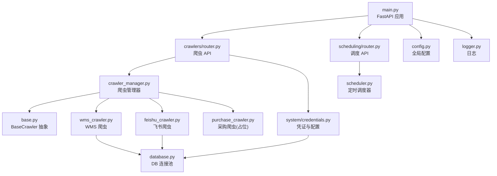
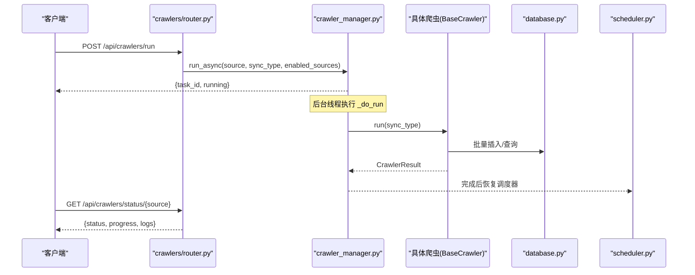
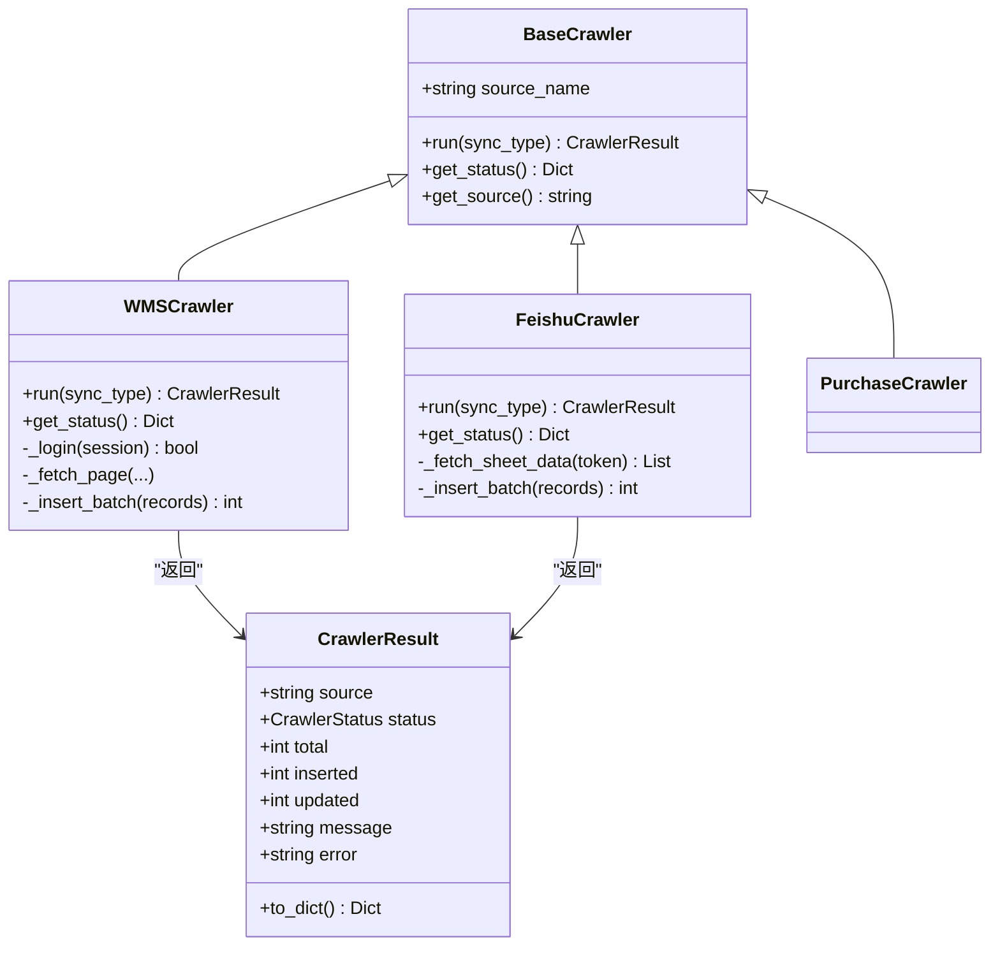
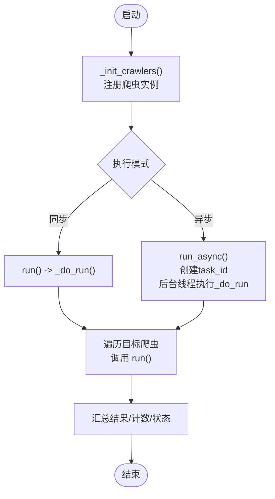
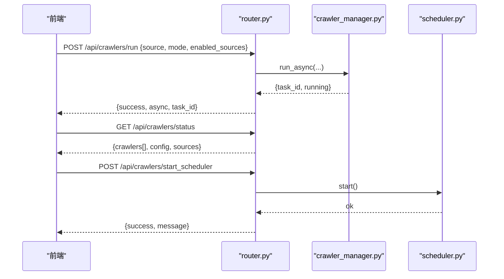
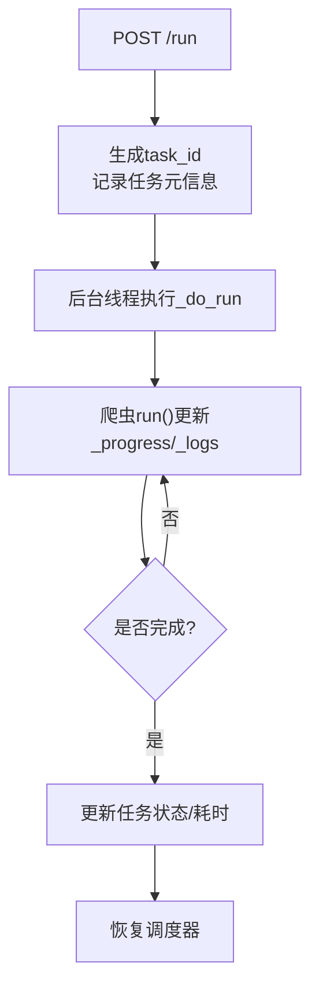
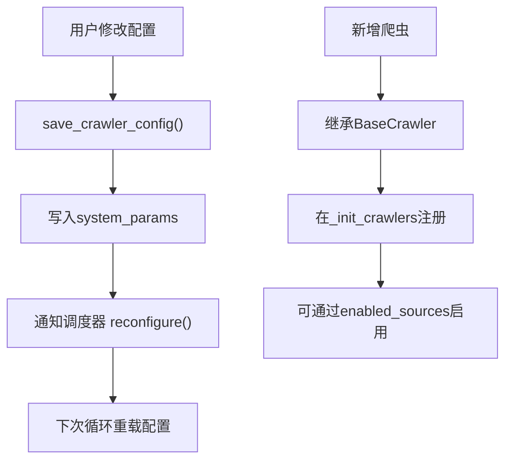
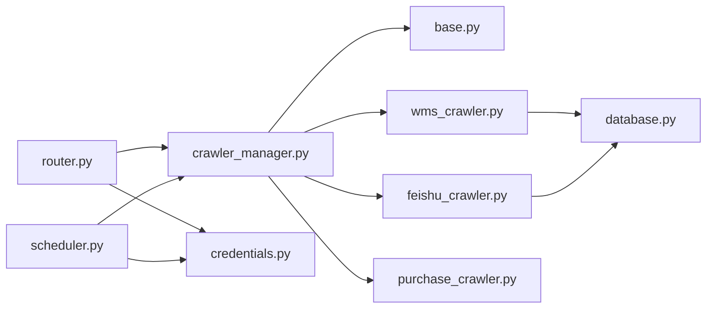

# 爬虫架构设计

<cite>
**本文引用的文件**
- [backend/crawlers/base.py](file://backend/crawlers/base.py)
- [backend/crawlers/crawler_manager.py](file://backend/crawlers/crawler_manager.py)
- [backend/crawlers/router.py](file://backend/crawlers/router.py)
- [backend/crawlers/wms_crawler.py](file://backend/crawlers/wms_crawler.py)
- [backend/crawlers/feishu_crawler.py](file://backend/crawlers/feishu_crawler.py)
- [backend/crawlers/purchase_crawler.py](file://backend/crawlers/purchase_crawler.py)
- [backend/system/credentials.py](file://backend/system/credentials.py)
- [backend/scheduling/scheduler.py](file://backend/scheduling/scheduler.py)
- [backend/config.py](file://backend/config.py)
- [backend/database.py](file://backend/database.py)
- [backend/logger.py](file://backend/logger.py)
- [backend/main.py](file://backend/main.py)
</cite>

## 目录
1. [简介](#简介)
2. [项目结构](#项目结构)
3. [核心组件](#核心组件)
4. [架构总览](#架构总览)
5. [详细组件分析](#详细组件分析)
6. [依赖关系分析](#依赖关系分析)
7. [性能与扩展性](#性能与扩展性)
8. [故障排查指南](#故障排查指南)
9. [结论](#结论)
10. [附录：API 规范](#附录api-规范)

## 简介
本仓库实现了一个可扩展的爬虫系统，提供统一的基础爬虫抽象、爬虫管理器（注册、调度、监控、并发控制）、REST 路由层、异步执行机制、配置管理（含动态数据源适配器）以及定时调度器。系统支持多数据源（WMS、飞书共享表、采购系统），具备增量/全量同步、错误重试、进度与日志实时反馈、运行时配置更新等能力。

## 项目结构
后端采用模块化分层组织：
- crawlers：基础抽象、具体爬虫实现、爬虫管理器、路由
- system：凭证与爬虫配置管理
- scheduling：后台定时调度服务
- config：全局配置加载
- database：数据库连接池与通用操作
- logger：统一日志
- main：FastAPI 应用入口、中间件、路由挂载、生命周期钩子

图表来源
- [backend/main.py:1-159](file://backend/main.py#L1-L159)
- [backend/crawlers/router.py:1-225](file://backend/crawlers/router.py#L1-L225)
- [backend/crawlers/crawler_manager.py:1-305](file://backend/crawlers/crawler_manager.py#L1-L305)
- [backend/crawlers/base.py:1-67](file://backend/crawlers/base.py#L1-L67)
- [backend/crawlers/wms_crawler.py:1-477](file://backend/crawlers/wms_crawler.py#L1-L477)
- [backend/crawlers/feishu_crawler.py:1-419](file://backend/crawlers/feishu_crawler.py#L1-L419)
- [backend/crawlers/purchase_crawler.py:1-49](file://backend/crawlers/purchase_crawler.py#L1-L49)
- [backend/system/credentials.py:1-573](file://backend/system/credentials.py#L1-L573)
- [backend/scheduling/scheduler.py:1-196](file://backend/scheduling/scheduler.py#L1-L196)
- [backend/config.py:1-102](file://backend/config.py#L1-L102)
- [backend/database.py:1-116](file://backend/database.py#L1-L116)
- [backend/logger.py:1-43](file://backend/logger.py#L1-L43)

章节来源
- [backend/main.py:1-159](file://backend/main.py#L1-L159)
- [backend/config.py:1-102](file://backend/config.py#L1-L102)

## 核心组件
- 基础爬虫抽象：定义统一接口、状态枚举、结果对象，约束生命周期与返回格式
- 爬虫管理器：集中注册爬虫实例、任务元信息跟踪、同步/异步执行、停止标志、状态聚合
- 路由层：暴露配置读写、运行/停止、状态查询、摘要统计、调度器启停等 REST 接口
- 具体爬虫：WMS 与飞书已实现；采购系统为占位实现
- 配置与凭证：系统参数持久化、自动登录刷新 token、启用数据源列表
- 定时调度器：后台线程按配置间隔执行增量同步，避免与手动任务冲突
- 数据库：连接池、批量写入、事务回滚
- 日志：文件+控制台双输出，滚动保留

章节来源
- [backend/crawlers/base.py:1-67](file://backend/crawlers/base.py#L1-L67)
- [backend/crawlers/crawler_manager.py:1-305](file://backend/crawlers/crawler_manager.py#L1-L305)
- [backend/crawlers/router.py:1-225](file://backend/crawlers/router.py#L1-L225)
- [backend/system/credentials.py:1-573](file://backend/system/credentials.py#L1-L573)
- [backend/scheduling/scheduler.py:1-196](file://backend/scheduling/scheduler.py#L1-L196)
- [backend/database.py:1-116](file://backend/database.py#L1-L116)
- [backend/logger.py:1-43](file://backend/logger.py#L1-L43)

## 架构总览
系统以 FastAPI 为入口，将爬虫相关路由挂载到 /api/crawlers。请求进入后由路由层解析参数并调用爬虫管理器。管理器根据 source/enabled_sources 选择具体爬虫实例执行，支持同步阻塞或后台线程异步执行。异步模式下返回 task_id，前端轮询状态接口获取实时日志与进度。定时调度器在后台独立运行，按配置周期触发增量同步，并在手动触发时暂停以避免冲突。

图表来源
- [backend/crawlers/router.py:89-147](file://backend/crawlers/router.py#L89-L147)
- [backend/crawlers/crawler_manager.py:134-197](file://backend/crawlers/crawler_manager.py#L134-L197)
- [backend/crawlers/wms_crawler.py:313-467](file://backend/crawlers/wms_crawler.py#L313-L467)
- [backend/crawlers/feishu_crawler.py:251-409](file://backend/crawlers/feishu_crawler.py#L251-L409)
- [backend/scheduling/scheduler.py:155-192](file://backend/scheduling/scheduler.py#L155-L192)

## 详细组件分析

### 基础爬虫类与生命周期
- 抽象接口
  - BaseCrawler 定义 run(sync_type) 和 get_status() 两个必须实现的方法，并提供 get_source() 默认实现
  - SyncType 枚举：auto/full/incremental
  - CrawlerStatus 枚举：idle/running/success/failed/cancelled
  - CrawlerResult 封装执行结果（total/inserted/updated/message/error）
- 生命周期管理
  - 每个爬虫维护 _status、_logs、_progress、_stop_requested、_last_result
  - run 开始时置 RUNNING，结束时置 SUCCESS/FAILED/CANCELLED
  - 支持外部设置 _stop_requested 优雅退出
- 错误处理
  - 网络异常、超时、连接失败均捕获并记录日志
  - 批量入库失败回滚并记录错误
  - 最终返回 FAILED 状态及错误信息

图表来源
- [backend/crawlers/base.py:12-67](file://backend/crawlers/base.py#L12-L67)
- [backend/crawlers/wms_crawler.py:44-477](file://backend/crawlers/wms_crawler.py#L44-L477)
- [backend/crawlers/feishu_crawler.py:55-419](file://backend/crawlers/feishu_crawler.py#L55-L419)
- [backend/crawlers/purchase_crawler.py:12-49](file://backend/crawlers/purchase_crawler.py#L12-L49)

章节来源
- [backend/crawlers/base.py:1-67](file://backend/crawlers/base.py#L1-L67)
- [backend/crawlers/wms_crawler.py:1-477](file://backend/crawlers/wms_crawler.py#L1-L477)
- [backend/crawlers/feishu_crawler.py:1-419](file://backend/crawlers/feishu_crawler.py#L1-L419)
- [backend/crawlers/purchase_crawler.py:1-49](file://backend/crawlers/purchase_crawler.py#L1-L49)

### 爬虫管理器：注册、调度、监控、并发控制
- 实例注册
  - _init_crawlers 中集中注册 wms/feishu/purchase 三个爬虫实例
- 任务调度
  - run：同步阻塞执行（兼容旧逻辑）
  - run_async：立即返回 task_id，后台线程执行 _do_run，支持前端轮询
  - _do_run：内部统一执行逻辑，支持单源/全部/指定 enabled_sources
- 状态监控
  - get_all/get_status：聚合各爬虫状态（含 progress/logs）
  - is_any_running：判断是否有爬虫正在运行
- 并发控制与优雅停止
  - request_stop/reset_stop_flag：设置全局停止标志，通知所有爬虫退出循环
  - stop_source：停止指定数据源爬虫
- 任务元信息
  - _tasks：task_id -> {running/start_time/end_time/result/status/error}

图表来源
- [backend/crawlers/crawler_manager.py:31-305](file://backend/crawlers/crawler_manager.py#L31-L305)

章节来源
- [backend/crawlers/crawler_manager.py:1-305](file://backend/crawlers/crawler_manager.py#L1-L305)

### 路由层：API 接口规范、参数验证、响应标准化
- 配置接口
  - GET /api/crawlers/config：读取爬虫同步配置
  - POST /api/crawlers/config：保存配置并通知调度器重载
- 运行与状态
  - POST /api/crawlers/run：异步执行（默认），支持 blocking=true 切换同步
  - GET /api/crawlers/status：获取所有爬虫状态与当前配置
  - GET /api/crawlers/status/{source}：获取指定爬虫状态
  - GET /api/crawlers/task/{task_id}：获取任务元信息
  - GET /api/crawlers/summary：页面顶部摘要（含调度器状态）
- 调度器控制
  - POST /api/crawlers/start_scheduler：启动自动调度
  - POST /api/crawlers/stop_scheduler：停止自动调度
  - POST /api/crawlers/stop：停止正在运行的爬虫（可指定 source）
- 参数说明
  - run 请求体可选字段：source/sync_type/mode/type/enabled_sources/force_full/blocking
- 响应格式
  - 统一 success/data/message 结构，错误包含 error 字段

图表来源
- [backend/crawlers/router.py:43-225](file://backend/crawlers/router.py#L43-L225)
- [backend/crawlers/crawler_manager.py:134-197](file://backend/crawlers/crawler_manager.py#L134-L197)
- [backend/scheduling/scheduler.py:34-74](file://backend/scheduling/scheduler.py#L34-L74)

章节来源
- [backend/crawlers/router.py:1-225](file://backend/crawlers/router.py#L1-L225)

### 异步执行机制：任务队列、进度跟踪、日志收集
- 任务队列
  - 使用内存字典 _tasks 存储任务元信息，key 为 task_id
- 进度跟踪
  - 每个爬虫维护 _progress（current_page/total_pages/inserted/processed）
  - 通过 /status 接口实时返回
- 日志收集
  - 每个爬虫维护 _logs（最近 500 条），每条包含 time/level/source/msg
  - 同时写入文件日志（RotatingFileHandler）
- 异步流程
  - run_async 创建后台线程执行 _do_run，完成后恢复调度器
  - 前端通过 /task/{task_id} 与 /status 轮询

图表来源
- [backend/crawlers/crawler_manager.py:134-197](file://backend/crawlers/crawler_manager.py#L134-L197)
- [backend/crawlers/wms_crawler.py:111-125](file://backend/crawlers/wms_crawler.py#L111-L125)
- [backend/crawlers/feishu_crawler.py:72-82](file://backend/crawlers/feishu_crawler.py#L72-L82)
- [backend/logger.py:14-38](file://backend/logger.py#L14-L38)

章节来源
- [backend/crawlers/crawler_manager.py:134-197](file://backend/crawlers/crawler_manager.py#L134-L197)
- [backend/logger.py:1-43](file://backend/logger.py#L1-L43)

### 配置管理：动态添加数据源适配器与运行时配置更新
- 爬虫同步配置
  - 存储在 system_params，键包括 crawler_mode、crawler_incremental_interval_minutes、crawler_full_interval_hours、crawler_enabled_sources、crawler_auto_login、最近执行时间/状态等
  - get_crawler_config/save_crawler_config 负责读/写与类型转换
- 数据源凭证
  - WMS：从 spider_credentials 读取 authorization/cookie/username/password
  - 飞书：从 spider_credentials 读取 app_id/app_secret，自动获取 tenant_access_token 并缓存过期时间
- 动态扩展
  - 新增数据源：继承 BaseCrawler，在 _init_crawlers 中注册即可
  - 运行时更新 enabled_sources_list，调度器下次循环会重新读取配置

图表来源
- [backend/system/credentials.py:297-401](file://backend/system/credentials.py#L297-L401)
- [backend/crawlers/crawler_manager.py:90-97](file://backend/crawlers/crawler_manager.py#L90-L97)
- [backend/scheduling/scheduler.py:63-83](file://backend/scheduling/scheduler.py#L63-L83)

章节来源
- [backend/system/credentials.py:1-573](file://backend/system/credentials.py#L1-L573)
- [backend/crawlers/crawler_manager.py:90-97](file://backend/crawlers/crawler_manager.py#L90-L97)

### 具体爬虫实现要点
- WMS 爬虫
  - 增量同步：通过服务端 filter 传入 RECIVE_TIME > last_time，减少拉取量
  - 分页拉取：PAGE_SIZE=2000，指数退避重试
  - 时间处理：API 返回 UTC，数据库存北京时间，进行 ±8h 转换
  - 批量入库：INSERT IGNORE 去重，execute_all 批量提交
- 飞书爬虫
  - 分页读取表格值，避免 10MB 限制
  - 单元格值规范化（数字/日期/仓库名称归一）
  - 增量过滤：基于 RECIVE_TIME 比较跳过旧记录
- 采购爬虫
  - 占位实现，提示尚未接入 API

章节来源
- [backend/crawlers/wms_crawler.py:127-310](file://backend/crawlers/wms_crawler.py#L127-L310)
- [backend/crawlers/wms_crawler.py:313-467](file://backend/crawlers/wms_crawler.py#L313-L467)
- [backend/crawlers/feishu_crawler.py:132-249](file://backend/crawlers/feishu_crawler.py#L132-L249)
- [backend/crawlers/feishu_crawler.py:251-409](file://backend/crawlers/feishu_crawler.py#L251-L409)
- [backend/crawlers/purchase_crawler.py:12-49](file://backend/crawlers/purchase_crawler.py#L12-L49)

## 依赖关系分析
- 模块耦合
  - router 依赖 crawler_manager 与 credentials
  - crawler_manager 依赖 base 与各具体爬虫
  - 具体爬虫依赖 database、config、logger、credentials（部分）
  - scheduler 依赖 credentials（读取配置）与 crawler_manager（执行）
- 外部依赖
  - requests：HTTP 访问 WMS/飞书
  - pymysql + PooledDB：MySQL 连接池
  - uvicorn：WSGI 服务器
- 潜在循环依赖
  - 通过延迟导入（如 from backend.scheduling.scheduler import ...）避免启动时循环引用

图表来源
- [backend/crawlers/router.py:1-225](file://backend/crawlers/router.py#L1-L225)
- [backend/crawlers/crawler_manager.py:1-305](file://backend/crawlers/crawler_manager.py#L1-L305)
- [backend/crawlers/wms_crawler.py:1-477](file://backend/crawlers/wms_crawler.py#L1-L477)
- [backend/crawlers/feishu_crawler.py:1-419](file://backend/crawlers/feishu_crawler.py#L1-L419)
- [backend/system/credentials.py:1-573](file://backend/system/credentials.py#L1-L573)
- [backend/scheduling/scheduler.py:1-196](file://backend/scheduling/scheduler.py#L1-L196)
- [backend/database.py:1-116](file://backend/database.py#L1-L116)

章节来源
- [backend/crawlers/router.py:1-225](file://backend/crawlers/router.py#L1-L225)
- [backend/crawlers/crawler_manager.py:1-305](file://backend/crawlers/crawler_manager.py#L1-L305)
- [backend/scheduling/scheduler.py:1-196](file://backend/scheduling/scheduler.py#L1-L196)

## 性能与扩展性
- 性能优化策略
  - 连接复用：requests.Session 复用 TCP 连接；数据库使用连接池
  - 批量写入：executemany + INSERT IGNORE 提升吞吐并去重
  - 增量同步：服务端 filter 与本地 RECIVE_TIME 过滤减少数据量
  - 重试机制：指数退避应对网络抖动
  - 日志缓冲：限制 _logs 长度，避免内存增长
- 扩展性设计原则
  - 开闭原则：新增数据源只需继承 BaseCrawler 并注册
  - 配置驱动：enabled_sources 控制运行范围，支持运行时更新
  - 解耦：路由/管理器/爬虫/配置/调度器职责清晰
  - 可观测性：统一日志、状态快照、任务元信息
- 建议
  - 对大表可考虑分片/分区索引优化查询
  - 对高并发场景可增加限流与熔断策略
  - 对敏感配置建议使用密钥管理服务

[本节为通用指导，不直接分析具体文件]

## 故障排查指南
- 常见问题定位
  - 无法连接数据库：检查 .env 中的 DB_HOST/PORT/USER/PASSWORD/DATABASE
  - 凭证无效：确认 WMS authorization/cookie 或飞书 app_id/app_secret 已正确配置
  - 调度器未执行：检查 crawler_mode 是否为 auto，enabled_sources 是否非空
  - 任务未完成：通过 /task/{task_id} 查看 running/end_time/error
- 日志与调试
  - 查看 logs/*.log 文件，关注 crawler.* 与 scheduler 日志
  - 使用 /status 与 /status/{source} 观察 progress/logs
- 优雅停止
  - 调用 /stop 或 request_stop 设置停止标志，爬虫会在当前页/行处理后退出

章节来源
- [backend/database.py:12-43](file://backend/database.py#L12-L43)
- [backend/system/credentials.py:64-118](file://backend/system/credentials.py#L64-L118)
- [backend/scheduling/scheduler.py:93-153](file://backend/scheduling/scheduler.py#L93-L153)
- [backend/crawlers/router.py:204-225](file://backend/crawlers/router.py#L204-L225)

## 结论
该爬虫架构通过抽象基类、管理器、路由层、配置与调度器的协同，实现了多数据源的统一接入、灵活的同步策略、可靠的异步执行与完善的监控能力。其扩展点清晰、错误处理完善、日志与状态可观测性强，适合在生产环境中持续演进与扩展新的数据源。

[本节为总结，不直接分析具体文件]

## 附录：API 规范
- 配置
  - GET /api/crawlers/config
  - POST /api/crawlers/config
- 运行与状态
  - POST /api/crawlers/run
  - GET /api/crawlers/status
  - GET /api/crawlers/status/{source}
  - GET /api/crawlers/task/{task_id}
  - GET /api/crawlers/summary
- 调度器
  - POST /api/crawlers/start_scheduler
  - POST /api/crawlers/stop_scheduler
  - POST /api/crawlers/stop

章节来源
- [backend/crawlers/router.py:43-225](file://backend/crawlers/router.py#L43-L225)