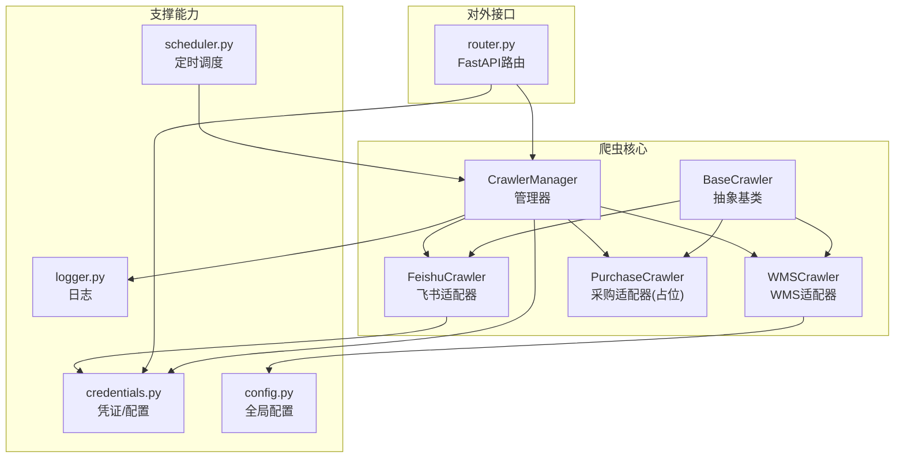
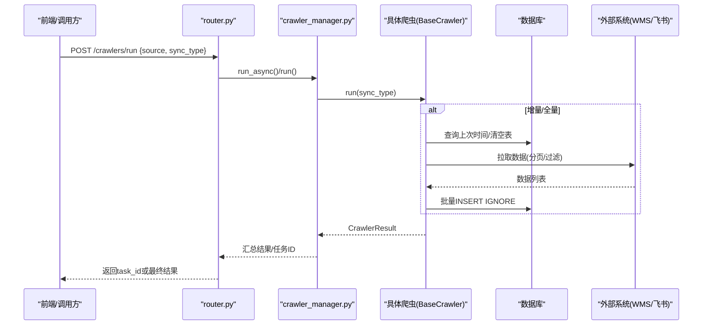
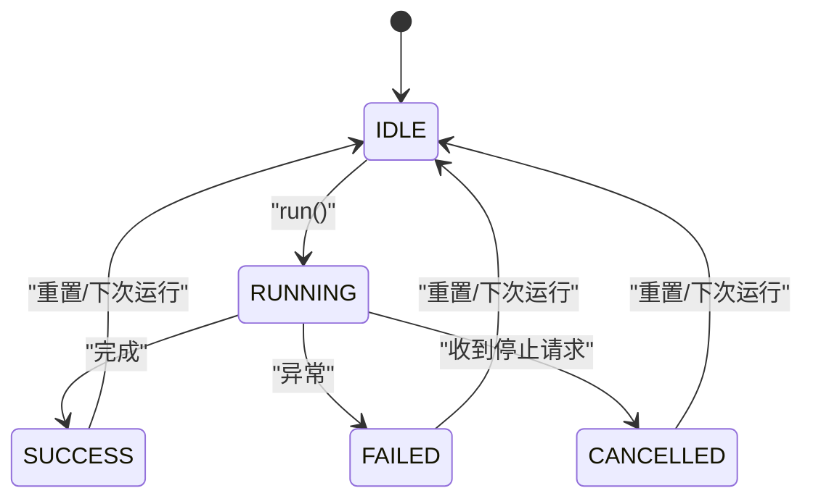
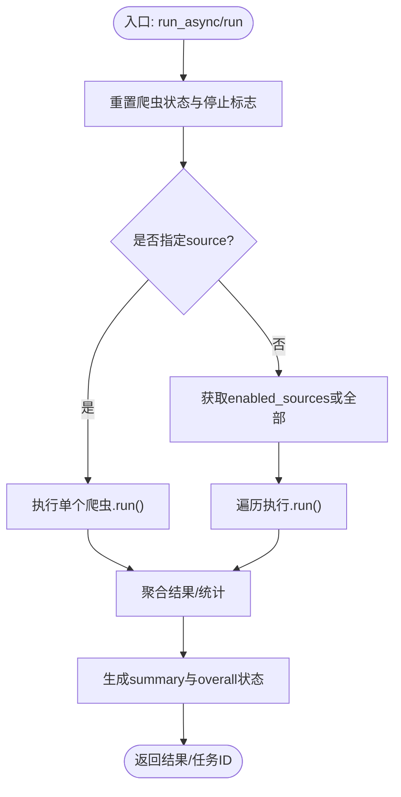
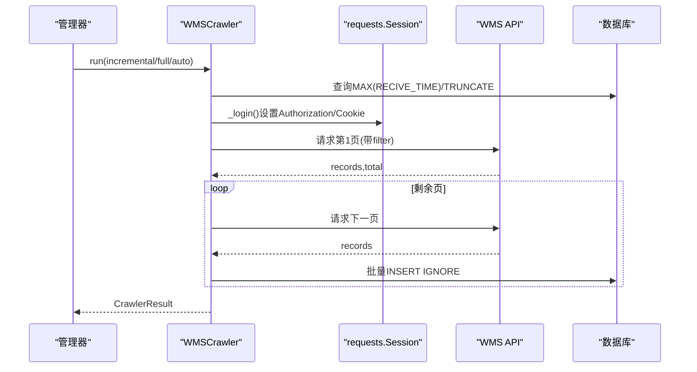
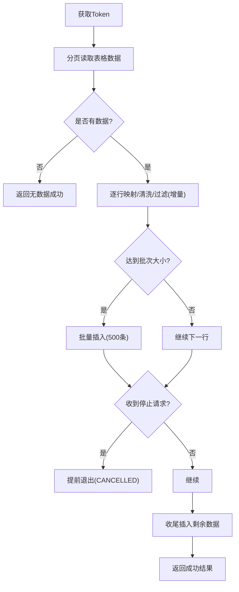
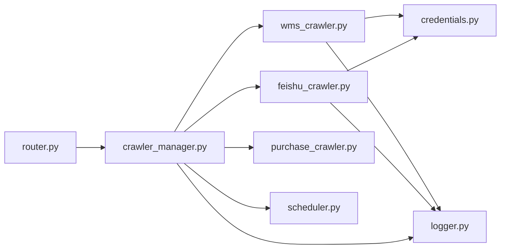

# 爬虫系统模块

<cite>
**本文引用的文件**
- [backend/crawlers/base.py](file://backend/crawlers/base.py)
- [backend/crawlers/crawler_manager.py](file://backend/crawlers/crawler_manager.py)
- [backend/crawlers/wms_crawler.py](file://backend/crawlers/wms_crawler.py)
- [backend/crawlers/feishu_crawler.py](file://backend/crawlers/feishu_crawler.py)
- [backend/crawlers/purchase_crawler.py](file://backend/crawlers/purchase_crawler.py)
- [backend/crawlers/router.py](file://backend/crawlers/router.py)
- [backend/system/credentials.py](file://backend/system/credentials.py)
- [backend/scheduling/scheduler.py](file://backend/scheduling/scheduler.py)
- [backend/config.py](file://backend/config.py)
- [backend/logger.py](file://backend/logger.py)
- [backend/scripts/run_crawler.py](file://backend/scripts/run_crawler.py)
- [backend/scripts/test_feishu_sync.py](file://backend/scripts/test_feishu_sync.py)
</cite>

## 目录
1. [简介](#简介)
2. [项目结构](#项目结构)
3. [核心组件](#核心组件)
4. [架构总览](#架构总览)
5. [详细组件分析](#详细组件分析)
6. [依赖关系分析](#依赖关系分析)
7. [性能与监控](#性能与监控)
8. [故障排查指南](#故障排查指南)
9. [结论](#结论)
10. [附录：新爬虫开发与集成测试](#附录：新爬虫开发与集成测试)

## 简介
本模块为后端爬虫子系统，负责从多数据源（WMS、飞书表格、采购系统）拉取数据，进行清洗转换后入库，并提供统一的调度、运行控制、状态查询和配置管理能力。系统支持自动/全量/增量三种同步模式，具备异步执行、任务追踪、停止重试、错误处理、日志记录与性能监控等能力。

## 项目结构
爬虫相关代码集中在 backend/crawlers 目录下，配合 system/credentials（凭证与配置）、scheduling（定时调度）、config（全局配置）、logger（日志）等模块协同工作。脚本位于 backend/scripts，用于手动执行与测试。

图表来源
- [backend/crawlers/base.py:51-67](file://backend/crawlers/base.py#L51-L67)
- [backend/crawlers/crawler_manager.py:22-95](file://backend/crawlers/crawler_manager.py#L22-L95)
- [backend/crawlers/wms_crawler.py:44-62](file://backend/crawlers/wms_crawler.py#L44-L62)
- [backend/crawlers/feishu_crawler.py:55-70](file://backend/crawlers/feishu_crawler.py#L55-L70)
- [backend/crawlers/purchase_crawler.py:12-22](file://backend/crawlers/purchase_crawler.py#L12-L22)
- [backend/system/credentials.py:297-401](file://backend/system/credentials.py#L297-L401)
- [backend/scheduling/scheduler.py:16-74](file://backend/scheduling/scheduler.py#L16-L74)
- [backend/config.py:48-98](file://backend/config.py#L48-L98)
- [backend/logger.py:14-38](file://backend/logger.py#L14-L38)
- [backend/crawlers/router.py:43-147](file://backend/crawlers/router.py#L43-L147)

章节来源
- [backend/crawlers/crawler_manager.py:22-95](file://backend/crawlers/crawler_manager.py#L22-L95)
- [backend/crawlers/router.py:43-147](file://backend/crawlers/router.py#L43-L147)

## 核心组件
- BaseCrawler：定义统一接口（run/get_status），以及同步类型枚举、结果对象、状态枚举。
- CrawlerManager：管理所有爬虫实例，提供同步/异步执行、任务跟踪、停止标志、聚合结果与统计。
- WMSCrawler：对接WMS（di360）API，支持分页拉取、服务端时间过滤、批量插入、指数退避重试。
- FeishuCrawler：通过飞书v2 API分页读取共享表，字段映射与清洗，增量/全量同步，批量写入。
- PurchaseCrawler：占位实现，预留扩展点。
- credentials：统一管理各数据源凭证与爬虫同步配置（启用源、间隔、模式）。
- scheduler：后台线程按配置周期触发增量同步，避免与手动任务冲突。
- router：暴露REST接口，供前端或外部调用启动/停止、查询状态、保存配置。
- config/logger：全局配置与日志轮转输出。

章节来源
- [backend/crawlers/base.py:12-67](file://backend/crawlers/base.py#L12-L67)
- [backend/crawlers/crawler_manager.py:22-305](file://backend/crawlers/crawler_manager.py#L22-L305)
- [backend/crawlers/wms_crawler.py:44-477](file://backend/crawlers/wms_crawler.py#L44-L477)
- [backend/crawlers/feishu_crawler.py:55-419](file://backend/crawlers/feishu_crawler.py#L55-L419)
- [backend/crawlers/purchase_crawler.py:12-49](file://backend/crawlers/purchase_crawler.py#L12-L49)
- [backend/system/credentials.py:297-401](file://backend/system/credentials.py#L297-L401)
- [backend/scheduling/scheduler.py:16-196](file://backend/scheduling/scheduler.py#L16-L196)
- [backend/crawlers/router.py:43-225](file://backend/crawlers/router.py#L43-L225)
- [backend/config.py:48-98](file://backend/config.py#L48-L98)
- [backend/logger.py:14-38](file://backend/logger.py#L14-L38)

## 架构总览
系统采用“适配器+管理器”的解耦设计：每个数据源一个爬虫适配器继承基类；管理器统一注册、调度、统计；配置与凭证集中管理；调度器在后台周期性触发增量同步；路由层暴露HTTP接口。

图表来源
- [backend/crawlers/router.py:89-147](file://backend/crawlers/router.py#L89-L147)
- [backend/crawlers/crawler_manager.py:134-197](file://backend/crawlers/crawler_manager.py#L134-L197)
- [backend/crawlers/wms_crawler.py:313-457](file://backend/crawlers/wms_crawler.py#L313-L457)
- [backend/crawlers/feishu_crawler.py:251-399](file://backend/crawlers/feishu_crawler.py#L251-L399)

## 详细组件分析

### 基础爬虫类与生命周期
- 同步类型：auto/full/incremental，由管理器解析并传入各爬虫。
- 状态机：idle → running → success/failed/cancelled。
- 结果对象：包含来源、状态、总数、新增、更新、消息、错误。
- 生命周期：
  - 启动：设置RUNNING，初始化日志与进度。
  - 执行：根据sync_type选择策略，拉取数据，清洗转换，批量入库。
  - 停止：检查_stop_requested，优雅退出并返回CANCELLED。
  - 完成：设置SUCCESS/FAILED，记录last_result。

图表来源
- [backend/crawlers/base.py:12-67](file://backend/crawlers/base.py#L12-L67)
- [backend/crawlers/crawler_manager.py:39-88](file://backend/crawlers/crawler_manager.py#L39-L88)
- [backend/crawlers/wms_crawler.py:313-457](file://backend/crawlers/wms_crawler.py#L313-L457)
- [backend/crawlers/feishu_crawler.py:251-399](file://backend/crawlers/feishu_crawler.py#L251-L399)

章节来源
- [backend/crawlers/base.py:12-67](file://backend/crawlers/base.py#L12-L67)

### 爬虫管理器（调度与编排）
- 职责：
  - 注册爬虫实例（wms/feishu/purchase）。
  - 同步/异步执行：run()阻塞；run_async()立即返回task_id并在后台线程执行。
  - 任务元信息：记录start_time/end_time/status/result。
  - 停止机制：request_stop()/stop_source()设置停止标志，爬虫循环中检测退出。
  - 聚合统计：累计total/inserted/updated，计算overall状态（success/partial/failed）。
  - 与调度器协作：异步完成后恢复调度器。

图表来源
- [backend/crawlers/crawler_manager.py:134-305](file://backend/crawlers/crawler_manager.py#L134-L305)

章节来源
- [backend/crawlers/crawler_manager.py:22-305](file://backend/crawlers/crawler_manager.py#L22-L305)

### WMS 适配器（仓库数据）
- 认证：从spider_credentials读取authorization/cookie，构造Session请求头。
- 增量过滤：将数据库中的北京时间转换为UTC，构建嵌套filter数组传给服务端，仅返回新数据。
- 分页拉取：PAGE_SIZE=2000，先请求第1页获取total，再循环后续页。
- 数据清洗：RECIVE_TIME UTC→北京时间；数值字段规范化；空值处理。
- 批量入库：INSERT IGNORE去重，execute_all提交。
- 重试机制：网络超时/连接失败指数退避重试（最多3次）。
- 停止与日志：每页检查停止标志；日志限流500条。

图表来源
- [backend/crawlers/wms_crawler.py:64-109](file://backend/crawlers/wms_crawler.py#L64-L109)
- [backend/crawlers/wms_crawler.py:127-178](file://backend/crawlers/wms_crawler.py#L127-L178)
- [backend/crawlers/wms_crawler.py:180-213](file://backend/crawlers/wms_crawler.py#L180-L213)
- [backend/crawlers/wms_crawler.py:273-310](file://backend/crawlers/wms_crawler.py#L273-L310)
- [backend/crawlers/wms_crawler.py:313-457](file://backend/crawlers/wms_crawler.py#L313-L457)

章节来源
- [backend/crawlers/wms_crawler.py:44-477](file://backend/crawlers/wms_crawler.py#L44-L477)

### 飞书表格适配器（到货登记）
- 认证：通过credentials获取tenant_access_token，必要时自动刷新。
- 数据拉取：使用v2 API按范围分页读取（避免10MB限制），每次1000行，连续空行阈值终止。
- 字段映射：COLUMN_MAPPING将列索引映射到目标字段；日期多格式解析；数量字段规范化。
- 仓库归一化：根据关键词将收货仓库名称标准化为“总院试制内库/外库”。
- 增量/全量：AUTO模式下若已有数据则增量；否则全量清空后导入。
- 批量写入：按500条分批INSERT IGNORE。
- 停止与日志：逐行检查停止标志；日志限流500条。

图表来源
- [backend/crawlers/feishu_crawler.py:55-70](file://backend/crawlers/feishu_crawler.py#L55-L70)
- [backend/crawlers/feishu_crawler.py:132-203](file://backend/crawlers/feishu_crawler.py#L132-L203)
- [backend/crawlers/feishu_crawler.py:205-249](file://backend/crawlers/feishu_crawler.py#L205-L249)
- [backend/crawlers/feishu_crawler.py:251-399](file://backend/crawlers/feishu_crawler.py#L251-L399)

章节来源
- [backend/crawlers/feishu_crawler.py:55-419](file://backend/crawlers/feishu_crawler.py#L55-L419)

### 采购系统适配器（占位）
- 当前为占位实现，返回失败状态与提示信息，便于后续接入真实API。

章节来源
- [backend/crawlers/purchase_crawler.py:12-49](file://backend/crawlers/purchase_crawler.py#L12-L49)

### 配置与凭证管理
- 爬虫同步配置：mode（auto/manual）、增量间隔、全量间隔、启用的数据源列表、自动登录开关、最近执行时间与状态等，持久化于system_params。
- 凭证管理：支持WMS自动登录获取JWT/Cookie、手动粘贴Token、飞书应用登录获取tenant_access_token；同一source只保留最新激活凭证。
- 动态启用数据源：通过配置项crawler_enabled_sources控制哪些爬虫参与执行。

章节来源
- [backend/system/credentials.py:297-401](file://backend/system/credentials.py#L297-L401)
- [backend/system/credentials.py:25-118](file://backend/system/credentials.py#L25-L118)
- [backend/system/credentials.py:476-573](file://backend/system/credentials.py#L476-L573)

### 定时调度器
- 独立后台线程，按配置的增量间隔循环执行。
- 自动跳过：当检测到有爬虫正在运行或处于手动模式时跳过。
- 暂停/恢复：手动触发前暂停，完成后恢复，避免冲突。
- 状态上报：执行后更新最近执行时间与状态。

章节来源
- [backend/scheduling/scheduler.py:16-196](file://backend/scheduling/scheduler.py#L16-L196)
- [backend/crawlers/router.py:180-201](file://backend/crawlers/router.py#L180-L201)

### HTTP 路由接口
- GET /crawlers/config：读取爬虫同步配置。
- POST /crawlers/config：保存配置并通知调度器重新加载。
- GET /crawlers/status：获取所有爬虫状态与配置。
- GET /crawlers/status/{source}：获取指定爬虫状态。
- POST /crawlers/run：异步/同步执行爬虫，返回task_id或结果。
- GET /crawlers/task/{task_id}：查询任务元信息。
- GET /crawlers/summary：页面摘要（含调度器状态）。
- POST /crawlers/start_scheduler / stop_scheduler：启停自动调度。
- POST /crawlers/stop：停止指定或全部爬虫。

章节来源
- [backend/crawlers/router.py:43-225](file://backend/crawlers/router.py#L43-L225)

## 依赖关系分析
- 低耦合：爬虫适配器仅依赖BaseCrawler接口；管理器集中编排；配置与凭证解耦。
- 直接依赖：
  - crawler_manager 依赖 wms/feishu/purchase 三个适配器。
  - wms/feishu 依赖 database、config、logger、credentials。
  - router 依赖 manager、credentials、scheduler。
  - scheduler 依赖 manager、credentials。
- 潜在风险：
  - 外部API不稳定（WMS/飞书）需重试与超时保护（已实现）。
  - 大表批量插入需关注事务与锁（INSERT IGNORE + execute_all）。
  - 日志缓冲上限防止内存增长（已限制500条）。

图表来源
- [backend/crawlers/router.py:43-147](file://backend/crawlers/router.py#L43-L147)
- [backend/crawlers/crawler_manager.py:22-95](file://backend/crawlers/crawler_manager.py#L22-L95)
- [backend/crawlers/wms_crawler.py:44-62](file://backend/crawlers/wms_crawler.py#L44-L62)
- [backend/crawlers/feishu_crawler.py:55-70](file://backend/crawlers/feishu_crawler.py#L55-L70)
- [backend/scheduling/scheduler.py:16-74](file://backend/scheduling/scheduler.py#L16-L74)

章节来源
- [backend/crawlers/crawler_manager.py:22-95](file://backend/crawlers/crawler_manager.py#L22-L95)
- [backend/crawlers/router.py:43-147](file://backend/crawlers/router.py#L43-L147)

## 性能与监控
- 批量操作：WMS/飞书均按批插入（500/2000），减少IO次数。
- 分页拉取：WMS按2000页；飞书按1000行范围，避免超大响应。
- 重试与退避：网络异常指数退避重试，提升鲁棒性。
- 日志限流：每条爬虫维护最近500条日志，避免内存膨胀。
- 进度与状态：实时progress（current_page/total_pages/inserted/processed）与status，前端可轮询。
- 调度监控：scheduler暴露running/paused/interval_minutes/last_run_at。

章节来源
- [backend/crawlers/wms_crawler.py:273-310](file://backend/crawlers/wms_crawler.py#L273-L310)
- [backend/crawlers/feishu_crawler.py:222-249](file://backend/crawlers/feishu_crawler.py#L222-L249)
- [backend/crawlers/wms_crawler.py:180-213](file://backend/crawlers/wms_crawler.py#L180-L213)
- [backend/crawlers/feishu_crawler.py:132-203](file://backend/crawlers/feishu_crawler.py#L132-L203)
- [backend/crawlers/wms_crawler.py:112-125](file://backend/crawlers/wms_crawler.py#L112-L125)
- [backend/crawlers/feishu_crawler.py:72-82](file://backend/crawlers/feishu_crawler.py#L72-L82)
- [backend/scheduling/scheduler.py:67-74](file://backend/scheduling/scheduler.py#L67-L74)

## 故障排查指南
- 无法获取飞书Token：
  - 检查系统设置中是否配置了app_id/app_secret；或.env中对应变量。
  - 确认credentials中飞书凭证有效且未过期。
- WMS登录失败：
  - 检查spider_credentials中authorization/cookie是否有效；必要时重新登录。
- 数据未入库或重复：
  - 确认增量条件是否正确（RECIVE_TIME比较）；检查INSERT IGNORE是否生效。
- 爬虫被卡住：
  - 通过POST /crawlers/stop停止；检查网络超时与重试逻辑。
- 调度器不执行：
  - 检查crawler_mode是否为auto；enabled_sources是否包含目标源；是否有爬虫正在运行。

章节来源
- [backend/system/credentials.py:476-573](file://backend/system/credentials.py#L476-L573)
- [backend/crawlers/wms_crawler.py:64-109](file://backend/crawlers/wms_crawler.py#L64-L109)
- [backend/crawlers/feishu_crawler.py:205-249](file://backend/crawlers/feishu_crawler.py#L205-L249)
- [backend/crawlers/router.py:204-225](file://backend/crawlers/router.py#L204-L225)
- [backend/scheduling/scheduler.py:93-153](file://backend/scheduling/scheduler.py#L93-L153)

## 结论
本爬虫系统以清晰的适配器模式与统一的管理器编排，实现了多数据源的稳定采集、清洗与入库。通过配置驱动与定时调度，支持自动化增量同步；完善的停止/重试/日志机制保障运行稳定性。未来只需新增适配器并注册即可扩展新的数据源。

## 附录：新爬虫开发与集成测试

### 新增数据源适配器的步骤
1. 新建爬虫类继承BaseCrawler，实现run()与get_status()。
2. 在CrawlerManager._init_crawlers()中注册新爬虫。
3. 如需自动调度，确保crawler_enabled_sources包含该源。
4. 编写单元测试与集成测试脚本验证拉取、清洗、入库流程。

章节来源
- [backend/crawlers/base.py:51-67](file://backend/crawlers/base.py#L51-L67)
- [backend/crawlers/crawler_manager.py:90-95](file://backend/crawlers/crawler_manager.py#L90-L95)
- [backend/system/credentials.py:339-363](file://backend/system/credentials.py#L339-L363)

### 集成测试方法
- 手动执行脚本：python -m backend.scripts.run_crawler <source> <sync_type>
- 飞书专项测试：清空表后运行全量同步，校验数据与状态分布。
- 配置变更：通过POST /crawlers/config更新enabled_sources，观察调度器行为。

章节来源
- [backend/scripts/run_crawler.py:17-23](file://backend/scripts/run_crawler.py#L17-L23)
- [backend/scripts/test_feishu_sync.py:14-57](file://backend/scripts/test_feishu_sync.py#L14-L57)
- [backend/crawlers/router.py:49-58](file://backend/crawlers/router.py#L49-L58)