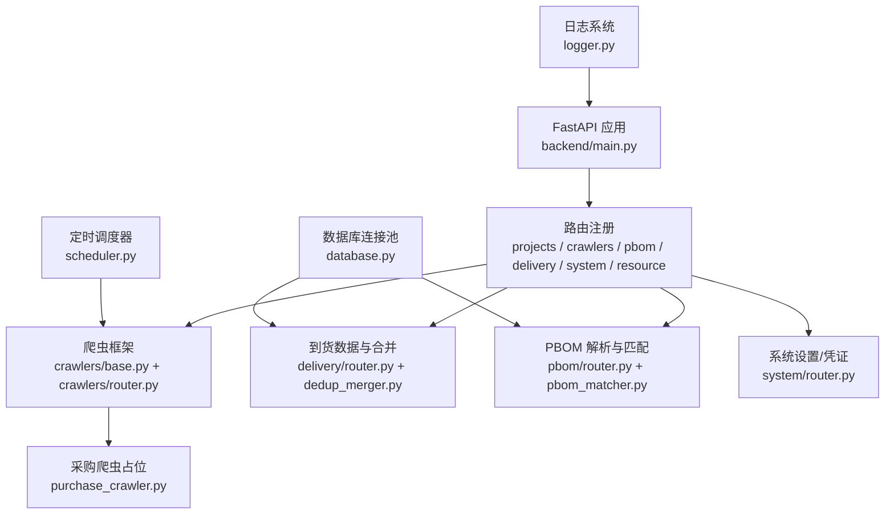
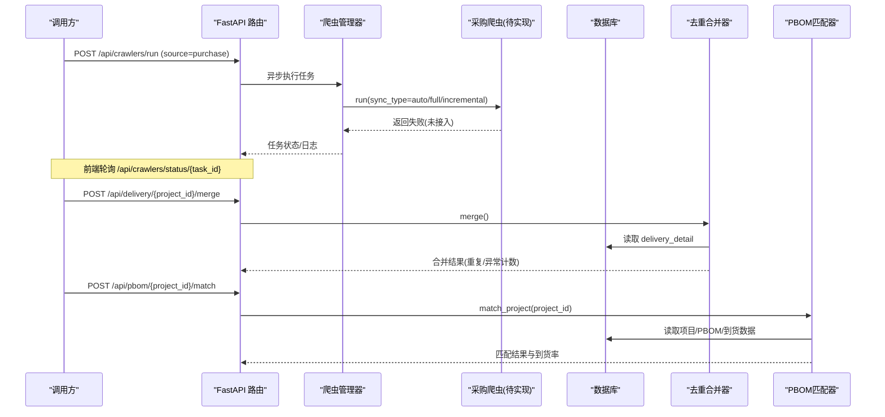
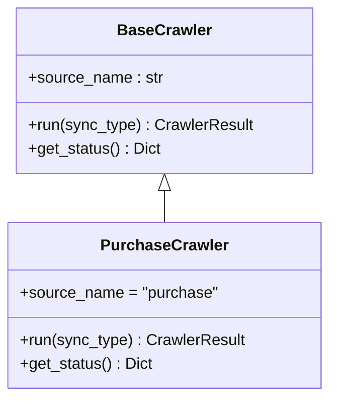
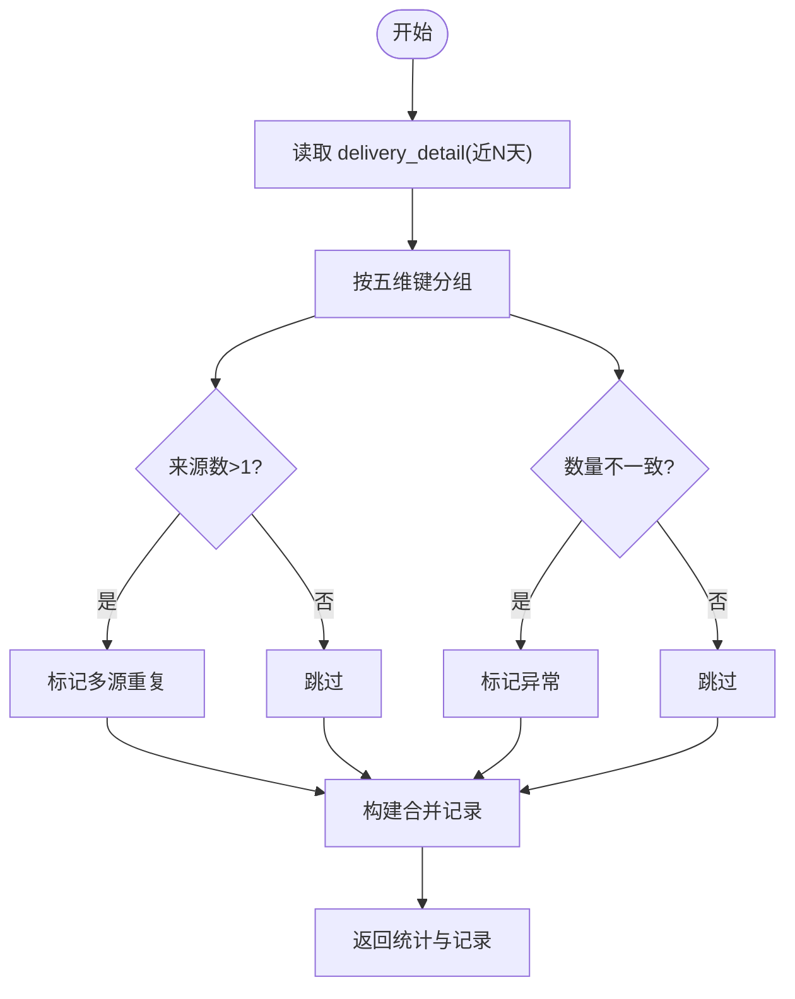
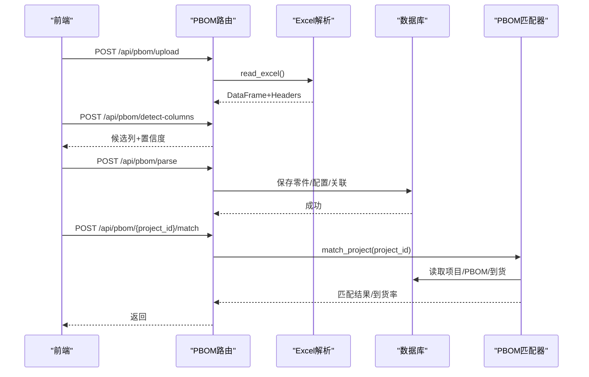
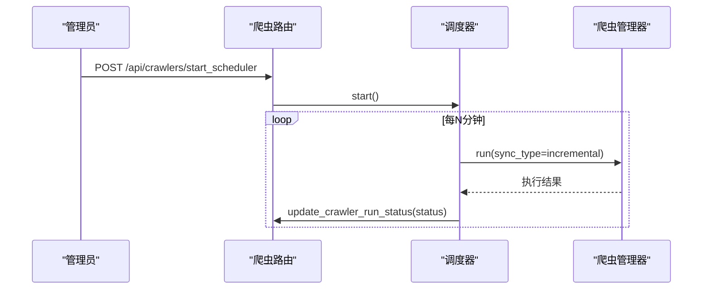
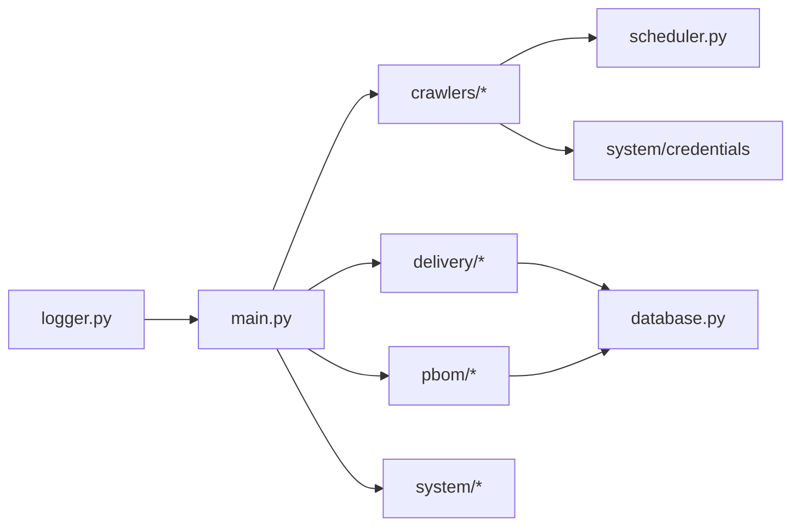

# 采购系统对接

<cite>
**本文引用的文件**
- [backend/main.py](file://backend/main.py)
- [backend/config.py](file://backend/config.py)
- [backend/crawlers/base.py](file://backend/crawlers/base.py)
- [backend/crawlers/purchase_crawler.py](file://backend/crawlers/purchase_crawler.py)
- [backend/crawlers/router.py](file://backend/crawlers/router.py)
- [backend/delivery/router.py](file://backend/delivery/router.py)
- [backend/delivery/dedup_merger.py](file://backend/delivery/dedup_merger.py)
- [backend/pbom/router.py](file://backend/pbom/router.py)
- [backend/pbom/pbom_matcher.py](file://backend/pbom/pbom_matcher.py)
- [backend/database.py](file://backend/database.py)
- [backend/logger.py](file://backend/logger.py)
- [backend/scheduling/scheduler.py](file://backend/scheduling/scheduler.py)
- [backend/system/router.py](file://backend/system/router.py)
</cite>

## 目录
1. [简介](#简介)
2. [项目结构](#项目结构)
3. [核心组件](#核心组件)
4. [架构总览](#架构总览)
5. [详细组件分析](#详细组件分析)
6. [依赖关系分析](#依赖关系分析)
7. [性能与可扩展性](#性能与可扩展性)
8. [故障排查指南](#故障排查指南)
9. [结论](#结论)
10. [附录：接口清单与约定](#附录接口清单与约定)

## 简介
本文件面向“采购系统对接”的集成与落地，基于现有代码库给出可执行的对接方案。当前仓库已具备多源到货数据接入、PBOM解析与匹配、去重合并、调度与日志等能力；采购系统（Purchase）爬虫模块已预留扩展点但尚未实现真实 API 接入。本文围绕以下目标展开：
- 明确接口协议、认证方式、数据格式约定
- 设计采购订单数据同步流程（创建、状态更新、交付信息获取）
- 说明供应商信息管理（主数据同步、资质文件管理、信用评级更新）
- 描述采购物料匹配逻辑（外部物料编码与内部BOM关联）
- 定义数据清洗规则（去重、标准化、缺失值处理）
- 提供接口调用监控与错误诊断方法（日志、指标、告警）

## 项目结构
后端采用 FastAPI 模块化路由组织，核心模块包括：
- 应用入口与全局配置：main.py、config.py
- 爬虫框架与调度：crawlers/*、scheduling/scheduler.py
- 到货数据与去重合并：delivery/*
- PBOM 解析与匹配：pbom/*
- 数据库访问与日志：database.py、logger.py
- 系统设置与凭证：system/*

图表来源
- [backend/main.py:29-83](file://backend/main.py#L29-L83)
- [backend/crawlers/router.py:43-177](file://backend/crawlers/router.py#L43-L177)
- [backend/delivery/router.py:28-259](file://backend/delivery/router.py#L28-L259)
- [backend/pbom/router.py:23-166](file://backend/pbom/router.py#L23-L166)
- [backend/database.py:12-116](file://backend/database.py#L12-L116)
- [backend/logger.py:14-43](file://backend/logger.py#L14-L43)
- [backend/scheduling/scheduler.py:16-196](file://backend/scheduling/scheduler.py#L16-L196)

章节来源
- [backend/main.py:29-83](file://backend/main.py#L29-L83)
- [backend/config.py:48-102](file://backend/config.py#L48-L102)

## 核心组件
- 爬虫基类与结果模型：统一抽象 run/get_status，定义 SyncType/CrawlerStatus/CrawlerResult
- 采购爬虫占位：source_name="purchase"，当前返回失败并提示未接入
- 到货数据路由：分页查询、统计、按状态分布、去重合并
- PBOM 解析与匹配：上传 Excel、检测列、解析零件与配置、执行匹配并更新项目统计
- 数据库层：连接池、通用查询与执行封装
- 日志：按模块输出到文件与控制台，支持轮转
- 调度器：后台线程按配置间隔自动执行增量同步

章节来源
- [backend/crawlers/base.py:12-67](file://backend/crawlers/base.py#L12-L67)
- [backend/crawlers/purchase_crawler.py:12-49](file://backend/crawlers/purchase_crawler.py#L12-L49)
- [backend/delivery/router.py:41-259](file://backend/delivery/router.py#L41-L259)
- [backend/pbom/router.py:23-166](file://backend/pbom/router.py#L23-L166)
- [backend/database.py:12-116](file://backend/database.py#L12-L116)
- [backend/logger.py:14-43](file://backend/logger.py#L14-L43)
- [backend/scheduling/scheduler.py:16-196](file://backend/scheduling/scheduler.py#L16-L196)

## 架构总览
整体数据流：
- 外部系统（WMS、飞书共享表、未来采购系统）→ 爬虫/适配器 → 入库至 delivery_detail/feishu_detail
- 去重合并：DedupMerger 基于五维键合并重复记录，标记异常
- PBOM 匹配：将项目 PBOM 零件与到货数据匹配，汇总已入库数量，更新项目到货率
- 调度器：按配置周期自动执行增量同步
- 日志与监控：统一日志输出，健康检查与健康探针

图表来源
- [backend/crawlers/router.py:89-147](file://backend/crawlers/router.py#L89-L147)
- [backend/crawlers/purchase_crawler.py:23-49](file://backend/crawlers/purchase_crawler.py#L23-L49)
- [backend/delivery/router.py:229-259](file://backend/delivery/router.py#L229-L259)
- [backend/delivery/dedup_merger.py:7-128](file://backend/delivery/dedup_merger.py#L7-L128)
- [backend/pbom/router.py:159-166](file://backend/pbom/router.py#L159-L166)
- [backend/pbom/pbom_matcher.py:21-240](file://backend/pbom/pbom_matcher.py#L21-L240)

## 详细组件分析

### 采购系统爬虫（对接入口）
- 位置与职责：继承 BaseCrawler，source_name="purchase"，用于从采购系统拉取到货/订单数据
- 当前状态：run() 直接返回 FAILED，message 提示未接入；get_status() 返回状态与进度占位
- 对接建议：
  - 在 PurchaseCrawler.run 中实现 HTTP 调用采购系统 API（参考 WMS/飞书登录与请求模式）
  - 使用 config.PURCHASE_API_URL、PURCHASE_API_KEY 作为基础地址与鉴权参数
  - 将采购系统字段映射为 delivery_detail 字段（如 PRO_CODE/MATTER_CODE/ORDER_NUM/RECIVE_TIME/STATE/IN_NUM）
  - 复用 database.execute_all 批量写入，结合 DedupMerger 进行去重合并

图表来源
- [backend/crawlers/base.py:51-67](file://backend/crawlers/base.py#L51-L67)
- [backend/crawlers/purchase_crawler.py:12-49](file://backend/crawlers/purchase_crawler.py#L12-L49)

章节来源
- [backend/crawlers/purchase_crawler.py:12-49](file://backend/crawlers/purchase_crawler.py#L12-L49)
- [backend/config.py:72-75](file://backend/config.py#L72-L75)

### 到货数据与去重合并
- 查询与筛选：/api/delivery/detail 支持按送货单号、申请单号、项目号、零件号、零件名、状态、时间范围等多条件分页查询
- 统计与分布：/api/delivery/stats、/api/delivery/state-distribution、/api/delivery/feishu-state-distribution
- 去重合并：/api/delivery/{project_id}/merge 使用五维键（项目号、零件号、数量、日期、单据号）合并，标记多源重复与数量异常
- 合并摘要：/api/delivery/{project_id}/merge-summary

图表来源
- [backend/delivery/dedup_merger.py:21-128](file://backend/delivery/dedup_merger.py#L21-L128)
- [backend/delivery/router.py:121-259](file://backend/delivery/router.py#L121-L259)

章节来源
- [backend/delivery/router.py:41-259](file://backend/delivery/router.py#L41-L259)
- [backend/delivery/dedup_merger.py:7-128](file://backend/delivery/dedup_merger.py#L7-L128)

### PBOM 解析与物料匹配
- 上传与列检测：/api/pbom/upload、/api/pbom/detect-columns
- 解析保存：/api/pbom/parse 提取零件与配置，保存到项目
- 匹配执行：/api/pbom/{project_id}/match 将 PBOM 零件与到货数据匹配，优先 WMS，其次飞书，更新到货率与缺料信息

图表来源
- [backend/pbom/router.py:23-166](file://backend/pbom/router.py#L23-L166)
- [backend/pbom/pbom_matcher.py:21-240](file://backend/pbom/pbom_matcher.py#L21-L240)

章节来源
- [backend/pbom/router.py:23-166](file://backend/pbom/router.py#L23-L166)
- [backend/pbom/pbom_matcher.py:21-240](file://backend/pbom/pbom_matcher.py#L21-L240)

### 调度与自动化
- 启动/停止：/api/crawlers/start_scheduler、/api/crawlers/stop_scheduler
- 运行控制：/api/crawlers/run（支持阻塞/异步）、/api/crawlers/status、/api/crawlers/task/{task_id}
- 自动调度：SchedulerService 后台线程按配置间隔执行增量同步，避免与手动任务冲突

图表来源
- [backend/crawlers/router.py:180-201](file://backend/crawlers/router.py#L180-L201)
- [backend/scheduling/scheduler.py:34-196](file://backend/scheduling/scheduler.py#L34-L196)

章节来源
- [backend/crawlers/router.py:43-225](file://backend/crawlers/router.py#L43-L225)
- [backend/scheduling/scheduler.py:16-196](file://backend/scheduling/scheduler.py#L16-L196)

### 系统设置与凭证
- 登录与凭证：/api/system/login、/api/system/credentials、/api/system/params
- 支持 WMS 登录获取 Token、飞书应用登录、手动同步凭证（JWT/Cookie）

章节来源
- [backend/system/router.py:52-109](file://backend/system/router.py#L52-L109)

## 依赖关系分析
- 模块耦合：
  - main.py 聚合各模块路由，低耦合高内聚
  - crawlers 依赖 scheduler 与 system.credentials
  - delivery 与 pbom 均依赖 database 与 logger
- 外部依赖：
  - MySQL 通过 PooledDB 连接池
  - 可选 DeepSeek LLM（当前未在本对接路径中使用）
- 潜在循环依赖：通过延迟导入避免（例如在路由中 from ... import ...）

图表来源
- [backend/main.py:19-83](file://backend/main.py#L19-L83)
- [backend/crawlers/router.py:4-11](file://backend/crawlers/router.py#L4-L11)
- [backend/delivery/router.py:6-10](file://backend/delivery/router.py#L6-L10)
- [backend/pbom/router.py:9-16](file://backend/pbom/router.py#L9-L16)
- [backend/database.py:1-116](file://backend/database.py#L1-116)
- [backend/logger.py:1-43](file://backend/logger.py#L1-L43)

章节来源
- [backend/main.py:19-83](file://backend/main.py#L19-L83)

## 性能与可扩展性
- 数据库连接池：PooledDB 限制最大连接数，避免资源耗尽；写操作支持事务回滚
- 批量写入：建议使用 execute_all 批量插入，减少网络往返
- 去重合并：五维键分组内存计算，适合中等规模数据；大数据量可考虑分片或流式处理
- 日志轮转：RotatingFileHandler 控制文件大小与保留份数，避免磁盘爆满
- 可扩展点：
  - 新增数据源：继承 BaseCrawler，注册到 crawler_manager
  - 新增匹配策略：在 PBOMMatcher 中扩展匹配维度
  - 新增清洗规则：在 DedupMerger 中增加校验与转换

[本节为通用指导，不直接分析具体文件]

## 故障排查指南
- 健康检查：GET /api/health 验证服务可用性
- 日志定位：查看 backend/logs/*.log，关注 crawler.*、pbom.*、scheduler.* 等模块日志
- 数据库问题：连接池初始化失败会抛出带配置的详细错误，检查 .env 中的 DB_* 配置
- 爬虫任务：
  - 通过 /api/crawlers/status 与 /api/crawlers/task/{task_id} 查看任务状态与日志
  - 若采购爬虫返回失败，确认是否已实现 API 接入与配置 PURCHASE_API_URL/KEY
- 去重异常：检查 delivery_detail 中同一五维键下的 IN_NUM 差异，定位异常记录
- 匹配失败：确认项目号、试制申请单号、零件号一致；核对 WMS/飞书数据是否存在

章节来源
- [backend/main.py:94-97](file://backend/main.py#L94-L97)
- [backend/logger.py:14-43](file://backend/logger.py#L14-L43)
- [backend/database.py:12-43](file://backend/database.py#L12-L43)
- [backend/crawlers/router.py:61-86](file://backend/crawlers/router.py#L61-L86)
- [backend/delivery/dedup_merger.py:79-115](file://backend/delivery/dedup_merger.py#L79-L115)

## 结论
本仓库已具备完善的多源到货数据接入、PBOM 解析与匹配、去重合并、调度与日志体系。采购系统对接的关键在于实现 PurchaseCrawler 的 API 接入与数据映射，并复用现有的去重与匹配能力完成端到端闭环。建议在实施时遵循本文的接口协议、数据格式与清洗规则，并结合日志与监控手段保障稳定性。

[本节为总结性内容，不直接分析具体文件]

## 附录：接口清单与约定

### 接口协议与认证
- 协议：HTTP/REST，JSON 数据体
- 认证：
  - 系统登录：POST /api/system/login（WMS），POST /api/system/login/feishu（飞书）
  - 凭证管理：/api/system/credentials（增删改查）
  - 采购系统：预留 PURCHASE_API_URL、PURCHASE_API_KEY（需在采购侧启用）

章节来源
- [backend/system/router.py:52-109](file://backend/system/router.py#L52-L109)
- [backend/config.py:72-75](file://backend/config.py#L72-L75)

### 数据格式约定
- 到货明细字段（WMS）：DELIVERY_CODE、APPLY_CODE、PRO_CODE、MATTER_CODE、MATTER_NAME、ORDER_NUM、IN_NUM、RECIVE_TIME、STATE、ZYS_USERNAME、WH_NAME、DATA_SOURCE
- 到货明细字段（飞书）：DELIVERY_CODE、APPLY_CODE、PRO_NAME、MATTER_CODE、MATTER_NAME、ORDER_NUM、RECIVE_NUM、STATE、ZYS_USERNAME、WH_NAME、PROGRESS_TRACKING
- 去重合并键：项目号、零件号、数量、日期（天级）、单据号
- 匹配优先级：WMS > 飞书；以最新 RECIVE_TIME 为准

章节来源
- [backend/delivery/router.py:41-118](file://backend/delivery/router.py#L41-L118)
- [backend/delivery/dedup_merger.py:21-35](file://backend/delivery/dedup_merger.py#L21-L35)
- [backend/pbom/pbom_matcher.py:42-126](file://backend/pbom/pbom_matcher.py#L42-L126)

### 采购订单数据同步流程
- 订单创建：由采购系统推送新订单至 delivery_detail（或新建表），字段映射参照上述约定
- 状态更新：定期增量同步，更新 STATE、RECIVE_TIME、IN_NUM 等
- 交付信息获取：通过 /api/delivery/detail 查询，支持按送货单号、申请单号、项目号、零件号、状态、时间范围筛选

章节来源
- [backend/crawlers/purchase_crawler.py:23-49](file://backend/crawlers/purchase_crawler.py#L23-L49)
- [backend/delivery/router.py:41-118](file://backend/delivery/router.py#L41-L118)

### 供应商信息管理
- 主数据同步：建议在采购系统侧维护供应商主数据，通过 API 同步至本地供应商表（可复用 credentials 机制存储供应商 API 凭证）
- 资质文件管理：通过系统设置或独立文件服务管理，关联供应商 ID 与文件元数据
- 信用评级更新：定期从采购系统拉取评级，更新本地供应商信用字段（可在爬虫模块扩展）

[本节为概念性说明，不直接分析具体文件]

### 采购物料匹配逻辑
- 外部物料编码与内部 BOM 关联：
  - 以 MATTER_CODE（外部）与 part_code（内部）为关键键
  - 优先从 WMS 匹配，未命中则尝试飞书
  - 汇总已入库数量，更新 project_parts 与项目到货率

章节来源
- [backend/pbom/pbom_matcher.py:127-217](file://backend/pbom/pbom_matcher.py#L127-L217)

### 数据清洗规则
- 重复记录去重：五维键分组，标记多源重复
- 格式标准化：
  - 状态空值/空白规范化为“未标注”
  - 飞书状态 #N/A/N/A 视为“未到货”
- 缺失值处理：
  - 项目号/申请号为空时使用宽松匹配
  - 数量缺失按 0 处理

章节来源
- [backend/delivery/router.py:18-25](file://backend/delivery/router.py#L18-L25)
- [backend/delivery/router.py:204-226](file://backend/delivery/router.py#L204-L226)
- [backend/delivery/dedup_merger.py:79-115](file://backend/delivery/dedup_merger.py#L79-L115)

### 接口调用监控与错误诊断
- 日志分析：查看 backend/logs/*.log，关注错误堆栈与业务日志
- 性能指标收集：
  - 调度器状态：/api/crawlers/status（含 last_run_at、interval_minutes）
  - 去重统计：/api/delivery/{project_id}/merge-summary
  - 匹配统计：/api/pbom/{project_id}/match 返回 parts_total、parts_matched、delivery_rate
- 异常告警配置：
  - 基于日志关键字（如“失败”、“异常”）触发告警
  - 对采购爬虫失败、去重异常比例过高、匹配到货率低于阈值等场景配置告警

章节来源
- [backend/scheduling/scheduler.py:67-74](file://backend/scheduling/scheduler.py#L67-L74)
- [backend/delivery/router.py:247-259](file://backend/delivery/router.py#L247-L259)
- [backend/pbom/router.py:159-166](file://backend/pbom/router.py#L159-L166)
- [backend/logger.py:14-43](file://backend/logger.py#L14-L43)