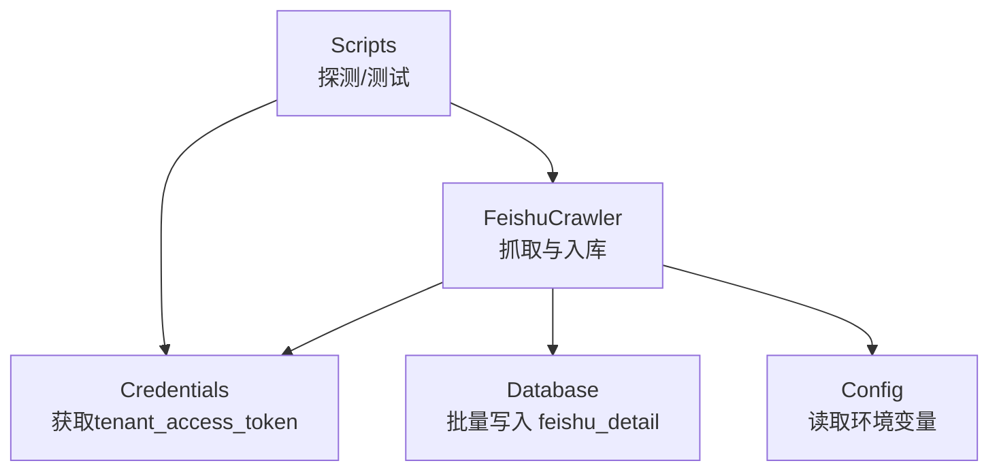
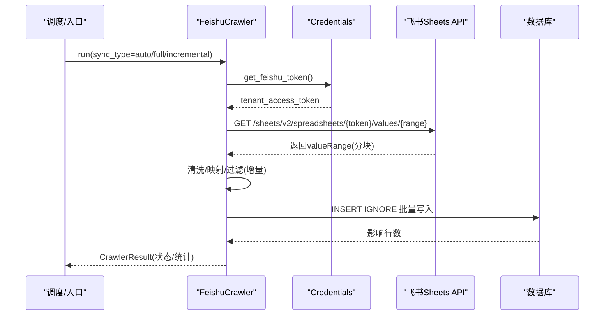
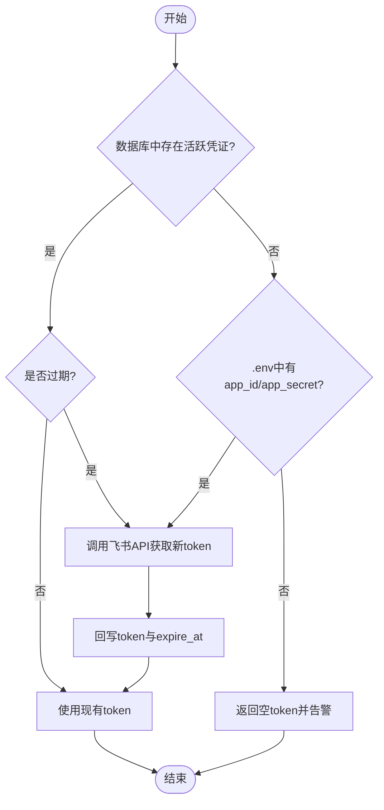
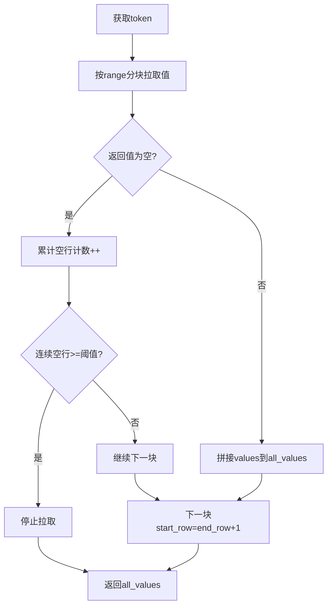
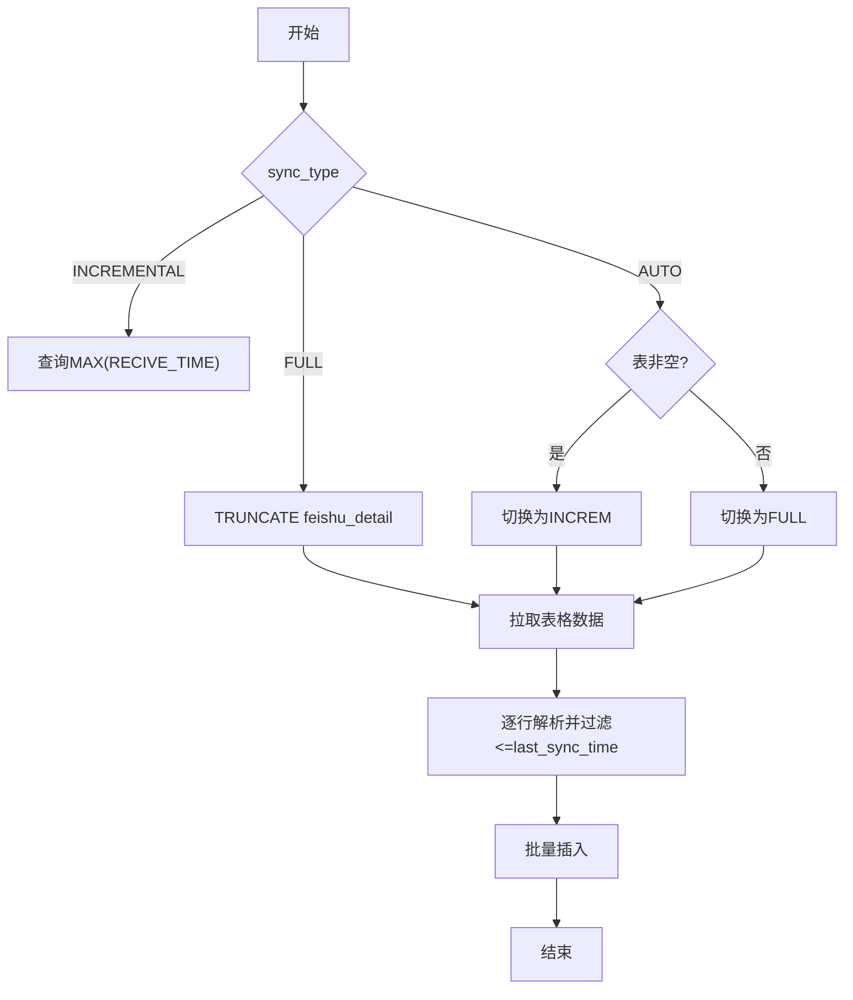
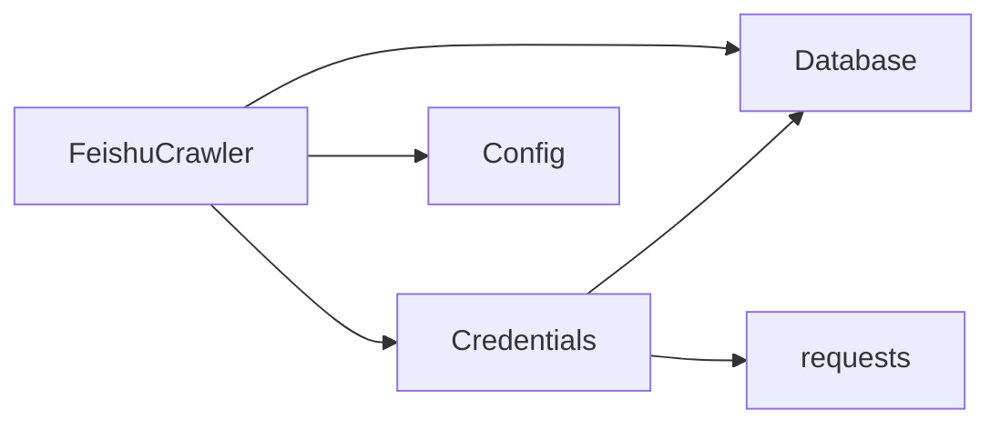

# 飞书表格同步

<cite>
**本文引用的文件**
- [backend/crawlers/feishu_crawler.py](file://backend/crawlers/feishu_crawler.py)
- [backend/system/credentials.py](file://backend/system/credentials.py)
- [backend/config.py](file://backend/config.py)
- [backend/database.py](file://backend/database.py)
- [backend/crawlers/base.py](file://backend/crawlers/base.py)
- [backend/scripts/probe_feishu_sheet.py](file://backend/scripts/probe_feishu_sheet.py)
- [backend/scripts/probe_new_feishu_sheet.py](file://backend/scripts/probe_new_feishu_sheet.py)
- [backend/scripts/test_feishu_sync.py](file://backend/scripts/test_feishu_sync.py)
- [backend/scripts/update_feishu_schema.py](file://backend/scripts/update_feishu_schema.py)
- [backend/scripts/update_feishu_table.py](file://backend/scripts/update_feishu_table.py)
</cite>

## 目录
1. [简介](#简介)
2. [项目结构](#项目结构)
3. [核心组件](#核心组件)
4. [架构总览](#架构总览)
5. [详细组件分析](#详细组件分析)
6. [依赖关系分析](#依赖关系分析)
7. [性能与大数据处理](#性能与大数据处理)
8. [故障排查指南](#故障排查指南)
9. [结论](#结论)
10. [附录](#附录)

## 简介
本文件面向“飞书表格同步”能力，系统性阐述基于飞书开放平台的集成方案与实现细节，覆盖：
- OAuth 认证流程、权限申请、访问令牌管理
- 表格数据同步机制：工作表结构解析、单元格数据处理、公式与样式忽略策略
- 数据类型转换规则：将飞书表格字段映射到数据库字段
- 增量同步算法：基于时间戳的数据变更检测
- 大文件处理策略：分块读取、内存优化、断点续传（建议）
- 常见问题与解决方案：API 限流、网络异常恢复、数据一致性保证

## 项目结构
本项目后端采用模块化组织，飞书表格同步相关代码主要位于以下位置：
- 爬虫实现：backend/crawlers/feishu_crawler.py
- 凭证与令牌管理：backend/system/credentials.py
- 配置加载：backend/config.py
- 数据库访问：backend/database.py
- 爬虫基类与状态：backend/crawlers/base.py
- 探测与测试脚本：backend/scripts/*

图表来源
- [backend/crawlers/feishu_crawler.py:55-419](file://backend/crawlers/feishu_crawler.py#L55-L419)
- [backend/system/credentials.py:448-573](file://backend/system/credentials.py#L448-L573)
- [backend/database.py:51-116](file://backend/database.py#L51-L116)
- [backend/config.py:48-102](file://backend/config.py#L48-L102)

章节来源
- [backend/crawlers/feishu_crawler.py:55-419](file://backend/crawlers/feishu_crawler.py#L55-L419)
- [backend/system/credentials.py:448-573](file://backend/system/credentials.py#L448-L573)
- [backend/database.py:51-116](file://backend/database.py#L51-L116)
- [backend/config.py:48-102](file://backend/config.py#L48-L102)

## 核心组件
- FeishuCrawler：负责从飞书表格拉取数据、清洗、映射并批量写入数据库；支持全量/增量/自动模式。
- Credentials：封装飞书 tenant_access_token 的获取、缓存与刷新；支持从数据库或 .env 配置中读取应用凭证。
- Database：提供连接池与统一的查询/执行接口，支持批量写入。
- BaseCrawler/SyncType/CrawlerResult：定义爬虫抽象与统一结果模型。
- Scripts：用于探测表格结构、验证同步逻辑与更新表结构的辅助脚本。

章节来源
- [backend/crawlers/feishu_crawler.py:55-419](file://backend/crawlers/feishu_crawler.py#L55-L419)
- [backend/system/credentials.py:448-573](file://backend/system/credentials.py#L448-L573)
- [backend/database.py:51-116](file://backend/database.py#L51-L116)
- [backend/crawlers/base.py:12-67](file://backend/crawlers/base.py#L12-L67)

## 架构总览
下图展示了飞书表格同步的整体调用链：前端或调度器触发爬虫，爬虫通过凭证模块获取飞书令牌，按范围分页拉取表格数据，清洗后批量写入数据库。

图表来源
- [backend/crawlers/feishu_crawler.py:132-203](file://backend/crawlers/feishu_crawler.py#L132-L203)
- [backend/system/credentials.py:509-573](file://backend/system/credentials.py#L509-L573)
- [backend/database.py:104-116](file://backend/database.py#L104-L116)

## 详细组件分析

### 1) OAuth 认证与令牌管理
- 令牌类型：使用飞书 tenant_access_token（内部应用）。
- 获取方式：
  - 优先从 spider_credentials 表中读取已激活的飞书凭证（包含 app_id/app_secret 与过期时间），若未过期则直接复用。
  - 若过期或未配置，则根据数据库中保存的 app_id/app_secret 或 .env 中的 FEISHU_APP_ID/FEISHU_APP_SECRET 调用飞书 API 获取新 token，并回写数据库。
- 关键路径：
  - 获取有效 token：get_feishu_token(force_refresh=False)
  - 登录并保存凭证：feishu_login(app_id, app_secret)
  - 底层请求：_fetch_feishu_tenant_token(app_id, app_secret)

图表来源
- [backend/system/credentials.py:448-573](file://backend/system/credentials.py#L448-L573)
- [backend/config.py:67-70](file://backend/config.py#L67-L70)

章节来源
- [backend/system/credentials.py:448-573](file://backend/system/credentials.py#L448-L573)
- [backend/config.py:67-70](file://backend/config.py#L67-L70)

### 2) 表格数据同步机制
- 工作表定位：Spreadsheet Token 与 Sheet ID 在爬虫中硬编码，便于快速对接特定共享表。
- 数据拉取：
  - 使用 v2 API 的 values 接口，按行范围分批读取（默认每批 1000 行），避免单次响应过大。
  - 参数 valueRenderOption=ToString、dateTimeRenderOption=FormattedString，确保数值与日期以字符串形式返回，简化后续解析。
  - 遇到连续空行时提前终止，减少无效请求。
- 表头与列映射：
  - 首行为表头，后续为数据行。
  - 通过 COLUMN_MAPPING 将飞书列索引映射到目标数据库字段名。
- 单元格值处理：
  - _normalize_value：对数字、日期等字段进行规范化；未知格式兜底截取前19位。
  - _normalize_warehouse：仓库名称归一化（内库/外库关键词匹配）。
- 公式与样式：
  - 由于使用 ToString 渲染，公式计算后的值会作为文本返回；样式信息不返回，因此天然忽略样式。
  - 如需保留原始公式或样式，需改用其他 API 或导出功能（当前实现不保留）。

图表来源
- [backend/crawlers/feishu_crawler.py:132-203](file://backend/crawlers/feishu_crawler.py#L132-L203)

章节来源
- [backend/crawlers/feishu_crawler.py:28-52](file://backend/crawlers/feishu_crawler.py#L28-L52)
- [backend/crawlers/feishu_crawler.py:84-131](file://backend/crawlers/feishu_crawler.py#L84-L131)
- [backend/crawlers/feishu_crawler.py:132-203](file://backend/crawlers/feishu_crawler.py#L132-L203)

### 3) 数据类型转换与字段映射
- 数字字段：ORDER_NUM、RECIVE_NUM 去除逗号后转整数，失败则置 0。
- 日期字段：RECIVE_TIME 支持多种常见格式，包括中文年月日、斜杠分隔、仅月日等；最终统一为“YYYY-MM-DD HH:MM:SS”。
- 仓库字段：WH_NAME 根据关键词归一化为“总院试制内库/总院试制外库”。
- 缺失字段：DELIVERY_CODE、PRO_CODE、RECIVE_TIME、WAREHOUSE 默认空串。
- 映射表：COLUMN_MAPPING 定义了飞书列索引到数据库字段的对应关系。

章节来源
- [backend/crawlers/feishu_crawler.py:28-52](file://backend/crawlers/feishu_crawler.py#L28-L52)
- [backend/crawlers/feishu_crawler.py:84-131](file://backend/crawlers/feishu_crawler.py#L84-L131)

### 4) 增量同步算法
- 模式选择：
  - AUTO：若数据库已有数据则切换为 INCREMENTAL，否则 FULL。
  - FULL：清空 feishu_detail 表后全量写入。
  - INCREMENTAL：基于 RECIVE_TIME 的最大值作为上次同步时间点，只处理大于该时间的记录。
- 过滤逻辑：
  - 解析每条记录的 RECIVE_TIME，若小于等于 last_sync_time 则跳过。
- 注意：
  - 当前实现以“接收时间”作为增量依据，并非基于版本号或外部事件推送。
  - 若飞书表格存在历史修改但时间不变，可能无法被识别为增量变更。

图表来源
- [backend/crawlers/feishu_crawler.py:251-296](file://backend/crawlers/feishu_crawler.py#L251-L296)
- [backend/crawlers/feishu_crawler.py:205-221](file://backend/crawlers/feishu_crawler.py#L205-L221)

章节来源
- [backend/crawlers/feishu_crawler.py:251-296](file://backend/crawlers/feishu_crawler.py#L251-L296)
- [backend/crawlers/feishu_crawler.py:205-221](file://backend/crawlers/feishu_crawler.py#L205-L221)

### 5) 批量写入与去重
- 写入策略：INSERT IGNORE INTO feishu_detail(...) VALUES (...)，结合业务主键或唯一约束避免重复插入。
- 批次大小：每 500 条进行一次批量写入，降低单次事务压力。
- 错误处理：捕获异常并记录日志，返回影响行数。

章节来源
- [backend/crawlers/feishu_crawler.py:222-250](file://backend/crawlers/feishu_crawler.py#L222-L250)
- [backend/database.py:104-116](file://backend/database.py#L104-L116)

### 6) 脚本与工具
- 探测表格结构：probe_feishu_sheet.py、probe_new_feishu_sheet.py 用于获取表头与前几行数据，辅助构建字段映射。
- 运行测试：test_feishu_sync.py 演示全量同步并打印统计与样例数据。
- 表结构维护：update_feishu_schema.py、update_feishu_table.py 用于增删字段与清理冗余字段。

章节来源
- [backend/scripts/probe_feishu_sheet.py:21-66](file://backend/scripts/probe_feishu_sheet.py#L21-L66)
- [backend/scripts/probe_new_feishu_sheet.py:21-68](file://backend/scripts/probe_new_feishu_sheet.py#L21-L68)
- [backend/scripts/test_feishu_sync.py:14-56](file://backend/scripts/test_feishu_sync.py#L14-L56)
- [backend/scripts/update_feishu_schema.py:12-37](file://backend/scripts/update_feishu_schema.py#L12-L37)
- [backend/scripts/update_feishu_table.py:9-20](file://backend/scripts/update_feishu_table.py#L9-L20)

## 依赖关系分析
- FeishuCrawler 依赖：
  - credentials.get_feishu_token：获取访问令牌
  - database.execute_all：批量写入
  - config.settings：读取环境变量（如 FEISHU_APP_ID/SECRET）
- Credentials 依赖：
  - database.query_one/execute_last_id：读写凭证与系统参数
  - requests：调用飞书 API
- Database 依赖：
  - pymysql + dbutils.PooledDB：连接池与执行

图表来源
- [backend/crawlers/feishu_crawler.py:12-16](file://backend/crawlers/feishu_crawler.py#L12-L16)
- [backend/system/credentials.py:7-13](file://backend/system/credentials.py#L7-L13)
- [backend/database.py:1-6](file://backend/database.py#L1-L6)
- [backend/config.py:48-102](file://backend/config.py#L48-L102)

章节来源
- [backend/crawlers/feishu_crawler.py:12-16](file://backend/crawlers/feishu_crawler.py#L12-L16)
- [backend/system/credentials.py:7-13](file://backend/system/credentials.py#L7-L13)
- [backend/database.py:1-6](file://backend/database.py#L1-L6)
- [backend/config.py:48-102](file://backend/config.py#L48-L102)

## 性能与大数据处理
- 分块读取：每次请求固定行数（默认 1000），避免单次响应过大导致内存与网络压力。
- 内存优化：
  - 累积 all_values 列表，达到阈值后批量写入，释放内存。
  - 连续空行检测提前退出，减少无效请求。
- 重试与退避：
  - 网络超时、HTTP 错误、通用异常均支持指数退避重试（最多3次）。
- 断点续传（建议）：
  - 当前实现未持久化“已处理到的行号”，可在 all_values 或数据库增加“last_processed_row”标记，重启后从断点继续。
- 限流与并发：
  - 建议在请求间加入 sleep（已实现小延时），并根据飞书配额动态调整 batch_size 与并发度。
  - 可引入令牌桶或滑动窗口控制全局 QPS。

章节来源
- [backend/crawlers/feishu_crawler.py:132-203](file://backend/crawlers/feishu_crawler.py#L132-L203)
- [backend/crawlers/feishu_crawler.py:364-377](file://backend/crawlers/feishu_crawler.py#L364-L377)

## 故障排查指南
- 无法获取飞书令牌：
  - 检查 spider_credentials 中是否存在活跃的飞书凭证，或 .env 中是否配置 FEISHU_APP_ID/FEISHU_APP_SECRET。
  - 查看 credentials._fetch_feishu_tenant_token 返回的错误码与消息。
- 表格无数据或仅有表头：
  - 确认 Spreadsheet Token 与 Sheet ID 是否正确。
  - 检查 range 与 valueRenderOption 参数。
- 增量同步未生效：
  - 确认 feishu_detail 表中 RECIVE_TIME 是否为空或为默认值；若为空，将按全量处理。
- 网络异常与超时：
  - 观察日志中的重试次数与等待时间；必要时增大超时或降低并发。
- 数据不一致：
  - 使用 INSERT IGNORE 避免重复；若需幂等，建议增加业务唯一键（如 APPLY_CODE + RECIVE_TIME）。
  - 全量模式下会 TRUNCATE 表，请谨慎操作。

章节来源
- [backend/system/credentials.py:448-573](file://backend/system/credentials.py#L448-L573)
- [backend/crawlers/feishu_crawler.py:205-221](file://backend/crawlers/feishu_crawler.py#L205-L221)
- [backend/crawlers/feishu_crawler.py:251-296](file://backend/crawlers/feishu_crawler.py#L251-L296)

## 结论
本实现提供了稳定可靠的飞书表格同步能力，涵盖令牌管理、分块拉取、数据清洗与批量入库，并通过增量同步提升效率。针对生产环境，建议补充断点续传、更细粒度的限流控制与更强的幂等设计，以进一步提升鲁棒性与可观测性。

## 附录

### A. 字段映射与数据类型规则摘要
- 数字：ORDER_NUM、RECIVE_NUM → 去除逗号后转整型，失败置 0
- 日期：RECIVE_TIME → 多格式解析，统一为“YYYY-MM-DD HH:MM:SS”
- 仓库：WH_NAME → 关键词归一化
- 缺失字段：DELIVERY_CODE、PRO_CODE、RECIVE_TIME、WAREHOUSE → 默认空串
- 映射表：COLUMN_MAPPING 定义列索引到字段名的映射

章节来源
- [backend/crawlers/feishu_crawler.py:28-52](file://backend/crawlers/feishu_crawler.py#L28-L52)
- [backend/crawlers/feishu_crawler.py:84-131](file://backend/crawlers/feishu_crawler.py#L84-L131)

### B. 常用脚本说明
- probe_feishu_sheet.py / probe_new_feishu_sheet.py：探测表格结构与样例数据，辅助映射
- test_feishu_sync.py：执行全量同步并输出统计与样例
- update_feishu_schema.py / update_feishu_table.py：维护 feishu_detail 表结构

章节来源
- [backend/scripts/probe_feishu_sheet.py:21-66](file://backend/scripts/probe_feishu_sheet.py#L21-L66)
- [backend/scripts/probe_new_feishu_sheet.py:21-68](file://backend/scripts/probe_new_feishu_sheet.py#L21-L68)
- [backend/scripts/test_feishu_sync.py:14-56](file://backend/scripts/test_feishu_sync.py#L14-L56)
- [backend/scripts/update_feishu_schema.py:12-37](file://backend/scripts/update_feishu_schema.py#L12-L37)
- [backend/scripts/update_feishu_table.py:9-20](file://backend/scripts/update_feishu_table.py#L9-L20)