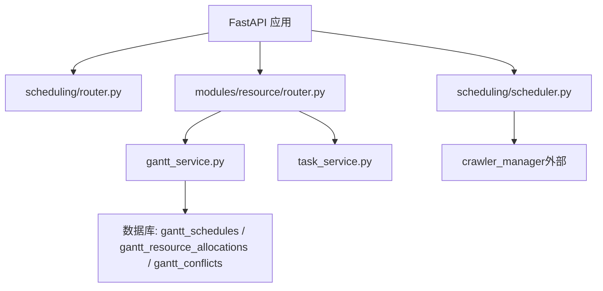
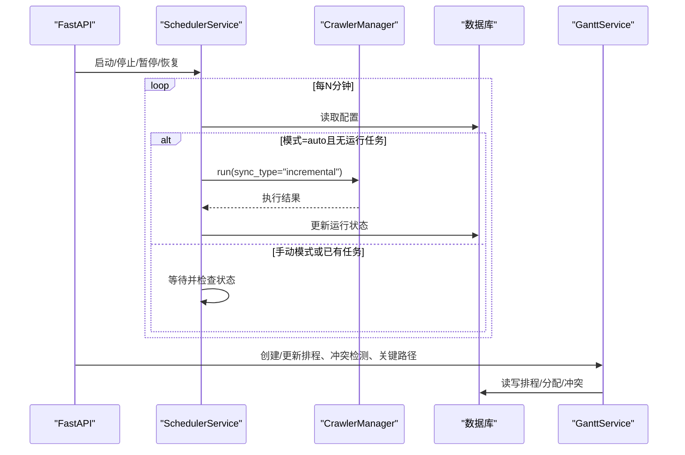
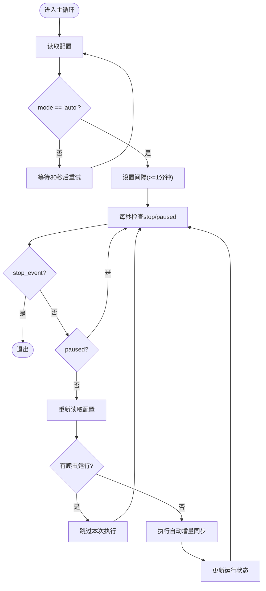
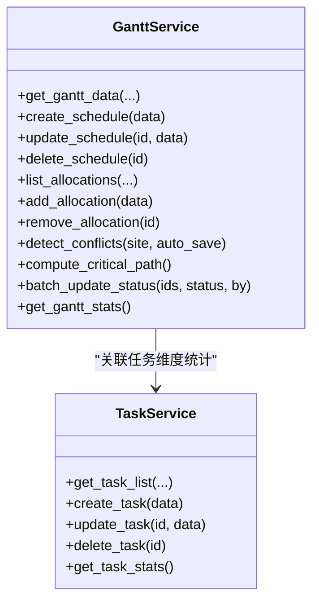
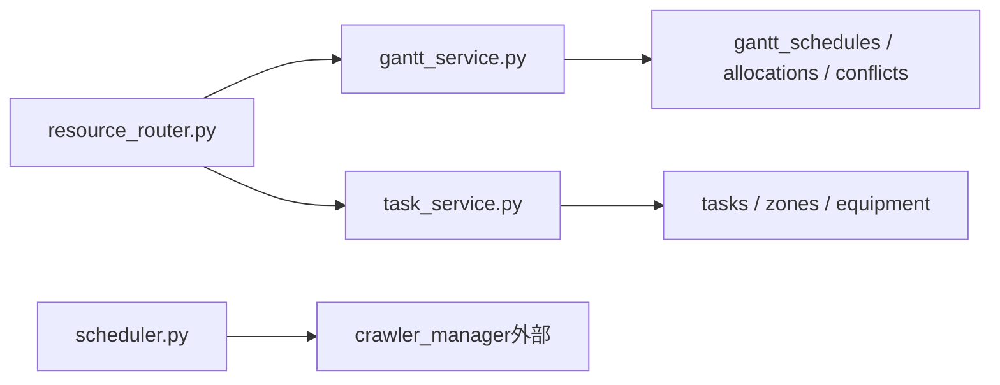

# 调度模块

<cite>
**本文引用的文件**
- [scheduler.py](file://backend/scheduling/scheduler.py)
- [router.py](file://backend/scheduling/router.py)
- [gantt_service.py](file://backend/modules/resource/services/gantt_service.py)
- [task_service.py](file://backend/modules/resource/services/task_service.py)
- [resource_router.py](file://backend/modules/resource/router.py)
- [resource_schema.sql](file://backend/sql/resource_schema.sql)
- [需求文档_V3_BFWS_CPSAT.md](file://需求文档_V3_BFWS_CPSAT.md)
</cite>

## 目录
1. [简介](#简介)
2. [项目结构](#项目结构)
3. [核心组件](#核心组件)
4. [架构总览](#架构总览)
5. [详细组件分析](#详细组件分析)
6. [依赖关系分析](#依赖关系分析)
7. [性能与并发特性](#性能与并发特性)
8. [故障排查与监控](#故障排查与监控)
9. [结论](#结论)
10. [附录：API与配置要点](#附录api与配置要点)

## 简介
本模块聚焦“任务调度系统”的落地实现，涵盖以下能力：
- 定时任务管理：基于后台线程的周期性调度器，按配置自动执行增量同步任务。
- 执行队列与并发控制：通过单例调度器与爬虫管理器状态检查，避免重复执行；资源分配与冲突检测保障资源独占。
- BFWS（Branch and Bound with Windowing Strategy）算法：在需求文档中给出建模思路、约束与目标函数设计，为后续精确排程提供理论基础。
- 甘特图排程：支持可视化任务安排、关键路径计算、资源冲突检测与处理闭环。
- 调度约束处理：时间窗口、资源限制、优先级、前置依赖等。
- 结果分析与评估：统计指标、趋势分析、关键路径与冲突统计。
- 监控与调试：运行日志、状态查询、冲突解决/忽略流程。
- 策略配置与扩展：路由层暴露接口，服务层可插拔扩展。

## 项目结构
调度相关代码主要分布在以下位置：
- 后端定时调度器：backend/scheduling/scheduler.py
- 调度模块路由（占位）：backend/scheduling/router.py
- 甘特图与冲突检测服务：backend/modules/resource/services/gantt_service.py
- 任务管理服务：backend/modules/resource/services/task_service.py
- 资源模块路由（含甘特图API）：backend/modules/resource/router.py
- 数据库表结构（含冲突表）：backend/sql/resource_schema.sql
- BFWS+CP-SAT 需求与设计说明：需求文档_V3_BFWS_CPSAT.md

图表来源
- [router.py:1-14](file://backend/scheduling/router.py#L1-L14)
- [resource_router.py:1190-1419](file://backend/modules/resource/router.py#L1190-L1419)
- [gantt_service.py:176-335](file://backend/modules/resource/services/gantt_service.py#L176-L335)
- [task_service.py:48-146](file://backend/modules/resource/services/task_service.py#L48-L146)
- [scheduler.py:16-196](file://backend/scheduling/scheduler.py#L16-L196)

章节来源
- [scheduler.py:16-196](file://backend/scheduling/scheduler.py#L16-L196)
- [router.py:1-14](file://backend/scheduling/router.py#L1-L14)
- [resource_router.py:1190-1419](file://backend/modules/resource/router.py#L1190-L1419)
- [gantt_service.py:176-335](file://backend/modules/resource/services/gantt_service.py#L176-L335)
- [task_service.py:48-146](file://backend/modules/resource/services/task_service.py#L48-L146)
- [resource_schema.sql:288-325](file://backend/sql/resource_schema.sql#L288-L325)

## 核心组件
- 定时调度器（SchedulerService）：后台线程循环读取配置，按间隔触发自动增量同步，支持暂停/恢复、重配置通知、运行状态查询。
- 甘特图服务（Gantt Service）：提供排程CRUD、资源分配、冲突检测、关键路径计算、批量状态更新、统计看板。
- 任务服务（Task Service）：任务CRUD、进度自动计算、统计与趋势。
- 路由层（Resource Router）：对外暴露甘特图、任务、预警等API，统一封装错误与参数校验。
- 数据库模型：包含排程、资源分配、冲突等表，支撑可视化与分析。

章节来源
- [scheduler.py:16-196](file://backend/scheduling/scheduler.py#L16-L196)
- [gantt_service.py:176-335](file://backend/modules/resource/services/gantt_service.py#L176-L335)
- [task_service.py:48-146](file://backend/modules/resource/services/task_service.py#L48-L146)
- [resource_router.py:1190-1419](file://backend/modules/resource/router.py#L1190-L1419)
- [resource_schema.sql:288-325](file://backend/sql/resource_schema.sql#L288-L325)

## 架构总览
调度系统由“定时调度器 + 甘特图排程引擎 + 任务管理 + 路由层”构成。定时调度器负责周期性触发数据同步；甘特图服务负责排程建模、冲突检测与关键路径分析；任务服务维护基础任务数据；路由层提供HTTP API。

图表来源
- [scheduler.py:93-196](file://backend/scheduling/scheduler.py#L93-L196)
- [resource_router.py:1190-1419](file://backend/modules/resource/router.py#L1190-L1419)
- [gantt_service.py:775-1076](file://backend/modules/resource/services/gantt_service.py#L775-L1076)

## 详细组件分析

### 定时调度器（SchedulerService）
- 功能要点
  - 后台线程循环：读取配置、判断模式、等待间隔、检查是否有爬虫运行、执行自动增量同步。
  - 状态控制：支持暂停/恢复、重配置通知、运行状态查询。
  - 异常处理：捕获异常并记录日志，必要时更新运行状态为失败。
- 并发控制
  - 通过 crawler_manager.is_any_running() 避免重复执行。
  - 使用 Event 和线程标志位控制生命周期。
- 配置来源
  - 从系统配置读取 crawler_mode、crawler_incremental_interval_minutes、enabled_sources_list。

图表来源
- [scheduler.py:93-196](file://backend/scheduling/scheduler.py#L93-L196)

章节来源
- [scheduler.py:16-196](file://backend/scheduling/scheduler.py#L16-L196)

### 甘特图排程服务（Gantt Service）
- 排程CRUD
  - 创建/更新/删除排程，支持字段规范化（计划工时、进度自动计算）、前置依赖序列化/解析。
  - 批量状态更新时自动填充实际开始/结束时间戳。
- 资源分配
  - 新增/删除/批量分配资源，关联到具体排程。
- 冲突检测
  - 资源重叠：按资源类型与编码分组，检测时间段重叠，计算重叠小时数与严重级别。
  - 依赖错过：检查前置任务结束时间与当前任务开始时间的逻辑一致性。
  - 截止风险：对未完成任务对比计划结束时间，超期则标记风险。
  - 场地重叠：同一装配场地的设备/区域在同一时段被多个任务占用。
  - 可选自动保存：将冲突写入 gantt_conflicts 表，并回写排程的 has_conflict/conflict_count。
- 关键路径计算
  - 拓扑排序（Kahn算法），计算最早开始/结束（ES/EF）、最晚开始/结束（LS/LF），松弛量小于阈值判定为关键任务。
- 统计与看板
  - 总数、状态分布、类型分布、场地分布、阶段分布、近8周趋势、关键任务数量、开放冲突数量等。

图表来源
- [gantt_service.py:176-335](file://backend/modules/resource/services/gantt_service.py#L176-L335)
- [gantt_service.py:396-525](file://backend/modules/resource/services/gantt_service.py#L396-L525)
- [gantt_service.py:608-724](file://backend/modules/resource/services/gantt_service.py#L608-L724)
- [gantt_service.py:775-1076](file://backend/modules/resource/services/gantt_service.py#L775-L1076)
- [gantt_service.py:1255-1372](file://backend/modules/resource/services/gantt_service.py#L1255-L1372)
- [task_service.py:48-146](file://backend/modules/resource/services/task_service.py#L48-L146)

章节来源
- [gantt_service.py:176-335](file://backend/modules/resource/services/gantt_service.py#L176-L335)
- [gantt_service.py:396-525](file://backend/modules/resource/services/gantt_service.py#L396-L525)
- [gantt_service.py:608-724](file://backend/modules/resource/services/gantt_service.py#L608-L724)
- [gantt_service.py:775-1076](file://backend/modules/resource/services/gantt_service.py#L775-L1076)
- [gantt_service.py:1255-1372](file://backend/modules/resource/services/gantt_service.py#L1255-L1372)
- [task_service.py:48-146](file://backend/modules/resource/services/task_service.py#L48-L146)

### 任务管理服务（Task Service）
- 任务CRUD：支持分页、筛选、搜索；自动计算进度（除非手动覆盖）。
- 统计与趋势：状态分布、类型分布、月度趋势、平均进度、计划与实际工时汇总。
- 与甘特图联动：任务作为排程的基础实体，便于跨模块分析。

章节来源
- [task_service.py:48-146](file://backend/modules/resource/services/task_service.py#L48-L146)
- [task_service.py:177-237](file://backend/modules/resource/services/task_service.py#L177-L237)
- [task_service.py:240-277](file://backend/modules/resource/services/task_service.py#L240-L277)
- [task_service.py:290-332](file://backend/modules/resource/services/task_service.py#L290-L332)
- [task_service.py:335-432](file://backend/modules/resource/services/task_service.py#L335-L432)

### 路由层（Resource Router）
- 提供甘特图相关API：数据列表、详情、创建/更新/删除、依赖设置、资源分配、冲突检测/列表/解决/忽略、关键路径计算、批量状态更新。
- 提供任务相关API：列表、详情、创建/更新/删除、统计、类型进度对比、月度趋势。
- 统一错误处理与参数校验，返回标准响应格式。

章节来源
- [resource_router.py:1190-1419](file://backend/modules/resource/router.py#L1190-L1419)
- [resource_router.py:646-831](file://backend/modules/resource/router.py#L646-L831)

## 依赖关系分析
- 调度器依赖系统配置与爬虫管理器，用于自动增量同步。
- 甘特图服务依赖数据库表：gantt_schedules、gantt_resource_allocations、gantt_conflicts。
- 任务服务依赖 tasks 表及关联 zones/equipment。
- 路由层依赖各服务模块，形成清晰的“路由→服务→数据”分层。

图表来源
- [resource_router.py:1190-1419](file://backend/modules/resource/router.py#L1190-L1419)
- [gantt_service.py:775-1076](file://backend/modules/resource/services/gantt_service.py#L775-L1076)
- [task_service.py:48-146](file://backend/modules/resource/services/task_service.py#L48-L146)
- [scheduler.py:93-196](file://backend/scheduling/scheduler.py#L93-L196)
- [resource_schema.sql:288-325](file://backend/sql/resource_schema.sql#L288-L325)

章节来源
- [resource_router.py:1190-1419](file://backend/modules/resource/router.py#L1190-L1419)
- [gantt_service.py:775-1076](file://backend/modules/resource/services/gantt_service.py#L775-L1076)
- [task_service.py:48-146](file://backend/modules/resource/services/task_service.py#L48-L146)
- [scheduler.py:93-196](file://backend/scheduling/scheduler.py#L93-L196)
- [resource_schema.sql:288-325](file://backend/sql/resource_schema.sql#L288-L325)

## 性能与并发特性
- 定时调度器
  - 单线程循环，避免重复执行；通过事件与标志位实现轻量级暂停/恢复。
  - 每次循环前检查是否有爬虫运行，降低并发冲突。
- 甘特图冲突检测
  - 资源重叠检测采用分组+两两比较，复杂度 O(N^2) 于同资源分配集合；可通过限定装配场地缩小范围。
  - 关键路径计算使用拓扑排序，线性复杂度 O(V+E)。
- 数据库访问
  - 大量使用条件拼接与分页，减少不必要的数据传输。
  - 冲突检测可选择 auto_save，避免频繁落库。

优化建议
- 对大规模资源分配场景，考虑索引优化与分批检测。
- 关键路径计算可在后台异步执行，前端轮询结果。
- 冲突检测可按装配场地并行化（注意事务与锁）。

[本节为通用性能讨论，不直接分析具体文件]

## 故障排查与监控
- 调度器日志
  - 记录启动、停止、暂停/恢复、配置变更、异常信息。
  - 自动增量同步失败时更新运行状态为 failed。
- 甘特图冲突
  - 冲突列表支持按类型、严重级别、状态、装配场地筛选。
  - 支持解决/忽略操作，并回写排程的冲突计数与标记。
- 任务与排程状态
  - 批量状态更新自动填充实际开始/结束时间戳，便于追踪。
- 监控接口
  - 调度器状态查询：running、paused、interval_minutes、last_run_at。
  - 甘特图统计：总数、状态分布、类型分布、场地分布、阶段分布、近8周趋势、关键任务数、开放冲突数。

章节来源
- [scheduler.py:67-74](file://backend/scheduling/scheduler.py#L67-L74)
- [scheduler.py:149-192](file://backend/scheduling/scheduler.py#L149-L192)
- [gantt_service.py:1079-1247](file://backend/modules/resource/services/gantt_service.py#L1079-L1247)
- [gantt_service.py:1375-1427](file://backend/modules/resource/services/gantt_service.py#L1375-L1427)
- [resource_router.py:1219-1228](file://backend/modules/resource/router.py#L1219-L1228)

## 结论
本调度模块以“定时调度器 + 甘特图排程引擎 + 任务管理”为核心，实现了任务执行的自动化、可视化的排程与冲突检测、以及关键路径分析。BFWS 算法在需求文档中提供了数学建模与优化目标的设计思路，为后续引入 CP-SAT 精确求解奠定基础。当前实现已具备完整的排程 CRUD、资源分配、冲突检测与处理闭环、统计看板与监控能力，满足试制资源数智化管理的核心需求。

[本节为总结性内容，不直接分析具体文件]

## 附录：API与配置要点
- 调度器
  - 启动/停止/暂停/恢复：通过 SchedulerService 方法控制。
  - 状态查询：get_status() 返回运行状态、间隔、上次运行时间。
  - 配置项：crawler_mode、crawler_incremental_interval_minutes、enabled_sources_list。
- 甘特图API
  - 数据列表：GET /api/resource/gantt/data
  - 详情：GET /api/resource/gantt/schedules/{id_or_code}
  - 创建/更新/删除：POST/PUT/DELETE /api/resource/gantt/schedules
  - 依赖设置：PUT /api/resource/gantt/schedules/{id_or_code}/dependencies
  - 资源分配：GET/POST/DELETE /api/resource/gantt/allocations
  - 冲突检测：POST /api/resource/gantt/check-conflicts
  - 冲突列表/解决/忽略：GET/PUT /api/resource/gantt/conflicts
  - 关键路径：POST /api/resource/gantt/compute-critical
  - 批量状态更新：POST /api/resource/gantt/batch-status
- 数据库表
  - gantt_schedules：排程主表
  - gantt_resource_allocations：资源分配表
  - gantt_conflicts：冲突表（类型、严重级别、重叠时间、建议、状态等）

章节来源
- [scheduler.py:67-74](file://backend/scheduling/scheduler.py#L67-L74)
- [scheduler.py:76-92](file://backend/scheduling/scheduler.py#L76-L92)
- [resource_router.py:1190-1419](file://backend/modules/resource/router.py#L1190-L1419)
- [resource_schema.sql:288-325](file://backend/sql/resource_schema.sql#L288-L325)

## BFWS 算法与 CP-SAT 设计说明（需求文档摘要）
- 背景与动机
  - 当前装配顺序推荐基于启发式规则，无法保证全局最优性与连锁阻塞效应量化。
  - 引入 BFWS + CP-SAT 可实现数学精确排程，结合甘特图与关键路径分析，输出鲁棒性报告。
- 建模要点
  - 时间跨度（Horizon）估算。
  - 决策变量：每个车型在每个工位的开始/结束时间与区间变量。
  - 核心约束：工序顺序、工位无重叠、关键件到货时间窗。
  - 目标函数：加权多目标（完工时间、风险惩罚等）。
- 实施路径
  - 阶段1：核心排程引擎（模型构建、求解器封装、API）。
  - 阶段2：前端可视化（甘特图、What-if 配置）。
  - 阶段3：鲁棒性与联动（多场景分析、看板联动）。
  - 阶段4：优化与打磨（性能调优、错误处理、用户体验）。

章节来源
- [需求文档_V3_BFWS_CPSAT.md:1-200](file://需求文档_V3_BFWS_CPSAT.md#L1-L200)
- [需求文档_V3_BFWS_CPSAT.md:395-496](file://需求文档_V3_BFWS_CPSAT.md#L395-L496)
- [需求文档_V3_BFWS_CPSAT.md:517-555](file://需求文档_V3_BFWS_CPSAT.md#L517-L555)