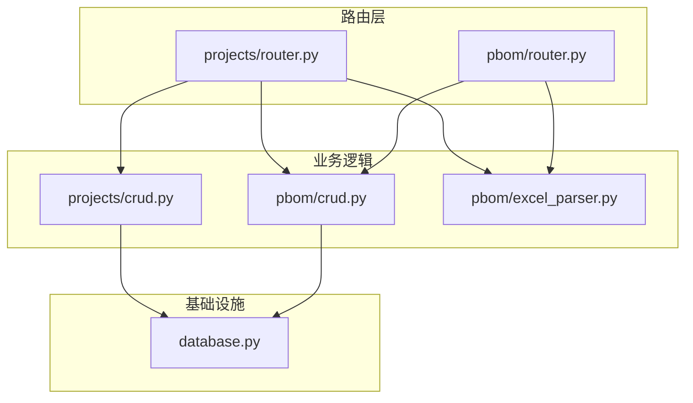
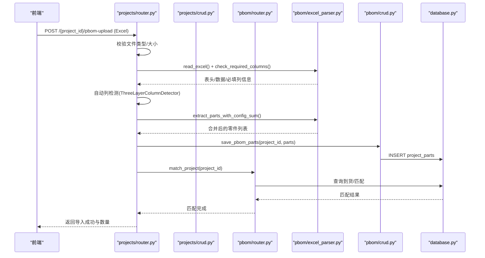
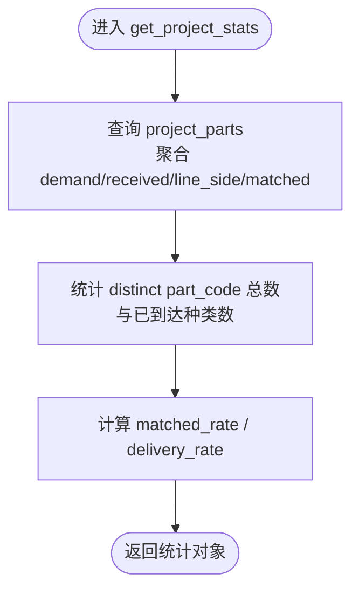
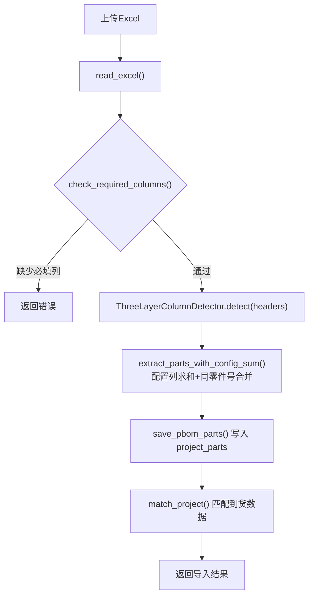
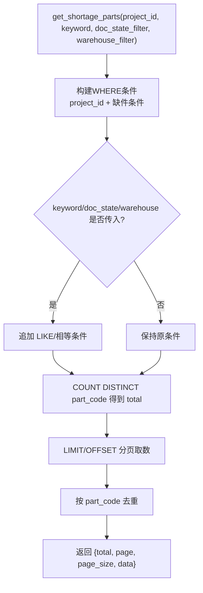
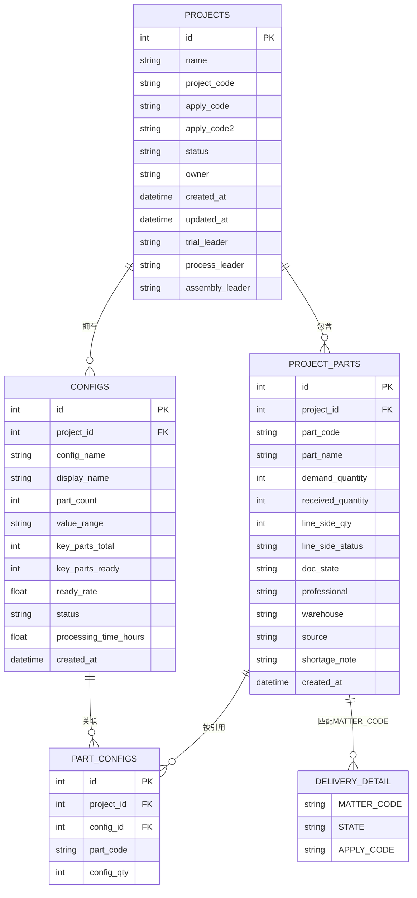
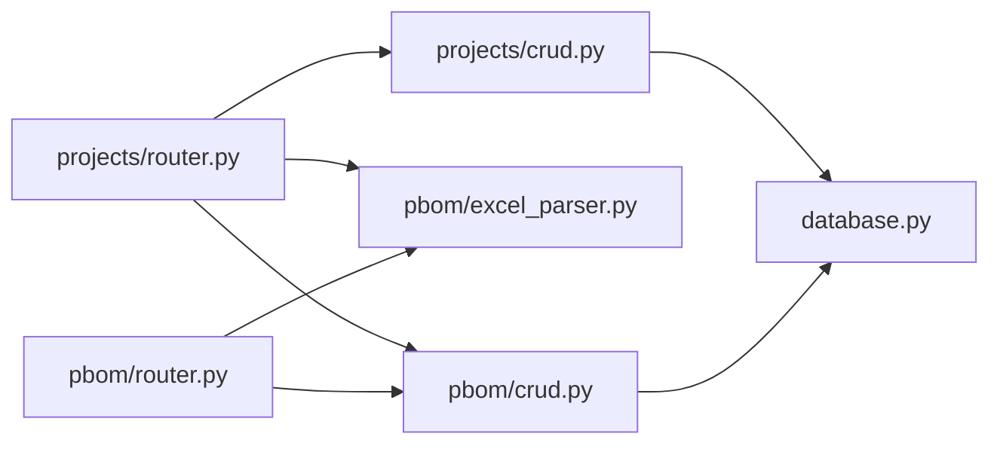

# 项目管理模块

<cite>
**本文引用的文件**
- [backend/projects/router.py](file://backend/projects/router.py)
- [backend/projects/crud.py](file://backend/projects/crud.py)
- [backend/projects/schemas.py](file://backend/projects/schemas.py)
- [backend/pbom/router.py](file://backend/pbom/router.py)
- [backend/pbom/excel_parser.py](file://backend/pbom/excel_parser.py)
- [backend/pbom/crud.py](file://backend/pbom/crud.py)
- [backend/pbom/schemas.py](file://backend/pbom/schemas.py)
- [backend/database.py](file://backend/database.py)
</cite>

## 目录
1. [简介](#简介)
2. [项目结构](#项目结构)
3. [核心组件](#核心组件)
4. [架构总览](#架构总览)
5. [详细组件分析](#详细组件分析)
6. [依赖关系分析](#依赖关系分析)
7. [性能考虑](#性能考虑)
8. [故障排查指南](#故障排查指南)
9. [结论](#结论)
10. [附录：API使用示例与集成指南](#附录api使用示例与集成指南)

## 简介
本模块提供“项目管理”的完整能力，包括项目的增删改查、PBOM（产品物料清单）Excel模板下载与导入解析、零件清单管理、缺件分析与统计指标计算。通过自动列检测与配置合并机制，支持从不同格式的PBOM表格中准确提取零件与需求量；同时提供按单据状态、仓库、关键词等多维度的缺件查询接口，便于生产与供应链协同。

## 项目结构
后端采用 FastAPI 路由层 + CRUD 数据访问层的分层设计：
- 路由层：定义REST API，处理请求参数、上传文件、调用业务逻辑并返回响应
- 数据访问层：封装数据库操作，统一查询/写入接口
- PBOM解析：基于pandas读取Excel，自动识别必填列与配置列，合并同零件号的需求量
- 匹配与统计：将PBOM与到货数据关联，计算齐套率、到货率等关键指标

图表来源
- [backend/projects/router.py:1-231](file://backend/projects/router.py#L1-L231)
- [backend/pbom/router.py:1-166](file://backend/pbom/router.py#L1-L166)
- [backend/projects/crud.py:1-311](file://backend/projects/crud.py#L1-L311)
- [backend/pbom/crud.py:1-91](file://backend/pbom/crud.py#L1-L91)
- [backend/pbom/excel_parser.py:1-203](file://backend/pbom/excel_parser.py#L1-L203)
- [backend/database.py:1-116](file://backend/database.py#L1-L116)

章节来源
- [backend/projects/router.py:1-231](file://backend/projects/router.py#L1-L231)
- [backend/pbom/router.py:1-166](file://backend/pbom/router.py#L1-L166)
- [backend/projects/crud.py:1-311](file://backend/projects/crud.py#L1-L311)
- [backend/pbom/crud.py:1-91](file://backend/pbom/crud.py#L1-L91)
- [backend/pbom/excel_parser.py:1-203](file://backend/pbom/excel_parser.py#L1-L203)
- [backend/database.py:1-116](file://backend/database.py#L1-L116)

## 核心组件
- 项目CRUD：创建、更新、删除、分页查询项目，附带基础统计字段
- PBOM导入与解析：下载模板、上传Excel、自动列检测、配置列合并、保存零件与配置
- 零件清单管理：查看某项目下的全部零件及需求、到货、线边情况
- 缺件分析：按项目维度查询未齐套零件，支持关键词、单据状态、仓库筛选
- 统计指标：零件总数、总需求量、总到货量、线边量、齐套率、到货率等

章节来源
- [backend/projects/router.py:32-149](file://backend/projects/router.py#L32-L149)
- [backend/projects/crud.py:5-168](file://backend/projects/crud.py#L5-L168)
- [backend/pbom/router.py:23-166](file://backend/pbom/router.py#L23-L166)
- [backend/pbom/excel_parser.py:14-203](file://backend/pbom/excel_parser.py#L14-L203)
- [backend/pbom/crud.py:10-91](file://backend/pbom/crud.py#L10-L91)

## 架构总览
下图展示了从前端发起请求到后端处理、解析、落库、匹配的完整流程。

图表来源
- [backend/projects/router.py:152-231](file://backend/projects/router.py#L152-L231)
- [backend/pbom/excel_parser.py:24-187](file://backend/pbom/excel_parser.py#L24-L187)
- [backend/pbom/crud.py:10-36](file://backend/pbom/crud.py#L10-L36)
- [backend/database.py:51-116](file://backend/database.py#L51-L116)

## 详细组件分析

### 项目CRUD与统计
- 列表与详情：分页获取项目列表，并在每条记录中附加需求总量、到货总量、线边总量、齐套率、到货率等统计
- 创建/更新/删除：严格校验项目是否存在，更新时仅写入非空字段
- 统计接口：按项目维度汇总零件数、需求量、到货量、线边量、齐套率、到货率

图表来源
- [backend/projects/crud.py:138-168](file://backend/projects/crud.py#L138-L168)

章节来源
- [backend/projects/router.py:32-105](file://backend/projects/router.py#L32-L105)
- [backend/projects/crud.py:5-168](file://backend/projects/crud.py#L5-L168)
- [backend/projects/schemas.py:5-26](file://backend/projects/schemas.py#L5-L26)

### PBOM导入与解析
- 模板下载：提供标准PBOM导入模板下载
- 文件上传：限制为xlsx/xls/csv，流式写入临时文件，记录日志
- 必填列检查：自动识别“零件号/零件名称/需求量”等列，缺失则报错
- 自动列检测：三层检测器识别配置列（如车型/批次），置信度阈值过滤
- 配置合并：同一行多个配置列数值相加作为该零件总需求；相同零件号自动合并
- 持久化：先清空再插入，确保数据一致性；保存配置与零件-配置关联
- 匹配：导入后触发PBOM匹配，将PBOM与到货数据对齐

图表来源
- [backend/projects/router.py:152-231](file://backend/projects/router.py#L152-L231)
- [backend/pbom/excel_parser.py:24-187](file://backend/pbom/excel_parser.py#L24-L187)
- [backend/pbom/crud.py:10-36](file://backend/pbom/crud.py#L10-L36)

章节来源
- [backend/projects/router.py:20-231](file://backend/projects/router.py#L20-L231)
- [backend/pbom/excel_parser.py:14-203](file://backend/pbom/excel_parser.py#L14-L203)
- [backend/pbom/crud.py:10-91](file://backend/pbom/crud.py#L10-L91)

### 零件清单管理
- 列出项目下所有零件及其需求、到货、线边、来源、备注等信息
- 支持后续扩展：可按状态、仓库、专业师等条件筛选（当前实现以项目维度为主）

章节来源
- [backend/projects/router.py:84-87](file://backend/projects/router.py#L84-L87)
- [backend/projects/crud.py:129-135](file://backend/projects/crud.py#L129-L135)

### 缺件分析与多维度筛选
- 缺件定义：仓库未到货或线边未齐套（received_quantity=0 或 line_side_qty < demand_quantity）
- 筛选维度：
  - 关键词：支持零件号、零件名、专业师模糊搜索
  - 单据状态：all/入库完成/待检/不合格待判定等
  - 仓库：内部/外部/样机/研发/第三方/自制/调拨等
- 去重：按part_code去重，避免重复展示
- 分布统计：未到仓库缺件的单据状态分布，结合delivery_detail最新状态

图表来源
- [backend/projects/crud.py:171-232](file://backend/projects/crud.py#L171-L232)

章节来源
- [backend/projects/router.py:108-140](file://backend/projects/router.py#L108-L140)
- [backend/projects/crud.py:171-311](file://backend/projects/crud.py#L171-L311)

### 数据模型与关系
- projects：项目主表
- project_parts：项目零件明细（需求、到货、线边、来源、备注等）
- configs：配置项（如车型/批次）
- part_configs：零件-配置关联（每个配置下的需求量）
- delivery_detail：到货单据明细（用于状态分布与匹配）

图表来源
- [backend/pbom/crud.py:10-91](file://backend/pbom/crud.py#L10-L91)
- [backend/projects/crud.py:138-311](file://backend/projects/crud.py#L138-L311)

## 依赖关系分析
- 路由层依赖CRUD与解析器：projects/router.py 依赖 projects/crud.py、pbom/excel_parser.py、pbom/crud.py
- 解析器依赖pandas进行Excel读写与统计
- 数据访问层统一通过database.py连接池执行SQL
- 匹配逻辑在导入后触发，关联到货数据以更新齐套状态

图表来源
- [backend/projects/router.py:1-231](file://backend/projects/router.py#L1-L231)
- [backend/pbom/router.py:1-166](file://backend/pbom/router.py#L1-L166)
- [backend/projects/crud.py:1-311](file://backend/projects/crud.py#L1-L311)
- [backend/pbom/crud.py:1-91](file://backend/pbom/crud.py#L1-L91)
- [backend/pbom/excel_parser.py:1-203](file://backend/pbom/excel_parser.py#L1-L203)
- [backend/database.py:1-116](file://backend/database.py#L1-L116)

章节来源
- [backend/projects/router.py:1-231](file://backend/projects/router.py#L1-L231)
- [backend/pbom/router.py:1-166](file://backend/pbom/router.py#L1-L166)
- [backend/projects/crud.py:1-311](file://backend/projects/crud.py#L1-L311)
- [backend/pbom/crud.py:1-91](file://backend/pbom/crud.py#L1-L91)
- [backend/pbom/excel_parser.py:1-203](file://backend/pbom/excel_parser.py#L1-L203)
- [backend/database.py:1-116](file://backend/database.py#L1-L116)

## 性能考虑
- Excel解析：使用pandas一次性读取，适合中等规模表格；超大文件建议分片或流式处理
- 配置列求和：对每行遍历配置列并累加，时间复杂度O(R*C)，R为行数，C为配置列数
- 去重与统计：使用DISTINCT与聚合函数，注意索引优化（part_code、project_id、doc_state、warehouse）
- 数据库连接池：复用连接，减少握手开销；写操作批量提交，异常回滚保证一致性
- 文件上传：流式写入临时文件，避免内存峰值过高；导入完成后清理临时文件

[本节为通用性能建议，不直接分析具体代码文件]

## 故障排查指南
- 模板不存在：下载模板接口返回404，需确认静态模板路径存在
- 文件格式不支持：仅允许xlsx/xls/csv，其他格式拒绝
- 必填列缺失：自动检测失败会返回明确缺失列提示
- 未提取到有效数据：当无有效零件行时返回400错误
- 数据库连接失败：初始化连接池失败会输出详细配置提示，检查.env中的DB_HOST/PORT/USER/PASSWORD/DATABASE
- 匹配失败：PBOM匹配异常会被捕获并记录警告，不影响导入主流程

章节来源
- [backend/projects/router.py:20-231](file://backend/projects/router.py#L20-L231)
- [backend/pbom/router.py:23-166](file://backend/pbom/router.py#L23-L166)
- [backend/database.py:12-43](file://backend/database.py#L12-L43)

## 结论
本项目管理模块围绕“项目—PBOM—零件—到货”的主线，提供了完整的CRUD、导入解析、缺件分析与统计能力。通过自动列检测与配置合并，兼容多种PBOM格式；通过多维度缺件查询与状态分布，支撑生产与供应链决策。整体架构清晰、职责分离，具备良好的可扩展性与可维护性。

[本节为总结性内容，不直接分析具体代码文件]

## 附录：API使用示例与集成指南

### 项目相关接口
- 下载PBOM导入模板
  - GET /projects/pbom-template
  - 说明：返回标准Excel模板，用于填写PBOM数据
- 项目列表
  - GET /projects/?page=1&page_size=20
  - 返回：projects数组、total总数
- 获取项目详情
  - GET /projects/{project_id}
  - 返回：项目信息与统计字段
- 创建项目
  - POST /projects/
  - 请求体：name、project_code、apply_code、apply_code2、status、trial_leader、process_leader、assembly_leader
- 更新项目
  - PUT /projects/{project_id}
  - 请求体：仅传入需要更新的字段
- 删除项目
  - DELETE /projects/{project_id}
- 项目零件清单
  - GET /projects/{project_id}/parts
- 项目统计
  - GET /projects/{project_id}/stats
  - 返回：total_parts、total_demand、total_received、total_line_side、matched_rate
- 缺件分析
  - GET /projects/{project_id}/shortage-parts?page=1&page_size=20&keyword=&doc_state_filter=all&warehouse_filter=all
  - 返回：total、page、page_size、data（去重后的缺件零件）
- 单据状态分布
  - GET /projects/{project_id}/doc-state-distribution
  - 返回：total_shortage_types、distribution（按状态分组统计）

章节来源
- [backend/projects/router.py:20-140](file://backend/projects/router.py#L20-L140)
- [backend/projects/crud.py:5-311](file://backend/projects/crud.py#L5-L311)

### PBOM相关接口
- 上传PBOM（独立于项目）
  - POST /pbom/upload
  - 说明：仅接收xlsx/xls，返回文件路径与大小
- 检测配置列
  - POST /pbom/detect-columns?file_path=...
  - 返回：need_confirm、candidates（含confidence与stats）
- 解析并保存PBOM
  - POST /pbom/parse
  - 请求体：project_id、file_path、confirmed_columns、display_names
  - 说明：用户确认后保存零件与配置，并建立关联
- 获取项目零件与配置
  - GET /pbom/{project_id}/parts
  - 返回：parts、configs
- 执行PBOM匹配
  - POST /pbom/{project_id}/match
  - 说明：将PBOM与到货数据匹配，更新齐套状态

章节来源
- [backend/pbom/router.py:23-166](file://backend/pbom/router.py#L23-L166)
- [backend/pbom/excel_parser.py:24-187](file://backend/pbom/excel_parser.py#L24-L187)
- [backend/pbom/crud.py:10-91](file://backend/pbom/crud.py#L10-L91)

### 集成要点
- 环境变量：确保backend/.env中数据库配置正确，否则连接池初始化失败
- 模板文件：确保static目录下存在PBOM导入模板.xlsx
- 权限：MySQL用户需具备warehouse_data库的读写权限
- 错误处理：前端需处理400/404/500等状态码，并提示用户修正输入或重试
- 性能：大文件导入建议异步处理与进度反馈；必要时拆分导入任务

章节来源
- [backend/database.py:12-43](file://backend/database.py#L12-L43)
- [backend/projects/router.py:17-29](file://backend/projects/router.py#L17-L29)