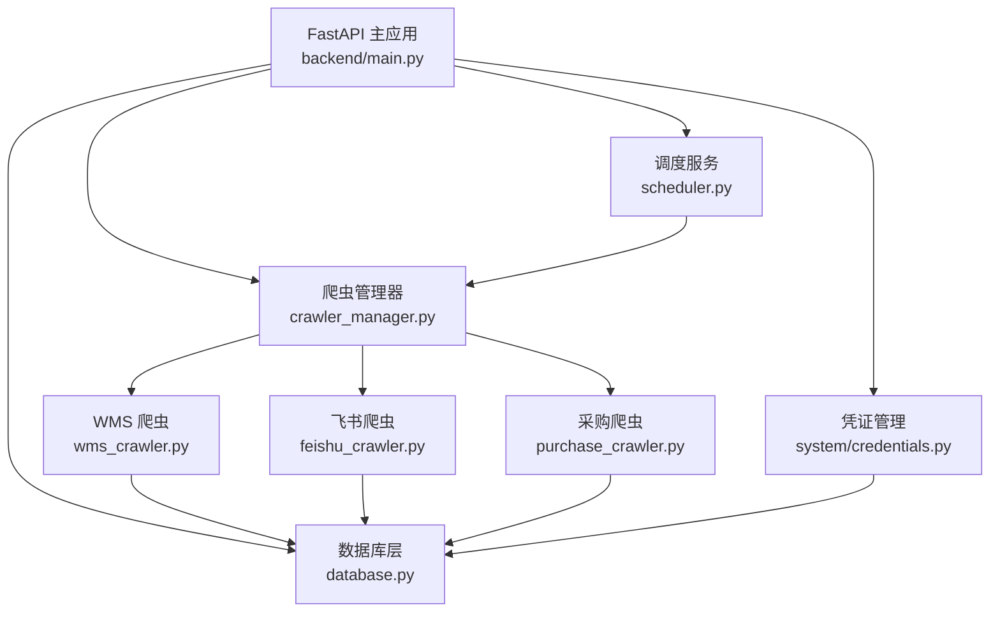
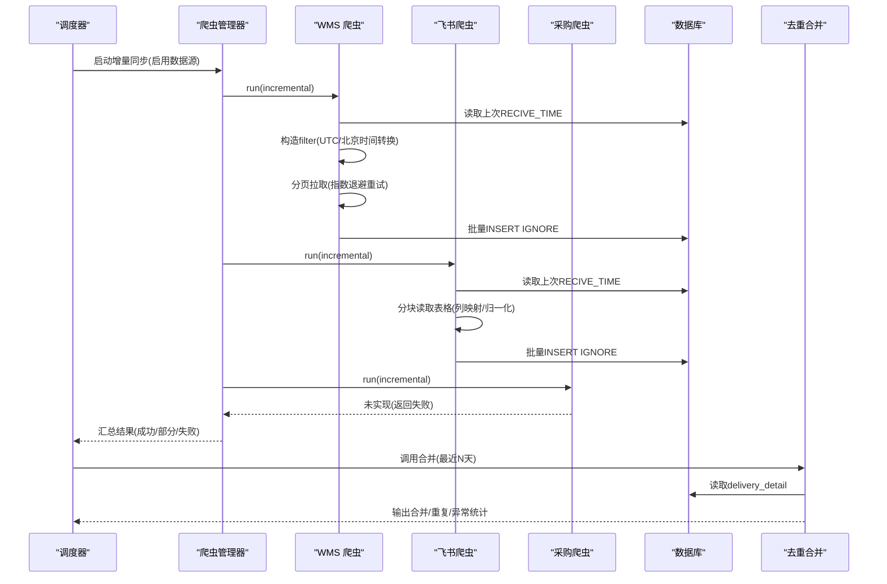
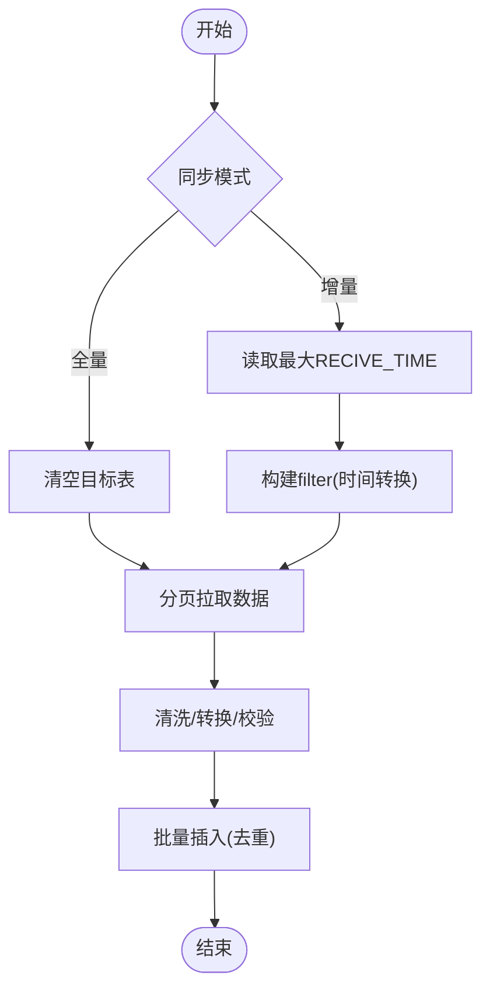
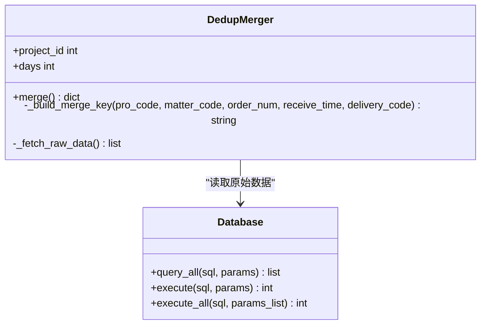
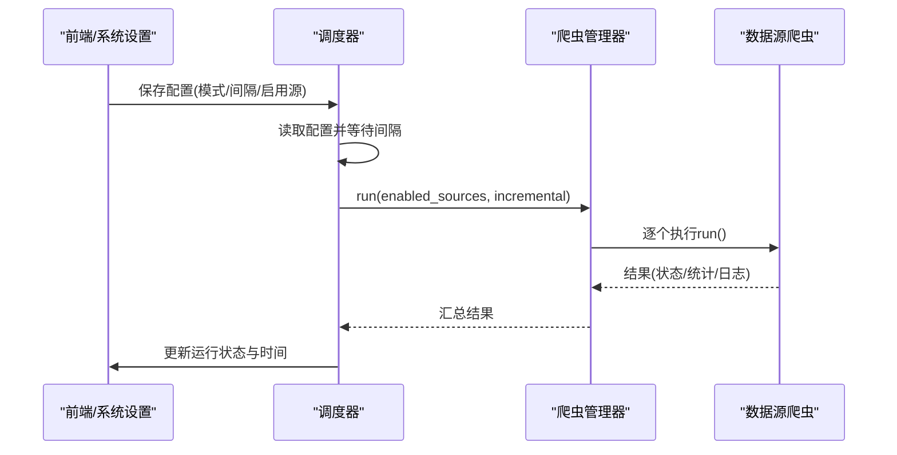
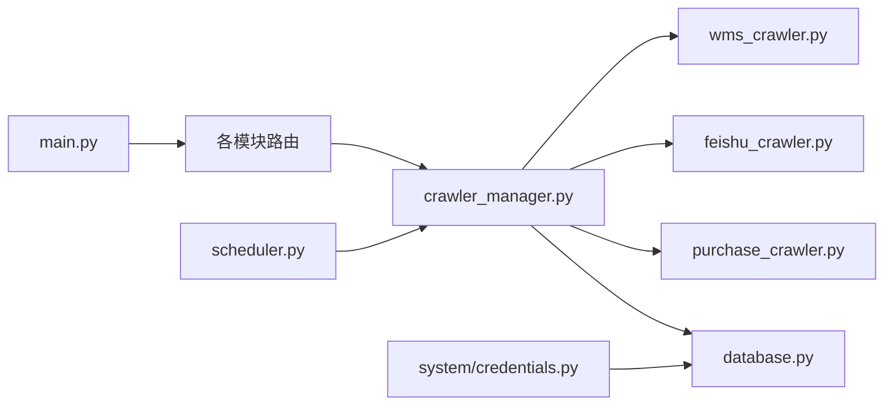

# 数据流架构

<cite>
**本文引用的文件**
- [backend/main.py](file://backend/main.py)
- [backend/config.py](file://backend/config.py)
- [backend/database.py](file://backend/database.py)
- [backend/logger.py](file://backend/logger.py)
- [backend/crawlers/base.py](file://backend/crawlers/base.py)
- [backend/crawlers/crawler_manager.py](file://backend/crawlers/crawler_manager.py)
- [backend/crawlers/wms_crawler.py](file://backend/crawlers/wms_crawler.py)
- [backend/crawlers/feishu_crawler.py](file://backend/crawlers/feishu_crawler.py)
- [backend/crawlers/purchase_crawler.py](file://backend/crawlers/purchase_crawler.py)
- [backend/delivery/dedup_merger.py](file://backend/delivery/dedup_merger.py)
- [backend/scheduling/scheduler.py](file://backend/scheduling/scheduler.py)
- [backend/system/credentials.py](file://backend/system/credentials.py)
- [backend/sql/resource_schema.sql](file://backend/sql/resource_schema.sql)
- [backend/pbom/excel_parser.py](file://backend/pbom/excel_parser.py)
</cite>

## 目录
1. [简介](#简介)
2. [项目结构](#项目结构)
3. [核心组件](#核心组件)
4. [架构总览](#架构总览)
5. [详细组件分析](#详细组件分析)
6. [依赖关系分析](#依赖关系分析)
7. [性能与缓存策略](#性能与缓存策略)
8. [故障排查指南](#故障排查指南)
9. [结论](#结论)
10. [附录](#附录)

## 简介
本文件面向“多源到货数据”的完整数据流架构，覆盖从数据采集、清洗转换、去重合并、持久化存储到前端展示的全链路。系统通过统一爬虫框架接入 WMS（di360）、飞书共享表、采购系统等外部数据源；在调度器驱动下按配置周期执行增量或全量同步；入库后基于五维键进行跨源去重与异常标记；最终为 PBOM 解析、关键件评分、资源看板等上层业务提供一致、可靠的数据基础。

## 项目结构
后端采用 FastAPI 应用作为入口，集中注册各模块路由；爬虫子系统以抽象基类 + 具体实现的方式管理多数据源采集；数据库层使用连接池封装读写；调度器负责后台定时任务；凭证管理统一维护外部系统鉴权信息；PBOM Excel 解析用于装配计划与需求计算；SQL 脚本定义资源域相关表结构。

图表来源
- [backend/main.py:18-83](file://backend/main.py#L18-L83)
- [backend/crawlers/crawler_manager.py:90-97](file://backend/crawlers/crawler_manager.py#L90-L97)
- [backend/scheduling/scheduler.py:34-74](file://backend/scheduling/scheduler.py#L34-L74)
- [backend/system/credentials.py:25-148](file://backend/system/credentials.py#L25-L148)
- [backend/database.py:12-48](file://backend/database.py#L12-L48)

章节来源
- [backend/main.py:18-83](file://backend/main.py#L18-L83)
- [backend/config.py:48-101](file://backend/config.py#L48-L101)

## 核心组件
- 应用入口与路由：FastAPI 启动、CORS、健康检查、SPA 回退、模块路由注册。
- 配置中心：环境变量加载、数据库/WMS/飞书/采购/LLM/服务端口等全局配置。
- 数据库层：连接池、查询/批量写入、事务回滚封装。
- 爬虫基类与结果模型：统一状态、进度、日志、结果对象。
- 爬虫管理器：单例、任务生命周期、异步执行、停止控制、聚合统计。
- 数据源爬虫：WMS（分页+服务端过滤+时间转换）、飞书（分块读取+列映射+仓库归一化）、采购（占位）。
- 调度器：后台线程、自动/手动模式、间隔轮询、冲突避免。
- 凭证管理：WMS 登录/Token 更新、飞书 tenant_access_token 获取与刷新、系统参数与运行状态。
- 去重合并：五维键分组、重复与异常标记、统计输出。
- PBOM 解析：Excel 列识别、需求量求和、零件提取。
- 日志：滚动文件与控制台双输出。

章节来源
- [backend/main.py:29-83](file://backend/main.py#L29-L83)
- [backend/config.py:48-101](file://backend/config.py#L48-L101)
- [backend/database.py:12-116](file://backend/database.py#L12-L116)
- [backend/crawlers/base.py:12-67](file://backend/crawlers/base.py#L12-L67)
- [backend/crawlers/crawler_manager.py:22-305](file://backend/crawlers/crawler_manager.py#L22-L305)
- [backend/crawlers/wms_crawler.py:44-477](file://backend/crawlers/wms_crawler.py#L44-L477)
- [backend/crawlers/feishu_crawler.py:55-419](file://backend/crawlers/feishu_crawler.py#L55-L419)
- [backend/crawlers/purchase_crawler.py:12-49](file://backend/crawlers/purchase_crawler.py#L12-L49)
- [backend/scheduling/scheduler.py:16-196](file://backend/scheduling/scheduler.py#L16-L196)
- [backend/system/credentials.py:25-573](file://backend/system/credentials.py#L25-L573)
- [backend/delivery/dedup_merger.py:7-128](file://backend/delivery/dedup_merger.py#L7-L128)
- [backend/pbom/excel_parser.py:14-203](file://backend/pbom/excel_parser.py#L14-L203)
- [backend/logger.py:14-42](file://backend/logger.py#L14-L42)

## 架构总览
下图展示了端到端数据流：调度器触发 → 爬虫管理器协调 → 各数据源抓取 → 清洗/转换/校验 → 批量入库 → 去重合并 → 上层业务消费（PBOM、关键件、资源看板等）。

图表来源
- [backend/scheduling/scheduler.py:93-196](file://backend/scheduling/scheduler.py#L93-L196)
- [backend/crawlers/crawler_manager.py:199-301](file://backend/crawlers/crawler_manager.py#L199-L301)
- [backend/crawlers/wms_crawler.py:127-310](file://backend/crawlers/wms_crawler.py#L127-L310)
- [backend/crawlers/feishu_crawler.py:132-249](file://backend/crawlers/feishu_crawler.py#L132-L249)
- [backend/crawlers/purchase_crawler.py:23-39](file://backend/crawlers/purchase_crawler.py#L23-L39)
- [backend/delivery/dedup_merger.py:36-128](file://backend/delivery/dedup_merger.py#L36-L128)

## 详细组件分析

### 数据采集与多源集成
- WMS（di360）
  - 认证：从凭证表读取 authorization/cookie，设置请求头并复用 Session。
  - 增量：根据数据库最大 RECIVE_TIME 构造 filter 数组传入 API，服务端直接返回新数据。
  - 时间处理：API 使用 UTC，数据库存北京时间；入库时 +8h，过滤条件 -8h。
  - 分页与重试：固定页大小，指数退避重试，记录日志与进度。
  - 入库：批量 INSERT IGNORE 去重，字段顺序与 delivery_detail 表一致。
- 飞书共享表
  - 认证：通过 credentials 获取 tenant_access_token，自动过期刷新。
  - 拉取：v2 API 分块读取，避免 10MB 限制；空行连续检测提前终止。
  - 清洗：列映射、数值规范化、日期多格式解析、仓库名称归一化。
  - 入库：批量 INSERT IGNORE 至 feishu_detail。
- 采购系统
  - 当前为占位实现，返回失败提示，待后续接入 API。

图表来源
- [backend/crawlers/wms_crawler.py:313-467](file://backend/crawlers/wms_crawler.py#L313-L467)
- [backend/crawlers/feishu_crawler.py:251-399](file://backend/crawlers/feishu_crawler.py#L251-L399)

章节来源
- [backend/crawlers/wms_crawler.py:64-110](file://backend/crawlers/wms_crawler.py#L64-L110)
- [backend/crawlers/wms_crawler.py:127-213](file://backend/crawlers/wms_crawler.py#L127-L213)
- [backend/crawlers/wms_crawler.py:216-310](file://backend/crawlers/wms_crawler.py#L216-L310)
- [backend/crawlers/feishu_crawler.py:84-130](file://backend/crawlers/feishu_crawler.py#L84-L130)
- [backend/crawlers/feishu_crawler.py:132-203](file://backend/crawlers/feishu_crawler.py#L132-L203)
- [backend/crawlers/feishu_crawler.py:205-249](file://backend/crawlers/feishu_crawler.py#L205-L249)
- [backend/crawlers/purchase_crawler.py:23-39](file://backend/crawlers/purchase_crawler.py#L23-L39)

### 数据处理管道（清洗、转换、验证、去重）
- 清洗与转换
  - WMS：时间 +8h 入库、数字字段安全转换、空值兜底。
  - 飞书：多格式日期解析、数值清理、仓库名关键词归一化。
- 验证
  - 必填字段存在性、类型安全转换、空行过滤。
- 去重
  - 入库阶段：INSERT IGNORE 基于唯一约束（如 delivery_detail 主键/唯一索引）。
  - 合并阶段：五维键 (项目号, 零件号, 数量, 日期, 单据号) 分组，标记多源重复与数量不一致异常。

图表来源
- [backend/delivery/dedup_merger.py:7-128](file://backend/delivery/dedup_merger.py#L7-L128)
- [backend/database.py:51-116](file://backend/database.py#L51-L116)

章节来源
- [backend/delivery/dedup_merger.py:21-34](file://backend/delivery/dedup_merger.py#L21-L34)
- [backend/delivery/dedup_merger.py:36-128](file://backend/delivery/dedup_merger.py#L36-L128)

### 调度与自动化
- 调度器
  - 后台线程循环，支持自动/手动模式。
  - 从系统参数读取增量间隔、启用数据源列表。
  - 避免与正在运行的爬虫冲突，暂停/恢复机制。
  - 执行完成后更新运行状态与时间戳。
- 爬虫管理器
  - 支持同步阻塞与异步后台线程两种模式。
  - 统一重置状态、日志、进度，便于前端实时查看。
  - 聚合多个爬虫结果，统计成功/失败数。

图表来源
- [backend/scheduling/scheduler.py:76-196](file://backend/scheduling/scheduler.py#L76-L196)
- [backend/crawlers/crawler_manager.py:119-197](file://backend/crawlers/crawler_manager.py#L119-L197)
- [backend/crawlers/crawler_manager.py:199-301](file://backend/crawlers/crawler_manager.py#L199-L301)

章节来源
- [backend/scheduling/scheduler.py:16-196](file://backend/scheduling/scheduler.py#L16-L196)
- [backend/crawlers/crawler_manager.py:22-305](file://backend/crawlers/crawler_manager.py#L22-L305)

### 凭证与鉴权
- WMS
  - 支持自动登录获取 JWT/Cookie，或手动粘贴 Token/Cookie。
  - 同一 source 仅保留最新激活凭证，旧凭证失效。
- 飞书
  - 通过 app_id/app_secret 获取 tenant_access_token，自动刷新过期 token。
  - 支持从 .env 或凭证表读取配置。
- 系统参数
  - 统一管理爬虫模式、间隔、启用源、最后运行时间与状态。

章节来源
- [backend/system/credentials.py:25-148](file://backend/system/credentials.py#L25-L148)
- [backend/system/credentials.py:448-573](file://backend/system/credentials.py#L448-L573)
- [backend/system/credentials.py:297-401](file://backend/system/credentials.py#L297-L401)

### PBOM 解析与需求计算
- Excel 解析器
  - 自动识别列名（零件号、名称、需求量等），支持多种命名习惯。
  - 支持单列或多配置列求和合并，相同零件号自动汇总需求。
- 用途
  - 为装配计划、关键件评分、物料齐套分析提供基础数据。

章节来源
- [backend/pbom/excel_parser.py:14-203](file://backend/pbom/excel_parser.py#L14-L203)

### 数据存储与一致性
- 数据库连接池
  - 延迟初始化，失败时给出明确配置提示。
  - 写操作封装 commit/rollback，保证原子性。
- 去重与幂等
  - 入库使用 INSERT IGNORE，结合唯一约束避免重复。
  - 合并阶段对多源重复与数量异常进行标记，便于人工复核。
- 备份与恢复
  - 建议基于 MySQL/MariaDB 原生工具（mysqldump 或企业级备份方案）定期备份；本仓库未内置备份逻辑。

章节来源
- [backend/database.py:12-116](file://backend/database.py#L12-L116)
- [backend/delivery/dedup_merger.py:36-128](file://backend/delivery/dedup_merger.py#L36-L128)

### 监控与审计追踪
- 运行日志
  - 每个爬虫维护内存日志缓冲区（限长），供前端轮询查看。
  - 统一 logger 输出到文件与控制台，支持滚动与级别控制。
- 调度状态
  - 记录最近运行时间、状态、间隔、是否暂停。
- 凭证变更
  - 每次登录/刷新会更新凭证并标记旧凭证失效，便于审计。

章节来源
- [backend/crawlers/wms_crawler.py:111-125](file://backend/crawlers/wms_crawler.py#L111-L125)
- [backend/crawlers/feishu_crawler.py:72-82](file://backend/crawlers/feishu_crawler.py#L72-L82)
- [backend/logger.py:14-42](file://backend/logger.py#L14-L42)
- [backend/scheduling/scheduler.py:67-74](file://backend/scheduling/scheduler.py#L67-L74)
- [backend/system/credentials.py:68-81](file://backend/system/credentials.py#L68-L81)

### 数据安全与隐私合规
- 传输安全
  - 外部接口访问可禁用证书校验（生产环境建议开启并配置 CA）。
- 凭证安全
  - 凭证存储在数据库，敏感字段建议加密存储；当前以明文保存，需结合部署环境权限控制。
- 最小权限
  - 数据库账号仅授予必要权限；网络访问白名单限制。
- 合规建议
  - 遵循数据最小化原则；对涉及个人信息字段进行脱敏展示；建立访问审计与操作留痕。

章节来源
- [backend/crawlers/wms_crawler.py:104-108](file://backend/crawlers/wms_crawler.py#L104-L108)
- [backend/system/credentials.py:68-81](file://backend/system/credentials.py#L68-L81)

## 依赖关系分析
- 模块耦合
  - main.py 依赖各模块 router，低耦合高内聚。
  - crawler_manager 依赖具体爬虫实现，新增数据源只需注册。
  - scheduler 与 crawler_manager 松耦合，通过接口交互。
  - database 被所有数据写入路径复用，统一事务与连接管理。
- 外部依赖
  - WMS API、飞书 Open API、MySQL/MariaDB。
- 潜在循环依赖
  - 通过延迟导入避免循环（例如调度器内部导入 crawler_manager）。

图表来源
- [backend/main.py:18-83](file://backend/main.py#L18-L83)
- [backend/crawlers/crawler_manager.py:90-97](file://backend/crawlers/crawler_manager.py#L90-L97)
- [backend/scheduling/scheduler.py:155-196](file://backend/scheduling/scheduler.py#L155-L196)
- [backend/system/credentials.py:25-148](file://backend/system/credentials.py#L25-L148)

章节来源
- [backend/main.py:18-83](file://backend/main.py#L18-L83)
- [backend/crawlers/crawler_manager.py:90-97](file://backend/crawlers/crawler_manager.py#L90-L97)
- [backend/scheduling/scheduler.py:155-196](file://backend/scheduling/scheduler.py#L155-L196)
- [backend/system/credentials.py:25-148](file://backend/system/credentials.py#L25-L148)

## 性能与缓存策略
- 数据库优化
  - 连接池复用，减少握手开销。
  - 批量写入 executemany，降低往返次数。
  - 合理索引（见 resource_schema.sql 中的索引设计）。
- 网络优化
  - 指数退避重试，提升弱网稳定性。
  - 飞书分块读取，避免大响应体限制。
- 内存缓存
  - 当前无显式缓存层；可在热点查询处引入 Redis 缓存（如系统参数、凭证状态）。
- CDN 加速
  - 静态资源可通过反向代理/CDN 缓存；当前 SPA 回退未启用强缓存。
- 查询优化
  - 增量同步基于时间范围过滤，减少无效数据传输。
  - 合并阶段限定最近 N 天窗口，降低计算规模。

[本节为通用指导，不直接分析具体文件]

## 故障排查指南
- 常见问题
  - 数据库连接失败：检查 .env 中 DB_* 配置；查看日志提示。
  - WMS 凭证无效：确认 authorization/cookie 有效；重新登录获取。
  - 飞书 Token 过期：自动刷新失败时检查 app_id/app_secret 配置。
  - 爬虫卡住：检查停止标志与任务状态；必要时手动停止并重启。
- 定位方法
  - 查看爬虫日志（内存缓冲 + 文件日志）。
  - 检查调度器状态与最近运行时间。
  - 核对系统参数与启用数据源列表。
- 恢复步骤
  - 修正配置后，触发一次全量同步以重建基线。
  - 若数据异常，先清空对应表再执行全量。

章节来源
- [backend/database.py:12-43](file://backend/database.py#L12-L43)
- [backend/crawlers/wms_crawler.py:64-110](file://backend/crawlers/wms_crawler.py#L64-L110)
- [backend/crawlers/feishu_crawler.py:251-285](file://backend/crawlers/feishu_crawler.py#L251-L285)
- [backend/scheduling/scheduler.py:155-196](file://backend/scheduling/scheduler.py#L155-L196)

## 结论
本系统通过统一的爬虫框架与调度机制，实现了 WMS、飞书等多源数据的稳定采集与入库；借助时间增量、批量写入与五维去重合并，保障了数据的一致性与可用性；配合凭证管理与日志审计，提升了系统的可运维性。后续可引入缓存层、更完善的备份恢复与更强的安全加固，进一步提升性能与合规水平。

## 附录
- 数据库表结构参考：resource_schema.sql 定义了设备、区域、人员、任务、预警、效率、维护、甘特排程与冲突等表，可作为资源域数据建模参考。
- 环境变量示例：参考 backend/.env.example 配置数据库与服务参数。

章节来源
- [backend/sql/resource_schema.sql:11-326](file://backend/sql/resource_schema.sql#L11-L326)
- [backend/config.py:48-101](file://backend/config.py#L48-L101)