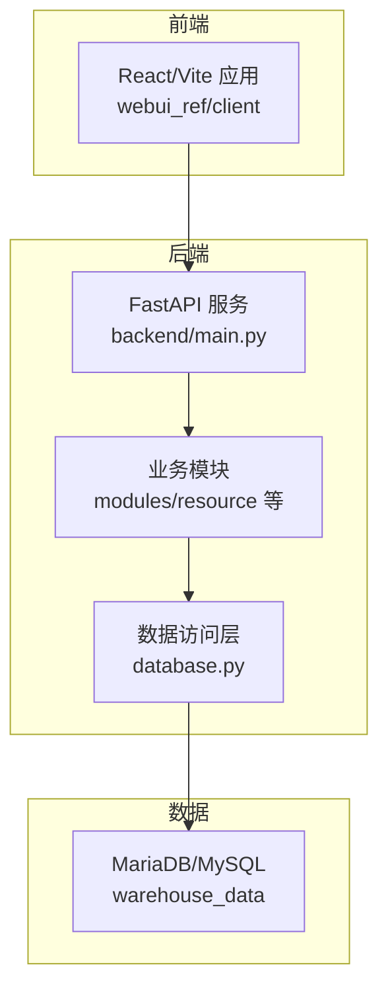
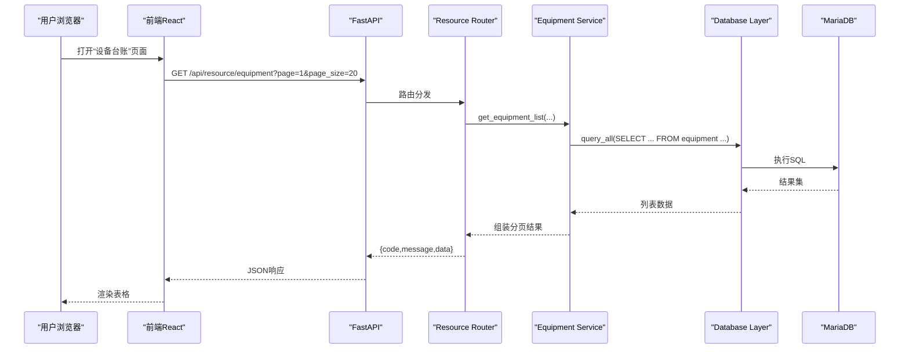
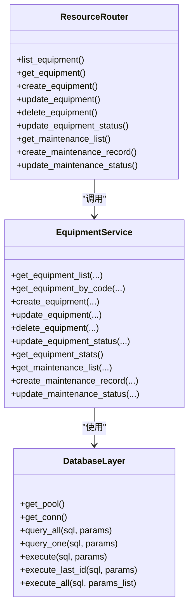
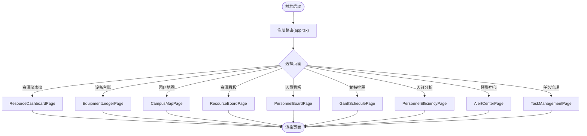
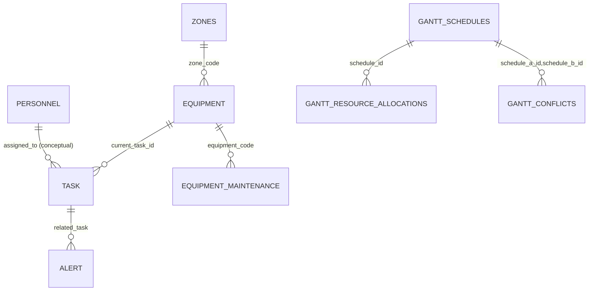
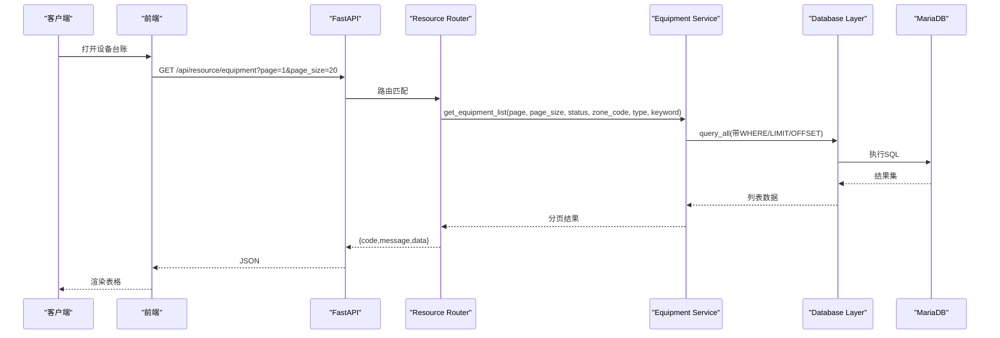
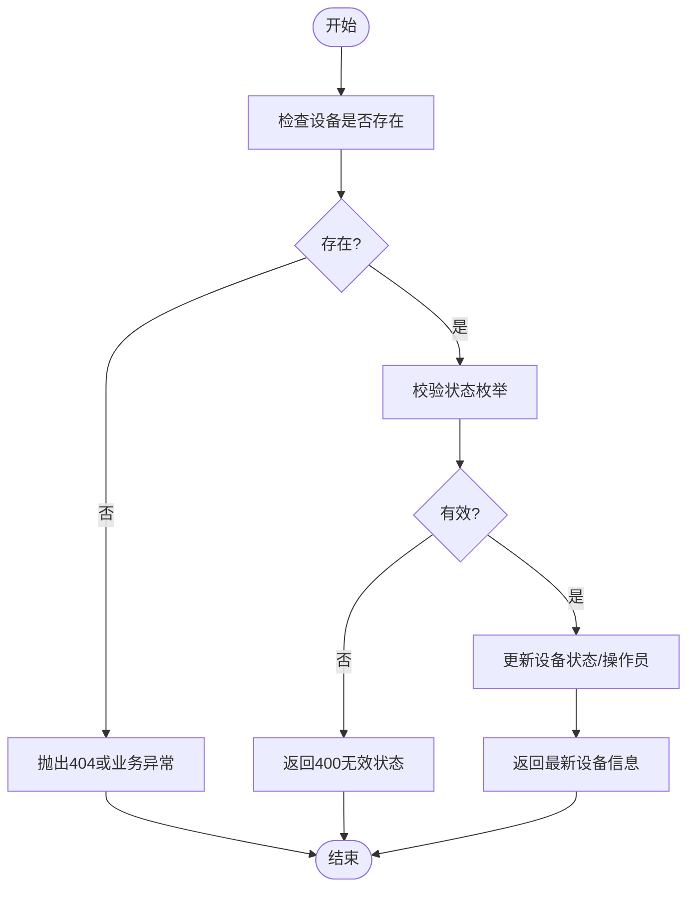
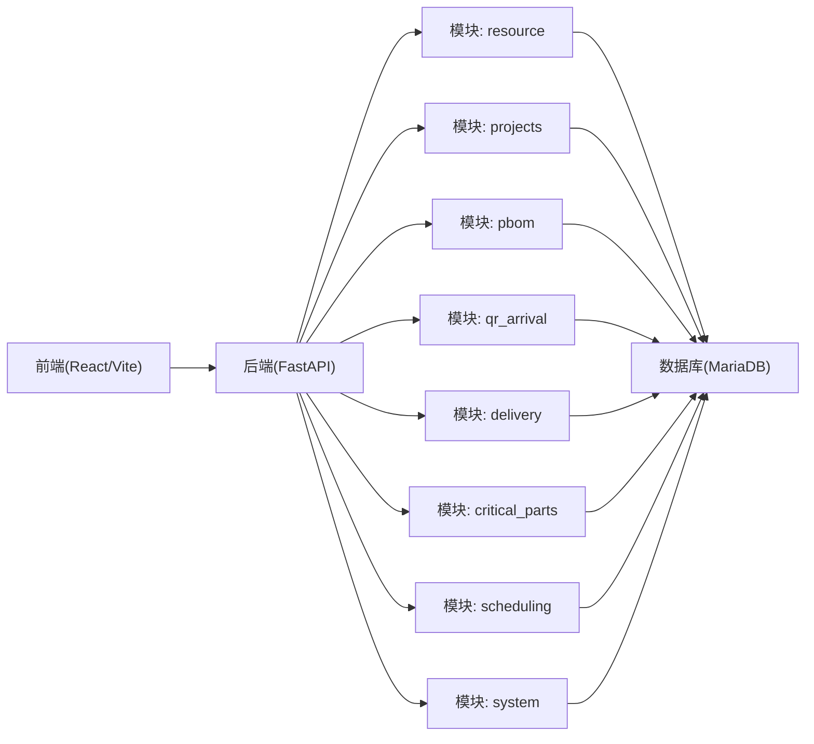

# 整体架构设计

<cite>
**本文引用的文件**   
- [backend/main.py](file://backend/main.py)
- [backend/config.py](file://backend/config.py)
- [backend/database.py](file://backend/database.py)
- [backend/modules/resource/router.py](file://backend/modules/resource/router.py)
- [backend/modules/resource/schemas.py](file://backend/modules/resource/schemas.py)
- [backend/modules/resource/services/equipment_service.py](file://backend/modules/resource/services/equipment_service.py)
- [backend/sql/resource_schema.sql](file://backend/sql/resource_schema.sql)
- [webui_ref/client/src/app.tsx](file://webui_ref/client/src/app.tsx)
- [webui_ref/package.json](file://webui_ref/package.json)
- [backend/requirements.txt](file://backend/requirements.txt)
- [README.md](file://README.md)
</cite>

## 目录
1. [简介](#简介)
2. [项目结构](#项目结构)
3. [核心组件](#核心组件)
4. [架构总览](#架构总览)
5. [详细组件分析](#详细组件分析)
6. [依赖关系分析](#依赖关系分析)
7. [性能与扩展性](#性能与扩展性)
8. [故障排查指南](#故障排查指南)
9. [结论](#结论)
10. [附录：数据模型与接口约定](#附录数据模型与接口约定)

## 简介
本系统为“试制资源数智化管理系统”，采用前后端分离架构：后端基于 Python/FastAPI 提供 RESTful API，前端参考工程使用 React + TypeScript + Vite。系统按分层架构组织代码（表现层、业务逻辑层、数据访问层），并以模块化的方式实现各业务域（设备台账、人员看板、任务管理、排程调度、异常预警等）。数据库采用 MariaDB/MySQL 兼容存储，通过连接池提升并发能力。

## 项目结构
- 后端 backend
  - 入口与路由注册：main.py
  - 配置与日志：config.py、logger.py
  - 数据访问：database.py（PooledDB 连接池）
  - 业务模块：modules/resource（设备/人员/任务/预警/排程）、projects、pbom、qr_arrival、delivery、critical_parts、scheduling、system 等
  - 数据库脚本：sql/*（建表与初始化）
- 前端 webui_ref
  - 客户端 React + TypeScript + Vite，页面路由集中在 app.tsx
  - 包管理与依赖：package.json
- 静态演示 demo（可直接浏览器打开）
- 根级 README 说明运行方式与模块清单

图表来源
- [backend/main.py:29-83](file://backend/main.py#L29-L83)
- [backend/database.py:12-48](file://backend/database.py#L12-L48)
- [webui_ref/client/src/app.tsx:26-51](file://webui_ref/client/src/app.tsx#L26-L51)

章节来源
- [README.md:7-16](file://README.md#L7-L16)
- [backend/main.py:29-83](file://backend/main.py#L29-L83)

## 核心组件
- FastAPI 应用与中间件
  - 启动事件：自动启动调度器；关闭事件：停止调度器
  - CORS 跨域配置
  - 统一路由注册：按功能域划分前缀（/api/projects、/api/resource 等）
  - 全局异常处理：BusinessError 映射到 JSON 响应
  - SPA 回退：非 API 请求返回 index.html
- 配置中心
  - 从 .env 加载数据库、爬虫、第三方接口、服务端口、CORS 等
  - 类型安全的 Settings 类，提供默认值与容错读取
- 数据访问层
  - PooledDB 连接池单例，延迟初始化
  - 封装 query_all/query_one/execute/execute_last_id/execute_all 等方法
  - 失败时输出明确错误提示，便于定位 .env 配置问题
- 业务模块（以 resource 为例）
  - router.py：定义 /api/resource/* 的 HTTP 接口，参数校验、分页、筛选
  - services/*：具体业务逻辑（CRUD、统计、状态流转）
  - schemas.py：Pydantic 数据模型，统一输入输出结构
- 前端路由与页面
  - app.tsx 集中声明页面路由，包含资源模块相关页面
  - 页面占位与后续对接后端 API

章节来源
- [backend/main.py:36-83](file://backend/main.py#L36-L83)
- [backend/config.py:48-98](file://backend/config.py#L48-L98)
- [backend/database.py:12-116](file://backend/database.py#L12-L116)
- [backend/modules/resource/router.py:1-800](file://backend/modules/resource/router.py#L1-L800)
- [backend/modules/resource/schemas.py:1-224](file://backend/modules/resource/schemas.py#L1-L224)
- [webui_ref/client/src/app.tsx:26-51](file://webui_ref/client/src/app.tsx#L26-L51)

## 架构总览
系统采用典型的前后端分离 + 分层架构：
- 表现层（前端）：React + TypeScript + Vite，负责页面渲染、交互与数据展示
- 网关/表现层（后端）：FastAPI 暴露 RESTful API，统一鉴权、限流、CORS、异常处理
- 业务逻辑层：按模块拆分（resource、projects、pbom、qr_arrival、delivery、critical_parts、scheduling、system），每个模块内再分 router/services/schemas
- 数据访问层：统一的 database.py 封装 SQL 执行与连接池管理
- 数据存储：MariaDB/MySQL，通过 SQL 脚本初始化表结构与基础数据

图表来源
- [backend/modules/resource/router.py:58-86](file://backend/modules/resource/router.py#L58-L86)
- [backend/modules/resource/services/equipment_service.py:11-103](file://backend/modules/resource/services/equipment_service.py#L11-L103)
- [backend/database.py:51-85](file://backend/database.py#L51-L85)

章节来源
- [backend/main.py:29-83](file://backend/main.py#L29-L83)
- [backend/modules/resource/router.py:58-86](file://backend/modules/resource/router.py#L58-L86)
- [backend/modules/resource/services/equipment_service.py:11-103](file://backend/modules/resource/services/equipment_service.py#L11-L103)
- [backend/database.py:51-85](file://backend/database.py#L51-L85)

## 详细组件分析

### 后端分层与模块化
- 表现层（Router）
  - 职责：接收HTTP请求、参数校验、调用服务层、统一响应格式
  - 示例：设备列表、详情、创建、更新、删除、状态变更、维护记录、统计
- 业务逻辑层（Service）
  - 职责：实现领域规则、组合查询、事务边界、异常转换
  - 示例：设备CRUD、状态校验、维护记录生命周期、统计数据聚合
- 数据访问层（DAO）
  - 职责：封装SQL执行、连接池管理、批量操作、错误回滚
  - 示例：query_all/query_one/execute/execute_last_id/execute_all

图表来源
- [backend/modules/resource/router.py:1-800](file://backend/modules/resource/router.py#L1-L800)
- [backend/modules/resource/services/equipment_service.py:11-495](file://backend/modules/resource/services/equipment_service.py#L11-L495)
- [backend/database.py:12-116](file://backend/database.py#L12-L116)

章节来源
- [backend/modules/resource/router.py:1-800](file://backend/modules/resource/router.py#L1-L800)
- [backend/modules/resource/services/equipment_service.py:11-495](file://backend/modules/resource/services/equipment_service.py#L11-L495)
- [backend/database.py:12-116](file://backend/database.py#L12-L116)

### 前端路由与页面组织
- 路由集中式管理：app.tsx 中定义所有页面路由，包括资源模块的 dashboard、equipment、zones、utilization、personnel、gantt、efficiency、alerts、tasks
- 页面占位：部分页面当前为占位实现，后续可接入后端 API
- 构建与开发：Vite 构建流程，支持 dev/build 命令

图表来源
- [webui_ref/client/src/app.tsx:26-51](file://webui_ref/client/src/app.tsx#L26-L51)

章节来源
- [webui_ref/client/src/app.tsx:26-51](file://webui_ref/client/src/app.tsx#L26-L51)

### 数据库设计与实体关系
- 核心表：equipment、zones、personnel、tasks、alerts、personnel_efficiency、equipment_maintenance、gantt_schedules、gantt_resource_allocations、gantt_conflicts
- 关键索引：按状态、区域、类型、时间范围等建立索引，优化查询性能
- 外键与冗余：部分字段冗余以提升查询效率（如 task_code、zone_code 在多处出现）

图表来源
- [backend/sql/resource_schema.sql:13-326](file://backend/sql/resource_schema.sql#L13-L326)

章节来源
- [backend/sql/resource_schema.sql:13-326](file://backend/sql/resource_schema.sql#L13-L326)

### 请求处理流程（设备列表）

图表来源
- [backend/modules/resource/router.py:58-86](file://backend/modules/resource/router.py#L58-L86)
- [backend/modules/resource/services/equipment_service.py:11-103](file://backend/modules/resource/services/equipment_service.py#L11-L103)
- [backend/database.py:51-85](file://backend/database.py#L51-L85)

章节来源
- [backend/modules/resource/router.py:58-86](file://backend/modules/resource/router.py#L58-L86)
- [backend/modules/resource/services/equipment_service.py:11-103](file://backend/modules/resource/services/equipment_service.py#L11-L103)
- [backend/database.py:51-85](file://backend/database.py#L51-L85)

### 复杂逻辑流程（设备状态更新）

图表来源
- [backend/modules/resource/services/equipment_service.py:262-301](file://backend/modules/resource/services/equipment_service.py#L262-L301)

章节来源
- [backend/modules/resource/services/equipment_service.py:262-301](file://backend/modules/resource/services/equipment_service.py#L262-L301)

## 依赖关系分析
- 后端技术栈
  - FastAPI + Uvicorn：高性能异步Web框架
  - PyMySQL + DBUtils：MySQL/MariaDB 驱动与连接池
  - python-dotenv：环境变量加载
  - requests/openpyxl/xlrd：外部接口与Excel解析
  - qrcode/Pillow：二维码生成
  - openai：LLM 集成（Phase 2）
- 前端技术栈
  - React + TypeScript + Vite：现代前端工程化
  - Radix UI/Tailwind：UI 组件与样式
  - ECharts/Recharts：可视化图表
  - Axios：HTTP 客户端
  - TanStack Query/Form：数据获取与表单管理
- 模块耦合
  - main.py 作为入口，低耦合地 include_router 各模块
  - 模块内部 router -> service -> database 单向依赖
  - 数据库脚本独立于代码，便于版本化迁移

图表来源
- [backend/main.py:74-83](file://backend/main.py#L74-L83)
- [backend/requirements.txt:1-21](file://backend/requirements.txt#L1-L21)
- [webui_ref/package.json:36-189](file://webui_ref/package.json#L36-L189)

章节来源
- [backend/main.py:74-83](file://backend/main.py#L74-L83)
- [backend/requirements.txt:1-21](file://backend/requirements.txt#L1-L21)
- [webui_ref/package.json:36-189](file://webui_ref/package.json#L36-L189)

## 性能与扩展性
- 性能
  - 数据库连接池：PooledDB 控制最大连接数，避免频繁创建销毁连接
  - 查询优化：合理使用 WHERE/LIMIT/OFFSET，建立必要索引（status、zone_code、type、时间字段）
  - 异步I/O：FastAPI/Uvicorn 支持高并发请求
  - 缓存建议：对热点统计（设备/人员/任务KPI）引入内存缓存或Redis
- 扩展性
  - 模块化：新增模块只需在 main.py 注册路由，遵循 router/service/schema 结构
  - 插件化：对外部系统（WMS、飞书、采购）通过配置项隔离，便于替换与扩展
  - 数据层抽象：统一 database.py 封装，便于切换ORM或增加读写分离
  - 前端扩展：新增页面仅需在 app.tsx 注册路由，复用现有布局与组件库

[本节为通用指导，不直接分析具体文件]

## 故障排查指南
- 数据库连接失败
  - 现象：服务启动后无法查询数据
  - 排查：检查 backend/.env 中的 DB_HOST/DB_PORT/DB_USER/DB_PASSWORD/DB_DATABASE
  - 依据：连接池初始化失败会输出明确错误提示
- 路由未生效
  - 现象：访问 /api/resource/* 返回404
  - 排查：确认 main.py 中已 include_router(resource_router)
- 前端跨域问题
  - 现象：浏览器控制台报 CORS 错误
  - 排查：检查 settings.CORS_ORIGINS 是否包含前端域名
- 状态更新失败
  - 现象：设备状态更新返回400
  - 排查：检查传入状态是否在允许枚举范围内

章节来源
- [backend/database.py:12-43](file://backend/database.py#L12-L43)
- [backend/main.py:66-83](file://backend/main.py#L66-L83)
- [backend/modules/resource/services/equipment_service.py:262-301](file://backend/modules/resource/services/equipment_service.py#L262-L301)

## 结论
本系统通过前后端分离与分层架构，实现了清晰的职责划分与良好的可维护性。后端以 FastAPI 为核心，模块化组织业务；前端以 React + TypeScript 构建现代化界面；数据层通过连接池与索引优化保障性能。未来可通过引入缓存、消息队列、微服务拆分等方式进一步提升扩展性与弹性。

[本节为总结，不直接分析具体文件]

## 附录：数据模型与接口约定
- 数据模型
  - 设备：编号、名称、类型、区域、状态、当前任务、当前操作员、更新时间
  - 区域：编码、名称、类型、坐标、网格尺寸
  - 人员：工号、姓名、头像文字、部门、状态、所在区域、当前任务、上下班时间
  - 任务：编号、名称、类型、优先级、状态、区域/场地、计划与实际工时、进度、来源
  - 预警：编号、类型、级别、标题、描述、关联对象、SLA、处理状态
  - 排程：编号、任务关联、阶段、时间、资源分配、冲突检测
- 接口约定
  - 统一响应格式：{ code, message, data }
  - 时间格式：ISO 8601（YYYY-MM-DDTHH:mm:ss）
  - 分页参数：page、page_size
  - 筛选参数：按业务字段过滤（status、zone_code、task_type 等）

章节来源
- [backend/modules/resource/schemas.py:1-224](file://backend/modules/resource/schemas.py#L1-L224)
- [backend/modules/resource/router.py:1-800](file://backend/modules/resource/router.py#L1-L800)
- [README.md:132-144](file://README.md#L132-L144)