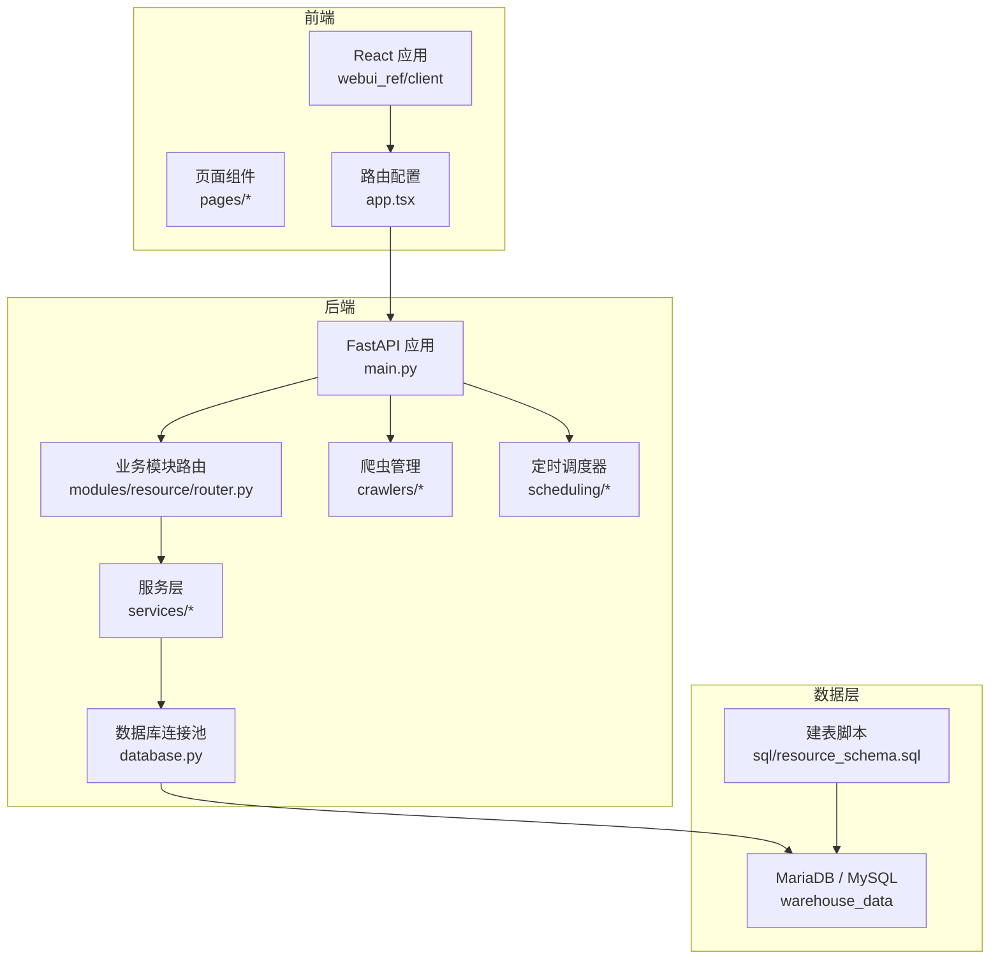
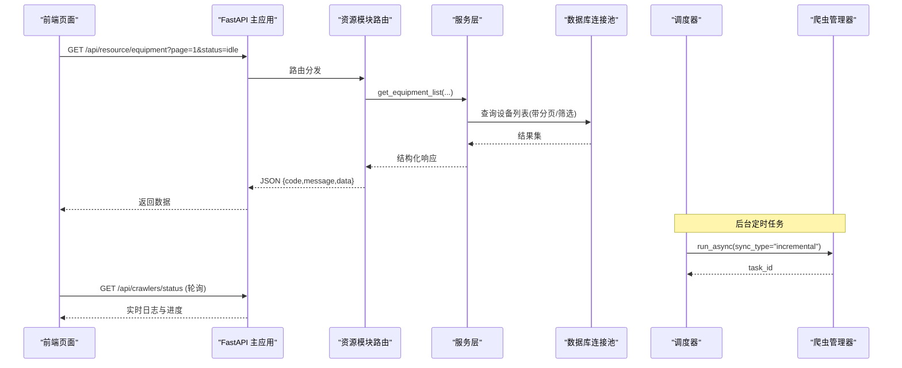
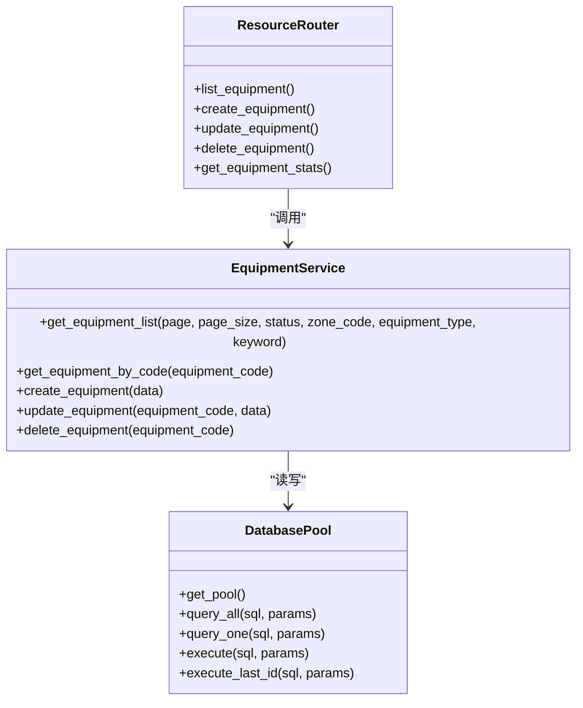
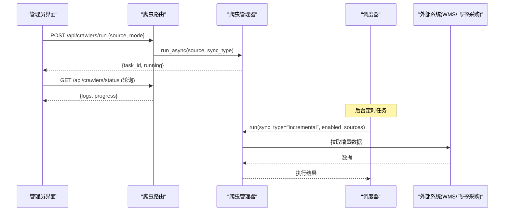
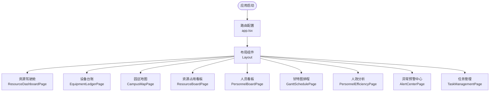
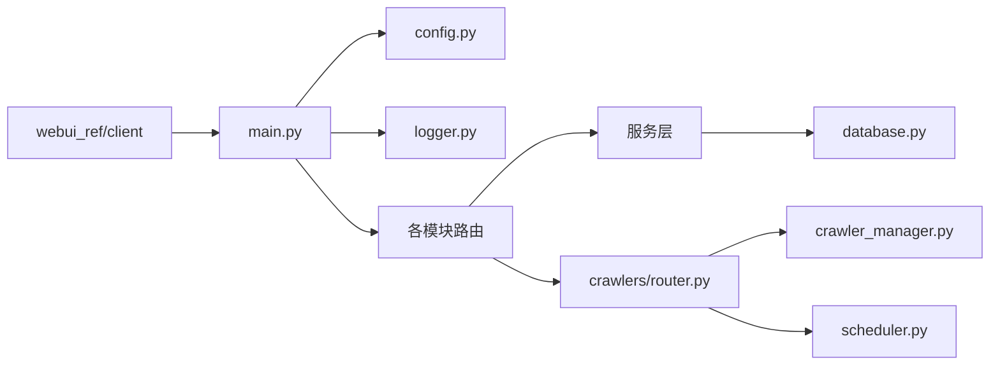

# 系统架构

<cite>
**本文引用的文件**
- [backend/main.py](file://backend/main.py)
- [backend/config.py](file://backend/config.py)
- [backend/database.py](file://backend/database.py)
- [backend/modules/resource/router.py](file://backend/modules/resource/router.py)
- [backend/modules/resource/schemas.py](file://backend/modules/resource/schemas.py)
- [backend/modules/resource/services/equipment_service.py](file://backend/modules/resource/services/equipment_service.py)
- [backend/crawlers/router.py](file://backend/crawlers/router.py)
- [backend/crawlers/crawler_manager.py](file://backend/crawlers/crawler_manager.py)
- [backend/scheduling/router.py](file://backend/scheduling/router.py)
- [backend/scheduling/scheduler.py](file://backend/scheduling/scheduler.py)
- [backend/sql/resource_schema.sql](file://backend/sql/resource_schema.sql)
- [webui_ref/client/src/app.tsx](file://webui_ref/client/src/app.tsx)
- [webui_ref/client/src/pages/ResourceDashboardPage/ResourceDashboardPage.tsx](file://webui_ref/client/src/pages/ResourceDashboardPage/ResourceDashboardPage.tsx)
- [README.md](file://README.md)
</cite>

## 目录
1. [简介](#简介)
2. [项目结构](#项目结构)
3. [核心组件](#核心组件)
4. [架构总览](#架构总览)
5. [详细组件分析](#详细组件分析)
6. [依赖关系分析](#依赖关系分析)
7. [性能考量](#性能考量)
8. [故障排查指南](#故障排查指南)
9. [结论](#结论)
10. [附录](#附录)

## 简介
本系统为“试制资源数智化管理系统”，基于 FastAPI 后端与 React 前端（参考工程）构建，采用前后端分离与分层架构。后端提供 RESTful API，涵盖项目管理、PBOM 解析、多源数据爬虫、QR 到件、关键件评分、排程调度以及试制资源管理（设备、人员、任务、预警等）。数据库使用 MariaDB/MySQL，通过连接池进行高效访问。系统支持定时调度器自动执行增量同步，并提供统一的前端路由与页面组织。

## 项目结构
- 后端：FastAPI 应用入口、配置、数据库连接、模块路由与服务层、爬虫与调度器、SQL 脚本
- 前端：React + TypeScript + Vite 参考工程，包含路由与多个业务页面
- 演示页：静态 HTML/CSS/JS + ECharts 原型页面
- 数据库：MariaDB 建表与初始化脚本

图表来源
- [backend/main.py:11-83](file://backend/main.py#L11-L83)
- [backend/modules/resource/router.py:1-14](file://backend/modules/resource/router.py#L1-L14)
- [backend/database.py:12-48](file://backend/database.py#L12-L48)
- [backend/crawlers/router.py:1-13](file://backend/crawlers/router.py#L1-L13)
- [backend/scheduling/scheduler.py:16-74](file://backend/scheduling/scheduler.py#L16-L74)
- [backend/sql/resource_schema.sql:11-326](file://backend/sql/resource_schema.sql#L11-L326)
- [webui_ref/client/src/app.tsx:26-55](file://webui_ref/client/src/app.tsx#L26-L55)

章节来源
- [README.md:7-70](file://README.md#L7-L70)
- [backend/main.py:11-83](file://backend/main.py#L11-L83)

## 核心组件
- 应用入口与中间件：FastAPI 实例、CORS、健康检查、SPA 回退、启动/关闭事件
- 配置中心：环境变量加载、数据库与外部接口配置、服务端口与跨域设置
- 数据访问层：PooledDB 连接池、查询与写操作封装、事务性提交与回滚
- 业务模块：试制资源（设备、区域、人员、任务、预警）、项目管理、PBOM、QR 到件、关键件评分、排程
- 爬虫与调度：多源数据抓取（WMS、飞书、采购），异步/同步执行，定时增量同步
- 前端路由与页面：React Router 路由组织，各业务页面占位或实现

章节来源
- [backend/main.py:29-83](file://backend/main.py#L29-L83)
- [backend/config.py:48-102](file://backend/config.py#L48-L102)
- [backend/database.py:12-116](file://backend/database.py#L12-L116)
- [backend/modules/resource/router.py:16-800](file://backend/modules/resource/router.py#L16-L800)
- [backend/crawlers/router.py:43-225](file://backend/crawlers/router.py#L43-L225)
- [backend/scheduling/scheduler.py:16-196](file://backend/scheduling/scheduler.py#L16-L196)
- [webui_ref/client/src/app.tsx:26-55](file://webui_ref/client/src/app.tsx#L26-L55)

## 架构总览
系统采用前后端分离的分层架构：
- 表现层：React 前端通过路由组织页面，调用后端 REST API
- 网关层：FastAPI 统一入口，注册各模块路由，处理 CORS、异常、健康检查
- 业务层：按模块划分路由与服务层，职责清晰，便于扩展
- 数据层：数据库连接池与 SQL 封装，保证并发与一致性
- 集成层：爬虫管理器与调度器负责外部系统集成与定时任务

图表来源
- [backend/main.py:74-83](file://backend/main.py#L74-L83)
- [backend/modules/resource/router.py:58-86](file://backend/modules/resource/router.py#L58-L86)
- [backend/modules/resource/services/equipment_service.py:11-103](file://backend/modules/resource/services/equipment_service.py#L11-L103)
- [backend/database.py:51-85](file://backend/database.py#L51-L85)
- [backend/crawlers/router.py:89-147](file://backend/crawlers/router.py#L89-L147)
- [backend/scheduling/scheduler.py:93-196](file://backend/scheduling/scheduler.py#L93-L196)

## 详细组件分析

### 后端分层与模块化设计
- 路由层：每个模块一个 router，定义 RESTful 接口，参数校验使用 Pydantic，统一响应格式
- 服务层：封装业务逻辑，组合查询条件、事务控制、数据转换
- 数据访问层：提供连接池、查询与写操作封装，避免重复代码

图表来源
- [backend/modules/resource/router.py:16-303](file://backend/modules/resource/router.py#L16-L303)
- [backend/modules/resource/services/equipment_service.py:11-200](file://backend/modules/resource/services/equipment_service.py#L11-L200)
- [backend/database.py:12-116](file://backend/database.py#L12-L116)

章节来源
- [backend/modules/resource/router.py:16-800](file://backend/modules/resource/router.py#L16-L800)
- [backend/modules/resource/services/equipment_service.py:11-200](file://backend/modules/resource/services/equipment_service.py#L11-L200)
- [backend/database.py:12-116](file://backend/database.py#L12-L116)

### 数据库设计与 ORM 使用
- 无 ORM：直接使用 SQL 语句，通过 PooledDB 连接池管理连接
- 表结构：设备、区域、人员、任务、预警、效率统计、维护记录、甘特排程与资源分配、冲突检测
- 索引与约束：关键字段建立索引，提升查询性能；唯一键保障数据一致性

```mermaid
erDiagram
EQUIPMENT {
int id PK
varchar equipment_code UK
varchar equipment_name
enum equipment_type
varchar zone_code FK
enum status
int current_task_id
varchar current_operator
datetime last_update_time
datetime created_at
datetime updated_at
}
ZONES {
int id PK
varchar zone_code UK
varchar zone_name
enum zone_type
int position_x
int position_y
int grid_columns
int grid_rows
datetime created_at
datetime updated_at
}
PERSONNEL {
int id PK
varchar personnel_code UK
varchar name
varchar avatar_text
varchar department
enum status
varchar current_zone
int current_task_id
datetime entry_time
datetime last_update_time
datetime created_at
datetime updated_at
}
TASKS {
int id PK
varchar task_code UK
varchar task_name
enum task_type
varchar trial_type
varchar project_group
varchar project_code
varchar vehicle_code
varchar vehicle_model
enum priority
enum status
varchar zone_code
varchar assembly_site
int lift_count
varchar equipment_code
varchar planner
varchar pm_name
varchar cve_name
varchar trial_supervisor
varchar process_supervisor
varchar assembly_supervisor
datetime plan_start_time
datetime plan_end_time
decimal plan_work_hours
decimal actual_work_hours
decimal progress
tinyint progress_manual_override
int summer_target_count
date summer_target_date
enum source
datetime created_at
datetime updated_at
}
ALERTS {
int id PK
varchar alert_code UK
enum alert_type
enum level
varchar title
text description
enum source
enum related_type
varchar related_id
varchar related_name
varchar related_equipment
int related_task
varchar related_personnel
varchar zone_code
varchar assembly_site
varchar raised_by
datetime raised_at
int sla_hours
tinyint escalated
varchar escalated_to
enum status
varchar handler
varchar handler_department
datetime processing_started_at
datetime resolved_at
datetime closed_at
text processing_scheme
text corrective_action
text preventive_measure
text result_verification
decimal loss_amount
decimal impact_hours
int attachment_count
text remark
datetime created_at
datetime updated_at
}
EQUIPMENT ||--o{ TASKS : "current_task_id"
ZONES ||--o{ EQUIPMENT : "zone_code"
ZONES ||--o{ PERSONNEL : "current_zone"
TASKS ||--o{ ALERTS : "related_task"
```

图表来源
- [backend/sql/resource_schema.sql:11-326](file://backend/sql/resource_schema.sql#L11-L326)

章节来源
- [backend/sql/resource_schema.sql:11-326](file://backend/sql/resource_schema.sql#L11-L326)

### 爬虫系统与调度器
- 爬虫管理器：统一管理 WMS、飞书、采购等爬虫实例，支持同步阻塞与异步线程执行，提供状态查询与停止控制
- 调度器：独立后台线程，按配置间隔自动执行增量同步，支持暂停/恢复、配置重载、运行状态查询
- 路由层：暴露配置读取/保存、任务执行摘要、启动/停止调度器、手动触发爬虫等接口

图表来源
- [backend/crawlers/router.py:89-225](file://backend/crawlers/router.py#L89-L225)
- [backend/crawlers/crawler_manager.py:22-200](file://backend/crawlers/crawler_manager.py#L22-L200)
- [backend/scheduling/scheduler.py:93-196](file://backend/scheduling/scheduler.py#L93-L196)

章节来源
- [backend/crawlers/router.py:43-225](file://backend/crawlers/router.py#L43-L225)
- [backend/crawlers/crawler_manager.py:22-200](file://backend/crawlers/crawler_manager.py#L22-L200)
- [backend/scheduling/scheduler.py:16-196](file://backend/scheduling/scheduler.py#L16-L196)

### 前端组件化架构与状态管理
- 路由组织：React Router 集中管理页面路由，布局组件包裹各页面
- 页面组件：按业务模块划分 pages/*，当前部分页面为占位实现
- 状态管理：参考工程中未显式引入全局状态库，页面内可使用 hooks 或上下文管理本地状态

图表来源
- [webui_ref/client/src/app.tsx:26-55](file://webui_ref/client/src/app.tsx#L26-L55)
- [webui_ref/client/src/pages/ResourceDashboardPage/ResourceDashboardPage.tsx:1-16](file://webui_ref/client/src/pages/ResourceDashboardPage/ResourceDashboardPage.tsx#L1-L16)

章节来源
- [webui_ref/client/src/app.tsx:26-55](file://webui_ref/client/src/app.tsx#L26-L55)

## 依赖关系分析
- 应用入口依赖配置、日志、异常处理与各模块路由
- 资源模块路由依赖服务层，服务层依赖数据库连接池
- 爬虫路由依赖爬虫管理器与调度器
- 调度器依赖爬虫管理器与配置存储（数据库）
- 前端依赖后端 API，通过路由转发请求

图表来源
- [backend/main.py:11-83](file://backend/main.py#L11-L83)
- [backend/modules/resource/router.py:1-14](file://backend/modules/resource/router.py#L1-L14)
- [backend/crawlers/router.py:1-13](file://backend/crawlers/router.py#L1-L13)
- [backend/scheduling/scheduler.py:16-74](file://backend/scheduling/scheduler.py#L16-L74)

章节来源
- [backend/main.py:11-83](file://backend/main.py#L11-L83)
- [backend/crawlers/router.py:1-13](file://backend/crawlers/router.py#L1-L13)
- [backend/scheduling/scheduler.py:16-74](file://backend/scheduling/scheduler.py#L16-L74)

## 性能考量
- 数据库连接池：PooledDB 限制最大连接数，避免资源耗尽；延迟初始化降低启动失败风险
- 查询优化：服务层动态拼接 WHERE 条件，合理使用 LIMIT/OFFSET 分页；关键字段建立索引
- 异步任务：爬虫异步执行，前端轮询获取日志，避免阻塞请求
- 调度器：后台线程独立运行，支持暂停/恢复，避免与手动任务冲突
- 缓存与重试：可在服务层增加缓存策略与重试机制以提升稳定性

[本节提供通用指导，不直接分析具体文件]

## 故障排查指南
- 数据库连接失败：检查 .env 中 DB_HOST、DB_PORT、DB_USER、DB_PASSWORD、DB_DATABASE；查看连接池初始化错误日志
- 爬虫执行异常：通过 /api/crawlers/status 轮询任务日志；确认外部系统可达性与认证信息
- 调度器未执行：检查模式是否为 auto；确认启用数据源列表；查看调度器状态与最后执行时间
- 前端路由问题：确认 app.tsx 中路由路径与页面组件导入正确

章节来源
- [backend/database.py:12-48](file://backend/database.py#L12-L48)
- [backend/crawlers/router.py:61-86](file://backend/crawlers/router.py#L61-L86)
- [backend/scheduling/scheduler.py:67-74](file://backend/scheduling/scheduler.py#L67-L74)
- [webui_ref/client/src/app.tsx:26-55](file://webui_ref/client/src/app.tsx#L26-L55)

## 结论
本系统以 FastAPI 为核心，结合 React 前端与 MariaDB 数据库，形成前后端分离、分层清晰的架构。资源模块通过路由与服务层解耦，数据库访问统一封装，爬虫与调度器提供外部系统集成能力。整体设计具备良好的可扩展性与可维护性，适合持续迭代与功能扩展。

[本节总结内容，不直接分析具体文件]

## 附录
- 环境要求与运行步骤参见 README
- API 文档可通过 Swagger UI 访问
- 演示页可直接浏览器打开预览

章节来源
- [README.md:72-134](file://README.md#L72-L134)