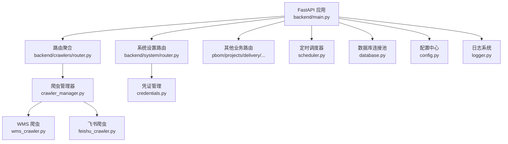
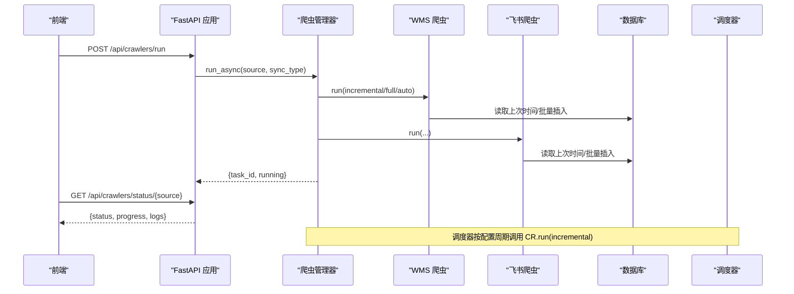
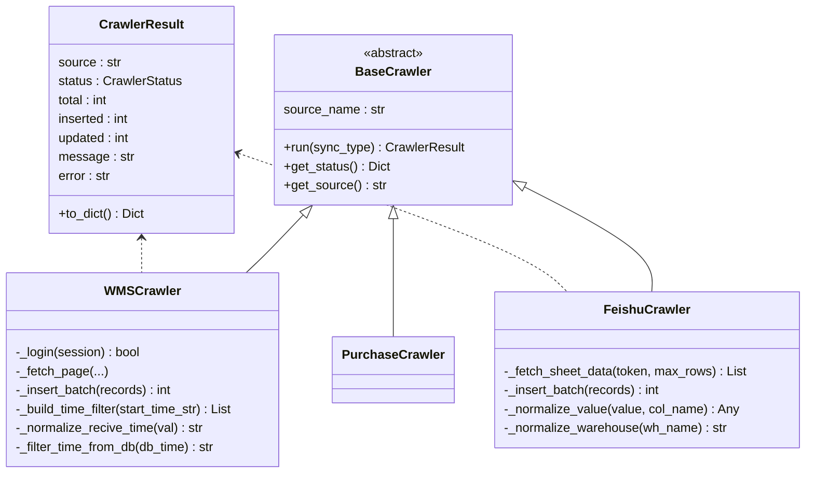
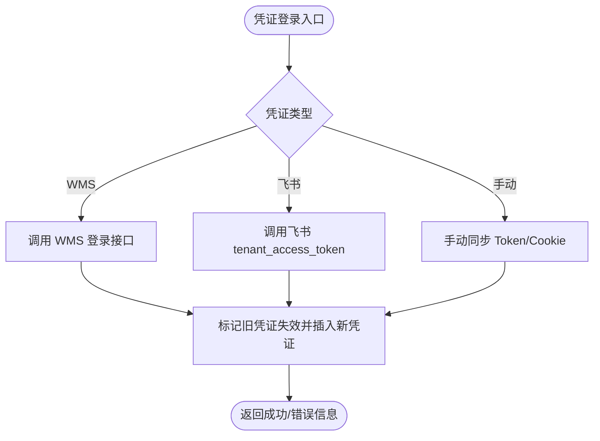
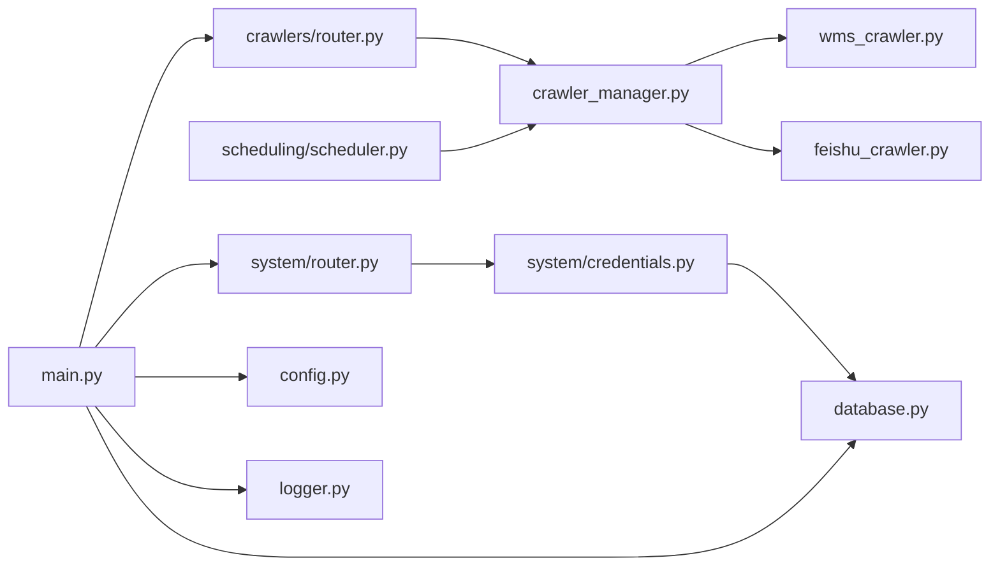

# 集成架构

<cite>
**本文引用的文件**
- [backend/main.py](file://backend/main.py)
- [backend/config.py](file://backend/config.py)
- [backend/database.py](file://backend/database.py)
- [backend/logger.py](file://backend/logger.py)
- [backend/core/exceptions.py](file://backend/core/exceptions.py)
- [backend/system/router.py](file://backend/system/router.py)
- [backend/system/credentials.py](file://backend/system/credentials.py)
- [backend/crawlers/base.py](file://backend/crawlers/base.py)
- [backend/crawlers/crawler_manager.py](file://backend/crawlers/crawler_manager.py)
- [backend/crawlers/wms_crawler.py](file://backend/crawlers/wms_crawler.py)
- [backend/crawlers/feishu_crawler.py](file://backend/crawlers/feishu_crawler.py)
- [backend/crawlers/router.py](file://backend/crawlers/router.py)
- [backend/scheduling/scheduler.py](file://backend/scheduling/scheduler.py)
</cite>

## 目录
1. [简介](#简介)
2. [项目结构](#项目结构)
3. [核心组件](#核心组件)
4. [架构总览](#架构总览)
5. [详细组件分析](#详细组件分析)
6. [依赖关系分析](#依赖关系分析)
7. [性能与可扩展性](#性能与可扩展性)
8. [故障隔离与容错](#故障隔离与容错)
9. [监控告警与运维工具链](#监控告警与运维工具链)
10. [结论](#结论)

## 简介
本系统集成架构围绕“多源数据接入—统一适配器—异步调度—持久化存储—前端展示”的主线展开，重点解决以下问题：
- 外部系统对接：WMS（di360）与飞书共享表等异构数据源的接入。
- 第三方服务集成：通过凭证管理与自动登录获取 Token/Cookie，实现安全、可维护的鉴权。
- 硬件设备接入：当前以软件接口为主，预留扩展点便于后续接入 IoT/设备网关。
- 适配器模式：通过统一的爬虫抽象基类屏蔽不同数据源差异。
- 认证授权机制：支持 Token/Cookie/JWT 等多种凭证类型；未来可扩展 OAuth2.0、API Key、会话管理。
- 消息队列与事件驱动：当前采用线程内异步任务与定时调度；可平滑迁移至消息队列以实现解耦与水平扩展。
- 配置管理：环境变量 + 数据库参数表，支持运行时动态更新。
- 集成测试策略与故障隔离：基于单测/冒烟测试、超时重试、幂等写入、任务级停止标志。
- 监控告警与运维工具链：结构化日志、健康检查、运行状态查询、调度器启停控制。

## 项目结构
后端采用 FastAPI 模块化路由组织，按业务域划分模块（crawlers、system、scheduling、delivery、pbom、projects、qr_arrival、critical_parts、modules/resource），并通过主应用入口集中注册路由、中间件与生命周期钩子。

图表来源
- [backend/main.py:11-83](file://backend/main.py#L11-L83)
- [backend/crawlers/router.py:1-225](file://backend/crawlers/router.py#L1-L225)
- [backend/system/router.py:1-109](file://backend/system/router.py#L1-L109)
- [backend/crawlers/crawler_manager.py:22-98](file://backend/crawlers/crawler_manager.py#L22-L98)
- [backend/crawlers/wms_crawler.py:44-477](file://backend/crawlers/wms_crawler.py#L44-L477)
- [backend/crawlers/feishu_crawler.py:55-419](file://backend/crawlers/feishu_crawler.py#L55-L419)
- [backend/system/credentials.py:1-573](file://backend/system/credentials.py#L1-L573)
- [backend/scheduling/scheduler.py:16-196](file://backend/scheduling/scheduler.py#L16-L196)
- [backend/database.py:1-116](file://backend/database.py#L1-L116)
- [backend/config.py:48-102](file://backend/config.py#L48-L102)
- [backend/logger.py:1-43](file://backend/logger.py#L1-L43)

章节来源
- [backend/main.py:11-83](file://backend/main.py#L11-L83)
- [backend/config.py:48-102](file://backend/config.py#L48-L102)

## 核心组件
- 应用入口与路由聚合：负责启动生命周期、CORS、静态资源托管、全局异常处理与各模块路由注册。
- 配置中心：从 .env 与环境变量加载配置，提供类型安全的 Settings 对象。
- 数据库层：基于 PyMySQL + PooledDB 的连接池封装，提供查询与批量写操作。
- 凭证与认证：统一管理 WMS/飞书等数据源的登录、Token/Cookie 获取与刷新，支持手动同步。
- 爬虫适配器：BaseCrawler 抽象 + 具体实现（WMS、飞书、采购），统一 run/get_status 接口。
- 爬虫管理器：统一调度多个爬虫实例，支持同步/异步执行、任务追踪、停止控制。
- 定时调度器：后台线程按配置间隔自动执行增量同步，避免与手动任务冲突。
- 日志与健康检查：结构化日志输出、滚动文件、控制台输出；/api/health 健康探针。

章节来源
- [backend/main.py:29-120](file://backend/main.py#L29-L120)
- [backend/config.py:48-102](file://backend/config.py#L48-L102)
- [backend/database.py:12-116](file://backend/database.py#L12-L116)
- [backend/system/credentials.py:25-149](file://backend/system/credentials.py#L25-L149)
- [backend/crawlers/base.py:12-67](file://backend/crawlers/base.py#L12-L67)
- [backend/crawlers/crawler_manager.py:22-305](file://backend/crawlers/crawler_manager.py#L22-L305)
- [backend/scheduling/scheduler.py:16-196](file://backend/scheduling/scheduler.py#L16-L196)
- [backend/logger.py:14-43](file://backend/logger.py#L14-L43)

## 架构总览
系统采用“HTTP API + 适配器 + 调度器 + 数据库”的分层架构。外部系统通过适配器（爬虫）拉取数据，经去重/合并后落库；调度器按配置周期触发增量同步；前端通过 REST API 获取状态与结果。

图表来源
- [backend/crawlers/router.py:89-147](file://backend/crawlers/router.py#L89-L147)
- [backend/crawlers/crawler_manager.py:134-197](file://backend/crawlers/crawler_manager.py#L134-L197)
- [backend/crawlers/wms_crawler.py:313-467](file://backend/crawlers/wms_crawler.py#L313-L467)
- [backend/crawlers/feishu_crawler.py:251-399](file://backend/crawlers/feishu_crawler.py#L251-L399)
- [backend/scheduling/scheduler.py:155-192](file://backend/scheduling/scheduler.py#L155-L192)

## 详细组件分析

### 适配器模式与数据源接入
- 抽象基类 BaseCrawler 定义统一接口 run(sync_type) -> CrawlerResult 与 get_status()，所有数据源只需继承并实现差异化逻辑。
- WMSCrawler 对接 di360 WMS，使用 Session 复用、指数退避重试、服务端过滤条件构建、UTC/北京时间转换、批量 INSERT IGNORE 去重。
- FeishuCrawler 对接飞书表格，分页拉取、单元格值规范化、仓库名称归一化、增量过滤与批量入库。
- PurchaseCrawler 作为扩展点，便于后续接入采购系统。

图表来源
- [backend/crawlers/base.py:12-67](file://backend/crawlers/base.py#L12-L67)
- [backend/crawlers/wms_crawler.py:44-477](file://backend/crawlers/wms_crawler.py#L44-L477)
- [backend/crawlers/feishu_crawler.py:55-419](file://backend/crawlers/feishu_crawler.py#L55-L419)

章节来源
- [backend/crawlers/base.py:12-67](file://backend/crawlers/base.py#L12-L67)
- [backend/crawlers/wms_crawler.py:44-477](file://backend/crawlers/wms_crawler.py#L44-L477)
- [backend/crawlers/feishu_crawler.py:55-419](file://backend/crawlers/feishu_crawler.py#L55-L419)

### 认证授权机制
- 凭证管理：支持 WMS（JWT/Token/Cookie）、飞书（tenant_access_token）、采购系统等；提供自动登录、手动同步、列表查看、删除等操作。
- 自动登录：spider_login 调用 WMS 登录接口，提取 token/cookie 并保存为活跃凭证；失败时降级保存用户名密码供后续重试。
- 飞书 Token：feishu_login 获取 tenant_access_token 并缓存过期时间；get_feishu_token 自动刷新过期 Token。
- 扩展建议：
  - OAuth2.0：在 credentials.py 中新增 OAuth2 流程（授权码/客户端凭据），统一返回 Token。
  - API Key：在请求头校验 API Key，结合 IP 白名单与速率限制。
  - 会话管理：引入 Redis 会话存储，支持跨进程/多实例共享。

图表来源
- [backend/system/credentials.py:25-149](file://backend/system/credentials.py#L25-L149)
- [backend/system/credentials.py:448-573](file://backend/system/credentials.py#L448-L573)

章节来源
- [backend/system/router.py:52-109](file://backend/system/router.py#L52-L109)
- [backend/system/credentials.py:25-149](file://backend/system/credentials.py#L25-L149)
- [backend/system/credentials.py:448-573](file://backend/system/credentials.py#L448-L573)

### 消息队列与事件驱动
- 现状：采用线程内异步任务（run_async）与后台调度器（SchedulerService）实现解耦与异步执行；任务状态保存在内存字典中，可通过 task_id 查询。
- 演进建议：
  - 引入消息队列（如 RabbitMQ/Kafka）将“触发同步”“任务完成”“失败重试”“告警”等事件化，提升可扩展性与可靠性。
  - 将爬虫执行封装为消费者，支持水平扩展与失败重试。
  - 增加事件总线用于模块间通信（如 PBOM 解析完成、到货融合完成）。

章节来源
- [backend/crawlers/crawler_manager.py:134-197](file://backend/crawlers/crawler_manager.py#L134-L197)
- [backend/scheduling/scheduler.py:93-153](file://backend/scheduling/scheduler.py#L93-L153)

### 配置管理机制
- 环境变量与 .env：Settings 类集中管理数据库、爬虫、WMS、飞书、DeepSeek、服务端口、CORS、上传目录等配置。
- 运行时配置：爬虫同步模式、间隔、启用数据源、自动登录开关等存储在 system_params 表中，支持动态更新并通知调度器重载。
- 建议：
  - 敏感配置（密钥）优先使用环境变量或密钥管理服务。
  - 配置变更审计：记录 key/value/updated_at 与操作人。
  - 灰度发布：按环境/租户维度切换配置。

章节来源
- [backend/config.py:48-102](file://backend/config.py#L48-L102)
- [backend/system/credentials.py:297-441](file://backend/system/credentials.py#L297-L441)
- [backend/crawlers/router.py:43-58](file://backend/crawlers/router.py#L43-L58)

## 依赖关系分析
- 模块耦合：
  - main.py 聚合各模块路由，低耦合高内聚。
  - crawler_manager 依赖具体爬虫实现，但通过 BaseCrawler 抽象降低耦合。
  - scheduler 与 crawler_manager 松耦合，通过方法调用协作。
  - credentials 与 database 强耦合，需保证数据库可用性。
- 外部依赖：
  - requests 用于 HTTP 调用（WMS、飞书）。
  - pymysql + dbutils 用于数据库连接池。
  - fastapi + uvicorn 提供 Web 服务。

图表来源
- [backend/main.py:11-83](file://backend/main.py#L11-L83)
- [backend/crawlers/router.py:1-225](file://backend/crawlers/router.py#L1-L225)
- [backend/system/router.py:1-109](file://backend/system/router.py#L1-L109)
- [backend/crawlers/crawler_manager.py:22-98](file://backend/crawlers/crawler_manager.py#L22-L98)
- [backend/system/credentials.py:1-573](file://backend/system/credentials.py#L1-L573)
- [backend/database.py:1-116](file://backend/database.py#L1-L116)
- [backend/scheduling/scheduler.py:16-196](file://backend/scheduling/scheduler.py#L16-L196)
- [backend/config.py:48-102](file://backend/config.py#L48-L102)
- [backend/logger.py:1-43](file://backend/logger.py#L1-L43)

章节来源
- [backend/main.py:11-83](file://backend/main.py#L11-L83)
- [backend/crawlers/crawler_manager.py:22-98](file://backend/crawlers/crawler_manager.py#L22-L98)
- [backend/system/credentials.py:1-573](file://backend/system/credentials.py#L1-L573)

## 性能与可扩展性
- 数据库层：连接池（PooledDB）+ 批量写入（executemany）+ INSERT IGNORE 去重，减少网络往返与重复数据。
- 网络层：requests.Session 复用连接；指数退避重试；超时与连接错误处理。
- 爬虫层：分页拉取、增量同步、进度与日志缓冲限制（500 行），避免内存膨胀。
- 调度层：后台线程轮询配置，避免阻塞请求；暂停/恢复机制防止与手动任务冲突。
- 可扩展性：新增数据源仅需实现 BaseCrawler 并在管理器中注册；支持 enabled_sources 控制执行范围。

章节来源
- [backend/database.py:12-116](file://backend/database.py#L12-L116)
- [backend/crawlers/wms_crawler.py:180-213](file://backend/crawlers/wms_crawler.py#L180-L213)
- [backend/crawlers/wms_crawler.py:273-310](file://backend/crawlers/wms_crawler.py#L273-L310)
- [backend/crawlers/feishu_crawler.py:132-203](file://backend/crawlers/feishu_crawler.py#L132-L203)
- [backend/crawlers/crawler_manager.py:200-301](file://backend/crawlers/crawler_manager.py#L200-L301)
- [backend/scheduling/scheduler.py:93-153](file://backend/scheduling/scheduler.py#L93-L153)

## 故障隔离与容错
- 任务级停止：crawler_manager.request_stop() 与每个爬虫的 _stop_requested 标志，确保优雅退出。
- 异常处理：BusinessError 统一业务异常；爬虫内部捕获异常并返回 FAILED 状态，不影响其他数据源。
- 幂等写入：INSERT IGNORE 避免重复入库；全量模式先 TRUNCATE 再导入，保证一致性。
- 超时与重试：网络请求指数退避重试，避免瞬时抖动导致失败。
- 配置回退：未找到 .env 时输出警告并使用默认值；数据库连接失败抛出明确提示。

章节来源
- [backend/core/exceptions.py:1-8](file://backend/core/exceptions.py#L1-L8)
- [backend/crawlers/crawler_manager.py:39-88](file://backend/crawlers/crawler_manager.py#L39-L88)
- [backend/crawlers/wms_crawler.py:313-467](file://backend/crawlers/wms_crawler.py#L313-L467)
- [backend/crawlers/feishu_crawler.py:251-399](file://backend/crawlers/feishu_crawler.py#L251-L399)
- [backend/config.py:15-22](file://backend/config.py#L15-L22)
- [backend/database.py:18-43](file://backend/database.py#L18-L43)

## 监控告警与运维工具链
- 健康检查：/api/health 提供快速存活探测。
- 运行状态：/api/crawlers/status 与 /api/crawlers/status/{source} 返回爬虫状态、进度与日志快照。
- 调度器控制：/api/crawlers/start_scheduler、/api/crawlers/stop_scheduler、/api/crawlers/run（异步/同步）。
- 凭证管理：/api/system/login、/api/system/credentials、/api/system/params 等接口。
- 日志体系：RotatingFileHandler 滚动日志，按模块命名；控制台输出便于调试。
- 建议增强：
  - 指标采集：Prometheus 指标（请求数、错误率、爬虫耗时、入库条数）。
  - 告警规则：凭证即将过期、连续失败、长时间无数据等。
  - 链路追踪：为关键请求添加 trace_id，便于定位问题。

章节来源
- [backend/main.py:94-97](file://backend/main.py#L94-L97)
- [backend/crawlers/router.py:61-86](file://backend/crawlers/router.py#L61-L86)
- [backend/crawlers/router.py:180-201](file://backend/crawlers/router.py#L180-L201)
- [backend/system/router.py:52-109](file://backend/system/router.py#L52-L109)
- [backend/logger.py:14-43](file://backend/logger.py#L14-L43)

## 结论
本系统通过适配器模式统一了多源数据接入，借助爬虫管理器与调度器实现了异步化与自动化同步；凭证管理保障了外部系统的安全对接；配置中心支持运行时动态调整。整体架构清晰、可扩展性强，适合持续演进为更完善的分布式事件驱动系统。建议在后续版本中引入消息队列、指标采集与告警平台，进一步提升系统的可靠性与可观测性。