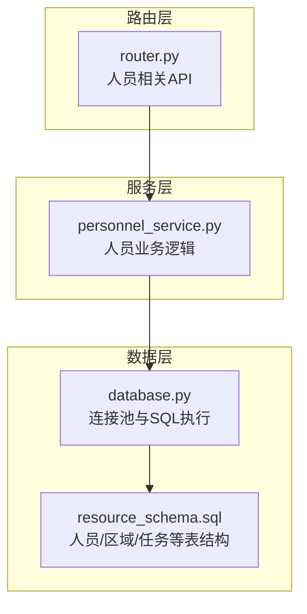
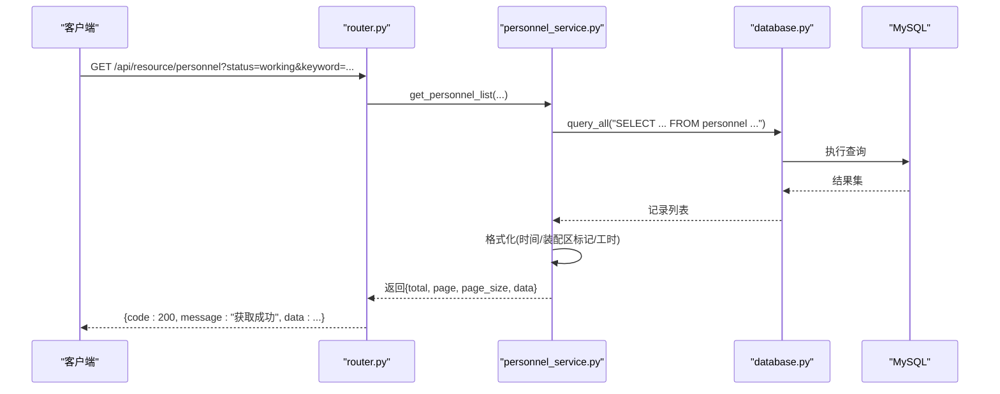
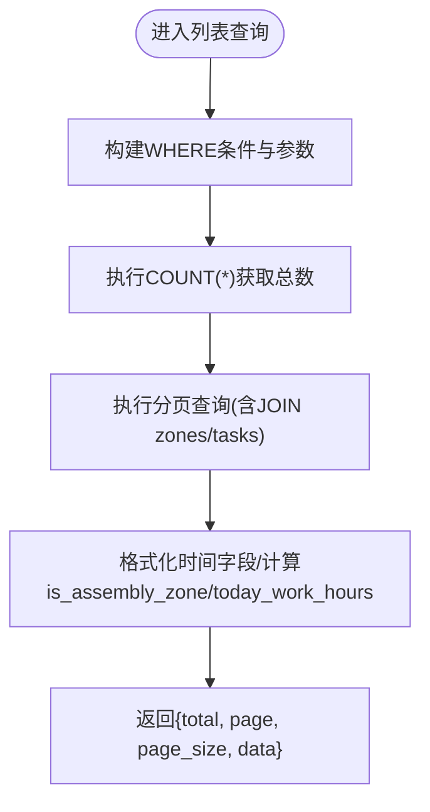

# 人员管理

<cite>
**本文引用的文件**
- [backend/modules/resource/services/personnel_service.py](file://backend/modules/resource/services/personnel_service.py)
- [backend/modules/resource/router.py](file://backend/modules/resource/router.py)
- [backend/modules/resource/schemas.py](file://backend/modules/resource/schemas.py)
- [backend/sql/resource_schema.sql](file://backend/sql/resource_schema.sql)
- [backend/database.py](file://backend/database.py)
</cite>

## 目录
1. [简介](#简介)
2. [项目结构](#项目结构)
3. [核心组件](#核心组件)
4. [架构总览](#架构总览)
5. [详细组件分析](#详细组件分析)
6. [依赖关系分析](#依赖关系分析)
7. [性能考量](#性能考量)
8. [故障排查指南](#故障排查指南)
9. [结论](#结论)
10. [附录：API接口规范](#附录api接口规范)

## 简介
本模块提供“人员管理”的完整后端能力，覆盖人员信息管理、状态跟踪、位置定位、看板统计与来源分布等。通过统一的REST API对外暴露人员CRUD、状态更新、地图点位、看板KPI、来源分布等接口，支撑前端的人员看板、效率分析等业务场景。

## 项目结构
人员管理相关代码位于资源管理模块下，采用“路由层 + 服务层 + 数据模型/数据库”的分层组织：
- 路由层：定义HTTP端点、参数校验、统一响应格式
- 服务层：实现业务逻辑（查询、统计、校验、转换）
- 数据层：基于连接池的MySQL访问封装与表结构定义

图表来源
- [backend/modules/resource/router.py:356-557](file://backend/modules/resource/router.py#L356-L557)
- [backend/modules/resource/services/personnel_service.py:24-475](file://backend/modules/resource/services/personnel_service.py#L24-L475)
- [backend/database.py:51-116](file://backend/database.py#L51-L116)
- [backend/sql/resource_schema.sql:47-66](file://backend/sql/resource_schema.sql#L47-L66)

章节来源
- [backend/modules/resource/router.py:356-557](file://backend/modules/resource/router.py#L356-L557)
- [backend/modules/resource/services/personnel_service.py:24-475](file://backend/modules/resource/services/personnel_service.py#L24-L475)
- [backend/database.py:51-116](file://backend/database.py#L51-L116)
- [backend/sql/resource_schema.sql:47-66](file://backend/sql/resource_schema.sql#L47-L66)

## 核心组件
- 人员列表查询：支持分页、按状态/区域/来源筛选、关键词搜索（姓名/工号），返回总数与明细，并标注是否装配区、今日工时等
- 人员详情获取：根据工号返回人员信息、当前任务、区域名称、今日工时等
- 人员创建/更新/删除：包含唯一性校验、来源合法性校验、状态合法性校验、时间字段格式化
- 人员状态管理：快速切换工作状态，可选同步更新所在区域
- 看板统计：人员总数、在岗、工作中、空闲、离线、异常人数、区域分布
- 来源分布：装配区与非装配区的来源分布（饼图/柱状图数据）
- 位置分布：各区域人员数量及明细，用于园区地图覆盖层展示

章节来源
- [backend/modules/resource/services/personnel_service.py:24-475](file://backend/modules/resource/services/personnel_service.py#L24-L475)
- [backend/modules/resource/router.py:356-557](file://backend/modules/resource/router.py#L356-L557)

## 架构总览
人员管理的请求处理流程如下：
- 客户端调用 /api/resource/personnel/* 路由
- 路由层解析参数并调用 personnel_service 对应方法
- 服务层进行业务校验、组装SQL、调用 database 工具函数
- 数据库层使用连接池执行SQL，返回结果
- 服务层对结果进行格式化（如时间转字符串、装配区标记）
- 路由层统一包装为 {code, message, data} 响应

图表来源
- [backend/modules/resource/router.py:356-385](file://backend/modules/resource/router.py#L356-L385)
- [backend/modules/resource/services/personnel_service.py:24-124](file://backend/modules/resource/services/personnel_service.py#L24-L124)
- [backend/database.py:51-70](file://backend/database.py#L51-L70)

## 详细组件分析

### 人员列表查询
- 功能要点
  - 分页：page/page_size
  - 筛选：status（working/idle/offline）、current_zone、department（来源）
  - 搜索：keyword（匹配 personnel_code/name）
  - 返回字段：基础信息、区域名称、当前任务名、今日工时、是否装配区
- 复杂度
  - 计数与列表查询均为单表+LEFT JOIN，索引优化见数据库层
  - 时间字段在Python层格式化，避免重复计算
- 边界处理
  - 空条件时where子句为空
  - 今日工时默认值兜底
  - 装配区判断基于固定编码集合

图表来源
- [backend/modules/resource/services/personnel_service.py:24-124](file://backend/modules/resource/services/personnel_service.py#L24-L124)

章节来源
- [backend/modules/resource/services/personnel_service.py:24-124](file://backend/modules/resource/services/personnel_service.py#L24-L124)

### 人员详情获取
- 根据工号查询人员详情，关联区域与当前任务，计算今日工时
- 返回装配区标记与时间字段格式化后的结果

章节来源
- [backend/modules/resource/services/personnel_service.py:127-167](file://backend/modules/resource/services/personnel_service.py#L127-L167)

### 人员创建
- 校验工号唯一性
- 校验来源合法性（自有/商用车/乘用车/柳汽/中智/外协/内调）
- 自动生成头像文字（取姓名首字）
- 插入后返回新人员详情

章节来源
- [backend/modules/resource/services/personnel_service.py:170-212](file://backend/modules/resource/services/personnel_service.py#L170-L212)

### 人员更新
- 校验人员存在性
- 校验来源与状态合法性
- 动态构建UPDATE语句，仅更新非空字段
- 返回更新后详情

章节来源
- [backend/modules/resource/services/personnel_service.py:215-260](file://backend/modules/resource/services/personnel_service.py#L215-L260)

### 人员删除
- 校验存在性
- 删除记录并返回成功

章节来源
- [backend/modules/resource/services/personnel_service.py:263-283](file://backend/modules/resource/services/personnel_service.py#L263-L283)

### 人员状态管理
- 支持快速切换状态（working/idle/offline）
- 可选同时更新所在区域
- 校验状态合法性

章节来源
- [backend/modules/resource/services/personnel_service.py:286-322](file://backend/modules/resource/services/personnel_service.py#L286-L322)

### 看板统计
- 统计维度：总数、在岗（working+idle）、工作中、空闲、离线、异常（离线人数）
- 区域分布：按 current_zone 分组统计人数
- 返回结构便于前端KPI卡片与图表渲染

章节来源
- [backend/modules/resource/services/personnel_service.py:325-379](file://backend/modules/resource/services/personnel_service.py#L325-L379)

### 来源分布
- 装配区来源分布（饼图）：按 department 统计人数与工作中人数
- 装配区来源柱状图：按来源统计人数与平均工时（模拟）
- 非装配区分布：未分配或不在装配区的区域人数

章节来源
- [backend/modules/resource/services/personnel_service.py:382-431](file://backend/modules/resource/services/personnel_service.py#L382-L431)

### 位置分布（地图覆盖层）
- 区域汇总：每个区域的总人数、工作中、空闲人数
- 人员明细：工号、姓名、头像文字、来源、状态、区域

章节来源
- [backend/modules/resource/services/personnel_service.py:434-474](file://backend/modules/resource/services/personnel_service.py#L434-L474)

## 依赖关系分析
- 路由与服务解耦：router 仅负责参数校验与调用 service，service 专注业务逻辑
- 数据访问抽象：database.py 提供连接池与通用SQL执行方法，屏蔽底层差异
- 表结构与业务对齐：personnel/zones/tasks 等表结构为服务层查询提供基础

图表来源
- [backend/modules/resource/router.py:356-557](file://backend/modules/resource/router.py#L356-L557)
- [backend/modules/resource/services/personnel_service.py:24-475](file://backend/modules/resource/services/personnel_service.py#L24-L475)
- [backend/database.py:51-116](file://backend/database.py#L51-L116)
- [backend/sql/resource_schema.sql:47-109](file://backend/sql/resource_schema.sql#L47-L109)

章节来源
- [backend/modules/resource/router.py:356-557](file://backend/modules/resource/router.py#L356-L557)
- [backend/modules/resource/services/personnel_service.py:24-475](file://backend/modules/resource/services/personnel_service.py#L24-L475)
- [backend/database.py:51-116](file://backend/database.py#L51-L116)
- [backend/sql/resource_schema.sql:47-109](file://backend/sql/resource_schema.sql#L47-L109)

## 性能考量
- 索引利用：人员表对 status/current_zone/department 建立索引；任务表对 task_type/status/priority/project_code/equipment_code 建立索引，利于筛选与统计
- 查询优化：列表查询先COUNT再LIMIT，避免全量加载；JOIN zones/tasks 减少多次往返
- 连接池：database.py 使用 PooledDB，控制最大连接数与缓存，降低连接开销
- 时间格式化：在服务层集中处理，避免重复计算
- 建议
  - 对高频筛选字段增加复合索引（如 status + current_zone）
  - 对复杂统计可考虑物化视图或定时汇总表
  - 对大列表分页查询建议限制最大 page_size

[本节为通用性能建议，不直接分析具体文件]

## 故障排查指南
- 常见错误
  - 工号已存在：创建时抛出 ValueError，路由层转为 400
  - 人员不存在：更新/删除/状态更新前校验失败，返回 400
  - 无效状态/来源：校验失败返回 400
  - 数据库配置错误：连接池初始化失败，日志提示检查 .env
- 排查步骤
  - 查看路由层异常捕获与HTTPException映射
  - 检查服务层参数校验与SQL执行
  - 核对数据库表结构与索引
  - 确认 .env 中 DB_HOST/DB_PORT/DB_USER/DB_PASSWORD/DB_DATABASE 正确

章节来源
- [backend/modules/resource/router.py:411-502](file://backend/modules/resource/router.py#L411-L502)
- [backend/modules/resource/services/personnel_service.py:170-322](file://backend/modules/resource/services/personnel_service.py#L170-L322)
- [backend/database.py:12-43](file://backend/database.py#L12-L43)

## 结论
人员管理模块以清晰的分层架构实现了人员信息的CRUD、状态与位置管理、看板统计与来源分布等核心能力。通过严格的参数校验与统一的响应格式，保证了接口的健壮性与易用性。后续可在统计聚合、权限控制、审计日志等方面进一步增强。

[本节为总结性内容，不直接分析具体文件]

## 附录：API接口规范
以下接口均位于 /api/resource 前缀下。所有响应统一格式：{code, message, data}。

- 人员列表
  - 方法：GET
  - 路径：/api/resource/personnel
  - 查询参数：
    - page: int (>=1)
    - page_size: int (>=1, <=100)
    - status: working|idle|offline
    - current_zone: string
    - department: 自有|商用车|乘用车|柳汽|中智|外协|内调
    - keyword: string（姓名/工号模糊匹配）
  - 响应data：
    - total: int
    - page: int
    - page_size: int
    - data: 数组，每项包含人员基本信息、区域名称、当前任务名、今日工时、是否装配区、时间字段（已格式化）

- 人员详情
  - 方法：GET
  - 路径：/api/resource/personnel/{personnel_code}
  - 路径参数：personnel_code: string
  - 响应data：人员详情（含区域名称、当前任务名、今日工时、装配区标记、时间字段）

- 新增人员
  - 方法：POST
  - 路径：/api/resource/personnel
  - 请求体：
    - personnel_code: string
    - name: string
    - avatar_text: string (可选)
    - department: string (可选，需为有效来源)
    - status: string (可选，默认offline)
    - current_zone: string (可选)
  - 响应data：新创建的人员详情

- 更新人员
  - 方法：PUT
  - 路径：/api/resource/personnel/{personnel_code}
  - 路径参数：personnel_code: string
  - 请求体（部分更新）：
    - name: string (可选)
    - avatar_text: string (可选)
    - department: string (可选)
    - status: string (可选)
    - current_zone: string (可选)
    - current_task_id: int (可选)
  - 响应data：更新后的人员详情

- 删除人员
  - 方法：DELETE
  - 路径：/api/resource/personnel/{personnel_code}
  - 路径参数：personnel_code: string
  - 响应data：null

- 更新人员状态
  - 方法：PUT
  - 路径：/api/resource/personnel/{personnel_code}/status
  - 路径参数：personnel_code: string
  - 请求体：
    - status: working|idle|offline
    - current_zone: string (可选)
  - 响应data：更新后的人员详情

- 人员看板统计
  - 方法：GET
  - 路径：/api/resource/personnel/stats
  - 响应data：
    - total: int
    - on_duty: int
    - working: int
    - idle: int
    - offline: int
    - idle_available: int
    - today_abnormal: int
    - status_distribution: 数组（按状态统计）
    - zone_distribution: 数组（按区域统计）

- 人员来源分布
  - 方法：GET
  - 路径：/api/resource/personnel/source-distribution
  - 响应data：
    - assembly_source_pie: 装配区来源分布（饼图）
    - assembly_source_bar: 装配区来源柱状图（人数+平均工时）
    - non_assembly_distribution: 非装配区分布

- 人员位置分布（地图覆盖层）
  - 方法：GET
  - 路径：/api/resource/personnel/map
  - 响应data：
    - zone_summary: 区域汇总（总人数、工作中、空闲）
    - personnel_positions: 人员明细（工号、姓名、头像文字、来源、状态、区域）

- 人效分析（占位）
  - 方法：GET
  - 路径：/api/resource/personnel/efficiency
  - 查询参数：start_date, end_date, department
  - 响应data：summary与details（当前为占位实现）

章节来源
- [backend/modules/resource/router.py:356-578](file://backend/modules/resource/router.py#L356-L578)
- [backend/modules/resource/services/personnel_service.py:24-475](file://backend/modules/resource/services/personnel_service.py#L24-L475)