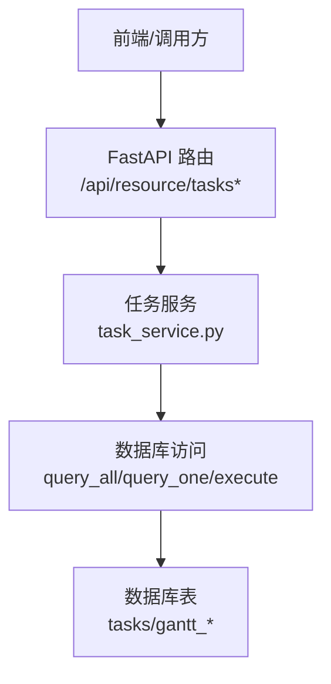
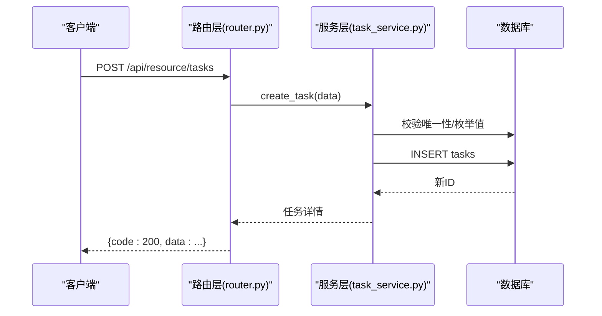
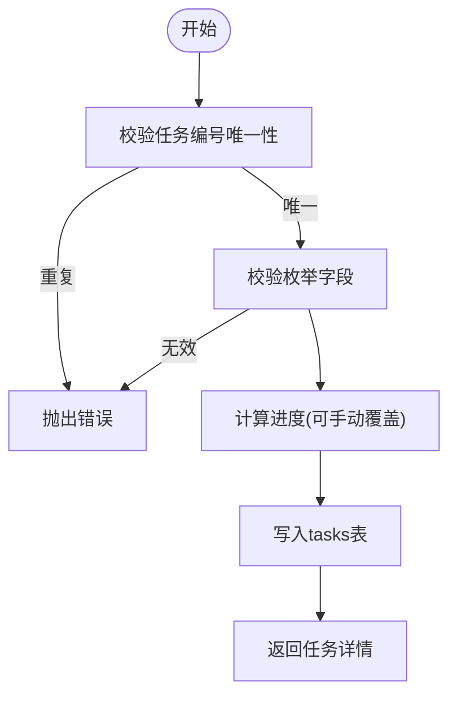
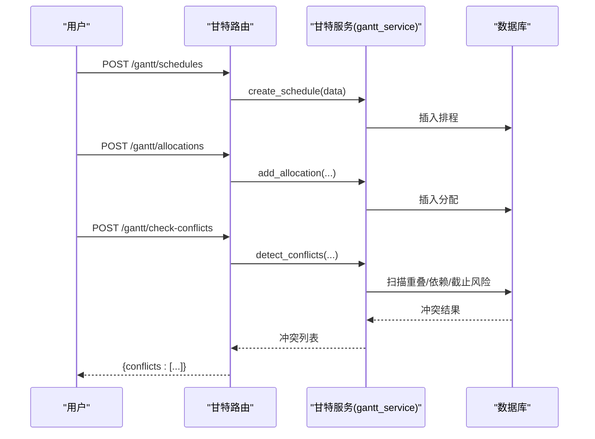
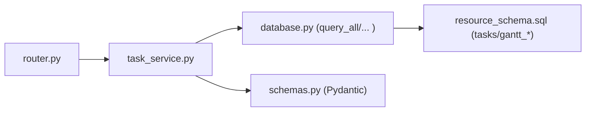

# 任务管理

<cite>
**本文引用的文件**
- [task_service.py](file://backend/modules/resource/services/task_service.py)
- [router.py](file://backend/modules/resource/router.py)
- [schemas.py](file://backend/modules/resource/schemas.py)
- [resource_schema.sql](file://backend/sql/resource_schema.sql)
</cite>

## 目录
1. [简介](#简介)
2. [项目结构](#项目结构)
3. [核心组件](#核心组件)
4. [架构总览](#架构总览)
5. [详细组件分析](#详细组件分析)
6. [依赖关系分析](#依赖关系分析)
7. [性能考虑](#性能考虑)
8. [故障排查指南](#故障排查指南)
9. [结论](#结论)
10. [附录：API接口规范](#附录api接口规范)

## 简介
本模块提供试制资源系统中的“任务管理”能力，覆盖任务的创建、编辑、删除、查询与统计，支持任务状态机（pending、in_progress、completed、overdue）、优先级（high、medium、low）以及进度自动计算。同时提供甘特排程、资源分配与冲突检测等高级能力，支撑装配现场的任务编排与可视化管控。

## 项目结构
后端采用分层设计：
- 路由层：FastAPI Router，定义REST API并转发到服务层
- 服务层：业务逻辑封装（任务CRUD、统计、趋势、类型/进度对比等）
- 数据层：SQL查询封装（query_all/query_one/execute/execute_last_id）
- 模型层：Pydantic Schema用于请求/响应校验
- 数据库：MySQL/MariaDB表结构定义

图表来源
- [router.py:646-831](file://backend/modules/resource/router.py#L646-L831)
- [task_service.py:48-146](file://backend/modules/resource/services/task_service.py#L48-L146)
- [resource_schema.sql:71-109](file://backend/sql/resource_schema.sql#L71-L109)

章节来源
- [router.py:646-831](file://backend/modules/resource/router.py#L646-L831)
- [task_service.py:1-46](file://backend/modules/resource/services/task_service.py#L1-L46)
- [resource_schema.sql:71-109](file://backend/sql/resource_schema.sql#L71-L109)

## 核心组件
- 任务服务（task_service.py）
  - 列表查询：支持分页、多条件筛选、关键词搜索
  - 单条查询：按ID获取详情
  - 创建任务：唯一性校验、枚举校验、进度自动计算
  - 更新任务：增量字段更新、进度自动计算
  - 删除任务：存在性校验后删除
  - 统计报表：KPI、状态分布、类型与进度对比、月度趋势、部门维度统计
- 路由（router.py）
  - 暴露 /api/resource/tasks/* 系列接口
  - 统一返回格式 {code, message, data}
  - 异常处理：参数错误400、未找到404、系统错误500
- 数据模型（schemas.py）
  - TaskCreate/TaskUpdate/TaskResponse 等 Pydantic 模型
- 数据库（resource_schema.sql）
  - tasks 表及索引设计
  - gantt_schedules、gantt_resource_allocations、gantt_conflicts 表用于排程与冲突

章节来源
- [task_service.py:177-287](file://backend/modules/resource/services/task_service.py#L177-L287)
- [router.py:646-831](file://backend/modules/resource/router.py#L646-L831)
- [schemas.py:123-178](file://backend/modules/resource/schemas.py#L123-L178)
- [resource_schema.sql:71-109](file://backend/sql/resource_schema.sql#L71-L109)

## 架构总览
任务管理的端到端流程如下：
- 客户端发起HTTP请求到路由层
- 路由层解析参数、调用服务层方法
- 服务层进行业务校验与数据处理（含进度自动计算）
- 通过数据库访问层执行SQL，读写tasks及相关表
- 返回统一JSON响应

图表来源
- [router.py:702-722](file://backend/modules/resource/router.py#L702-L722)
- [task_service.py:177-237](file://backend/modules/resource/services/task_service.py#L177-L237)
- [resource_schema.sql:71-109](file://backend/sql/resource_schema.sql#L71-L109)

## 详细组件分析

### 任务CRUD与进度计算
- 创建任务
  - 唯一性校验：基于 task_code
  - 枚举校验：task_type、priority、status、source
  - 进度自动计算：若未手动覆盖，progress = min(round(actual_work_hours / plan_work_hours * 100), 100)
  - 默认值：priority=medium、status=pending、actual_work_hours=0、progress=0、source=manual
- 更新任务
  - 仅更新传入字段；更新时间戳自动维护
  - 同样遵循进度自动计算规则
- 删除任务
  - 存在性校验后删除
- 列表查询
  - 支持 task_type、trial_type、status、priority、zone_code、assembly_site、keyword 等多维筛选
  - 分页：page/page_size
  - 结果包含关联的 zone_name、equipment_name 等展示字段

图表来源
- [task_service.py:177-237](file://backend/modules/resource/services/task_service.py#L177-L237)
- [task_service.py:21-45](file://backend/modules/resource/services/task_service.py#L21-L45)

章节来源
- [task_service.py:177-287](file://backend/modules/resource/services/task_service.py#L177-L287)
- [task_service.py:21-45](file://backend/modules/resource/services/task_service.py#L21-L45)

### 任务状态机与流转规则
- 状态集合：pending、in_progress、completed、overdue
- 当前实现说明
  - 服务层对状态值进行枚举校验，允许外部传入任意合法状态
  - 未在代码中强制约束状态转换顺序（例如从 completed 回退为 in_progress 未被阻止）
  - overdue 通常由计划时间过期或调度策略标记，具体触发点需结合上游调度或定时任务
- 建议的状态流转（概念性）
  - pending → in_progress：开始执行
  - in_progress → completed：完成
  - in_progress → overdue：超时未完成
  - pending → overdue：计划开始时间已过且未开始
  - completed：终态，一般不再变更

注意：上述流转为业务建议，当前代码未内置状态机引擎，需在调用侧保证一致性。

章节来源
- [task_service.py:13-15](file://backend/modules/resource/services/task_service.py#L13-L15)
- [resource_schema.sql:82](file://backend/sql/resource_schema.sql#L82)

### 优先级管理与排序
- 优先级集合：high、medium、low
- 列表查询默认按 created_at DESC、id DESC 排序
- 建议在查询时增加 priority 权重排序以体现高优优先（例如在 ORDER BY 中加入优先级映射）
- 当前实现未内置复杂优先级算法，可通过查询参数扩展

章节来源
- [task_service.py:13-15](file://backend/modules/resource/services/task_service.py#L13-L15)
- [task_service.py:109-127](file://backend/modules/resource/services/task_service.py#L109-L127)

### 资源分配与冲突检测（甘特排程）
- 相关表
  - gantt_schedules：排程主表，包含任务、阶段、时间、优先级、依赖、关键路径标记等
  - gantt_resource_allocations：资源分配明细（设备、人员、区域、举升机等）
  - gantt_conflicts：冲突记录（资源重叠、时间重叠、依赖错过、截止风险、过载等）
- 相关路由
  - 排程CRUD、依赖设置、批量状态更新
  - 资源分配增删改查、批量分配
  - 冲突检测、冲突列表、解决/忽略
  - 关键路径计算
- 典型流程
  - 创建/更新排程 → 分配资源 → 触发冲突检测 → 生成冲突记录 → 人工/自动解决 → 更新排程状态

图表来源
- [router.py:1245-1397](file://backend/modules/resource/router.py#L1245-L1397)
- [resource_schema.sql:204-325](file://backend/sql/resource_schema.sql#L204-L325)

章节来源
- [router.py:1190-1419](file://backend/modules/resource/router.py#L1190-L1419)
- [resource_schema.sql:204-325](file://backend/sql/resource_schema.sql#L204-L325)

### 任务统计报表与进度跟踪
- KPI统计
  - 总数、各状态数量、各优先级数量、各任务类型数量
  - 计划工时合计、实际工时合计、平均进度
- 状态分布：用于饼图
- 类型与进度对比：用于柱状图（含计划/实际工时）
- 月度趋势：按月份统计任务数与完成数
- 部门维度：按装配场地聚合任务数量与平均进度

章节来源
- [task_service.py:290-431](file://backend/modules/resource/services/task_service.py#L290-L431)

### 任务与设备、人员、区域的关联
- 任务表包含 zone_code、assembly_site、equipment_code 等字段，用于关联区域与设备
- 列表查询通过 LEFT JOIN zones、equipment 补充展示名称
- 人员关联体现在设备/排程的 current_operator 或排程分配的资源类型为 personnel
- 同步机制
  - 当前为直接写库+JOIN读取，无额外同步服务
  - 如需跨系统同步（如MES），可在上层服务增加适配层

章节来源
- [task_service.py:109-127](file://backend/modules/resource/services/task_service.py#L109-L127)
- [resource_schema.sql:71-109](file://backend/sql/resource_schema.sql#L71-L109)

## 依赖关系分析
- 路由层依赖服务层：每个 /api/resource/tasks/* 路由调用对应 service 函数
- 服务层依赖数据库访问：使用 query_all/query_one/execute/execute_last_id
- 数据模型：Pydantic 模型用于请求体校验与响应结构
- 数据库表：tasks、gantt_* 表构成核心数据模型

图表来源
- [router.py:646-831](file://backend/modules/resource/router.py#L646-L831)
- [task_service.py:1-10](file://backend/modules/resource/services/task_service.py#L1-L10)
- [schemas.py:123-178](file://backend/modules/resource/schemas.py#L123-L178)
- [resource_schema.sql:71-109](file://backend/sql/resource_schema.sql#L71-L109)

章节来源
- [router.py:646-831](file://backend/modules/resource/router.py#L646-L831)
- [task_service.py:1-10](file://backend/modules/resource/services/task_service.py#L1-L10)

## 性能考虑
- 查询优化
  - 列表查询使用 WHERE + LIMIT/OFFSET 分页
  - 合理索引：tasks.status、tasks.priority、tasks.task_type、tasks.project_code、tasks.equipment_code
- 大数据量
  - 避免全表扫描，尽量使用索引列过滤
  - 关键字搜索使用 LIKE '%keyword%'，注意在大表上的性能影响
- 统计接口
  - GROUP BY 聚合可能较慢，建议定期物化视图或缓存热点指标
- 进度计算
  - 自动计算仅在缺失或允许自动模式时生效，减少不必要计算

[本节为通用指导，不直接分析具体文件]

## 故障排查指南
- 常见错误
  - 任务编号重复：创建时抛出 ValueError
  - 枚举值非法：task_type/priority/status/source 不在允许集合
  - 任务不存在：更新/删除时报错
- 定位步骤
  - 检查路由层异常捕获与返回码
  - 查看服务层日志输出（logger）
  - 核对数据库约束与索引
- 建议
  - 在调用前进行参数预校验
  - 对频繁查询加缓存或物化视图
  - 对状态变更增加审计日志

章节来源
- [router.py:702-771](file://backend/modules/resource/router.py#L702-L771)
- [task_service.py:177-287](file://backend/modules/resource/services/task_service.py#L177-L287)

## 结论
任务管理模块提供了完整的CRUD、统计与排程能力，满足试制现场对任务编排、进度跟踪与资源冲突检测的需求。当前实现以灵活为主，状态流转未做强制约束，便于扩展。后续可引入更严格的状态机与自动化调度策略，进一步提升效率与可靠性。

[本节为总结，不直接分析具体文件]

## 附录：API接口规范

### 任务管理接口
- 基础信息
  - 模块前缀：/api/resource
  - 统一返回：{code, message, data}
- 列表查询
  - GET /api/resource/tasks
  - 参数：page, page_size, task_type, trial_type, status, priority, zone_code, assembly_site, keyword
  - 说明：支持多维筛选与关键词搜索，返回分页数据
- 详情查询
  - GET /api/resource/tasks/{task_id}
  - 返回：任务详情（含关联区域/设备名称）
- 创建任务
  - POST /api/resource/tasks
  - 请求体：TaskCreateRequest（见路由定义）
  - 行为：唯一性校验、枚举校验、进度自动计算
- 更新任务
  - PUT /api/resource/tasks/{task_id}
  - 请求体：TaskUpdateRequest（见路由定义）
  - 行为：增量更新、进度自动计算
- 删除任务
  - DELETE /api/resource/tasks/{task_id}
- 统计与报表
  - GET /api/resource/tasks/stats：KPI统计
  - GET /api/resource/tasks/status-distribution：状态分布
  - GET /api/resource/tasks/type-progress：类型与进度对比
  - GET /api/resource/tasks/monthly-trend?year=...：月度趋势

章节来源
- [router.py:646-831](file://backend/modules/resource/router.py#L646-L831)

### 甘特排程与冲突检测接口
- 排程
  - GET /api/resource/gantt/data：排程列表（支持筛选、分页、日期区间）
  - GET /api/resource/gantt/stats：排程KPI与趋势
  - GET /api/resource/gantt/schedules/{id_or_code}：排程详情
  - POST /api/resource/gantt/schedules：新建排程
  - PUT /api/resource/gantt/schedules/{id_or_code}：更新排程
  - DELETE /api/resource/gantt/schedules/{id_or_code}：删除排程
  - PUT /api/resource/gantt/schedules/{id_or_code}/dependencies：设置前置依赖（环检测）
  - POST /api/resource/gantt/batch-status：批量更新排程状态
- 资源分配
  - GET /api/resource/gantt/allocations：分配列表
  - POST /api/resource/gantt/allocations：新增分配
  - DELETE /api/resource/gantt/allocations/{allocation_id}：删除分配
  - POST /api/resource/gantt/allocations/batch：批量分配
- 冲突检测
  - POST /api/resource/gantt/check-conflicts：触发检测
  - GET /api/resource/gantt/conflicts：冲突列表
  - PUT /api/resource/gantt/conflicts/{id_or_code}/resolve：标记已解决
  - PUT /api/resource/gantt/conflicts/{id_or_code}/ignore：忽略冲突
- 关键路径
  - POST /api/resource/gantt/compute-critical：计算关键路径

章节来源
- [router.py:1190-1419](file://backend/modules/resource/router.py#L1190-L1419)

### 数据模型参考
- 任务模型
  - TaskBase/TaskCreate/TaskUpdate/TaskResponse/TaskListResponse
- 其他模型
  - Equipment/Zone/Personnel/Alert/Dashboard 等（与本模块相关）

章节来源
- [schemas.py:123-178](file://backend/modules/resource/schemas.py#L123-L178)