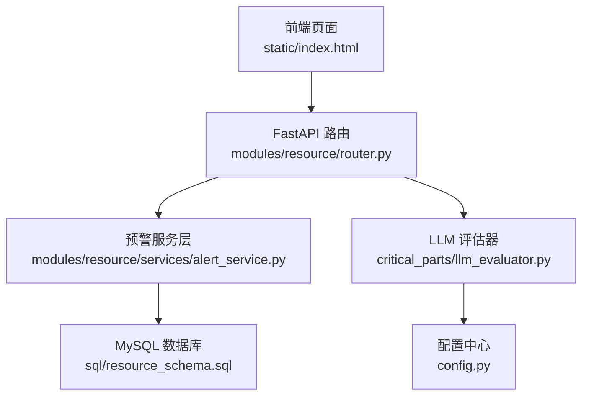
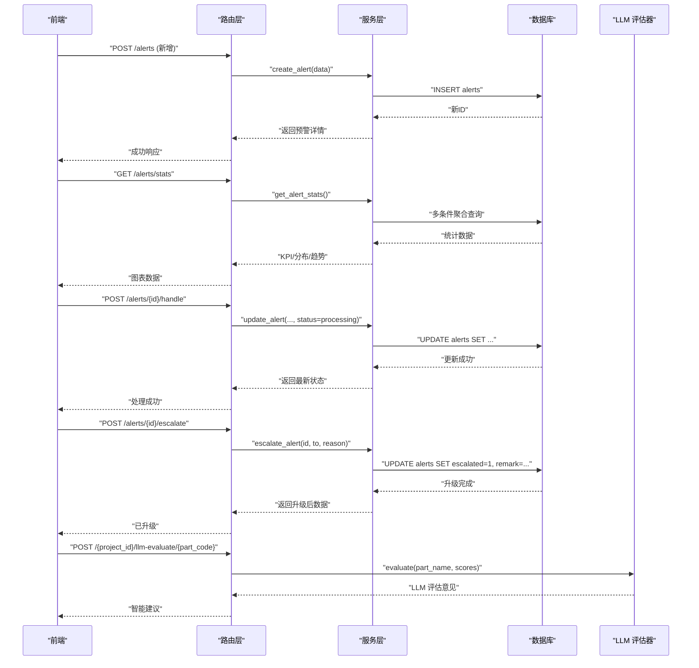
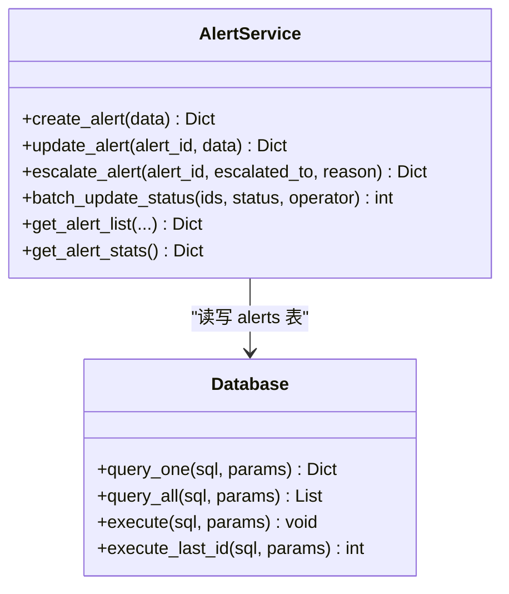
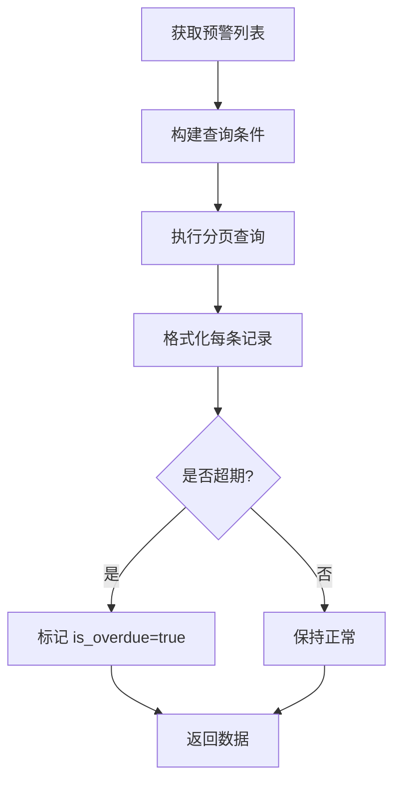
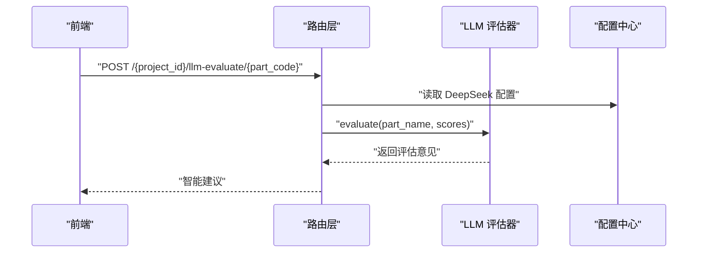
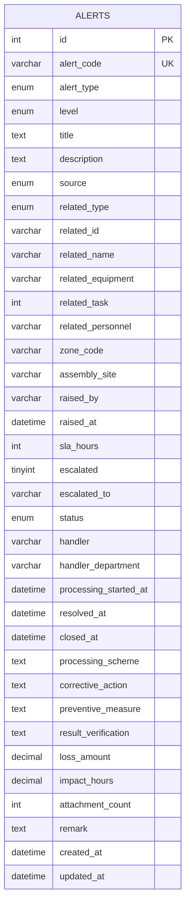
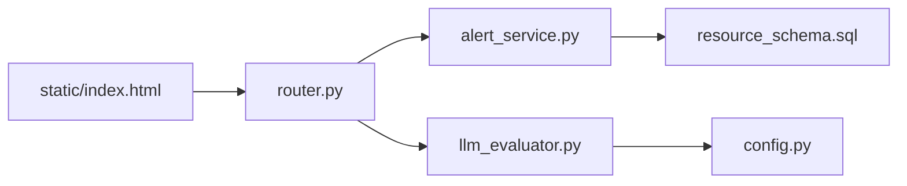

# 异常预警

<cite>
**本文引用的文件**
- [alert_service.py](file://backend/modules/resource/services/alert_service.py)
- [router.py](file://backend/modules/resource/router.py)
- [schemas.py](file://backend/modules/resource/schemas.py)
- [resource_schema.sql](file://backend/sql/resource_schema.sql)
- [llm_evaluator.py](file://backend/critical_parts/llm_evaluator.py)
- [config.py](file://backend/config.py)
- [exceptions.py](file://backend/core/exceptions.py)
- [index.html](file://static/index.html)
</cite>

## 目录
1. [简介](#简介)
2. [项目结构](#项目结构)
3. [核心组件](#核心组件)
4. [架构总览](#架构总览)
5. [详细组件分析](#详细组件分析)
6. [依赖关系分析](#依赖关系分析)
7. [性能与可扩展性](#性能与可扩展性)
8. [故障排查指南](#故障排查指南)
9. [结论](#结论)
10. [附录：API 规范](#附录api-规范)

## 简介
本模块提供“异常预警”的完整能力，包括预警规则引擎、分级处理机制、SLA 管理、升级上报、批量处理、统计分析、LLM 智能评估建议等。系统通过数据库持久化存储预警数据，支持按类型、级别、状态、区域等多维度筛选与分页查询，并提供统计指标（KPI、分布、趋势）用于可视化展示。LLM 评估器可对关键件进行语义级二次评估，辅助生成智能建议。

## 项目结构
- 服务层：异常预警的业务逻辑集中在 alert_service.py，负责创建、更新、升级、批量处理、统计等。
- 路由层：FastAPI 路由在 router.py 中暴露 REST API，统一封装请求参数与响应格式。
- 数据模型：schemas.py 定义请求/响应结构；resource_schema.sql 定义 alerts 表结构与索引。
- LLM 集成：llm_evaluator.py 提供基于 DeepSeek 的语义评估能力，配置来自 config.py。
- 前端：static/index.html 包含预警列表、筛选、分页、统计图表等页面逻辑。

**图示来源**
- [router.py:949-1075](file://backend/modules/resource/router.py#L949-L1075)
- [alert_service.py:47-398](file://backend/modules/resource/services/alert_service.py#L47-L398)
- [resource_schema.sql:120-163](file://backend/sql/resource_schema.sql#L120-L163)
- [llm_evaluator.py:5-62](file://backend/critical_parts/llm_evaluator.py#L5-L62)
- [config.py:76-79](file://backend/config.py#L76-L79)

**章节来源**
- [router.py:949-1075](file://backend/modules/resource/router.py#L949-L1075)
- [alert_service.py:47-398](file://backend/modules/resource/services/alert_service.py#L47-L398)
- [resource_schema.sql:120-163](file://backend/sql/resource_schema.sql#L120-L163)
- [llm_evaluator.py:5-62](file://backend/critical_parts/llm_evaluator.py#L5-L62)
- [config.py:76-79](file://backend/config.py#L76-L79)

## 核心组件
- 预警规则引擎：基于枚举类型的预警类型、级别、来源、状态，结合 SLA 默认值与软超期计算，形成规则判断基础。
- 分级处理机制：四级级别（紧急 critical、高 high、中 medium、低 low），对应不同 SLA 小时数，支持升级上报。
- SLA 管理：根据级别自动填充 sla_hours，并在返回数据时计算剩余时间与是否超期；统计接口提供超期计数。
- 通知渠道集成：当前代码未实现外部通知通道（邮件/SMS/Webhook），但预留了升级上报字段与备注记录，便于后续扩展。
- LLM 智能评估：对关键件评分结果进行语义理解，输出评估意见与建议，增强决策质量。

**章节来源**
- [alert_service.py:12-38](file://backend/modules/resource/services/alert_service.py#L12-L38)
- [alert_service.py:143-172](file://backend/modules/resource/services/alert_service.py#L143-L172)
- [alert_service.py:337-398](file://backend/modules/resource/services/alert_service.py#L337-L398)
- [llm_evaluator.py:5-62](file://backend/critical_parts/llm_evaluator.py#L5-L62)
- [config.py:76-79](file://backend/config.py#L76-L79)

## 架构总览
预警流程从前端发起请求到后端路由，进入服务层进行业务校验与数据处理，最终写入数据库并返回格式化结果。统计接口聚合多维度数据供前端图表渲染。LLM 评估器作为可选增强能力，依据配置调用外部模型生成语义建议。

**图示来源**
- [router.py:1006-1075](file://backend/modules/resource/router.py#L1006-L1075)
- [alert_service.py:188-314](file://backend/modules/resource/services/alert_service.py#L188-L314)
- [alert_service.py:337-398](file://backend/modules/resource/services/alert_service.py#L337-L398)
- [llm_evaluator.py:19-62](file://backend/critical_parts/llm_evaluator.py#L19-L62)

## 详细组件分析

### 预警规则引擎与阈值设置
- 预警类型：任务延迟、质量缺陷、设备故障、物料缺件、人员缺口、安全隐患、计划超期、工艺违规、外部协调、其他。
- 预警级别：紧急、高、中、低，分别对应 SLA 小时数：4、8、24、72。
- 来源：系统自动、人工上报、设备报警、运营巡检、质量巡检、其他。
- 状态：待处理、处理中、已解决、已关闭、已超期（软超期）。
- 关联对象：任务、设备、人员、物料、项目、车间、无。
- 阈值与默认值：创建或更新时若未指定 sla_hours，则按级别自动填充；列表与详情返回时计算 due_at、remaining_hours、is_overdue。

**图示来源**
- [alert_service.py:188-254](file://backend/modules/resource/services/alert_service.py#L188-L254)
- [alert_service.py:143-172](file://backend/modules/resource/services/alert_service.py#L143-L172)

**章节来源**
- [alert_service.py:12-38](file://backend/modules/resource/services/alert_service.py#L12-L38)
- [alert_service.py:188-254](file://backend/modules/resource/services/alert_service.py#L188-L254)
- [alert_service.py:143-172](file://backend/modules/resource/services/alert_service.py#L143-L172)

### 分级处理与升级机制
- 级别策略：critical/high/medium/low，影响 SLA 与优先级排序。
- 升级上报：支持将预警升级至指定部门或角色，并记录原因到备注字段。
- 批量处理：支持批量修改状态（待处理→处理中→已解决→已关闭），自动补齐介入/解决/关闭时间戳。

**图示来源**
- [alert_service.py:188-334](file://backend/modules/resource/services/alert_service.py#L188-L334)
- [resource_schema.sql:120-163](file://backend/sql/resource_schema.sql#L120-L163)

**章节来源**
- [alert_service.py:305-334](file://backend/modules/resource/services/alert_service.py#L305-L334)
- [alert_service.py:188-254](file://backend/modules/resource/services/alert_service.py#L188-L254)

### SLA 管理与超期计算
- 默认 SLA：按级别自动填充，未显式指定时使用默认值。
- 软超期：在返回列表与详情时计算 due_at、remaining_hours、is_overdue；统计接口提供 overdue 计数。
- 状态变更时间戳：处理中、已解决、已关闭时自动补齐对应时间。

**图示来源**
- [alert_service.py:47-140](file://backend/modules/resource/services/alert_service.py#L47-L140)
- [alert_service.py:143-172](file://backend/modules/resource/services/alert_service.py#L143-L172)
- [alert_service.py:337-398](file://backend/modules/resource/services/alert_service.py#L337-L398)

**章节来源**
- [alert_service.py:47-140](file://backend/modules/resource/services/alert_service.py#L47-L140)
- [alert_service.py:143-172](file://backend/modules/resource/services/alert_service.py#L143-L172)
- [alert_service.py:337-398](file://backend/modules/resource/services/alert_service.py#L337-L398)

### 通知渠道集成
- 当前实现未包含外部通知通道（邮件、短信、Webhook）。
- 升级上报字段与备注记录可用于后续集成通知服务。
- 建议扩展点：在 escalate_alert 或 update_alert 成功后触发通知回调。

[本节为概念性说明，不直接分析具体文件]

### LLM 评估器在关键件评分中的应用
- 功能：对零件名称与多维评分进行语义评估，输出关键程度与建议。
- 配置：通过 DEEPSEEK_API_KEY、DEEPSEEK_BASE_URL、DEEPSEEK_MODEL 控制可用性与模型选择。
- 使用场景：关键件评分后，可调用 LLM 评估器生成智能建议，辅助决策。

**图示来源**
- [llm_evaluator.py:5-62](file://backend/critical_parts/llm_evaluator.py#L5-L62)
- [config.py:76-79](file://backend/config.py#L76-L79)

**章节来源**
- [llm_evaluator.py:5-62](file://backend/critical_parts/llm_evaluator.py#L5-L62)
- [config.py:76-79](file://backend/config.py#L76-L79)

### 预警数据的持久化存储、历史追溯、趋势分析
- 持久化：alerts 表包含完整字段，支持类型、级别、状态、时间、损失金额、影响工时等。
- 历史追溯：created_at、updated_at、raised_at、processing_started_at、resolved_at、closed_at 等时间戳记录全生命周期。
- 趋势分析：统计接口提供近7天新增趋势、级别分布、类型分布、交叉分布等。

**图示来源**
- [resource_schema.sql:120-163](file://backend/sql/resource_schema.sql#L120-L163)

**章节来源**
- [resource_schema.sql:120-163](file://backend/sql/resource_schema.sql#L120-L163)
- [alert_service.py:337-398](file://backend/modules/resource/services/alert_service.py#L337-L398)

### 标准化流程与最佳实践
- 创建预警：确保类型、级别、状态合法；未指定 sla_hours 时自动按级别填充。
- 处理预警：状态变更为处理中时自动记录介入时间；解决/关闭时自动记录对应时间。
- 升级上报：记录升级目标与原因到备注，便于审计与回溯。
- 批量操作：谨慎使用批量状态更新，避免误改；建议配合操作人标识。
- 统计报表：定期查看 KPI、分布、趋势，识别高风险领域与瓶颈。

[本节为通用指导，不直接分析具体文件]

## 依赖关系分析
- 路由层依赖服务层：所有预警相关 API 均委托 alert_service.py 实现。
- 服务层依赖数据库：通过 query_one/query_all/execute 等函数访问 MySQL。
- LLM 评估器依赖配置：DeepSeek 配置项决定可用性。
- 前端依赖后端 API：静态页面通过 HTTP 调用路由接口获取数据。

**图示来源**
- [router.py:949-1075](file://backend/modules/resource/router.py#L949-L1075)
- [alert_service.py:47-398](file://backend/modules/resource/services/alert_service.py#L47-L398)
- [llm_evaluator.py:5-62](file://backend/critical_parts/llm_evaluator.py#L5-L62)
- [config.py:76-79](file://backend/config.py#L76-L79)
- [index.html:9534-9589](file://static/index.html#L9534-L9589)

**章节来源**
- [router.py:949-1075](file://backend/modules/resource/router.py#L949-L1075)
- [alert_service.py:47-398](file://backend/modules/resource/services/alert_service.py#L47-L398)
- [llm_evaluator.py:5-62](file://backend/critical_parts/llm_evaluator.py#L5-L62)
- [config.py:76-79](file://backend/config.py#L76-L79)
- [index.html:9534-9589](file://static/index.html#L9534-L9589)

## 性能与可扩展性
- 查询优化：alerts 表针对类型、级别、状态、时间、区域、设备、处理人建立索引，提升筛选与分页性能。
- 软超期计算：仅在返回数据时计算，避免频繁写库；统计接口使用 SQL 聚合减少内存压力。
- 可扩展性：通知渠道可在升级或状态变更后扩展；LLM 评估器可按需启用或替换模型。
- 批量操作：支持批量状态更新，注意事务与错误回滚策略。

[本节为通用讨论，不直接分析具体文件]

## 故障排查指南
- 业务异常：自定义 BusinessError 基类可用于统一错误码与消息。
- 常见错误：无效类型/级别/状态会抛出 ValueError；重复预警编号会拒绝插入。
- 日志记录：LLM 评估失败会记录警告日志；批量更新失败会记录错误日志。
- 调试建议：检查数据库连接、DeepSeek 配置、API 参数合法性。

**章节来源**
- [exceptions.py:1-8](file://backend/core/exceptions.py#L1-L8)
- [alert_service.py:188-254](file://backend/modules/resource/services/alert_service.py#L188-L254)
- [alert_service.py:317-334](file://backend/modules/resource/services/alert_service.py#L317-L334)
- [llm_evaluator.py:56-62](file://backend/critical_parts/llm_evaluator.py#L56-L62)

## 结论
本模块实现了完整的异常预警能力，涵盖规则引擎、分级处理、SLA 管理、升级上报、批量处理、统计分析以及 LLM 智能评估。通过清晰的层次化设计与良好的数据建模，系统具备良好的可维护性与扩展性。建议后续补充通知渠道集成与更细粒度的规则配置界面，以提升自动化与智能化水平。

[本节为总结，不直接分析具体文件]

## 附录：API 规范

### 预警管理接口
- GET /resource/alerts
  - 描述：获取预警列表（分页/筛选/SLA 软超期过滤）
  - 参数：page, page_size, alert_type, level, status, source, zone_code, assembly_site, handler, raised_start, raised_end, keyword, escalated_only, overdue_only
  - 响应：code, message, data（total, page, page_size, data[]）

- GET /resource/alerts/stats
  - 描述：预警统计（KPI/级别分布/类型分布/周新增趋势）
  - 响应：code, message, data（total, critical, high_or_critical, unresolved, pending, processing, resolved, closed, overdue, escalated, level_distribution, status_distribution, type_distribution, cross_distribution, weekly_trend）

- GET /resource/alerts/{alert_id}
  - 描述：获取预警详情
  - 响应：code, message, data（预警对象）

- POST /resource/alerts
  - 描述：新增预警（人工上报）
  - 请求体：AlertCreateRequest（见 schemas.py）
  - 响应：code, message, data（新建预警对象）

- PUT /resource/alerts/{alert_id}
  - 描述：更新预警（通用）
  - 请求体：AlertUpdateRequest（见 schemas.py）
  - 响应：code, message, data（更新后预警对象）

- POST /resource/alerts/{alert_id}/handle
  - 描述：处理预警（介入/处置/验证）
  - 请求体：AlertHandleRequest（handler, handler_department, processing_scheme, corrective_action, preventive_measure, result_verification, status）
  - 响应：code, message, data（处理后预警对象）

- POST /resource/alerts/{alert_id}/escalate
  - 描述：升级上报预警
  - 请求体：AlertEscalateRequest（escalated_to, reason）
  - 响应：code, message, data（升级后预警对象）

- POST /resource/alerts/batch
  - 描述：批量修改预警状态
  - 请求体：AlertBatchRequest（ids, status, operator）
  - 响应：code, message, data（updated 数量）

**章节来源**
- [router.py:949-1075](file://backend/modules/resource/router.py#L949-L1075)
- [schemas.py:180-224](file://backend/modules/resource/schemas.py#L180-L224)

### LLM 评估接口
- POST /critical_parts/{project_id}/llm-evaluate/{part_code}
  - 描述：对单个零件进行 LLM 语义评估
  - 响应：code, message, data（part_code, part_name, llm_evaluation）

**章节来源**
- [llm_evaluator.py:19-62](file://backend/critical_parts/llm_evaluator.py#L19-L62)
- [config.py:76-79](file://backend/config.py#L76-L79)