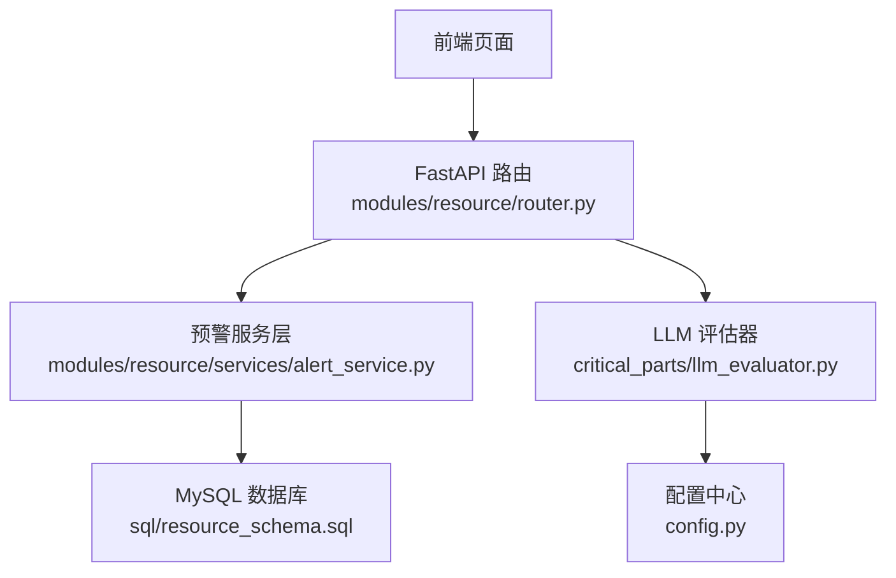
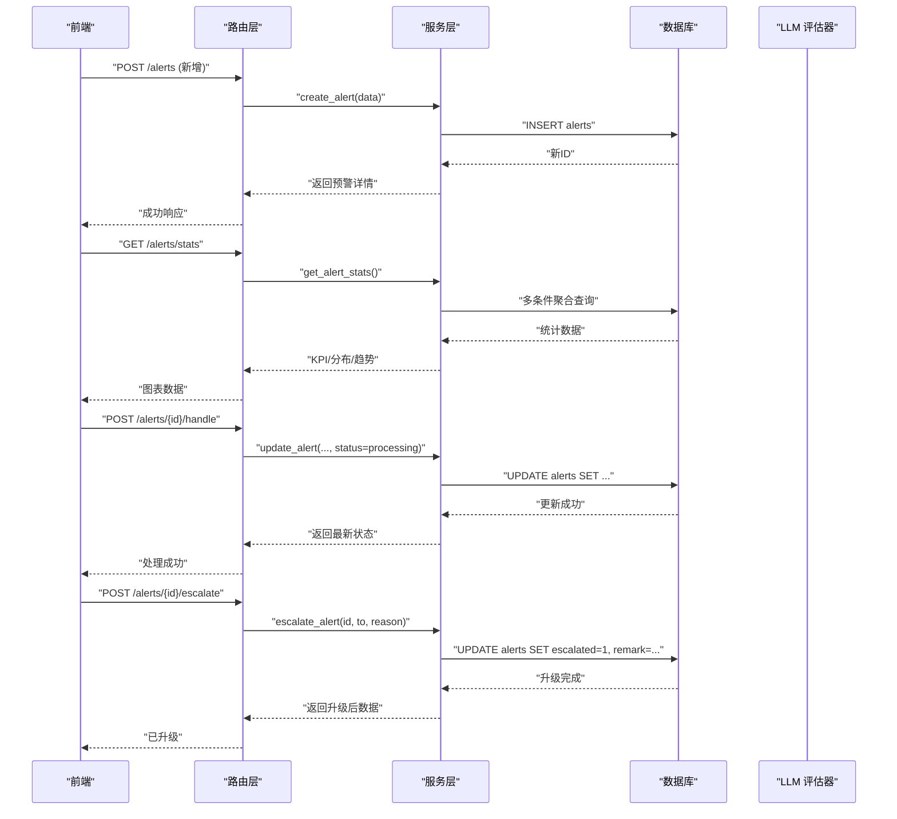
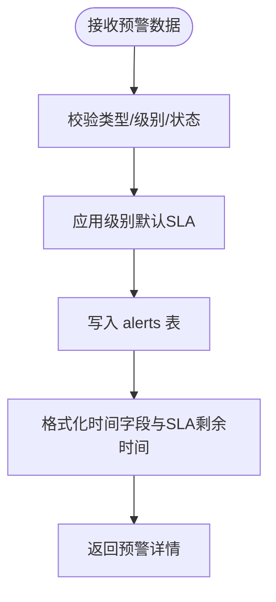
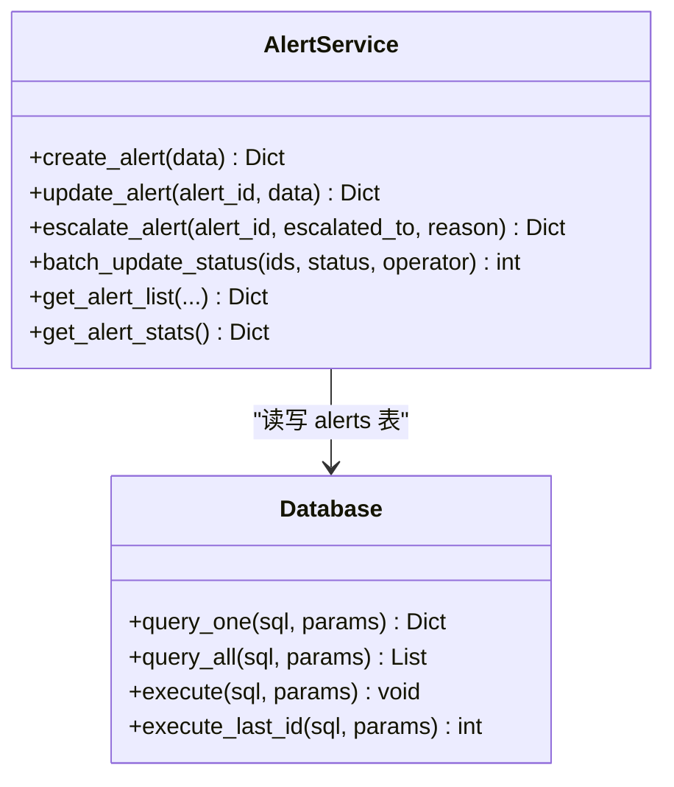
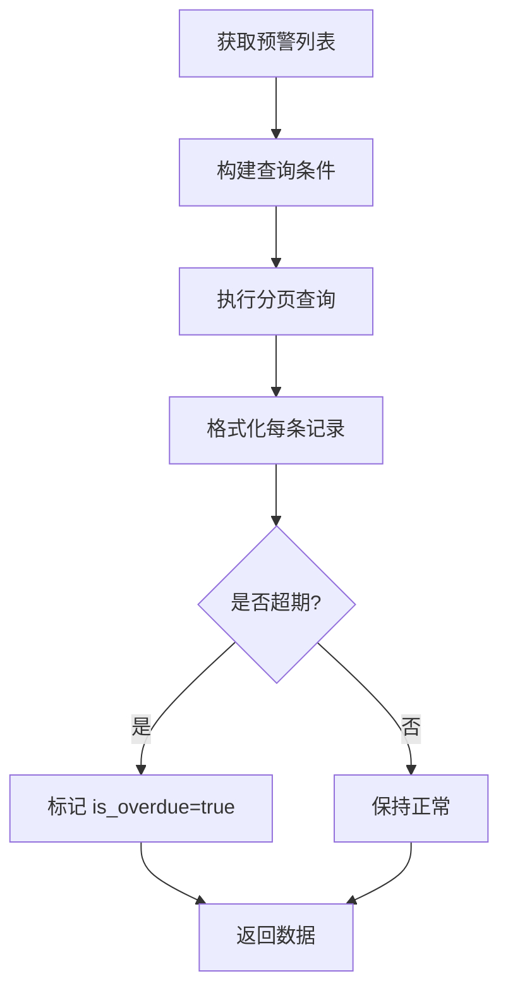
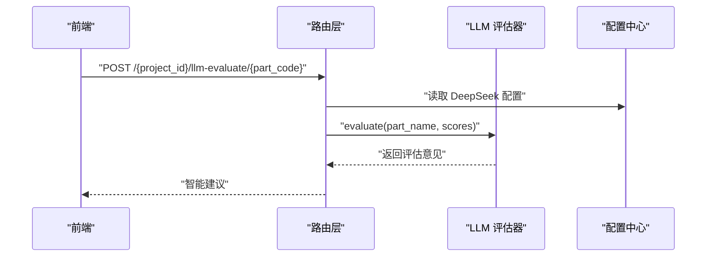
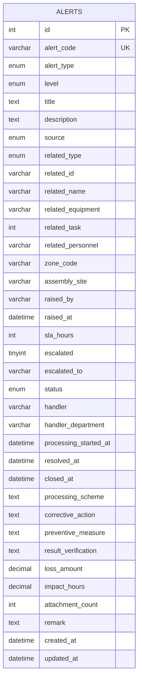
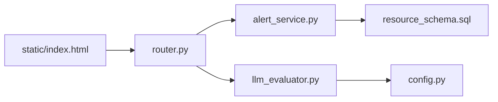

# 异常预警

<cite>
**本文引用的文件**
- [alert_service.py](file://backend/modules/resource/services/alert_service.py)
- [router.py](file://backend/modules/resource/router.py)
- [schemas.py](file://backend/modules/resource/schemas.py)
- [resource_schema.sql](file://backend/sql/resource_schema.sql)
- [llm_evaluator.py](file://backend/critical_parts/llm_evaluator.py)
- [config.py](file://backend/config.py)
- [exceptions.py](file://backend/core/exceptions.py)
</cite>

## 更新摘要
**变更内容**
- 更新了预警类型支持，现支持10种预警类型：任务延迟、质量缺陷、设备故障、物料缺件、人员缺口、安全隐患、计划超期、工艺违规、外部协调、其他
- 完善了SLA管理机制，支持按级别自动配置响应时长（紧急4小时、高8小时、中24小时、低72小时）
- 增强了升级上报机制，支持多级升级和原因记录
- 实现了批量处理能力，支持批量状态更新和时间戳自动填充
- 完善了统计接口，提供多维度数据分析能力

## 目录
1. [简介](#简介)
2. [项目结构](#项目结构)
3. [核心组件](#核心组件)
4. [架构总览](#架构总览)
5. [详细组件分析](#详细组件分析)
6. [依赖关系分析](#依赖关系分析)
7. [性能与可扩展性](#性能与可扩展性)
8. [故障排查指南](#故障排查指南)
9. [结论](#结论)
10. [附录：API 规范](#附录api-规范)

## 简介
本模块提供完整的"异常预警"管理能力，支持10种预警类型的全面处理，包括预警规则引擎、四级分级处理机制、SLA管理、升级上报、批量处理、统计分析以及LLM智能评估建议等核心功能。系统通过数据库持久化存储预警数据，支持按类型、级别、状态、区域等多维度筛选与分页查询，并提供丰富的统计指标用于可视化展示。

## 项目结构
- **服务层**：异常预警的业务逻辑集中在 `alert_service.py`，负责创建、更新、升级、批量处理、统计等核心功能
- **路由层**：FastAPI 路由在 `router.py` 中暴露REST API，统一封装请求参数与响应格式
- **数据模型**：`schemas.py` 定义请求/响应结构；`resource_schema.sql` 定义alerts表结构与索引
- **LLM集成**：`llm_evaluator.py` 提供基于DeepSeek的语义评估能力，配置来自 `config.py`
- **前端界面**：支持预警列表、筛选、分页、统计图表等页面逻辑

**图示来源**
- [router.py:954-1081](file://backend/modules/resource/router.py#L954-L1081)
- [alert_service.py:47-396](file://backend/modules/resource/services/alert_service.py#L47-L396)
- [resource_schema.sql:114-163](file://backend/sql/resource_schema.sql#L114-L163)
- [llm_evaluator.py:5-62](file://backend/critical_parts/llm_evaluator.py#L5-L62)
- [config.py:76-79](file://backend/config.py#L76-L79)

**章节来源**
- [router.py:954-1081](file://backend/modules/resource/router.py#L954-L1081)
- [alert_service.py:47-396](file://backend/modules/resource/services/alert_service.py#L47-L396)
- [resource_schema.sql:114-163](file://backend/sql/resource_schema.sql#L114-L163)
- [llm_evaluator.py:5-62](file://backend/critical_parts/llm_evaluator.py#L5-L62)
- [config.py:76-79](file://backend/config.py#L76-L79)

## 核心组件
- **预警规则引擎**：基于枚举类型的10种预警类型、四级级别、6种来源、5种状态，结合SLA默认值与软超期计算，形成完整的规则判断基础
- **分级处理机制**：四级级别（紧急critical、高high、中medium、低low），对应不同SLA小时数（4/8/24/72），支持升级上报
- **SLA管理**：根据级别自动填充sla_hours，并在返回数据时计算剩余时间与是否超期；统计接口提供超期计数
- **通知渠道集成**：预留了升级上报字段与备注记录，便于后续扩展邮件/SMS/Webhook等通知通道
- **LLM智能评估**：对关键件评分结果进行语义理解，输出评估意见与建议，增强决策质量

**章节来源**
- [alert_service.py:12-30](file://backend/modules/resource/services/alert_service.py#L12-L30)
- [alert_service.py:143-172](file://backend/modules/resource/services/alert_service.py#L143-L172)
- [alert_service.py:334-396](file://backend/modules/resource/services/alert_service.py#L334-L396)
- [llm_evaluator.py:5-62](file://backend/critical_parts/llm_evaluator.py#L5-L62)
- [config.py:76-79](file://backend/config.py#L76-L79)

## 架构总览
预警流程从前端发起请求到后端路由，进入服务层进行业务校验与数据处理，最终写入数据库并返回格式化结果。统计接口聚合多维度数据供前端图表渲染。LLM评估器作为可选增强能力，依据配置调用外部模型生成语义建议。

**图示来源**
- [router.py:1011-1081](file://backend/modules/resource/router.py#L1011-L1081)
- [alert_service.py:185-331](file://backend/modules/resource/services/alert_service.py#L185-L331)
- [alert_service.py:334-396](file://backend/modules/resource/services/alert_service.py#L334-L396)
- [llm_evaluator.py:19-62](file://backend/critical_parts/llm_evaluator.py#L19-L62)

## 详细组件分析

### 预警规则引擎与阈值设置
系统支持10种预警类型，每种类型都有明确的业务含义和处理流程：

**支持的预警类型：**
- `task_delay` - 任务延迟：生产任务未按计划完成
- `quality_defect` - 质量缺陷：产品质量问题发现
- `equipment_fault` - 设备故障：生产设备运行异常
- `material_shortage` - 物料缺件：生产所需物料不足
- `personnel_gap` - 人员缺口：人力资源不足
- `safety_hazard` - 安全隐患：安全生产风险
- `schedule_overdue` - 计划超期：项目进度延期
- `process_violation` - 工艺违规：违反工艺流程规定
- `external_coordinate` - 外部协调：需要外部资源协调
- `other` - 其他：未分类的异常情况

**预警级别与SLA配置：**
- 紧急(critical)：4小时响应时间
- 高(high)：8小时响应时间  
- 中(medium)：24小时响应时间
- 低(low)：72小时响应时间

**图示来源**
- [alert_service.py:185-251](file://backend/modules/resource/services/alert_service.py#L185-L251)
- [alert_service.py:143-172](file://backend/modules/resource/services/alert_service.py#L143-L172)

**章节来源**
- [alert_service.py:12-30](file://backend/modules/resource/services/alert_service.py#L12-L30)
- [alert_service.py:185-251](file://backend/modules/resource/services/alert_service.py#L185-L251)
- [alert_service.py:143-172](file://backend/modules/resource/services/alert_service.py#L143-L172)

### 分级处理与升级机制
系统实现了完整的四级预警处理和升级机制：

**级别策略：**
- critical/high/medium/low四级影响SLA与优先级排序
- 每个级别有对应的响应时间和处理要求

**升级上报功能：**
- 支持将预警升级至指定部门或角色（如海西分部、质量部、总装中心等）
- 记录升级原因到备注字段，便于审计与回溯
- 自动添加时间戳和升级信息

**批量处理能力：**
- 支持批量修改状态（待处理→处理中→已解决→已关闭）
- 自动补齐介入/解决/关闭时间戳
- 错误处理和日志记录

**图示来源**
- [alert_service.py:185-331](file://backend/modules/resource/services/alert_service.py#L185-L331)
- [resource_schema.sql:114-163](file://backend/sql/resource_schema.sql#L114-L163)

**章节来源**
- [alert_service.py:302-331](file://backend/modules/resource/services/alert_service.py#L302-L331)
- [alert_service.py:185-251](file://backend/modules/resource/services/alert_service.py#L185-L251)

### SLA管理与超期计算
系统实现了智能化的SLA管理和超期检测机制：

**默认SLA配置：**
- 按级别自动填充：critical=4h, high=8h, medium=24h, low=72h
- 未显式指定时使用默认值
- 支持自定义覆盖默认配置

**软超期计算：**
- 在返回列表与详情时动态计算 due_at、remaining_hours、is_overdue
- 统计接口提供 overdue 计数
- 避免频繁写库，仅在返回数据时计算

**状态变更时间戳：**
- 处理中(processing)：自动记录 processing_started_at
- 已解决(resolved)：自动记录 resolved_at  
- 已关闭(closed)：自动记录 closed_at

**图示来源**
- [alert_service.py:47-140](file://backend/modules/resource/services/alert_service.py#L47-L140)
- [alert_service.py:143-172](file://backend/modules/resource/services/alert_service.py#L143-L172)
- [alert_service.py:334-396](file://backend/modules/resource/services/alert_service.py#L334-L396)

**章节来源**
- [alert_service.py:47-140](file://backend/modules/resource/services/alert_service.py#L47-L140)
- [alert_service.py:143-172](file://backend/modules/resource/services/alert_service.py#L143-L172)
- [alert_service.py:334-396](file://backend/modules/resource/services/alert_service.py#L334-L396)

### 通知渠道集成
当前实现为通知渠道预留了扩展点：

**现有能力：**
- 升级上报字段与备注记录可用于后续集成通知服务
- 支持记录升级目标与原因到备注，便于审计与回溯

**扩展建议：**
- 在 escalate_alert 或 update_alert 成功后触发通知回调
- 支持邮件、短信、Webhook等多种通知方式
- 可根据预警级别配置不同的通知策略

[本节为概念性说明，不直接分析具体文件]

### LLM评估器在关键件评分中的应用
系统集成了LLM智能评估能力，用于关键件的语义级二次评估：

**功能特性：**
- 对零件名称与多维评分进行语义评估
- 输出关键程度评估和建议
- 支持六维评分体系：装配顺序、零件大小、报废处理难度、安全相关性、高价值、关重力矩

**配置管理：**
- 通过 DEEPSEEK_API_KEY、DEEPSEEK_BASE_URL、DEEPSEEK_MODEL 控制可用性与模型选择
- 支持OpenAI兼容的API接口
- 失败时提供降级处理

**使用场景：**
- 关键件评分后，调用LLM评估器生成智能建议
- 辅助决策制定和资源分配
- 提升评估准确性和可操作性

**图示来源**
- [llm_evaluator.py:5-62](file://backend/critical_parts/llm_evaluator.py#L5-L62)
- [config.py:76-79](file://backend/config.py#L76-L79)

**章节来源**
- [llm_evaluator.py:5-62](file://backend/critical_parts/llm_evaluator.py#L5-L62)
- [config.py:76-79](file://backend/config.py#L76-L79)

### 预警数据的持久化存储、历史追溯、趋势分析
系统提供了完善的数据存储和分析能力：

**持久化设计：**
- alerts表包含完整字段，支持类型、级别、状态、时间、损失金额、影响工时等
- 预定义索引优化查询性能：类型、级别、状态、时间、区域、设备、处理人

**历史追溯能力：**
- created_at、updated_at、raised_at、processing_started_at、resolved_at、closed_at等时间戳记录全生命周期
- remark字段支持追加升级记录和备注信息
- 支持按时间范围和历史状态查询

**趋势分析功能：**
- 统计接口提供近7天新增趋势
- 级别分布、类型分布、交叉分布分析
- KPI指标：总数、严重数量、未解决数量、超期数量等

**图示来源**
- [resource_schema.sql:114-163](file://backend/sql/resource_schema.sql#L114-L163)

**章节来源**
- [resource_schema.sql:114-163](file://backend/sql/resource_schema.sql#L114-L163)
- [alert_service.py:334-396](file://backend/modules/resource/services/alert_service.py#L334-L396)

### 标准化流程与最佳实践
系统提供了标准化的预警处理流程和最佳实践指导：

**创建预警流程：**
- 确保类型、级别、状态合法
- 未指定sla_hours时自动按级别填充
- 自动生成预警编号（AL-{级别}-{时间戳}）

**处理预警流程：**
- 状态变更为处理中时自动记录介入时间
- 解决/关闭时自动记录对应时间
- 支持批注处理方案和措施

**升级上报流程：**
- 记录升级目标与原因到备注
- 支持多级升级和跨部门协调
- 便于审计与回溯

**批量操作最佳实践：**
- 谨慎使用批量状态更新，避免误改
- 建议配合操作人标识
- 注意事务与错误回滚策略

**统计报表使用：**
- 定期查看KPI、分布、趋势
- 识别高风险领域与瓶颈
- 支持决策制定和资源优化

[本节为通用指导，不直接分析具体文件]

## 依赖关系分析
系统的依赖关系清晰明确：

**路由层依赖服务层：**
- 所有预警相关API均委托alert_service.py实现
- 统一的请求验证和响应格式

**服务层依赖数据库：**
- 通过query_one/query_all/execute等函数访问MySQL
- 支持复杂查询和聚合统计

**LLM评估器依赖配置：**
- DeepSeek配置项决定可用性
- 支持OpenAI兼容接口

**前端依赖后端API：**
- 静态页面通过HTTP调用路由接口获取数据
- 支持实时刷新和交互操作

**图示来源**
- [router.py:954-1081](file://backend/modules/resource/router.py#L954-L1081)
- [alert_service.py:47-396](file://backend/modules/resource/services/alert_service.py#L47-L396)
- [llm_evaluator.py:5-62](file://backend/critical_parts/llm_evaluator.py#L5-L62)
- [config.py:76-79](file://backend/config.py#L76-L79)

**章节来源**
- [router.py:954-1081](file://backend/modules/resource/router.py#L954-L1081)
- [alert_service.py:47-396](file://backend/modules/resource/services/alert_service.py#L47-L396)
- [llm_evaluator.py:5-62](file://backend/critical_parts/llm_evaluator.py#L5-L62)
- [config.py:76-79](file://backend/config.py#L76-L79)

## 性能与可扩展性
系统在设计上充分考虑了性能和可扩展性：

**查询优化：**
- alerts表针对类型、级别、状态、时间、区域、设备建立索引
- 提升筛选与分页性能
- 支持复杂条件组合查询

**软超期计算优化：**
- 仅在返回数据时计算，避免频繁写库
- 统计接口使用SQL聚合减少内存压力
- 支持overdue_only过滤参数

**可扩展性设计：**
- 通知渠道可在升级或状态变更后扩展
- LLM评估器可按需启用或替换模型
- 支持插件化的预警类型和级别扩展

**批量操作优化：**
- 支持批量状态更新，减少数据库交互次数
- 注意事务与错误回滚策略
- 提供详细的操作日志记录

[本节为通用讨论，不直接分析具体文件]

## 故障排查指南
系统提供了完善的错误处理和故障排查机制：

**业务异常处理：**
- 自定义BusinessError基类可用于统一错误码与消息
- 无效类型/级别/状态会抛出ValueError
- 重复预警编号会拒绝插入

**日志记录机制：**
- LLM评估失败会记录警告日志
- 批量更新失败会记录错误日志
- 支持详细的调试信息输出

**常见错误及解决方案：**
- 数据库连接失败：检查数据库配置和网络连接
- LLM服务不可用：检查API密钥和配置参数
- 权限不足：检查用户权限和访问控制
- 数据验证失败：检查输入参数的合法性

**调试建议：**
- 检查数据库连接状态
- 验证DeepSeek配置正确性
- 确认API参数合法性
- 查看系统日志输出

**章节来源**
- [exceptions.py:1-8](file://backend/core/exceptions.py#L1-L8)
- [alert_service.py:185-251](file://backend/modules/resource/services/alert_service.py#L185-L251)
- [alert_service.py:317-331](file://backend/modules/resource/services/alert_service.py#L317-L331)
- [llm_evaluator.py:56-62](file://backend/critical_parts/llm_evaluator.py#L56-L62)

## 结论
本模块实现了完整的异常预警能力，涵盖10种预警类型、规则引擎、分级处理、SLA管理、升级上报、批量处理、统计分析以及LLM智能评估等核心功能。通过清晰的层次化设计与良好的数据建模，系统具备良好的可维护性与扩展性。

**主要成就：**
- 支持10种预警类型的全面覆盖
- 完善的四级分级处理和SLA管理机制
- 强大的批量处理能力和统计分析功能
- 集成的LLM智能评估能力
- 良好的扩展性和可维护性

**未来改进方向：**
- 补充通知渠道集成（邮件、短信、Webhook）
- 增加更细粒度的规则配置界面
- 提升自动化与智能化水平
- 优化大数据量下的查询性能

[本节为总结，不直接分析具体文件]

## 附录：API 规范

### 预警管理接口

#### 获取预警列表
- **端点**: GET /resource/alerts
- **描述**: 获取预警列表（分页/筛选/SLA软超期过滤）
- **参数**: 
  - page: 页码（默认1）
  - page_size: 每页数量（默认20，最大200）
  - alert_type: 预警类型（task_delay/quality_defect/equipment_fault/material_shortage/personnel_gap/safety_hazard/schedule_overdue/process_violation/external_coordinate/other）
  - level: 级别（critical/high/medium/low）
  - status: 状态（pending/processing/resolved/closed/expired）
  - source: 来源（system_auto/manual_report/equipment_report/operation_inspection/quality_inspection/other）
  - zone_code: 发生区域
  - assembly_site: 装配场地
  - handler: 处理人
  - raised_start/raised_end: 发生时间范围
  - keyword: 搜索关键词
  - escalated_only: 仅看升级上报的预警
  - overdue_only: 仅看已超SLA的预警
- **响应**: code, message, data（total, page, page_size, data[]）

#### 获取预警统计
- **端点**: GET /resource/alerts/stats
- **描述**: 预警统计（KPI/级别分布/类型分布/周新增趋势）
- **响应**: code, message, data（total, critical, high_or_critical, unresolved, pending, processing, resolved, closed, overdue, escalated, level_distribution, status_distribution, type_distribution, cross_distribution, weekly_trend）

#### 获取预警详情
- **端点**: GET /resource/alerts/{alert_id}
- **描述**: 获取预警详情
- **响应**: code, message, data（预警对象）

#### 新增预警
- **端点**: POST /resource/alerts
- **描述**: 新增预警（人工上报）
- **请求体**: AlertCreateRequest（包含alert_code, alert_type, level, title, description, source, related_type, related_id, related_name, related_equipment, related_task, related_personnel, zone_code, assembly_site, raised_by, raised_at, sla_hours, escalated, escalated_to, status, handler, handler_department, processing_started_at, resolved_at, closed_at, processing_scheme, corrective_action, preventive_measure, result_verification, loss_amount, impact_hours, attachment_count, remark）
- **响应**: code, message, data（新建预警对象）

#### 更新预警
- **端点**: PUT /resource/alerts/{alert_id}
- **描述**: 更新预警（通用）
- **请求体**: AlertUpdateRequest（同上）
- **响应**: code, message, data（更新后预警对象）

#### 处理预警
- **端点**: POST /resource/alerts/{alert_id}/handle
- **描述**: 处理预警（介入/处置/验证）
- **请求体**: AlertHandleRequest（handler, handler_department, processing_scheme, corrective_action, preventive_measure, result_verification, status）
- **响应**: code, message, data（处理后预警对象）

#### 升级上报
- **端点**: POST /resource/alerts/{alert_id}/escalate
- **描述**: 升级上报预警
- **请求体**: AlertEscalateRequest（escalated_to, reason）
- **响应**: code, message, data（升级后预警对象）

#### 批量更新
- **端点**: POST /resource/alerts/batch
- **描述**: 批量修改预警状态
- **请求体**: AlertBatchRequest（ids, status, operator）
- **响应**: code, message, data（updated数量）

**章节来源**
- [router.py:954-1081](file://backend/modules/resource/router.py#L954-L1081)
- [schemas.py:900-952](file://backend/modules/resource/schemas.py#L900-L952)

### LLM评估接口

#### 零件评估
- **端点**: POST /critical_parts/{project_id}/llm-evaluate/{part_code}
- **描述**: 对单个零件进行LLM语义评估
- **响应**: code, message, data（part_code, part_name, llm_evaluation）

**章节来源**
- [llm_evaluator.py:19-62](file://backend/critical_parts/llm_evaluator.py#L19-L62)
- [config.py:76-79](file://backend/config.py#L76-L79)