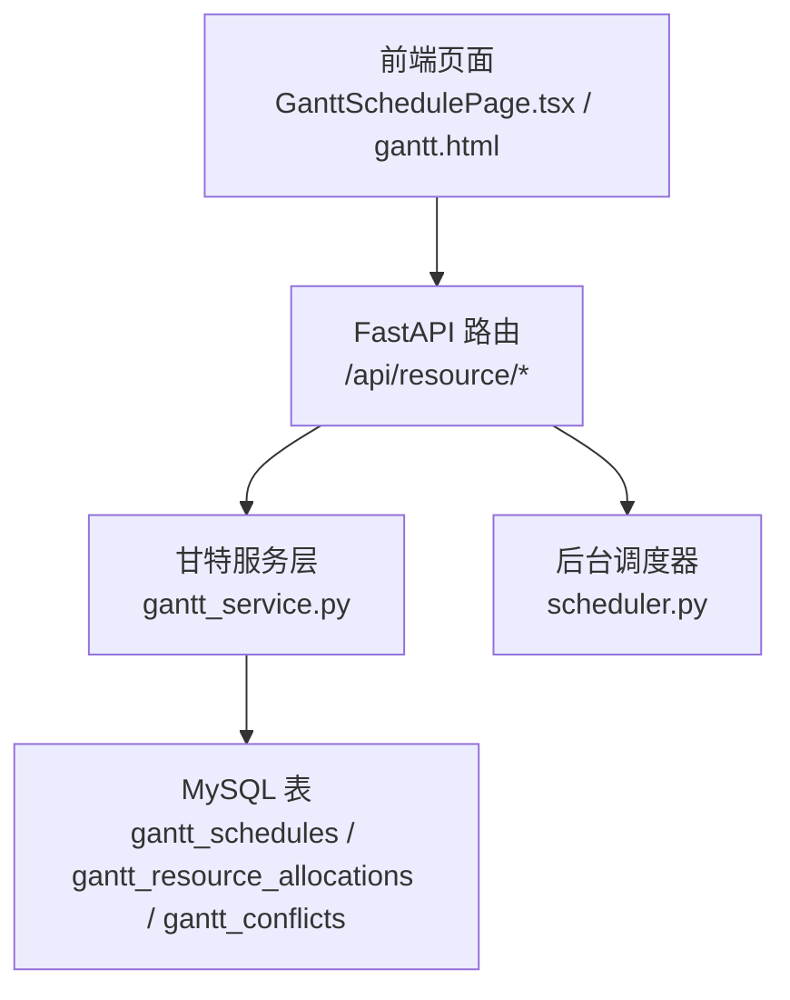
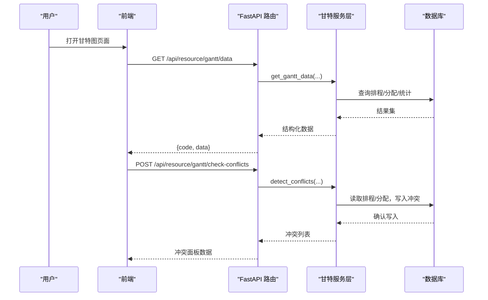
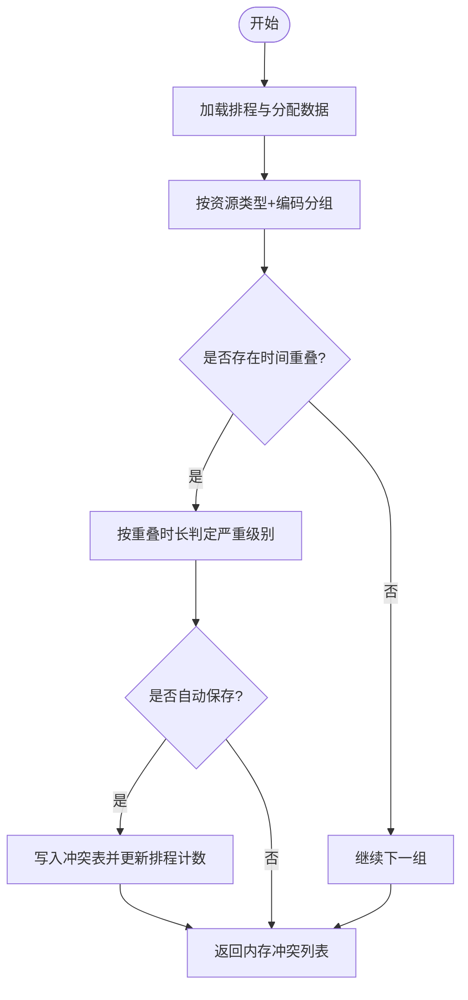
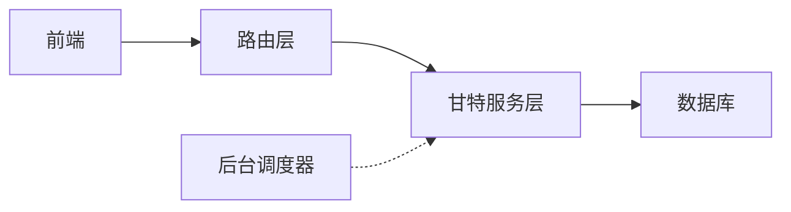

# 甘特图排程

<cite>
**本文引用的文件**
- [gantt_service.py](file://backend/modules/resource/services/gantt_service.py)
- [router.py](file://backend/modules/resource/router.py)
- [scheduler.py](file://backend/scheduling/scheduler.py)
- [resource_schema.sql](file://backend/sql/resource_schema.sql)
- [需求文档_V3_BFWS_CPSAT.md](file://需求文档_V3_BFWS_CPSAT.md)
- [GanttSchedulePage.tsx](file://webui_ref/client/src/pages/GanttSchedulePage/GanttSchedulePage.tsx)
- [gantt.html](file://demo/gantt.html)
</cite>

## 目录
1. [简介](#简介)
2. [项目结构](#项目结构)
3. [核心组件](#核心组件)
4. [架构总览](#架构总览)
5. [详细组件分析](#详细组件分析)
6. [依赖关系分析](#依赖关系分析)
7. [性能与容量优化](#性能与容量优化)
8. [故障排查指南](#故障排查指南)
9. [结论](#结论)
10. [附录：API 规范与前端交互](#附录api-规范与前端交互)

## 简介
本模块提供试制资源数智化管理系统中的“甘特图排程”能力，涵盖排程数据管理、资源冲突检测、关键路径计算、状态批量更新等后端服务，以及前端可视化与交互。系统同时规划了 BFWS（带时间窗的分支定界）+ CP-SAT 的智能排程求解方案，用于在复杂约束下生成全局可行的装配/调试/交付计划，并通过甘特图进行可视化呈现与人工微调。

## 项目结构
后端以 FastAPI 路由层暴露 REST API，业务逻辑集中在资源模块的服务层；数据库通过 SQL 脚本初始化表结构；前端包含 React 页面占位与一个可独立运行的 HTML Demo，用于演示甘特图展示、冲突面板、拖拽调整与本地冲突检测。

图表来源
- [router.py:1190-1422](file://backend/modules/resource/router.py#L1190-L1422)
- [gantt_service.py:176-1427](file://backend/modules/resource/services/gantt_service.py#L176-L1427)
- [resource_schema.sql:288-325](file://backend/sql/resource_schema.sql#L288-L325)
- [scheduler.py:16-196](file://backend/scheduling/scheduler.py#L16-L196)

章节来源
- [router.py:1190-1422](file://backend/modules/resource/router.py#L1190-L1422)
- [gantt_service.py:176-1427](file://backend/modules/resource/services/gantt_service.py#L176-L1427)
- [resource_schema.sql:288-325](file://backend/sql/resource_schema.sql#L288-L325)
- [scheduler.py:16-196](file://backend/scheduling/scheduler.py#L16-L196)

## 核心组件
- 甘特服务层：实现排程 CRUD、资源分配、冲突检测、关键路径计算、批量状态更新等。
- 路由层：将 HTTP 请求映射到服务方法，统一返回格式与错误处理。
- 数据库模型：定义排程、资源分配、冲突三类核心表及索引。
- 前端：React 页面占位 + HTML Demo，支持筛选、分页、冲突面板、拖拽调整、关键路径计算触发。
- 调度器：后台定时任务（当前用于爬虫自动同步），为后续排程自动化预留扩展点。

章节来源
- [gantt_service.py:176-1427](file://backend/modules/resource/services/gantt_service.py#L176-L1427)
- [router.py:1190-1422](file://backend/modules/resource/router.py#L1190-L1422)
- [resource_schema.sql:288-325](file://backend/sql/resource_schema.sql#L288-L325)
- [GanttSchedulePage.tsx:1-16](file://webui_ref/client/src/pages/GanttSchedulePage/GanttSchedulePage.tsx#L1-L16)
- [scheduler.py:16-196](file://backend/scheduling/scheduler.py#L16-L196)

## 架构总览
系统采用分层架构：前端通过 REST API 调用路由层，路由层委托服务层完成业务逻辑，服务层访问数据库并维护排程、资源分配与冲突记录。关键路径与冲突检测作为独立算法模块，可在 UI 触发或后台定时执行。BFWS + CP-SAT 的求解设计在需求文档中给出建模思路，当前代码已具备冲突检测与关键路径计算的工程化实现，可作为规则引擎与精确求解之间的桥梁。

图表来源
- [router.py:1190-1356](file://backend/modules/resource/router.py#L1190-L1356)
- [gantt_service.py:176-1076](file://backend/modules/resource/services/gantt_service.py#L176-L1076)

## 详细组件分析

### 甘特服务层（gantt_service.py）
- 排程数据管理
  - 创建/更新/删除排程，支持前置依赖、阶段、优先级、场地、约束日期等字段规范化与校验。
  - 进度自动计算：当未手动覆盖时，根据计划工时与实际工时计算百分比。
  - 详情查询：按 ID 或编号获取排程详情，附带资源分配与开放冲突。
- 资源分配
  - 单条/批量分配，关联排程与资源类型（设备、人员、区域、吊车、物料、其他）。
  - 分配列表支持按排程、资源类型/编码、状态筛选。
- 冲突检测（detect_conflicts）
  - 资源重叠：按资源类型+编码分组，两两比较时间段是否重叠，计算重叠小时数并判定严重级别。
  - 依赖错过：检查前置任务的结束时间是否晚于当前任务开始时间。
  - 截止风险：对未完成且超期的任务标记风险。
  - 同场地设备/区域重叠：同一装配场地的设备或区域在同一时段被多个任务占用。
  - 可选自动保存：将冲突写入 gantt_conflicts，并回写排程的 has_conflict/conflict_count。
- 关键路径计算（compute_critical_path）
  - 基于拓扑排序（Kahn）构建 ES/EF/LF/LS，计算松弛时间，标记 is_critical 与 slack_hours。
- 批量状态更新（batch_update_status）
  - 批量切换状态，自动填充实际开始/结束时间与进度。

图表来源
- [gantt_service.py:775-1076](file://backend/modules/resource/services/gantt_service.py#L775-L1076)

章节来源
- [gantt_service.py:100-1427](file://backend/modules/resource/services/gantt_service.py#L100-L1427)

### 路由层（router.py）
- 提供完整的甘特图相关 REST API：
  - 数据列表、统计、详情、CRUD、依赖设置、资源分配、冲突检测与处理、关键路径计算、批量状态更新。
- 统一响应格式与异常处理，便于前端集成。

章节来源
- [router.py:1078-1422](file://backend/modules/resource/router.py#L1078-L1422)

### 数据库模型（resource_schema.sql）
- 核心表：
  - gantt_schedules：排程主表，含计划/实际时间、工时、进度、前置依赖、关键路径标记等。
  - gantt_resource_allocations：资源分配明细，含资源类型/编码、起止时间、工时、数量、状态。
  - gantt_conflicts：冲突记录，含类型、严重级别、涉及排程、资源、重叠区间与建议、状态与解决信息。
- 索引：针对冲突类型、严重级别、状态、关联排程、资源、装配场地、检测时间建立索引，提升查询与筛选性能。

章节来源
- [resource_schema.sql:288-325](file://backend/sql/resource_schema.sql#L288-L325)

### 前端交互（GanttSchedulePage.tsx 与 gantt.html）
- React 页面占位：预留甘特图排程入口，后续可扩展为完整页面。
- HTML Demo：
  - 工具栏：日期范围选择、缩放切换、筛选。
  - 统计卡片：总数、进行中、已完成、关键路径数、开放冲突数等。
  - 冲突面板：展示开放冲突，支持忽略操作。
  - 本地冲突检测：基于内存数据进行简单重叠判断，辅助前端快速验证。
  - 关键路径计算：触发后刷新表格与统计。
  - 拖拽调整：支持在甘特图中拖拽任务条调整时间，随后保存至后端。

章节来源
- [GanttSchedulePage.tsx:1-16](file://webui_ref/client/src/pages/GanttSchedulePage/GanttSchedulePage.tsx#L1-L16)
- [gantt.html:1-200](file://demo/gantt.html#L1-L200)
- [gantt.html:11127-11384](file://demo/gantt.html#L11127-L11384)

### BFWS 与 CP-SAT 设计要点（需求文档）
- 目标：从启发式规则升级为数学精确排程，考虑阻塞传递、关键件到货约束、工位无缓冲等物理特性。
- 建模思路：
  - 决策变量：每个工件在每个工位的开始/结束时间与区间。
  - 约束：工序顺序、NoOverlap（工位独占）、关键件到达时间约束。
  - 目标：最小化最大完工时间与加权等待惩罚（结合关键件评分）。
- 与现有系统的衔接：
  - 当前冲突检测与关键路径计算可作为规则引擎与精确求解的中间层，支撑“快速模式（规则）/精确模式（CP-SAT）”的可切换策略。

章节来源
- [需求文档_V3_BFWS_CPSAT.md:1-496](file://需求文档_V3_BFWS_CPSAT.md#L1-L496)

## 依赖关系分析
- 路由层依赖服务层：所有甘特图 API 均委托 gantt_service.py 中的函数实现。
- 服务层依赖数据库：使用统一的 query_all/query_one/execute 接口访问 MySQL。
- 前端依赖路由层：通过 REST API 获取数据与提交变更。
- 调度器与排程：当前调度器用于爬虫自动同步，未来可扩展为定时触发冲突检测或关键路径计算。

图表来源
- [router.py:1190-1422](file://backend/modules/resource/router.py#L1190-L1422)
- [gantt_service.py:176-1427](file://backend/modules/resource/services/gantt_service.py#L176-L1427)
- [scheduler.py:16-196](file://backend/scheduling/scheduler.py#L16-L196)

章节来源
- [router.py:1190-1422](file://backend/modules/resource/router.py#L1190-L1422)
- [gantt_service.py:176-1427](file://backend/modules/resource/services/gantt_service.py#L176-L1427)
- [scheduler.py:16-196](file://backend/scheduling/scheduler.py#L16-L196)

## 性能与容量优化
- 查询优化
  - 分页与筛选：列表接口支持 page/page_size、task_type/status/priority/assembly_site/keyword/date_from/date_to 等条件，减少不必要的数据传输。
  - 索引利用：冲突表针对类型、严重级别、状态、关联排程、资源、装配场地、检测时间建立索引，加速筛选与排序。
- 冲突检测复杂度
  - 资源重叠检测按资源分组后进行两两比较，建议在生产环境限制检测范围（如仅指定装配场地）以降低 O(n^2) 开销。
- 关键路径计算
  - 拓扑排序线性复杂度，适合大规模任务图；建议在数据量较大时异步触发并缓存结果。
- 批量操作
  - 批量状态更新与批量资源分配减少数据库往返次数，提高吞吐。
- 前端交互优化
  - 本地冲突检测与关键路径计算用于即时反馈，减少服务器压力；拖拽调整后批量保存，降低频繁请求。

[本节为通用性能指导，不直接分析具体文件]

## 故障排查指南
- 冲突检测失败
  - 检查数据库连接与权限，确认 gantt_conflicts 表存在且有写入权限。
  - 查看日志输出，定位 SQL 错误或数据格式问题。
- 关键路径计算异常
  - 确认前置依赖无环（update_dependencies 已内置环检测），若报错需修正依赖关系。
  - 检查 plan_start_time/plan_end_time/plan_work_hours 是否为有效值。
- 排程更新失败
  - 校验必填字段与枚举值（任务类型、优先级、状态、阶段、装配场地）。
  - 若进度未自动更新，检查 progress_manual_override 标志。
- 前端显示异常
  - 确认 API 返回结构与前端期望一致（code/data/message）。
  - 冲突面板数据为空时，检查是否触发了冲突检测或筛选条件过严。

章节来源
- [gantt_service.py:553-605](file://backend/modules/resource/services/gantt_service.py#L553-L605)
- [gantt_service.py:1255-1372](file://backend/modules/resource/services/gantt_service.py#L1255-L1372)
- [router.py:1245-1422](file://backend/modules/resource/router.py#L1245-L1422)

## 结论
本模块已实现甘特图排程的核心功能：排程数据管理、资源分配、冲突检测、关键路径计算与批量状态更新，并提供完善的 REST API 与前端交互原型。BFWS + CP-SAT 的设计为未来引入精确求解提供了清晰路径，当前规则引擎可作为快速模式保障生产可用性。建议在生产环境中结合场景限制检测范围、启用异步计算与缓存，以提升性能与稳定性。

[本节为总结性内容，不直接分析具体文件]

## 附录：API 规范与前端交互

### 排程数据与统计
- 获取排程列表
  - 方法：GET
  - 路径：/api/resource/gantt/data
  - 参数：page, page_size, task_type, status, priority, assembly_site, keyword, only_critical, only_conflict, date_from, date_to
  - 返回：{code, message, data: {list, total, page, page_size}}
- 获取统计
  - 方法：GET
  - 路径：/api/resource/gantt/stats
  - 返回：{code, message, data: {total, pending, in_progress, completed, overdue, critical_path, conflicts_open, conflicts_critical, this_week_start, this_week_end, type_distribution, status_distribution, site_distribution, phase_distribution, weekly_trend}}

章节来源
- [router.py:1190-1228](file://backend/modules/resource/router.py#L1190-L1228)
- [gantt_service.py:176-335](file://backend/modules/resource/services/gantt_service.py#L176-L335)

### 排程 CRUD 与依赖
- 新建排程
  - 方法：POST
  - 路径：/api/resource/gantt/schedules
  - 请求体：ScheduleCreateRequest
  - 返回：{code, message, data: 排程详情}
- 更新排程
  - 方法：PUT
  - 路径：/api/resource/gantt/schedules/{schedule_id_or_code}
  - 请求体：ScheduleUpdateRequest
  - 返回：{code, message, data: 排程详情}
- 删除排程
  - 方法：DELETE
  - 路径：/api/resource/gantt/schedules/{schedule_id_or_code}
  - 返回：{code, message, data: {deleted, schedule_code}}
- 设置前置依赖
  - 方法：PUT
  - 路径：/api/resource/gantt/schedules/{schedule_id_or_code}/dependencies
  - 请求体：ScheduleDependenciesRequest
  - 返回：{code, message, data: 排程详情}

章节来源
- [router.py:1245-1295](file://backend/modules/resource/router.py#L1245-L1295)
- [gantt_service.py:396-605](file://backend/modules/resource/services/gantt_service.py#L396-L605)

### 资源分配
- 新增分配
  - 方法：POST
  - 路径：/api/resource/gantt/allocations
  - 请求体：AllocationCreateRequest
  - 返回：{code, message, data: 分配详情}
- 批量分配
  - 方法：POST
  - 路径：/api/resource/gantt/allocations/batch
  - 请求体：BatchAllocationRequest
  - 返回：{code, message, data: 分配列表}
- 删除分配
  - 方法：DELETE
  - 路径：/api/resource/gantt/allocations/{allocation_id}
  - 返回：{code, message, data: {deleted}}
- 查询分配
  - 方法：GET
  - 路径：/api/resource/gantt/allocations
  - 参数：schedule_id_or_code, resource_type, resource_code, status
  - 返回：{code, message, data: 分配列表}

章节来源
- [router.py:1297-1345](file://backend/modules/resource/router.py#L1297-L1345)
- [gantt_service.py:608-724](file://backend/modules/resource/services/gantt_service.py#L608-L724)

### 冲突检测与处理
- 触发冲突检测
  - 方法：POST
  - 路径：/api/resource/gantt/check-conflicts
  - 请求体：ConflictCheckRequest（assembly_site, auto_save）
  - 返回：{code, message, data: {count, conflicts}}
- 查询冲突列表
  - 方法：GET
  - 路径：/api/resource/gantt/conflicts
  - 参数：conflict_type, severity, status, assembly_site, schedule_id, page, page_size
  - 返回：{code, message, data: {list, total, page, page_size}}
- 解决冲突
  - 方法：PUT
  - 路径：/api/resource/gantt/conflicts/{conflict_id_or_code}/resolve
  - 请求体：ConflictResolveRequest
  - 返回：{code, message, data: 冲突详情}
- 忽略冲突
  - 方法：PUT
  - 路径：/api/resource/gantt/conflicts/{conflict_id_or_code}/ignore
  - 请求体：ConflictIgnoreRequest
  - 返回：{code, message, data: 冲突详情}

章节来源
- [router.py:1347-1397](file://backend/modules/resource/router.py#L1347-L1397)
- [gantt_service.py:775-1252](file://backend/modules/resource/services/gantt_service.py#L775-L1252)

### 关键路径与批量状态
- 计算关键路径
  - 方法：POST
  - 路径：/api/resource/gantt/compute-critical
  - 返回：{code, message, data: {critical_count, updated_count, critical_ids}}
- 批量状态更新
  - 方法：POST
  - 路径：/api/resource/gantt/batch-status
  - 请求体：ScheduleBatchStatusRequest
  - 返回：{code, message, data: {updated, status}}

章节来源
- [router.py:1399-1419](file://backend/modules/resource/router.py#L1399-L1419)
- [gantt_service.py:1255-1427](file://backend/modules/resource/services/gantt_service.py#L1255-L1427)

### 前端交互要点
- 数据获取：调用 /gantt/data 与 /gantt/stats 渲染看板与甘特图。
- 冲突面板：调用 /gantt/check-conflicts 触发检测，/gantt/conflicts 获取列表，支持 ignore/resolve。
- 拖拽调整：前端修改 plan_start_time/plan_end_time/plan_work_hours 后，调用 /gantt/schedules/{id} 保存。
- 关键路径：调用 /gantt/compute-critical 后刷新视图。

章节来源
- [gantt.html:11127-11384](file://demo/gantt.html#L11127-L11384)
- [router.py:1190-1422](file://backend/modules/resource/router.py#L1190-L1422)