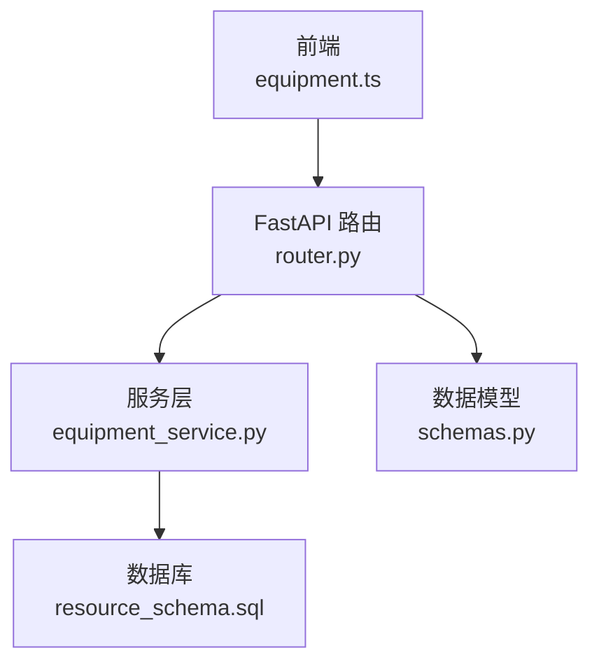
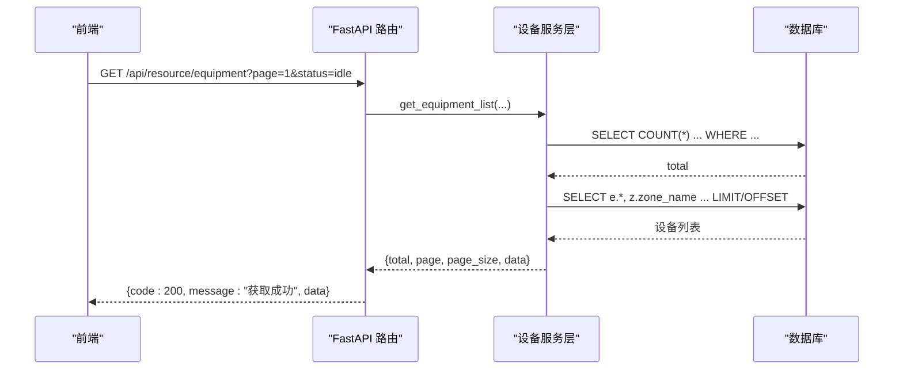
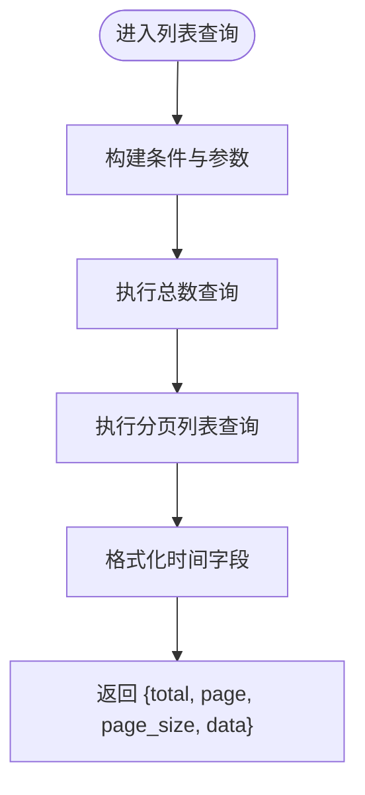
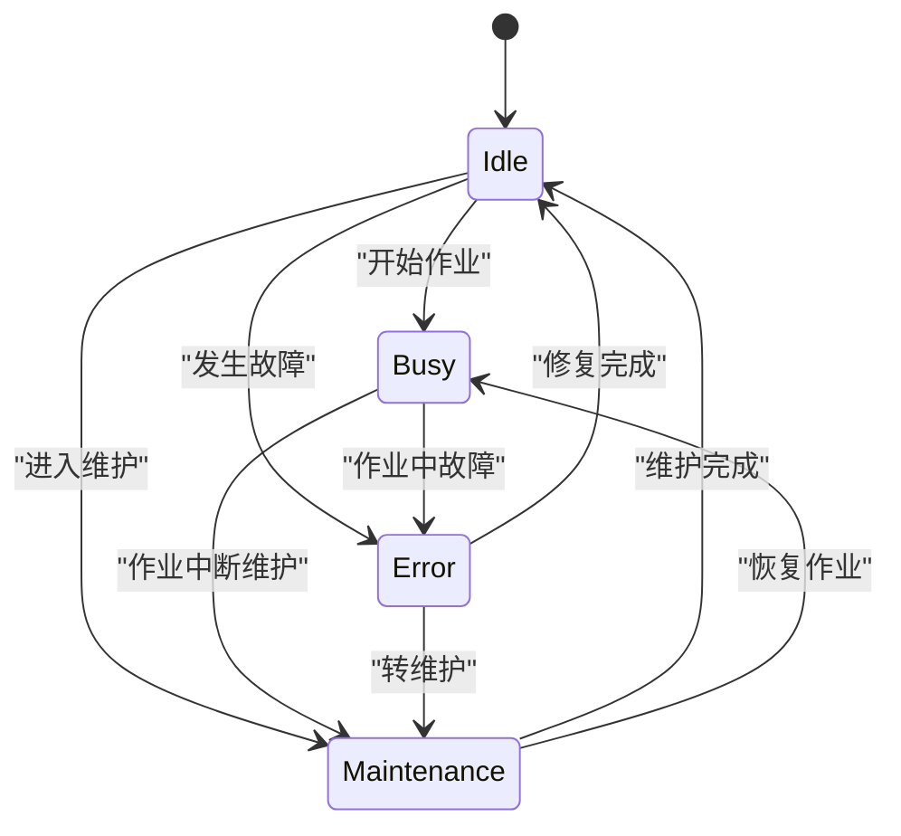
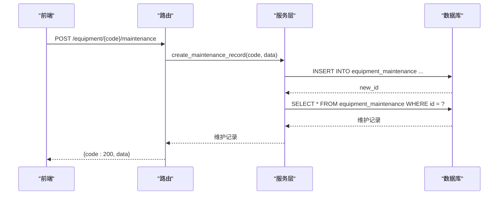
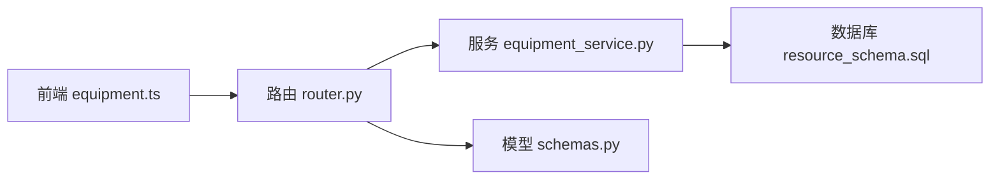

# 设备管理

<cite>
**本文引用的文件**
- [backend/modules/resource/services/equipment_service.py](file://backend/modules/resource/services/equipment_service.py)
- [backend/modules/resource/router.py](file://backend/modules/resource/router.py)
- [backend/modules/resource/schemas.py](file://backend/modules/resource/schemas.py)
- [backend/sql/resource_schema.sql](file://backend/sql/resource_schema.sql)
- [webui_ref/client/src/api/resource/equipment.ts](file://webui_ref/client/src/api/resource/equipment.ts)
</cite>

## 目录
1. [简介](#简介)
2. [项目结构](#项目结构)
3. [核心组件](#核心组件)
4. [架构总览](#架构总览)
5. [详细组件分析](#详细组件分析)
6. [依赖关系分析](#依赖关系分析)
7. [性能考虑](#性能考虑)
8. [故障排查指南](#故障排查指南)
9. [结论](#结论)
10. [附录：API 接口规范与使用示例](#附录api-接口规范与使用示例)

## 简介
本模块提供设备台账的完整管理能力，涵盖设备的增删改查、状态管理（空闲/占用/故障/维护）、维护记录管理、设备统计数据获取，以及与区域、任务之间的关联关系和数据一致性保障。后端采用 FastAPI 路由 + 服务层 + 数据库直访的分层设计；前端通过 TypeScript API 封装调用。

## 项目结构
设备管理相关代码主要位于 backend/modules/resource 下，包含路由、服务层、数据模型定义；数据库表结构在 sql 目录下；前端 API 封装在 webui_ref/client/src/api/resource/equipment.ts。

图表来源
- [backend/modules/resource/router.py:58-302](file://backend/modules/resource/router.py#L58-L302)
- [backend/modules/resource/services/equipment_service.py:11-495](file://backend/modules/resource/services/equipment_service.py#L11-L495)
- [backend/sql/resource_schema.sql:13-199](file://backend/sql/resource_schema.sql#L13-L199)
- [backend/modules/resource/schemas.py:14-47](file://backend/modules/resource/schemas.py#L14-L47)
- [webui_ref/client/src/api/resource/equipment.ts:116-216](file://webui_ref/client/src/api/resource/equipment.ts#L116-L216)

章节来源
- [backend/modules/resource/router.py:1-800](file://backend/modules/resource/router.py#L1-L800)
- [backend/modules/resource/services/equipment_service.py:1-495](file://backend/modules/resource/services/equipment_service.py#L1-L495)
- [backend/sql/resource_schema.sql:1-326](file://backend/sql/resource_schema.sql#L1-L326)
- [backend/modules/resource/schemas.py:1-224](file://backend/modules/resource/schemas.py#L1-L224)
- [webui_ref/client/src/api/resource/equipment.ts:1-254](file://webui_ref/client/src/api/resource/equipment.ts#L1-L254)

## 核心组件
- 路由层（router.py）：暴露 RESTful 接口，负责参数校验、异常转换与统一响应格式包装。
- 服务层（equipment_service.py）：实现设备 CRUD、状态流转、维护记录管理、统计查询等核心业务逻辑。
- 数据模型（schemas.py）：定义 Pydantic 请求/响应模型，用于前后端契约与类型约束。
- 数据库（resource_schema.sql）：定义 equipment、zones、tasks、equipment_maintenance 等表结构与索引。
- 前端 API（equipment.ts）：封装设备与维护相关的 HTTP 调用与类型定义。

章节来源
- [backend/modules/resource/router.py:17-45](file://backend/modules/resource/router.py#L17-L45)
- [backend/modules/resource/services/equipment_service.py:11-495](file://backend/modules/resource/services/equipment_service.py#L11-L495)
- [backend/modules/resource/schemas.py:14-47](file://backend/modules/resource/schemas.py#L14-L47)
- [backend/sql/resource_schema.sql:13-199](file://backend/sql/resource_schema.sql#L13-L199)
- [webui_ref/client/src/api/resource/equipment.ts:8-114](file://webui_ref/client/src/api/resource/equipment.ts#L8-L114)

## 架构总览
设备管理采用“路由 -> 服务 -> 数据库”的分层架构。路由接收请求并委托服务层处理；服务层进行业务校验、事务性操作（如级联删除）和 SQL 查询；数据库通过预编译语句与索引优化查询性能。

图表来源
- [backend/modules/resource/router.py:58-86](file://backend/modules/resource/router.py#L58-L86)
- [backend/modules/resource/services/equipment_service.py:11-103](file://backend/modules/resource/services/equipment_service.py#L11-L103)
- [backend/sql/resource_schema.sql:13-28](file://backend/sql/resource_schema.sql#L13-L28)

## 详细组件分析

### 设备列表查询（筛选、分页、搜索）
- 支持按状态、区域编码、设备类型筛选，以及关键词模糊搜索（设备编号/名称）。
- 返回分页信息（total/page/page_size）与设备列表，自动将时间字段格式化为字符串。
- 通过 LEFT JOIN zones 获取区域名称，便于展示。

图表来源
- [backend/modules/resource/services/equipment_service.py:11-103](file://backend/modules/resource/services/equipment_service.py#L11-L103)

章节来源
- [backend/modules/resource/services/equipment_service.py:11-103](file://backend/modules/resource/services/equipment_service.py#L11-L103)
- [backend/modules/resource/router.py:58-86](file://backend/modules/resource/router.py#L58-L86)

### 设备详情获取
- 根据设备编号查询设备详情，同时关联当前任务名称与区域名称。
- 若不存在则返回 404。

章节来源
- [backend/modules/resource/services/equipment_service.py:106-137](file://backend/modules/resource/services/equipment_service.py#L106-L137)
- [backend/modules/resource/router.py:89-109](file://backend/modules/resource/router.py#L89-L109)

### 设备创建
- 校验设备编号唯一性与区域存在性。
- 插入设备记录，默认状态为 idle。
- 返回新创建的设备详情。

章节来源
- [backend/modules/resource/services/equipment_service.py:140-178](file://backend/modules/resource/services/equipment_service.py#L140-L178)
- [backend/modules/resource/router.py:112-129](file://backend/modules/resource/router.py#L112-L129)

### 设备更新
- 校验设备存在性。
- 动态构建更新字段，支持更新名称、类型、区域编码（需校验区域存在）。
- 返回更新后的设备详情。

章节来源
- [backend/modules/resource/services/equipment_service.py:181-228](file://backend/modules/resource/services/equipment_service.py#L181-L228)
- [backend/modules/resource/router.py:132-154](file://backend/modules/resource/router.py#L132-L154)

### 设备删除
- 校验设备存在性。
- 若存在维护记录，先级联删除维护记录，再删除设备。
- 返回删除成功。

章节来源
- [backend/modules/resource/services/equipment_service.py:231-259](file://backend/modules/resource/services/equipment_service.py#L231-L259)
- [backend/modules/resource/router.py:157-175](file://backend/modules/resource/router.py#L157-L175)

### 设备状态管理
- 支持状态值：idle、busy、error、maintenance。
- 可记录操作员信息。
- 更新后返回最新设备详情。

图表来源
- [backend/modules/resource/services/equipment_service.py:262-301](file://backend/modules/resource/services/equipment_service.py#L262-L301)
- [backend/sql/resource_schema.sql:13-28](file://backend/sql/resource_schema.sql#L13-L28)

章节来源
- [backend/modules/resource/services/equipment_service.py:262-301](file://backend/modules/resource/services/equipment_service.py#L262-L301)
- [backend/modules/resource/router.py:178-201](file://backend/modules/resource/router.py#L178-L201)

### 设备统计数据
- 按状态统计设备数量，计算总数，返回分布情况。
- 供驾驶舱/看板使用。

章节来源
- [backend/modules/resource/services/equipment_service.py:304-335](file://backend/modules/resource/services/equipment_service.py#L304-L335)
- [backend/modules/resource/router.py:204-218](file://backend/modules/resource/router.py#L204-L218)

### 维护记录管理
- 列表查询：按设备编号分页查询，支持状态筛选。
- 创建记录：校验设备存在性，插入维护记录，默认状态 in_progress。
- 更新状态：支持进行中、已完成、已取消；完成时可自动或手动设置结束时间。

图表来源
- [backend/modules/resource/router.py:248-273](file://backend/modules/resource/router.py#L248-L273)
- [backend/modules/resource/services/equipment_service.py:396-439](file://backend/modules/resource/services/equipment_service.py#L396-L439)
- [backend/sql/resource_schema.sql:184-199](file://backend/sql/resource_schema.sql#L184-L199)

章节来源
- [backend/modules/resource/services/equipment_service.py:338-495](file://backend/modules/resource/services/equipment_service.py#L338-L495)
- [backend/modules/resource/router.py:221-302](file://backend/modules/resource/router.py#L221-L302)

### 设备与区域、任务的关联关系与一致性
- 设备与区域：通过 zone_code 外键关联 zones 表，列表与详情查询时 LEFT JOIN 获取区域名称。
- 设备与任务：设备表包含 current_task_id，详情查询时 LEFT JOIN tasks 获取当前任务名称。
- 删除一致性：删除设备前会检查并级联删除其维护记录，避免孤儿数据。

章节来源
- [backend/modules/resource/services/equipment_service.py:106-137](file://backend/modules/resource/services/equipment_service.py#L106-L137)
- [backend/modules/resource/services/equipment_service.py:231-259](file://backend/modules/resource/services/equipment_service.py#L231-L259)
- [backend/sql/resource_schema.sql:13-28](file://backend/sql/resource_schema.sql#L13-L28)
- [backend/sql/resource_schema.sql:69-109](file://backend/sql/resource_schema.sql#L69-L109)
- [backend/sql/resource_schema.sql:184-199](file://backend/sql/resource_schema.sql#L184-L199)

## 依赖关系分析
- 路由依赖服务层方法，服务层依赖数据库访问函数与日志。
- 前端通过 TypeScript 接口与后端约定一致的请求/响应结构。
- 数据库表间通过外键与索引保证查询效率与数据一致性。

图表来源
- [webui_ref/client/src/api/resource/equipment.ts:116-216](file://webui_ref/client/src/api/resource/equipment.ts#L116-L216)
- [backend/modules/resource/router.py:58-302](file://backend/modules/resource/router.py#L58-L302)
- [backend/modules/resource/services/equipment_service.py:11-495](file://backend/modules/resource/services/equipment_service.py#L11-L495)
- [backend/sql/resource_schema.sql:13-199](file://backend/sql/resource_schema.sql#L13-L199)
- [backend/modules/resource/schemas.py:14-47](file://backend/modules/resource/schemas.py#L14-L47)

章节来源
- [backend/modules/resource/router.py:58-302](file://backend/modules/resource/router.py#L58-L302)
- [backend/modules/resource/services/equipment_service.py:11-495](file://backend/modules/resource/services/equipment_service.py#L11-L495)
- [backend/sql/resource_schema.sql:13-199](file://backend/sql/resource_schema.sql#L13-L199)
- [backend/modules/resource/schemas.py:14-47](file://backend/modules/resource/schemas.py#L14-L47)
- [webui_ref/client/src/api/resource/equipment.ts:116-216](file://webui_ref/client/src/api/resource/equipment.ts#L116-L216)

## 性能考虑
- 列表查询使用分页（LIMIT/OFFSET），减少单次返回数据量。
- 常用字段建立索引：设备状态、区域编码、设备类型、维护记录的设备编号、类型、状态等。
- 时间字段在服务层统一格式化，避免前端重复处理。
- 建议对高频筛选字段增加复合索引以进一步优化查询。

[本节为通用性能建议，不直接分析具体文件]

## 故障排查指南
- 404 错误：设备或维护记录不存在时，路由层抛出 404。
- 400 错误：参数校验失败（如无效状态、重复设备编号、区域不存在等）。
- 500 错误：服务层或数据库异常，统一捕获并返回错误详情。
- 常见排查点：
  - 确认设备编号是否存在且唯一。
  - 确认区域编码有效。
  - 维护记录状态是否合法。
  - 数据库连接与权限是否正常。

章节来源
- [backend/modules/resource/router.py:89-109](file://backend/modules/resource/router.py#L89-L109)
- [backend/modules/resource/router.py:112-129](file://backend/modules/resource/router.py#L112-L129)
- [backend/modules/resource/router.py:132-154](file://backend/modules/resource/router.py#L132-L154)
- [backend/modules/resource/router.py:157-175](file://backend/modules/resource/router.py#L157-L175)
- [backend/modules/resource/router.py:178-201](file://backend/modules/resource/router.py#L178-L201)
- [backend/modules/resource/router.py:221-302](file://backend/modules/resource/router.py#L221-L302)

## 结论
设备管理模块提供了完整的设备生命周期管理能力，包括 CRUD、状态流转、维护记录、统计查询以及与区域、任务的关联。通过分层架构与严格的数据校验，保证了系统的可扩展性与数据一致性。前端通过 TypeScript 类型化 API 封装，提升了开发体验与调用安全性。

[本节为总结性内容，不直接分析具体文件]

## 附录：API 接口规范与使用示例

### 设备列表
- 方法：GET
- 路径：/api/resource/equipment
- 查询参数：
  - page: 页码（默认 1）
  - page_size: 每页数量（默认 20，最大 100）
  - status: 状态筛选（idle/busy/error/maintenance）
  - zone_code: 区域编码
  - equipment_type: 设备类型（lift/island/station）
  - keyword: 搜索关键词（设备编号/名称）
- 响应：
  - code: 200
  - message: "获取成功"
  - data: { total, page, page_size, data: 设备列表 }

章节来源
- [backend/modules/resource/router.py:58-86](file://backend/modules/resource/router.py#L58-L86)
- [backend/modules/resource/services/equipment_service.py:11-103](file://backend/modules/resource/services/equipment_service.py#L11-L103)
- [webui_ref/client/src/api/resource/equipment.ts:116-130](file://webui_ref/client/src/api/resource/equipment.ts#L116-L130)

### 设备详情
- 方法：GET
- 路径：/api/resource/equipment/{equipment_code}
- 响应：
  - code: 200
  - message: "获取成功"
  - data: 设备详情（含区域名称、当前任务名称）

章节来源
- [backend/modules/resource/router.py:89-109](file://backend/modules/resource/router.py#L89-L109)
- [backend/modules/resource/services/equipment_service.py:106-137](file://backend/modules/resource/services/equipment_service.py#L106-L137)
- [webui_ref/client/src/api/resource/equipment.ts:132-138](file://webui_ref/client/src/api/resource/equipment.ts#L132-L138)

### 创建设备
- 方法：POST
- 路径：/api/resource/equipment
- 请求体：
  - equipment_code: 设备编号（必填）
  - equipment_name: 设备名称（必填）
  - equipment_type: 设备类型（必填）
  - zone_code: 区域编码（必填）
  - status: 初始状态（可选，默认 idle）
- 响应：
  - code: 200
  - message: "创建设备成功"
  - data: 新设备详情

章节来源
- [backend/modules/resource/router.py:112-129](file://backend/modules/resource/router.py#L112-L129)
- [backend/modules/resource/services/equipment_service.py:140-178](file://backend/modules/resource/services/equipment_service.py#L140-L178)
- [webui_ref/client/src/api/resource/equipment.ts:140-146](file://webui_ref/client/src/api/resource/equipment.ts#L140-L146)

### 更新设备
- 方法：PUT
- 路径：/api/resource/equipment/{equipment_code}
- 请求体：
  - equipment_name: 可选
  - equipment_type: 可选
  - zone_code: 可选（需存在）
- 响应：
  - code: 200
  - message: "更新成功"
  - data: 更新后的设备详情

章节来源
- [backend/modules/resource/router.py:132-154](file://backend/modules/resource/router.py#L132-L154)
- [backend/modules/resource/services/equipment_service.py:181-228](file://backend/modules/resource/services/equipment_service.py#L181-L228)
- [webui_ref/client/src/api/resource/equipment.ts:148-154](file://webui_ref/client/src/api/resource/equipment.ts#L148-L154)

### 删除设备
- 方法：DELETE
- 路径：/api/resource/equipment/{equipment_code}
- 响应：
  - code: 200
  - message: "删除成功"
  - data: null

章节来源
- [backend/modules/resource/router.py:157-175](file://backend/modules/resource/router.py#L157-L175)
- [backend/modules/resource/services/equipment_service.py:231-259](file://backend/modules/resource/services/equipment_service.py#L231-L259)
- [webui_ref/client/src/api/resource/equipment.ts:156-162](file://webui_ref/client/src/api/resource/equipment.ts#L156-L162)

### 更新设备状态
- 方法：PUT
- 路径：/api/resource/equipment/{equipment_code}/status
- 请求体：
  - status: 目标状态（idle/busy/error/maintenance）
  - operator: 操作员（可选）
- 响应：
  - code: 200
  - message: "状态更新成功"
  - data: 更新后的设备详情

章节来源
- [backend/modules/resource/router.py:178-201](file://backend/modules/resource/router.py#L178-L201)
- [backend/modules/resource/services/equipment_service.py:262-301](file://backend/modules/resource/services/equipment_service.py#L262-L301)
- [webui_ref/client/src/api/resource/equipment.ts:164-170](file://webui_ref/client/src/api/resource/equipment.ts#L164-L170)

### 设备统计数据
- 方法：GET
- 路径：/api/resource/equipment/stats
- 响应：
  - code: 200
  - message: "获取成功"
  - data: { total, idle, busy, error, maintenance, status_distribution }

章节来源
- [backend/modules/resource/router.py:204-218](file://backend/modules/resource/router.py#L204-L218)
- [backend/modules/resource/services/equipment_service.py:304-335](file://backend/modules/resource/services/equipment_service.py#L304-L335)
- [webui_ref/client/src/api/resource/equipment.ts:172-178](file://webui_ref/client/src/api/resource/equipment.ts#L172-L178)

### 维护记录列表
- 方法：GET
- 路径：/api/resource/equipment/{equipment_code}/maintenance
- 查询参数：
  - page: 页码（默认 1）
  - page_size: 每页数量（默认 20，最大 100）
  - status: 状态筛选（in_progress/completed/cancelled）
- 响应：
  - code: 200
  - message: "获取成功"
  - data: { total, page, page_size, data: 维护记录列表 }

章节来源
- [backend/modules/resource/router.py:221-245](file://backend/modules/resource/router.py#L221-L245)
- [backend/modules/resource/services/equipment_service.py:338-393](file://backend/modules/resource/services/equipment_service.py#L338-L393)
- [webui_ref/client/src/api/resource/equipment.ts:180-194](file://webui_ref/client/src/api/resource/equipment.ts#L180-L194)

### 新增维护记录
- 方法：POST
- 路径：/api/resource/equipment/{equipment_code}/maintenance
- 请求体：
  - maintenance_type: 维护类型（routine/repair/inspection）
  - start_time: 开始时间（必填）
  - end_time: 结束时间（可选）
  - operator: 维护人员（可选）
  - description: 描述（可选）
  - status: 状态（可选，默认 in_progress）
- 响应：
  - code: 200
  - message: "创建维护记录成功"
  - data: 新维护记录

章节来源
- [backend/modules/resource/router.py:248-273](file://backend/modules/resource/router.py#L248-L273)
- [backend/modules/resource/services/equipment_service.py:396-439](file://backend/modules/resource/services/equipment_service.py#L396-L439)
- [webui_ref/client/src/api/resource/equipment.ts:196-205](file://webui_ref/client/src/api/resource/equipment.ts#L196-L205)

### 更新维护记录状态
- 方法：PUT
- 路径：/api/resource/equipment/maintenance/{maintenance_id}/status
- 请求体：
  - status: 状态（in_progress/completed/cancelled）
  - end_time: 结束时间（可选，完成时可自动填充）
- 响应：
  - code: 200
  - message: "更新成功"
  - data: 更新后的维护记录

章节来源
- [backend/modules/resource/router.py:276-302](file://backend/modules/resource/router.py#L276-L302)
- [backend/modules/resource/services/equipment_service.py:442-495](file://backend/modules/resource/services/equipment_service.py#L442-L495)
- [webui_ref/client/src/api/resource/equipment.ts:207-216](file://webui_ref/client/src/api/resource/equipment.ts#L207-L216)